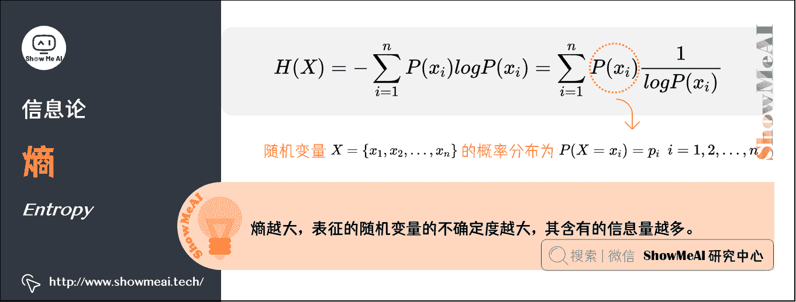
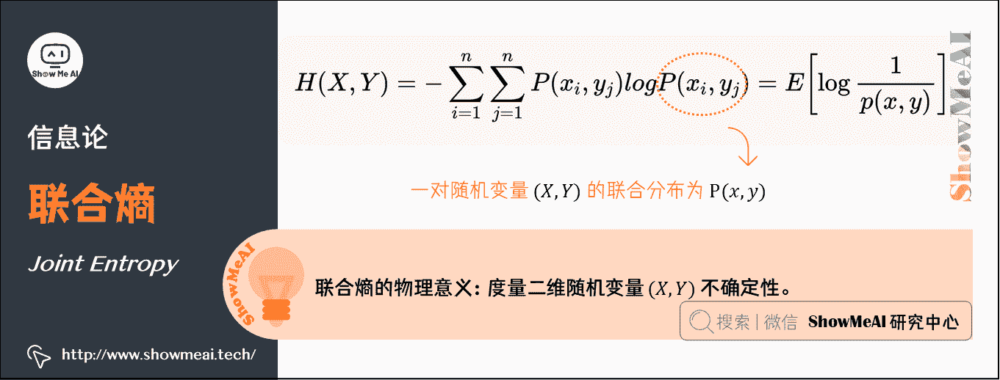
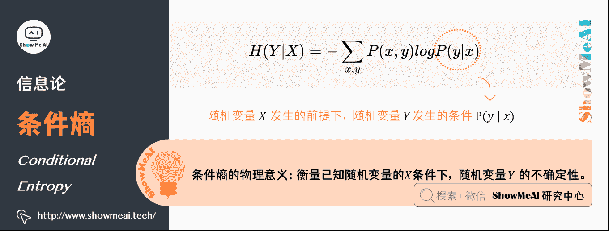
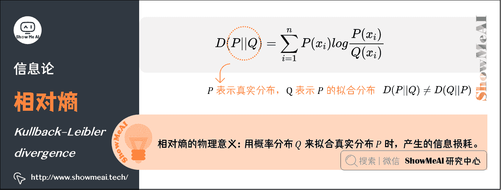
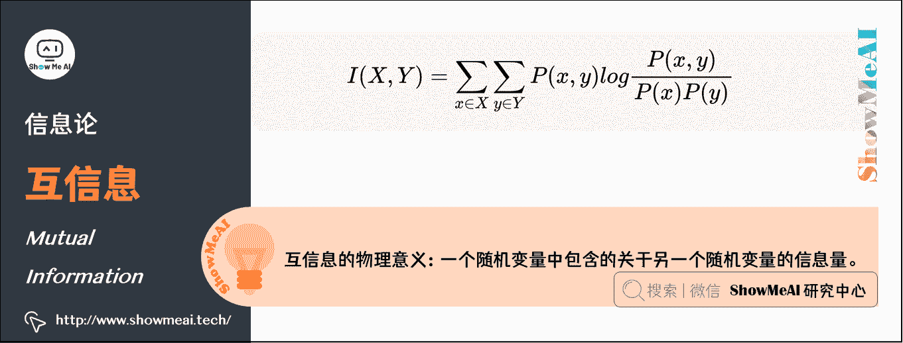
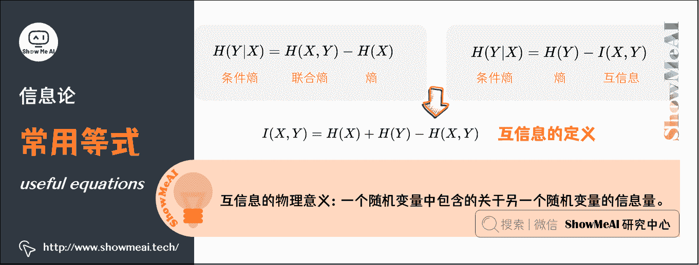

# 图解 AI 数学基础 | 信息论

> 原文：[`blog.csdn.net/ShowMeAI/article/details/123123570`](https://blog.csdn.net/ShowMeAI/article/details/123123570)

作者：[韩信子](https://github.com/HanXinzi-AI)@[ShowMeAI](http://showmeai.tech/)
[教程地址](http://www.showmeai.tech/tutorials/83)：[`www.showmeai.tech/tutorials/83`](http://www.showmeai.tech/tutorials/83)
[本文地址](http://www.showmeai.tech/article-detail/164)：[`www.showmeai.tech/article-detail/164`](http://www.showmeai.tech/article-detail/164)
**声明：版权所有，转载请联系平台与作者并注明出处**

* * *

**信息论是运用概率论与数理统计的方法研究信息、信息熵、通信系统、数据传输、密码学、数据压缩等问题的应用数学学科**。信息论中包含的知识和概念在机器学习中也有应用，典型的例子是其核心思想『熵』的应用。

例如，**决策树模型 ID3、C4.5 中是利用信息增益来确定划分特征而逐步生长和构建决策树的**；其中，信息增益就是基于信息论中的熵。

# 1.熵（Entropy）

熵是 1854 年由克劳休斯提出的一个用来度量体系混乱程度的单位，并阐述了热力学第二定律熵增原理：在孤立系统中，体系与环境没有能量交换，体系总是自发的向混乱度增大的方向变化，使整个系统的熵值越来越大。

> **熵越大，表征的随机变量的不确定度越大，其含有的信息量越多**。

随机变量 X X X 可能的取值为 { x 1 , x 2 , … , x n } \left\{ x_{1},x_{2} ,\dots ,x_{n} \right\} {x1​,x2​,…,xn​}，其概率分布为 P ( X = x i ) = p i P\left( X=x_{i} \right) =p_{i} P(X=xi​)=pi​， i = 1 , 2 , … , n i = 1, 2, \dots, n i=1,2,…,n，则随机变量 X X X 的熵定义为 H ( X ) H(X) H(X)：

H ( X ) = − ∑ i = 1 n P ( x i ) l o g P ( x i ) = ∑ i = 1 n P ( x i ) 1 l o g P ( x i ) H\left( X \right) =-\sum_{i=1}^{n}{P\left( x_{i} \right) logP\left( x_{i} \right) } =\sum_{i=1}^{n}{P\left( x_{i} \right) \frac{1}{logP\left( x_{i} \right) } } H(X)=−i=1∑n​P(xi​)logP(xi​)=i=1∑n​P(xi​)logP(xi​)1​

# 2.联合熵（Joint Entropy ）

联合熵，就是度量一个联合分布的随机系统的不确定度。分布为 P ( x , y ) P(x,y) P(x,y)的一对随机变量 ( X , Y ) (X,Y) (X,Y)，其联合熵定义为：

H ( X , Y ) = − ∑ i = 1 n ∑ j = 1 n P ( x i , y j ) l o g P ( x i , y j ) = E [ log ⁡ 1 p ( x , y ) ] H\left( X,Y \right) =-\sum_{i=1}^{n}{\sum_{j=1}^{n}{P\left( x_{i} ,y_{j} \right)} logP\left( x_{i},y_{j} \right) } =E\left[ \log\frac{1}{p(x,y)} \right] H(X,Y)=−i=1∑n​j=1∑n​P(xi​,yj​)logP(xi​,yj​)=E[logp(x,y)1​]

**联合熵的物理意义**，是观察一个多随机变量的随机系统获得的信息量，是对二维随机变量 ( X , Y ) (X,Y) (X,Y)不确定性的度量。

# 3.条件熵（Conditional Entropy）

Y Y Y 的条件熵是指『在随机变量 X X X 发生的前提下，随机变量 Y Y Y 发生新带来的熵』，用 H ( Y ∣ X ) H(Y | X) H(Y∣X)表示：

H ( Y ∣ X ) = − ∑ x , y P ( x , y ) l o g P ( y ∣ x ) H\left(Y|X \right) =-\sum_{x,y}^{}{P\left( x,y \right) logP\left( y|x \right) } H(Y∣X)=−x,y∑​P(x,y)logP(y∣x)

**条件熵的物理意义**，在得知某一确定信息的基础上获取另外一个信息时所获得的信息量，用来衡量在已知随机变量的 X X X 条件下，随机变量 Y Y Y 的不确定性。

# 4.相对熵（Kullback–Leibler divergence）

相对熵在信息论中用来描述两个概率分布差异的熵，叫作 KL 散度、相对熵、互熵、交叉熵、信息增益。对于一个离散随机变量的两个概率分布 P P P 和 Q Q Q 来说，它们的相对熵定义为：

D ( P ∣ ∣ Q ) = ∑ i = 1 n P ( x i ) l o g P ( x i ) Q ( x i ) D\left( P||Q \right) =\sum_{i=1}^{n}{P\left( x_{i} \right) log\frac{P\left( x_{i} \right) }{Q\left( x_{i} \right) } } D(P∣∣Q)=i=1∑n​P(xi​)logQ(xi​)P(xi​)​

注意：公式中 P P P 表示真实分布， Q Q Q 表示 P P P 的拟合分布， D ( P ∣ ∣ Q ) ≠ D ( Q ∣ ∣ P ) D(P||Q) ≠ D(Q||P) D(P∣∣Q)​=D(Q∣∣P)

相对熵表示当用概率分布 Q Q Q 来拟合真实分布 P P P 时，产生的信息损耗。

# 5.互信息（Mutual Information）

互信息是信息论里一种有用的信息度量方式，它可以看成是一个随机变量中包含的关于另一个随机变量的信息量，或者说是一个随机变量由于已知另一个随机变量而减少的不肯定性。

互信息的计算方式定义如下：

I ( X , Y ) = ∑ x ∈ X ∑ y ∈ Y P ( x , y ) l o g P ( x , y ) P ( x ) P ( y ) I\left( X,Y \right) =\sum_{x\in X}^{}{\sum_{y\in Y}^{}{P\left( x,y \right) } log\frac{P\left( x,y \right) }{P\left( x \right) P\left( y \right) } } I(X,Y)=x∈X∑​y∈Y∑​P(x,y)logP(x)P(y)P(x,y)​

# 6.常用等式（useful equations）

## 1）条件熵、联合熵与熵之间的关系

H ( Y ∣ X ) = H ( X , Y ) − H ( X ) H\left( Y|X \right) =H\left( X,Y\right) -H\left( X \right) H(Y∣X)=H(X,Y)−H(X)

**推导过程如下**：

H ( X , Y ) − H ( X ) = − ∑ x , y p ( x , y ) log ⁡ p ( x , y ) + ∑ x p ( x ) log ⁡ p ( x ) = − ∑ x , y p ( x , y ) log ⁡ p ( x , y ) + ∑ x ( ∑ y p ( x , y ) ) log ⁡ p ( x ) = − ∑ x , y p ( x , y ) log ⁡ p ( x , y ) + ∑ x , y p ( x , y ) log ⁡ p ( x ) = − ∑ x , y p ( x , y ) log ⁡ p ( x , y ) p ( x ) = − ∑ x , y p ( x , y ) log ⁡ p ( y ∣ x ) \begin{array}{l} H(X, Y)-H(X) \\ =-\sum_{x, y} p(x, y) \log p(x, y)+\sum_{x} p(x) \log p(x) \\ =-\sum_{x, y} p(x, y) \log p(x, y)+\sum_{x}\left(\sum_{y} p(x, y)\right) \log p(x) \\ =-\sum_{x, y} p(x, y) \log p(x, y)+\sum_{x, y} p(x, y) \log p(x) \\ =-\sum_{x, y} p(x, y) \log \frac{p(x, y)}{p(x)} \\ =-\sum_{x, y} p(x, y) \log p(y \mid x) \end{array} H(X,Y)−H(X)=−∑x,y​p(x,y)logp(x,y)+∑x​p(x)logp(x)=−∑x,y​p(x,y)logp(x,y)+∑x​(∑y​p(x,y))logp(x)=−∑x,y​p(x,y)logp(x,y)+∑x,y​p(x,y)logp(x)=−∑x,y​p(x,y)logp(x)p(x,y)​=−∑x,y​p(x,y)logp(y∣x)​

*   第二行推到第三行的依据是边缘分布 P ( x ) P(x) P(x)等于联合分布 P ( x , y ) P(x,y) P(x,y)的和；

*   第三行推到第四行的依据是把公因子 l o g P ( x ) logP(x) logP(x)乘进去，然后把 x , y x,y x,y 写在一起；

*   第四行推到第五行的依据是：因为两个 σ \sigma σ都有 P ( x , y ) P(x,y) P(x,y)，故提取公因子 P ( x , y ) P(x,y) P(x,y)放到外边，然后把里边的 − （ l o g P ( x , y ) − l o g P ( x ) ） -（log P(x,y) - log P(x)） −（logP(x,y)−logP(x)）写成 − l o g ( P ( x , y ) / P ( x ) ) - log (P(x,y) / P(x) ) −log(P(x,y)/P(x))；

*   第五行推到第六行的依据是： P ( x , y ) = P ( x ) ∗ P ( y ∣ x ) P(x,y) = P(x) * P(y|x) P(x,y)=P(x)∗P(y∣x)，故 P ( x , y ) / P ( x ) = P ( y ∣ x ) P(x,y) / P(x) = P(y|x) P(x,y)/P(x)=P(y∣x)。

## 2）条件熵、联合熵与互信息之间的关系

H ( Y ∣ X ) = H ( Y ) − I ( X , Y ) H\left( Y|X \right) =H\left( Y \right) -I\left( X,Y \right) H(Y∣X)=H(Y)−I(X,Y)

推导过程如下：

H ( Y ) − I ( X , Y ) = − ∑ y p ( y ) log ⁡ p ( y ) − ∑ x , y p ( x , y ) log ⁡ p ( x , y ) p ( x ) p ( y ) = − ∑ y ( ∑ x p ( x , y ) ) log ⁡ p ( y ) − ∑ x , y p ( x , y ) log ⁡ p ( x , y ) p ( x ) p ( y ) = − ∑ x , y p ( x , y ) log ⁡ p ( y ) − ∑ x , y p ( x , y ) log ⁡ p ( x , y ) p ( x ) p ( y ) = − ∑ x , y p ( x , y ) log ⁡ p ( x , y ) p ( x ) = − ∑ x , y p ( x , y ) log ⁡ p ( y ∣ x ) = H ( Y ∣ X ) \begin{array}{l} H(Y)-I(X, Y) \\ =-\sum_{y} p(y) \log p(y)-\sum_{x, y} p(x, y) \log \frac{p(x, y)}{p(x) p(y)} \\ =-\sum_{y}\left(\sum_{x} p(x, y)\right) \log p(y)-\sum_{x, y} p(x, y) \log \frac{p(x, y)}{p(x) p(y)} \\ =-\sum_{x, y} p(x, y) \log p(y)-\sum_{x, y} p(x, y) \log \frac{p(x, y)}{p(x) p(y)} \\ =-\sum_{x, y} p(x, y) \log \frac{p(x, y)}{p(x)} \\ =-\sum_{x, y} p(x, y) \log p(y \mid x) \\ =H(Y \mid X) \end{array} H(Y)−I(X,Y)=−∑y​p(y)logp(y)−∑x,y​p(x,y)logp(x)p(y)p(x,y)​=−∑y​(∑x​p(x,y))logp(y)−∑x,y​p(x,y)logp(x)p(y)p(x,y)​=−∑x,y​p(x,y)logp(y)−∑x,y​p(x,y)logp(x)p(y)p(x,y)​=−∑x,y​p(x,y)logp(x)p(x,y)​=−∑x,y​p(x,y)logp(y∣x)=H(Y∣X)​

## 3）互信息的定义

由上方的两个公式

*   H ( Y ∣ X ) = H ( Y ) − I ( X , Y ) H(Y|X) = H(Y) - I(X,Y) H(Y∣X)=H(Y)−I(X,Y)

*   H ( Y ∣ X ) = H ( X , Y ) − H ( X ) H(Y|X) = H(X,Y) - H(X) H(Y∣X)=H(X,Y)−H(X)

可以推出 I ( X , Y ) = H ( X ) + H ( Y ) − H ( X , Y ) I(X,Y)= H(X) + H(Y) - H(X,Y) I(X,Y)=H(X)+H(Y)−H(X,Y)，此结论被多数文献作为互信息的定义

# 7.最大熵模型（Max Entropy Model）

机器学习领域，概率模型学习过程中有一个最大熵原理，即学习概率模型时，在所有可能的概率分布中，熵最大的模型是最好的模型。

通常用约束条件来确定模型的集合，所以最大熵模型原理也可以表述为：在满足约束条件的模型集合中，选取熵最大的模型。

前面我们知道，若随机变量 X X X 的概率分布是 P ( x i ) P\left( x_{i} \right) P(xi​)，其熵的定义如下：

H ( X ) = − ∑ i = 1 n P ( x i ) l o g P ( x i ) = ∑ i = 1 n P ( x i ) 1 l o g P ( x i ) H\left( X \right) =-\sum_{i=1}^{n}{P\left( x_{i} \right) logP\left( x_{i} \right) } =\sum_{i=1}^{n}{P\left( x_{i} \right) \frac{1}{logP\left( x_{i} \right) } } H(X)=−i=1∑n​P(xi​)logP(xi​)=i=1∑n​P(xi​)logP(xi​)1​

熵满足下列不等式： 0 ≤ H ( X ) ≤ l o g ∣ X ∣ 0\leq H\left( X \right) \leq log\left| X \right| 0≤H(X)≤log∣X∣

*   ∣ X ∣ |X| ∣X∣是 X X X 的取值个数
*   当且仅当 X X X 的分布是均匀分布时，右边的等号成立；也就是说，当 X X X 服从均匀分布时，熵最大。

直观地看，最大熵原理认为：

*   要选择概率模型，首先必须满足已有的事实，即约束条件；
*   在没有更多信息的情况下，那些不确定的部分都是『等可能的』。最大熵原理通过熵的最大化来表示等可能性；『等可能』不易操作，而熵则是一个可优化的指标。

# ShowMeAI 相关文章推荐

*   [图解线性代数与矩阵论](http://www.showmeai.tech/article-detail/162)
*   [图解概率与统计](http://www.showmeai.tech/article-detail/163)
*   [图解信息论](http://www.showmeai.tech/article-detail/164)
*   [图解微积分与最优化](http://www.showmeai.tech/article-detail/165)

# ShowMeAI 系列教程推荐

*   [图解 Python 编程：从入门到精通系列教程](http://www.showmeai.tech/tutorials/56)
*   [图解数据分析：从入门到精通系列教程](http://www.showmeai.tech/tutorials/33)
*   [图解 AI 数学基础：从入门到精通系列教程](http://showmeai.tech/tutorials/83)
*   [图解大数据技术：从入门到精通系列教程](http://www.showmeai.tech/tutorials/84)

