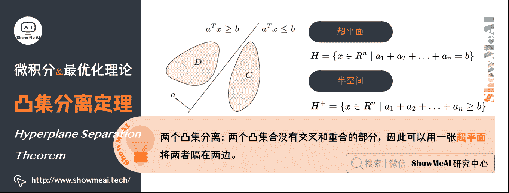
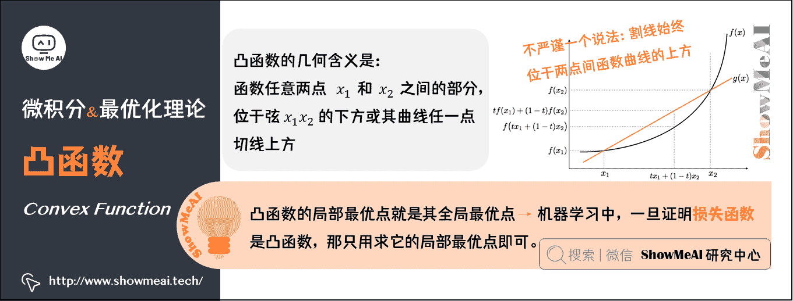
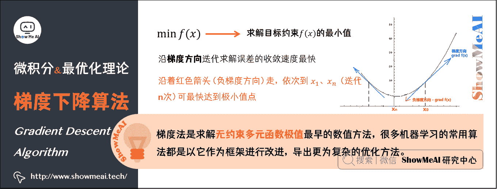
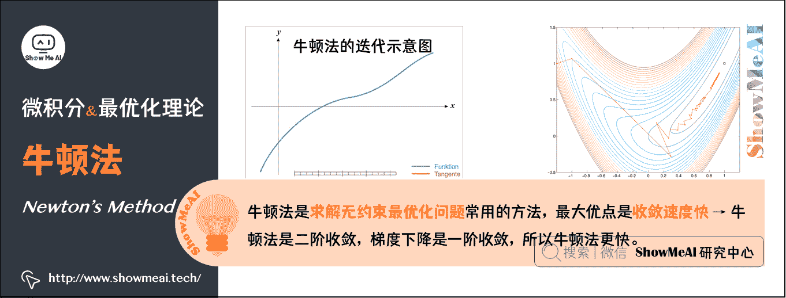
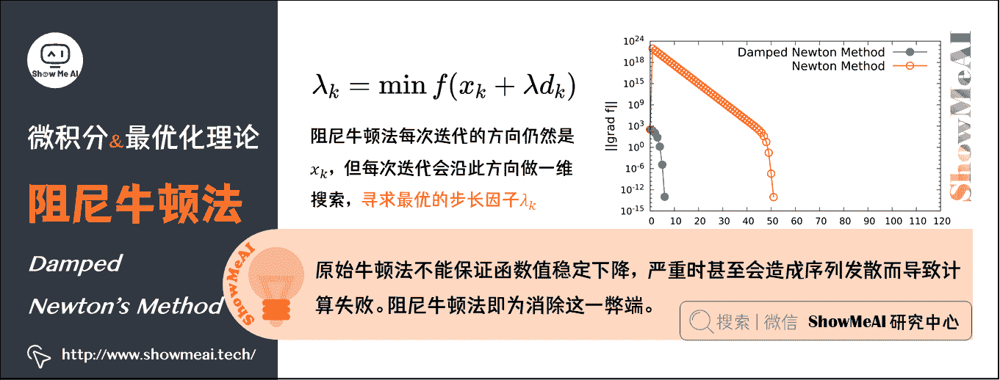

# 图解 AI 数学基础 | 微积分与最优化

> 原文：[`blog.csdn.net/ShowMeAI/article/details/123123742`](https://blog.csdn.net/ShowMeAI/article/details/123123742)

作者：[韩信子](https://github.com/HanXinzi-AI)@[ShowMeAI](http://showmeai.tech/)
[教程地址](http://www.showmeai.tech/tutorials/83)：[`www.showmeai.tech/tutorials/83`](http://www.showmeai.tech/tutorials/83)
[本文地址](http://www.showmeai.tech/article-detail/165)：[`www.showmeai.tech/article-detail/165`](http://www.showmeai.tech/article-detail/165)
**声明：版权所有，转载请联系平台与作者并注明出处**

* * *

# 1.最优化理论（Optimality Theory）

我们在做事过程中，会希望**以最小的代价取得最大的收益**。在解决一些工程问题时，人们常会遇到多种因素交织在一起与决策目标相互影响的情况；我们会使用最优化数学理论来应对这一挑战，而大家了解的线性规划也是最早的最优化方法之一。

李航博士的《统计学习方法》将机器学习总结为：**机器学习 = 模型 + 策略 + 算法**。而公式中的算法指的就是优化算法。大家在算法求职面试过程中，在项目模型效果调优过程中，都经常会遇到优化算法，它是学习 AI 必备的数学知识。

# 2.最优化问题的数学描述

最优化的基本数学模型如下公式所示：

min ⁡ f ( x )  s.t.  h i ( x ) = 0 g j ( x ) ⩽ 0 \begin{array}{ll} \min & f(\mathbf{x}) \\ \text { s.t. } & h_{i}(\mathbf{x})=0 \\ & g_{j}(\mathbf{x}) \leqslant 0 \end{array} min s.t. ​f(x)hi​(x)=0gj​(x)⩽0​

它有三个基本要素，即：

*   设计变量： x \bold{x} x 是一个实数域范围内的 n n n 维向量，被称为决策变量或问题的解；

*   目标函数： f ( x ) f(x) f(x)为目标函数；

*   约束条件： h i ( x ) = 0 h_{i} \left( x \right) =0 hi​(x)=0 称为等式约束， g j ( x ) ≤ 0 g_{j} \left( x \right) \leq 0 gj​(x)≤0 为不等式约束， i , j = 0 , 1 , 2 , … i,j=0,1,2,\dots i,j=0,1,2,…

# 3.凸集与凸集分离定理

## 1）凸集（Convex Set）

实数域 R R R 上（或复数 C C C 上）的向量空间中，如果集合 S S S 中任两点的连线上的点都在 S S S 内，则称集合 S S S 为凸集。

设集合 S ⊂ R n S\subset R^{n} S⊂Rn，若对于任意两点 x , y ∈ S x, y \in S x,y∈S，及实数 λ ( 0 ≤ λ ≤ 1 ) \lambda(0 \leq \lambda \leq 1) λ(0≤λ≤1)都有： λ x + ( 1 − λ ) y ∈ S \lambda x+(1-\lambda) y \in S λx+(1−λ)y∈S 则称集合 S \mathrm{S} S 为凸集。

## 2）超平面和半空间

实际上，二维空间的超平面就是一条线（可以使曲线），三维空间的超平面就是一个面（可以是曲面）。其数学表达式如下：

**超平面**： H = { x ∈ R n ∣ a 1 + a 2 + … + a n = b } H=\left\{x \in R^{n} \mid a_{1}+a_{2}+\ldots+a_{n}=b\right\} H={x∈Rn∣a1​+a2​+…+an​=b}

**半空间**： H + = { x ∈ R n ∣ a 1 + a 2 + … + a n ≥ b } H^{+}=\left\{x \in R^{n} \mid a_{1}+a_{2}+\ldots+a_{n} \geq b\right\} H+={x∈Rn∣a1​+a2​+…+an​≥b}

## 3）凸集分离定理（Hyperplane Separation Theorem）

所谓两个凸集分离，直观地看是指两个凸集合没有交叉和重合的部分，因此可以用一张超平面将两者隔在两边，如图所示。

## 4）凸函数（Convex Function）

凸函数就是一个定义域在某个向量空间的凸子集 C C C 上的实值函数。

数学定义为：对于函数 f ( x ) f(x) f(x)，如果其定义域 C C C 是凸的，且对于 ∀ x 1 , x 2 ∈ C ∀x_{1},x_{2}∈C ∀x1​,x2​∈C 0 ≤ t ≤ 1 0\leq t \leq 1 0≤t≤1，有： f ( t x 1 + ( 1 − t ) x 2 ) ≤ t f ( x 1 ) + ( 1 − t ) f ( x 2 ) f\left( t x_{1}+\left( 1- t \right) x_{2} \right) \leq t f\left( x_{1} \right) +\left( 1- t \right) f\left( x_{2} \right) f(tx1​+(1−t)x2​)≤tf(x1​)+(1−t)f(x2​)，则 f ( x ) f(x) f(x)是凸函数。

注：**如果一个函数是凸函数，则其局部最优点就是它的全局最优点**。这个性质在机器学习算法优化中有很重要的应用，因为**机器学习模型最后就是在求某个函数的全局最优点，一旦证明该函数（机器学习里面叫“损失函数”）是凸函数，那相当于我们只用求它的局部最优点了**。

# 4.梯度下降算法（Gradient Descent Algorithm）

## 1）背景

计算机在运用迭代法做数值计算（比如求解某个方程组的解）时，只要误差能够收敛，计算机最后经过一定次数的迭代后是可以给出一个跟真实解很接近的结果的。

> 其中有一个非常核心的问题，**如果我们得到的目标函数是非线性的情况下，按照哪个方向迭代求解误差的收敛速度会最快呢**？答案就是沿梯度方向。

这就引入了我们的梯度下降法。

## 2）梯度下降法

在多元微分学中，梯度就是函数的导数方向。梯度法是求解无约束多元函数极值最早的数值方法，很多机器学习的常用算法都是以它作为算法框架，进行改进而导出更为复杂的优化方法。

在求解目标函数 f ( x ) f(x) f(x)的最小值时，为求得目标函数的一个凸函数，在最优化方法中被表示为:

min ⁡ f ( x ) \min f(x) minf(x)

根据导数的定义，函数 f ( x ) f(x) f(x)的导函数就是目标函数在 x x x 上的变化率。在多元的情况下，目标函数 f ( x , y , z ) f(x, y, z) f(x,y,z)在某点的梯度 grad ⁡ f ( x , y , z ) = ( ∂ f ∂ x , ∂ f ∂ y , ∂ f ∂ z ) \operatorname{grad}f(x, y, z)=\left(\frac{\partial f}{\partial x}, \frac{\partial f}{\partial y}, \frac{\partial f}{\partial z}\right) gradf(x,y,z)=(∂x∂f​,∂y∂f​,∂z∂f​)是一个由各个分量的偏导数构成的向量，负梯度方向是 f ( x , y , z ) f(x, y, z) f(x,y,z)减小最快的方向。

如上图所示，当需要求 f ( x ) f(x) f(x)的最小值时（机器学习中的 f ( x ) f(x) f(x)一般就是损失函数，而我们的目标就是希望损失函数最小化），我们就可以先任意选取一个函数的初始点 x 0 x_{0} x0​（三维情况就是 ( x 0 , y 0 , z 0 ) \left(x_{0}, y_{0}, z_{0}\right) (x0​,y0​,z0​)），让其沿着图中红色箭头（负梯度方向）走，依次到$x_{1}, x_{2}, \ldots, x_{n} $（迭代 n 次）这样可最快达到极小值点。

## 3）梯度下降法的过程

**输入**：目标函数 f ( x ) f(x) f(x)，梯度函数 g ( x ) = grad ⁡ f ( x ) g(x)=\operatorname{grad} f(x) g(x)=gradf(x)，计算精度 ε \varepsilon ε。

**输出**： f ( x ) f(x) f(x)的极小值点 x ∗ x^{*} x∗

*   1、任取取初始值 x 0 x_{0} x0​，置 k = 0 k=0 k=0；

*   2、计算 f ( x k ) f\left(x_{k}\right) f(xk​)；

*   3、计算梯度 g k = grad ⁡ f ( x k ) g_{k}=\operatorname{grad} f\left(x_{k}\right) gk​=gradf(xk​)，当 ∥ g k ∥ < ε \left\|g_{k}\right\|<\varepsilon ∥gk​∥<ε时停止迭代，令 x ∗ = x k x^{*}=x_{k} x∗=xk​；

*   4、否则令 P k = − g k P_{k}=-g_{k} Pk​=−gk​，求 λ k \lambda_{k} λk​使 f ( x k + 1 ) = min ⁡ f ( x k + λ k P k ) f\left(x_{k+1}\right)=\min f\left(x_{k}+\lambda_{k} P_{k}\right) f(xk+1​)=minf(xk​+λk​Pk​)；

*   5、置 x k + 1 = x k + λ k P k x_{k+1}=x_{k}+\lambda_{k} P_{k} xk+1​=xk​+λk​Pk​，计算 f ( x k + 1 ) f\left(x_{k+1}\right) f(xk+1​)，当 ∥ f ( x k + 1 ) − f ( x k ) ∥ < ε \left\|f\left(x_{k+1}\right)-f\left(x_{k}\right)\right\|<\varepsilon ∥f(xk+1​)−f(xk​)∥<ε或 ∥ x k + 1 − x k ∥ < ε \left\|x_{k+1}-x_{k}\right\|<\varepsilon ∥xk+1​−xk​∥<ε时，停止迭代，令 x ∗ = x k + 1 x^{*}=x_{k+1} x∗=xk+1​；

*   6、否则，置 k = k + 1 k=k+1 k=k+1，转 3。

# 5.随机梯度下降算法（Stochastic Gradient Descent, SGD）

在梯度下降法的迭代中，除了梯度值本身的影响外，另外一个很重要的参数是每一次取的步长，而且这个参数的选择非常重要：

*   步长值取得越大，收敛速度就会越快，但是带来的可能后果就是容易越过函数的最优点，导致发散；
*   步长取太小，算法的收敛速度又会明显降低。

我们希望找到一种比较好的方法能够平衡步长。

**随机梯度下降法引进了随机样本抽取方式，并提供了一种动态步长取值策略。目的就是又要优化精度，又要满足收敛速度。**

> 也就是说，上面的批量梯度下降法每次迭代时都会计算训练集中所有的数据，而随机梯度下降法每次迭代只是随机取了训练集中的一部分样本数据进行梯度计算，这样做最大的好处是可以避免有时候陷入局部极小值的情况（因为批量梯度下降法每次都使用全部数据，一旦到了某个局部极小值点可能就停止更新了；而随机梯度法由于每次都是随机取部分数据，所以就算局部极小值点，在下一步也还是可以跳出）。

两者的关系可以这样理解：**随机梯度下降方法以损失很小的一部分精确度和增加一定数量的迭代次数为代价，换取了总体的优化效率的提升**。增加的迭代次数远远小于样本的数量。

# 6.牛顿法（Newton’s Method）

## 1）牛顿法介绍

牛顿法也是求解无约束最优化问题常用的方法，最大的优点是收敛速度快。从本质上去看，牛顿法是二阶收敛，梯度下降是一阶收敛，所以牛顿法就更快。

通俗地说，比如你想找一条最短的路径走到一个盆地的最底部。梯度下降法每次只从你当前所处位置选一个坡度最大的方向走一步；牛顿法在选择方向时，不仅会考虑坡度是否够大，还会考虑你走了一步之后，坡度是否会变得更大。所以，可以说牛顿法比梯度下降法看得更远一点，能更快地走到最底部。

**或者从几何上说，牛顿法就是用一个二次曲面去拟合你当前所处位置的局部曲面，而梯度下降法是用一个平面去拟合当前的局部曲面，通常情况下，二次曲面的拟合会比平面更好，所以牛顿法选择的下降路径会更符合真实的最优下降路径。**

## 2）牛顿法的推导

将目标函数 f ( x ) f(x) f(x)在 x k x_{k} xk​处进行二阶泰勒展开，可得：

f ( x ) = f ( x k ) + f ′ ( x k ) ( x − x k ) + 1 2 f ′ ′ ( x k ) ( x − x k ) 2 f(x)=f\left(x_{k}\right)+f^{\prime}\left(x_{k}\right)\left(x-x_{k}\right)+\frac{1}{2} f^{\prime \prime}\left(x_{k}\right)\left(x-x_{k}\right)^{2} f(x)=f(xk​)+f′(xk​)(x−xk​)+21​f′′(xk​)(x−xk​)2

*   目标函数 f ( x ) f(x) f(x)有极值的必要条件，是在极值点处一阶导数为 0，即： f ′ ( x ) = 0 f^{\prime}(x)=0 f′(x)=0

*   所以，对上面的展开式两边同时求导（注意 x x x 才是变量， x k x_{k} xk​是常量 ⇒ \Rightarrow ⇒ f ′ ( x k ) f^{\prime}\left(x_{k}\right) f′(xk​)， f ′ ′ ( x k ) f^{\prime \prime}\left(x_{k}\right) f′′(xk​)都是常量)，并令 f ′ ( x ) = 0 f^{\prime}(x)=0 f′(x)=0 可得: f ′ ( x k ) + f ′ ′ ( x k ) ( x − x k ) = 0 f^{\prime}\left(x_{k}\right)+f^{\prime \prime}\left(x_{k}\right)\left(x-x_{k}\right)=0 f′(xk​)+f′′(xk​)(x−xk​)=0

*   即: x = x k − f ′ ( x k ) f ′ ′ ( x k ) x=x_{k}-\frac{f^{\prime}\left(x_{k}\right)}{f^{\prime \prime}\left(x_{k}\right)} x=xk​−f′′(xk​)f′(xk​)​

*   于是可以构造如下的迭代公式: x k + 1 = x k − f ′ ( x k ) f ′ ′ ( x k ) x_{k+1}=x_{k}-\frac{f^{\prime}\left(x_{k}\right)}{f^{\prime \prime}\left(x_{k}\right)} xk+1​=xk​−f′′(xk​)f′(xk​)​

*   这样，就可以利用该迭代式依次产生的序列 { x 1 , x 2 , … , x k } \left\{x_{1}, x_{2}, \ldots, x_{k}\right\} {x1​,x2​,…,xk​}才逐渐逼近 f ( x ) f(x) f(x)的极小值点了。

**牛顿法的迭代如图**：

上面讨论的是 2 维情况，高维情况的牛顿迭代公式是：

x n + 1 = x n − [ H f ( x n ) ] − 1 ∇ f ( x n ) , n ≥ 0 \mathbf{x}_{n+1}=\mathbf{x}_{n}-\left[H f\left(\mathbf{x}_{n}\right)\right]^{-1} \nabla f\left(\mathbf{x}_{n}\right), n \geq 0 xn+1​=xn​−[Hf(xn​)]−1∇f(xn​),n≥0

*   ∇ f \nabla f ∇f 是的梯度，即： ∇ f = [ ∂ f ∂ x 1 ∂ f ∂ x 2 ⋮ ∂ f ∂ x N ] \nabla f=\left[\begin{array}{c} \frac{\partial f}{\partial x_{1}} \\ \frac{\partial f}{\partial x_{2}} \\ \vdots \\ \frac{\partial f}{\partial x_{N}} \end{array}\right] ∇f=⎣⎢⎢⎢⎢⎡​∂x1​∂f​∂x2​∂f​⋮∂xN​∂f​​⎦⎥⎥⎥⎥⎤​

*   H H H 是 Hessen 矩阵，即： H ( f ) = [ ∂ 2 f ∂ x 1 2 ∂ 2 f ∂ x 1 ∂ x 2 ⋯ ∂ 2 f ∂ x 1 ∂ x n ∂ 2 f ∂ x 2 ∂ x 1 ∂ 2 f ∂ x 2 2 ⋯ ∂ 2 f ∂ x 2 ∂ x n ⋮ ⋮ ⋱ ⋮ ∂ 2 f ∂ x n ∂ x 1 ∂ 2 f ∂ x n ∂ x 2 ⋯ ∂ 2 f ∂ x n 2 ] H(f)=\left[\begin{array}{cccc} \frac{\partial^{2} f}{\partial x_{1}^{2}} & \frac{\partial^{2} f}{\partial x_{1} \partial x_{2}} & \cdots & \frac{\partial^{2} f}{\partial x_{1} \partial x_{n}} \\ \frac{\partial^{2} f}{\partial x_{2} \partial x_{1}} & \frac{\partial^{2} f}{\partial x_{2}^{2}} & \cdots & \frac{\partial^{2} f}{\partial x_{2} \partial x_{n}} \\ \vdots & \vdots & \ddots & \vdots \\ \frac{\partial^{2} f}{\partial x_{n} \partial x_{1}} & \frac{\partial^{2} f}{\partial x_{n} \partial x_{2}} & \cdots & \frac{\partial^{2} f}{\partial x_{n}^{2}} \end{array}\right] H(f)=⎣⎢⎢⎢⎢⎢⎡​∂x12​∂2f​∂x2​∂x1​∂2f​⋮∂xn​∂x1​∂2f​​∂x1​∂x2​∂2f​∂x22​∂2f​⋮∂xn​∂x2​∂2f​​⋯⋯⋱⋯​∂x1​∂xn​∂2f​∂x2​∂xn​∂2f​⋮∂xn2​∂2f​​⎦⎥⎥⎥⎥⎥⎤​

## 3）牛顿法的过程

*   1、给定初值 x 0 x_{0} x0​和精度间值 ε \varepsilon ε，并令 k = 0 k=0 k=0；

*   2、计算 x k x_{k} xk​和 H k H_{k} Hk​；

*   3、若 ∥ g k ∥ < ε \left\|g_{k}\right\|<\varepsilon ∥gk​∥<ε则停止迭代；否则确定搜索方向: d k = − H k − 1 ⋅ g k d_{k}=-H_{k}^{-1} \cdot g_{k} dk​=−Hk−1​⋅gk​；

*   4、计算新的迭代点: x k + 1 = x k + d k x_{k+1}=x_{k}+d_{k} xk+1​=xk​+dk​}；

*   5、令 k = k + 1 k=k+1 k=k+1，转至 2。

# 7.阻尼牛顿法（ Damped Newton’s Method ）

## 1）背景

牛顿法的迭代公式中没有步长因子，是定步长迭代。对于非二次型目标函数，有时候会出现的情况，这表明，原始牛顿法不能保证函数值稳定的下降。在严重的情况下甚至会造成序列发散而导致计算失败。

为消除这一弊病，人们又提出阻尼牛顿法。阻尼牛顿法每次迭代的方向仍然是 x k x_{k} xk​，但每次迭代会沿此方向做一维搜索，寻求最优的步长因子 λ k \lambda_{k} λk​，即：

λ k = minf ⁡ ( x k + λ d k ) \lambda_{k}=\operatorname{minf}\left(x_{k}+\lambda d_{k}\right) λk​=minf(xk​+λdk​)

## 2）阻尼牛顿法算法过程

*   1、给定初值 x 0 x_{0} x0​和精度阈值 ε \varepsilon ε，并令 k = 0 k=0 k=0；

*   2、计算 g k g_{k} gk​（ f ( x ) f(x) f(x)在 x k x_{k} xk​处的梯度值）和 H k H_{k} Hk​；

*   3、若 ∥ g k ∥ < ε \left\|g_{k}\right\|<\varepsilon ∥gk​∥<ε则停止迭代；否则确定搜索方向: d k = − H k − 1 ⋅ g k d_{k}=-H_{k}^{-1} \cdot g_{k} dk​=−Hk−1​⋅gk​；

*   4、利用 d k = − H k − 1 ⋅ g k d_{k}=-H_{k}^{-1} \cdot g_{k} dk​=−Hk−1​⋅gk​得到步长 λ k \lambda_{k} λk​，并令 x k + 1 = x k + λ k d k x_{k+1}=x_{k}+\lambda_{k} d_{k} xk+1​=xk​+λk​dk​；

*   5、令 k = k + 1 k=k+1 k=k+1，转至 2。

# 8.拟牛顿法（Quasi-Newton Method）

## 1）概述

由于牛顿法每一步都要求解目标函数的 Hessen 矩阵的逆矩阵，计算量比较大（求矩阵的逆运算量比较大），因此提出一种改进方法，即通过正定矩阵近似代替 Hessen 矩阵的逆矩阵，简化这一计算过程，改进后的方法称为拟牛顿法。

## 2）拟牛顿法的推导

先将目标函数在 x k + 1 x_{k+1} xk+1​处展开： f ( x ) = f ( x k + 1 ) + f ′ ( x k + 1 ) ( x − x k + 1 ) + 1 2 f ′ ′ ( x k + 1 ) ( x − x k + 1 ) 2 f(x)=f\left(x_{k+1}\right)+f^{\prime}\left(x_{k+1}\right)\left(x-x_{k+1}\right)+\frac{1}{2} f^{\prime \prime}\left(x_{k+1}\right)\left(x-x_{k+1}\right)^{2} f(x)=f(xk+1​)+f′(xk+1​)(x−xk+1​)+21​f′′(xk+1​)(x−xk+1​)2

*   两边同时取梯度，得: f ′ ( x ) = f ′ ( x k + 1 ) + f ′ ′ ( x k + 1 ) ( x − x k + 1 ) f^{\prime}(x)=f^{\prime}\left(x_{k+1}\right)+f^{\prime \prime}\left(x_{k+1}\right)\left(x-x_{k+1}\right) f′(x)=f′(xk+1​)+f′′(xk+1​)(x−xk+1​)

*   取上式中的 x = x k x=x_{k} x=xk​，得: f ′ ( x k ) = f ′ ( x k + 1 ) + f ′ ′ ( x k + 1 ) ( x − x k + 1 ) f^{\prime}\left(x_{k}\right)=f^{\prime}\left(x_{k+1}\right)+f^{\prime \prime}\left(x_{k+1}\right)\left(x-x_{k+1}\right) f′(xk​)=f′(xk+1​)+f′′(xk+1​)(x−xk+1​)

*   即： g k + 1 − g k = H k + 1 ⋅ ( x k + 1 − x k ) g_{k+1}-g_{k}=H_{k+1} \cdot\left(x_{k+1}-x_{k}\right) gk+1​−gk​=Hk+1​⋅(xk+1​−xk​)

*   可得： H k − 1 ⋅ ( g k + 1 − g k ) = x k + 1 − x k H_{k}^{-1} \cdot\left(g_{k+1}-g_{k}\right)=x_{k+1}-x_{k} Hk−1​⋅(gk+1​−gk​)=xk+1​−xk​

上面这个式子称为“拟牛顿条件"，由它来对 Hessen 矩阵做约束。

# ShowMeAI 相关文章推荐

*   [图解线性代数与矩阵论](http://www.showmeai.tech/article-detail/162)
*   [图解概率与统计](http://www.showmeai.tech/article-detail/163)
*   [图解信息论](http://www.showmeai.tech/article-detail/164)
*   [图解微积分与最优化](http://www.showmeai.tech/article-detail/165)

# ShowMeAI 系列教程推荐

*   [图解 Python 编程：从入门到精通系列教程](http://www.showmeai.tech/tutorials/56)
*   [图解数据分析：从入门到精通系列教程](http://www.showmeai.tech/tutorials/33)
*   [图解 AI 数学基础：从入门到精通系列教程](http://showmeai.tech/tutorials/83)
*   [图解大数据技术：从入门到精通系列教程](http://www.showmeai.tech/tutorials/84)

