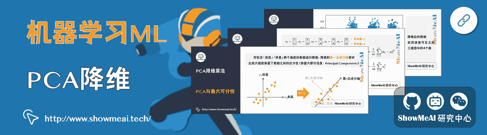

# 图解机器学习算法 | 从入门到精通系列教程

> 原文：[`blog.csdn.net/ShowMeAI/article/details/123422350`](https://blog.csdn.net/ShowMeAI/article/details/123422350)

作者：[韩信子](https://github.com/HanXinzi-AI)@[ShowMeAI](http://www.showmeai.tech/)
[教程地址](http://www.showmeai.tech/tutorials/34)：[`www.showmeai.tech/tutorials/34`](http://www.showmeai.tech/tutorials/34)
**声明：版权所有，转载请联系平台与作者并注明出处**

* * *

# 引言

本篇内容是 ShowMeAI 组织的「**图解机器学习算法**」系列教程入口，本教程尽量以生动可视化的方式，帮助大家理解机器学习的核心知识和重要的系列模型，并配以相关的代码实现帮助大家了解应用方法。（对机器学习实战感兴趣的同学，可以关注 ShowMeAI 的另外一个系列[机器学习应用实践]）

内容覆盖：机器学习基础、评估方法准则、KNN、逻辑回归、朴素贝叶斯、决策树、回归树、随机森林、GBDT、xgboost、lightgbm、支持向量机、聚类、kmeans、降维算法、PCA。

# 教程地址

## [点击查看完整教程学习路径](http://www.showmeai.tech/tutorials/34)

# 内容章节

## [1\. 机器学习基础知识](http://www.showmeai.tech/article-detail/185)

## [2\. 模型评估方法与准则](http://www.showmeai.tech/article-detail/186)

## [3\. KNN 算法及其应用](http://www.showmeai.tech/article-detail/187)

## [4\. 逻辑回归算法详解](http://www.showmeai.tech/article-detail/188)

## [5\. 朴素贝叶斯算法详解](http://www.showmeai.tech/article-detail/189)

## [6\. 决策树模型详解](http://www.showmeai.tech/article-detail/190)

## [7\. 随机森林分类模型详解](http://www.showmeai.tech/article-detail/191)

## [8\. 回归树模型详解](http://www.showmeai.tech/article-detail/192)

## [9\. GBDT 模型详解](http://www.showmeai.tech/article-detail/193)

## [10\. XGBoost 模型最全解析](http://www.showmeai.tech/article-detail/194)

## [11\. LightGBM 模型详解](http://www.showmeai.tech/article-detail/195)

## [12\. 支持向量机模型详解](http://www.showmeai.tech/article-detail/196)

## [13\. 聚类算法详解](http://www.showmeai.tech/article-detail/197)

## [14\. PCA 降维算法详解](http://www.showmeai.tech/article-detail/198)

## [ShowMeAI](http://www.showmeai.tech)系列教程推荐

*   [图解 Python 编程：从入门到精通系列教程](http://www.showmeai.tech/tutorials/56)
*   [图解数据分析：从入门到精通系列教程](http://www.showmeai.tech/tutorials/33)
*   [图解 AI 数学基础：从入门到精通系列教程](http://www.showmeai.tech/tutorials/83)
*   [图解大数据技术：从入门到精通系列教程](http://www.showmeai.tech/tutorials/84)
*   [图解机器学习算法：从入门到精通系列教程](http://www.showmeai.tech/tutorials/34)
*   [机器学习实战：手把手教你玩转机器学习系列](http://www.showmeai.tech/tutorials/41)
*   [深度学习教程 | 吴恩达专项课程 · 全套笔记解读](http://www.showmeai.tech/tutorials/35)

