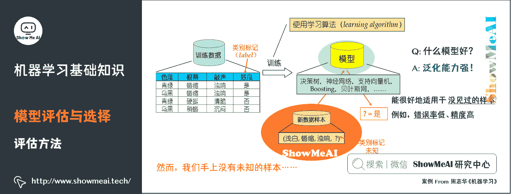

# 图解机器学习 | 机器学习基础知识

> 原文：[`blog.csdn.net/ShowMeAI/article/details/123389485`](https://blog.csdn.net/ShowMeAI/article/details/123389485)

作者：[韩信子](https://github.com/HanXinzi-AI)@[ShowMeAI](http://www.showmeai.tech/)
[教程地址](http://www.showmeai.tech/tutorials/34)：[`www.showmeai.tech/tutorials/34`](http://www.showmeai.tech/tutorials/34)
[本文地址](http://www.showmeai.tech/article-detail/185)：[`www.showmeai.tech/article-detail/185`](http://www.showmeai.tech/article-detail/185)
**声明：版权所有，转载请联系平台与作者并注明出处**

* * *

# 1\. 机器学习概述

## 1）什么是机器学习

**人工智能（Artificial intelligence）是研究、开发用于模拟、延伸和扩展人的智能的理论、方法、技术及应用系统的一门新的技术科学**。它是一个笼统而宽泛的概念，人工智能的最终目标是使计算机能够模拟人的思维方式和行为。大概在上世纪 50 年代开始兴起，但是受限于数据和硬件设备等限制，当时发展缓慢。

**机器学习（Machine learning）是人工智能的子集，是实现人工智能的一种途径，但并不是唯一的途径**。它是一门专门研究计算机怎样模拟或实现人类的学习行为，以获取新的知识或技能，重新组织已有的知识结构使之不断改善自身的性能的学科。大概在上世纪 80 年代开始蓬勃发展，诞生了一大批数学统计相关的机器学习模型。

**深度学习（Deep learning）是机器学习的子集，灵感来自人脑，由人工神经网络（ANN）组成，它模仿人脑中存在的相似结构**。在深度学习中，学习是通过相互关联的「神经元」的一个深层的、多层的「网络」来进行的。「深度」一词通常指的是神经网络中隐藏层的数量。大概在 2012 年以后爆炸式增长，广泛应用在很多的场景中。

让我们看看国外知名学者对机器学习的定义：

**机器学习研究的是计算机怎样模拟人类的学习行为，以获取新的知识或技能，并重新组织已有的知识结构，使之不断改善自身**。从实践的意义上来说，机器学习是在大数据的支撑下，通过各种算法让机器对数据进行深层次的统计分析以进行「自学」，使得人工智能系统获得了归纳推理和决策能力

通过经典的「**垃圾邮件过滤**」应用，我们再来理解下机器学习的原理，以及定义中的 T、E、P 分别指代什么。

## 2）机器学习三要素

机器学习三要素包括**数据**、**模型**、**算法**。这三要素之间的关系，可以用下面这幅图来表示：

### （1）数据

**数据驱动**：数据驱动指的是我们基于客观的量化数据，通过主动数据的采集分析以支持决策。与之相对的是经验驱动，比如我们常说的「拍脑袋」。

### （2）模型&算法

**模型**：在 AI 数据驱动的范畴内，模型指的是基于数据 X 做决策 Y 的假设函数，可以有不同的形态，计算型和规则型等。

**算法**：指学习模型的具体计算方法。统计学习基于训练数据集，根据学习策略，从假设空间中选择最优模型，最后需要考虑用什么样的计算方法求解最优模型。通常是一个最优化的问题。

## 3）机器学习发展历程

人工智能一词最早出现于 1956 年，用于探索一些问题的有效解决方案。1960 年，美国国防部借助「神经网络」这一概念，训练计算机模仿人类的推理过程。

2010 年之前，谷歌、微软等科技巨头改进了机器学习算法，将查询的准确度提升到了新的高度。而后，随着数据量的增加、先进的算法、计算和存储容量的提高，机器学习得到了更进一步的发展。

## 4）机器学习核心技术

*   **分类**：应用以分类数据进行模型训练，根据模型对新样本进行精准分类与预测。

*   **聚类**：从海量数据中识别数据的相似性与差异性，并按照最大共同点聚合为多个类别。

*   **异常检测**：对数据点的分布规律进行分析，识别与正常数据及差异较大的离群点。

*   **回归**：根据对已知属性值数据的训练，为模型寻找最佳拟合参数，基于模型预测新样本的输出值。

## 5）机器学习基本流程

机器学习工作流（WorkFlow）包含数据**预处理**（Processing）、**模型学习**（Learning）、**模型评估**（Evaluation）、**新样本预测**（Prediction）几个步骤。

*   **数据预处理**：输入（未处理的数据 + 标签）→处理过程（特征处理+幅度缩放、特征选择、维度约减、采样）→输出（测试集 + 训练集）。

*   **模型学习**：模型选择、交叉验证、结果评估、超参选择。

*   **模型评估**：了解模型对于数据集测试的得分。

*   **新样本预测**：预测测试集。

## 6）机器学习应用场景

作为一套数据驱动的方法，机器学习已广泛应用于数据挖掘、计算机视觉、自然语言处理、生物特征识别、搜索引擎、医学诊断、检测信用卡欺诈、证券市场分析、DNA 序列测序、语音和手写识别和机器人等领域。

*   **智能医疗**：智能假肢、外骨骼、医疗保健机器人、手术机器人、智能健康管理等。

*   **人脸识别**：门禁系统、考勤系统、人脸识别防盗门、电子护照及身份证，还可以利用人脸识别系统和网络，在全国范围内搜捕逃犯。

*   **机器人的控制领域**：工业机器人、机械臂、多足机器人、扫地机器人、无人机等。

# 2.机器学习基本名词

*   **监督学习**（**Supervised Learning**）：训练集有标记信息，学习方式有分类和回归。

*   **无监督学习**（**Unsupervised Learning**）：训练集没有标记信息，学习方式有聚类和降维。

*   **强化学习**（**Reinforcement Learning**）：有延迟和稀疏的反馈标签的学习方式。

*   **示例/样本**：上面一条数据集中的一条数据。

*   **属性/特征**：「色泽」「根蒂」等。

*   **属性空间/样本空间/输入空间 X**：由全部属性张成的空间。

*   **特征向量**：空间中每个点对应的一个坐标向量。

*   **标记**：关于示例结果的信息，如（（色泽=青绿，根蒂=蜷缩，敲声=浊响），好瓜），其中「好瓜」称为标记。

*   **分类**：若要预测的是离散值，如「好瓜」，「坏瓜」，此类学习任务称为分类。

*   **假设**：学得模型对应了关于数据的某种潜在规律。

*   **真相**：潜在规律自身。

*   **学习过程**：是为了找出或逼近真相。

*   **泛化能力**：学得模型适用于新样本的能力。一般来说，训练样本越大，越有可能通过学习来获得具有强泛化能力的模型。

# 3.机器学习算法分类

## 1）机器学习算法依托的问题场景

机器学习在近 30 多年已发展为一门多领域交叉学科，涉及概率论、统计学、逼近论、凸分析、计算复杂性理论等多门学科。机器学习理论主要是设计和分析一些让计算机可以自动「学习」的算法。

**机器学习算法从数据中自动分析获得规律，并利用规律对未知数据进行预测**。机器学习理论关注可以实现的、行之有效的学习算法。很多推论问题属于无程序可循难度，所以部分的机器学习研究是开发容易处理的近似算法。

机器学习最主要的类别有：监督学习、无监督学习和强化学习。

**监督学习**：从给定的训练数据集中学习出一个函数，当新的数据到来时，可以根据这个函数预测结果。监督学习的训练集要求是包括输入和输出，也可以说是特征和目标。训练集中的目标是由人标注的。常见的监督学习算法包括回归分析和统计分类。

*   更多监督学习的算法模型总结可以查看 ShowMeAI 的文章 [AI 知识技能速查 | 机器学习-监督学习](http://www.showmeai.tech/article-detail/113)。

**无监督学习**：与监督学习相比，训练集没有人为标注的结果。常见的无监督学习算法有生成对抗网络（GAN）、聚类。

*   更多无监督学习的算法模型总结可以查看 ShowMeAI 的文章 [AI 知识技能速查 | 机器学习-无监督学习](http://www.showmeai.tech/article-detail/114)。

**强化学习**：通过观察来学习做成如何的动作。每个动作都会对环境有所影响，学习对象根据观察到的周围环境的反馈来做出判断。

## 2）分类问题

分类问题是机器学习非常重要的一个组成部分。它的目标是根据已知样本的某些特征，判断一个新的样本属于哪种已知的样本类。分类问题可以细分如下：

*   **二分类问题**：表示分类任务中有两个类别新的样本属于哪种已知的样本类。

*   **多类分类**（Multiclass classification）问题：表示分类任务中有多类别。

*   **多标签分类**（Multilabel classification）问题：给每个样本一系列的目标标签。

了解更多机器学习分类算法：[KNN 算法](http://www.showmeai.tech/article-detail/187)、[逻辑回归算法](http://www.showmeai.tech/article-detail/188)、[朴素贝叶斯算法](http://www.showmeai.tech/article-detail/189)、[决策树模型](http://www.showmeai.tech/article-detail/190)、[随机森林分类模型](http://www.showmeai.tech/article-detail/191)、[GBDT 模型](http://www.showmeai.tech/article-detail/193)、[XGBoost 模型](http://www.showmeai.tech/article-detail/194)、[支持向量机模型](http://www.showmeai.tech/article-detail/196)等。

## 3）回归问题

了解更多机器学习回归算法：[决策树模型](http://www.showmeai.tech/article-detail/190)、[随机森林分类模型](http://www.showmeai.tech/article-detail/191)、[GBDT 模型](http://www.showmeai.tech/article-detail/193)、[回归树模型](http://www.showmeai.tech/article-detail/192)、[支持向量机模型](http://www.showmeai.tech/article-detail/196)等。

## 4）聚类问题

了解更多机器学习聚类算法：[聚类算法](http://www.showmeai.tech/article-detail/197)。

## 5）降维问题

了解更多机器学习降维算法：[PCA 降维算法](http://www.showmeai.tech/article-detail/198)。

# 4.机器学习模型评估与选择

## 1）机器学习与数据拟合

机器学习最典型的监督学习为分类与回归问题。分类问题中，我们学习出来一条「决策边界」完成数据区分；在回归问题中，我们学习出拟合样本分布的曲线。

## 2）训练集与数据集

我们以房价预估为例，讲述一下涉及的概念。

*   **训练集**（Training Set）：帮助训练模型，简单的说就是通过训练集的数据让确定拟合曲线的参数。

*   **测试集**（Test Set）：为了测试已经训练好的模型的精确度。

当然，test set 这并不能保证模型的正确性，只是说相似的数据用此模型会得出相似的结果。因为在训练模型的时候，参数全是根据现有训练集里的数据进行修正、拟合，有可能会出现过拟合的情况，即这个参数仅对训练集里的数据拟合比较准确，这个时候再有一个数据需要利用模型预测结果，准确率可能就会很差。

## 3）经验误差

在训练集的数据上进行学习。模型在训练集上的误差称为「经验误差」（Empirical Error）。但是经验误差并不是越小越好，因为我们希望在新的没有见过的数据上，也能有好的预估结果。

## 4）过拟合

过拟合，指的是模型在训练集上表现的很好，但是在交叉验证集合测试集上表现一般，也就是说模型对未知样本的预测表现一般，泛化（Generalization）能力较差。

**如何防止过拟合呢**？一般的方法有 Early Stopping、数据集扩增（Data Augmentation）、正则化、Dropout 等。

*   **正则化**：指的是在目标函数后面添加一个正则化项，一般有 L1 正则化与 L2 正则化。L1 正则是基于 L1 范数，即在目标函数后面加上参数的 L1 范数和项，即参数绝对值和与参数的积项。

*   **数据集扩增**：即需要得到更多的符合要求的数据，即和已有的数据是独立同分布的，或者近似独立同分布的。一般方法有：从数据源头采集更多数据、复制原有数据并加上随机噪声、重采样、根据当前数据集估计数据分布参数，使用该分布产生更多数据等。

*   **DropOut**：通过修改神经网络本身结构来实现的。

## 5）偏差

**偏差**（**Bias**），**它通常指的是模型拟合的偏差程度**。给定无数套训练集而期望拟合出来的模型就是平均模型。偏差就是真实模型和平均模型的差异。

简单模型是一组直线，平均之后得到的平均模型是一条直的虚线，与真实模型曲线的差别较大（灰色阴影部分较大）。因此，**简单模型通常高偏差** 。

复杂模型是一组起伏很大波浪线，平均之后最大值和最小组都会相互抵消，和真实模型的曲线差别较小，因此复杂模型通常低偏差（见黄色曲线和绿色虚线几乎重合）。

## 6）方差

**方差（Variance），它通常指的是模型的平稳程度（简单程度）**。简单模型的对应的函数如出一辙，都是水平直线，而且平均模型的函数也是一条水平直线，因此简单模型的方差很小，并且对数据的变动不敏感。

复杂模型的对应的函数千奇百怪，毫无任何规则，但平均模型的函数也是一条平滑的曲线，因此复杂模型的方差很大，并且对数据的变动很敏感。

## 7）偏差与方差的平衡

## 8）性能度量指标

**性能度量是衡量模型泛化能力的数值评价标准，反映了当前问题（任务需求）**。使用不同的性能度量可能会导致不同的评判结果。更详细的内容可见 [模型评估方法与准则](http://www.showmeai.tech/article-detail/186)

### （1）回归问题

关于模型「好坏」的判断，不仅取决于算法和数据，还取决于当前任务需求。**回归问题常用的性能度量指标有：平均绝对误差、均方误差、均方根误差、R 平方等**。

*   **平均绝对误差**（**Mean Absolute Error，MAE**），又叫平均绝对离差，是所有标签值与回归模型预测值的偏差的绝对值的平均。

*   **平均绝对百分误差**（**Mean Absolute Percentage Error，MAPE**）是对 MAE 的一种改进，考虑了绝对误差相对真实值的比例。

*   **均方误差**（**Mean Square Error，MSE**）相对于平均绝对误差而言，均方误差求的是所有标签值与回归模型预测值的偏差的平方的平均。

*   **均方根误差**（**Root-Mean-Square Error，RMSE**），也称标准误差，是在均方误差的基础上进行开方运算。RMSE 会被用来衡量观测值同真值之间的偏差。

*   **R 平方，决定系数**，反映因变量的全部变异能通过目前的回归模型被模型中的自变量解释的比例。比例越接近于 1，表示当前的回归模型对数据的解释越好，越能精确描述数据的真实分布。

### （2）分类问题

**分类问题常用的性能度量指标包括错误率（Error Rate）、精确率（Accuracy）、查准率（Precision）、查全率（Recall）、F1、ROC 曲线、AUC 曲线和 R 平方等**。更详细的内容可见 [模型评估方法与准则](http://www.showmeai.tech/article-detail/186)

*   **错误率**：分类错误的样本数占样本总数的比例。

*   **精确率**：分类正确的样本数占样本总数的比例。

*   **查准率**（也称准确率），即在检索后返回的结果中，真正正确的个数占你认为是正确的结果的比例。

*   **查全率**（也称召回率），即在检索结果中真正正确的个数，占整个数据集（检索到的和未检索到的）中真正正确个数的比例。

*   **F1**是一个综合考虑查准率与查全率的度量，其基于查准率与查全率的调和平均定义：即：F1 度量的一般形式-Fβ，能让我们表达出对查准率、查全率的不同偏好。

**ROC 曲线（Receiver Operating Characteristic Curve）全称是「受试者工作特性曲线」**。综合考虑了概率预测排序的质量，体现了学习器在不同任务下的「期望泛化性能」的好坏。ROC 曲线的纵轴是「真正例率」（TPR），横轴是「假正例率」（FPR）。

**AUC（Area Under ROC Curve）是 ROC 曲线下面积，代表了样本预测的排序质量**。

> 从一个比较高的角度来认识 AUC：仍然以异常用户的识别为例，高的 AUC 值意味着，模型在能够尽可能多地识别异常用户的情况下，仍然对正常用户有着一个较低的误判率（不会因为为了识别异常用户，而将大量的正常用户给误判为异常。

## 9）评估方法

我们手上没有未知的样本，如何可靠地评估？关键是要获得可靠的「测试集数据」（Test Set），即测试集（用于评估）应该与训练集（用于模型学习）「互斥」。

**常见的评估方法有：留出法（Hold-out）、交叉验证法（ Cross Validation）、自助法（Bootstrap）**。更详细的内容可见 [模型评估方法与准则](http://www.showmeai.tech/article-detail/186)

**留出法**（Hold-out）是机器学习中最常见的评估方法之一，它会从训练数据中保留出验证样本集，这部分数据不用于训练，而用于模型评估。

机器学习中，另外一种比较常见的评估方法是**交叉验证法**（ **Cross Validation**）。k 折交叉验证对 k 个不同分组训练的结果进行平均来减少方差，因此模型的性能对数据的划分就不那么敏感，对数据的使用也会更充分，模型评估结果更加稳定。

**自助法（Bootstrap）是一种用小样本估计总体值的一种非参数方法，在进化和生态学研究中应用十分广泛**。

Bootstrap 通过有放回抽样生成大量的伪样本，通过对伪样本进行计算，获得统计量的分布，从而估计数据的整体分布。

## 10）模型调优与选择准则

我们希望找到对当前问题表达能力好，且模型复杂度较低的模型：

*   表达力好的模型，可以较好地对训练数据中的规律和模式进行学习；

*   复杂度低的模型，方差较小，不容易过拟合，有较好的泛化表达。

## 11）如何选择最优的模型

### （1）验证集评估选择

*   切分数据为训练集和验证集。

*   对于准备好的候选超参数，在训练集上进行模型，在验证集上评估。

### （2）网格搜索/随机搜索交叉验证

*   通过网格搜索/随机搜索产出候选的超参数组。

*   对参数组的每一组超参数，使用交叉验证评估效果。

*   选出效果最好的超参数。

### （3）贝叶斯优化

*   基于贝叶斯优化的超参数调优。

* * *

## 视频教程

**可以点击 [B 站](https://www.bilibili.com/video/BV1TT4y127Nf) 查看视频的【双语字幕】版本**

[`player.bilibili.com/player.html?aid=935770612`](https://player.bilibili.com/player.html?aid=935770612)

【双语字幕+资料下载】斯坦福 CS229 | 机器学习-吴恩达主讲(2018·完整版)

> 【双语字幕+资料下载】斯坦福 CS229 | 机器学习-吴恩达主讲(2018·完整版)
> 
> https://www.bilibili.com/video/BV1TT4y127Nf

## ShowMeAI 相关文章推荐

*   [1.机器学习基础知识](http://www.showmeai.tech/article-detail/185)
*   [2.模型评估方法与准则](http://www.showmeai.tech/article-detail/186)
*   [3.KNN 算法及其应用](http://www.showmeai.tech/article-detail/187)
*   [4.逻辑回归算法详解](http://www.showmeai.tech/article-detail/188)
*   [5.朴素贝叶斯算法详解](http://www.showmeai.tech/article-detail/189)
*   [6.决策树模型详解](http://www.showmeai.tech/article-detail/190)
*   [7.随机森林分类模型详解](http://www.showmeai.tech/article-detail/191)
*   [8.回归树模型详解](http://www.showmeai.tech/article-detail/192)
*   [9.GBDT 模型详解](http://www.showmeai.tech/article-detail/193)
*   [10.XGBoost 模型最全解析](http://www.showmeai.tech/article-detail/194)
*   [11.LightGBM 模型详解](http://www.showmeai.tech/article-detail/195)
*   [12.支持向量机模型详解](http://www.showmeai.tech/article-detail/196)
*   [13.聚类算法详解](http://www.showmeai.tech/article-detail/197)
*   [14.PCA 降维算法详解](http://www.showmeai.tech/article-detail/198)

## ShowMeAI 系列教程推荐

*   [图解 Python 编程：从入门到精通系列教程](http://www.showmeai.tech/tutorials/56)
*   [图解数据分析：从入门到精通系列教程](http://www.showmeai.tech/tutorials/33)
*   [图解 AI 数学基础：从入门到精通系列教程](http://showmeai.tech/tutorials/83)
*   [图解大数据技术：从入门到精通系列教程](http://www.showmeai.tech/tutorials/84)
*   [图解机器学习算法：从入门到精通系列教程](http://www.showmeai.tech/tutorials/34)

