# 图解机器学习 | 模型评估方法与准则

> 原文：[`blog.csdn.net/ShowMeAI/article/details/123390400`](https://blog.csdn.net/ShowMeAI/article/details/123390400)

作者：[韩信子](https://github.com/HanXinzi-AI)@[ShowMeAI](http://www.showmeai.tech/)
[教程地址](http://www.showmeai.tech/tutorials/34)：[`www.showmeai.tech/tutorials/34`](http://www.showmeai.tech/tutorials/34)
[本文地址](http://www.showmeai.tech/article-detail/186)：[`www.showmeai.tech/article-detail/186`](http://www.showmeai.tech/article-detail/186)
**声明：版权所有，转载请联系平台与作者并注明出处**

* * *

# 引言

科学家门捷列夫说「没有测量，就没有科学」，在 AI 场景下我们同样需要定量的数值化指标来指导我们更好地应用模型对数据进行学习和建模。

事实上，在机器学习领域，对模型的测量和评估至关重要。选择与问题相匹配的评估方法，能帮助我们快速准确地发现在模型选择和训练过程中出现的问题，进而对模型进行优化和迭代。本文我们系统地讲解一下机器学习模型评估相关知识。

（本篇内容会涉及到不少机器学习基础知识，没有先序知识储备的宝宝可以查看 ShowMeAI 的文章 [图解机器学习 | 机器学习基础知识](http://www.showmeai.tech/article-detail/185)。

# 1.模型评估的目标

**模型评估的目标是选出泛化能力强的模型完成机器学习任务**。实际的机器学习任务往往需要进行大量的实验，经过反复调参、使用多种模型算法（甚至多模型融合策略）来完成自己的机器学习问题，并观察哪种模型算法在什么样的参数下能够最好地完成任务。

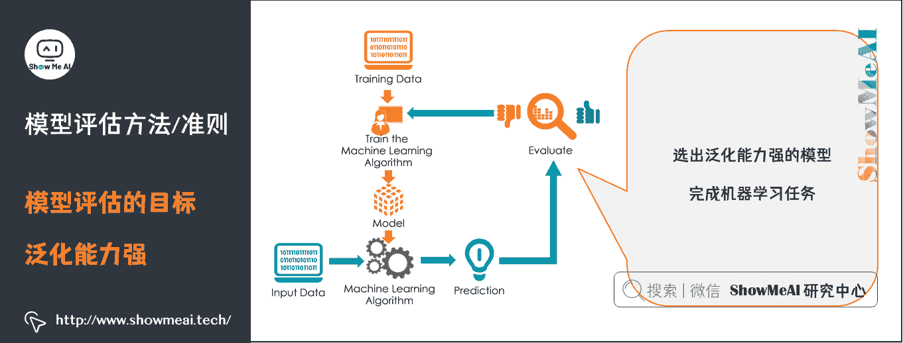

**泛化能力强的模型能很好地适用于未知的样本，模型的错误率低、精度高**。**机器学习任务中，我们希望最终能得到准确预测未知标签的样本、泛化能力强的模型**。

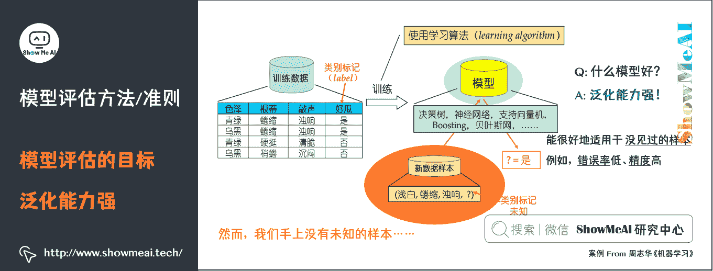

但是我们无法提前获取「未知的样本」，因此我们会基于已有的数据进行切分来完成模型训练和评估，借助于切分出的数据进行评估，可以很好地判定模型状态（过拟合 or 欠拟合），进而迭代优化。

在建模过程中，为了获得泛化能力强的模型，我们需要一整套方法及评价指标。

*   **评估方法**：为保证客观地评估模型，对数据集进行的有效划分实验方法。

*   **性能指标**：量化地度量模型效果的指标。

# 2.离线与在线实验方法

进行评估的实验方法可以分为「离线」和「在线」两种。

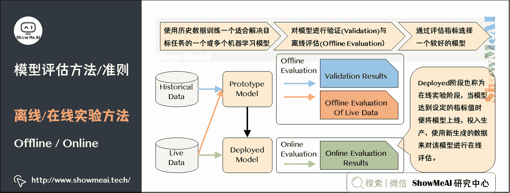

## 1）离线实验方法

**模型评估通常指离线试验**。原型设计（Prototyping）阶段及离线试验方法，包含以下几个过程：

*   使用历史数据训练一个适合解决目标任务的一个或多个机器学习模型。

*   对模型进行验证（Validation）与离线评估（Offline Evaluation）。

*   通过评估指标选择一个较好的模型。

## 2）在线实验方法

除了离线评估之外，其实还有一种在线评估的实验方法。由于模型是在老的模型产生的数据上学习和验证的，而线上的数据与之前是不同的，因此离线评估并不完全代表线上的模型结果。因此我们需要在线评估，来验证模型的有效性。

在线实验有一个杰出代表，那就是 A/B Test。

**A/B Test 是目前在线测试中最主要的方法**。A/B Test 是为同一个目标制定两个方案让一部分用户使用 A 方案，另一部分用户使用 B 方案，记录下用户的使用情况，看哪个方案更符合设计目标。如果不做 AB 实验直接上线新方案，新方案甚至可能会毁掉你的产品。

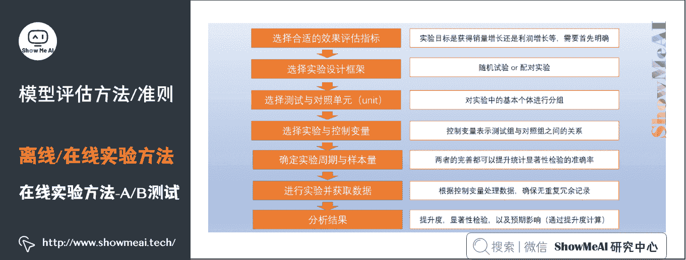

## 3）评估指标

在**离线评估**中，经常使用**准确率（Accuracy）、查准率（Precision）、召回率（Recall）、ROC、AUC、PRC**等指标来评估模型。

**在线评估**与离线评估所用的评价指标不同，一般使用一些商业评价指标，如**用户生命周期值（Customer Lifetime value）、广告点击率（Click Through Rate）、用户流失率**（Customer Churn Rate）等标。

我们将常见的评估指标汇总如下：

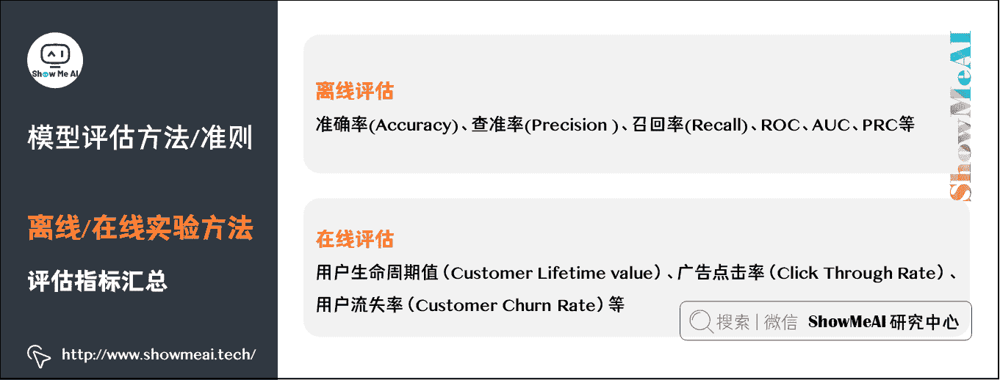

# 3.常见模型评估方法介绍

下面我们来了解一下模型评估方法，主要涉及到对完整数据集不同的有效划分方法，保证我们后续计算得到的评估指标是可靠有效的，进而进行模型选择和优化。

## 1）留出法（Hold-out）

**留出法是机器学习中最常见的评估方法之一，它会从训练数据中保留出验证样本集，这部分数据不用于训练，而用于模型评估**。

完整的数学定义如下：

对于一个机器学习问题，通常有数据集 D（用于训练模型），但还需要评估模型，因此不能把整个 D 用于训练，因为拿训练过的数据再去评估必然无效。那么最基本的方法就是留出法：把 D 划分为两部分，训练集 S 和测试集 T，其中 SUT=D，S∩T=Φ。

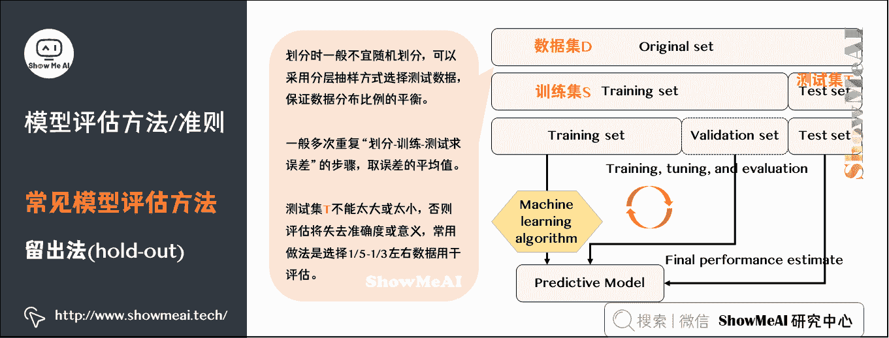

下面是留出法数据划分的注意点：

*   **随机划分不一定能保证有效性**，因为如果 T 中正好只取到某一种特殊类型数据，从而带来了额外的误差。此时处理方法要视具体情况而定，如当数据明显的分为有限类时，可以采用分层抽样方式选择测试数据，保证数据分布比例的平衡。

*   单次划分不一定能得到合适的测试集，一般多次重复「**划分 - 训练 - 测试求误差**」的步骤，取误差的平均值。

*   划分的验证集，太大或者太小都不合适，常用做法是**选择 1/5 - 1/3 左右数据当作验证集用于评估**。

## 2）交叉验证法（Cross Validation）

**留出法的数据划分，可能会带来偏差**。在机器学习中，另外一种比较常见的评估方法是交叉验证法——**K 折交叉验证对 K 个不同分组训练的结果进行平均来减少方差**。

因此模型的性能对数据的划分就不那么敏感，对数据的使用也会更充分，模型评估结果更加稳定，可以很好地避免上述问题。

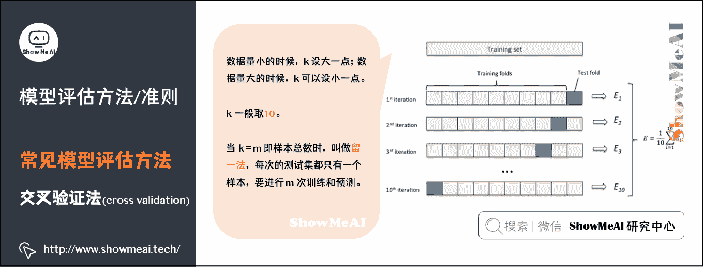

## 3）自助法（Bootstrap）

部分场景下，数据量较少，很难通过已有的数据来估计数据的整体分布（因为数据量不足时，计算的统计量反映不了数据分布），这时可以使用 Bootstrap 自助法。

Bootstrap 是一种用小样本估计总体值的一种非参数方法，在进化和生态学研究中应用十分广泛。**Bootstrap 通过有放回抽样生成大量的伪样本，通过对伪样本进行计算，获得统计量的分布，从而估计数据的整体分布**。

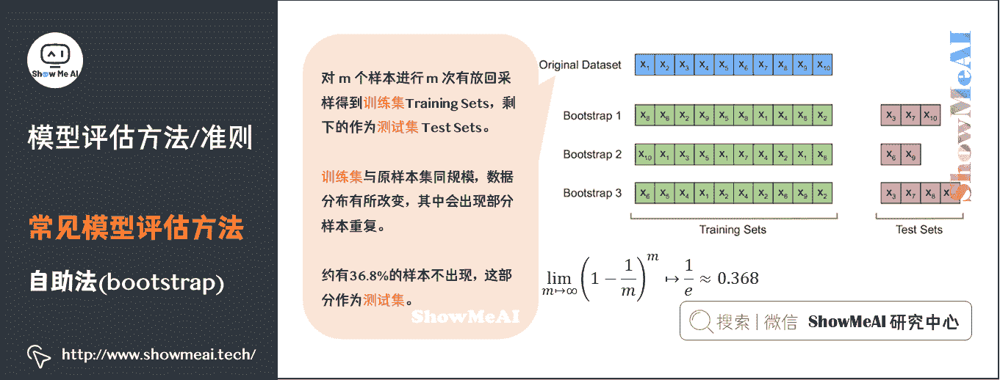

有了有效的模型评估方法，我们还需要量化的度量标准来精准评估与判断。下文归纳了分类与回归问题的各类评估指标。

# 4.回归问题常用的评估指标

回归类问题场景下，我们会得到连续值的预测结果，比对标准答案，我们有 MAE、MSE、RMSE 等评估指标（准则）可以衡量预测结果相对实际情况的偏离程度，它们的取值越小说明回归模型的预测越准，模型性能越好。如下图所示：

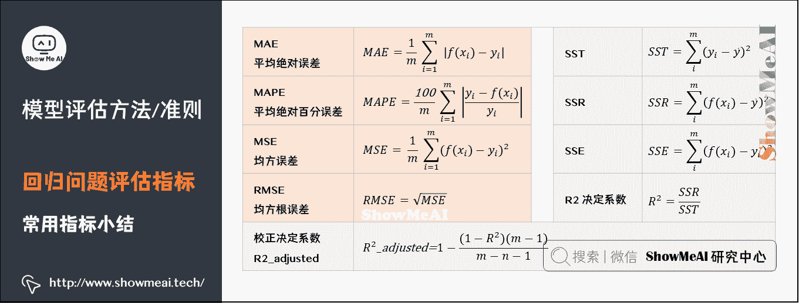

## 1）平均绝对误差 MAE

**平均绝对误差**（**Mean Absolute Error，MAE**），又叫平均绝对离差，是所有标签值与回归模型预测值的偏差的绝对值的平均。

*   **优点**：直观地反映回归模型的预测值与实际值之间的偏差。准确地反映实际预测误差的大小。不会出现平均误差中误差符号不同而导致的正负相互抵消。

*   **缺点**：不能反映预测的无偏性（估算的偏差就是估计值的期望与真实值的差值。无偏就要求估计值的期望就是真实值）。

M A E = 1 m ∑ i = 1 m ∣ f ( x i ) − y i ∣ MAE=\frac{1}{m} \sum_{i=1}^{m}\left|f\left(x_{i}\right)-y_{i}\right| MAE=m1​i=1∑m​∣f(xi​)−yi​∣

## 2）平均绝对百分误差 MAPE

虽然平均绝对误差能够获得一个评价值，但是你并不知道这个值代表模型拟合是优还是劣，只有通过对比才能达到效果。当需要以相对的观点来衡量误差时，则使用 MAPE。

**平均绝对百分误差**（**Mean Absolute Percentage Error，MAPE**）是对 MAE 的一种改进，考虑了绝对误差相对真实值的比例。

*   **优点**：考虑了预测值与真实值的误差。考虑了误差与真实值之间的比例。

M A P E = 100 m ∑ i = 1 m ∣ y i − f ( x i ) y i ∣ MAPE=\frac{100}{m} \sum_{i=1}^{m} \left | \frac{y_{i}-f\left(x_{i}\right)}{y_{i}} \right | MAPE=m100​i=1∑m​∣∣∣∣​yi​yi​−f(xi​)​∣∣∣∣​

> 在某些场景下，如房价从 5K 到 50K 之间，5K 预测成 10K 与 50K 预测成 45K 的差别是非常大的，而平均绝对百分误差考虑到了这点。

## 3）均方误差 MSE

MAE 虽能较好衡量回归模型的好坏，但是绝对值的存在导致函数不光滑，在某些点上不能求导。可以考虑将绝对值改为残差的平方，就得到了均方误差。

**均方误差**（**Mean Square Error，MSE**）相对于平均绝对误差而言，均方误差求的是所有标签值与回归模型预测值的偏差的平方的平均。

*   **优点**：准确地反映实际预测误差的大小。放大预测偏差较大的值。比较不同预测模型的稳定性。

*   **缺点**：不能反映预测的无偏性。

M S E = 1 m ∑ i = 1 m ( f ( x i ) − y i ) 2 MSE=\frac{1}{m} \sum_{i=1}^{m}\left(f\left(x_{i}\right)-y_{i}\right)^{2} MSE=m1​i=1∑m​(f(xi​)−yi​)2

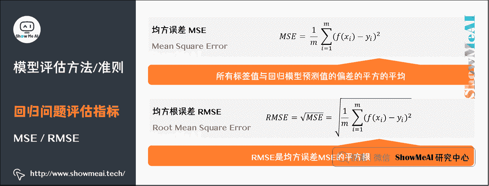

## 4）均方根误差 RMSE

**均方根误差**（**Root-Mean-Square Error，RMSE**），也称标准误差，是在均方误差的基础上进行开方运算。RMSE 会被用来衡量观测值同真值之间的偏差。

R M S E = M S E = 1 m ∑ i = 1 m ( f ( x i ) − y i ) 2 RMSE=\sqrt{MSE} =\sqrt{\frac{1}{m} \sum_{i=1}^{m}\left(f\left(x_{i}\right)-y_{i}\right)^{2}} RMSE=MSE  ​=m1​i=1∑m​(f(xi​)−yi​)2  ​

## 5）决定系数

决定系数 R 平方与之前介绍的三个指标有所不同，它表征的是因变量 y 的变化中有多少可以用自变量 x 来解释，是回归方程对观测值拟合程度的一种体现。

R 平方越接近 1，说明回归模型的性能越好，即能够解释大部分的因变量变化。

*   **优点**：用于定量描述回归模型的解释能力。

*   **缺点**：没有考虑特征数量变化的影响。无法比较特征数目不同的回归模型。

R 2 = S S R S S T R^{2}=\frac{SSR}{SST} R2=SSTSSR​

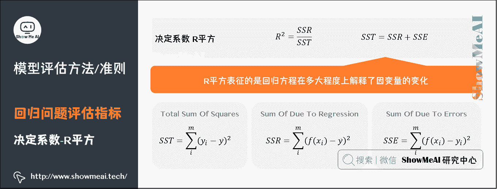

*   SSR：Sum of Squares of the Regression，即预测数据与原始数据均值之差的平方和，反映的是模型相对原始数据均值的离散程度。

*   SST：Total Sum of Squares，即原始数据和均值之差的平方和，反映的是原始数据相对均值的离散程度。

*   SSE：Sum of Squares for Error，残差平方和，原始数据和预测数据之差的平方和。

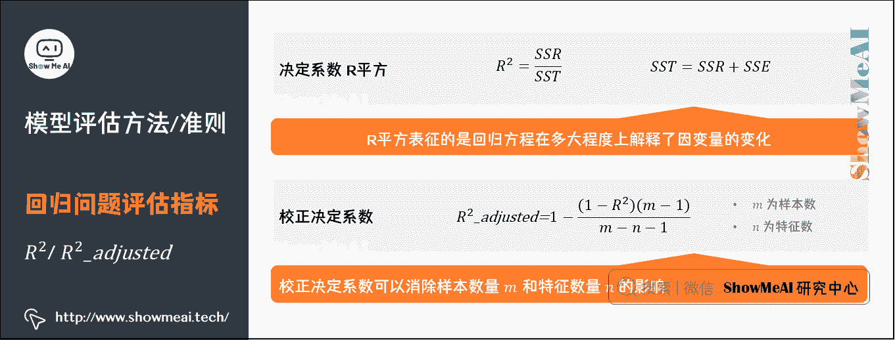

## 6）校正决定系数

在利用 R 平方来评价回归方程的优劣时，随着自变量个数的不断增加，R 平方将不断增大。而校正决定系数则可以消除样本数量和特征数量的影响。

*   **优点**：在决定系数 R 平方的基础上考虑了特征个数的影响。比较变量数不同的模型。

R − 2 adjusted  = 1 − ( 1 − R 2 ) ( m − 1 ) m − n − 1 R^{2}_{-} \text {adjusted }=1-\frac{\left(1-R^{2}\right)(m-1)}{m-n-1} R−2​adjusted =1−m−n−1(1−R2)(m−1)​

# 5.回归评估指标适用场景分析

在熟悉了回归问题的各种评价指标后，再来看看各自适用的具体场景以及优缺点。

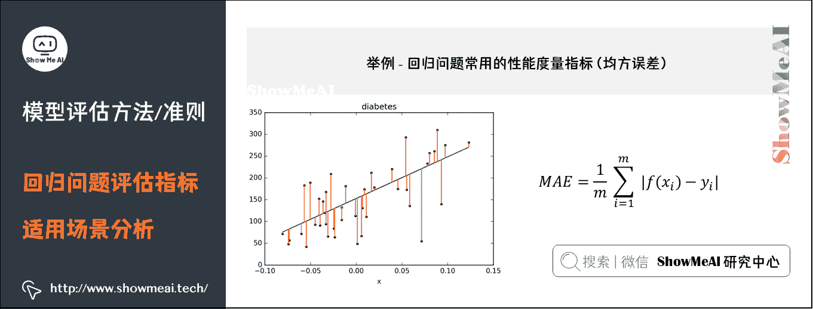

MAE、MSE、RMSE 均存在求平均的操作（包括 R 的平方也可以认为有此操作，只是因为分子分母的约分导致求平均的操作不明显），而取均值是为了消除样本数量的影响，使得评估指标的大小不会太依赖于样本数量，而是更多地反映模型的误差。

校正之后的决定系数在此基础上消除了样本数量和特征数量的影响，自变量越多，校正决定系数就会对自变量进行处罚，所以一般校正决定系数小于决定系数，它能更好地反映模型的质量，可以用来选择不同特征数量的回归模型。

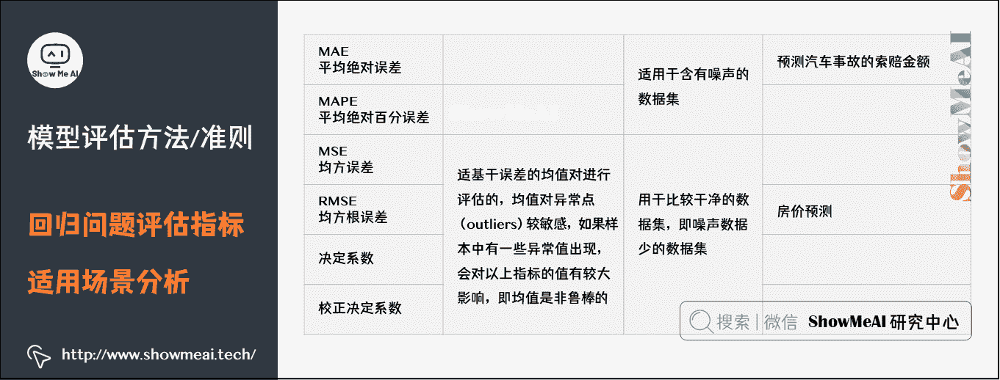

# 6.分类问题常用的评估指标

分类问题是机器学习领域最常见的大类问题，有很多场景可以划归到分类问题的解决范畴。下面我们梳理一下分类问题的主要评估指标（Evaluation Metrics）。

## 1）混淆矩阵

在人工智能中，**混淆矩阵**（**Confusion Matrix**）是非常有效的评估模式，特别用于监督学习（在无监督学习中一般叫做匹配矩阵）。典型的混淆矩阵构成如下图所示：

*   每一列代表了预测类别，每一列的总数表示预测为该类别的数据的数目。

*   每一行代表了数据的真实归属类别，每一行的数据总数表示该类别的数据实例的数目。

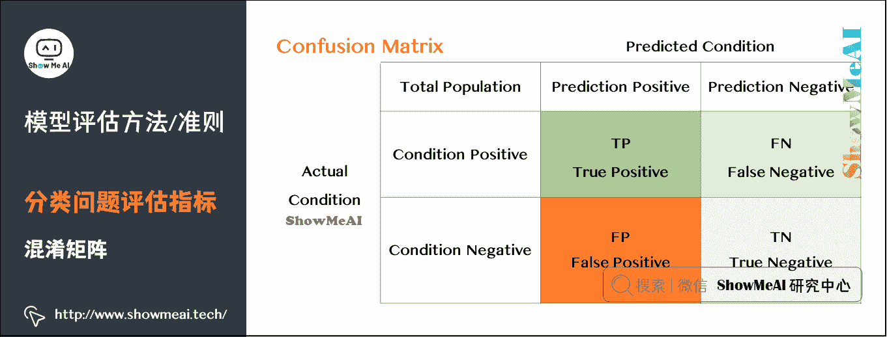

*   True Positive（TP）：真实值为 Positive，预测值为 Positive。

*   False positive（FP）：真实值为 Negative，预测值为 Negative。

*   False Negative（FN）：真实值为 Negative，预测值为 Positive。

*   True Negative（TN）：真实值为 Positive，预测值为 Negative。

很多评估指标可以基于混淆矩阵计算得到，如下图所示：

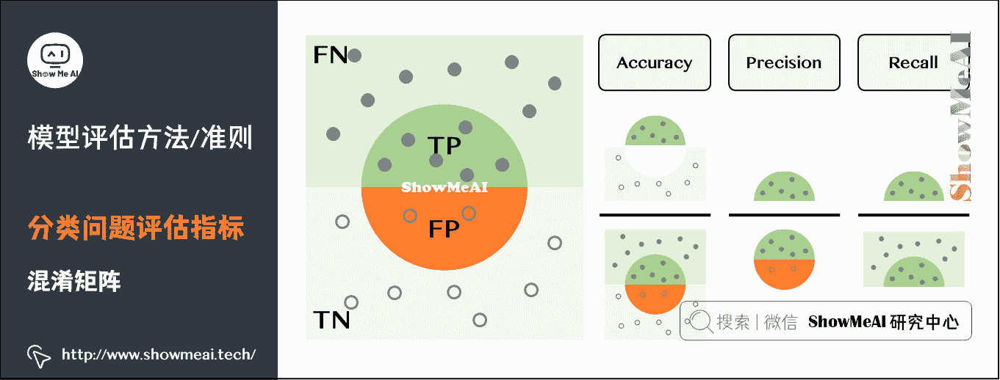

## 2）Accuracy 精确率

对于分类问题，精确率（Accuracy）指分类正确的样本数占样本总数的比例，是最常用的指标，可以总体上衡量一个预测的性能。一般情况（数据类别均衡）下，模型的精度越高，说明模型的效果越好。

A c c u r a c y = T P + T N F P + F N + F P + T N Accuracy =\frac{TP+TN}{FP+FN+FP+TN} Accuracy=FP+FN+FP+TNTP+TN​

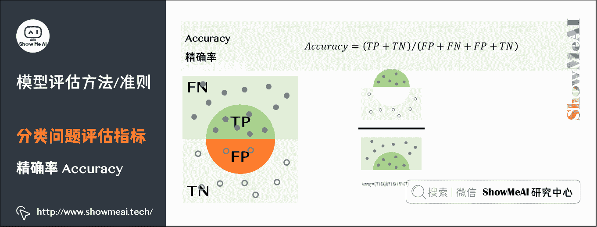

但是在数据类别严重不均衡的情况下，这个评估指标并不合理，比如发病率 0.1％的医疗场景下，如果只追求 Accuracy，模型可以把所有人判定为没有病的正常人，Accuracy 高达 99.9%，但这个模型实际是不可用的。为了更好地应对上述问题，衍生出了一系列其他评估指标。例如：

*   **宁愿漏掉，不可错杀**：在识别垃圾邮件的场景中可能偏向这一种思路，因为不希望很多的正常邮件被误杀，这样会造成严重的困扰。因此，**查准率**（Precision）将是一个被侧重关心的指标。

*   **宁愿错杀，不可漏掉**：在金融风控领域大多偏向这种思路，希望系统能够筛选出所有有风险的行为或用户，然后交给人工鉴别，漏掉一个可能造成灾难性后果。因此，**查全率**（Recall）将是一个被侧重关心的指标。

## 3）Precision 查准率

**Precision**（**查准率**），又称正确率、准确率，表示在模型识别为正类的样本中，真正为正类的样本所占的比例。一般情况下，查准率越高，说明模型的效果越好。

P r e c i s i o n = T P F P + F P Precision =\frac{TP}{FP+FP} Precision=FP+FPTP​

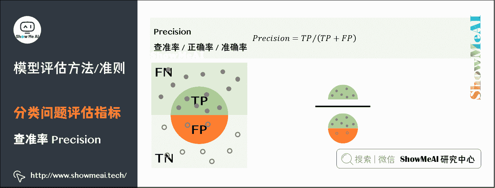

## 4）Recall 查全率

**Recall**（**查全率**），又称召回率，表示的是，模型正确识别出为正类的样本的数量占总的正类样本数量的比值。一般情况下，Recall 越高，说明有更多的正类样本被模型预测正确，模型的效果越好。

R e c a l l = T P T P + F N Recall =\frac{TP}{TP+FN} Recall=TP+FNTP​

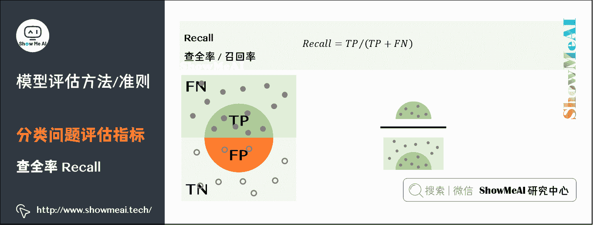

## 5）Fβ-Score 和 F1-Score

理论上来说，Precision 和 Recall 都是越高越好，但更多时候它们两个是矛盾的，经常无法保证二者都很高。此时，引入一个新指标 F β − S c o r e F \beta - Score Fβ−Score，用来综合考虑 Precision 与 Recall。

F β = ( 1 + β 2 ) ×  Precision  ×  Recall  β 2 ×  Precision  +  Recall  F_{\beta}=\left(1+\beta^{2}\right) \times \frac{\text { Precision } \times \text { Recall }}{\beta^{2} \times \text { Precision }+\text { Recall }} Fβ​=(1+β2)×β2× Precision + Recall  Precision × Recall ​

需要根据不同的业务场景来调整 β \beta β 值：

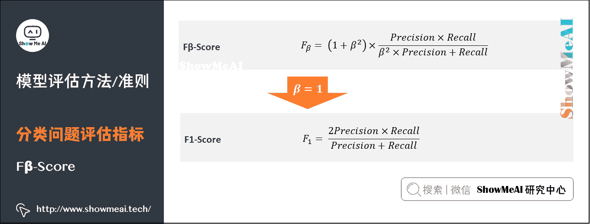

*   β = 1 \beta = 1 β=1 时， F β − S c o r e F \beta - Score Fβ−Score 就是 F 1 − S c o r e F 1 - Score F1−Score，综合平等考虑 Precision 和 Recall 的评估指标，当 F1 值较高时则说明模型性能较好。

F 1 = 2  Precision  ×  Recall   Precision  +  Recall  F_{1}=\frac{2 \text { Precision } \times \text { Recall }}{\text { Precision }+\text { Recall }} F1​= Precision + Recall 2 Precision × Recall ​

*   β < 1 \beta < 1 β<1 时，更关注 Precision。

*   β > 1 \beta > 1 β>1 时，更关注 Recall。

## 6）ROC

除了前面介绍的 Accuracy、Precision 与 Recall，还有一些其他的度量标准，如使用 True Positive Rate（TPR，真正例率）和 False Positive Rate（FPR，假正例率）两个指标来绘制 ROC 曲线。

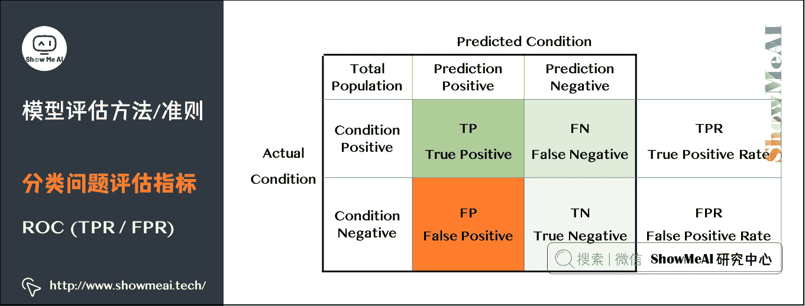

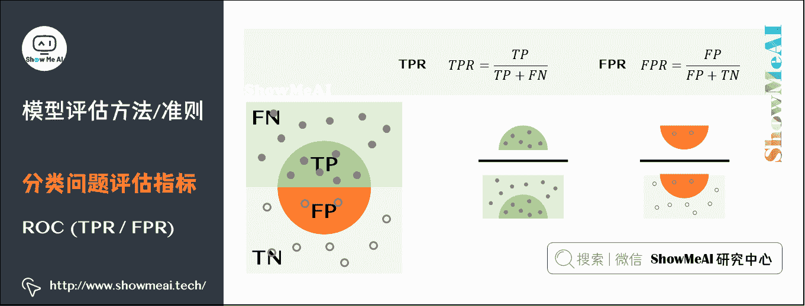

T P R = T P T P + F N TPR =\frac{TP}{TP+FN} TPR=TP+FNTP​

F P R = F P F P + T N FPR =\frac{FP}{FP+TN} FPR=FP+TNFP​

算法对样本进行分类时，都会有置信度，即表示该样本是正样本的概率。

> 比如，99%的概率认为样本Ａ是正例，１％的概率认为样本 B 是正例。通过选择合适的阈值，比如 50%，对样本进行划分，概率大于 50%的就认为是正例，小于 50%的就是负例。

通过置信度可以对所有样本进行降序排序，再逐个样本地选择阈值，比如排在某个样本之前的都属于正例，该样本之后的都属于负例。每一个样本作为划分阈值时，都可以计算对应的 TPR 和 FPR，那么就可以绘制 ROC 曲线。

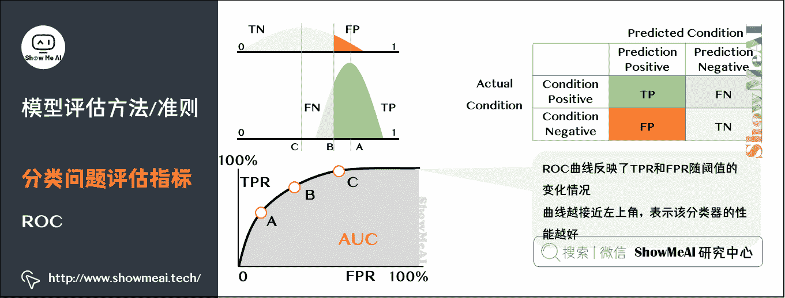

**ROC 曲线**（**Receiver Operating Characteristic Curve**）全称是「受试者工作特性曲线」。综合考虑了概率预测排序的质量，体现了学习器在不同任务下的「期望泛化性能」的好坏，反映了 TPR 和 FPR 随阈值的变化情况。

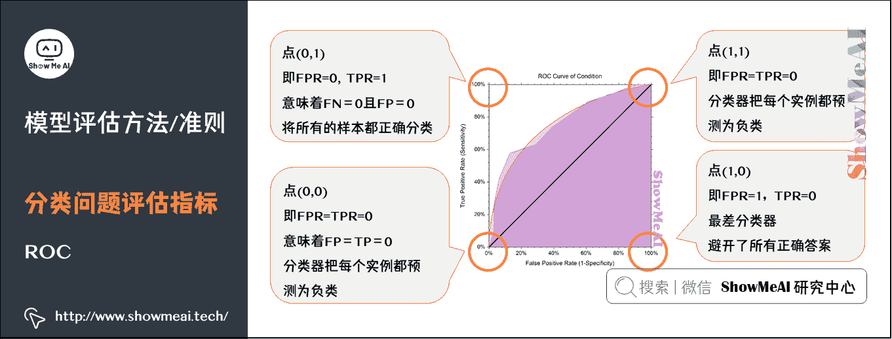

**ROC 曲线越接近左上角，表示该分类器的性能越好**。也就是说模型在保证能够尽可能地准确识别小众样本的基础上，还保持一个较低的误判率，即不会因为要找出小众样本而将很多大众样本给误判。

**一般来说，如果 ROC 是光滑的，那么基本可以判断没有太大的 overfitting**。

## 7）AUC

ROC 曲线的确能在一定程度上反映模型的性能，但它并不是那么方便，因为曲线靠近左上方这个说法还比较主观，不够定量化，因此还是需要一个定量化的标量指标来反映这个事情。ROC 曲线的 AUC 值恰好就做到了这一点。

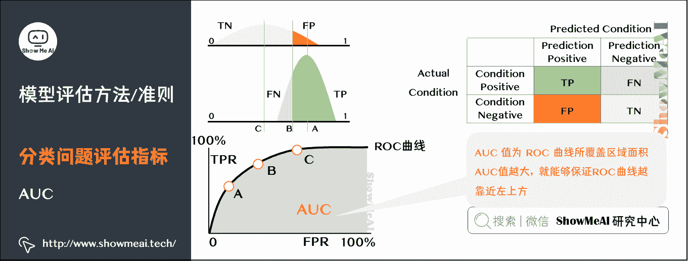

**AUC**（**Area Under ROC Curve**）是 ROC 曲线下面积，其物理意义是，正样本的预测结果大于负样本的预测结果的概率，本质是 AUC 反应的是分类器对样本的排序能力。

> **AUC 值越大，就能够保证 ROC 曲线越靠近左上方**。

## 8）PRC

与 ROC 曲线的思想类似，根据 Precision 和 Recall，也提出了一种 Precision-Recall 曲线。

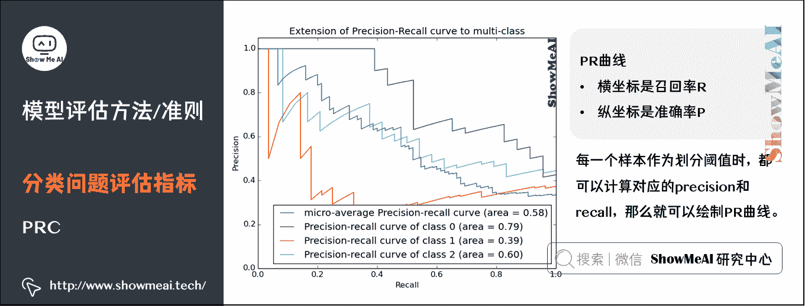

同样是通过置信度就可以对所有样本进行降序排序，再逐个样本地选择阈值，比如排在某个样本之前的都属于正例，该样本之后的都属于负例。每一个样本作为划分阈值时，都可以计算对应的 Precision 和 Recall，那么就可以绘制 PR 曲线。

## 9）小结

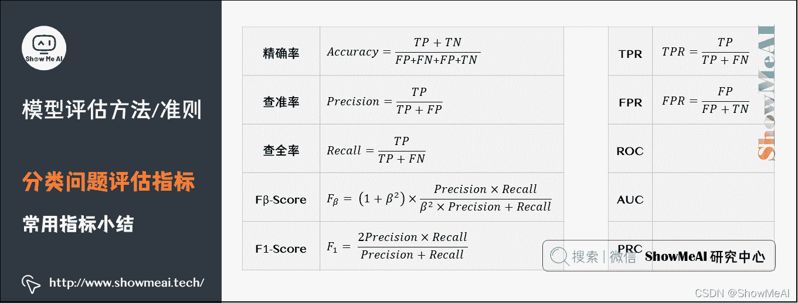

# 7.二分类评估指标适用场景

在不同的业务场景中，Precision 和 Recall 的侧重不一样：

*   对于癌症预测、地震预测这类业务场景，人们更关注模型对正类的预测能力和敏感度，因此模型要尽可能提升 Recall，甚至不惜降低 Precision。

*   而对于垃圾邮件识别等场景中，人们更难以接受 FP（把正常邮件识别为垃圾邮件，影响工作），因此模型可以适度降低 Recall 以便获得更高的 Precision。我们可以通过调节 F β − S c o r e F \beta - Score Fβ−Score 中 β \beta β的大小来控制 Precision 和 Recall 的侧重程度。

## 1）评价指标分析

对于这些评价指标的选择，有如下的一些经验：

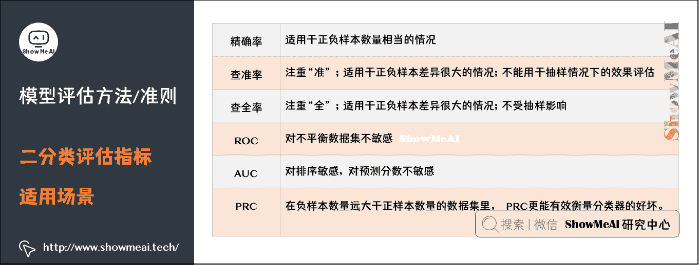

*   Accuracy 适用于正负样本比例相差不大的情况的结果评估。

*   Precision 和 Recall 适用于正负样本差异很大的情况，Precision 不能用于抽样情况下的效果评估，Recall 不受抽样影响。

*   负样本的数量远远大于正样本的数据集里，PRC 更能有效衡量分类器的好坏。

*   AUC 计算主要与排序有关，所以它对排序敏感，而对预测分数没那么敏感。

## 2）垃圾邮件识别

垃圾邮件占用网络带宽、侵犯收件人的隐私权、骗人钱财等，已经对现实社会造成了危害。一般来说，凡是未经用户许可就强行发送到用户的邮箱中的任何电子邮件都可称作是垃圾邮件，这是一个典型的二分类问题。

「把垃圾文件识别为正常文件」和「把正常文件识别为垃圾文件」，二者相比，、我们显然更能容忍前者，因此模型可以适度降低 Recall 以便获得更高的 Precision。

## 3）金融风控

再来看个金融风控的例子，首先需要明确一点，正常客户的数量一般来说是远远大于风险客户的，这是个样本不均衡问题。互联网金融公司风控部门的主要工作是利用机器模型抓取坏客户。

根据前面对 Precision、Recall 以及 PR 曲线的介绍，知道，Precision 和 Recall 往往都是相互牵制的，很难同时达到一个很高的水平。所以在这个案例中，同样需要根据业务场景来衡量这两个指标的重要性。

*   互联网金融公司要扩大业务量，尽量多的吸引好客户，此时风控部门就会提高阈值，从而提高模型的查准率 Precision，同时，也会放进一部分坏客户，导致查全率 Recall 下降。

*   如果公司坏账扩大，公司缩紧业务，尽可能抓住更多的坏客户，此时风控部门需要不惜一切代价降低损失，守住风险底线，因此会降低阈值，从而提高模型的查全率 Recall，但是这样会导致一部分好客户误抓，从而降低模型的查准率 Precision。

可以通过调节 F β − S c o r e F \beta - Score Fβ−Score 中 β \beta β 的大小来控制 Precision 和 Recall 的侧重程度。 β < 1 \beta < 1 β<1，重视查准率； β > 1 \beta > 1 β>1，重视查全率。

# 8.样本均衡与采样

首先看看什么是分类任务中的样本不均衡问题，以及如何解决样本不均衡问题。

## 1）样本均衡问题

在学术研究与教学中，很多算法都有一个基本假设，那就是数据分布是均匀的。当把这些算法直接应用于实际数据时，大多数情况下都无法取得理想的结果，因为实际数据往往分布得很不均匀，都会存在「长尾现象」。

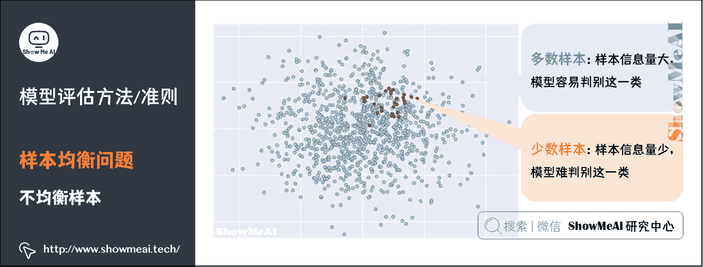

*   多数样本数量多，信息量大，容易被模型充分学习，模型容易识别这类样本

*   少数样本数量少，信息量少，模型没有充分学习到它们的特征，很难识别这类样本

解决这一问题的基本思路是，让正负样本在训练过程中拥有相同的话语权（比如利用采样与加权等方法）。样本类别不均衡的情况下，最常见的处理方式是「数据采样」与「样本加权」，详细介绍如下：

## 2）数据采样

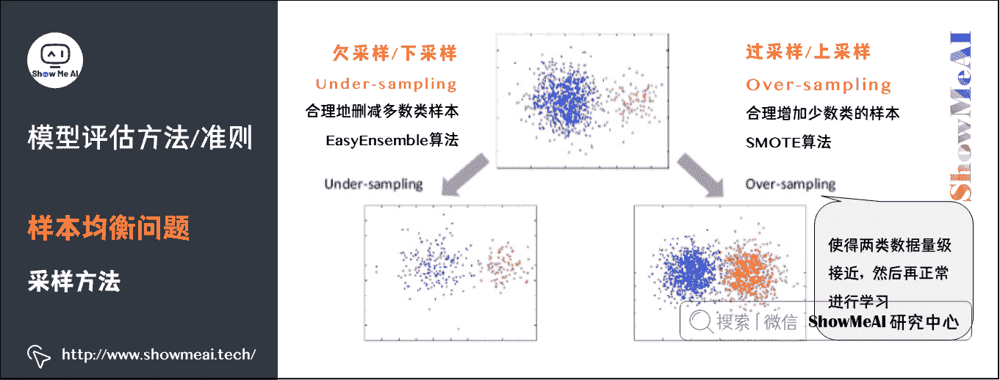

### （1）欠采样 / 下采样

欠采样技术是将数据从原始数据集中移除。

*   从多数类集合中筛选样本集 E。

*   将这些样本从多数类集合中移除。

### （2）过采样 / 上采样

随机过采样：

*   首先在少数类集合中随机选中一些少数类样本。

*   然后通过复制所选样本生成样本集合 E。

*   将它们添加到少数类集合中来扩大原始数据集从而得到新的少数类集合。

我们也有一些少类别样本合成技术方法，比如机器学习中有 SMOTE 算法通过合成新样本完成过采样，缓解样本类别不均衡问题。

### （3）不同采样方法的比较

下采样的缺点显而易见，那就是最终的训练集丢失了数据，模型只学到了总体模式的一部分。而 SMOTE 算法为每个小众样本合成相同数量的新样本，但这也带来一些潜在的问题：

*   一方面是增加了类之间重叠的可能性，即通过算法生成的小众样本并不一定是合理的小众样本。

*   另一方面是生成一些没有提供有益信息的样本。

## 3）加权

除了上采样和下采样这种采样方式以外，还可以通过加权的方式来解决数据不均衡问题，即对不同类别分错的代价不同，对于小众样本，如果分错了会造成更大的损失。这种方法的难点在于设置合理的权重，实际应用中一般让各个分类间的加权损失值近似相等。当然这并不是通用法则，还是需要具体问题具体分析。

## 视频教程

**可以点击 [B 站](https://www.bilibili.com/video/BV1TT4y127Nf?p=8) 查看视频的【双语字幕】版本**

[`player.bilibili.com/player.html?aid=935770612&page=8`](https://player.bilibili.com/player.html?aid=935770612&page=8)

【双语字幕+资料下载】斯坦福 CS229 | 机器学习-吴恩达主讲(2018·完整版)

> **【双语字幕+资料下载】斯坦福 CS229 | 机器学习-吴恩达主讲(2018·完整版)**
> https://www.bilibili.com/video/BV1TT4y127Nf?p=8

## ShowMeAI 相关文章推荐

*   [1.机器学习基础知识](http://www.showmeai.tech/article-detail/185)
*   [2.模型评估方法与准则](http://www.showmeai.tech/article-detail/186)
*   [3.KNN 算法及其应用](http://www.showmeai.tech/article-detail/187)
*   [4.逻辑回归算法详解](http://www.showmeai.tech/article-detail/188)
*   [5.朴素贝叶斯算法详解](http://www.showmeai.tech/article-detail/189)
*   [6.决策树模型详解](http://www.showmeai.tech/article-detail/190)
*   [7.随机森林分类模型详解](http://www.showmeai.tech/article-detail/191)
*   [8.回归树模型详解](http://www.showmeai.tech/article-detail/192)
*   [9.GBDT 模型详解](http://www.showmeai.tech/article-detail/193)
*   [10.XGBoost 模型最全解析](http://www.showmeai.tech/article-detail/194)
*   [11.LightGBM 模型详解](http://www.showmeai.tech/article-detail/195)
*   [12.支持向量机模型详解](http://www.showmeai.tech/article-detail/196)
*   [13.聚类算法详解](http://www.showmeai.tech/article-detail/197)
*   [14.PCA 降维算法详解](http://www.showmeai.tech/article-detail/198)

## ShowMeAI 系列教程推荐

*   [图解 Python 编程：从入门到精通系列教程](http://www.showmeai.tech/tutorials/56)
*   [图解数据分析：从入门到精通系列教程](http://www.showmeai.tech/tutorials/33)
*   [图解 AI 数学基础：从入门到精通系列教程](http://showmeai.tech/tutorials/83)
*   [图解大数据技术：从入门到精通系列教程](http://www.showmeai.tech/tutorials/84)
*   [图解机器学习算法：从入门到精通系列教程](http://www.showmeai.tech/tutorials/34)

