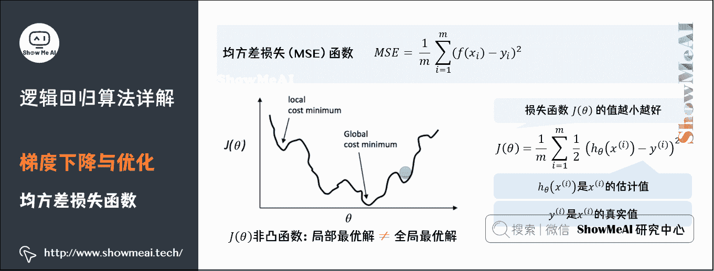

# 图解机器学习 | 逻辑回归算法详解

> 原文：[`blog.csdn.net/ShowMeAI/article/details/123398306`](https://blog.csdn.net/ShowMeAI/article/details/123398306)

作者：[韩信子](https://github.com/HanXinzi-AI)@[ShowMeAI](http://www.showmeai.tech/)
[教程地址](http://www.showmeai.tech/tutorials/34)：[`www.showmeai.tech/tutorials/34`](http://www.showmeai.tech/tutorials/34)
[本文地址](http://www.showmeai.tech/article-detail/188)：[`www.showmeai.tech/article-detail/188`](http://www.showmeai.tech/article-detail/188)
**声明：版权所有，转载请联系平台与作者并注明出处**

* * *

# 引言

本篇内容我们给大家介绍机器学习领域最常见的模型之一：逻辑回归。它也是目前工业界解决问题最广泛作为 baseline 的解决方案。逻辑回归之所以被广泛应用，因为其简单有效且可解释性强。

本文的结构如下：

*   第 1 部分：**回顾机器学习与分类问题**。回顾机器学习中最重要的问题之一分类问题，不同的分类问题及数学抽象。

*   第 2 部分：**逻辑回归核心思想**。介绍线性回归问题及逻辑回归解决方式，讲解逻辑回归核心思想。

*   第 3 部分：**Sigmoid 函数与分类器决策边界**。介绍逻辑回归模型中最重要的 Sigmoid 变换函数，以及不同分类器得到的决策边界。

*   第 4 部分：**模型优化使用的梯度下降算法**。介绍模型参数学习过程中最常使用到的优化算法：梯度下降。

*   第 5 部分：**模型过拟合问题与正则化**。介绍模型状态分析及过拟合问题，以及缓解过拟合问题可以使用的正则化手段。

*   第 6 部分：**特征变换与非线性切分**。介绍由线性分类器到非线性分类场景，对特征可以进行的变换如构建多项式特征，使得分类器得到分线性切分能力。

（本篇逻辑回归算法的部分内容涉及到机器学习基础知识，没有先序知识储备的宝宝可以查看 ShowMeAI 的文章 [图解机器学习 | 机器学习基础知识](http://www.showmeai.tech/article-detail/185)）。

# 1.机器学习与分类问题

## 1）分类问题

分类问题是机器学习非常重要的一个组成部分，它的目标是根据已知样本的某些特征，判断一个样本属于哪个类别。分类问题可以细分如下：

*   **二分类问题**：表示分类任务中有两个类别新的样本属于哪种已知的样本类。

*   **多类分类（Multiclass Classification）问题**：表示分类任务中有多类别。

*   **多标签分类（Multilabel Classification）问题**：给每个样本一系列的目标标签。

## 2）分类问题的数学抽象

从算法的角度解决一个分类问题，我们的训练数据会被映射成 n 维空间的样本点（这里的 n 就是特征维度），我们需要做的事情是对 n 维样本空间的点进行类别区分，某些点会归属到某个类别。

下图所示的是二维平面中的两类样本点，我们的模型（分类器）在学习一种区分不同类别的方法，比如这里是使用一条直线去对 2 类不同的样本点进行切分。

常见的分类问题应用场景很多，我们选择几个进行举例说明：

*   **垃圾邮件识别**：可以作为**二分类**问题，将邮件分为你「垃圾邮件」或者「正常邮件」。

*   **图像内容识别**：因为图像的内容种类不止一个，图像内容可能是猫、狗、人等等，因此是**多类分类**问题。

*   **文本情感分析**：既可以作为**二分类**问题，将情感分为褒贬两种，还可以作为**多类分类**问题，将情感种类扩展，比如分为：十分消极、消极、积极、十分积极等。

# 2.逻辑回归算法核心思想

下面介绍本次要讲解的算法——逻辑回归（Logistic Regression）。逻辑回归是线性回归的一种扩展，用来处理分类问题。

## 1）线性回归与分类

**分类问题和回归问题有一定的相似性，都是通过对数据集的学习来对未知结果进行预测，区别在于输出值不同**。

*   分类问题的输出值是离散值（如垃圾邮件和正常邮件）。

*   回归问题的输出值是连续值（例如房子的价格）。

**既然分类问题和回归问题有一定的相似性，那么我们能不能在回归的基础上进行分类呢**？

可以想到的一种尝试思路是，先用线性拟合，然后对线性拟合的预测结果值进行量化，即将连续值量化为离散值——即**使用『线性回归+阈值』解决分类问题**。

我们来看一个例子。假如现在有一个关于肿瘤大小的数据集，需要根据肿瘤的大小来判定是良性（用数字 0 表示）还是恶性（用数字 1 表示），这是一个很典型的二分类问题。

如上图，目前这个简单的场景我们得到 1 个直观的判定：肿瘤的大小大于 5，即为恶性肿瘤（输出为 1）；肿瘤的大小等于 5，即为良性肿瘤（输出为 0）。
下面我们尝试之前提到的思路，使用一元线性函数 h ( x ) = θ 0 + θ 1 x h(x) = \theta_0+\theta_1x h(x)=θ0​+θ1​x 去进行拟合数据，函数体现在图片中就是这条黑色直线。

这样分类问题就可以转化为：对于这个线性拟合的假设函数，给定一个肿瘤的大小，只要将其带入假设函数，并将其输出值和 0.5 进行比较：

*   如果线性回归值大于 0.5，就输出 1（恶性肿瘤）。

*   如果线性回归值小于 0.5，就输出 0（良性肿瘤）。

上图的数据集中的分类问题被完美解决。但如果将数据集更改一下，如图所示，如果我们还是以 0.5 为判定阈值，那么就会把肿瘤大小为 6 的情况进行误判为良好。

所以，单纯地通过将线性拟合的输出值与某一个阈值进行比较，这种方法用于分类非常不稳定。

## 2）逻辑回归核心思想

因为「线性回归+阈值」的方式很难得到鲁棒性好的分类器，我们对其进行拓展得到鲁棒性更好的逻辑回归（Logistic Regression，有些地方也叫做「对数几率回归」）。逻辑回归将数据拟合到一个 logit 函数中，从而完成对事件发生概率的预测。

如果线性回归的结果输出是一个连续值，而值的范围是无法限定的，这种情况下我们无法得到稳定的判定阈值。那是否可以把这个结果映射到一个固定大小的区间内（比如 0 到 1），进而判断呢。

当然可以，这就是逻辑回归做的事情，而其中用于对连续值压缩变换的函数叫做**Sigmoid 函数**（也称 Logistic 函数，S 函数）。

Sigmoid 数学表达式为

S ( x ) = 1 1 + e − x S(x) = \dfrac{1}{1+e^{-x}} S(x)=1+e−x1​

可以看到 S 函数的输出值在 0 到 1 之间。

# 3.Sigmoid 函数与决策边界

刚才大家见到了 Sigmoid 函数，下面我们来讲讲它和线性拟合的结合，如何能够完成分类问题，并且得到清晰可解释的分类器判定「决策边界」。

## 1）分类与决策边界

决策边界就是分类器对于样本进行区分的边界，主要有**线性决策边界**（linear decision boundaries）和**非线性决策边界**（non-linear decision boundaries），如下图所示。

## 2）线性决策边界生成

那么，逻辑回归是怎么得到决策边界的呢，它与 Sigmoid 函数又有什么关系呢？

如下图中的例子：

如果我们用函数 g 表示 Sigmoid 函数，逻辑回归的输出结果由假设函数 h θ ( x ) = g ( θ 0 + θ 1 x 1 + θ 2 x 2 ) h_{\theta}(x)=g\left(\theta_{0}+\theta_{1} x_{1}+\theta_{2} x_{2}\right) hθ​(x)=g(θ0​+θ1​x1​+θ2​x2​)得到。

对于图中的例子，我们暂时取参数 θ 0 、 θ 1 、 θ 2 \theta_{0}、\theta_{1} 、\theta_{2} θ0​、θ1​、θ2​分别为-3、1 和 1，那么对于图上的两类样本点，我们代入一些坐标到 h θ ( x ) h_{\theta}(x) hθ​(x)，会得到什么结果值呢。

*   对于直线上方的点 ( x 1 , x 2 ) \left ( x_{1}, x_{2} \right ) (x1​,x2​)（例如 ( 100 , 100 ) \left ( 100, 100 \right ) (100,100)），代入 − 3 + x 1 + x 2 -3+ x_{1}+ x_{2} −3+x1​+x2​，得到大于 0 的取值，经过 Sigmoid 映射后得到的是大于 0.5 的取值。

*   对于直线下方的点 ( x 1 , x 2 ) \left ( x_{1}, x_{2} \right ) (x1​,x2​)（例如 ( 0 , 0 ) \left ( 0, 0 \right ) (0,0)），代入 − 3 + x 1 + x 2 -3+ x_{1}+ x_{2} −3+x1​+x2​，得到小于 0 的取值，经过 Sigmoid 映射后得到的是小于 0.5 的取值。

如果我们以 0.5 为判定边界，则线性拟合的直线 − 3 + x 1 + x 2 = 0 -3+ x_{1}+ x_{2} = 0 −3+x1​+x2​=0 变换成了一条决策边界（这里是线性决策边界）。

## 3）非线性决策边界生成

其实，我们不仅仅可以得到线性决策边界，当 h θ ( x ) h_{\theta}(x) hθ​(x)更复杂的时候，我们甚至可以得到对样本非线性切分的非线性决策边界（这里的非线性指的是无法通过直线或者超平面把不同类别的样本很好地切分开）。

如下图中另外一个例子：如果我们用函数 g 表示 Sigmoid 函数，逻辑回归的输出结果由假设函数 h θ ( x ) = g ( θ 0 + θ 1 x 1 + θ 2 x 2 + θ 3 x 1 2 + θ 4 x 2 2 ) h_{\theta}(x)=g\left(\theta_{0}+\theta_{1} x_{1}+\theta_{2} x_{2}+\theta_{3} x_{1}^{2}+\theta_{4} x_{2}^{2}\right) hθ​(x)=g(θ0​+θ1​x1​+θ2​x2​+θ3​x12​+θ4​x22​)得到。

对于图中的例子，我们暂时取参数 θ 0 、 θ 1 、 θ 2 、 θ 3 、 θ 4 \theta_{0} 、\theta_{1} 、\theta_{2} 、\theta_{3} 、\theta_{4} θ0​、θ1​、θ2​、θ3​、θ4​分别为-1、0、0、1 和 1，那么对于图上的两类样本点，我们代入一些坐标到
h θ ( x ) h_{\theta}(x) hθ​(x)，会得到什么结果值呢。

*   对于圆外部的点 ( x 1 , x 2 ) \left ( x_{1}, x_{2} \right ) (x1​,x2​)（例如 ( 100 , 100 ) \left ( 100, 100 \right ) (100,100)），代入 θ 0 + θ 1 x 1 + θ 2 x 2 + θ 3 x 1 2 + θ 4 x 2 2 \theta_{0}+\theta_{1} x_{1}+\theta_{2} x_{2}+\theta_{3} x_{1}^{2}+\theta_{4} x_{2}^{2} θ0​+θ1​x1​+θ2​x2​+θ3​x12​+θ4​x22​，得到大于 0 的取值，经过 Sigmoid 映射后得到的是大于 0.5 的取值。

*   对于圆内部的点 ( x 1 , x 2 ) \left ( x_{1}, x_{2} \right ) (x1​,x2​)（例如 ( 0 , 0 ) \left ( 0, 0 \right ) (0,0)），代入 θ 0 + θ 1 x 1 + θ 2 x 2 + θ 3 x 1 2 + θ 4 x 2 2 \theta_{0}+\theta_{1} x_{1}+\theta_{2} x_{2}+\theta_{3} x_{1}^{2}+\theta_{4} x_{2}^{2} θ0​+θ1​x1​+θ2​x2​+θ3​x12​+θ4​x22​，得到小于 0 的取值，经过 Sigmoid 映射后得到的是小于 0.5 的取值。

如果我们以 0.5 为判定边界，则线性拟合的圆曲线 − 1 + x 1 2 + x 2 2 = 0 -1+x_{1}²+x_{2}²=0 −1+x12​+x22​=0 变换成了一条决策边界（这里是非线性决策边界）。

# 4.梯度下降与优化

## 1）损失函数

前一部分的例子中，我们手动取了一些参数θ的取值，最后得到了决策边界。但大家显然可以看到，取不同的参数时，可以得到不同的决策边界。

**哪一条决策边界是最好的呢**？我们需要定义一个能量化衡量模型好坏的函数——**损失函数**（有时候也叫做「目标函数」或者「代价函数」）。我们的目标是使得损失函数最小化。

我们如何衡量预测值和标准答案之间的差异呢，最简单直接的方式是数学中的均方误差。它的计算方式很简单，对于所有的样本点 x i x_{i} xi​，预测值 h θ ( x i ) h_{\theta}(x_{i}) hθ​(xi​)与标准答案 y i y_{i} yi​作差后平方，求均值即可，这个取值越小代表差异度越小。

M S E = 1 m ∑ i = 1 m ( f ( x i ) − y i ) 2 MSE=\frac{1}{m} \sum_{i=1}^{m}\left(f\left(x_{i}\right)-y_{i}\right)^{2} MSE=m1​i=1∑m​(f(xi​)−yi​)2

均方误差对应的损失函数：均方误差损失（MSE）在回归问题损失定义与优化中广泛应用，但是在逻辑回归问题中不太适用。sigmoid 函数的变换使得我们最终得到损失函数曲线如下图所示，是非常不光滑凹凸不平的，这种数学上叫做**非凸的损失函数**（关于损失函数与凸优化更多知识可以参考 ShowMeAI 的文章 [图解 AI 数学基础 | 微积分与最优化](http://www.showmeai.tech/article-detail/165)），我们要找到最优参数（使得函数取值最小的参数）是很困难的。

解释：在逻辑回归模型场景下，使用 MSE 得到的损失函数是非凸的，数学特性不太好，我们希望损失函数如下的凸函数。凸优化问题中，局部最优解同时也是全局最优解，这一特性使得凸优化问题在一定意义上更易于解决，而一般的非凸最优化问题相比之下更难解决。

我们更希望我们的损失函数如下图所示，是凸函数，我们在数学上有很好优化方法可以对其进行优化。

在逻辑回归模型场景下，我们会改用**对数损失函数**（二元交叉熵损失），这个损失函数同样能很好地衡量参数好坏，又能保证凸函数的特性。对数损失函数的公式如下：

J ( θ ) = − 1 m [ ∑ i = 1 m y ( i ) log ⁡ h θ ( x ( i ) ) + ( 1 − y ( i ) ) log ⁡ ( 1 − h θ ( x ( i ) ) ) ] J(\theta)=-\frac{1}{m}\left[\sum_{i=1}^{m} y^{(i)} \log h_{\theta}\left(x^{(i)}\right)+\left(1-y^{(i)}\right) \log \left(1-h_{\theta}\left(x^{(i)}\right)\right)\right] J(θ)=−m1​[i=1∑m​y(i)loghθ​(x(i))+(1−y(i))log(1−hθ​(x(i)))]

其中 y ( i ) y^{(i)} y(i)表示样本取值，在其为正样本时取值为 1，负样本时取值为 0，我们分这两种情况来看看：

Cost ⁡ ( h θ ( x ) , y ) = { − log ⁡ ( h θ ( x ) )  if  y = 0 − log ⁡ ( 1 − h θ ( x ) )  if  y = 1 \operatorname{Cost}\left(h_{\theta}(x), y\right)=\left\{\begin{array}{ll} -\log \left(h_{\theta}(x)\right) & \text { if } y=0 \\ -\log \left(1-h_{\theta}(x)\right) & \text { if } y=1 \end{array}\right. Cost(hθ​(x),y)={−log(hθ​(x))−log(1−hθ​(x))​ if y=0 if y=1​

- y ( i ) = 0 y^{(i)}=0 y(i)=0：当一个样本为负样本时，若 h θ ( x ) h_{\theta}(x) hθ​(x)的结果接近 1（即预测为正样本），那么 − log ⁡ ( 1 − h θ ( x ) ) - \log \left(1-h_{\theta}\left(x\right)\right) −log(1−hθ​(x))的值很大，那么得到的惩罚就大。

- y ( i ) = 1 y^{(i)}=1 y(i)=1：当一个样本为正样本时，若 h θ ( x ) h_{\theta}(x) hθ​(x)的结果接近 0（即预测为负样本），那么 − log ⁡ ( h θ ( x ) ) - \log \left(h_{\theta}\left(x\right)\right) −log(hθ​(x))的值很大，那么得到的惩罚就大。

## 2）梯度下降

损失函数可以用于衡量模型参数好坏，但我们还需要一些优化方法找到最佳的参数（使得当前的损失函数值最小）。最常见的算法之一是「梯度下降法」，逐步迭代减小损失函数（在凸函数场景下非常容易使用）。如同下山，找准方向（斜率），每次迈进一小步，直至山底。

梯度下降（Gradient Descent）法，是一个一阶最优化算法，通常也称为最速下降法。要使用梯度下降法找到一个函数的局部极小值，必须向函数上当前点对应梯度（或者是近似梯度）的反方向的规定步长距离点进行迭代搜索。

上图中，α称为学习率（learning rate），直观的意义是，在函数向极小值方向前进时每步所走的步长。太大一般会错过极小值，太小会导致迭代次数过多。

（关于损失函数与凸优化更多知识可以参考 ShowMeAI 的文章 图解 AI 数学基础 | 微积分与最优化 http://www.showmeai.tech/article-detail/165，关于监督学习的更多总结可以查看 ShowMeAI 总结的速查表手册 [AI 知识技能速查 | 机器学习-监督学习](http://www.showmeai.tech/article-detail/113)）

# 5.正则化与缓解过拟合

## 1）过拟合现象

在训练数据不够多，或者模型复杂又过度训练时，模型会陷入过拟合（Overfitting）状态。如下图所示，得到的不同拟合曲线（决策边界）代表不同的模型状态：

*   拟合曲线 1 能够将部分样本正确分类，但是仍有较大量的样本未能正确分类，分类精度低，是「欠拟合」状态。

*   拟合曲线 2 能够将大部分样本正确分类，并且有足够的泛化能力，是较优的拟合曲线。

*   拟合曲线 3 能够很好的将当前样本区分开来，但是当新来一个样本时，有很大的可能不能将其正确区分，原因是该决策边界太努力地学习当前的样本点，甚至把它们直接「记」下来了。

拟合曲线中的「抖动」，表示拟合曲线不规则、不光滑（上图中的拟合曲线 3），对数据的学习程度深，过拟合了。

## 2）正则化处理

过拟合的一种处理方式是正则化，我们通过对损失函数添加正则化项，可以约束参数的搜索空间，从而保证拟合的决策边界并不会抖动非常厉害。如下图为对数损失函数中加入正则化项（这里是一个 L2 正则化项）

J ( θ ) = 1 m ∑ i = 1 m [ − y ( i ) log ⁡ ( h θ ( x ( i ) ) ) − ( 1 − y ( i ) ) log ⁡ ( 1 − h θ ( x ( i ) ) ) ] + λ 2 m ∑ j = 1 n θ j 2 J(\theta)=\frac{1}{m} \sum_{i=1}^{m}\left[-y^{(i)} \log \left(h_{\theta}\left(x^{(i)}\right)\right)-\left(1-y^{(i)}\right) \log \left(1-h_{\theta}\left(x^{(i)}\right)\right)\right]+\frac{\lambda}{2 m} \sum_{j=1}^{n} \theta_{j}^{2} J(θ)=m1​i=1∑m​[−y(i)log(hθ​(x(i)))−(1−y(i))log(1−hθ​(x(i)))]+2mλ​j=1∑n​θj2​

其中 λ \lambda λ表示正则化系数，表示惩罚程度， λ \lambda λ的值越大，为使 J ( θ ) J(\theta) J(θ)的值小，则参数 θ \theta θ的绝对值就得越小，通常对应于越光滑的函数，也就是更加简单的函数，因此不易发生过拟合的问题。我们依然可以采用梯度下降对加正则化项的损失函数进行优化。

# 6.特征变换与非线性表达

## 1）多项式特征

对于输入的特征，如果我们直接进行线性拟合再给到 Sigmoid 函数，得到的是线性决策边界。但添加多项式特征，可以对样本点进行多项式回归拟合，也能在后续得到更好的非线性决策边界。

多项式回归，回归函数是回归变量多项式。多项式回归模型是线性回归模型的一种，此时回归函数关于回归系数是线性的。

在实际应用中，通过增加一些输入数据的非线性特征来增加模型的复杂度通常是有效的。一个简单通用的办法是使用多项式特征，这可以获得特征的更高维度和互相间关系的项，进而获得更好的实验结果。

## 2）非线性切分

如下图所示，在逻辑回归中，拟合得到的决策边界，可以通过添加多项式特征，调整为非线性决策边界，具备非线性切分能力。

- Z θ ( x ) Z_{\theta}(x) Zθ​(x)中 θ \theta θ是参数，当 Z θ ( x ) = θ 0 + θ 1 x Z_{\theta}(x) = \theta_{0} + \theta_{1}x Zθ​(x)=θ0​+θ1​x 时，此时得到的是线性决策边界；

- Z θ ( x ) = θ 0 + θ 1 x + θ 2 x 2 Z_{\theta}(x) = \theta_{0} + \theta_{1}x + \theta_{2}x² Zθ​(x)=θ0​+θ1​x+θ2​x2 时，使用了多项式特征，得到的是非线性决策边界。

目的是低维线性不可分的数据转化到高维时，会变成线性可分。得到在高维空间下的线性分割参数映射回低维空间，形式上表现为低维的非线性切分。

更多监督学习的算法模型总结可以查看 ShowMeAI 的文章 [AI 知识技能速查 | 机器学习-监督学习](http://www.showmeai.tech/article-detail/113)。

## 视频教程

**可以点击 [B 站](https://www.bilibili.com/video/BV1y44y187wN?p=4) 查看视频的【双语字幕】版本**

[`player.bilibili.com/player.html?aid=975327190&page=4`](https://player.bilibili.com/player.html?aid=975327190&page=4)

【双语字幕+资料下载】MIT 6.036 | 机器学习导论(2020·完整版)

> **【双语字幕+资料下载】MIT 6.036 | 机器学习导论(2020·完整版)**
> 
> https://www.bilibili.com/video/BV1y44y187wN?p=4

## ShowMeAI 相关文章推荐

*   [1.机器学习基础知识](http://www.showmeai.tech/article-detail/185)
*   [2.模型评估方法与准则](http://www.showmeai.tech/article-detail/186)
*   [3.KNN 算法及其应用](http://www.showmeai.tech/article-detail/187)
*   [4.逻辑回归算法详解](http://www.showmeai.tech/article-detail/188)
*   [5.朴素贝叶斯算法详解](http://www.showmeai.tech/article-detail/189)
*   [6.决策树模型详解](http://www.showmeai.tech/article-detail/190)
*   [7.随机森林分类模型详解](http://www.showmeai.tech/article-detail/191)
*   [8.回归树模型详解](http://www.showmeai.tech/article-detail/192)
*   [9.GBDT 模型详解](http://www.showmeai.tech/article-detail/193)
*   [10.XGBoost 模型最全解析](http://www.showmeai.tech/article-detail/194)
*   [11.LightGBM 模型详解](http://www.showmeai.tech/article-detail/195)
*   [12.支持向量机模型详解](http://www.showmeai.tech/article-detail/196)
*   [13.聚类算法详解](http://www.showmeai.tech/article-detail/197)
*   [14.PCA 降维算法详解](http://www.showmeai.tech/article-detail/198)

## ShowMeAI 系列教程推荐

*   [图解 Python 编程：从入门到精通系列教程](http://www.showmeai.tech/tutorials/56)
*   [图解数据分析：从入门到精通系列教程](http://www.showmeai.tech/tutorials/33)
*   [图解 AI 数学基础：从入门到精通系列教程](http://showmeai.tech/tutorials/83)
*   [图解大数据技术：从入门到精通系列教程](http://www.showmeai.tech/tutorials/84)
*   [图解机器学习算法：从入门到精通系列教程](http://www.showmeai.tech/tutorials/34)

