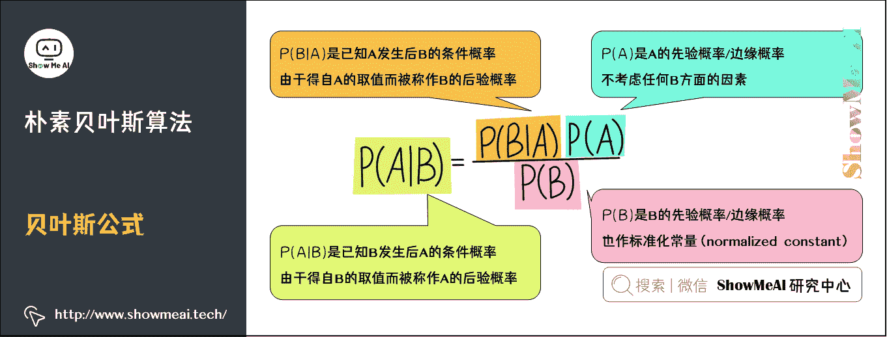
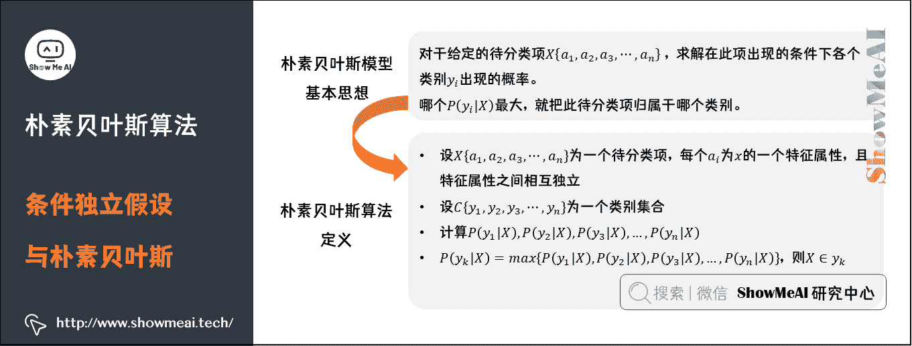
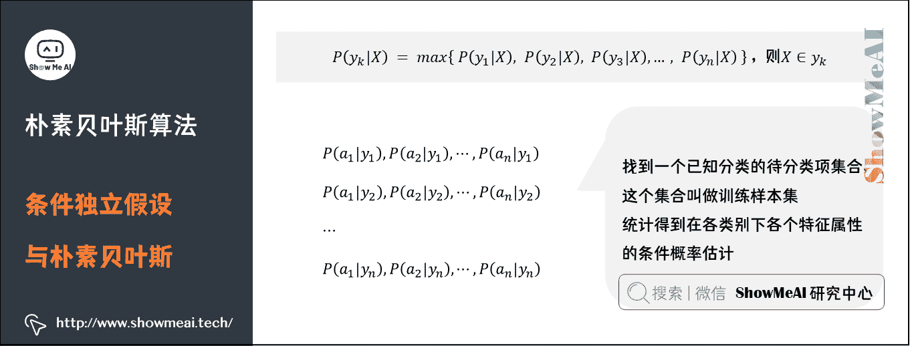
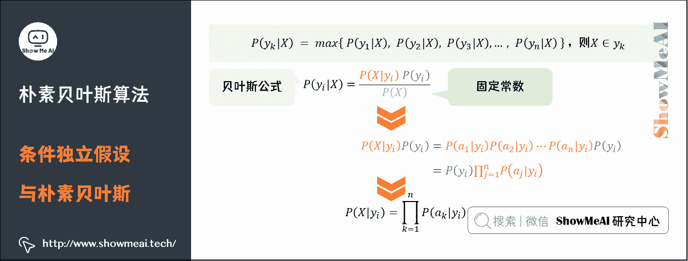
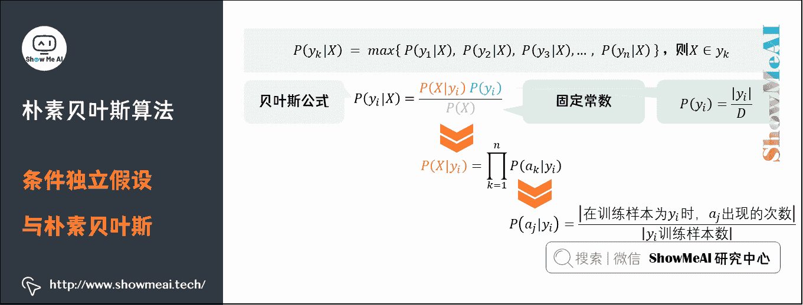
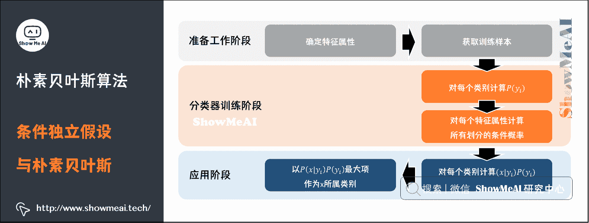
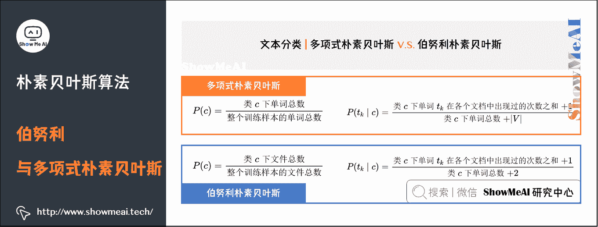
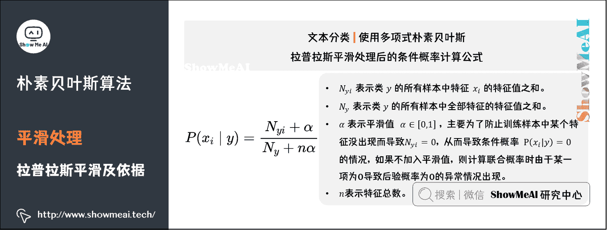

# 图解机器学习 | 朴素贝叶斯算法详解

> 原文：[`blog.csdn.net/ShowMeAI/article/details/123398851`](https://blog.csdn.net/ShowMeAI/article/details/123398851)

作者：[韩信子](https://github.com/HanXinzi-AI)@[ShowMeAI](http://www.showmeai.tech/)
[教程地址](http://www.showmeai.tech/tutorials/34)：[`www.showmeai.tech/tutorials/34`](http://www.showmeai.tech/tutorials/34)
[本文地址](http://www.showmeai.tech/article-detail/189)：[`www.showmeai.tech/article-detail/189`](http://www.showmeai.tech/article-detail/189)
**声明：版权所有，转载请联系平台与作者并注明出处**

# 引言

在众多机器学习分类算法中，本篇我们提到的朴素贝叶斯模型，和其他绝大多数分类算法都不同，也是很重要的模型之一。

在机器学习中如 KNN、逻辑回归、决策树等模型都是判别方法，也就是直接学习出特征输出 Y Y Y 和特征 X X X 之间的关系（决策函数 Y = f ( X ) Y= f(X) Y=f(X)或者条件分布 P ( Y ∣ X ) P(Y|X) P(Y∣X)）。但朴素贝叶斯是生成方法，它直接找出特征输出 Y Y Y 和特征 X X X 的联合分布 P ( X , Y ) P(X,Y) P(X,Y)，进而通过 P ( Y ∣ X ) = P ( X , Y ) P ( X ) P(Y \mid X)= \frac{P(X,Y)}{P(X)} P(Y∣X)=P(X)P(X,Y)​计算得出结果判定。

朴素贝叶斯是一个非常直观的模型，在很多领域有广泛的应用，比如早期的文本分类，很多时候会用它作为 baseline 模型，本篇内容我们对朴素贝叶斯算法原理做展开介绍。

# 1.朴素贝叶斯算法核心思想

**贝叶斯分类是一类分类算法的总称**，这类算法均以贝叶斯定理为基础，故统称为贝叶斯分类。而**朴素贝叶斯（Naive Bayes）分类是贝叶斯分类中最简单，也是常见的一种分类方法**。

朴素贝叶斯算法的核心思想是通过考虑特征概率来预测分类，即对于给出的待分类样本，求解在此样本出现的条件下各个类别出现的概率，哪个最大，就认为此待分类样本属于哪个类别。

**举个例子：眼前有 100 个西瓜，好瓜和坏瓜个数差不多，现在要用这些西瓜来训练一个「坏瓜识别器」，我们要怎么办呢**？

一般挑西瓜时通常要「敲一敲」，听听声音，是清脆声、浊响声、还是沉闷声。所以，我们先简单点考虑这个问题，只用敲击的声音来辨别西瓜的好坏。根据经验，敲击声「清脆」说明西瓜还不够熟，敲击声「沉闷」说明西瓜成熟度好，更甜更好吃。

所以，坏西瓜的敲击声是「清脆」的概率更大，好西瓜的敲击声是「沉闷」的概率更大。当然这并不绝对——我们千挑万选地「沉闷」瓜也可能并没熟，这就是噪声了。当然，在实际生活中，除了敲击声，我们还有其他可能特征来帮助判断，例如色泽、跟蒂、品类等。

**朴素贝叶斯把类似「敲击声」这样的特征概率化，构成一个「西瓜的品质向量」以及对应的「好瓜/坏瓜标签」，训练出一个标准的「基于统计概率的好坏瓜模型」，这些模型都是各个特征概率构成的**。

这样，在面对未知品质的西瓜时，我们迅速获取了特征，分别输入「好瓜模型」和「坏瓜模型」，得到两个概率值。如果「坏瓜模型」输出的概率值大一些，那这个瓜很有可能就是个坏瓜。

# 2.贝叶斯公式与条件独立假设

贝叶斯定理中很重要的概念是**先验概率**、**后验概率**和**条件概率**。（关于这部分依赖的数学知识，大家可以查看 ShowMeAI 的文章 [图解 AI 数学基础 | 概率与统计](http://www.showmeai.tech/article-detail/163)，也可以下载我们的速查手册 [AI 知识技能速查 | 数学基础-概率统计知识](http://www.showmeai.tech/article-detail/118)）

## 1）先验概率与后验概率

**先验概率**：**事件发生前的预判概率**。可以是基于历史数据的统计，可以由背景常识得出，也可以是人的主观观点给出。一般都是单独事件概率。

> 举个例子：如果我们对西瓜的色泽、根蒂和纹理等特征一无所知，按照常理来说，西瓜是好瓜的概率是 60%。那么这个概率 P（好瓜）就被称为先验概率。

**后验概率**：**事件发生后求的反向条件概率**。或者说，基于先验概率求得的反向条件概率。概率形式与条件概率相同。

> 举个例子：假如我们了解到判断西瓜是否好瓜的一个指标是纹理。一般来说，纹理清晰的西瓜是好瓜的概率大一些，大概是 75%。如果把纹理清晰当作一种结果，然后去推测好瓜的概率，那么这个概率 P（好瓜|纹理清晰）就被称为后验概率。

**条件概率**：一个事件发生后另一个事件发生的概率。一般的形式为 P ( B ∣ A ) P(B|A) P(B∣A)表示 A A A 发生的条件下 B B B 发生的概率。

## 2）贝叶斯公式

简单来说，贝叶斯定理（Bayes Theorem，也称贝叶斯公式）是基于假设的先验概率、给定假设下观察到不同数据的概率，提供了一种计算后验概率的方法。在人工智能领域，有一些概率型模型会依托于贝叶斯定理，比如我们今天的主角「朴素贝叶斯模型」。

*   P ( A ) P(A) P(A)是先验概率，一般都是人主观给出的。贝叶斯中的先验概率一般特指它。

*   P ( B ) P(B) P(B)是先验概率，在贝叶斯的很多应用中不重要（因为只要最大后验不求绝对值），需要时往往用全概率公式计算得到。

*   P ( B ∣ A ) P(B \mid A) P(B∣A)是条件概率，又叫似然概率，一般是通过历史数据统计得到。

*   P ( A ∣ B ) P(A \mid B) P(A∣B)是后验概率，一般是我们求解的目标。

## 3）条件独立假设与朴素贝叶斯

基于贝叶斯定理的贝叶斯模型是一类简单常用的分类算法。在「假设待分类项的各个属性相互独立」的情况下，构造出来的分类算法就称为朴素的，即朴素贝叶斯算法。

**所谓「朴素」，是假定所有输入事件之间是相互独立**。进行这个假设是因为独立事件间的概率计算更简单。

朴素贝叶斯模型的基本思想是：对于给定的待分类项 X { a 1 , a 2 , a 3 , ⋯ , a n } X \left\{ a_1,a_2,a_3,⋯,a_n \right\} X{a1​,a2​,a3​,⋯,an​}，求解在此项出现的条件下各个类别 y i y_i yi​出现的概率，哪个 P ( y i ∣ X ) P(y_i |X) P(yi​∣X)最大，就把此待分类项归属于哪个类别。

朴素贝叶斯算法的定义为：设 X { a 1 , a 2 , a 3 , ⋯ , a n } X \left\{ a_1,a_2,a_3,⋯,a_n \right\} X{a1​,a2​,a3​,⋯,an​}为一个待分类项，每个 a i a_{i} ai​为 x 的一个特征属性，且特征属性之间相互独立。设 C { y 1 , y 2 , y 3 , ⋯ , y n } C \left\{ y_1,y_2,y_3,⋯,y_n\right\} C{y1​,y2​,y3​,⋯,yn​}为一个类别集合，计算 P ( y 1 ∣ X ) , P ( y 2 ∣ X ) , P ( y 3 ∣ X ) , … , P ( y n ∣ X ) P\left(y_{1} \mid X\right), P\left(y_{2} \mid X\right), P\left(y_{3} \mid X\right), \ldots, P\left(y_{n} \mid X\right) P(y1​∣X),P(y2​∣X),P(y3​∣X),…,P(yn​∣X)。

P ( y k ∣ X ) = max ⁡ { P ( y 1 ∣ X ) , P ( y 2 ∣ X ) , P ( y 3 ∣ X ) , … , P ( y n ∣ X ) } P\left(y_{k} \mid X\right)=\max \left\{P\left(y_{1} \mid X\right), P\left(y_{2} \mid X\right), P\left(y_{3} \mid X\right), \ldots, P\left(y_{n} \mid X\right)\right\} P(yk​∣X)=max{P(y1​∣X),P(y2​∣X),P(y3​∣X),…,P(yn​∣X)}

则 X ∈ y k X \in y_{k} X∈yk​

要求出第四项中的后验概率 P ( y k ∣ X ) P\left(y_{k} \mid X\right) P(yk​∣X)，就需要分别求出在第三项中的各个条件概率，其步骤是：

*   找到一个已知分类的待分类项集合，这个集合叫做训练样本集

*   统计得到在各类别下各个特征属性的条件概率估计。即

    *   P ( a 1 ∣ y 1 ) , P ( a 2 ∣ y 1 ) , ⋯   , P ( a n ∣ y 1 ) P\left(a_{1} \mid y_{1}\right), P\left(a_{2} \mid y_{1}\right), \cdots, P\left(a_{n} \mid y_{1}\right) P(a1​∣y1​),P(a2​∣y1​),⋯,P(an​∣y1​)
    *   P ( a 1 ∣ y 2 ) , P ( a 2 ∣ y 2 ) , ⋯   , P ( a n ∣ y 2 ) P\left(a_{1} \mid y_{2}\right), P\left(a_{2} \mid y_{2}\right), \cdots, P\left(a_{n} \mid y_{2}\right) P(a1​∣y2​),P(a2​∣y2​),⋯,P(an​∣y2​)
    *   ···
    *   P ( a 1 ∣ y n ) , P ( a 2 ∣ y n ) , ⋯   , P ( a n ∣ y n ) P\left(a_{1} \mid y_{n}\right), P\left(a_{2} \mid y_{n}\right), \cdots, P\left(a_{n} \mid y_{n}\right) P(a1​∣yn​),P(a2​∣yn​),⋯,P(an​∣yn​)

在朴素贝叶斯算法中，待分类项的每个特征属性都是条件独立的，由贝叶斯公式

P ( y i ∣ X ) = P ( X ∣ y i ) P ( y i ) P ( X ) P\left(y_{i} \mid X\right)=\frac{P\left(X \mid y_{i}\right) P\left(y_{i}\right)}{P(X)} P(yi​∣X)=P(X)P(X∣yi​)P(yi​)​

因为分母相当于在数据库中 X X X 存在的概率，所以对于任何一个待分类项来说 P ( X ) P\left(X \right) P(X)都是常数固定的。再求后验概率 P ( y i ∣ X ) P\left(y_{i} \mid X\right) P(yi​∣X)的时候只用考虑分子即可。

因为各特征值是独立的所以有：

P ( X ∣ y i ) P ( y i ) = P ( a 1 ∣ y i ) P ( a 2 ∣ y i ) ⋯ P ( a n ∣ y i ) P ( y i ) = P ( y i ) ∏ j = 1 n P ( a j ∣ y i ) \begin{aligned} P\left(X \mid y_{i}\right) P\left(y_{i}\right) &=P\left(a_{1} \mid y_{i}\right) P\left(a_{2} \mid y_{i}\right) \cdots P\left(a_{n} \mid y_{i}\right) P\left(y_{i}\right) \\ &=P\left(y_{i}\right) \prod_{j=1}^{n} P\left(a_{j} \mid y_{i}\right) \end{aligned} P(X∣yi​)P(yi​)​=P(a1​∣yi​)P(a2​∣yi​)⋯P(an​∣yi​)P(yi​)=P(yi​)j=1∏n​P(aj​∣yi​)​

可以推出：

P ( X ∣ y i ) = ∏ k = 1 n P ( a k ∣ y i ) P\left(X \mid y_{i}\right)=\prod_{{k=1}}^{n} P\left(a_{k} \mid y_{i}\right) P(X∣yi​)=k=1∏n​P(ak​∣yi​)

对于 P ( y i ) P\left(y_{i}\right) P(yi​)是指在训练样本中 y i y_{i} yi​出现的概率，可以近似的求解为：

P ( y i ) = ∣ y i ∣ D P\left(y_{i}\right)=\frac{\left|y_{i}\right|}{D} P(yi​)=D∣yi​∣​

对于先验概率 P ( a j ∣ y i ) P\left ( a_{j} \mid y_{i} \right ) P(aj​∣yi​)，是指在类别 y i y_{i} yi​中，特征元素 a j a_{j} aj​出现的概率，可以求解为：

P ( a j ∣ y i ) = ∣ 在 训 练 样 本 为 y i 时 ， a j 出 现 的 次 数 ∣ ∣ y i 训 练 样 本 数 ∣ P\left ( a_{j} \mid y_{i} \right ) = \frac{\left | 在训练样本为 y_{i} 时，a_{j} 出现的次数 \right | }{\left | y_{i} 训练样本数 \right | } P(aj​∣yi​)=∣yi​训练样本数∣∣在训练样本为 yi​时，aj​出现的次数∣​

总结一下，朴素贝叶斯模型的分类过程如下流程图所示：

# 3.伯努利与多项式朴素贝叶斯

## 1）多项式 vs 伯努利朴素贝叶斯

大家在一些资料中，会看到「多项式朴素贝叶斯」和「伯努利朴素贝叶斯」这样的细分名称，我们在这里基于文本分类来给大家解释一下：

在文本分类的场景下使用朴素贝叶斯，那对应的特征 a j a_j aj​就是单词，对应的类别标签就是 y y y，这里有一个问题：每个单词会出现很多次，我们对于频次有哪些处理方法呢？

*   如果直接以**单词的频次**参与统计计算，那就是**多项式**朴素贝叶斯的形态。

*   如果以**是否出现(0 和 1)**参与统计计算，就是**伯努利**朴素贝叶斯的形态。

### （1）多项式朴素贝叶斯

以文本分类为例，多项式模型如下。在多项式模型中，设某文档 d = ( t 1 , t 2 , … , t k ) d=\left(t_{1}, t_{2}, \ldots, t_{k}\right) d=(t1​,t2​,…,tk​)， t k t_{k} tk​是该文档中出现过的单词，允许重复，则：

先验概率

P ( c ) = 类 c 下 单 词 总 数 整 个 训 练 样 本 的 单 词 总 数 P\left ( c \right ) = \frac{类 c 下单词总数}{整个训练样本的单词总数} P(c)=整个训练样本的单词总数类 c 下单词总数​

类条件概率

P ( t k ∣ c ) = 类 c 下 单 词 t k 在 各 个 文 档 中 出 现 过 的 次 数 之 和 + 1 类 c 下 单 词 总 数 + ∣ V ∣ P\left ( t_{k} \mid c \right ) = \frac{类 c 下单词 t_{k}在各个文档中出现过的次数之和+1}{类 c 下单词总数+\left | V \right |} P(tk​∣c)=类 c 下单词总数+∣V∣类 c 下单词 tk​在各个文档中出现过的次数之和+1​

*   V V V 是训练样本的单词表（即抽取单词，单词出现多次，只算一个）， ∣ V ∣ \left | V \right | ∣V∣则表示训练样本包含多少种单词。

*   P ( t k ∣ c ) P\left ( t_{k} \mid c \right ) P(tk​∣c)可以看作是单词 t k t_{k} tk​在证明 d d d 属于类 c c c 上提供了多大的证据，而 P ( c ) P \left ( c \right ) P(c)则可以认为是类别 c c c 在整体上占多大比例（有多大可能性）。

### （2）伯努利朴素贝叶斯

对应的，在伯努利朴素贝叶斯里，我们假设各个特征在各个类别下是服从 n 重伯努利分布（二项分布）的，因为伯努利试验仅有两个结果，因此，算法会首先对特征值进行二值化处理（假设二值化的结果为 1 与 0）。

对应的 P ( c ) P \left ( c \right ) P(c)和 P ( t k ∣ c ) P\left ( t_{k} \mid c \right ) P(tk​∣c)计算方式如下（注意到分子分母的变化）：

P ( c ) = 类 c 下 文 件 总 数 整 个 训 练 样 本 的 文 件 总 数 P \left ( c \right )=\frac{类 c 下文件总数}{整个训练样本的文件总数} P(c)=整个训练样本的文件总数类 c 下文件总数​

P ( t k ∣ c ) = 类 c 下 单 词 t k 在 各 个 文 档 中 出 现 过 的 次 数 之 和 + 1 类 c 下 单 词 总 数 + 2 P\left ( t_{k} \mid c \right ) = \frac{类 c 下单词 t_{k}在各个文档中出现过的次数之和+1}{类 c 下单词总数+2} P(tk​∣c)=类 c 下单词总数+2 类 c 下单词 tk​在各个文档中出现过的次数之和+1​

## 2）朴素贝叶斯与连续值特征

我们发现在之前的概率统计方式，都是基于离散值的。如果遇到连续型变量特征，怎么办呢？

以人的身高，物体的长度为例。一种处理方式是：把它转换成离散型的值。比如：

*   如果身高在 160cm 以下，特征值为 1；
*   在 160cm 和 170cm 之间，特征值为 2；
*   在 170cm 之上，特征值为 3。

当然有不同的转换方法，比如还可以：

*   将身高转换为 3 个特征，分别是 f1、f2、f3；
*   如果身高是 160cm 以下，这三个特征的值分别是 1、0、0；
*   若身高在 170cm 之上，这三个特征的值分别是 0、0、1。

但是，以上的划分方式，都比较粗糙，划分的规则也是人为拟定的，且在同一区间内的样本（比如第 1 套变换规则下，身高 150 和 155）难以区分，我们有高斯朴素贝叶斯模型可以解决这个问题。

如果特征 x i x_{i} xi​是连续变量，如何去估计似然度 P ( x i ∣ y k ) P\left ( x_{i}\mid y_{k} \right ) P(xi​∣yk​)呢？高斯模型是这样做的：我们假设在 y i y_{i} yi​的条件下， x x x 服从高斯分布（正态分布）。根据正态分布的概率密度函数即可计算出 P ( x ∣ y i ) P\left ( x \mid y_{i} \right ) P(x∣yi​)，公式如下：

P ( x i ∣ y k ) = 1 2 π σ y k , i 2 e − ( x i − μ y k , i ) 2 2 σ y k , i 2 P\left(x_{i} \mid y_{k}\right)=\frac{1}{\sqrt{2 \pi \sigma_{y k, i}^{2}}} e^{-\frac{\left(x_{i}-\mu_{y k, i}\right)^{2}}{2 \sigma_{y k, i}^{2}}} P(xi​∣yk​)=2πσyk,i2​  ​1​e−2σyk,i2​(xi​−μyk,i​)2​

回到上述例子，如果身高是我们判定人性别（男/女）的特征之一，我们可以假设男性和女性的身高服从正态分布，通过样本计算出身高均值和方差，对应上图中公式就得到正态分布的密度函数。有了密度函数，遇到新的身高值就可以直接代入，算出密度函数的值。

# 4.平滑处理

## 1）为什么需要平滑处理

使用朴素贝叶斯，有时候会面临零概率问题。零概率问题，指的是在计算实例的概率时，如果某个量 x x x，在观察样本库（训练集）中没有出现过，会导致整个实例的概率结果是 0。

在文本分类的问题中，当「一个词语没有在训练样本中出现」时，这个词基于公式统计计算得到的条件概率为 0，使用连乘计算文本出现概率时也为 0。这是不合理的，不能因为一个事件没有观察到就武断的认为该事件的概率是 0。

## 2）拉普拉斯平滑及依据

为了解决零概率的问题，法国数学家拉普拉斯最早提出用加 1 的方法估计没有出现过的现象的概率，所以加法平滑也叫做拉普拉斯平滑。

假定训练样本很大时，每个分量 x 的计数加 1 造成的估计概率变化可以忽略不计，但可以方便有效的避免零概率问题。

对应到文本分类的场景中，如果使用多项式朴素贝叶斯，假定特征 x i x_{i} xi​表示某个词在样本中出现的次数（当然用 TF-IDF 表示也可以）。拉普拉斯平滑处理后的条件概率计算公式为：

P ( x i ∣ y ) = N y i + α N y + n α P\left(x_{i} \mid y\right) =\frac{N_{y i}+\alpha}{N_{y}+n \alpha} P(xi​∣y)=Ny​+nαNyi​+α​

*   N y i N_{yi} Nyi​表示类 y y y 的所有样本中特征 x i x_{i} xi​的特征值之和。

*   N y N_{y} Ny​表示类 y y y 的所有样本中全部特征的特征值之和。

*   α \alpha α表示平滑值（ α ∈ [ 0 , 1 ] \alpha \in \left [ 0, 1 \right ] α∈[0,1]，主要为了防止训练样本中某个特征没出现而导致 N y i = 0 N_{yi} =0 Nyi​=0，从而导致条件概率 P ( x i ∣ y ) = 0 P\left(x_{i} \mid y\right) = 0 P(xi​∣y)=0 的情况，如果不加入平滑值，则计算联合概率时由于某一项为 0 导致后验概率为 0 的异常情况出现。

*   n n n 表示特征总数。

更多监督学习的算法模型总结可以查看 ShowMeAI 的文章 [AI 知识技能速查 | 机器学习-监督学习](http://www.showmeai.tech/article-detail/113)。

## ShowMeAI 相关文章推荐

*   [1.机器学习基础知识](http://www.showmeai.tech/article-detail/185)
*   [2.模型评估方法与准则](http://www.showmeai.tech/article-detail/186)
*   [3.KNN 算法及其应用](http://www.showmeai.tech/article-detail/187)
*   [4.逻辑回归算法详解](http://www.showmeai.tech/article-detail/188)
*   [5.朴素贝叶斯算法详解](http://www.showmeai.tech/article-detail/189)
*   [6.决策树模型详解](http://www.showmeai.tech/article-detail/190)
*   [7.随机森林分类模型详解](http://www.showmeai.tech/article-detail/191)
*   [8.回归树模型详解](http://www.showmeai.tech/article-detail/192)
*   [9.GBDT 模型详解](http://www.showmeai.tech/article-detail/193)
*   [10.XGBoost 模型最全解析](http://www.showmeai.tech/article-detail/194)
*   [11.LightGBM 模型详解](http://www.showmeai.tech/article-detail/195)
*   [12.支持向量机模型详解](http://www.showmeai.tech/article-detail/196)
*   [13.聚类算法详解](http://www.showmeai.tech/article-detail/197)
*   [14.PCA 降维算法详解](http://www.showmeai.tech/article-detail/198)

## ShowMeAI 系列教程推荐

*   [图解 Python 编程：从入门到精通系列教程](http://www.showmeai.tech/tutorials/56)
*   [图解数据分析：从入门到精通系列教程](http://www.showmeai.tech/tutorials/33)
*   [图解 AI 数学基础：从入门到精通系列教程](http://showmeai.tech/tutorials/83)
*   [图解大数据技术：从入门到精通系列教程](http://www.showmeai.tech/tutorials/84)
*   [图解机器学习算法：从入门到精通系列教程](http://www.showmeai.tech/tutorials/34)

