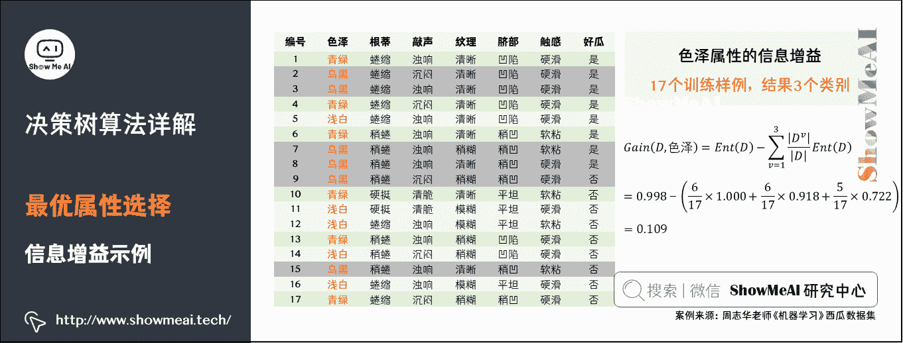

# 图解机器学习 | 决策树模型详解

> 原文：[`blog.csdn.net/ShowMeAI/article/details/123399487`](https://blog.csdn.net/ShowMeAI/article/details/123399487)

作者：[韩信子](https://github.com/HanXinzi-AI)@[ShowMeAI](http://www.showmeai.tech/)
[教程地址](http://www.showmeai.tech/tutorials/34)：[`www.showmeai.tech/tutorials/34`](http://www.showmeai.tech/tutorials/34)
[本文地址](http://www.showmeai.tech/article-detail/190)：[`www.showmeai.tech/article-detail/190`](http://www.showmeai.tech/article-detail/190)
**声明：版权所有，转载请联系平台与作者并注明出处**

* * *

# 引言

决策树（Decision Tree）是机器学习中一种经典的分类与回归算法。在本篇中我们讨论用于分类的决策树的原理知识。决策树模型呈树形结构，在分类问题中，一颗决策树可以视作 if-then 规则的集合。模型具有可读性，分类速度快的特点，在各种实际业务建模过程中广泛使用。

（本篇内容会涉及到不少机器学习基础知识，没有先序知识储备的宝宝可以查看 ShowMeAI 的文章 [图解机器学习 | 机器学习基础知识](http://www.showmeai.tech/article-detail/185)。

# 1.决策树算法核心思想

## 1）决策树结构与核心思想

决策树（Decision tree）是基于已知各种情况（特征取值）的基础上，通过构建树型决策结构来进行分析的一种方式，是常用的有监督的分类算法。

**决策树模型（Decision Tree model）模拟人类决策过程**。以买衣服为例，一个顾客在商店买裤子，于是有了下面的对话：

决策树是一种预测模型，代表的是对象属性与对象值之间的映射关系。决策树是一种树形结构，其中：

*   每个内部结点表示一个属性的测试
*   每个分支表示一个测试输出
*   每个叶结点代表一种类别

> 如上图买衣服的例子，第一个「内部结点」对应于属性「材料」上的测试，两个分支分别是该属性取值为「牛仔」和「非牛仔」两种可能结果。当取值为「牛仔」时，则对下个属性「裤型」进行测试；若取值为「非牛仔」时，则对应于「叶结点」——「不买」。

**决策树模型核心**是下面几部分：

*   结点和有向边组成。
*   结点有内部结点和叶结点俩种类型。
*   内部结点表示一个特征，叶结点表示一个类。

## 2）决策树的发展史

决策树在发展过程中，有过很多不同类型的模型，典型的模型如 ID3、C4.5 和 CART 等，下面我们来简单介绍一下发展史中不同的模型。

# 2.决策树生长与最优属性的选择

上面介绍的决策树发展史里，大家对于不同的决策树模型有一个基础的理解了，下面一部分，我们来一起看一下决策树是如何生长构成的。

## 1）决策树生长流程

决策树的决策过程就是从根结点开始，测试待分类项中对应的特征属性，并按照其值选择输出分支，直到叶子结点，将叶子结点的存放的类别作为决策结果。**简单说来，决策树的总体流程是自根至叶的递归过程，在每个中间结点寻找一个「划分」（split or test）属性**。

如下图的伪代码，是详细的决策树生长（构建）流程。大家可以特别注意图中 3 类终止条件和返回的结果，而整个流程中，有非常核心的一步是「**最优划分属性的选择**」。

决策树停止生长的三个条件：

## 2）最优属性选择

下面我们来看看，决策树的最优划分属性选择，是怎么做的。

### （1）信息熵

要了解决策树的「最优属性」选择，我们需要先了解一个信息论的概念「**信息熵（entropy）**」（相关知识可以参考 ShowMeAI 文章 [图解 AI 数学基础 | 信息论](http://www.showmeai.tech/article-detail/164)），它是消除不确定性所需信息量的度量，也是未知事件可能含有的信息量，可以度量样本集合「纯度」。

对应到机器学习中，假定当前数据集 D D D 中有 y y y 类，其中第 k k k 类样本占比为 p k p_{k} pk​，则信息熵的计算公式如下：

E n t ( D ) = − ∑ K = 1 ∣ y ∣ p k log ⁡ 2 p k Ent(D) = -\sum_{K=1}^{\left | y \right | } p_{k} \log_{2}{p_{k}} Ent(D)=−K=1∑∣y∣​pk​log2​pk​

但 p k p_{k} pk​取值为 1 的时候，信息熵为 0（很显然这时候概率 1 表示确定事件，没有任何不确定性）；而当 p k p_{k} pk​是均匀分布的时候，信息熵取最大值 log ⁡ ( ∣ y ∣ ) \log(|y|) log(∣y∣)（此时所有候选同等概率，不确定性最大）。

### （2）信息增益

大家对信息熵有了解后，我们就可以进一步了解信息增益（Information Gain），它衡量的是我们**选择某个属性进行划分时信息熵的变化**（可以理解为基于这个规则划分，不确定性降低的程度）。

Gain ⁡ ( D , a ) = Ent ⁡ ( D ) − ∑ v = 1 v ∣ D v ∣ ∣ D ∣ Ent ⁡ ( D v ) \operatorname{Gain}(D, a)=\operatorname{Ent}(D)-\sum_{v=1}^{v} \frac{\left|D^{v}\right|}{|D|} \operatorname{Ent}\left(D^{v}\right) Gain(D,a)=Ent(D)−v=1∑v​∣D∣∣Dv∣​Ent(Dv)

信息增益描述了一个特征带来的信息量的多少。在决策树分类问题中，信息增益就是决策树在进行属性选择划分前和划分后的信息差值。典型的决策树算法 ID3 就是基于信息增益来挑选每一节点分支用于划分的属性（特征）的。

这里以西瓜数据集为例。

*   数据集分为好瓜、坏瓜，所以 ∣ y ∣ = 2 |y|=2 ∣y∣=2。
*   根结点包含 17 个训练样例，其中好瓜共计 8 个样例，所占比例为 8/17。
*   坏瓜共计 9 个样例，所占比例为 9/17。

将数据带入信息熵公式，即可得到根结点的信息熵。

以属性「色泽」为例，其对应的 3 个数据子集：

*   D 1 ( 色 泽 = 青 绿 ) D1(色泽=青绿) D1(色泽=青绿)，包含{1,4,6,10,13,17}，6 个样例，其中好瓜样例为 { 1 , 4 , 6 } \left \{ 1,4,6 \right \} {1,4,6}，比例为 3/6，坏瓜样例为 { 10 , 13 , 17 } \left \{ 10,13,17 \right \} {10,13,17}，比例为 3/6。将数据带入信息熵计算公式即可得到该结点的信息熵。

*   D 2 ( 色 泽 = 乌 黑 ) D2(色泽=乌黑) D2(色泽=乌黑)，包含 { 2 , 3 , 7 , 8 , 9 , 15 } \left \{ 2,3,7,8,9,15 \right \} {2,3,7,8,9,15}，6 个样例，其中好瓜样例为 { 2 , 3 , 7 , 8 } \left \{ 2,3,7,8 \right \} {2,3,7,8}，比例为 4/6，坏瓜样例为 { 9 , 15 } \left \{ 9,15 \right \} {9,15}，比例为 2/6。将数据带入信息熵计算公式即可得到该结点的信息熵。

*   D 3 ( 色 泽 = 浅 白 ) D3(色泽=浅白) D3(色泽=浅白)，包含 { 5 , 11 , 12 , 14 , 16 } \left \{ 5,11,12,14,16 \right \} {5,11,12,14,16}，5 个样例，其中好瓜样例为 { 5 } \left \{ 5 \right \} {5}，比例为 1/5，坏瓜样例为 { 11 , 12 , 14 , 16 } \left \{ 11,12,14,16 \right \} {11,12,14,16}，比例为 4/5。将数据带入信息熵计算公式即可得到该结点的信息熵。

色泽属性的信息增益为：

同样的方法，计算其他属性的信息增益为：

对比不同属性，我们发现「纹理」信息增益最大，其被选为划分属性：清晰 { 1 , 2 , 3 , 4 , 5 , 6 , 8 , 10 , 15 } \left \{ 1,2,3,4,5,6,8,10,15 \right \} {1,2,3,4,5,6,8,10,15}、稍糊 { 7 , 9 , 13 , 14 , 17 } \left \{ 7,9,13,14,17 \right \} {7,9,13,14,17}、模糊 { 11 , 12 , 16 } \left \{ 11,12,16 \right \} {11,12,16}。

再往下一步，我们看看「纹理」=「清晰」的节点分支，该节点包含的样例集合 D1 中有编号为 { 1 , 2 , 3 , 4 , 5 , 6 , 8 , 10 , 15 } \left \{ 1,2,3,4,5,6,8,10,15 \right \} {1,2,3,4,5,6,8,10,15}共计 9 个样例，可用属性集合为 { 色 泽 , 根 蒂 , 敲 声 , 脐 部 , 触 感 } \left \{ 色泽,根蒂,敲声,脐部,触感 \right \} {色泽,根蒂,敲声,脐部,触感}（此时「纹理」不再作为划分属性），我们同样的方式再计算各属性的信息增益为：

从上图可以看出「根蒂」、「脐部」、「触感」3 个属性均取得了最大的信息增益，可用任选其一作为划分属性。同理，对每个分支结点进行类似操作，即可得到最终的决策树。

### （3）信息增益率（Gain Ratio）

大家已经了解了信息增益作为特征选择的方法，但信息增益有一个问题，它偏向取值较多的特征。原因是，当特征的取值较多时，根据此特征划分更容易得到纯度更高的子集，因此划分之后的熵更低，由于划分前的熵是一定的。因此信息增益更大，因此信息增益比较偏向取值较多的特征。

那有没有解决这个小问题的方法呢？有的，这就是我们要提到信息增益率（Gain Ratio），信息增益率相比信息增益，多了一个衡量本身属性的分散程度的部分作为分母，而著名的决策树算法 C4.5 就是使用它作为划分属性挑选的原则。

信息增益率的计算细节如下所示：

Gain ⁡ − ratio ⁡ ( D , a ) = Gain ⁡ ( D , a ) IV ⁡ ( a ) \operatorname{Gain}_{-} \operatorname{ratio}(D, a)=\frac{\operatorname{Gain}(D, a)}{\operatorname{IV}(a)} Gain−​ratio(D,a)=IV(a)Gain(D,a)​

I V ( a ) = − ∑ v = 1 V ∣ D v ∣ ∣ D ∣ log ⁡ 2 ∣ D v ∣ ∣ D ∣ IV(a)=-\sum_{v=1}^{V} \frac{\left|D^{v}\right|}{|D|} \log _{2} \frac{\left|D^{v}\right|}{|D|} IV(a)=−v=1∑V​∣D∣∣Dv∣​log2​∣D∣∣Dv∣​

数学上用于信息量（或者纯度）衡量的不止有上述的熵相关的定义，我们还可以使用基尼指数来表示数据集的不纯度。基尼指数越大，表示数据集越不纯。

基尼指数（Gini Index）的详细计算方式如下所示：

Gini ⁡ ( D ) = ∑ k = 1 ∣ y ∣ ∑ k ′ ≠ k p k p k ′ = 1 − ∑ k = 1 ∣ y ∣ p k 2 \operatorname{Gini}(D)=\sum_{k=1}^{|y|} \sum_{k \prime \neq k} p_{k} p_{k^{\prime}}=1-\sum_{k=1}^{|y|} p_{k}^{2} Gini(D)=k=1∑∣y∣​k′​=k∑​pk​pk′​=1−k=1∑∣y∣​pk2​

其中， p k p_k pk​表示第 k k k 类的数据占总数据的比例，著名的决策树算法 CART 就是使用基尼指数来进行划分属性的挑选（当然，CART 本身是二叉树结构，这一点和上述的 ID3 和 C4.5 不太一样）。

对于基尼指数的一种理解方式是，之所以它可以用作纯度的度量，大家可以想象在一个漆黑的袋里摸球，有不同颜色的球，其中第 k 类占比记作 p k p_k pk​，那两次摸到的球都是第 k 类的概率就是 p k 2 p_k² pk2​，那两次摸到的球颜色不一致的概率就是 1 − Σ p k 2 1-Σp_k² 1−Σpk2​，它的取值越小，两次摸球颜色不一致的概率就越小，纯度就越高。

# 3.过拟合与剪枝

如果我们让决策树一直生长，最后得到的决策树可能很庞大，而且因为对原始数据学习得过于充分会有过拟合的问题。缓解决策树过拟合可以通过剪枝操作完成。而剪枝方式又可以分为：预剪枝和后剪枝。

## 1）决策树与剪枝操作

为了尽可能正确分类训练样本，有可能造成分支过多，造成过拟合。过拟合是指训练集上表现很好，但是在测试集上表现很差，泛化性能差。**可以通过剪枝主动去掉一些分支来降低过拟合的风险，并使用「留出法」进行评估剪枝前后决策树的优劣**。

基本策略包含「预剪枝」和「后剪枝」两个：

*   **预剪枝**（**pre-pruning**）：在决策树生长过程中，对每个结点在划分前进行估计，若当前结点的划分不能带来决策树泛化性能的提升，则停止划分并将当前结点标记为叶结点。

*   **后剪枝**（**post-pruning**）：先从训练集生成一颗完整的决策树，然后自底向上地对非叶结点进行考察，若将该结点对应的子树替换为叶结点能带来决策树泛化性能的提升，则将该子树替换为叶结点。

## 2）预剪枝与后剪枝案例

我们来看一个例子，下面的数据集，为了评价决策树模型的表现，会划分出一部分数据作为验证集。

在上述西瓜数据集上生成的一颗完整的决策树，如下图所示。

### （1）预剪枝

「预剪枝」过程如下：将其标记为叶结点，类别标记为训练样例中最多的类别。

*   若选「好瓜」，验证集中{4,5,8}被分类正确，得到验证集精度为 3/7x100%=42.9%

*   根据结点②③④的训练样例，将这 3 个结点分别标记为「好瓜」、「好瓜」、「坏瓜」。此时，验证集中编号为{4,5,8,11,12}的样例被划分正确，验证集精度为 5/7x100%=71.4%

    *   结点 2（好瓜）：分类正确：{4,5}，分类错误：{13}
    *   结点 3（好瓜）：分类正确：{8}，分类错误：{9}
    *   结点 4（坏瓜）：分类正确：{11,12}

若划分后的验证集精度下降，则拒绝划分。对结点②③④分别进行剪枝判断，结点②③都禁止划分，结点④本身为叶子结点。

根据预剪枝方法，此处生成了一层决策树。这种最终得到仅有一层划分的决策树，称为「决策树桩」（decision stump）。

### （2）后剪枝

我们在生成的完整决策树上进行「后剪枝」：

*   用验证集的数据对该决策树进行评估，样例 { 4 , 11 , 12 } \left \{4,11,12 \right \} {4,11,12}分类正确，而样例 { 5 , 8 , 9 , 13 } \left \{5,8,9,13 \right \} {5,8,9,13}分类错误，此时的精度为 42.9%。

*   当对该决策树进行后剪枝，结点⑥的标记为好瓜，此时样例 { 4 , 8 , 11 , 12 } \left \{4,8,11,12 \right \} {4,8,11,12}分类正确，样例 { 5 , 9 , 13 } \left \{5,9,13 \right \} {5,9,13}分类错误，精度为 57.1%。

剪枝后的精度提升了，因此该决策树需要在结点⑥处进行剪枝。

考虑结点⑤，若将其替换为叶结点，根据落在其上的训练样例 { 6 , 7 , 15 } \left \{ 6,7,15 \right \} {6,7,15}将其标记为「好瓜」，测得验证集精度仍为 57.1%，可以不剪枝。

考虑结点②，若将其替换为叶结点，根据落在其上的训练样例 { 1 , 2 , 3 , 14 } \left \{ 1,2,3,14 \right \} {1,2,3,14}将其标记为「好瓜」，测得验证集精度提升至 71.4%，决定剪枝。

对结点③和①，若将其子树替换为叶结点，则所得决策树的验证集精度分布为 71.4%和 42.9%，均未提高，所以不剪枝。得到最终后剪枝之后的决策树。

## 3）预剪枝与后剪枝的特点

**时间开销**：

*   预剪枝：训练时间开销降低，测试时间开销降低。
*   后剪枝：训练时间开销增加，测试时间开销降低。

**过/欠拟合风险**：

*   预剪枝：过拟合风险降低，欠拟合风险增加。
*   后剪枝：过拟合风险降低，欠拟合风险基本不变。

**泛化性能**：后剪枝通常优于预剪枝。

# 4.连续值与缺失值的处理

## 1）连续值处理

我们用于学习的数据包含了连续值特征和离散值特征，之前的例子中使用的都是离散值属性（特征），决策树当然也能处理连续值属性，我们来看看它的处理方式。

对于**离散取值的特征**，决策树的划分方式是：选取一个最合适的特征属性，然后将集合按照这个特征属性的不同值划分为多个子集合，并且不断的重复这种操作的过程。

对于**连续值属性**，显然我们不能以这些离散值直接进行分散集合，否则每个连续值将会对应一种分类。那我们如何把连续值属性参与到决策树的建立中呢？

因为连续属性的可取值数目不再有限，因此需要连续属性离散化处理，**常用的离散化策略是二分法**，这个技术也是 C4.5 中采用的策略。

具体的二分法处理方式如下图所示：

注意：与离散属性不同，若当前结点划分属性为连续属性，该属性还可以作为其后代结点的划分属性。

## 2）缺失值处理

原始数据很多时候还会出现缺失值，决策树算法也能有效的处理含有缺失值的数据。使用决策树建模时，处理缺失值需要解决 2 个问题：

*   **Q1：如何进行划分属性选择**？

*   **Q2：给定划分属性，若样本在该属性上的值缺失，如何进行划分**？

缺失值处理的基本思路是：样本赋权，权重划分。我们来通过下图这份有缺失值的西瓜数据集，看看具体处理方式。

仅通过无缺失值的样例来判断划分属性的优劣，学习开始时，根结点包含样例集 D 中全部 17 个样例，权重均为 1。

*   根结点选择「色泽」属性时，有 3 个缺失值，因此样例总数为 14。

*   此时好瓜样例为 { 2 , 3 , 4 , 6 , 7 , 8 } \left \{2,3,4,6,7,8\right \} {2,3,4,6,7,8}，比例为 6/14，坏瓜样例为 { 9 , 10 , 11 , 12 , 14 , 15 , 16 , 17 } \left \{ 9,10,11,12,14,15,16,17 \right \} {9,10,11,12,14,15,16,17}，比例为 8/14。

将数据带入信息熵计算公式即可得到该结点的信息熵。

令 D 1 ~ \tilde{D^{1}} D1~、 D 2 ~ \tilde{D^{2}} D2~、 D 3 ~ \tilde{D^{3}} D3~分别表示在属性「色泽」上取值为「青绿」「乌黑」以及「浅白」的样本子集：

*   D 1 ~ ( 色 泽 = 青 绿 ) \tilde{D^{1}} (色泽=青绿) D1~(色泽=青绿)，包含 { 4 , 6 , 10 , 17 } \left \{ 4,6,10,17 \right \} {4,6,10,17}，4 个样例，其中好瓜样例为 { 4 , 6 } \left \{ 4,6 \right \} {4,6}，比例为 2/4，坏瓜样例为 { 10 , 17 } \left \{ 10,17 \right \} {10,17}，比例为 2/4。将数据带入信息熵计算公式即可得到该结点的信息熵。

*   D 2 ~ ( 色 泽 = 乌 黑 ) \tilde{D^{2}}(色泽=乌黑) D2~(色泽=乌黑)，包含 { 2 , 3 , 7 , 8 , 9 , 15 } \left \{ 2,3,7,8,9,15 \right \} {2,3,7,8,9,15}，6 个样例，其中好瓜样例为 { 2 , 3 , 7 , 8 } \left \{ 2,3,7,8 \right \} {2,3,7,8}，比例为 4/6，坏瓜样例为 { 9 , 15 } \left \{ 9,15 \right \} {9,15}，比例为 2/6。将数据带入信息熵计算公式即可得到该结点的信息熵。

*   D 3 ~ ( 色 泽 = 浅 白 ) \tilde{D^{3}}(色泽=浅白) D3~(色泽=浅白)，包含 { 11 , 12 , 14 , 16 } \left \{ 11,12,14,16 \right \} {11,12,14,16}，4 个样例，其中好瓜样例为 { ϕ } \left \{ \phi \right \} {ϕ}，比例为 0/5，坏瓜样例为 { 11 , 12 , 14 , 16 } \left \{ 11,12,14,16 \right \} {11,12,14,16}，比例为 4/4。将数据带入信息熵计算公式即可得到该结点的信息熵。

于是，样本集 D 上属性「色泽」的信息增益可以计算得出，Gain(D,纹理)=0.424 信息增益最大，选择「纹理」作为接下来的划分属性。

更多监督学习的算法模型总结可以查看 ShowMeAI 的文章 [AI 知识技能速查 | 机器学习-监督学习](http://www.showmeai.tech/article-detail/113)。

## 视频教程

**可以点击 [B 站](https://www.bilibili.com/video/BV1y44y187wN?p=12) 查看视频的【双语字幕】版本**

[`player.bilibili.com/player.html?aid=975327190&page=12`](https://player.bilibili.com/player.html?aid=975327190&page=12)

【双语字幕+资料下载】MIT 6.036 | 机器学习导论(2020·完整版)

> **【双语字幕+资料下载】MIT 6.036 | 机器学习导论(2020·完整版)**
> 
> [`www.bilibili.com/video/BV1y44y187wN?p=12`](https://www.bilibili.com/video/BV1y44y187wN?p=12)

## ShowMeAI 相关文章推荐

*   [1.机器学习基础知识](http://www.showmeai.tech/article-detail/185)
*   [2.模型评估方法与准则](http://www.showmeai.tech/article-detail/186)
*   [3.KNN 算法及其应用](http://www.showmeai.tech/article-detail/187)
*   [4.逻辑回归算法详解](http://www.showmeai.tech/article-detail/188)
*   [5.朴素贝叶斯算法详解](http://www.showmeai.tech/article-detail/189)
*   [6.决策树模型详解](http://www.showmeai.tech/article-detail/190)
*   [7.随机森林分类模型详解](http://www.showmeai.tech/article-detail/191)
*   [8.回归树模型详解](http://www.showmeai.tech/article-detail/192)
*   [9.GBDT 模型详解](http://www.showmeai.tech/article-detail/193)
*   [10.XGBoost 模型最全解析](http://www.showmeai.tech/article-detail/194)
*   [11.LightGBM 模型详解](http://www.showmeai.tech/article-detail/195)
*   [12.支持向量机模型详解](http://www.showmeai.tech/article-detail/196)
*   [13.聚类算法详解](http://www.showmeai.tech/article-detail/197)
*   [14.PCA 降维算法详解](http://www.showmeai.tech/article-detail/198)

## ShowMeAI 系列教程推荐

*   [图解 Python 编程：从入门到精通系列教程](http://www.showmeai.tech/tutorials/56)
*   [图解数据分析：从入门到精通系列教程](http://www.showmeai.tech/tutorials/33)
*   [图解 AI 数学基础：从入门到精通系列教程](http://showmeai.tech/tutorials/83)
*   [图解大数据技术：从入门到精通系列教程](http://www.showmeai.tech/tutorials/84)
*   [图解机器学习算法：从入门到精通系列教程](http://www.showmeai.tech/tutorials/34)
    