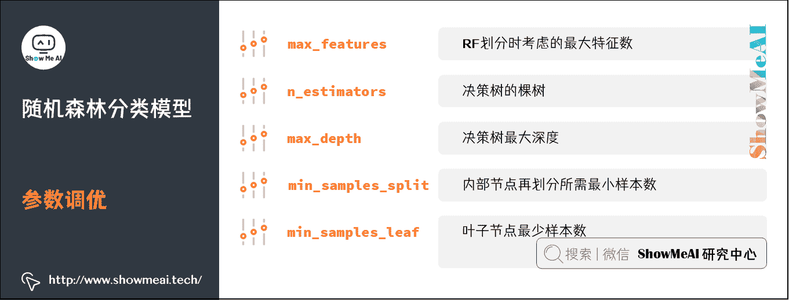

# 图解机器学习 | 随机森林分类模型详解

> 原文：[`blog.csdn.net/ShowMeAI/article/details/123400295`](https://blog.csdn.net/ShowMeAI/article/details/123400295)

作者：[韩信子](https://github.com/HanXinzi-AI)@[ShowMeAI](http://www.showmeai.tech/)
[教程地址](http://www.showmeai.tech/tutorials/34)：[`www.showmeai.tech/tutorials/34`](http://www.showmeai.tech/tutorials/34)
[本文地址](http://www.showmeai.tech/article-detail/191)：[`www.showmeai.tech/article-detail/191`](http://www.showmeai.tech/article-detail/191)
**声明：版权所有，转载请联系平台与作者并注明出处**

* * *

# 引言

随机森林是一种由决策树构成的（并行）集成算法，属于 Bagging 类型，**通过组合多个弱分类器，最终结果通过投票或取均值，使得整体模型的结果具有较高的精确度和泛化性能，同时也有很好的稳定性**，广泛应用在各种业务场景中。

随机森林有如此优良的表现，主要归功于「**随机**」和「**森林**」，一个使它具有抗过拟合能力，一个使它更加精准。我们会在下文中做更详细的展开讲解。

（本篇部分内容涉及到机器学习基础知识、决策树、回归树算法，没有先序知识储备的宝宝可以查看 ShowMeAI 的文章 [图解机器学习 | 机器学习基础知识](http://www.showmeai.tech/article-detail/185)、[决策树模型详解](http://www.showmeai.tech/article-detail/190) 及 [回归树模型详解](http://www.showmeai.tech/article-detail/190)）。

# 1.集成学习

## 1）集成学习

学习随机森林，我们需要先了解一些概念，比如第 1 个大家要了解的概念是集成学习（ensemble learning）：

对于训练数据集，我们训练一系列「个体学习器」，再通过「结合策略」将它们集成起来，形成一个更强的学习器，这就是「集成学习」在做的事情，内核思想类似「三个臭皮匠，顶个诸葛亮」。

## 2）个体学习器

个体学习器是相对于集成学习来说的，其实我们在之前了解到的很多模型，比如 C4.5 决策树算法、逻辑回归算法、朴素贝叶斯算法等，都是个体学习器。

*   若集成中只包含同种类型的个体学习器，叫做「同质」集成，个体学习器称作「基学习器」。例如随机森林中全是决策树集成。

*   若集成中包含不同类型的个体学习器，叫做「异质」集成，个体学习器称作「组件学习器」。例如同时包含决策树和神经网络进行集成。

个体学习器代表的是单个学习器，集成学习代表的是多个学习器的结合。

## 3）集成学习核心问题

### （1）使用什么样的个体学习器？

*   个体学习器不能太「弱」，需要有一定的准确性。
*   个体学习器之间要具有「多样性」，即存在差异性。

### （2）如何选择合适的结合策略构建强学习器？

*   并行组合方式，例如随机森林。
*   传统组合方式，例如 boosting 树模型。

# 2.Bagging

我们在这里讲到的随机森林是并行集成模型，而 Bagging 是并行式集成学习方法最著名的代表。

## 1）Bootstrap Sampling

要理解 bagging，首先要了解自助采样法（Bootstrap Sampling）：

*   给定包含 m m m 个样本的数据集，我们先随机取出一个样本放入采样集中，再把该样本放回初始数据集，使得下次采样时该样本仍有可能被选中。

*   上述过程重复 m m m 轮，我们得到 m m m 个样本的采样集，初始训练集中有的样本在采样集中多次出现，有的则从未出现，约 63.2%的样本出现在采样集中，而**未出现的约 36.8%的样本可用作验证集来对后续的泛化性能进行「包外估计」**。

## 2）Bagging

Bagging 是 Bootstrap aggregating 的缩写，是在 Boostrap Sampling 基础上构建的，上述的采样过程我们可以重复 T T T 次，采样出 T T T 个含 m m m 个训练样本的采样集，然后基于每个采样集训练出一个基学习器，然后将这些基学习器进行结合。

**在对预测输出进行结合时，Bagging 通常对分类任务使用简单投票法，对回归任务使用简单平均法，这就是 Bagging 的基本流程。**

从「偏差-方差分解」的角度看，Bagging 主要关注降低方差，因此它在不剪枝的决策树、神经网络等易受到样本扰动的学习器上效用更明显。

# 3.随机森林算法

## 1）随机森林算法介绍

Random Forest（随机森林，简称 RF）是一种基于树模型的 Bagging 的优化版本。核心思想依旧是 Bagging，但是做了一些独特的改进——**RF 使用了 CART 决策树作为基学习器**。具体过程如下：

*   输入为样本集 D = { ( x , y 1 ) , ( x 2 , y 2 ) , … , ( x m , y m ) } D=\left\{\left(x, y_{1}\right),\left(x_{2}, y_{2}\right), \ldots,\left(x_{m}, y_{m}\right)\right\} D={(x,y1​),(x2​,y2​),…,(xm​,ym​)}

*   对于 t = 1 , 2 , . . . , T t=1,2,...,T t=1,2,...,T：

    *   对训练集进行第 t t t 次随机采样，共采集 m m m 次，得到包含 m m m 个样本的采样集 D T D_T DT​。
    *   用采样集 D T D_T DT​ 训练第 T T T 个决策树模型 G T ( x ) G_{T} (x) GT​(x) ，在训练决策树模型的节点的时候，在节点上所有的样本特征中选择一部分样本特征，在这些随机选择的部分样本特征中选择一个最优的特征来做决策树的左右子树划分。
*   分类场景，则 T T T 个基模型（决策树）投出最多票数的类别为最终类别。

## 2）随机森林核心特点

随机森林核心点是「随机」和「森林」，也是给它带来良好性能的最大支撑。

**「随机」主要体现在两个方面**：

*   **样本扰动**：直接基于自助采样法（Bootstrap Sampling），使得初始训练集中约 63.2%的样本出现在一个采样集中。并带来数据集的差异化。

*   **属性扰动**：在随机森林中，对基决策树的每个结点，先在该结点的特征属性集合中随机选择 k 个属性，然后再从这 k 个属性中选择一个最优属性进行划分。这一重随机性也会带来基模型的差异性。

**「集成」体现在**：根据多个（差异化）采样集，训练得到多个（差异化）决策树，采用简单投票或者平均法来提高模型稳定性和泛化能力。

## 3）随机森林决策边界可视化

下面是对于同一份数据集（iris 数据集），我们使用决策树和不同树棵树的随机森林做分类的结果，我们对其决策边界做了可视化。

可以很明显地看到，**随着随机森林中决策树数量的增多，模型的泛化能力逐渐增强，决策边界越来越趋于平滑**（受到噪声点的影响越来越小）。

## 4）随机森林算法优点

下面我们来总结一下随机森林的优缺点：

### （1）随机森林优点

*   对于高维（特征很多）稠密型的数据适用，不用降维，无需做特征选择。
*   构建随机森林模型的过程，亦可帮助判断特征的重要程度。
*   可以借助模型构建组合特征。
*   并行集成，有效控制过拟合。
*   工程实现并行简单，训练速度快。
*   对于不平衡的数据集友好，可以平衡误差。
*   对于特征确实鲁棒性强，可以维持不错的准确度。

### （2）随机森林缺点

*   在噪声过大的分类和回归数据集上还是可能会过拟合。
*   相比单一决策树，因其随机性，模型解释会更复杂一些。

# 4.影响随机森林的参数与调优

上面我们已经系统了解了随机森林的原理与机制，下面我们一起来看看工程应用实践中的一些重点，比如随机森林模型有众多可调参数，它们有什么影响，又如何调优。

## 1）核心影响参数

### （1）生成单颗决策树时的特征数（max_features）

*   增加 max_features 一般能提高单个决策树模型的性能，但降低了树和树之间的差异性，且可能降低算法的速度。

*   太小的 max_features 会影响单颗树的性能，进而影响整体的集成效果。

*   需要适当地平衡和选择最佳的 max_features。

### （2）决策树的棵树（n_estimators）

*   较多的子树可以让模型有更好的稳定性和泛化能力，但同时让模型的学习速度变慢。

*   我们会在计算资源能支撑的情况下，选择稍大的子树棵树。

### （3）树深（max_depth）

*   太大的树深，因为每颗子树都过度学习，可能会有过拟合问题。

*   如果模型样本量多特征多，我们会限制最大树深，提高模型的泛化能力。

## 2）参数调优

### （1）RF 划分时考虑的最大特征数（max_features）

*   总数的百分比，常见的选择区间是[0.5, 0.9]。

### （2）决策树的棵树（n_estimators）

*   可能会设置为>50 的取值，可根据计算资源调整。

### （3）决策树最大深度（max_depth）

*   常见的选择在 4-12 之间。

### （4）内部节点再划分所需最小样本数（min_samples_split）

*   如果样本量不大，不需要调整这个值。

*   如果样本量数量级非常大，我们可能会设置这个值为 16，32，64 等。

### （5）叶子节点最少样本数（min_samples_leaf）

*   为了提高泛化能力，我们可能会设置这个值>1。

更多监督学习的算法模型总结可以查看 ShowMeAI 的文章 [AI 知识技能速查 | 机器学习-监督学习](http://www.showmeai.tech/article-detail/113)。

## 视频教程

**可以点击 [B 站](https://www.bilibili.com/video/BV1y44y187wN?p=12) 查看视频的【双语字幕】版本**

[`player.bilibili.com/player.html?aid=975327190&page=12`](https://player.bilibili.com/player.html?aid=975327190&page=12)

【双语字幕+资料下载】MIT 6.036 | 机器学习导论(2020·完整版)

> **双语字幕+资料下载】MIT 6.036 | 机器学习导论(2020·完整版)**
> 
> https://www.bilibili.com/video/BV1y44y187wN?p=12

## ShowMeAI 相关文章推荐

*   [1.机器学习基础知识](http://www.showmeai.tech/article-detail/185)
*   [2.模型评估方法与准则](http://www.showmeai.tech/article-detail/186)
*   [3.KNN 算法及其应用](http://www.showmeai.tech/article-detail/187)
*   [4.逻辑回归算法详解](http://www.showmeai.tech/article-detail/188)
*   [5.朴素贝叶斯算法详解](http://www.showmeai.tech/article-detail/189)
*   [6.决策树模型详解](http://www.showmeai.tech/article-detail/190)
*   [7.随机森林分类模型详解](http://www.showmeai.tech/article-detail/191)
*   [8.回归树模型详解](http://www.showmeai.tech/article-detail/192)
*   [9.GBDT 模型详解](http://www.showmeai.tech/article-detail/193)
*   [10.XGBoost 模型最全解析](http://www.showmeai.tech/article-detail/194)
*   [11.LightGBM 模型详解](http://www.showmeai.tech/article-detail/195)
*   [12.支持向量机模型详解](http://www.showmeai.tech/article-detail/196)
*   [13.聚类算法详解](http://www.showmeai.tech/article-detail/197)
*   [14.PCA 降维算法详解](http://www.showmeai.tech/article-detail/198)

## ShowMeAI 系列教程推荐

*   [图解 Python 编程：从入门到精通系列教程](http://www.showmeai.tech/tutorials/56)
*   [图解数据分析：从入门到精通系列教程](http://www.showmeai.tech/tutorials/33)
*   [图解 AI 数学基础：从入门到精通系列教程](http://showmeai.tech/tutorials/83)
*   [图解大数据技术：从入门到精通系列教程](http://www.showmeai.tech/tutorials/84)
*   [图解机器学习算法：从入门到精通系列教程](http://www.showmeai.tech/tutorials/34)

