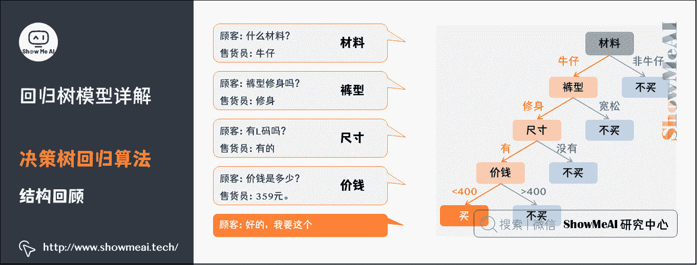
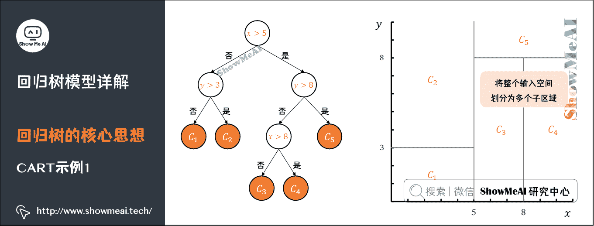
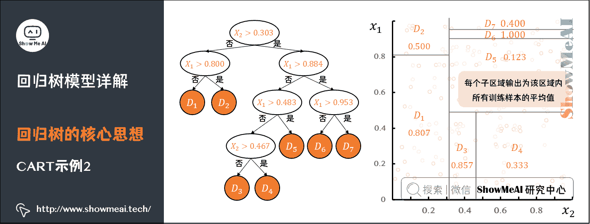
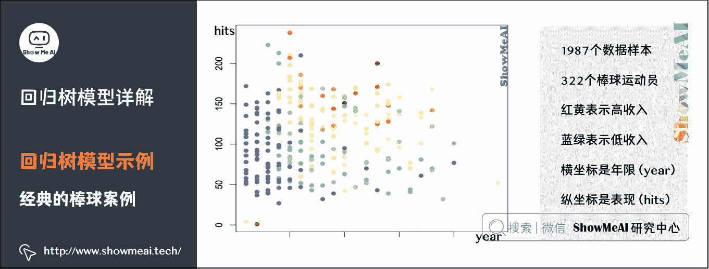
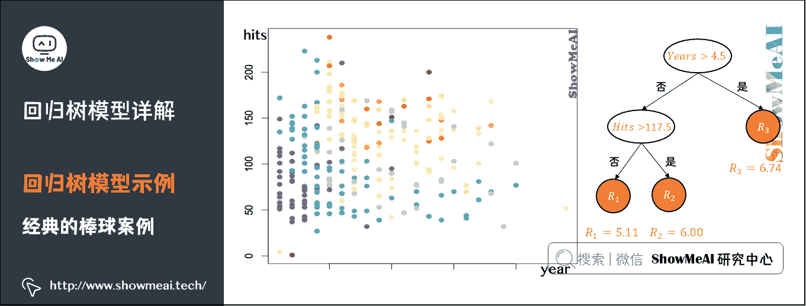
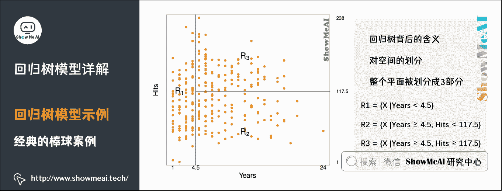
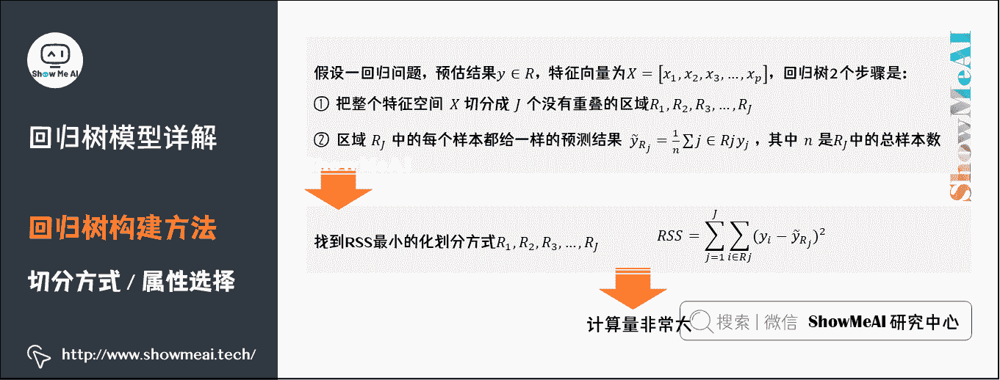
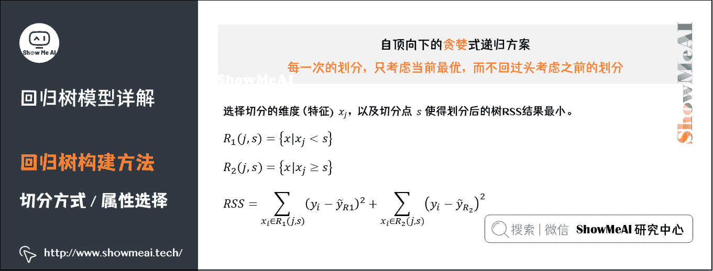
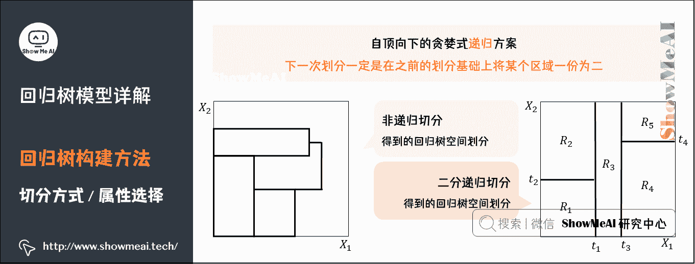
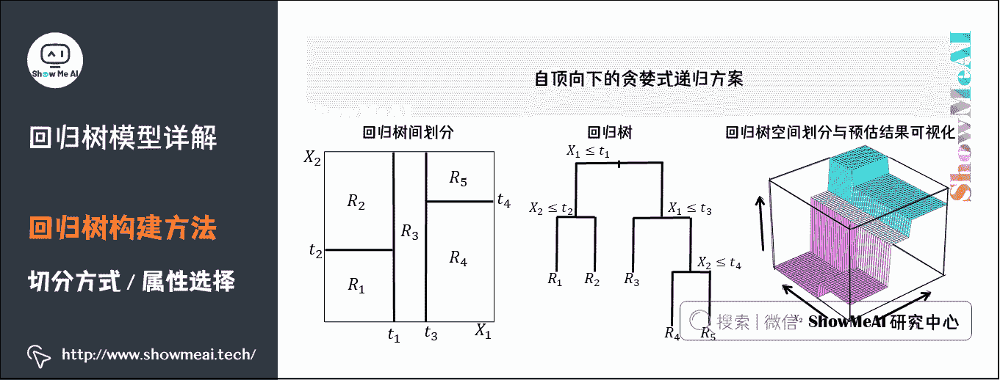

# 图解机器学习 | 回归树模型详解

> 原文：[`blog.csdn.net/ShowMeAI/article/details/123401318`](https://blog.csdn.net/ShowMeAI/article/details/123401318)

作者：[韩信子](https://github.com/HanXinzi-AI)@[ShowMeAI](http://www.showmeai.tech/)
[教程地址](http://www.showmeai.tech/tutorials/34)：[`www.showmeai.tech/tutorials/34`](http://www.showmeai.tech/tutorials/34)
[本文地址](http://www.showmeai.tech/article-detail/192)：[`www.showmeai.tech/article-detail/192`](http://www.showmeai.tech/article-detail/192)
**声明：版权所有，转载请联系平台与作者并注明出处**

* * *

# 引言

大家在前面的部分学习到了使用决策树进行分类，实际决策树也可以用作回归任务，我们叫作回归树。而回归树的结构还是树形结构，但是属性选择与生长方式和分类的决策树有不同，我们一起来看看它的原理知识吧。

（本篇回归树模型部分内容涉及到机器学习基础知识、决策树算法，没有先序知识储备的宝宝可以查看 ShowMeAI 的文章 图解机器学习 | 机器学习基础知识 及 [决策树模型详解](http://www.showmeai.tech/article-detail/190)）。

# 1.决策树回归算法核心思想

## 1）决策树结构回顾

我们一起来回顾一下决策树的结构，**决策树的典型结构如下图所示**。

决策树的**学习过程**和**预测过程**如下图所示。详细内容可以参考 ShowMeAI 的文章 [决策树模型详解](http://www.showmeai.tech/article-detail/190)。

主流的决策树算法有：

*   **ID3**：基于**信息增益**来选择分裂属性（每步选择信息增益最大的属性作为分裂节点，树可能是多叉的）。

*   **C4.5**：基于**信息增益率**来选择分裂属性（每步选择信息增益率最大的属性作为分裂节点，树可能是多叉的）。

*   **CART**：基于**基尼系数**来构建决策树（每步要求基尼系数最小，树是二叉的）。

其中：CART 树全称 Classification And Regression Tree，即可以用于分类，也可以用于回归，这里指的回归树就是 CART 树，ID3 和 C4.5 不能用于回归问题。

## 2）回归树的核心思想

要讲回归树，我们一定会提到 CART 树，**CART 树全称 Classification And Regression Trees，包括分类树与回归树**。

**CART 的特点是**：假设决策树是二叉树，内部结点特征的取值为「是」和「否」，右分支是取值为「是」的分支，左分支是取值为「否」的分支。这样的决策树等价于「递归地二分每个特征」，将输入空间（特征空间）划分为有限个单元，并在这些单元上确定预测的概率分布，也就是在输入给定的条件下输出的条件概率分布。

设有数据集 D D D ，构建回归树的大体思路如下：

*   ①考虑数据集 D D D 上的所有特征 j j j ，遍历每一个特征下所有可能的取值或者切分点 s s s ，将数据集 D D D 划分成两部分 D 1 D_1 D1​ 和 D 2 D_2 D2​ 。

*   ②分别计算 D 1 D_1 D1​ 和 D 2 D_2 D2​ 的平方误差和，选择最小的平方误差对应的特征与分割点，生成两个子节点（将数据划分为两部分）。

*   ③对上述两个子节点递归调用步骤①②，直到满足停止条件。

回归树构建完成后，就完成了对整个输入空间的划分（即完成了回归树的建立）。将整个输入空间划分为多个子区域，每个子区域输出为该区域内所有训练样本的平均值。

我们知道了回归树其实是将输入空间划分为 M 个单元，每个区域的输出值是该区域内所有点 y 值的平均数。但我们希望构建最有效的回归树：预测值与真实值差异度最小。下面部分我们展开讲讲，回归树是如何生长的。

# 2.启发式切分与最优属性选择

## 1）回归树模型示例

我们用一个经典的棒球案例来解释回归树：根据从业年限和表现，去预估棒球运动员的工资。如下所示，有 1987 个数据样本，包含 322 个棒球运动员。红黄表示高收入，蓝绿表示低收入。横坐标是年限，纵坐标是表现。

这个简单案例中，每个样本数据有两个特征：从业年限 years 和成绩表现 hits，回归树的决策过程由最终生成的回归树决定，如右图所示：

*   根决策节点为特征 Years，其划分阈值为 4.5，Years 小于 4.5 的样本划分到左边，大于或等于 4.5 的样本划分到右边；

*   第二个决策节点的特征为 Hits，其划分阈值为 117.5，Hits 小于 117.5 的样本划分到左边，大于或等于 117.5 的样本划分到右边。

*   一个样本顺着决策树的决策条件，走到叶子节点，即可获得预测工资，这里的预测工资总共就 3 种取值，分别为 5.11、6.00、6.74。

我们来深入拆解和对应一下，其实回归树构建完成后，实现了对整个空间的划分（如下图所示）。实际预测时，新样本会按照回归树的决策过程，被划分到下图 R 1 R_1 R1​ 、 R 2 R_2 R2​ 、 R 3 R_3 R3​ 之中的一个区域 R i R_i Ri​ ，而这个新样本的预测值（本案例中为棒球运动员的工资）就是它所在的区域。

*   R i R_i Ri​ 中所有训练样本的工资平均值。

回归树背后的含义：对空间的划分。整个平面被划分成 3 部分：

*   R 1 = X ∣ Y e a r s < 4.5 R1 = {X |Years < 4.5} R1=X∣Years<4.5
*   R 2 = X ∣ Y e a r s ≥ 4.5 , H i t s < 117.5 R2 = {X |Years ≥ 4.5, Hits < 117.5} R2=X∣Years≥4.5,Hits<117.5
*   R 3 = X ∣ Y e a r s ≥ 4.5 , H i t s ≥ 117.5 R3 = {X |Years ≥ 4.5, Hits ≥ 117.5} R3=X∣Years≥4.5,Hits≥117.5

## 2）回归树构建方法

下面切到回归树构建的核心：切分方式与属性选择。

假设一回归问题，预估结果 y ∈ R y \in R y∈R ，特征向量为 X = [ x 1 , x 2 , x 3 , … , x p ] X = [x_1,x_2,x_3, \dots , x_p ] X=[x1​,x2​,x3​,…,xp​] ，回归树 2 个步骤是：

*   ①把整个特征空间 X X X 切分成 J J J 个没有重叠的区域 R 1 , R 2 , R 3 , … , R J R_1,R_2,R_3, \dots ,R_J R1​,R2​,R3​,…,RJ​

*   ②其中区域 R J R_J RJ​ 中的每个样本我们都给一样的预测结果 y ~ R j = 1 n ∑ j ∈ R j y j \tilde{y}_{R_{j}}=\frac{1}{n} \sum j \in R j y_{j} y~​Rj​​=n1​∑j∈Rjyj​ ，其中 n n n 是 R J R_J RJ​ 中的总样本数。

仔细观察一下上面的过程，实际上我们希望能找到如下的 RSS 最小的化划分方式 R 1 , R 2 , R 3 , … , R J R_1,R_2,R_3, \dots ,R_J R1​,R2​,R3​,…,RJ​

R S S = ∑ j = 1 J ∑ i ∈ R j ( y i − y ~ R j ) 2 R S S=\sum_{j=1}^{J} \sum_{i \in R j}\left(y_{i}-\tilde{y}_{R_{j}}\right)^{2} RSS=j=1∑J​i∈Rj∑​(yi​−y~​Rj​​)2

*   y y y ：为每个训练样本的标签构成的标签向量，向量中的每个元素 $y_j $ 对应的是每个样本的标签。

*   X X X ：为特征的集合， x 1 , x 2 , … , x p x_1,x_2, \dots , x_p x1​,x2​,…,xp​ 为第 1 个特征到第 p p p 个特征。

*   R 1 , R 2 , R 3 , … , R J R_1,R_2,R_3, \dots ,R_J R1​,R2​,R3​,…,RJ​ 为整个特征空间划分得来的 J 个不重叠的区域（可以参考上页的右图）。

*   y ~ R j \tilde{y}_{R_{j}} y~​Rj​​ ：为划分到第 j j j 个区域 $R_j $ 的样本的平均标签值，用这个值作为该区域的预测值，即如果有一个测试样本在测试时落入到该区域，就将该样本的标签值预测为 y ~ R j \tilde{y}_{R_{j}} y~​Rj​​ 。

但是这个最小化和探索的过程，计算量是非常非常大的。我们采用「探索式的递归二分」来尝试解决这个问题。

### 递归二分

回归树采用的是「自顶向下的贪婪式递归方案」。这里的贪婪，指的是每一次的划分，只考虑当前最优，而不回头考虑之前的划分。从数学上定义，即选择切分的维度（特征） x j x_j xj​ 以及切分点 s s s 使得划分后的树 RSS 结果最小，公式如下所示：

R 1 ( j , s ) = { x ∣ x j < s } R 2 ( j , s ) = { x ∣ x j ≥ s } R S S = ∑ x i ∈ R 1 ( j , s ) ( y i − y ~ R 1 ) 2 + ∑ x i ∈ R 2 ( j , s ) ( y i − y ~ R 2 ) 2 \begin{aligned} & R_{1}(j, s)=\left\{x \mid x_{j}<s\right\} \\ & R_{2}(j, s)=\left\{x \mid x_{j} \geq s\right\} \\ & RSS=\sum x_{i} \in R_{1}(j, s)\left(y_{i}-\tilde{y}_{R 1}\right)^{2}+\sum x_{i} \in R_{2}(j, s)\left(y_{i}-\tilde{y}_{R_{2}}\right)^{2} \end{aligned} ​R1​(j,s)={x∣xj​<s}R2​(j,s)={x∣xj​≥s}RSS=∑xi​∈R1​(j,s)(yi​−y~​R1​)2+∑xi​∈R2​(j,s)(yi​−y~​R2​​)2​

我们再来看看「**递归切分**」。下方有两个对比图，其中左图是非递归方式切分得到的，而右图是二分递归的方式切分得到的空间划分结果（下一次划分一定是在之前的划分基础上将某个区域一份为二）。

**两种方式的差别是**：递归切分一定可以找到一个较优的解，非递归切分穷举不了所有情况，算法上无法实现，可能无法得到一个较好的解。

**回归树总体流程类似于分类树**：分枝时穷举每一个特征可能的划分阈值，来寻找最优切分特征和最优切分点阈值，衡量的方法是平方误差最小化。分枝直到达到预设的终止条件（如叶子个数上限）就停止。

但通常在处理具体问题时，单一的回归树模型能力有限且有可能陷入过拟合，我们经常会利用集成学习中的 Boosting 思想，对回归树进行增强，得到的新模型就是提升树（Boosting Decision Tree），进一步，可以得到[梯度提升树（Gradient Boosting Decision Tree，GBDT）](http://www.showmeai.tech/article-detail/193)，再进一步可以升级到[XGBoost](http://www.showmeai.tech/article-detail/194)。通过多棵回归树拟合残差，不断减小预测值与标签值的偏差，从而达到精准预测的目的，ShowMeAI 会在后面介绍这些高级算法。

# 3.过拟合与正则化

## 1）过拟合问题

决策树模型存在过拟合风险，通常情况下，树的规模太小会导致模型效果不佳，而树的规模太大就会造成过拟合，非常难以控制。

## 2）过拟合问题处理

对于决策树，我们通常有如下一些策略可以用于环节过拟合：

### （1）约束控制树的过度生长

*   限制树的深度：当达到设置好的最大深度时结束树的生长。
*   分类误差法：当树继续生长无法得到客观的分类误差减小，就停止生长。
*   叶子节点最小数据量限制：一个叶子节点的数据量过小，树停止生长。

### （2）剪枝

约束树生长的缺点就是提前扼杀了其他可能性，过早地终止了树的生长，我们也可以等待树生长完成以后再进行剪枝，即所谓的后剪枝，而后剪枝算法主要有以下几种：

*   Reduced-Error Pruning（REP，错误率降低剪枝）。
*   Pesimistic-Error Pruning（PEP，悲观错误剪枝）。
*   Cost-Complexity Pruning（CCP，代价复杂度剪枝）。
*   Error-Based Pruning（EBP，基于错误的剪枝）。

## 3）正则化

对于回归树而言，在剪枝过程中我们会添加正则化项衡量。如下所示，考虑剪枝后得到的子树 { T a } \left \{T_a \right \} {Ta​} ，其中 α \alpha α 是正则化项的系数。当固定住 α \alpha α 之后，最佳的 T a T_a Ta​ 就是使得下列式子值最小的子树。

∑ m = 1 ∣ T ∣ ∑ x i ∈ R m ( y i − y ~ R 2 ) 2 + α ∣ T ∣ \sum_{m=1}^{|T|} \sum_{x_{i} \in R_{m}}\left(y_{i}-\tilde{y}_{R_{2}}\right)^{2}+\alpha|T| m=1∑∣T∣​xi​∈Rm​∑​(yi​−y~​R2​​)2+α∣T∣

*   ∣ T ∣ |T| ∣T∣ 是回归树叶子节点的个数。

*   α \alpha α 可以通过交叉验证去选择。

更多监督学习的算法模型总结可以查看 ShowMeAI 的文章 [AI 知识技能速查 | 机器学习-监督学习](http://www.showmeai.tech/article-detail/113)。

## 视频教程

**可以点击 [B 站](https://www.bilibili.com/video/BV1y44y187wN?p=12) 查看视频的【双语字幕】版本**

[`player.bilibili.com/player.html?aid=975327190&page=12`](https://player.bilibili.com/player.html?aid=975327190&page=12)

【双语字幕+资料下载】MIT 6.036 | 机器学习导论(2020·完整版)

> **【双语字幕+资料下载】MIT 6.036 | 机器学习导论(2020·完整版)**
> 
> [`www.bilibili.com/video/BV1y44y187wN?p=12`](https://www.bilibili.com/video/BV1y44y187wN?p=12)

## ShowMeAI 相关文章推荐

*   [1.机器学习基础知识](http://www.showmeai.tech/article-detail/185)
*   [2.模型评估方法与准则](http://www.showmeai.tech/article-detail/186)
*   [3.KNN 算法及其应用](http://www.showmeai.tech/article-detail/187)
*   [4.逻辑回归算法详解](http://www.showmeai.tech/article-detail/188)
*   [5.朴素贝叶斯算法详解](http://www.showmeai.tech/article-detail/189)
*   [6.决策树模型详解](http://www.showmeai.tech/article-detail/190)
*   [7.随机森林分类模型详解](http://www.showmeai.tech/article-detail/191)
*   [8.回归树模型详解](http://www.showmeai.tech/article-detail/192)
*   [9.GBDT 模型详解](http://www.showmeai.tech/article-detail/193)
*   [10.XGBoost 模型最全解析](http://www.showmeai.tech/article-detail/194)
*   [11.LightGBM 模型详解](http://www.showmeai.tech/article-detail/195)
*   [12.支持向量机模型详解](http://www.showmeai.tech/article-detail/196)
*   [13.聚类算法详解](http://www.showmeai.tech/article-detail/197)
*   [14.PCA 降维算法详解](http://www.showmeai.tech/article-detail/198)

## ShowMeAI 系列教程推荐

*   [图解 Python 编程：从入门到精通系列教程](http://www.showmeai.tech/tutorials/56)
*   [图解数据分析：从入门到精通系列教程](http://www.showmeai.tech/tutorials/33)
*   [图解 AI 数学基础：从入门到精通系列教程](http://showmeai.tech/tutorials/83)
*   [图解大数据技术：从入门到精通系列教程](http://www.showmeai.tech/tutorials/84)
*   [图解机器学习算法：从入门到精通系列教程](http://www.showmeai.tech/tutorials/34)

