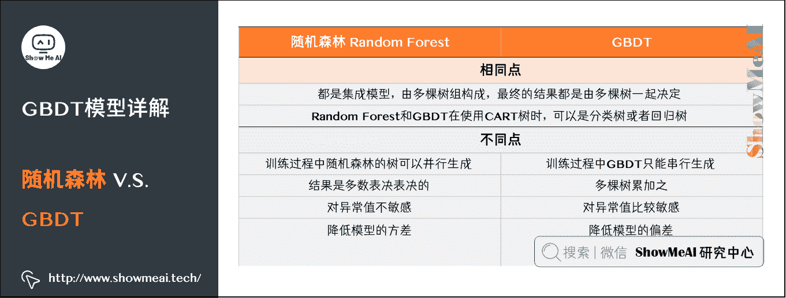

# 图解机器学习 | GBDT 模型详解

> 原文：[`blog.csdn.net/ShowMeAI/article/details/123402422`](https://blog.csdn.net/ShowMeAI/article/details/123402422)


作者：[韩信子](https://github.com/HanXinzi-AI)@[ShowMeAI](http://www.showmeai.tech/)
[教程地址](http://www.showmeai.tech/tutorials/34)：[`www.showmeai.tech/tutorials/34`](http://www.showmeai.tech/tutorials/34)
[本文地址](http://www.showmeai.tech/article-detail/193)：[`www.showmeai.tech/article-detail/193`](http://www.showmeai.tech/article-detail/193)
**声明：版权所有，转载请联系平台与作者并注明出处**

* * *

# 1.GBDT 算法

GBDT（Gradient Boosting Decision Tree），全名叫梯度提升决策树，是一种迭代的决策树算法，又叫 MART（Multiple Additive Regression Tree），它**通过构造一组弱的学习器（树），并把多颗决策树的结果累加起来作为最终的预测输出**。该算法将决策树与集成思想进行了有效的结合。


（本篇 GBDT 集成模型部分内容涉及到机器学习基础知识、决策树、回归树算法，没有先序知识储备的宝宝可以查看 ShowMeAI 的文章 [图解机器学习 | 机器学习基础知识](http://www.showmeai.tech/article-detail/185) 、[决策树模型详解](http://www.showmeai.tech/article-detail/190) 及 [回归树模型详解](http://www.showmeai.tech/article-detail/192)）。

## 1）Boosting 核心思想

Boosting 方法训练基分类器时采用串行的方式，各个基分类器之间有依赖。它的基本思路是将基分类器层层叠加，每一层在训练的时候，对前一层基分类器分错的样本，给予更高的权重。测试时，根据各层分类器的结果的加权得到最终结果。


Bagging 与 Boosting 的串行训练方式不同，Bagging 方法在训练过程中，各基分类器之间无强依赖，可以进行并行训练。

## 2）GBDT 详解

**GBDT 的原理很简单**：

*   所有弱分类器的结果相加等于预测值。
*   每次都以当前预测为基准，下一个弱分类器去拟合误差函数对预测值的残差（预测值与真实值之间的误差）。
*   GBDT 的弱分类器使用的是树模型。


如图是一个非常简单的帮助理解的示例，我们用 GBDT 去预测年龄：

*   第一个弱分类器（第一棵树）预测一个年龄（如 20 岁），计算发现误差有 10 岁；
*   第二棵树预测拟合残差，预测值 6，计算发现差距还有 4 岁；
*   第三棵树继续预测拟合残差，预测值 3，发现差距只有 1 岁了；
*   第四课树用 1 岁拟合剩下的残差，完成。

最终，四棵树的结论加起来，得到 30 岁这个标注答案（实际工程实现里，GBDT 是计算负梯度，用负梯度近似残差）。

### （1）GBDT 与负梯度近似残差

回归任务下，GBDT 在每一轮的迭代时对每个样本都会有一个预测值，此时的损失函数为均方差损失函数：

l ( y i , y i ^ ) = 1 2 ( y i − y i ^ ) 2 l(y_{i}, \hat{y_{i}})=\frac{1}{2}(y_{i}-\hat{y_{i}})^{2} l(yi​,yi​^​)=21​(yi​−yi​^​)2

损失函数的负梯度计算如下：

− [ ∂ l ( y i , y i ^ ) ∂ y i ^ ] = ( y i − y i ^ ) -[\frac{\partial l(y_{i}, \hat{y_{i}})}{\partial \hat{y_{i}}}]=(y_{i}-\hat{y_{i}}) −[∂yi​^​∂l(yi​,yi​^​)​]=(yi​−yi​^​)


可以看出，当损失函数选用「**均方误差损失**」时，每一次拟合的值就是（真实值-预测值），即残差。

### （2）GBDT 训练过程

我们来借助 1 个简单的例子理解一下 GBDT 的训练过程。假定训练集只有 4 个人 (A,B,C,D)，他们的年龄分别是 (14,16,24,26)。其中，A、B 分别是高一和高三学生；C、D 分别是应届毕业生和工作两年的员工。

我们先看看用回归树来训练，得到的结果如下图所示：


接下来改用 GBDT 来训练。由于样本数据少，我们限定叶子节点最多为 2（即每棵树都只有一个分枝），并且限定树的棵树为 2。最终训练得到的结果如下图所示：


上图中的树很好理解：A、B 年龄较为相近，C、D 年龄较为相近，被分为左右两支，每支用平均年龄作为预测值。

*   我们计算残差（即「实际值」-「预测值」），所以 A 的残差 14-15=-1。

*   这里 A 的「预测值」是指前面所有树预测结果累加的和，在当前情形下前序只有一棵树，所以直接是 15，其他多树的复杂场景下需要累加计算作为 A 的预测值。


上图中的树就是残差学习的过程了：

*   把 A、B、C、D 的值换作残差-1、1、-1、1，再构建一棵树学习，这棵树只有两个值 1 和-1，直接分成两个节点：A、C 在左边，B、D 在右边。

*   这棵树学习残差，在我们当前这个简单的场景下，已经能保证预测值和实际值（上一轮残差）相等了。

*   我们把这棵树的预测值累加到第一棵树上的预测结果上，就能得到真实年龄，这个简单例子中每个人都完美匹配，得到了真实的预测值。


最终的预测过程是这样的：

*   A：高一学生，购物较少，经常问学长问题，真实年龄 14 岁，预测年龄 A = 15 – 1 = 14
*   B：高三学生，购物较少，经常被学弟提问，真实年龄 16 岁，预测年龄 B = 15 + 1 = 16
*   C：应届毕业生，购物较多，经常问学长问题，真实年龄 24 岁，预测年龄 C = 25 – 1 = 24
*   D：工作两年员工，购物较多，经常被学弟提问，真实年龄 26 岁，预测年龄 D = 25 + 1 = 26

综上，GBDT 需要将多棵树的得分累加得到最终的预测得分，且每轮迭代，都是在现有树的基础上，增加一棵新的树去拟合前面树的预测值与真实值之间的残差。

# 2.梯度提升 vs 梯度下降

下面我们来对比一下「梯度提升」与「梯度下降」。这两种迭代优化算法，都是在每 1 轮迭代中，利用损失函数负梯度方向的信息，更新当前模型，只不过：

*   梯度下降中，模型是以参数化形式表示，从而模型的更新等价于参数的更新。

*   梯度提升中，模型并不需要进行参数化表示，而是直接定义在函数空间中，从而大大扩展了可以使用的模型种类。

F = F t − 1 − ρ t ∇ F L ∣ F = F t − 1 F=F_{t-1}-\left.\rho_{t} \nabla_{F} L\right|_{F=F_{t-1}} F=Ft−1​−ρt​∇F​L∣F=Ft−1​​

L = ∑ i l ( y i , F ( x i ) ) L=\sum_{i} l\left(y_{i}, F\left(x_{i}\right)\right) L=i∑​l(yi​,F(xi​))

w t = w t − 1 − ρ t ∇ w L ∣ w = w t − 1 w_{t}=w_{t-1}-\left.\rho_{t} \nabla_{w} L\right|_{w=w_{t-1}} wt​=wt−1​−ρt​∇w​L∣w=wt−1​​

L = ∑ i l ( y i , f w ( w i ) ) L=\sum_{i} l\left(y_{i}, f_{w}\left(w_{i}\right)\right) L=i∑​l(yi​,fw​(wi​))


# 3.GBDT 优缺点

下面我们来总结一下 GBDT 模型的优缺点：


## 1）优点

*   预测阶段，因为每棵树的结构都已确定，可并行化计算，计算速度快。

*   适用稠密数据，泛化能力和表达能力都不错，数据科学竞赛榜首常见模型。

*   可解释性不错，鲁棒性亦可，能够自动发现特征间的高阶关系。

## 2）缺点

*   GBDT 在高维稀疏的数据集上，效率较差，且效果表现不如 SVM 或神经网络。

*   适合数值型特征，在 NLP 或文本特征上表现弱。

*   训练过程无法并行，工程加速只能体现在单颗树构建过程中。

# 4.随机森林 vs GBDT

对比 ShowMeAI 前面讲解的另外一个集成树模型算法[随机森林](http://www.showmeai.tech/article-detail/191)，我们来看看 GBDT 和它的异同点。



## 1）相同点

*   都是集成模型，由多棵树组构成，最终的结果都是由多棵树一起决定。

*   RF 和 GBDT 在使用 CART 树时，可以是分类树或者回归树。

## 2）不同点

*   训练过程中，随机森林的树可以并行生成，而 GBDT 只能串行生成。

*   随机森林的结果是多数表决表决的，而 GBDT 则是多棵树累加之。

*   随机森林对异常值不敏感，而 GBDT 对异常值比较敏感。

*   随机森林降低模型的方差，而 GBDT 是降低模型的偏差。

# 5.Python 代码应用与模型可视化

下面是我们直接使用 python 机器学习工具库 sklearn 来对数据拟合和可视化的代码：

```py
# 使用 Sklearn 调用 GBDT 模型拟合数据并可视化

import numpy as np
import pydotplus
from sklearn.ensemble import GradientBoostingRegressor

X = np.arange(1, 11).reshape(-1, 1)
y = np.array([5.16, 4.73, 5.95, 6.42, 6.88, 7.15, 8.95, 8.71, 9.50, 9.15])

gbdt = GradientBoostingRegressor(max_depth=4, criterion ='squared_error').fit(X, y)

from IPython.display import Image  
from pydotplus import graph_from_dot_data
from sklearn.tree import export_graphviz

# 拟合训练 5 棵树
sub_tree = gbdt.estimators_[4, 0]
dot_data = export_graphviz(sub_tree, out_file=None, filled=True, rounded=True, special_characters=True, precision=2)
graph = pydotplus.graph_from_dot_data(dot_data)  
Image(graph.create_png()) 
```


## ShowMeAI 相关文章推荐

*   [1.机器学习基础知识](http://www.showmeai.tech/article-detail/185)
*   [2.模型评估方法与准则](http://www.showmeai.tech/article-detail/186)
*   [3.KNN 算法及其应用](http://www.showmeai.tech/article-detail/187)
*   [4.逻辑回归算法详解](http://www.showmeai.tech/article-detail/188)
*   [5.朴素贝叶斯算法详解](http://www.showmeai.tech/article-detail/189)
*   [6.决策树模型详解](http://www.showmeai.tech/article-detail/190)
*   [7.随机森林分类模型详解](http://www.showmeai.tech/article-detail/191)
*   [8.回归树模型详解](http://www.showmeai.tech/article-detail/192)
*   [9.GBDT 模型详解](http://www.showmeai.tech/article-detail/193)
*   [10.XGBoost 模型最全解析](http://www.showmeai.tech/article-detail/194)
*   [11.LightGBM 模型详解](http://www.showmeai.tech/article-detail/195)
*   [12.支持向量机模型详解](http://www.showmeai.tech/article-detail/196)
*   [13.聚类算法详解](http://www.showmeai.tech/article-detail/197)
*   [14.PCA 降维算法详解](http://www.showmeai.tech/article-detail/198)

## ShowMeAI 系列教程推荐

*   [图解 Python 编程：从入门到精通系列教程](http://www.showmeai.tech/tutorials/56)
*   [图解数据分析：从入门到精通系列教程](http://www.showmeai.tech/tutorials/33)
*   [图解 AI 数学基础：从入门到精通系列教程](http://showmeai.tech/tutorials/83)
*   [图解大数据技术：从入门到精通系列教程](http://www.showmeai.tech/tutorials/84)
*   [图解机器学习算法：从入门到精通系列教程](http://www.showmeai.tech/tutorials/34)

