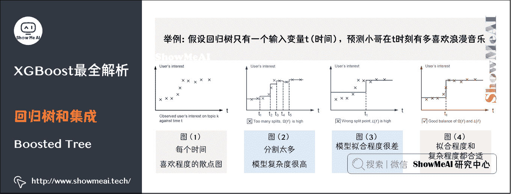
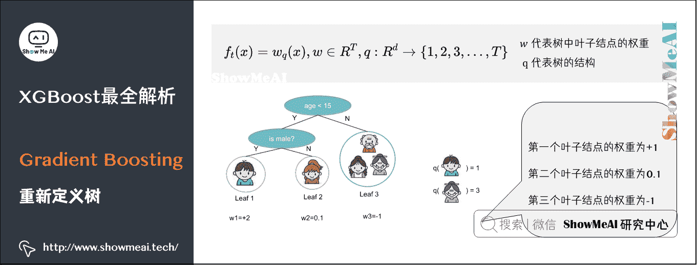
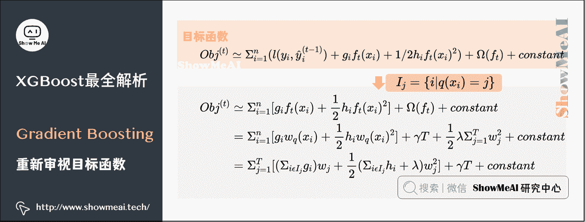

# 图解机器学习 | XGBoost 模型详解

> 原文：[`blog.csdn.net/ShowMeAI/article/details/123402980`](https://blog.csdn.net/ShowMeAI/article/details/123402980)

作者：[韩信子](https://github.com/HanXinzi-AI)@[ShowMeAI](http://www.showmeai.tech/)
[教程地址](http://www.showmeai.tech/tutorials/34)：[`www.showmeai.tech/tutorials/34`](http://www.showmeai.tech/tutorials/34)
[本文地址](http://www.showmeai.tech/article-detail/194)：[`www.showmeai.tech/article-detail/194`](http://www.showmeai.tech/article-detail/194)
**声明：版权所有，转载请联系平台与作者并注明出处**

* * *

# 引言

XGBoost 是 eXtreme Gradient Boosting 的缩写称呼，它是一个非常强大的 Boosting 算法工具包，优秀的性能（效果与速度）让其在很长一段时间内霸屏数据科学比赛解决方案榜首，现在很多大厂的机器学习方案依旧会首选这个模型。

XGBoost 在**并行计算效率、缺失值处理、控制过拟合、预测泛化能力**上都变现非常优秀。本文我们给大家详细展开介绍 XGBoost，包含「算法原理」和「工程实现」两个方面。

关于 XGBoost 的工程应用实践，欢迎大家参考 ShowMeAI 的另外一篇实战文章 [XGBoost 工具库建模应用详解](http://www.showmeai.tech/article-detail/194)。

（本篇 XGBoost 部分内容涉及到机器学习基础知识、决策树/回归树/GBDT 算法，没有先序知识储备的宝宝可以查看 ShowMeAI 的文章 [图解机器学习 | 机器学习基础知识](http://www.showmeai.tech/article-detail/185) 、[决策树模型详解](http://www.showmeai.tech/article-detail/190) 、[回归树模型详解](http://www.showmeai.tech/article-detail/192)）及[图解机器学习 | GBDT 模型详解](http://www.showmeai.tech/article-detail/193)）。

# 1.算法原理可视化解读

关于 XGBoost 的原理，其作者陈天奇本人有一个非常详尽的[Slides](https://web.njit.edu/~usman/courses/cs675_spring20/BoostedTree.pdf)做了系统性的介绍，我们在这里借助于这个资料给大家做展开讲解。

## 1）监督学习中的一些重要概念

在开始介绍 Boosted Tree 之前，我们先来回顾一下机器学习中的一些重要的概念。

### （1）监督学习核心要素

**符号**（Notations）： x i ∈ R d x_i \in R^d xi​∈Rd 表示训练集中的第 i i i 个样本。

**模型**（Model）：对于已知的 x i x_i xi​如何预测 y ^ i \hat{y}_i y^​i​？

线性模型（Linear Model） y ^ i = Σ j w j x i j \hat{y}_{i}=\Sigma_{j} w_{j} x_{ij} y^​i​=Σj​wj​xij​（包括线性回归和逻辑回归），预测值 y ^ i \hat{y}_i y^​i​根据不同的任务有不同的解释：

*   **线性回归**（Linear Regression）： y ^ i \hat{y}_i y^​i​表示预测的分数。

*   **逻辑回归**（Logistic Regression）： 1 / ( 1 + e − y ^ i ) 1/(1+e^{-\hat{y}_i}) 1/(1+e−y^​i​)预测了实例为正的概率。

*   其他：例如在排名任务中 y ^ i \hat{y}_i y^​i​可以是排名分数。

**参数**（Parameters）：需要从数据中学习的东西。

*   线性模型（Linear Model）： Θ = { w j ∣ j = 1 , 2 , … , d } \Theta =\left\{w_j|j=1,2,\dots,d\right\} Θ={wj​∣j=1,2,…,d}

**目标函数**（Objective function） O b j ( Θ ) = L ( Θ ) + Ω ( Θ ) Obj(\Theta )=L(\Theta )+\Omega (\Theta ) Obj(Θ)=L(Θ)+Ω(Θ)

*   L ( Θ ) L(\Theta ) L(Θ)代表训练损失函数（Training Loss），表示模型多好的拟合了训练数据。

*   Ω ( Θ ) \Omega (\Theta ) Ω(Θ)为正则化项（Regularization）衡量了模型的复杂程度。

**训练数据损失函数**（Training Loss） L = Σ i = 1 n l ( y i , y ^ i ) L=\Sigma_{i=1}^{n}l(y_i,\hat{y}_i) L=Σi=1n​l(yi​,y^​i​)

*   **平方损失**（Square Loss）： l ( y i , y ^ i ) = ( y i − y ^ i ) 2 l(y_i,\hat{y}_i)=(y_i-\hat{y}_i)² l(yi​,y^​i​)=(yi​−y^​i​)2

*   **逻辑损失**（Logistic Loss）： l ( y i , y ^ i ) = y i l n ( 1 + e − y ^ i ) + ( 1 − y i ) l n ( 1 + e y ^ i ) l(y_i,\hat{y}_i)=y_iln(1+e^{-\hat{y}_i})+(1-y_i)ln(1+e^{\hat{y}_i}) l(yi​,y^​i​)=yi​ln(1+e−y^​i​)+(1−yi​)ln(1+ey^​i​)

**正则化项**（Regularization）：描述了模型的复杂程度。

*   **L1 Norm（lasso）**： Ω ( w ) = λ ∣ ∣ w ∣ ∣ 1 \Omega (w)=\lambda||w||_1 Ω(w)=λ∣∣w∣∣1​

*   **L2 Norm**： Ω ( w ) = λ ∣ ∣ w ∣ ∣ 2 \Omega (w)=\lambda||w||² Ω(w)=λ∣∣w∣∣2

### （2）监督学习进阶知识

**Ridge 回归**： Σ i = 1 n ( y i − w T x i ) 2 + λ ∣ ∣ w ∣ ∣ 2 \Sigma_{i=1}^{n}(y_i-w^Tx_i)²+\lambda||w||² Σi=1n​(yi​−wTxi​)2+λ∣∣w∣∣2

*   Ridge 是线性模型（Linear Model），用的是平方损失（Square Loss），正则化项是 L2 Norm。

**Lasso**： Σ i = 1 n ( y i − w T x i ) 2 + λ ∣ ∣ w ∣ ∣ 1 \Sigma_{i=1}^{n}(y_i-w^Tx_i)²+\lambda||w||_1 Σi=1n​(yi​−wTxi​)2+λ∣∣w∣∣1​

*   Lasso 是线性模型（Linear Model），用的是平方损失（Square Loss），正则化项是 L1 Norm。

**逻辑回归**（Logistic Regression）： Σ i = 1 n ( y i l n ( 1 + e − w T x i ) + ( 1 − y i ) l n ( 1 + e w T x i ) ) + λ ∣ ∣ w ∣ ∣ 2 \Sigma_{i=1}^{n}(y_iln(1+e^{-w^Tx_i})+(1-y_i)ln(1+e^{w^Tx_i}))+\lambda||w||² Σi=1n​(yi​ln(1+e−wTxi​)+(1−yi​)ln(1+ewTxi​))+λ∣∣w∣∣2

*   逻辑回归是线性模型（Linear Model），用的是逻辑损失（Logistic Loss），正则化项是 L2 Norm。

### （3）目标函数及偏差方差权衡

回顾一下目标函数 O b j ( Θ ) = L ( Θ ) + Ω ( Θ ) Obj(\Theta )=L(\Theta )+\Omega (\Theta ) Obj(Θ)=L(Θ)+Ω(Θ)，为什么目标函数需要两部分组成呢？

*   **优化训练损失函数**（Training Loss）有助于建立预测模型，很好地拟合训练数据至少能让你更接近潜在的训练数据的分布。

*   **优化正则化项**（Regularization）有助于建立简单的模型：模型越简单，未来预测的方差越小，预测越稳定。

## 2）回归树（Regression Tree）和集成（Ensemble）

### （1）回归树（Regression Tree）

回归树，也就是分类回归树（Classification and Regression Tree）（详情请查看 ShowMeAI 文章[回归树模型详解](http://www.showmeai.tech/article-detail/192)）

*   决策规则和决策树一样
*   每个叶子结点有一个值

### （2）回归树集成（Regression Tree Ensemble）

从上图的左图可以看出，共有 5 个训练样本。

从上图的中图可以看出，每个叶子节点都有预测值：第一个叶子结点的预测值是 2，第二个叶子结点的预测值是 0.1，第三个叶子结点的预测值是-1。

*   小男孩被分到第一个叶子结点中，所以小男孩的预测值是 2；
*   小女儿被分到第二个叶子结点，她的预测值是 0.1；
*   剩余的三个人（样本）被分到第三个叶子结点中，他们的值都是-1。

最终的预测值就是样本在每颗树中所在的叶子结点的预测值的和。

### （3）树集成方法

树集成的方法使用非常广泛，像 GBM、随机森林等（详见 ShowMeAI 文章 [图解机器学习 | GBDT 模型详解](http://www.showmeai.tech/article-detail/193) 和 [图解机器学习 | 随机森林分类模型详解](http://www.showmeai.tech/article-detail/191)）。多达半数的数据挖掘竞赛通过使用各种各样的树集成方法而获胜。

*   不受输入量纲的影响，因此不需要对特性进行细致的标准化。
*   学习特征之间的高阶交互（高阶交叉特征）。
*   可以扩展，用于不同的行业。

### （4）Boosted Tree 的模型和参数

**模型**：假设我们有 K 棵树： y ^ i = Σ k = 1 K f k ( x i ) , f k ∈ F \hat{y}_i=\Sigma_{k=1}^Kf_k(x_i), f_k\in F y^​i​=Σk=1K​fk​(xi​),fk​∈F。其中，F 为包含所有回归树的函数空间。

*   回归树是一个将属性映射到分数的函数。

**参数**：包括每棵树的结构和叶子结点中的分数。或者使用函数当作参数： Θ = { f 1 , f 2 , … , f K } \Theta =\left\{f_1,f_2,…,f_K\right\} Θ={f1​,f2​,…,fK​}。

*   这里我们不学习 R d R^d Rd 的权重，我们在 Boosted Tree 中学习函数（树）。

### （5）在单变量上学习 Boosted Tree

单变量也就是单个特征，通过了解如何在单变量上学习 Boosted Tree，我们可以对 Boosted Tree 的学习模式有个简单的概念。

**举例：假设回归树只有一个输入变量 t（时间），希望预测小哥在 t 时刻有多喜欢浪漫音乐**。

> 从上左图可以看到，这位小哥在单身的时候，对浪漫音乐的喜欢程度很低；但是当他遇到了女朋友，随着体内荷尔蒙的分布增加，他对浪漫音乐的喜欢程度增加了；但是有一天分手了，他对浪漫音乐的喜欢程度又变低了。当然，我们也可以发现，上右图的回归树很容易能表达上左图。

为了构建上右图的树，我们需要学习两个东西：

*   1、分裂的点；
*   2、每个分段上的高。

单变量回归树的目标（阶跃函数）

*   训练损失：函数如何拟合点?
*   正则化：如何定义函数的复杂度?（分裂点的个数和每段高度的 L2 Norm？）

*   图（1）是小哥在每个时间上对浪漫音乐的喜欢程度的散点图；
*   图（2）可以看到有太多的分割，模型的复杂度很高，所以模型的 Ω ( f ) { \Omega (f)} Ω(f)很高；
*   图（3）可以看到模型的拟合程度很差，所以 L ( f ) {L (f)} L(f)很高；
*   图（4）是最好的，无论是拟合程度和复杂程度都非常合适；

### （6）一般情形的 Boosted Tree

首先回顾上面我们对 Boosted Tree 的定义：

**模型**：假设我们有 K 棵树： y ^ i = Σ k = 1 K f k ( x i ) , f k ∈ F \hat{y}_i = \Sigma_{k=1}^{K} f_k(x_i), f_k\in F y^​i​=Σk=1K​fk​(xi​),fk​∈F

**目标函数**： O b j = Σ i = 1 n l ( y i , y ^ i ) + Σ k = 1 K Ω ( f k ) Obj=\Sigma_{i=1}^nl(y_i,\hat{y}_i)+\Sigma_{k=1}^K\Omega (f_k) Obj=Σi=1n​l(yi​,y^​i​)+Σk=1K​Ω(fk​)

*   Σ i = 1 n l ( y i , y ^ i ) \Sigma_{i=1}^nl(y_i,\hat{y}_i) Σi=1n​l(yi​,y^​i​)是成本函数

*   Σ k = 1 K Ω ( f k ) \Sigma_{k=1}^K\Omega (f_k) Σk=1K​Ω(fk​)是正则化项，代表树的复杂程度，树越复杂正则化项的值越高（正则化项如何定义我们会在后面详细说）。

当我们讨论树的时候，通常是**启发式**的：

*   通过信息增益来做分裂
*   修剪树木
*   最大深度
*   平滑叶值

大多数启发式算法都能很好地映射到目标函数，采用**形式（目标）视图**让我们知道我们正在学习什么：

*   信息增益 → 训练损失
*   修剪 → 对节点的正则化
*   最大深度 - 函数空间上的约束
*   平滑叶片值 - L2 正则化对叶片的权重

回归树集成定义了如何得到预测值，它不仅仅可以做回归，同样还可以做分类和排序。具体做什么任务依赖于「目标函数」的定义：

*   使用平方误差：可以得到用于回归问题的 gradient boosted machine。

*   使用对数损失：可以得到 LogitBoost 用于分类。

## 3）Gradient Boosting（如何学习）

在这一节中我们将正式学习 Gradient Boosting。这里，xgboost 的处理大家可以对比 GBDT 模型（可参考 ShowMeAI 文章 [图解机器学习 | GBDT 模型详解](http://www.showmeai.tech/article-detail/193)）来理解核心差异。

### （1）解决方案

**目标函数**： O b j = Σ i = 1 n l ( y i , y ^ i ) + Σ k = 1 K Ω ( f k ) Obj=\Sigma_{i=1}^nl(y_i,\hat{y}_i)+\Sigma_{k=1}^K\Omega (f_k) Obj=Σi=1n​l(yi​,y^​i​)+Σk=1K​Ω(fk​)

在做 GBDT 的时候，我们没有办法使用 SGD，因为它们是树，而非数值向量——也就是说从原来我们熟悉的参数空间变成了函数空间。

*   **参数空间**：学习模型中的权重。

*   **函数空间**：学习函数 f f f，包括函数的结构和其中的权重。

**解决方案**：初始化一个预测值，每次迭代添加一个新函数（ f f f）：

y ^ i ( 0 ) = 0 y ^ i ( 1 ) = f 1 ( x i ) = y ^ i ( 0 ) + f 1 ( x i ) y ^ i ( 2 ) = f 1 ( x i ) + f 2 ( x i ) = y ^ i ( 1 ) + f 2 ( x i ) … y ^ i ( t ) = Σ k = 1 t f k ( x i ) = y ^ i ( t − 1 ) + f t ( x i ) \begin{aligned} \hat{y}_i^{(0)} & = 0 \\ \hat{y}_i^{(1)} & = f_1(x_i)=\hat{y}_i^{(0)}+f_1(x_i) \\ \hat{y}_i^{(2)} & = f_1(x_i)+f_2(x_i)=\hat{y}_i^{(1)}+f_2(x_i) \\ \dots \\ \hat{y}_i^{(t)} & = \Sigma_{k=1}^tf_k(x_i)=\hat{y}_i^{(t-1)}+f_t(x_i) \\ \end{aligned} y^​i(0)​y^​i(1)​y^​i(2)​…y^​i(t)​​=0=f1​(xi​)=y^​i(0)​+f1​(xi​)=f1​(xi​)+f2​(xi​)=y^​i(1)​+f2​(xi​)=Σk=1t​fk​(xi​)=y^​i(t−1)​+ft​(xi​)​

*   y ^ i ( t ) \hat{y}_i^{(t)} y^​i(t)​是第 t t t 次迭代的预测值。

*   y ^ i ( t − 1 ) \hat{y}_i^{(t-1)} y^​i(t−1)​是 t − 1 t-1 t−1 次迭代的预测值。

*   f t ( x i ) f_t(x_i) ft​(xi​)是第 t t t 颗树，也就是我们第 t t t 次迭代需要得到的树。

### （2）目标函数变换

**第一步：根据上面的公式，目标函数可以做如下变形**

O b j ( t ) = Σ i = 1 n l ( y i , y ^ i ( t ) ) + Σ k = 1 t Ω ( f k ) = Σ i = 1 n l ( y i , y ^ i ( t − 1 ) + f t ( x i ) ) + Ω ( f t ) + c o n s t a n t \begin{aligned} Obj^{(t)} & =\Sigma_{i=1}^nl(y_i,\hat{y}_i^{(t)})+\Sigma_{k=1}^t\Omega (f_k)\\ & =\Sigma_{i=1}^nl(y_i,\hat{y}_i^{(t-1)}+f_t(x_i))+\Omega (f_t)+constant \end{aligned} Obj(t)​=Σi=1n​l(yi​,y^​i(t)​)+Σk=1t​Ω(fk​)=Σi=1n​l(yi​,y^​i(t−1)​+ft​(xi​))+Ω(ft​)+constant​

这里我们考虑平方损失，此时目标函数又可以变形为：

O b j ( t ) = Σ i = 1 n ( 2 ( y i − y ^ i ( t − 1 ) ) f t ( x i ) + f t ( x i ) 2 ) + Ω ( f t ) + c o n s t a n t Obj^{(t)}=\Sigma_{i=1}^n(2(y_i-\hat{y}_i^{(t-1)})f_t(x_i)+f_t(x_i)²)+\Omega (f_t)+constant Obj(t)=Σi=1n​(2(yi​−y^​i(t−1)​)ft​(xi​)+ft​(xi​)2)+Ω(ft​)+constant

**第二步：所以我们的目的就是找到 f t f_t ft​使得目标函数最低**。然而，经过上面初次变形的目标函数仍然很复杂，目标函数会产生二次项。

在这里我们引入泰勒展开公式：

f ( x + Δ x ) ≃ f ( x ) + f ( x ) Δ x + 1 / 2 f ( x ) Δ x 2 f(x+\Delta x)\simeq f(x)+f(x)\Delta x+1/2f(x)\Delta x² f(x+Δx)≃f(x)+f(x)Δx+1/2f(x)Δx2

*   令 f ( x ) = Σ i = 1 n l ( y i , y ^ i ( t ) ) f(x)=\Sigma_{i=1}^nl(y_i,\hat{y}_i^{(t)}) f(x)=Σi=1n​l(yi​,y^​i(t)​)

*   令 Δ x = f t \Delta x=f_t Δx=ft​

目标函数利用泰勒展开式就可以变成：

O b j ( t ) ≃ Σ i = 1 n ( l ( y i , y ^ i ( t − 1 ) ) + g i f t ( x i ) + 1 / 2 h i f t ( x i ) 2 ) + Ω ( f t ) + c o n s t a n t Obj^{(t)}\simeq \Sigma_{i=1}^n(l(y_i,\hat{y}_i^{(t-1)})+g_if_t(x_i)+1/2h_if_t(x_i)²)+\Omega (f_t)+constant Obj(t)≃Σi=1n​(l(yi​,y^​i(t−1)​)+gi​ft​(xi​)+1/2hi​ft​(xi​)2)+Ω(ft​)+constant

*   g i = ∂ y ^ ( t − 1 ) l ( y i , y ^ ( t − 1 ) ) g_i = \partial _{\hat{y}^{(t-1)}}l(y_i,\hat{y}^{(t-1)}) gi​=∂y^​(t−1)​l(yi​,y^​(t−1))

*   h i = ∂ y ^ ( t − 1 ) 2 l ( y i , y ^ ( t − 1 ) ) h_i = \partial _{\hat{y}^{(t-1)}}²l(y_i,\hat{y}^{(t-1)}) hi​=∂y^​(t−1)2​l(yi​,y^​(t−1))

**第三部：把常数项提出来，目标函数可以简化为**

O b j ( t ) ≃ Σ i = 1 n [ g i f t ( x i ) + 1 / 2 h i f t ( x i ) 2 ] + Ω ( f t ) + c o n s t a n t Obj^{(t)}\simeq \Sigma_{i=1}^n[g_if_t(x_i)+1/2h_if_t(x_i)²]+\Omega (f_t)+constant Obj(t)≃Σi=1n​[gi​ft​(xi​)+1/2hi​ft​(xi​)2]+Ω(ft​)+constant

思考：为什么要做这么多变化而不直接生成树？

*   理论好处：知道我们在学习什么，收敛。

*   工程好处：回顾监督学习的要素。

    *   g i , h i g_i, h_i gi​,hi​都来自损失函数的定义。

    *   函数的学习只通过 g i , h i g_i, h_i gi​,hi​依赖于目标函数。

    *   当被要求为平方损失和逻辑损失实现 Bootsted Tree 时，可以考虑如何分离代码模块。

### （3）重新定义树

在前面，我们使用 f t ( x ) f_t(x) ft​(x)代表一颗树，在本小节，我们重新定义一下树：我们通过叶子结点中的分数向量和将实例映射到叶子结点的索引映射函数来定义树：（有点儿抽象，具体请看下图）

f t ( x ) = w q ( x ) , w ∈ R T , q : R d → { 1 , 2 , 3 , … , T } f_t(x)=w_q(x), w\in R^T, q:R^d\rightarrow \left\{1,2,3,…,T\right\} ft​(x)=wq​(x),w∈RT,q:Rd→{1,2,3,…,T}

*   w w w 代表树中叶子结点的权重

*   q q q 代表的是树的结构

从上图可以看出，共有 3 个叶子结点，第一个叶子结点的权重为+1，第二个叶子结点的权重为 0.1，第三个叶子结点的权重为-1；其中，小男孩属于第 1 个叶子结点，老奶奶属于第 3 个叶子结点。

### （4）定义树的复杂程度

通过下面的式子定义树的复杂程度（定义并不是唯一的）

Ω ( f t ) = γ T + 1 2 λ Σ j = 1 T w j 2 \Omega (f_t)=\gamma T+\frac{1}{2}\lambda\Sigma_{j=1}^Tw_j² Ω(ft​)=γT+21​λΣj=1T​wj2​

*   γ T \gamma T γT 代表了叶子结点的个树

*   1 2 λ Σ j = 1 T w j 2 \frac{1}{2}\lambda\Sigma_{j=1}^Tw_j² 21​λΣj=1T​wj2​叶子结点分数的 L2 Norm

### （5）重新审视目标函数

定义在叶子结点 j j j 中的实例的集合为：

I j = { i ∣ q ( x i ) = j } I_j=\left\{i|q(x_i)=j \right\} Ij​={i∣q(xi​)=j}

根据每棵叶子重新定义目标函数：

O b j ( t ) ≃ Σ i = 1 n [ g i f t ( x i ) + 1 2 h i f t ( x i ) 2 ] + Ω ( f t ) + c o n s t a n t = Σ i = 1 n [ g i w q ( x i ) + 1 2 h i w q ( x i ) 2 ] + γ T + 1 2 λ Σ j = 1 T w j 2 + c o n s t a n t = Σ j = 1 T [ ( Σ i ϵ I j g i ) w j + 1 2 ( Σ i ϵ I j h i + λ ) w j 2 ] + γ T + c o n s t a n t \begin{aligned} Obj^{(t)}& \simeq \Sigma_{i=1}^n[g_if_t(x_i)+\frac{1}{2}h_if_t(x_i)²]+\Omega (f_t)+constant \\ & = \Sigma_{i=1}^n[g_iw_q(x_i)+\frac{1}{2}h_iw_q(x_i)²]+\gamma T+\frac{1}{2}\lambda\Sigma_{j=1}^Tw_j²+constant \\ & = \Sigma_{j=1}^T[(\Sigma_{i\epsilon I_j} g_i)w_j+\frac{1}{2}(\Sigma_{i\epsilon I_j} h_i+\lambda)w_j²]+\gamma T+constant \end{aligned} Obj(t)​≃Σi=1n​[gi​ft​(xi​)+21​hi​ft​(xi​)2]+Ω(ft​)+constant=Σi=1n​[gi​wq​(xi​)+21​hi​wq​(xi​)2]+γT+21​λΣj=1T​wj2​+constant=Σj=1T​[(ΣiϵIj​​gi​)wj​+21​(ΣiϵIj​​hi​+λ)wj2​]+γT+constant​

*   上式是 T 个独立二次函数的和

### （6）计算叶子结点的值

一些知识需要先了解。对于一元二次函数： G x + 1 2 H x 2 Gx+\frac{1}{2}Hx² Gx+21​Hx2，我们很容易得到这个函数的最小值和最小值对应的 x x x。

*   最小值对应的 x x x 相当于求 G x + 1 2 H x 2 Gx+\frac{1}{2}Hx² Gx+21​Hx2 的导数，使导数等于 0 时的值，即 G x + H x = 0 Gx+Hx=0 Gx+Hx=0，所以 x = − G / H x=-G/H x=−G/H。

*   当 x = − G / H x=-G/H x=−G/H，对应的 G x + 1 2 H x 2 Gx+\frac{1}{2}Hx² Gx+21​Hx2 的值为： − 1 2 ∗ G 2 / H -\frac{1}{2}*G²/H −21​∗G2/H

也就是：

a r g m i n x G x + 1 2 H x 2 = − G H , H > 0 m i n x G x + 1 2 H x 2 = − 1 2 G 2 H \begin{aligned} argmin_x Gx+\frac{1}{2}Hx² & =-\frac{G}{H}, H>0 \\ min_x Gx+\frac{1}{2}Hx² & =-\frac{1}{2}\frac{G²}{H} \end{aligned} argminx​Gx+21​Hx2minx​Gx+21​Hx2​=−HG​,H>0=−21​HG2​​

如何求叶子结点最优的值？接着继续变化目标函数：

*   定义 G j = Σ i ϵ I j g i G_j= \Sigma_{i\epsilon I_j}g_i Gj​=ΣiϵIj​​gi​

*   定义 H j = Σ i ϵ I j h i H_j = \Sigma_{i\epsilon I_j}h_i Hj​=ΣiϵIj​​hi​

O b j ( t ) = Σ j = 1 T [ ( Σ i ϵ I j g i ) w j + 1 2 ( Σ i ϵ I j h i + λ ) w j 2 ] + γ T + c o n s t a n t = Σ j = 1 T [ G j w j + 1 2 ( H j + λ ) w j 2 ] + γ T + c o n s t a n t \begin{aligned} Obj^{(t)}&= \Sigma_{j=1}^T[(\Sigma_{i\epsilon I_j} g_i)w_j+\frac{1}{2}(\Sigma_{i\epsilon I_j} h_i+\lambda)w_j²]+\gamma T+constant\\ & = \Sigma_{j=1}^T[G_jw_j+\frac{1}{2}(H_j+\lambda)w_j²]+\gamma T+constant \end{aligned} Obj(t)​=Σj=1T​[(ΣiϵIj​​gi​)wj​+21​(ΣiϵIj​​hi​+λ)wj2​]+γT+constant=Σj=1T​[Gj​wj​+21​(Hj​+λ)wj2​]+γT+constant​

假设树的结构 q ( x ) q(x) q(x)是固定的，那么**每一个叶子结点的权重的最优值**为

w j ∗ = − G j / ( H j + λ ) w_j^*=-G_j/(H_j+\lambda) wj∗​=−Gj​/(Hj​+λ)

**目标函数的最优值**为

O b j = − 1 2 Σ j = 1 T G j 2 H j + λ + γ T Obj=-\frac{1}{2}\Sigma_{j=1}^T\frac{G_j²}{H_j+\lambda}+\gamma T Obj=−21​Σj=1T​Hj​+λGj2​​+γT

下图是前面公式讲解对应的一个实际例子。

这里再次总结一下，我们已经把目标函数变成了仅与 G 、 H 、 γ 、 λ 、 T G、H、\gamma、\lambda、T G、H、γ、λ、T 这五项已知参数有关的函数，把之前的变量 f t f_{t} ft​消灭掉了，也就不需要对每一个叶子进行打分了！
那么现在问题来，刚才我们提到，以上这些是假设树结构确定的情况下得到的结果。但是树的结构有好多种，我们应该如何确定呢？

### （7）贪婪算法生成树

上一部分中我们假定树的结构是固定的。但是，树的结构其实是有无限种可能的，本小节我们使用贪婪算法生成树：

*   首先生成一个深度为 0 的树（只有一个根结点，也叫叶子结点）

*   对于每棵树的每个叶子结点，尝试去做分裂（生成两个新的叶子结点，原来的叶子结点不再是叶子结点）。在增加了分裂后的目标函数前后变化为（我们希望增加了树之后的目标函数小于之前的目标函数，所以用之前的目标函数减去之后的目标函数）：

G a i n = 1 2 ( G L 2 H L + λ + G R 2 H R + λ − ( G L + G R ) 2 H L + H R + λ ) − γ Gain=\frac{1}{2}(\frac{G_L²}{H_L+\lambda}+\frac{G_R²}{H_R+\lambda}-\frac{(G_L+G_R)²}{H_L+H_R+\lambda})-\gamma Gain=21​(HL​+λGL2​​+HR​+λGR2​​−HL​+HR​+λ(GL​+GR​)2​)−γ

*   G L 2 H L + λ \frac{G_L²}{H_L+\lambda} HL​+λGL2​​是左面叶子结点的值

*   G R 2 H R + λ \frac{G_R²}{H_R+\lambda} HR​+λGR2​​是右面叶子结点的值

*   ( G L + G R ) 2 H L + H R + λ \frac{(G_L+G_R)²}{H_L+H_R+\lambda} HL​+HR​+λ(GL​+GR​)2​是未分裂前的值

*   γ \gamma γ是引入了多一个的叶子结点增加的复杂度

接下来要考虑的是如何寻找最佳分裂点。

例如，**如果 x j x_j xj​ 是年龄，当分裂点是 a a a 的时候的增益 G a i n Gain Gain 是多少**？

我们需要做的仅仅只是计算每一边的 g g g 和 h h h，然后计算

G a i n = 1 2 ( G L 2 H L + λ + G R 2 H R + λ − ( G L + G R ) 2 H L + H R + λ ) − γ Gain=\frac{1}{2}(\frac{G_L²}{H_L+\lambda}+\frac{G_R²}{H_R+\lambda}-\frac{(G_L+G_R)²}{H_L+H_R+\lambda})-\gamma Gain=21​(HL​+λGL2​​+HR​+λGR2​​−HL​+HR​+λ(GL​+GR​)2​)−γ

对排序后的实例进行从左到右的线性扫描就足以决定特征的最佳分裂点。

所以，分裂一个结点的方法是：

*   对于每个节点，枚举所有特性
*   对于每个特性，按特性值对实例排序
*   使用线性扫描来决定该特征的最佳分裂点
*   采用所有特征中最好的分裂方案

**时间复杂度**：

*   对于一个有 d 个特征，深度为 K 的树，计算的时间复杂度为：O(dKnlog n)。其中每一层需要花费 O(nlog n)的时间做排序。

*   可以进一步优化（例如使用近似或缓存排序的特性）。

*   可以扩展到非常大的数据集。

### （8）如何处理分类型变量

一些树学习算法分别处理分类变量和连续变量，我们可以很容易地使用我们推导出的基于分类变量的评分公式。但事实上，我们没有必要单独处理分类变量：

我们可以使用 one-hot 方式处理分类变量：

z j = { 1  if  x  is in category  j 0  otherwise  z_{j}=\left\{\begin{array}{ll} 1 & \text { if } x \text { is in category } j \\ 0 & \text { otherwise } \end{array}\right. zj​={10​ if x is in category j otherwise ​

如果有太多的分类的话，矩阵会非常稀疏，算法会优先处理稀疏数据。

### （9）修剪和正则化

回顾之前的增益，当训练损失减少的值小于正则化带来的复杂度时，增益有可能会是负数：

G a i n = 1 2 ( G L 2 H L + λ + G R 2 H R + λ − ( G L + G R ) 2 H L + H R + λ ) − γ Gain=\frac{1}{2}(\frac{G_L²}{H_L+\lambda}+\frac{G_R²}{H_R+\lambda}-\frac{(G_L+G_R)²}{H_L+H_R+\lambda})-\gamma Gain=21​(HL​+λGL2​​+HR​+λGR2​​−HL​+HR​+λ(GL​+GR​)2​)−γ

此时就是模型的简单性和可预测性之间的权衡。

*   **前停止（Pre-stopping）**：当最佳分裂是负数时，停止分裂；但是一个分裂可能会对未来的分裂有益；

*   **后剪枝（Post-Pruning）**：把一颗树生长到最大深度，递归修剪所有分裂为负增益的叶子。

# 2.XGBoost 核心原理归纳解析

## 1）目标函数与泰勒展开

XGBoost 也是一个 Boosting 加法模型，每一步迭代只优化当前步中的子模型。
第 m m m 步我们有：

F m ( x i ) = F m − 1 ( x i ) + f m ( x i ) F_m(x_i) = F_{m-1}(x_i) + f_m(x_i) Fm​(xi​)=Fm−1​(xi​)+fm​(xi​)

*   f m ( x i ) f_m(x_i) fm​(xi​)为当前步的子模型。

*   F m − 1 ( x i ) F_{m-1}(x_i) Fm−1​(xi​)为前 m − 1 m-1 m−1 个完成训练且固定了的子模型。

目标函数设计为「经验风险」+「结构风险」（正则项）：

O b j = ∑ i = 1 N L [ F m ( x i ) , y i ] + ∑ j = 1 m Ω ( f j ) = ∑ i = 1 N L [ F m − 1 ( x i ) + f m ( x i ) , y i ] + ∑ j = 1 m Ω ( f j ) \begin{aligned} O b j &=\sum_{i=1}^{N} L\left[F_{m}\left(x_{i}\right), y_{i}\right]+\sum_{j=1}^{m} \Omega\left(f_{j}\right) \\ &=\sum_{i=1}^{N} L\left[F_{m-1}\left(x_{i}\right)+f_{m}\left(x_{i}\right), y_{i}\right]+\sum_{j=1}^{m} \Omega\left(f_{j}\right) \end{aligned} Obj​=i=1∑N​L[Fm​(xi​),yi​]+j=1∑m​Ω(fj​)=i=1∑N​L[Fm−1​(xi​)+fm​(xi​),yi​]+j=1∑m​Ω(fj​)​

*   正则项 Ω ( f ) \Omega (f) Ω(f)表示子模型 f f f 的复杂度，用于控制过拟合。

在数学中，我们可以用泰勒公式近似 f ( x ) f(x) f(x)，具体如下式。XGBoost 对损失函数运用二阶展开来近似。

f ( x 0 + Δ x ) ≈ f ( x 0 ) + f ′ ( x 0 ) Δ x + f ′ ′ ( x 0 ) 2 ( Δ x ) 2 f(x_0+\Delta x) \approx f(x_0)+f^{'}(x_0) \Delta x + \frac{f^{''}(x_0)}{2} (\Delta x)² f(x0​+Δx)≈f(x0​)+f′(x0​)Δx+2f′′(x0​)​(Δx)2

（更多数学知识推荐阅读 ShowMeAI 的 AI 数学基础系列教程 [图解 AI 数学基础：从入门到精通系列教程](http://www.showmeai.tech/tutorials/83)）。

对应 XGBoost 的损失函数，我们在上式里将 F m − 1 ( x i ) F_{m-1}(x_i) Fm−1​(xi​)视作 x 0 x_0 x0​， f m ( x i ) f_{m}(x_i) fm​(xi​)视作 Δ x \Delta x Δx， L ( y i ^ , y i ) L(\hat{y_i},y_i) L(yi​^​,yi​)视作关于 y i ^ \hat{y_i} yi​^​的函数，得到：

O b j = ∑ i = 1 N [ L [ F m − 1 ( x i ) , y i ] + ∂ L ∂ F m − 1 ( x i ) f m ( x i ) + 1 2 ∂ 2 L ∂ 2 F m − 1 ( x i ) f m 2 ( x i ) ] + ∑ j = 1 m Ω ( f j ) Obj = \sum_{i=1}^N \Big[ L[F_{m-1}(x_i),y_i] + \frac{\partial L}{\partial F_{m-1}(x_i)} f_m(x_i) + \frac{1}{2} \frac{\partial² L}{\partial² F_{m-1}(x_i)} f_m²(x_i) \Big] +\sum_{j=1}^m \Omega (f_j) Obj=i=1∑N​[L[Fm−1​(xi​),yi​]+∂Fm−1​(xi​)∂L​fm​(xi​)+21​∂2Fm−1​(xi​)∂2L​fm2​(xi​)]+j=1∑m​Ω(fj​)

又因前 m − 1 m-1 m−1 个子模型已经确定了，故上式中除了关于 f m ( x ) f_{m} (x) fm​(x)的部分都是常数，不影响对 f m ( x ) f_{m} (x) fm​(x)的优化求解。目标函数可转化为：

O b j = ∑ i = 1 N [ g i f m ( x i ) + 1 2 h i f m 2 ( x i ) ] + Ω ( f m ) O b j=\sum_{i=1}^{N}\left[g_{i} f_{m}\left(x_{i}\right)+\frac{1}{2} h_{i} f_{m}^{2}\left(x_{i}\right)\right]+\Omega\left(f_{m}\right) Obj=i=1∑N​[gi​fm​(xi​)+21​hi​fm2​(xi​)]+Ω(fm​)

*   g i = ∂ L ∂ F m − 1 ( x i ) g_i = \frac{\partial L}{\partial F_{m-1}(x_i)} gi​=∂Fm−1​(xi​)∂L​

*   h i = ∂ 2 L ∂ 2 F m − 1 ( x i ) h_i = \frac{\partial² L}{\partial² F_{m-1}(x_i)} hi​=∂2Fm−1​(xi​)∂2L​

*   这里的 L L L 代表损失函数，衡量一次预测的好坏程度

*   在 F m − 1 ( x ) F_{m-1}(x) Fm−1​(x)确定了的情况下，对每个样本点 i i i 都可以轻易计算出一个 g i g_i gi​和 h i h_i hi​

## 2）XGBoost 的正则化

实际上，XGBoost 的基分类器对决策树和线性模型都支持，这里我们只讨论更常见的「基于树」的情况。为防止过拟合，XGBoost 设置了基于树的复杂度作为正则项：

Ω ( f ) = γ T + 1 2 λ ∣ ∣ w ∣ ∣ 2 \Omega(f) = \gamma T + \frac{1}{2} \lambda ||w||² Ω(f)=γT+21​λ∣∣w∣∣2

*   T T T 为树 f f f 的叶节点个数

*   w w w 为所有叶节点输出回归值构成的向量， ∣ ∣ w ∣ ∣ 2 ||w||² ∣∣w∣∣2 为该向量 L2 范数（模长）的平方

*   γ \gamma γ、 λ \lambda λ为超参数

作为回归树，叶子节点越多、输出的回归值越大，树的复杂度越高。

最终目标函数如下：

O b j = ∑ i = 1 N [ g i f m ( x i ) + 1 2 h i f m 2 ( x i ) ] + γ T + 1 2 λ ∑ j = 1 T w j 2 Obj = \sum_{i=1}^N \Big[g_i f_m(x_i)+\frac{1}{2} h_i f_m²(x_i)\Big]+\gamma T + \frac{1}{2} \lambda \sum_{j=1}^T w_j² Obj=i=1∑N​[gi​fm​(xi​)+21​hi​fm2​(xi​)]+γT+21​λj=1∑T​wj2​

下面是一个数学转换处理，为了使正则项和经验风险项合并到一起。我们把在样本层面上求和的经验风险项，转换为叶节点层面上的求和。

定义节点 j j j 上的样本集为 I ( j ) = { x i ∣ q ( x i ) = j } I(j)=\{x_i|q(x_i)=j\} I(j)={xi​∣q(xi​)=j}，其中 q ( x i ) q(x_i) q(xi​)为将样本映射到叶节点上的索引函数，叶节点 j j j 上的回归值为 w j = f m ( x i ) , i ∈ I ( j ) w_j=f_m(x_i),i \in I(j) wj​=fm​(xi​),i∈I(j)。

O b j = ∑ j = 1 T [ ( ∑ i ∈ I ( j ) g i ) w j + 1 2 ( ∑ i ∈ I ( j ) h i + λ ) w j 2 ] + γ T Obj = \sum_{j=1}^{T} \Big[ (\sum_{i\in I(j)} g_i) w_j + \frac{1}{2}(\sum_{i\in I(j)} h_i + \lambda) w_j² \Big] + \gamma T Obj=j=1∑T​[(i∈I(j)∑​gi​)wj​+21​(i∈I(j)∑​hi​+λ)wj2​]+γT

进一步简化表达，令 ∑ i ∈ I ( j ) g i = G j \sum_{i\in I(j)} g_i=G_j ∑i∈I(j)​gi​=Gj​， ∑ i ∈ I ( j ) h i = H j \sum_{i\in I(j)} h_i=H_j ∑i∈I(j)​hi​=Hj​注意这里 G 和 H 都是关于 j j j 的函数：

O b j = ∑ j = 1 T [ G j w j + 1 2 ( H j + λ ) w j 2 ] + γ T Obj = \sum_{j=1}^{T} \Big[ G_j w_j + \frac{1}{2}(H_j + \lambda) w_j² \Big] + \gamma T Obj=j=1∑T​[Gj​wj​+21​(Hj​+λ)wj2​]+γT

转化到这个形式后，我们可以看出，若一棵树的结构已经确定，则各个节点内的样本 ( x i , y i , g i , h i ) (x_i,y_i,g_i,h_i) (xi​,yi​,gi​,hi​)也是确定的，即 G j G_j Gj​， H j H_j Hj​、 T T T 被确定，每个叶节点输出的回归值应该使得上式最小，由二次函数极值点：

w j ∗ = − G j H j + λ w_j^*=-\frac{G_j}{H_j+\lambda} wj∗​=−Hj​+λGj​​

按此规则输出回归值后，目标函数值也就是树的评分如下公式，其值越小代表树的结构越好。观察下式，树的评分也可以理解成所有叶节点的评分之和：

O b j ∗ = ∑ j = 1 T ( − 1 2 G j 2 H j + λ + γ ) Obj^* = \sum_{j=1}^T \Big( -\frac{1}{2}\frac{G_j²}{H_j + \lambda} + \gamma \Big) Obj∗=j=1∑T​(−21​Hj​+λGj2​​+γ)

## 3）节点分裂准则

我们之前文章【决策树模型详解】里给大家讲到了决策树模型是递归生长形成的，而 XGBoost 的子模型树也一样，需要要依赖节点递归分裂的贪心准则来实现树的生成。

我们之前文章[决策树模型详解](http://www.showmeai.tech/article-detail/190)里给大家讲到了决策树模型是递归生长形成的，而 XGBoost 的子模型树也一样，需要要依赖节点递归分裂的贪心准则来实现树的生成。

### （1）贪心准则

XGBoost 子树的基本处理思路和 CART 一样，会对特征值排序后遍历划分点，将其中最优的分裂收益作为该特征的分裂收益，选取具有最优分裂收益的特征作为当前节点的划分特征，按其最优划分点进行二叉划分，得到左右子树。

上图是一次节点分裂过程，很自然地，分裂收益是树 A 的评分减去树 B 的评分。虚线框外的叶节点，即非分裂节点的评分均被抵消，只留下分裂后的 LR 节点和分裂前的 S 节点进行比较，因此分裂收益的表达式为：

G a i n = 1 2 [ G L 2 H L + λ + G R 2 H R + λ − ( G L + G R ) 2 H L + H R + λ ] − γ Gain = \frac{1}{2} \Big[ \frac{G_L²}{H_L+\lambda} + \frac{G_R²}{H_R+\lambda} -\frac{(G_L+G_R)²}{H_L+H_R+\lambda}\Big]-\gamma Gain=21​[HL​+λGL2​​+HR​+λGR2​​−HL​+HR​+λ(GL​+GR​)2​]−γ

### （2）近似算法

基于性能的考量，XGBoost 还对贪心准则做了一个近似版本，简单说，处理方式是「将特征分位数作为划分候选点」。这样将划分候选点集合由全样本间的遍历缩减到了几个分位数之间的遍历。

展开来看，特征分位数的选取还有 global 和 local 两种可选策略：

*   global 在全体样本上的特征值中选取，在根节点分裂之前进行一次即可；

*   local 则是在待分裂节点包含的样本特征值上选取，每个节点分裂前都要进行。

这两种情况里，由于 global 只能划分一次，其划分粒度需要更细。

XGB 原始 paper 中对 Higgs Boson 数据集进行了实验，比较了精确贪心准则、global 近似和 local 近似三类配置的测试集 AUC，用 eps 代表取分位点的粒度，如 e p s = 0.25 eps=0.25 eps=0.25 代表将数据集划分为 1/0.25=4 个 buckets，发现 global（eps=0.05）和 local（eps=0.3）均能达到和精确贪心准则几乎相同的性能。

XGBoost 工具包支持上述提到的 3 类配置。

### （3）加权分位数

查看目标函数 O b j = ∑ i = 1 N [ g i f m ( x i ) + 1 2 h i f m 2 ( x i ) ] + Ω ( f m ) Obj=\sum_{i=1}^{N}\left[g_{i} f_{m}\left(x_{i}\right)+\frac{1}{2} h_{i} f_{m}^{2}\left(x_{i}\right)\right]+\Omega\left(f_{m}\right) Obj=∑i=1N​[gi​fm​(xi​)+21​hi​fm2​(xi​)]+Ω(fm​)，令偏导为 0 易得 f m ∗ ( x i ) = − g i h i f_m^*(x_i)=-\frac{g_i}{h_i} fm∗​(xi​)=−hi​gi​​，此目标函数可理解为以 h i h_i hi​为权重， − g i h i -\frac{g_i}{h_i} −hi​gi​​为标签的二次损失函数：

O b j = ∑ i = 1 N [ g i f m ( x i ) + 1 2 h i f m 2 ( x i ) ] + Ω ( f m ) = ∑ i = 1 N 1 2 h i [ f m ( x i ) − ( − g i h i ) ] 2 + Ω ( f m ) + C \begin{aligned} Obj &= \sum_{i=1}^N \Big[g_i f_m(x_i)+\frac{1}{2} h_i f_m²(x_i)\Big]+\Omega (f_m) \\ & = \sum_{i=1}^N \frac{1}{2} h_i\Big[ f_m(x_i)-(-\frac{g_i}{h_i}) \Big]²+\Omega (f_m) + C \end{aligned} Obj​=i=1∑N​[gi​fm​(xi​)+21​hi​fm2​(xi​)]+Ω(fm​)=i=1∑N​21​hi​[fm​(xi​)−(−hi​gi​​)]2+Ω(fm​)+C​

在近似算法取分位数时，实际上 XGBoost 会取以二阶导 h i h_i hi​为权重的分位数（Weighted Quantile Sketch），如下图表示的三分位。

## 4）列采样与学习率

XGBoost 为了进一步优化效果，在以下 2 个方面进行了进一步设计：

*   列采样

    *   和随机森林做法一致，每次节点分裂并不是用全部特征作为候选集，而是一个子集。
    *   这么做能更好地控制过拟合，还能减少计算开销。
*   学习率

    *   也叫步长、shrinkage，具体的操作是在每个子模型前（即每个叶节点的回归值上）乘上该系数，不让单颗树太激进地拟合，留有一定空间，使迭代更稳定。XGBoost 默认设定为 0.3。

## 5）特征缺失与稀疏性

XGBoost 也能对缺失值处理，也对特征稀疏问题（特征中出现大量的 0 或 one-hot encoding 结果）做了一些优化。XGBoost 用「稀疏感知」策略来同时处理这两个问题：

*   简单说，它的做法是将缺失值和稀疏 0 值等同视作缺失值，将其「绑定」在一起，分裂节点的遍历会跳过缺失值的整体。这样大大提高了运算效率。
    0 值在 XGB 中被处理为数值意义上的 0 还是 NA，需要结合具体平台的设置，预处理区分开作为数值的 0（不应该被处理为 NA）和作为稀疏值的 0（应该被处理为 NA）。

依然通过遍历得到分裂节点，NA 的方向有两种情况，在此基础上对非缺失值进行切分遍历。

如上图所示，若某个特征值取值为 1，2，5 和大量的 NA，XGBoost 会遍历以上 6 种情况（3 个非缺失值的切分点×缺失值的两个方向），最大的分裂收益就是本特征上的分裂收益，同时，NA 将被分到右节点。

# 3.XGBoost 工程优化

## 1）并行列块设计

XGBoost 将每一列特征提前进行排序，以块（Block）的形式储存在缓存中，并以索引将特征值和梯度统计量对应起来，每次节点分裂时会重复调用排好序的块。而且不同特征会分布在独立的块中，因此可以进行分布式或多线程的计算。

## 2）缓存访问优化

特征值排序后通过索引来取梯度 g i ， h i g_i，h_i gi​，hi​会导致访问的内存空间不一致，进而降低缓存的命中率，影响算法效率。为解决这个问题，XGBoost 为每个线程分配一个单独的连续缓存区，用来存放梯度信息。

## 3）核外块计算

数据量非常大的情形下，无法同时全部载入内存。XGBoost 将数据分为多个 blocks 储存在硬盘中，使用一个独立的线程专门从磁盘中读取数据到内存中，实现计算和读取数据的同时进行。
为了进一步提高磁盘读取数据性能，XGBoost 还使用了两种方法：

*   ① 压缩 block，用解压缩的开销换取磁盘读取的开销。

*   ② 将 block 分散储存在多个磁盘中，提高磁盘吞吐量。

# 4.XGBoost vs GBDT

我们对之前讲解过的 GBDT（参考 ShowMeAI 文章【GBDT 算法详解】）和这里的 XGBoost 做一个对比总结：

*   GBDT 是机器学习算法，XGBoost 在算法基础上还有一些工程实现方面的优化。

*   GBDT 使用的是损失函数一阶导数，相当于函数空间中的梯度下降；XGBoost 还使用了损失函数二阶导数，相当于函数空间中的牛顿法。

*   **正则化**：XGBoost 显式地加入了正则项来控制模型的复杂度，能有效防止过拟合。

*   **列采样**：XGBoost 采用了随机森林中的做法，每次节点分裂前进行列随机采样。

*   **缺失值**：XGBoost 运用稀疏感知策略处理缺失值，GBDT 无缺失值处理策略。

*   **并行高效**：XGBoost 的列块设计能有效支持并行运算，效率更优。

更多监督学习的算法模型总结可以查看 ShowMeAI 的文章 [AI 知识技能速查 | 机器学习-监督学习](http://www.showmeai.tech/article-detail/113)。

## ShowMeAI 相关文章推荐

*   [1.机器学习基础知识](http://www.showmeai.tech/article-detail/185)
*   [2.模型评估方法与准则](http://www.showmeai.tech/article-detail/186)
*   [3.KNN 算法及其应用](http://www.showmeai.tech/article-detail/187)
*   [4.逻辑回归算法详解](http://www.showmeai.tech/article-detail/188)
*   [5.朴素贝叶斯算法详解](http://www.showmeai.tech/article-detail/189)
*   [6.决策树模型详解](http://www.showmeai.tech/article-detail/190)
*   [7.随机森林分类模型详解](http://www.showmeai.tech/article-detail/191)
*   [8.回归树模型详解](http://www.showmeai.tech/article-detail/192)
*   [9.GBDT 模型详解](http://www.showmeai.tech/article-detail/193)
*   [10.XGBoost 模型最全解析](http://www.showmeai.tech/article-detail/194)
*   [11.LightGBM 模型详解](http://www.showmeai.tech/article-detail/195)
*   [12.支持向量机模型详解](http://www.showmeai.tech/article-detail/196)
*   [13.聚类算法详解](http://www.showmeai.tech/article-detail/197)
*   [14.PCA 降维算法详解](http://www.showmeai.tech/article-detail/198)

## ShowMeAI 系列教程推荐

*   [图解 Python 编程：从入门到精通系列教程](http://www.showmeai.tech/tutorials/56)
*   [图解数据分析：从入门到精通系列教程](http://www.showmeai.tech/tutorials/33)
*   [图解 AI 数学基础：从入门到精通系列教程](http://showmeai.tech/tutorials/83)
*   [图解大数据技术：从入门到精通系列教程](http://www.showmeai.tech/tutorials/84)
*   [图解机器学习算法：从入门到精通系列教程](http://www.showmeai.tech/tutorials/34)

