# 图解机器学习 | LightGBM 模型详解

> 原文：[`blog.csdn.net/ShowMeAI/article/details/123406621`](https://blog.csdn.net/ShowMeAI/article/details/123406621)

作者：[韩信子](https://github.com/HanXinzi-AI)@[ShowMeAI](http://www.showmeai.tech/)
[教程地址](http://www.showmeai.tech/tutorials/34)：[`www.showmeai.tech/tutorials/34`](http://www.showmeai.tech/tutorials/34)
[本文地址](http://www.showmeai.tech/article-detail/195)：[`www.showmeai.tech/article-detail/195`](http://www.showmeai.tech/article-detail/195)
**声明：版权所有，转载请联系平台与作者并注明出处**

* * *

# 引言

之前 ShowMeAI 对强大的 boosting 模型工具 XGBoost 做了介绍（详见 ShowMeAI 文章[图解机器学习 | XGBoost 模型详解](http://www.showmeai.tech/article-detail/194)）。本篇我们来学习一下 GBDT 模型（详见 ShowMeAI 文章 [图解机器学习 | GBDT 模型详解](http://www.showmeai.tech/article-detail/193)）的另一个进化版本：LightGBM。

LightGBM 是微软开发的 boosting 集成模型，和 XGBoost 一样是对 GBDT 的优化和高效实现，原理有一些相似之处，但它很多方面比 XGBoost 有着更为优秀的表现。官方给出的这个工具库模型的优势如下：

*   更快的训练效率
*   低内存使用
*   更高的准确率
*   支持并行化学习
*   可处理大规模数据
*   支持直接使用 category 特征

下图是一组实验数据，在这份实验中，LightGBM 比 XGBoost 快将近 10 倍，内存占用率大约为 XGBoost 的 1/6，准确率也略有提升。

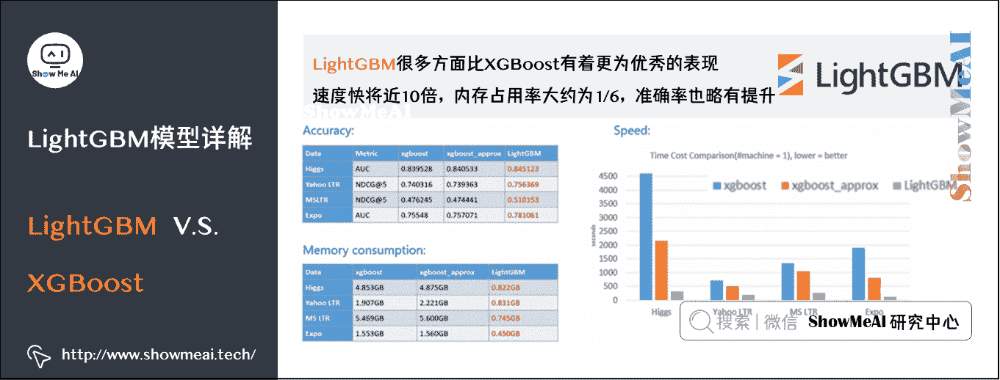

# 1.LightGBM 动机

互联网领域的算法应用，通常背后都有海量的大数据。深度学习中一系列神经网络算法，都是以 mini-batch 的方式喂数据迭代训练的，总训练数据量不受内存限制。

但我们用到的机器学习算法，比如 GBDT（参考 ShowMeAI 文章 [GBDT 详解](http://www.showmeai.tech/article-detail/193)）在每一次迭代的时候，都需要遍历整个训练数据多次。

*   如果把整个训练数据一次性装进内存，会明显限制训练数据的大小。
*   如果不装进内存，反复地读写训练数据又会消耗非常大的时间。

面对工业级海量的数据，普通的 GBDT 算法无法满足需求。LightGBM 提出的主要原因之一，就是为了解决上述大数据量级下的 GBDT 训练问题，以便工业实践中能支撑大数据量并保证效率。

# 2.XGBoost 优缺点

我们之前介绍过强大的 XGBoost（详见 ShowMeAI 文章[图解机器学习 | XGBoost 模型详解](http://www.showmeai.tech/article-detail/194)），但 XGBoost 也依旧存在一些缺点，LightGBM 针对其中的一部分进行了调整优化。XGB 优缺点归纳如下：

## 1）精确贪心算法

轮迭代时，都需要遍历整个训练数据多次。如果把整个训练数据装进内存则会限制训练数据的大小；如果不装进内存，反复地读写训练数据又会消耗非常大的时间。

G a i n = 1 2 [ G L 2 H L + λ + G R 2 H R + λ − ( G L + G R ) 2 H L + H R + λ − γ ] Gain=\frac{1}{2}\left [ \frac{G_{L}^{2}}{H_{L}+\lambda} + \frac{G_{R}^{2}}{H_{R}+\lambda} - \frac{\left(G_{L}+G_{R}\right)^{2}}{H_{L}+H_{R}+\lambda} - \gamma \right ] Gain=21​[HL​+λGL2​​+HR​+λGR2​​−HL​+HR​+λ(GL​+GR​)2​−γ]

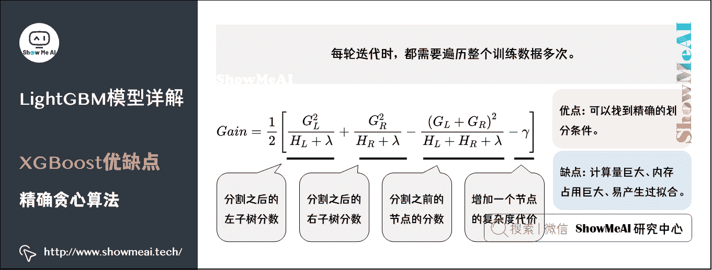

*   优点：可以找到精确的划分条件。
*   缺点：计算量巨大、内存占用巨大、易产生过拟合。

## 2）Level-wise 生长方式

XGBoost 采用 Level-wise 的增长策略：基于层进行生长，直到达到停止条件。这种增长策略方便并行计算每一层的分裂节点，提高了训练速度，但同时也因为节点增益过小增加了很多不必要的分裂，增加了计算量。

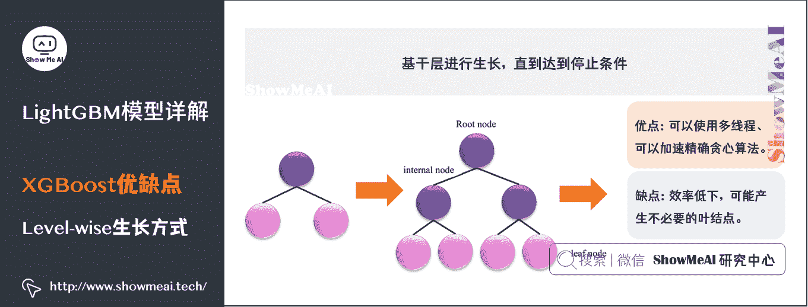

*   优点：可以使用多线程、可以加速精确贪心算法。
*   缺点：效率低下，可能产生不必要的叶结点。

## 3）对 cache 优化不友好

在预排序后，特征对梯度的访问是一种随机访问，并且不同的特征访问的顺序不一样，无法对 cache 进行优化。同时，在每一层长树的时候，需要随机访问一个行索引到叶子索引的数组，并且不同特征访问的顺序也不一样，也会造成较大的 cache miss。

# 3.LightGBM 优化点

上个部分其实也是 LightGBM 作者们，构建新算法时着重优化的点。概括来说，LightGBM 主要有以下特点：

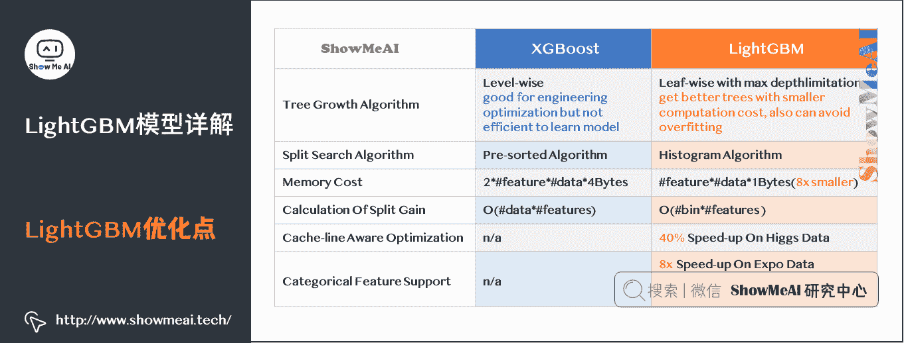

*   基于 Histogram 的决策树算法
*   带深度限制的 Leaf-wise 的叶子生长策略
*   直方图做差加速
*   直接支持类别特征（Categorical Feature）
*   Cache 命中率优化
*   基于直方图的稀疏特征优化
*   多线程优化

# 4.决策树算法

## 1）XGBoost：Pre-sorted 算法

XGBoost 使用的是 Pre-sorted 算法，能够更精确的找到数据分隔点。

*   首先，对所有特征按数值进行预排序。
*   其次，在每次的样本分割时，用 O(#data)的代价找到每个特征的最优分割点。
*   最后，找到最后的特征以及分割点，将数据分裂成左右两个子节点。

这种 pre-sorting 算法能够准确找到分裂点，但是在空间和时间上有很大的开销。

*   由于需要对特征进行预排序并且需要保存排序后的索引值（为了后续快速的计算分裂点），因此内存需要训练数据的两倍。
*   在遍历每一个分割点的时候，都需要进行分裂增益的计算，消耗的代价大。

## 2）LightGBM：直方图算法

LightGBM 使用的是直方图算法（histogram algorithm），占用的内存更低，数据分割的复杂度更低。直方图算法思想是：

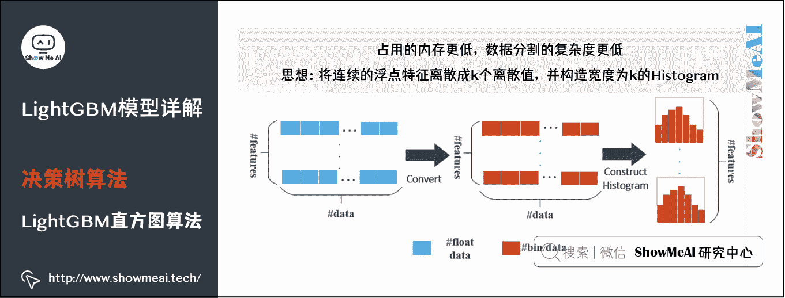

*   将连续的浮点特征离散成 k 个离散值，并构造宽度为 k 的 Histogram。
*   遍历训练数据，统计每个离散值在直方图中的累计统计量。
*   在进行特征选择时，只需要根据直方图的离散值，遍历寻找最优的分割点。

### （1）内存优化

直方图算法可以很大程度降低内存消耗，它不仅不需要额外存储预排序的结果，还可以只保存特征离散化后的值（一般用 8 位整型存储就足够了）。

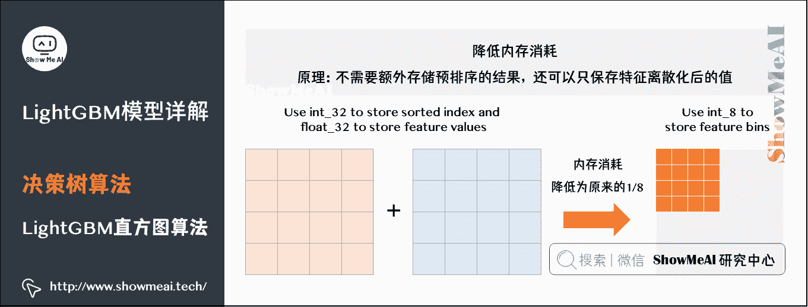

如图所示，用 8 位整型存储，内存消耗可以降低为原来的 1/8。

### （2）计算量优化

应用直方图算法，计算代价也大幅降低，预排序算法每遍历一个特征值就需要计算一次分裂的增益，而直方图算法只需要计算 k 次（k 可以认为是常数），时间复杂度从 O(#data*#feature)直接优化到 O(k#*features)。

### （3）注意点

直方图算法的理解和注意点如下：

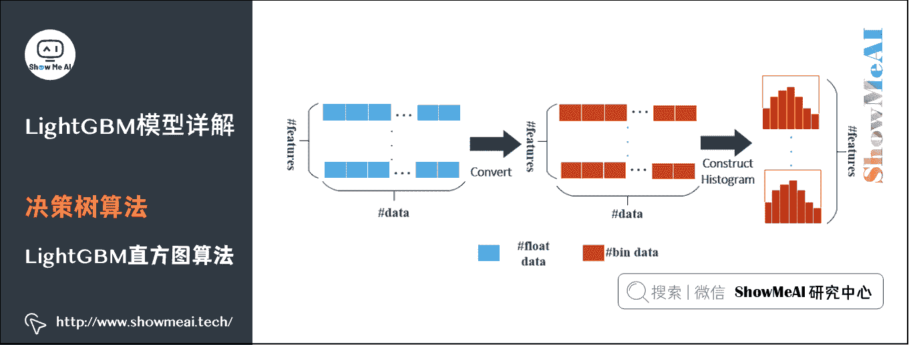

*   使用分桶 bin 替代原始数据相当于增加了正则化。

*   使用分桶 bin 意味着很多数据的细节特征丢失，相似的数据如果划分到相同的桶中，数据之间的差异就无法捕获了。

*   分桶 bin 数量决定了正则化的程度，bin 越少惩罚越严重，欠拟合风险越高。

*   因为预先设定了 bin 的范围，构建直方图时不需要对数据进行排序。

*   直方图保存「划分阈值」、「当前 bin 内样本数」、「当前 bin 内所有样本的一阶梯度和」。

*   阈值的选取是按照直方图从小到大遍历，使用了上面的一阶梯度和，目的是得到划分之后△loss 最大的特征及阈值。

### （4）直方图算法优缺点

*   Histogram 算法并不是完美的。由于特征被离散化后，找到的并不是很精确的分割点，所以会对结果产生影响。但在实际的数据集上表明，离散化的分裂点对最终的精度影响并不大，甚至会好一些。原因在于 decision tree 本身就是一个弱学习器，采用 Histogram 算法会起到正则化的效果，有效地防止模型的过拟合。

*   时间上的开销由原来的 O(#data*#features)降到 O(k*#features)。由于离散化，#bin 远小于#data，因此时间上有很大的提升。

Histogram 算法还可以进一步加速。一个叶子节点的 Histogram 可以直接由父节点的 Histogram 和兄弟节点的 Histogram 做差得到。一般情况下，构造 Histogram 需要遍历该叶子上的所有数据，通过该方法，只需要遍历 Histogram 的 k 个捅。速度提升了一倍。

# 5.决策树生长策略

## 1）树生长策略调整

直方图算法之上，LightGBM 进行进一步的优化。它没有使用大多数 GBDT 工具使用的按层生长（Level-wise）的决策树生长策略，而使用了带有深度限制的按叶子生长（Leaf-wise）算法。

( p m , f m , v m ) = arg ⁡ min ⁡ ( p , f , v ) L ( T m − 1 ( X ) . split ⁡ ( p , f , v ) , Y ) \left(p_{m}, f_{m}, v_{m}\right)=\arg \min _{(p, f, v)} L\left(T_{m-1}(X) . \operatorname{split}(p, f, v), Y\right) (pm​,fm​,vm​)=arg(p,f,v)min​L(Tm−1​(X).split(p,f,v),Y)

T m ( X ) = T m − 1 ( X ) . split ⁡ ( p m , f m , v m ) T_{m}(X)=T_{m-1}(X) . \operatorname{split}\left(p_{m}, f_{m}, v_{m}\right) Tm​(X)=Tm−1​(X).split(pm​,fm​,vm​)

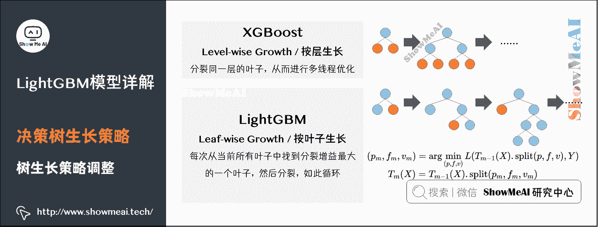

## 2）XGBoost：Level-wise

XGBoost 采用的是 Level-wise（按层生长）策略生长的，能够同时分裂同一层的叶子，从而进行多线程优化，不容易过拟合。

但不加区分的对待同一层的叶子，带来了很多没必要的开销。因为实际上很多叶子的分裂增益较低，没必要进行搜索和分裂。

## 3）LightGBM：Leaf-wise

LightGBM 采用 Leaf-wise（按叶子生长）生长策略，每次从当前所有叶子中找到分裂增益最大（一般也是数据量最大）的一个叶子，然后分裂，如此循环。

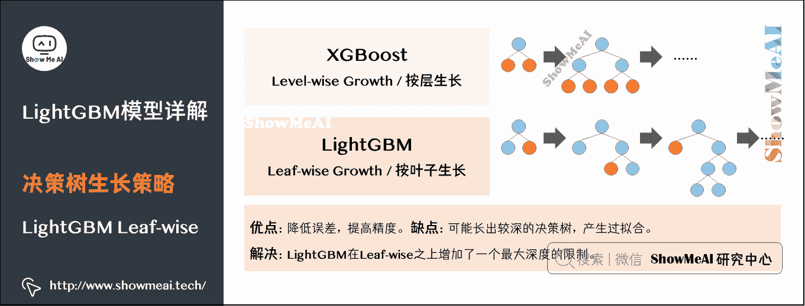

同 Level-wise 相比，在分裂次数相同的情况下，Leaf-wise 可以降低更多的误差，得到更好的精度。Leaf-wise 的缺点是可能会长出比较深的决策树，产生过拟合。因此 LightGBM 在 Leaf-wise 之上增加了一个最大深度的限制，在保证高效率的同时防止过拟合。

# 6.直方图差加速

LightGBM 另一个优化是 Histogram（直方图）做差加速。整个构建过程中可以观察到：一个叶子的直方图可以由它的父亲节点的直方图与它兄弟的直方图做差得到。

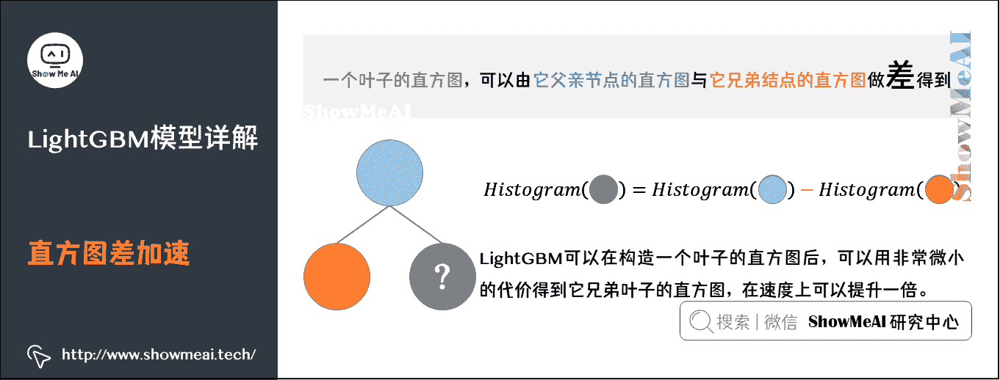

一般来说构造直方图，需要遍历该叶子上的所有数据，但直方图做差仅需遍历直方图的 k 个桶。利用上述特征，LightGBM 可以在构造一个叶子的直方图后，可以用非常微小的代价得到它兄弟叶子的直方图，在速度上可以提升一倍。

# 7.类别型特征支持

大多数机器学习工具都无法直接支持类别型特征，我们会先将其编码再做后续建模，如果使用 one-hot 这种编码方式还会降低空间和时间效率。

LightGBM 优化了对类别型特征的支持，可以直接输入类别特征，不需要额外的编码或 one-hot 0/1 展开。并在决策树算法上增加了类别型特征的决策规则。

## 1）树模型与 one-hot 编码

one-hot 编码是处理类别特征的一个通用方法，然而在树模型中，这可能并不一定是一个好的方法，尤其当类别特征中类别个数很多的情况下，主要的问题是：

**问题 1：可能无法在这个类别特征上进行切分**。

使用 one-hot 编码的话，意味着在每一个决策节点上只能使用 one vs rest（例如是不是男性，是不是一线城市等）的切分方式。当类别值很多时，每个类别上的数据可能会比较少，这时候切分会产生不平衡，这意味着切分增益也会很小。

**问题 2：影响决策树的学习**。

就算可以在这个类别特征进行切分，也会把数据切分到很多零碎的小空间上，如下左图所示。而决策树学习时利用的是统计信息，在这些数据量小的空间上，统计信息不准确，学习会变差。但如果使用下右图的分裂方式，数据会被切分到两个比较大的空间，进一步的学习也会更好。

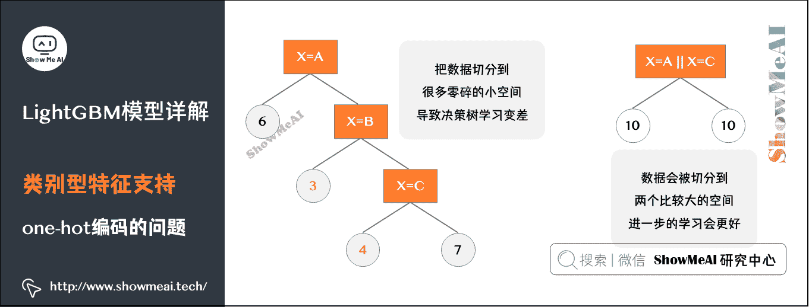

圈中的数值表示该结点内的数据。右图中叶子节点 X=A || X=C 的含义是 X=A 或者 X=C 放到左孩子，其余放到右孩子。

## 2）LightGBM 类别型特征处理方式

LightGBM 采用了 Many vs Many 的切分方式解决 one-hot 编码带来的问题，实现了类别特征的最优切分。用 LightGBM 可以直接输入类别特征，并产生上右图的效果。
在 1 个 k 维的类别特征中寻找最优切分，朴素的枚举算法的复杂度是 O ( 2 k ) O(2^k) O(2k)，而 LightGBM 采用了如 On Grouping For Maximum Homogeneity 的方法实现了 O ( k log ⁡ k ) O(k\log k) O(klogk) 的算法。

算法流程如图所示：

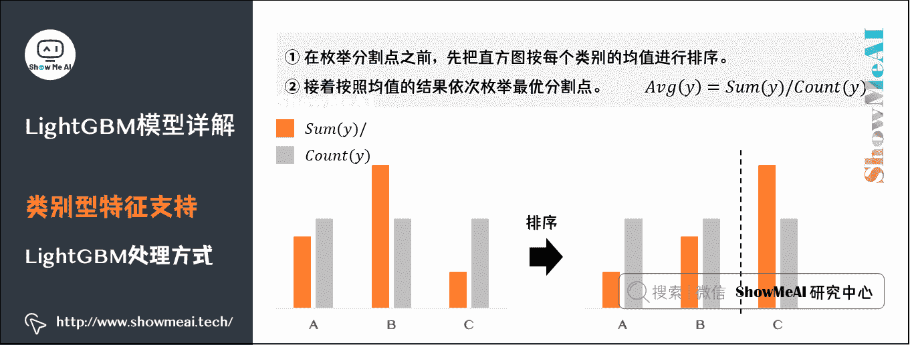

*   ①在枚举分割点之前，先把直方图按每个类别的均值进行排序。

*   ②接着按照均值的结果依次枚举最优分割点。

从下图可以看到，Sum(y)/Count(y)为类别的均值。当然，这个方法很容易过拟合，所以在 LightGBM 中加入了很多对这个方法的约束和正则化。

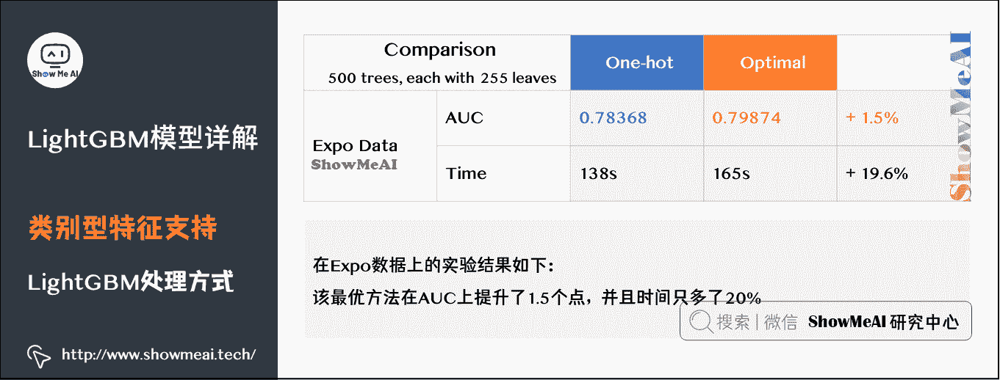

求解类别型特征的最优切分的具体流程如下：

**① 离散特征建立直方图的过程**

统计该特征下每一种离散值出现的次数，并从高到低排序，并过滤掉出现次数较少的特征值。然后为每一个特征值，建立一个 bin 容器，对于在 bin 容器内出现次数较少的特征值直接过滤掉，不建立 bin 容器。

**② 计算分裂阈值的过程**

*   先看该特征下划分出的 bin 容器的个数，如果 bin 容器的数量小于 4，直接使用 one vs other 方式，逐个扫描每一个 bin 容器，找出最佳分裂点。

*   对于 bin 容器较多的情况，先进行过滤，只让子集合较大的 bin 容器参加划分阈值计算，对每一个符合条件的 bin 容器进行公式计算，得到一个值，根据该值对 bin 容器从小到大进行排序，然后分从左到右、从右到左进行搜索，得到最优分裂阈值。公式如下：

该 b i n 容 器 下 所 有 样 本 的 一 阶 梯 度 之 和 该 b i n 容 器 下 所 有 样 本 的 二 阶 梯 度 之 和 + 正 则 项 （ 参 数 c a t - s m o o t h ） \frac{该 bin 容器下所有样本的一阶梯度之和}{该 bin 容器下所有样本的二阶梯度之和} + 正则项（参数 {cat \text{-} smooth}） 该 bin 容器下所有样本的二阶梯度之和该 bin 容器下所有样本的一阶梯度之和​+正则项（参数 cat-smooth）

这里为什么不是 label 的均值呢？其实上例中只是为了便于理解，只针对了学习一棵树且是回归问题的情况。这时候一阶导数是 Y，二阶导数是 1），

*   没有搜索所有的 bin 容器，而是设定了一个搜索 bin 容器数量的上限值，程序中设定是 32，即参数 max_num_cat。
*   LightGBM 中对离散特征实行的是 many vs many 策略，这 32 个 bin 中最优划分的阈值的左边或者右边所有的 bin 容器就是一个 many 集合，而其他的 bin 容器就是另一个 many 集合。

**③ 对于连续特征，划分阈值只有一个。对于离散值可能会有多个划分阈值，每一个划分阈值对应着一个 bin 容器编号**。

当使用离散特征进行分裂时，只要数据样本对应的 bin 容器编号在这些阈值对应的 bin 集合之中，这条数据就加入分裂后的左子树，否则加入分裂后的右子树。

# 8.并行支持与优化

LightGBM 原生支持并行学习，目前支持「特征并行」和「数据并行」的两种，LightGBM 针对这两种并行方法都做了优化。

*   **特征并行**：在不同机器在不同的特征集合上分别寻找最优的分割点，然后在机器间同步最优的分割点。

*   **数据并行**：让不同的机器先在本地构造直方图，然后进行全局的合并，最后在合并的直方图上面寻找最优分割点。

## 1）特征并行

LightGBM 在特征并行算法中，通过在本地保存全部数据避免对数据切分结果的通信。

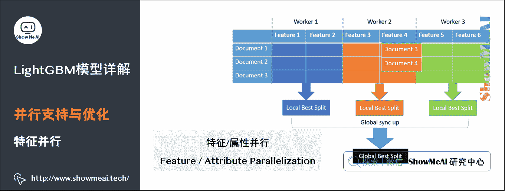

## 2）数据并行

Lightgbm 在数据并行中使用分散规约（Reduce scatter）把直方图合并的任务分摊到不同的机器，降低通信和计算，并利用直方图做差，进一步减少了一半的通信量。

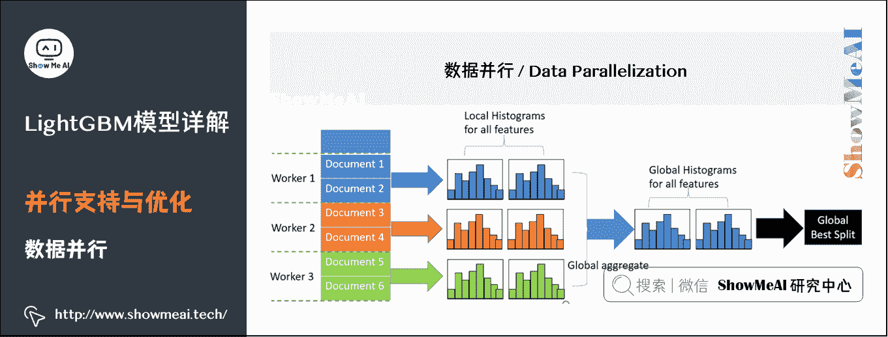

基于投票的数据并行则进一步优化数据并行中的通信代价，使通信代价变成常数级别。在数据量很大的时候，使用投票并行可以得到非常好的加速效果。

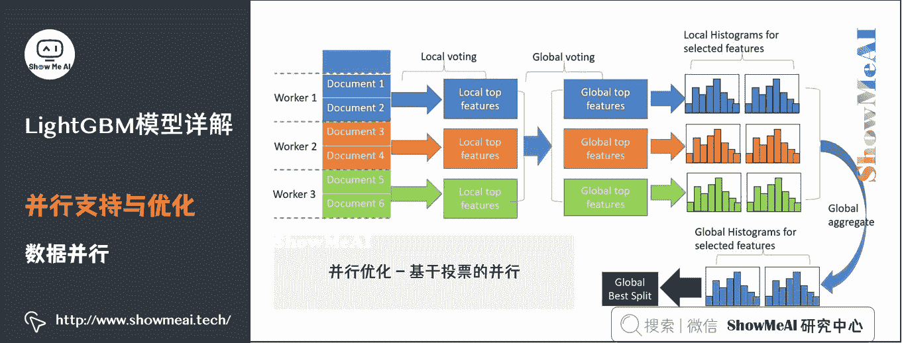

> 更具体的内容可以看 NIPS2016 的文章： A Communication-Efficient Parallel Algorithm for Decision Tree。

# 9.网络通信优化

XGBoost 由于采用 Pre-sorted 算法，直接通信代价比较大；LightGBM 采用的 histogram 算法通信代价小，通过使用集合通信算法，能够实现并行计算的线性加速。

# 10.参考资料

*   [`www.zhihu.com/question/51644470`](https://www.zhihu.com/question/51644470)
*   [`zhuanlan.zhihu.com/p/34698733`](https://zhuanlan.zhihu.com/p/34698733)
*   [`lightgbm.readthedocs.io/en/latest/Features.html`](https://lightgbm.readthedocs.io/en/latest/Features.html)
*   [`papers.nips.cc/paper/6907-lightgbm-a-highly-efficient-gradient-boosting-decision-tree.pdf`](https://papers.nips.cc/paper/6907-lightgbm-a-highly-efficient-gradient-boosting-decision-tree.pdf)
*   [`huangzhanpeng.github.io/2018/01/04/A-Highly-Ef%EF%AC%81cient-Gradient-Boosting-Decision-Tree/`](https://huangzhanpeng.github.io/2018/01/04/A-Highly-Ef%EF%AC%81cient-Gradient-Boosting-Decision-Tree/)
*   [`www.msra.cn/zh-cn/news/features/lightgbm-20170105`](https://www.msra.cn/zh-cn/news/features/lightgbm-20170105)

更多监督学习的算法模型总结可以查看 ShowMeAI 的文章 [AI 知识技能速查 | 机器学习-监督学习](http://www.showmeai.tech/article-detail/113)。

## ShowMeAI 相关文章推荐

*   [1.机器学习基础知识](http://www.showmeai.tech/article-detail/185)
*   [2.模型评估方法与准则](http://www.showmeai.tech/article-detail/186)
*   [3.KNN 算法及其应用](http://www.showmeai.tech/article-detail/187)
*   [4.逻辑回归算法详解](http://www.showmeai.tech/article-detail/188)
*   [5.朴素贝叶斯算法详解](http://www.showmeai.tech/article-detail/189)
*   [6.决策树模型详解](http://www.showmeai.tech/article-detail/190)
*   [7.随机森林分类模型详解](http://www.showmeai.tech/article-detail/191)
*   [8.回归树模型详解](http://www.showmeai.tech/article-detail/192)
*   [9.GBDT 模型详解](http://www.showmeai.tech/article-detail/193)
*   [10.XGBoost 模型最全解析](http://www.showmeai.tech/article-detail/194)
*   [11.LightGBM 模型详解](http://www.showmeai.tech/article-detail/195)
*   [12.支持向量机模型详解](http://www.showmeai.tech/article-detail/196)
*   [13.聚类算法详解](http://www.showmeai.tech/article-detail/197)
*   [14.PCA 降维算法详解](http://www.showmeai.tech/article-detail/198)

## ShowMeAI 系列教程推荐

*   [图解 Python 编程：从入门到精通系列教程](http://www.showmeai.tech/tutorials/56)
*   [图解数据分析：从入门到精通系列教程](http://www.showmeai.tech/tutorials/33)
*   [图解 AI 数学基础：从入门到精通系列教程](http://showmeai.tech/tutorials/83)
*   [图解大数据技术：从入门到精通系列教程](http://www.showmeai.tech/tutorials/84)
*   [图解机器学习算法：从入门到精通系列教程](http://www.showmeai.tech/tutorials/34)

