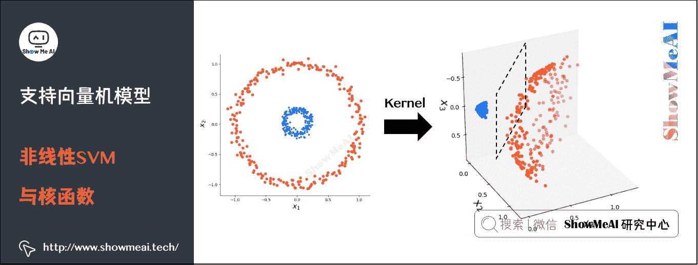

# 图解机器学习 | 支持向量机模型详解

> 原文：[`blog.csdn.net/ShowMeAI/article/details/123407441`](https://blog.csdn.net/ShowMeAI/article/details/123407441)


作者：[韩信子](https://github.com/HanXinzi-AI)@[ShowMeAI](http://www.showmeai.tech/)
[教程地址](http://www.showmeai.tech/tutorials/34)：[`www.showmeai.tech/tutorials/34`](http://www.showmeai.tech/tutorials/34)
[本文地址](http://www.showmeai.tech/article-detail/196)：[`www.showmeai.tech/article-detail/196`](http://www.showmeai.tech/article-detail/196)
**声明：版权所有，转载请联系平台与作者并注明出处**

* * *

# 引言

本篇我们要讲解的模型是大名鼎鼎的支持向量机 SVM，这是曾经在机器学习界有着近乎「垄断」地位的模型，影响力持续了好多年。直至今日，即使深度学习神经网络的影响力逐渐增强，但 SVM 在中小型数据集上依旧有着可以和神经网络抗衡的极好效果和模型鲁棒性。

支持向量机学习方法，针对不同的情况，有由简至繁的不同模型：

*   **线性可分支持向量机**（linear support vector machine in linearly separable case）：训练数据线性可分的情况下，通过硬间隔最大化（hard margin maximization），学习一个线性的分类器，即线性可分支持向量机（亦称作硬间隔支持向量机）。

*   **线性支持向量机**（linear support vector machine）：训练数据近似线性可分的情况下，通过软间隔最大化（soft margin maximization），学习一个线性的分类器，称作线性支持向量机（又叫软间隔支持向量机）。

*   **非线性支持向量机**（non-linear support vector machine）：训练数据线性不可分的情况下，通过使用核技巧（kernel trick）及软间隔最大化，学习非线性分类器，称作非线性支持向量机。


支持向量机可以借助核技巧完成复杂场景下的非线性分类，当输入空间为欧式空间或离散集合、特征空间为希尔贝特空间时，核函数（kernel function）表示将输入从输入空间映射到特征空间得到的特征向量之间的内积。

通过使用核函数可以学习非线性支持向量机，等价于隐式地在高维的特征空间中学习线性支持向量机。这样的方法称为核技巧。


# 1.最大间隔分类器

## 1）分类问题与线性模型

分类问题是监督学习的一个核心问题。在监督学习中，当输出变量取有限个离散值时，预测问题便成为分类问题。实际生活中，有很多问题的本质都是分类，如识别某种模式：文本分类、分词、词性标注、图像内容识别和目标检测等。


分类问题的数学理解是空间划分（或者寻找不同类别的决策边界），如下图所示是一个简单的线性分类器（这部分更详细的讲解参考 ShowMeAI 文章 [图解机器学习 | 机器学习基础知识](http://www.showmeai.tech/article-detail/185) 和 [图解机器学习 | 逻辑回归算法详解](http://www.showmeai.tech/article-detail/188)）。


## 2）最大间隔分类器

不同的模型在解决分类问题时，会有不同的处理方式，直观上看，我们会使用不同的决策边界对样本进行划分。

如下图中「冰墩墩」与「雪容融」两类样本点，我们对其进行分类，可以完成该分类任务的决策边界有无数个。而我们这里介绍到的 SVM 模型，要求更高一些，它不仅仅希望把两类样本点区分开，还希望找到鲁棒性最高、稳定性最好的决策边界（对应图中的黑色直线）。


这个决策边界与两侧「最近」的数据点有着「最大」的距离，这意味着决策边界具有最强的容错性，不容易受到噪声数据的干扰。直观的理解就是，如果决策边界抖动，最不容易「撞上」样本点或者进而导致误判。

# 2.支持向量机详解

## 1）线性可分 SVM 与硬间隔最大化

我们要找到把下图中红蓝两色的图标点分开的最优分界线。令红色的图标点 = + 1 =+1 =+1 ，蓝色的图标的点 = − 1 =-1 =−1 ，直线 f ( x ) = w ⋅ x + b f(x) = \boldsymbol{w}\cdot \boldsymbol{x} + b f(x)=w⋅x+b ，这里 w 、 x w、x w、x 是向量，其实公式等价于 f ( x ) = w 1 x 1 + w 2 x 2 + … + w n x n + b f(x) = w_1x_1 + w_2x_2 +…+ w_nx_n + b f(x)=w1​x1​+w2​x2​+…+wn​xn​+b 。


*   当向量 x x x 为二维向量时， f ( x ) f(x) f(x) 表示二维空间中的一条直线。

*   当向量 x x x 为三维向量时， f ( x ) f(x) f(x) 表示三维空间中的一个平面。

*   当向量 x x x 的 n n n 维向量（ f n > 3 fn>3 fn>3 ）时， f ( x ) f(x) f(x) 表示 n n n 维空间中的 n − 1 n-1 n−1 维超平面。

当有一个新的点 x x x 需要预测属于哪个分类的时候，我们用 s g n ( f ( x ) ) sgn(f(x)) sgn(f(x)) 就可以预测了。 s g n sgn sgn 表示符号函数：


*   当 f ( x ) > 0 f(x)>0 f(x)>0 的时候， s g n ( f ( x ) ) = + 1 sgn(f(x)) = +1 sgn(f(x))=+1 。

*   当 f ( x ) < 0 f(x) < 0 f(x)<0 的时候 s g n ( f ( x ) ) = – 1 sgn(f(x)) = –1 sgn(f(x))=–1 。

回到重点，我们怎样才能取得一个最优的划分直线 f ( x ) f(x) f(x) 呢？下图的直线表示几条可能的 f ( x ) f(x) f(x) ：


我们希望这条直线满足「最大间隔」原则，也就是如下图的形态。图中位于红色和蓝色线上的图标就是所谓的支持向量（support vector）。


决策边界就是 f ( x ) f(x) f(x) ，红色和蓝色的线是支持向量（support vector）所在的面，红色、蓝色线之间的间隙就是我们要最大化的分类间的间隙 M（Margin Width）。


这里直接给出间隔 M 的计算公式： M = 2 ∥ w ∥ M=\frac{2}{\left \| w \right \| } M=∥w∥2​ 。


SVM 要求解能够正确划分训练数据集并且「几何间隔」最大的分离超平面。

如下图所示， w ⋅ x + b = 0 \boldsymbol{w} \cdot \boldsymbol{x}+b=0 w⋅x+b=0 即为分离超平面。对于线性可分的数据集来说，这样的超平面有无穷多个（即感知机），但是几何间隔最大的分离超平面却是唯一的。

我们先做一些定义，假设给定一个特征空间上的训练数据集： T = ( x 1 , y 1 ) , ( x 2 , y 2 ) , … , ( x N , y N ) T={(x_1, y_1),(x_2, y_2), \ldots,(x_N, y_N)} T=(x1​,y1​),(x2​,y2​),…,(xN​,yN​) 。且训练数据集是线性可分的，其中：

*   x i ∈ R n x_i \in \mathbb{R}^{n} xi​∈Rn ， y i ∈ { + 1 , − 1 } y_{i} \in \left \{+1,-1 \right \} yi​∈{+1,−1} ， i = 1 , 2 , … N , x i i=1,2, \ldots N,x_{i} i=1,2,…N,xi​ 为第 i i i 个特征向量。

*   y i y_{i} yi​ 为类标记，当它等于 + 1 +1 +1 时为正例；为 − 1 -1 −1 时为负例。


### （1）几何间隔

对于给定的数据集 T T T 和超平面 w x + b = 0 wx+b=0 wx+b=0 。

*   定义超平面关于样本点 ( x i , y i ) (x_{i}, y_{i}) (xi​,yi​) 的几何间隔为： γ i = y i ( w ∥ w ∥ ⋅ x i + b ∥ w ∥ ) \gamma_{i} = y_i(\frac{w}{\left \| w \right \| } \cdot x_i + \frac{b}{\left \| w \right \| }) γi​=yi​(∥w∥w​⋅xi​+∥w∥b​)

*   超平面关于所有样本点的几何间隔的最小值为： γ = min ⁡ i = 1 , 2 … , N γ i \gamma = \min _{i=1,2 \ldots, N} \gamma_{i} γ=mini=1,2…,N​γi​ ，实际上这个距离就是我们所谓的「支持向量到超平面的距离」。


**① 根据以上定义，SVM 模型的「求解最大分割超平面问题」可以表示为以下约束最优化问题**：

max ⁡ w , b γ s . t . y i ( w ∥ w ∥ ⋅ x i + b ∥ w ∥ ) ≥ γ , i = 1 , 2 , … , N \begin{aligned} & \max _{w,b} \gamma \\ & s.t. \quad y_{i}(\frac{w}{\left \| w \right \|} \cdot x_i+\frac{b}{\left \| w \right \|}) \geq \gamma, i=1,2, \ldots, N\\ \end{aligned} ​w,bmax​γs.t.yi​(∥w∥w​⋅xi​+∥w∥b​)≥γ,i=1,2,…,N​

*   上面公式中 s.t 是 subject to 的缩写，也就是限制条件的意思。

**② 将约束条件两边同时除以 γ \gamma γ 得到**：

y i ( w ∥ w ∥ γ ⋅ x i + b ∥ w ∥ γ ) ≥ 1 y_{i}(\frac{w}{\left \| w \right \| \gamma} \cdot x_i+\frac{b}{\left \| w \right \|\gamma}) \geq 1 yi​(∥w∥γw​⋅xi​+∥w∥γb​)≥1

**③ 因为 ∥ w ∥ \left \| w \right \| ∥w∥ 、 γ \gamma γ 都是标量，所以为了表达式简洁，令： w = w ∥ w ∥ γ w=\frac{w}{\left \| w \right \| \gamma} w=∥w∥γw​ 、 b = b ∥ w ∥ γ b=\frac{b}{\left \| w \right \| \gamma} b=∥w∥γb​ 得到**：

y i ( w ⋅ x i + b ) ≥ 1 , i = 1 , 2 , … , N y_i(w \cdot x_i+b) \geq 1, i=1,2, \ldots, N yi​(w⋅xi​+b)≥1,i=1,2,…,N

**④ 又因为最大化 γ \gamma γ ，等价于最大化 1 ∥ w ∥ \frac{1}{\left \| w \right \|} ∥w∥1​ ，也就等价于最小化 1 2 ∥ w ∥ 2 \frac{1}{2}\left \| w \right \|^{2} 21​∥w∥2 ，最终 SVM 模型的求解最大分割超平面问题又可以表示为以下约束最优化问题**：

min ⁡ w , b 1 2 ∥ w ∥ 2 s . t . y i ( w ⋅ x i + b ) ≥ 1 , i = 1 , 2 , … , N \begin{aligned} & \min _{w, b} \frac{1}{2}\left \| w \right \|^{2}\\ & s.t. \quad y_{i}(w \cdot x_i+b) \geq 1, i=1,2, \ldots, N \end{aligned} ​w,bmin​21​∥w∥2s.t.yi​(w⋅xi​+b)≥1,i=1,2,…,N​

### （2）对偶算法

求解线性可分支持向量机的最优化问题，我们很多时候会将它转化为对偶问题（dual problem）来求解，也就是应用「拉格朗日对偶性」，通过求解「对偶问题（dual problem）」得到「原始问题（primal problem）」的最优解，即线性可分支持向量机的对偶算法（dual algorithm）。

这样做有一些优点：

*   对偶问题往往更容易求解。

*   引入自然核函数，进而可以推广到非线性分类问题。

**① 我们首先构建拉格朗日函数（Lagrange function）**。为此，对每一个不等式约束引进拉格朗日乘子（Lagrange multiplier） α i ≥ 0 , i = 1 , 2 , … , N \alpha_i\geq 0,i=1,2,…,N αi​≥0,i=1,2,…,N ，定义拉格朗日函数：

L ( w , b , α ) = 1 2 w T w + ∑ i = 1 N α i ( 1 − y i ( w T x i + b ) ) = 1 2 w T w − ∑ i = 1 N α i y i ( w T x i + b ) + ∑ i = 1 N α i \begin{aligned} L(w, b, \alpha)=&\frac{1}{2}w^Tw+\sum_{i=1}^{N}\alpha_i(1-y_i(w^T x_i + b)) \\ =& \frac{1}{2}w^Tw-\sum_{i=1}^{N}\alpha_i y_i(w^T x_i + b) +\sum_{i=1}^{N}\alpha_i \end{aligned} L(w,b,α)==​21​wTw+i=1∑N​αi​(1−yi​(wTxi​+b))21​wTw−i=1∑N​αi​yi​(wTxi​+b)+i=1∑N​αi​​

根据拉格朗日对偶性，原始问题的对偶问题是极大极小问题： max ⁡ α min ⁡ w , b L ( w , b , α ) \max_{\alpha}\min_{w,b}L(w, b, \alpha) maxα​minw,b​L(w,b,α) 。所以，为了得到对偶问题的解，需要先求 L ( w , b , α ) L(w, b, \alpha) L(w,b,α) 对 w 、 b w、b w、b 的极小值，再求对 $\alpha $ 的极大值。

**② 求 L ( w , b , α ) L(w, b, \alpha) L(w,b,α) 对 w 、 b w、b w、b 的极小值**

将拉格朗日函数 L ( w , b , α ) L(w, b, \alpha) L(w,b,α) 分别对 w 、 b w、b w、b 求偏导，并令其值为 0。

∂ L ∂ w = w – ∑ i = 1 N α i y i x i = 0 ⇒ w = ∑ i = 1 N α i y i x i \frac{\partial L}{\partial w} = w – \sum_{i=1}^{N}\alpha_i y_i x_i =0 \Rightarrow w = \sum_{i=1}^{N}\alpha_i y_i x_i ∂w∂L​=w–i=1∑N​αi​yi​xi​=0⇒w=i=1∑N​αi​yi​xi​

∂ L b = − ∑ i = 1 N α i y i = 0 ⇒ ∑ i = 1 N α i y i = 0 \frac{\partial L}{b}=-\sum_{i=1}^{N}\alpha_iy_i=0 \Rightarrow \sum_{i=1}^{N}\alpha_iy_i=0 b∂L​=−i=1∑N​αi​yi​=0⇒i=1∑N​αi​yi​=0

将上式代入拉格朗日函数，即得：

min ⁡ w , b L ( w , b , α ) = 1 2 ( ∑ i = 1 N α i y i x i ) T ∑ i = 1 N α i y i x i − ∑ i = 1 N α i y i ( ( ∑ i = 1 N α i y i x i ) T x i + b ) + ∑ i = 1 N α i = 1 2 ∑ i = 1 N ∑ j = 1 N α i y i α j y j x i T x j − ∑ i = 1 N ∑ j = 1 N α i y i α j y j x j T x i + ∑ i = 1 N α i = − 1 2 ∑ i = 1 N ∑ j = 1 N α i y i α j y j x i T x j + ∑ i = 1 N α i \begin{aligned} \min_{w,b} L(w, b,\alpha)=&\frac{1}{2} (\sum_{i=1}^{N}\alpha_i y_i x_i)^T \sum_{i=1}^{N}\alpha_i y_i x_i-\sum_{i=1}^{N}\alpha_i y_i((\sum_{i=1}^{N}\alpha_i y_i x_i)^T x_i + b) +\sum_{i=1}^{N}\alpha_i \\ =&\frac{1}{2}\sum_{i=1}^{N}\sum_{j=1}^{N}\alpha_i y_i\alpha_j y_jx_i^Tx_j-\sum_{i=1}^{N}\sum_{j=1}^{N}\alpha_i y_i\alpha_j y_jx_j^Tx_i+\sum_{i=1}^{N}\alpha_i \\ =& -\frac{1}{2}\sum_{i=1}^{N}\sum_{j=1}^{N}\alpha_i y_i\alpha_j y_jx_i^Tx_j+\sum_{i=1}^{N}\alpha_i \end{aligned} w,bmin​L(w,b,α)===​21​(i=1∑N​αi​yi​xi​)Ti=1∑N​αi​yi​xi​−i=1∑N​αi​yi​((i=1∑N​αi​yi​xi​)Txi​+b)+i=1∑N​αi​21​i=1∑N​j=1∑N​αi​yi​αj​yj​xiT​xj​−i=1∑N​j=1∑N​αi​yi​αj​yj​xjT​xi​+i=1∑N​αi​−21​i=1∑N​j=1∑N​αi​yi​αj​yj​xiT​xj​+i=1∑N​αi​​


**③ 求 min ⁡ w , b L ( w , b , α ) \min_{w,b}L(w, b,\alpha) minw,b​L(w,b,α) 对 α \alpha α 的极大值，即对偶问题**

max ⁡ α − 1 2 ∑ i = 1 N ∑ j = 1 N α i y i α j y j x i T x j + ∑ i = 1 N α i s . t . ∑ i = 1 N α i y i = 0 α i ≥ 0 , i = 1 , 2 … N \begin{aligned} & \max_{\alpha} -\frac{1}{2}\sum_{i=1}^{N}\sum_{j=1}^{N}\alpha_i y_i\alpha_j y_jx_i^Tx_j+\sum_{i=1}^{N}\alpha_i \\ & s.t. \quad \sum_{i=1}^{N}\alpha_iy_i=0 \\ & \quad \quad \alpha_i \geq 0,i=1, 2…N \end{aligned} ​αmax​−21​i=1∑N​j=1∑N​αi​yi​αj​yj​xiT​xj​+i=1∑N​αi​s.t.i=1∑N​αi​yi​=0αi​≥0,i=1,2…N​

将式中的目标函数由求极大转换成求极小，就得到下面与之等价的对偶最优化问题：

min ⁡ α 1 2 ∑ i = 1 N ∑ j = 1 N α i y i α j y j x i T x j − ∑ i = 1 N α i s . t . ∑ i = 1 N α i y i = 0 α i ≥ 0 , i = 1 , 2 … N \begin{aligned} & \min_{\alpha} \frac{1}{2}\sum_{i=1}^{N}\sum_{j=1}^{N}\alpha_i y_i\alpha_j y_jx_i^Tx_j-\sum_{i=1}^{N}\alpha_i \\ & s.t. \quad \sum_{i=1}^{N}\alpha_iy_i=0 \\ & \quad \quad \alpha_i \geq 0,i=1, 2…N \end{aligned} ​αmin​21​i=1∑N​j=1∑N​αi​yi​αj​yj​xiT​xj​−i=1∑N​αi​s.t.i=1∑N​αi​yi​=0αi​≥0,i=1,2…N​


**④ 对线性可分训练数据集，假设对偶最优化问题对 α \alpha α 的解为 α ∗ = ( α 1 ∗ , α 2 ∗ , … , α N ∗ ) T \alpha^*=(\alpha_1^*,\alpha_2^*,…,\alpha_N^*)^ T α∗=(α1∗​,α2∗​,…,αN∗​)T ，可以由 α ∗ \alpha^* α∗ 求得原始最优化问题的解 w ∗ 、 b ∗ w^*、b^* w∗、b∗ **。

有下面的定理：设 α ∗ = ( α 1 ∗ , α 2 ∗ , … , α N ∗ ) T \alpha^*=(\alpha_1^*,\alpha_2^*,…,\alpha_N^*)^T α∗=(α1∗​,α2∗​,…,αN∗​)T 是对偶最优化问题的解，则存在下标 j j j ，使得 α j ∗ > 0 \alpha_j^*>0 αj∗​>0 ，并可按下式求得原始最优化问题的解 w ∗ , b ∗ w^*,b^* w∗,b∗ ：

w ∗ = ∑ i = 1 ∗ N α i ∗ y i x i w^*=\sum_{i=1}^*{N} \alpha_i^*y_ix_i w∗=i=1∑∗​Nαi∗​yi​xi​

b ∗ = y j − ∑ i = 1 ∗ N α i ∗ y i ( x i ∗ T x j ) b^*=y_j-\sum_{i=1}^*{N} \alpha_i^*y_i(x_i^*Tx_j) b∗=yj​−i=1∑∗​Nαi∗​yi​(xi∗​Txj​)

证明：根据定理，KKT 条件成立，即得：

∂ L ( w ∗ , b ∗ , α ∗ ) ∂ w = w ∗ − ∑ i = 1 N α i ∗ y i x i = 0 ∂ L ( w ∗ , b ∗ , α ∗ ) ∂ b = − ∑ i = 1 N α i ∗ y i = 0 ∂ L ( w ∗ , b ∗ , α ∗ ) ∂ α = 0 α i ( 1 − y i ( w T x i + b ) ) = 0 α i ≥ 0 , i = 1 , 2 , … , N 1 − y i ( w T x i + b ) ≤ 0 , i = 1 , 2 , … , N \begin{aligned} & \frac{\partial L(w^*,b^*,\alpha ^*)}{\partial w} = w^*-\sum_{i=1}^{N}\alpha_i^* y_i x_i=0 \\ & \frac{\partial L(w^*,b^*,\alpha ^*)}{\partial b} = -\sum_{i=1}^{N}\alpha_i^*y_i=0 \\ & \frac{\partial L(w^*,b^*,\alpha ^*)}{\partial \alpha} = 0 \\ & \alpha_i(1-y_i(w^Tx_i+b)) =0 \\ & \alpha_i \geq 0 , \\ & i=1,2,…,N \\ & 1-y_i(w^Tx_i+b) \leq 0 , i=1,2,…,N \end{aligned} ​∂w∂L(w∗,b∗,α∗)​=w∗−i=1∑N​αi∗​yi​xi​=0∂b∂L(w∗,b∗,α∗)​=−i=1∑N​αi∗​yi​=0∂α∂L(w∗,b∗,α∗)​=0αi​(1−yi​(wTxi​+b))=0αi​≥0,i=1,2,…,N1−yi​(wTxi​+b)≤0,i=1,2,…,N​

由此得 w ∗ = ∑ i = 1 N α i ∗ y i x i w^*=\sum_{i=1}^{N} \alpha_i^*y_ix_i w∗=∑i=1N​αi∗​yi​xi​

\其中至少有一个 α j ∗ > 0 \alpha_j^*>0 αj∗​>0 （用反正法，假设 α j ∗ = 0 \alpha_j^*=0 αj∗​=0 ，由式可知 w ∗ = 0 w^*=0 w∗=0 ，而 w ∗ = 0 w^*=0 w∗=0 不是原始最优化问题的解，产生矛盾），由此对 j j j 有： y j ( w ∗ ⋅ x j + b ∗ ) – 1 = 0 y_j(w^*\cdot x_j+b^*) – 1 = 0 yj​(w∗⋅xj​+b∗)–1=0

将式代入并注意到 y j 2 = 1 y_j²=1 yj2​=1 ，即得： b ∗ = y j – w ∗ x j = y j – ∑ i = 1 N α i ∗ y i ( x i x j ) b^* = y_j – w^*{}x_j = y_j – \sum_{i=1}^{N} \alpha_i^*y_i(x_ix_j) b∗=yj​–w∗xj​=yj​–∑i=1N​αi∗​yi​(xi​xj​)

**⑤ 由此定理可知，分离超平面可以写成**

∑ i = 1 N α i ∗ y i ( x ⋅ x i ) + b ∗ = 0 \sum_{i=1}^{N} \alpha_i^*y_i(x\cdot x_i) + b^* = 0 i=1∑N​αi∗​yi​(x⋅xi​)+b∗=0

**⑥ 分类决策函数可以写成**

f ( x ) = s i g n ( ∑ i = 1 N α i ∗ y i ( x ⋅ x i ) + b ∗ ) f(x) = sign(\sum_{i=1}^{N} \alpha_i^*y_i(x\cdot x_i) + b^*) f(x)=sign(i=1∑N​αi∗​yi​(x⋅xi​)+b∗)


也就是说，这里的决策函数只依赖于输入 x x x 和训练样本输入的内积。上式亦称作线性可分 SVM 的对偶形式。

综上所述，对于给定得线性可分训练数据集，可以首先求对偶问题的解 α ∗ \alpha^* α∗ ；再利用公式求得原始问题的解 w ∗ , b ∗ w^*,b^* w∗,b∗ ；从而得到分离超平面及分类决策函数。这种算法称为线性可分支持向量机的对偶学习算法，是线性可分支持向量机学习的基本算法。

## 2）线性 SVM 与软间隔最大化

我们前面提到的是线性可分的情况，但实际应用中完全线性可分的情况太少见了。如下图就是一个典型的线性不可分的分类图（我们没有办法找到一条直线，把空间划分为 2 个区域，一个区域只有黑点，一个区域只有白点）。

要对其进行切分，有 2 种方案：

**方案 1：用曲线去将其完全分开，即非线性的决策边界，这会和之后谈到的核函数关联**。


**方案 2：还是使用直线，不过不追求完全可分，会适当包容一些分错的情况，在这个过程中我们会在模型中加入惩罚函数，尽量让分错的点不要太多太离谱**。对分错点的惩罚函数就是这个点到其正确位置的距离，如下图所示：


图上黄色、蓝色的直线分别为支持向量所在的边界，黑色的线为决策函数，那些绿色的线表示分错的点到其相应的决策面的距离，这样我们可以在原函数上面加上一个惩罚函数，并且带上其限制条件为：

min ⁡ 1 2 ∣ w ∣ 2 + C ∑ i = 1 R ε i , s . t . , y i ( w T x i + b ) ≥ 1 − ε i , ε i ≥ 0 \begin{aligned} & \min \frac{1}{2}|w|^{2}+C \sum_{i=1}^{R} \varepsilon_{i}, \\ & s.t., y_{i}\left(w^{T} x_{i}+b\right) \geq 1-\varepsilon_{i}, \varepsilon_{i} \geq 0 \end{aligned} ​min21​∣w∣2+Ci=1∑R​εi​,s.t.,yi​(wTxi​+b)≥1−εi​,εi​≥0​

上述公式为在线性可分问题的基础上加上的惩罚函数部分，当 x i x_i xi​ 在正确一边的时候， ε = 0 \varepsilon = 0 ε=0 ，R 为全部的点的数目，C 是一个由用户去指定的系数，表示对分错的点加入多少的惩罚：

*   当 C 很大的时候，分错的点就会更少，但是过拟合的情况可能会比较严重。
*   当 C 很小的时候，分错的点可能会很多，不过可能由此得到的模型也会不太正确。

实际我们也会调整和选择合适的 C 值。

经过这个变换之后，我们可以同样求解一个拉格朗日对偶问题，得到原问题的对偶问题的表达式：

max ⁡ α ∑ i = 1 n α i − 1 2 ∑ i , j = 1 n α i α j y i y j x i T x j  s.t.  , C ≥ α i ≥ 0 , i = 1 , ⋯   , n , ∑ i = 1 n α i y i = 0 \begin{aligned} & \max _{\alpha} \sum_{i=1}^{n} \alpha_{i}-\frac{1}{2} \sum_{i, j=1}^{n} \alpha_{i} \alpha_{j} y_{i} y_{j} x_{i}^{T} x_{j} \\ & \text { s.t. }, C \geq \alpha_{i} \geq 0, i=1, \cdots, n , \sum_{i=1}^{n} \alpha_{i} y_{i}=0 \end{aligned} ​αmax​i=1∑n​αi​−21​i,j=1∑n​αi​αj​yi​yj​xiT​xj​ s.t. ,C≥αi​≥0,i=1,⋯,n,i=1∑n​αi​yi​=0​


在线性不可分情况下得到的对偶问题，不同的地方就是α的范围从[0, +∞)，变为了[0, C]，增加的惩罚 ε \varepsilon ε 没有为对偶问题增加太多复杂度。

## 3）非线性 SVM 与核函数

如果我们要处理的分类问题更加复杂，甚至不能像上面一样近似线性可分呢，这种情况下找到的超平面分错的程度太高不太可接受。

对于这样的问题，一种解决方案是将样本从原始空间映射到一个更高维的特征空间，使得样本在这个特征空间内线性可分，然后再运用 SVM 求解，如下图所示：



比如下图中的典型线性不可分的情况：


当我们使用映射函数 z 1 = x 1 2 , z 2 = x 2 2 , z 3 = x 2 z_{1}=x_{1}^{2}, z_{2}=x_{2}^{2}, z_{3}=x_{2} z1​=x12​,z2​=x22​,z3​=x2​ 把这两个类似于椭圆形的点映射到三维空间 ( z 1 , z 2 , z 3 ) (z_1,z_2,z_3) (z1​,z2​,z3​) 后，对映射后的坐标加以旋转之后就可以得到一个线性可分的点集了。


我们回忆一下之前得到的对偶问题表达式：

max ⁡ α ∑ i = 1 n α i − 1 2 ∑ i , j = 1 n α i α j y i y j x i T x j s . t . , C ≥ α i ≥ 0 , i = 1 , ⋯   , n , ∑ i = 1 n α i y i = 0 \begin{aligned} & \max _{\alpha} \sum_{i=1}^{n} \alpha_{i}-\frac{1}{2} \sum_{i, j=1}^{n} \alpha_{i} \alpha_{j} y_{i} y_{j} x_{i}^{T} x_{j} \\ & s.t. , C \geq \alpha_{i} \geq 0, i=1, \cdots, n, \sum_{i=1}^{n} \alpha_{i} y_{i}=0 \\ \end{aligned} ​αmax​i=1∑n​αi​−21​i,j=1∑n​αi​αj​yi​yj​xiT​xj​s.t.,C≥αi​≥0,i=1,⋯,n,i=1∑n​αi​yi​=0​

做一点小小的改造，令： x i T x j = κ ( x i , x j ) x_{i}^{T} x_{j}=\kappa\left(x_{i}, x_{j}\right) xiT​xj​=κ(xi​,xj​) 。这个式子所做的事情就是将线性的空间映射到高维的空间， κ ( x i , x j ) \kappa\left(x_{i}, x_{j}\right) κ(xi​,xj​) 有很多种，下面是比较典型的两种：

κ ( x i , x j ) = ( x i ⋅ x j + 1 ) d \kappa\left(x_{i}, x_{j}\right)=\left(x_{i} \cdot x_{j}+1\right)^{d} κ(xi​,xj​)=(xi​⋅xj​+1)d

κ ( x i , x j ) = exp ⁡ ( − ( x i − x j ) 2 2 σ 2 ) \kappa\left(x_{i}, x_{j}\right)= \exp \left(-\frac{\left(x_{i}-x_{j}\right)^{2}}{2\sigma^{2}}\right) κ(xi​,xj​)=exp(−2σ2(xi​−xj​)2​)


上述两个核函数分别为多项式核和高斯核，高斯核甚至是将原始空间映射为无穷维空间，另外核函数有一些比较好的性质，比如说不会比线性条件下增加多少额外的计算量，等等，此处我们不深入。对于一个问题，不同的核函数可能会带来不同的结果，我们需要做一些尝试来支撑选择（关于这个部分，大家可以看最下方的 python 实现部分）。

# 3.SVM 总结

## 1）模型总结

支持向量机（Support vector machines, SVM）是一种二分类模型，它的基本模型是定义在特征空间上的间隔最大的线性分类器，他的学习策略就是间隔最大化，同时该方法可以形式化为一个求解图二次规划。


**SVM 由简至繁可分为三类**：线性可分支持向量机、硬间隔（hard-margin svm）；线性支持向量机、软间隔（soft-margin svm）；非线性支持向量机、Kernel SVM。

**SVM 中存在三宝**：间隔、对偶、核技巧。

## 2）模型优缺点

### （1）SVM 模型优点


*   SVM 是一个凸优化问题，求得的解一定是全局最优而不仅仅是局部最优。

*   不仅适用于线性问题，还适用于非线性问题（借助核技巧）。

*   模型鲁棒性好，决策边界只取决于支持向量而不是全部数据集。

*   中小样本量数据集上效果优异。

*   无需依赖整个数据。

*   泛化能力比较强。

### （2）SVM 模型缺点

*   二次规划问题求解将涉及 n 阶矩阵的计算（其中 n 为样本的个数），计算量随样本量上涨厉害，因此 SVM 不适用于超大数据集。

*   原始 SVM 仅适用于二分类问题。（当然，SVM 的推广 SVR 也适用于回归问题；我们也可以通过 one-vs-one，one-vs-rest 等思路组合 SVM 来解决多分类问题）。

*   对非线性问题没有通用解决方案，有时候很难找到一个合适的核函数。

*   对于核函数的高维映射解释力不强，尤其是径向基函数。

*   SVM 对缺失数据敏感。

更多监督学习的算法模型总结可以查看 ShowMeAI 的文章[AI 知识技能速查 | 机器学习-监督学习](http://www.showmeai.tech/article-detail/113)。

# 4.基于 Python 的 SVM 代码实践

## 1）算法包说明

我们这里直接借助于 python 机器学习工具包 sklearn 来演示 SVM 的应用，sklearn 中对 SVM 的算法实现都包在 sklearn.svm 下面，具体见 sklearn 官方文档，其中 SVC 类是用来进行进行分类的任务，SVR 是用来进行数值回归任务的。

**不同的核函数需要指定不同的参数**。

*   针对线性函数，只需要指定参数 C，它表示对不符合最大间距规则的样本的惩罚力度。

*   针对多项式核函数，除了参数 C 外，还需要指定 degree，它表示多项式的阶数。

*   针对高斯核函数，除了参数 C 外，还需要指定 gamma 值，这个值对应的是高斯函数公式中 1 2 σ 2 \frac{1}{2\sigma ²} 2σ21​ 的值。

## 2）使用线性核函数

```
import numpy as np
import matplotlib.pyplot as plt
from sklearn import svm, datasets

iris = datasets.load_iris()
X = iris.data[:, :2]  # 只取前两维特征，方便可视化
y = iris.target

svc = svm.SVC(kernel='linear', C=1).fit(X, y)

x_min, x_max = X[:, 0].min() - 1, X[:, 0].max() + 1
y_min, y_max = X[:, 1].min() - 1, X[:, 1].max() + 1
h = (x_max / x_min) / 100
xx, yy = np.meshgrid(np.arange(x_min, x_max, h), np.arange(y_min, y_max, h))

plt.subplot(1, 1, 1)
Z = svc.predict(np.c_[xx.ravel(), yy.ravel()])
Z = Z.reshape(xx.shape)
plt.contourf(xx, yy, Z, cmap=plt.cm.Paired, alpha=0.8)

plt.scatter(X[:, 0], X[:, 1], c=y, cmap=plt.cm.Paired)
plt.xlabel('Sepal length')
plt.ylabel('Sepal width')
plt.xlim(xx.min(), xx.max())
plt.title('SVC with linear kernel')
plt.show() 
```


## 3）使用多项式核函数

初始化 svm 对象的代码替换为下面这行

```
svc = svm.SVC(kernel='poly', degree=3).fit(X, y) 
```


## 4）使用 rbf 核函数（高斯核函数）

初始化 svm 对象的代码替换为下面这行

```
svc = svm.SVC(kernel='rbf', C=1).fit(X, y) 
```


gamma 值越大，SVM 就会倾向于越准确的划分每一个训练集里的数据，这会导致泛化误差较大和过拟合问题。


C：错误项的惩罚参数 C。它还控制平滑决策边界和正确分类训练点之间的权衡。


# 参考链接

*   [支持向量机（SVM）](https://www.zybuluo.com/Duanxx/note/433281)
*   [支持向量机(SVM)基础](https://www.cnblogs.com/LeftNotEasy/archive/2011/05/02/basic-of-svm.html)
*   [看了这篇文章你还不懂 SVM 你就来打我](https://tangshusen.me/2018/10/27/SVM/)

## 视频教程

**可以点击 [B 站](https://www.bilibili.com/video/BV1TT4y127Nf?p=6) 查看视频的【双语字幕】版本**

[`player.bilibili.com/player.html?aid=935770612&page=6`](https://player.bilibili.com/player.html?aid=935770612&page=6)

【双语字幕+资料下载】斯坦福 CS229 | 机器学习-吴恩达主讲(2018·完整版)

> **【双语字幕+资料下载】斯坦福 CS229 | 机器学习-吴恩达主讲(2018·完整版)**
> 
> [`www.bilibili.com/video/BV1TT4y127Nf?p=6`](https://www.bilibili.com/video/BV1TT4y127Nf?p=6)

## ShowMeAI 相关文章推荐

*   [1.机器学习基础知识](http://www.showmeai.tech/article-detail/185)
*   [2.模型评估方法与准则](http://www.showmeai.tech/article-detail/186)
*   [3.KNN 算法及其应用](http://www.showmeai.tech/article-detail/187)
*   [4.逻辑回归算法详解](http://www.showmeai.tech/article-detail/188)
*   [5.朴素贝叶斯算法详解](http://www.showmeai.tech/article-detail/189)
*   [6.决策树模型详解](http://www.showmeai.tech/article-detail/190)
*   [7.随机森林分类模型详解](http://www.showmeai.tech/article-detail/191)
*   [8.回归树模型详解](http://www.showmeai.tech/article-detail/192)
*   [9.GBDT 模型详解](http://www.showmeai.tech/article-detail/193)
*   [10.XGBoost 模型最全解析](http://www.showmeai.tech/article-detail/194)
*   [11.LightGBM 模型详解](http://www.showmeai.tech/article-detail/195)
*   [12.支持向量机模型详解](http://www.showmeai.tech/article-detail/196)
*   [13.聚类算法详解](http://www.showmeai.tech/article-detail/197)
*   [14.PCA 降维算法详解](http://www.showmeai.tech/article-detail/198)

## ShowMeAI 系列教程推荐

*   [图解 Python 编程：从入门到精通系列教程](http://www.showmeai.tech/tutorials/56)
*   [图解数据分析：从入门到精通系列教程](http://www.showmeai.tech/tutorials/33)
*   [图解 AI 数学基础：从入门到精通系列教程](http://showmeai.tech/tutorials/83)
*   [图解大数据技术：从入门到精通系列教程](http://www.showmeai.tech/tutorials/84)
*   [图解机器学习算法：从入门到精通系列教程](http://www.showmeai.tech/tutorials/34)

