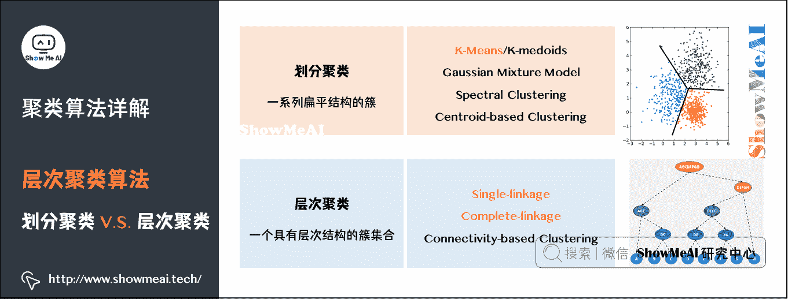
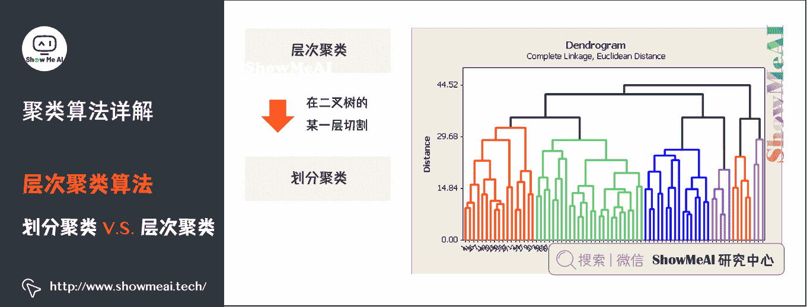
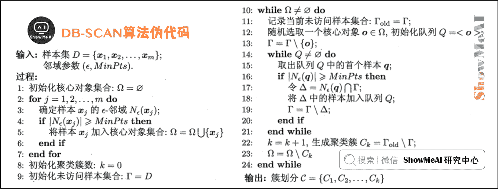

# 图解机器学习 | 聚类算法详解

> 原文：[`blog.csdn.net/ShowMeAI/article/details/123408397`](https://blog.csdn.net/ShowMeAI/article/details/123408397)

作者：[韩信子](https://github.com/HanXinzi-AI)@[ShowMeAI](http://www.showmeai.tech/)
[教程地址](http://www.showmeai.tech/tutorials/34)：[`www.showmeai.tech/tutorials/34`](http://www.showmeai.tech/tutorials/34)
[本文地址](http://www.showmeai.tech/article-detail/197)：[`www.showmeai.tech/article-detail/197`](http://www.showmeai.tech/article-detail/197)
**声明：版权所有，转载请联系平台与作者并注明出处**

* * *

# 引言

聚类（Clustering）是最常见的无监督学习算法，它指的是按照某个特定标准（如距离）把一个数据集分割成不同的类或簇，使得同一个簇内的数据对象的相似性尽可能大，同时不在同一个簇中的数据对象的差异性也尽可能地大。也即聚类后同一类的数据尽可能聚集到一起，不同类数据尽量分离。

聚类算法在很多场景下都有应用，例如新闻自动分组，用户分群，图像分割等等。很多时候，无监督的聚类算法，得到的聚类结果还可以作为特征在后续监督学习中应用，提升整体效果。本篇内容 ShowMeAI 带大家一起来学习一下聚类算法。

（本篇聚类算法部分内容涉及到机器学习基础知识，没有先序知识储备的宝宝可以查看 ShowMeAI 的文章 [图解机器学习 | 机器学习基础知识](http://www.showmeai.tech/article-detail/185)。

# 1.聚类问题

## 1）聚类问题与核心概念

俗话说人以类聚物以群分，聚类算法做的事情，就是对无标签的数据，基于数据分布进行分群分组，使得相似的数据尽量落在同一个簇内。

我们先**对比区分一下聚类和分类**：

*   聚类是一种无监督学习，而分类是一种有监督的学习。
*   聚类只需要人工指定相似度的标准和类别数就可以，而分类需要从训练集学习分类的方法。

## 2）聚类算法用途

**聚类算法应用非常广泛**。在面对未知的世界时，先分类，再逐个研究，是人类探索未知世界的一个基本方法。聚类算法可以应用于探索性数据挖掘、统计分析、生物信息学、数据压缩、计算机图像识别、医学影像分析等，在商业领域可以用来做市场研究、商品归类，在社会科学领域可以用来做犯罪区域分析等等。

下图中有一些样本点，我们根据物理距离的远近，把所有的点分成 3 类。你只需要告诉算法这些信息，算法就可以按照你的要求完成聚类：

*   分类数量为 3；
*   分类标准是物理距离；
*   分好的类分别用红、绿、蓝表示。

**实际上，除了物理距离，现实生活中任何你能想到、计算机可以通过运算和逻辑进行判断的规则，都可以作为分类标准**。

下面我们用图像压缩作为例子来解释一下。最左边是一张彩色照片，大小约 1Mb，通过压缩可以把它变成几十到几百 Kb，这就是压缩软件的实现过程。那么压缩软件的实现原理是什么呢？其中一种就是聚类算法。

从原始图片到压缩存储的过程如下图所示：

聚类算法同样可以用于图像分割。图像中每一个像素点是一个 3 维向量，对应 [R, G, B] 像素值。给定聚类中类别个数 K，算法用 K 个不同的颜色来表示原来的图像，每个像素点用 K 个颜色中一个表示。具体如下：

对于文档、新闻、商品而言，很多时候我们会使用嵌套的归类方法，这是一种层次化聚类：

## 3）主流聚类算法

我们先对聚类算法做个了解，主流的聚类算法可以分成两类：**划分聚类**（Partitioning Clustering）和**层次聚**类（Hierarchical Clustering）。他们的主要区别如图中所示：

**划分聚类算法会给出一系列扁平结构的簇（分开的几个类），它们之间没有任何显式的结构来表明彼此的关联性**。

*   常见算法有 K-Means/K-Medoids、Gaussian Mixture Model （高斯混合模型）、Spectral Clustering（谱聚类）、Centroid-based Clustering 等。

**层次聚类会输出一个具有层次结构的簇集合，因此能够比划分聚类输出的无结构簇集合提供更丰富的信息**。层次聚类可以认为是是嵌套的划分聚类。

*   常见算法有 Single-linkage、Complete-linkage、Connectivity-based Clustering 等。

这两类算法在聚类过程中用到的具体算法不一样，后文我们会重点展开讲一下 K-Means 算法、Single-linkage 算法和 Complete-linkage 算法。

# 2.K-Means 聚类算法

K-Means 算法是聚类算法中一个非常基础的算法，同时应用又非常广泛，下面 ShowMeAI 给大家展开讲解算法原理。

## 1）K-Means 算法核心概念

我们提到了聚类算法要把 n 个数据点按照分布分成 k 类（很多算法的 k 是人为提前设定的）。我们希望通过聚类算法得到 k 个中心点，以及每个数据点属于哪个中心点的划分。

*   中心点可以通过迭代算法来找到，满足条件：所有的数据点到聚类中心的距离之和是最小的。

*   中心点确定后，每个数据点属于离它最近的中心点。

在进入「**如何寻找中心点**」这个核心问题之前，我们先解决几个小问题：

**Q1：数据点到中心点的距离如何计算**？

*   我们一般选择几何距离，就是 L2 距离的平方。

**Q2：中心点是否唯一，或者说，是不是存在全局最优解**？

*   对于多个中心点的情况，全局最优是一个相当难的问题。理论上存在一个全局最优解，但是不一定能找到。既然全局最优解不好找，那我们退而求其次，看能不能找到局部最优解。

**Q3：聚类结果如何表示**？

*   采用空间分割的方式：将空间分割成多个多边形，每个多边形对应一个 cluster 中心。

## 2）K-Means 算法步骤

K-Means 采用 EM 算法迭代确定中心点。流程分两步：

*   **① 更新中心点**：初始化的时候以随机取点作为起始点；迭代过程中，取同一类的所有数据点的重心（或质心）作为新中心点。

*   **② 分配数据点**：把所有的数据点分配到离它最近的中心点。

重复上面的两个步骤，一直到中心点不再改变为止。过程如图所示：

*   左侧 Assignments：一开始随机选取三个点，作为三个类的中心，基于其它点和这三个中心点的距离分配簇；每一类重新计算和分配中心。

*   右侧 Refitted Means：根据新的中心点，重新分配所有的数据点（原来属于绿色中心点的 1 个点，此次迭代后变成属于红色中心点了）。

下图的示例展示了 K-Means 动态迭代收敛的过程：

*   图（a）上有一群散落的点，我们设定簇数 K=2。

*   图（b）为随机找 2 个点作为中心初始化后，第一次分类的结果。

    *   可以看到，红蓝分界线在这群点的中央穿过。这显然有问题，不过没关系，算法继续往下走。对红蓝两类分别计算它们的中心。
*   图（c）可以看到，一个落在左下方这一团里，另一个落在右上方那一团里。以新的中心点进行第二次分类。

*   图（d）的分界线就基本是已经可以把两团分开了。

*   图（f）、（g）显示后续重复计算你「中心点-分类数据点」的过程已经收敛，数据点分配基本不动了，聚类完成。

下方的动图能更清晰地展示这个过程：

# 3.K-Means 缺点与改进

## 1）K-Means 算法缺点

K-Means 算法简单易用，它有什么缺点呢？我们将 K-Means 算法的一些缺点总结如下：

*   **缺点 1**：中心点是所有同一类数据点的质心，所以聚类中心点可能不属于数据集的样本点。

*   **缺点 2**：计算距离时我们用的是 L2 距离的平方。对离群点很敏感，噪声（Noisy Data）和离群点（Outlier）会把中心点拉偏，甚至改变分割线的位置。

## 2）K-Medoids 算法

针对 K-Means 算法的缺点改进得到了 K-Medoids 算法：

### （1）限制聚类中心点必须来自数据点。

*   求中心点的计算方法，由原来的直接计算重心，变成计算完重心后，在重心附近找一个数据点作为新的中心点。

*   K-Medoids 重拟合步骤比直接求平均的 K-Means 要复杂一些。

### （2）为避免平方计算对离群点的敏感，把平方变成绝对值。

总结来说，K-Medoids 算法的迭代过程与 K-Means 是一致的，不同点如下所示：

*   起始点不是随机点，而是任意选择数据集中的点。

*   距离使用 L1 距离，而不是 L2 距离。

*   新的中心点，也不是同类所有点的重心，而是同一类别所有数据点中，离其它点最近的点。

*   复杂度方面，相比于 K-Means 的 O ( n ) O(n) O(n) ，K-Medoids 更新中心点的复杂度 O ( n 2 ) O(n²) O(n2) 要更高一些。

下图是 K-Means 和 K-Medoids 两个算法的一个系统对比：

# 4.层次聚类算法

相比于 K-Means 这类划分聚类，我们有另外一类层次化聚类算法。

## 1）层次聚类 vs 划分聚类

划分聚类得到的是划分清晰的几个类，而层次聚类最后得到的是一个树状层次化结构。

从层次化聚类转换为划分聚类很简单，在层次化聚类的某一层进行切割，就得到 1 个划分聚类。如下图所示：

## 2）Single-Linkage 算法

接下来我们介绍一个层次聚类中的 Single-Linkage 算法。这个算法是构造一棵二叉树，用叶节点代表数据，而二叉树的每一个内部节点代表一个聚类。如图所示：

这是一个从下而上的聚类。这棵树是先有叶子，顺着叶子逐渐长树枝，树枝越长越大一直到树根。

如果叶子很多，这个生长过程需要合并的类就会很多。图中有 11 个数据点，一共发生了 10 次合并。

## 3）Complete-Linkage 算法

与 Single-Linkage 算法相似，Complete-Linkage 的迭代思路是一样的，不同的是在合并类时，Single-Linkage 是用两个类中距离最小的两个点作为类之间的距离，而 Complete-Linkage 恰恰相反，用距离最远的两个数据点之间的距离作为这两个类之间的距离。

这两种计算方法各有利弊。总的来说，层次聚类的计算复杂度是 O ( n 3 ) O(n³) O(n3) 级别，算是很高的了。可以用优先队列的数据结构对算法加速，加速后能减低到 O ( n 2 log ⁡ n ) O(n^{2} \log{n} ) O(n2logn) 的级别。

# 5.DB-SCAN 算法

## 1）DB-SCAN 算法

在前面的内容中我们介绍了划分聚类和层次聚类的算法，接下来我们学习另外一个聚类算法：DB-SCAN 算法。

DB-SCAN 是一个基于密度的聚类。如下图中这样不规则形态的点，如果用 K-Means，效果不会很好。而通过 DB-SCAN 就可以很好地把在同一密度区域的点聚在一类中。

## 2）DB-SCAN 算法的关键概念

**核心对象**（Core Object），也就是密度达到一定程度的点。

*   若 x j x_j xj​的 ∈ − \in - ∈−邻域至少包含 MinPts 个样本，即 ∣ N ∈ ( x j ) ∣ ≥ M i n P t s |N_\in (x_j )|≥MinPts ∣N∈​(xj​)∣≥MinPts，则 x j x_j xj​是一个核心对象。

**密度直达**（directly density-reachable），密度可达（density-reachable）：核心对象之间可以是密度直达或者密度可达。

*   若 x i x_i xi​位于 x j x_j xj​的 ∈ − \in - ∈−邻域中，且 x j x_j xj​是核心对象，则称 x j x_j xj​由 x j x_j xj​密度直达。

*   对 x i x_i xi​与 x j x_j xj​，若存在样本序列 p 1 , p 2 , … , p n p_1,p_2, \dots, p_n p1​,p2​,…,pn​，其中 p 1 = x i p_1=x_i p1​=xi​， p n = x j p_n=x_j pn​=xj​且 p i + 1 p_i+1 pi​+1 由 p i p_i pi​密度直达，则称 x j x_j xj​由 x i x_i xi​密度可达。

**密度相连**（density-connected）：所有密度可达的核心点就构成密度相连。

*   对 x i x_i xi​与 x j x_j xj​，若存在 x k x_k xk​使得 x i x_i xi​与 x j x_j xj​，均由 x k x_k xk​密度可达，则称 x i x_i xi​与 x j x_j xj​密度相连。

我们通过下图深入理解一下刚才提到的几个基本概念。

先假设要求的最小点密度 MinPts 是 3。

*   在一个半径范围内， x 1 x_1 x1​这个点周围的点数是 5，超过了阈值 3，所以 x 1 x_1 x1​是一个核心对象。同样， x 2 x_2 x2​、 x 3 x_3 x3​和 x 4 x_4 x4​也是核心对象。

*   x 1 x_1 x1​与 x 2 x_2 x2​处于一个邻域，所以二者是密度直达的关系，而 x 3 x_3 x3​与 x 2 x_2 x2​也是密度直达的关系，通过 x 2 x_2 x2​， x 1 x_1 x1​与 x 3 x_3 x3​是密度可达的关系。

*   x 3 x_3 x3​与 x 4 x_4 x4​通过多个核心对象实现密度相连。

## 3）DB-SCAN 算法伪代码

这个过程用直白的语言描述就是：

*   对于一个数据集，先规定最少点密度 MinPts 和半径范围。

*   先找出核心对象：如果在半径范围内点密度大于 MinPts，则这个点是核心对象。把所有的核心对象放到一个集合中。

*   从这个核心对象集合中，随机找一个核心对象，判断其它的数据点与它是否密度直达，如果是，则归入聚类簇中。

*   继续判断其它点与聚类簇中的点是否密度直达，直到把所有的点都检查完毕，这时候归入聚类簇中的所有点是一个密度聚类。

更多无监督学习的算法模型总结可以查看 ShowMeAI 的文章 [AI 知识技能速查 | 机器学习-无监督学习](http://www.showmeai.tech/article-detail/114)。

## 视频教程

**可以点击 [B 站](https://www.bilibili.com/video/BV1y44y187wN?p=13) 查看视频的【双语字幕】版本**

[`player.bilibili.com/player.html?aid=975327190&page=13`](https://player.bilibili.com/player.html?aid=975327190&page=13)

【双语字幕+资料下载】MIT 6.036 | 机器学习导论(2020·完整版)

> **【双语字幕+资料下载】MIT 6.036 | 机器学习导论(2020·完整版)**
> 
> [`www.bilibili.com/video/BV1y44y187wN?p=13`](https://www.bilibili.com/video/BV1y44y187wN?p=13)

## ShowMeAI 相关文章推荐

*   [1.机器学习基础知识](http://www.showmeai.tech/article-detail/185)
*   [2.模型评估方法与准则](http://www.showmeai.tech/article-detail/186)
*   [3.KNN 算法及其应用](http://www.showmeai.tech/article-detail/187)
*   [4.逻辑回归算法详解](http://www.showmeai.tech/article-detail/188)
*   [5.朴素贝叶斯算法详解](http://www.showmeai.tech/article-detail/189)
*   [6.决策树模型详解](http://www.showmeai.tech/article-detail/190)
*   [7.随机森林分类模型详解](http://www.showmeai.tech/article-detail/191)
*   [8.回归树模型详解](http://www.showmeai.tech/article-detail/192)
*   [9.GBDT 模型详解](http://www.showmeai.tech/article-detail/193)
*   [10.XGBoost 模型最全解析](http://www.showmeai.tech/article-detail/194)
*   [11.LightGBM 模型详解](http://www.showmeai.tech/article-detail/195)
*   [12.支持向量机模型详解](http://www.showmeai.tech/article-detail/196)
*   [13.聚类算法详解](http://www.showmeai.tech/article-detail/197)
*   [14.PCA 降维算法详解](http://www.showmeai.tech/article-detail/198)

## ShowMeAI 系列教程推荐

*   [图解 Python 编程：从入门到精通系列教程](http://www.showmeai.tech/tutorials/56)
*   [图解数据分析：从入门到精通系列教程](http://www.showmeai.tech/tutorials/33)
*   [图解 AI 数学基础：从入门到精通系列教程](http://showmeai.tech/tutorials/83)
*   [图解大数据技术：从入门到精通系列教程](http://www.showmeai.tech/tutorials/84)
*   [图解机器学习算法：从入门到精通系列教程](http://www.showmeai.tech/tutorials/34)

