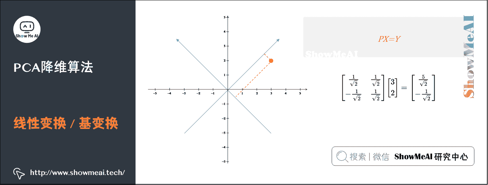

# 图解机器学习 | 降维算法详解

> 原文：[`blog.csdn.net/ShowMeAI/article/details/123408773`](https://blog.csdn.net/ShowMeAI/article/details/123408773)


作者：[韩信子](https://github.com/HanXinzi-AI)@[ShowMeAI](http://www.showmeai.tech/)
[教程地址](http://www.showmeai.tech/tutorials/34)：[`www.showmeai.tech/tutorials/34`](http://www.showmeai.tech/tutorials/34)
[本文地址](http://www.showmeai.tech/article-detail/198)：[`www.showmeai.tech/article-detail/198`](http://www.showmeai.tech/article-detail/198)
**声明：版权所有，转载请联系平台与作者并注明出处**

* * *

# 引言

在互联网大数据场景下，我们经常需要面对高维数据，在对这些数据做分析和可视化的时候，我们通常会面对「高维」这个障碍。在数据挖掘和建模的过程中，高维数据也同样带来大的计算量，占据更多的资源，而且许多变量之间可能存在相关性，从而增加了分析与建模的复杂性。

我们希望找到一种方法，在对数据完成降维「压缩」的同时，尽量减少信息损失。由于各变量之间存在一定的相关关系，因此可以考虑将关系紧密的变量变成尽可能少的新变量，使这些新变量是两两不相关的，那么就可以用较少的综合指标分别代表存在于各个变量中的各类信息。机器学习中的降维算法就是这样的一类算法。

**主成分分析（Principal Components Analysis，简称 PCA）是最重要的数据降维方法之一**。在数据压缩消除冗余和数据噪音消除等领域都有广泛的应用。本篇我们来展开讲解一下这个算法。

（本篇降维算法部分内容涉及到机器学习基础知识，没有先序知识储备的宝宝可以查看 ShowMeAI 的文章 [图解机器学习 | 机器学习基础知识](http://www.showmeai.tech/article-detail/185)。

# 1.PCA 与最大可分性

对于 X = [ x 1 x 2 . . . x n ] X = \begin {bmatrix} x_1 \\ x_2 \\ ... \\ x_n \end{bmatrix} X=⎣⎢⎢⎡​x1​x2​...xn​​⎦⎥⎥⎤​ ， X ∈ R n X \in R^n X∈Rn 。我们希望 X X X 从 n n n 维降到 n ′ n^{'} n′ 维，同时希望信息损失最少。比如，从 n = 2 n = 2 n=2 维降到 n ′ = 1 n^{'} = 1 n′=1 。


左图为一个典型的例子，假如我们要对一系列人的样本进行数据降维（每个样本包含「身高」「体重」两个维度）。右图我们既可以降维到第一主成分轴，也可以降维到第二主成分轴。

哪个主成分轴更优呢？从直观感觉上，我们会认为「第一主成分轴」优于「第二主成分轴」，因为它比较大程度保留了数据之间的区分性（保留大部分信息）。

对 PCA 算法而言，我们希望找到小于原数据维度的若干个投影坐标方向，把数据投影在这些方向，获得压缩的信息表示。下面我们就一步一步来推导一下 PCA 算法原理。

# 2.基变换

先来复习一点点数学知识。我们知道要获得原始数据 X X X 新的表示空间 Y Y Y ，最简单的方法是对原始数据进行线性变换（也叫做基变换） Y = P X Y = PX Y=PX 。其中， X X X 是原始样本， P P P 是基向量， Y Y Y 是新表达。

数学表达为：

[ p 1 p 2 ⋮ p r ] r × n [ x 1 x 2 ⋯ x m ] n × m = [ p 1 x 1 p 1 x 2 ⋯ p 1 x m p 2 x 1 p 2 x 2 ⋯ p 2 x m ⋮ ⋮ ⋱ ⋮ p r x 1 p r x 2 ⋯ p r x m ] r × m \begin{bmatrix} p_1 \\ p_2 \\ \vdots \\ p_r \end{bmatrix}_{r \times n} \begin{bmatrix} x_1 & x_2 & \cdots & x_m \end{bmatrix}_{n \times m} = \begin{bmatrix} p_1 x_1 & p_1 x_2 & \cdots & p_1 x_m \\ p_2 x_1 & p_2 x_2 & \cdots & p_2 x_m \\ \vdots & \vdots & \ddots & \vdots \\ p_r x_1 & p_r x_2 & \cdots & p_r x_m\end{bmatrix}_{r\times m} ⎣⎢⎢⎢⎡​p1​p2​⋮pr​​⎦⎥⎥⎥⎤​r×n​[x1​​x2​​⋯​xm​​]n×m​=⎣⎢⎢⎢⎡​p1​x1​p2​x1​⋮pr​x1​​p1​x2​p2​x2​⋮pr​x2​​⋯⋯⋱⋯​p1​xm​p2​xm​⋮pr​xm​​⎦⎥⎥⎥⎤​r×m​

*   其中 p i p_i pi​ 是行向量，表示第 i i i 个基；

*   x j x_j xj​ 是一个列向量，表示第 j j j 个原始数据记录。

当 r < n r < n r<n 时，即「基的维度<数据维度」时，可达到降维的目的，即 X ∈ R n × m → Y ∈ R r × m X \in R^{n \times m} \rightarrow Y \in R^{r \times m } X∈Rn×m→Y∈Rr×m 。


以直角坐标系下的点 ( 3 , 2 ) (3,2) (3,2) 为例，要把点 ( 3 , 2 ) (3,2) (3,2) 变换为新基上的坐标，就是用 ( 3 , 2 ) (3,2) (3,2) 与第一个基做内积运算，作为第一个新的坐标分量，然后用 ( 3 , 2 ) (3,2) (3,2) 与第二个基做内积运算，作为第二个新坐标的分量。



上述变化，在线性代数里，我们可以用矩阵相乘的形式简洁的来表示：

[ 1 2 1 2 − 1 2 1 2 ] [ 3 2 ] = [ 5 2 − 1 2 ] \begin{bmatrix}\frac{1}{\sqrt 2} & \frac{1}{\sqrt 2} \\ -\frac{1}{\sqrt 2} & \frac{1}{\sqrt 2} \end{bmatrix} \begin{bmatrix} 3 \\ 2\end{bmatrix} = \begin{bmatrix} \frac{5}{\sqrt 2} \\ - \frac{1}{\sqrt 2} \end{bmatrix} [2  ​1​−2  ​1​​2  ​1​2  ​1​​][32​]=[2  ​5​−2  ​1​​]

再稍微推广一下，假如我们有 m 个二维向量，只要将二维向量按列排成一个两行 m 列矩阵，然后用「基矩阵」乘以这个矩阵，就得到了所有这些向量在新基下的值。例如(1,1)、(2,2)、(3,3)，想变换到刚才那组基上，可以如下这样表示：

[ 1 2 1 2 − 1 2 1 2 ] [ 1 2 3 1 2 3 ] = [ 2 2 4 2 6 2 0 0 0 ] \begin{bmatrix}\frac{1}{\sqrt 2} & \frac{1}{\sqrt 2} \\ -\frac{1}{\sqrt 2} & \frac{1}{\sqrt 2} \end{bmatrix} \begin{bmatrix} 1 & 2 & 3 \\ 1 & 2 & 3\end{bmatrix} = \begin{bmatrix} 2\sqrt 2 & 4\sqrt2 & 6\sqrt2 \\ 0 & 0 & 0 \end{bmatrix} [2  ​1​−2  ​1​​2  ​1​2  ​1​​][11​22​33​]=[22  ​0​42  ​0​62  ​0​]

# 3.方差

在本文的开始部分，我们提到了，降维的目的是希望压缩数据但信息损失最少，也就是说，我们希望投影后的数据尽可能分散开。在数学上，这种分散程度我们用「方差」来表达，方差越大，数据越分散。

*   定义方差 V a r Var Var ：对于单一随机变量 a a a ， V a r ( a ) = 1 m ∑ i = 1 m ( a i − μ ) 2 Var(a) = \frac{1}{m} \sum_{i = 1}^m (a_i - \mu)² Var(a)=m1​∑i=1m​(ai​−μ)2

*   对数据做去中心化（方便后面操作）： V a r ( a ) = 1 m ∑ i = 1 m a i 2 Var(a) = \frac{1}{m} \sum_{i = 1}^m a_i ² Var(a)=m1​∑i=1m​ai2​

V a r ( a ) Var(a) Var(a) 表示 a a a 的取值与其数学期望之间的偏离程度。若 V a r ( a ) Var(a) Var(a) 较小，意味着 a a a 的取值主要集中在期望 μ \mu μ 也就是 E ( a ) E(a) E(a) )的附近；反之，若 V a r ( a ) Var(a) Var(a) 较大，意味着 a a a 的取值比较分散。

我们来看一个具体的例子。假设我们 5 个样本数据，分别是 x 1 = [ 1 1 ] x_1 = \begin{bmatrix} 1 \\ 1 \end{bmatrix} x1​=[11​] 、 x 2 = [ 1 3 ] x_2 = \begin{bmatrix} 1 \\ 3\end{bmatrix} x2​=[13​] 、 x 3 = [ 2 3 ] x_3 = \begin{bmatrix} 2 \\ 3\end{bmatrix} x3​=[23​] 、 x 4 = [ 4 4 ] x_4 = \begin{bmatrix} 4 \\ 4\end{bmatrix} x4​=[44​] 、 x 5 = [ 2 4 ] x_5 = \begin{bmatrix} 2 \\ 4 \end{bmatrix} x5​=[24​] ，将它们表示成矩阵形式： X = [ 1 1 2 4 2 1 3 3 4 4 ] X = \begin{bmatrix} 1 & 1 & 2 & 4 & 2 \\ 1 & 3 & 3 & 4 & 4 \end {bmatrix} X=[11​13​23​44​24​] 。


为了后续处理方便，我们首先将每个字段内所有值都减去字段均值，其结果是将每个字段都变为均值为 0。

我们看上面的数据，设第一个特征为 a a a ，第二个特征为 b b b ，则某个样本可以写作 x i = [ a b ] x_i = \begin{bmatrix} a \\ b \end {bmatrix} xi​=[ab​]
且特征 a a a 的均值为 2，特征 b b b 的均值为 3。所以，变换后

X = [ − 1 − 1 0 2 0 − 2 0 0 1 1 ] X = \begin{bmatrix} -1 & -1 & 0 & 2 & 0 \\ -2 & 0 & 0 & 1 & 1 \end{bmatrix} X=[−1−2​−10​00​21​01​]

V a r ( a ) = 6 5 Var(a ) = \frac{\sqrt 6} {5} Var(a)=56  ​​

V a r ( b ) = 6 5 Var(b ) = \frac{\sqrt 6} {5} Var(b)=56  ​​

# 4.协方差

协方差（Covariance）在概率和统计学中用于衡量两个变量的总体误差。比如对于二维随机变量 x i = [ a b ] x_i = \begin{bmatrix} a \\ b \end{bmatrix} xi​=[ab​] ，特征 a 、 b a、b a、b 除了自身的数学期望和方差，还需要讨论 a 、 b a、b a、b 之间互相关系的数学特征。

定义协方差 C o v Cov Cov ：

C o v ( a , b ) = 1 m ∑ i = 1 m a i b i Cov(a, b) = \frac{1}{m}\sum_{i = 1}^m a_i b_i Cov(a,b)=m1​i=1∑m​ai​bi​

当 C o v ( a , b ) = 0 Cov(a, b) = 0 Cov(a,b)=0 时，变量 a 、 b a、b a、b 完全独立，这也是我们希望达到的优化目标。方差是协方差的一种特殊情况，即当两个变量是相同的情况 C o v ( a , a ) = V a r ( a ) Cov(a, a) = Var(a) Cov(a,a)=Var(a) 。

# 5.协方差矩阵

对于二维随机变量 x i = [ a b ] x_i = \begin{bmatrix} a \\ b \end {bmatrix} xi​=[ab​] ，定义协方差矩阵 C = [ V a r ( a ) C o v ( a , b ) C o v ( b , a ) V a r ( b ) ] C = \begin{bmatrix} Var(a) & Cov(a, b) \\ Cov(b, a) &Var(b)\end{bmatrix} C=[Var(a)Cov(b,a)​Cov(a,b)Var(b)​] 。

对于 n n n 维随机变量

x i = [ x 1 x 2 ⋮ x n ] x_{i}=\left[\begin{array}{c} x_{1} \\ x_{2} \\ \vdots \\ x_{n} \end{array}\right] xi​=⎣⎢⎢⎢⎡​x1​x2​⋮xn​​⎦⎥⎥⎥⎤​

C = [ V a r ( x 1 ) C o v ( x 1 , x 2 ) ⋯ C o v ( x 1 , x n ) C o v ( x 2 , x 1 ) V a r ( x 2 ) ⋯ C o v ( x 1 , x n ) ⋮ ⋮ ⋱ ⋮ C o v ( x n , x 1 ) C o v ( x n , x 2 ) ⋯ V a r ( x n ) ] C = \begin{bmatrix} Var(x_1) & Cov(x_1, x_2) &\cdots & Cov(x_1, x_n)\\ Cov(x_2, x_1)& Var(x_2) & \cdots & Cov(x_1, x_n)\\ \vdots & \vdots & \ddots & \vdots \\ Cov(x_n, x_1) & Cov(x_n, x_2) & \cdots &Var(x_n) \end{bmatrix} C=⎣⎢⎢⎢⎡​Var(x1​)Cov(x2​,x1​)⋮Cov(xn​,x1​)​Cov(x1​,x2​)Var(x2​)⋮Cov(xn​,x2​)​⋯⋯⋱⋯​Cov(x1​,xn​)Cov(x1​,xn​)⋮Var(xn​)​⎦⎥⎥⎥⎤​

我们可以看到，协方差矩阵是 n n n 行 n n n 列的对称矩阵，主对角线上是方差，而协对角线上是协方差。

我们再来用一个示例对应讲解一下。还是同样的 5 个样本数据

*   x 1 = [ 1 1 ] x_1 = \begin{bmatrix} 1 \\ 1 \end{bmatrix} x1​=[11​]

*   x 2 = [ 1 3 ] x_2 = \begin{bmatrix} 1 \\ 3\end{bmatrix} x2​=[13​]

*   x 3 = [ 2 3 ] x_3 = \begin{bmatrix} 2 \\ 3\end{bmatrix} x3​=[23​]

*   x 4 = [ 4 4 ] x_4 = \begin{bmatrix} 4 \\ 4\end{bmatrix} x4​=[44​]

*   x 5 = [ 2 4 ] x_5 = \begin{bmatrix} 2 \\ 4 \end{bmatrix} x5​=[24​]

去中心化后表示成矩阵

X = [ − 1 − 1 0 2 0 − 2 0 0 1 1 ] X = \begin{bmatrix} -1 & -1 & 0 & 2 & 0 \\ -2 & 0 & 0 & 1 & 1 \end{bmatrix} X=[−1−2​−10​00​21​01​]

那如果有 m m m 个样本的话， X = [ a 1 a 2 ⋯ a m b 1 b 2 ⋯ b m ] X =\begin{bmatrix} a_1 & a_2 & \cdots &a_m \\ b_1 & b_2 & \cdots & b_m\end{bmatrix} X=[a1​b1​​a2​b2​​⋯⋯​am​bm​​] 。对 X X X 做一些变换，用 X X X 乘以 X X X 的转置，并乘上系数 1 / m 1/m 1/m ：

1 m X X T = 1 m [ a 1 a 2 ⋯ a m b 1 b 2 ⋯ b m ] [ a 1 b 1 a 2 b 2 ⋮ ⋮ a m b m ] = = [ 1 m ∑ i = 1 m a i 2 1 m ∑ i = 1 m a i b i 1 m ∑ i = 1 m a i b i 1 m ∑ i = 1 m b i 2 ] \frac{1}{m}XX^T = \frac{1}{m}\begin{bmatrix} a_1 & a_2 & \cdots &a_m \\ b_1 & b_2 & \cdots & b_m\end{bmatrix}\begin{bmatrix} a_1 & b_1 \\ a_2 & b_2 \\ \vdots & \vdots \\ a_m &b_m \end{bmatrix}== \begin{bmatrix} \frac{1}{m} \sum_{i = 1}^m a_i ² & \frac{1}{m}\sum_{i = 1}^m a_i b_i \\ \frac{1}{m}\sum_{i = 1}^m a_i b_i& \frac{1}{m} \sum_{i = 1}^m b_i² \end{bmatrix} m1​XXT=m1​[a1​b1​​a2​b2​​⋯⋯​am​bm​​]⎣⎢⎢⎢⎡​a1​a2​⋮am​​b1​b2​⋮bm​​⎦⎥⎥⎥⎤​==[m1​∑i=1m​ai2​m1​∑i=1m​ai​bi​​m1​∑i=1m​ai​bi​m1​∑i=1m​bi2​​]

这正是协方差矩阵！我们归纳得到：设我们有 m m m 个 n n n 维数据记录，将其按列排成 n n n 乘 m m m 的矩阵 X X X ，设 C = 1 m X X T C = \frac{1}{m}XX^T C=m1​XXT ，则 C C C 是一个对称矩阵，其对角线分别个各个特征的方差，而第 i i i 行 j j j 列和 j j j 行 i i i 列元素相同，表示 i i i 和 j j j 两个特征之间的协方差。

# 6.协方差矩阵对角化

再回到我们的场景和目标：

*   现在我们有 m m m 个样本数据，每个样本有 n n n 个特征，那么设这些原始数据为 X X X ， X X X 为 n n n 行 m m m 列的矩阵。

*   想要找到一个基 P P P ，使 Y r × m = P r × n X n × m Y_{r \times m} = P_{r \times n}X_{n \times m} Yr×m​=Pr×n​Xn×m​ ，其中 $r<n $，达到降维的目的。

设 X X X 的协方差矩阵为 C C C ， Y Y Y 的协方差矩阵为 D D D ，且 Y = P X Y = PX Y=PX 。

*   我们的目的变为：对原始数据 X X X 做 PCA 后，得到的 Y Y Y 的协方差矩阵 D D D 的各个方向方差最大，协方差为 0。

那么 C C C 与 D D D 是什么关系呢？

D = 1 m Y Y T = 1 m ( P X ) ( P X ) T = 1 m P X X T P T = 1 m P ( X X T ) P T = P C P T = P [ 1 m ∑ i = 1 m a i 2 1 m ∑ i = 1 m a i b i 1 m ∑ i = 1 m a i b i 1 m ∑ i = 1 m b i 2 ] P T \begin{aligned} D & =\frac{1}{m} Y Y^{T} \\ & =\frac{1}{m}(P X)(P X)^{T} \\ & =\frac{1}{m} P X X^{T} P^{T} \\ & =\frac{1}{m} P\left(X X^{T}\right) P^{T} \\ & =P C P^{T} \\ & =P\left[\begin{array}{cc} \frac{1}{m} \sum_{i=1}^{m} a_{i}^{2} & \frac{1}{m} \sum_{i=1}^{m} a_{i} b_{i} \\ \frac{1}{m} \sum_{i=1}^{m} a_{i} b_{i} & \frac{1}{m} \sum_{i=1}^{m} b_{i}^{2} \end{array}\right] P^{T} \end{aligned} D​=m1​YYT=m1​(PX)(PX)T=m1​PXXTPT=m1​P(XXT)PT=PCPT=P[m1​∑i=1m​ai2​m1​∑i=1m​ai​bi​​m1​∑i=1m​ai​bi​m1​∑i=1m​bi2​​]PT​

我们发现，要找的 P P P 不是别的，而是能让原始协方差矩阵对角化的 P P P 。

换句话说，优化目标变成了寻找一个矩阵 P P P ，满足 P C P T PCP^T PCPT 是一个对角矩阵，并且对角元素按从大到小依次排列，那么 $P 的前 $K 行就是要寻找的基，用 P P P 的前 K K K 行组成的矩阵乘以 X X X 就使得 X X X 从 N N N 维降到了 K K K 维并满足上述优化条件。

最终我们聚焦在协方差矩阵对角化这个问题上。

由上文知道，协方差矩阵 C C C 是一个是对称矩阵，在线性代数上，实对称矩阵有一系列非常好的性质：

1）实对称矩阵不同特征值对应的特征向量必然正交。

2）设特征向量 λ \lambda λ 重数为 r r r ，则必然存在 r r r 个线性无关的特征向量对应于 λ \lambda λ ，因此可以将这 r r r 个特征向量单位正交化。

由上面两条可知，一个 n n n 行 n n n 列的实对称矩阵一定可以找到 n n n 个单位正交特征向量，设这 n n n 个特征向量为 e 1 , e 2 , ⋯ , e n e_1,e_2,⋯,e_n e1​,e2​,⋯,en​ ，我们将其按列组成矩阵：

E = [ e 1 e 2 ⋯   e n ] E = \begin{bmatrix} e_1 & e_2 & \cdots \ e_n\end{bmatrix} E=[e1​​e2​​⋯ en​​]

则对协方差矩阵 C C C 有如下结论：

E T C E = Λ = [ λ 1 λ 2 ⋱ λ n ] E^T C E = \Lambda = \begin{bmatrix} \lambda_1 \\ & \lambda_2 \\ &&\ddots \\ &&&\lambda_n\end {bmatrix} ETCE=Λ=⎣⎢⎢⎡​λ1​​λ2​​⋱​λn​​⎦⎥⎥⎤​

其中 Λ \Lambda Λ 为对角矩阵，其对角元素为各特征向量对应的特征值（可能有重复）。
结合上面的公式：

D = P C P T D = PCP^T D=PCPT

其中， D D D 为对角矩阵，我们可以得到：

P = E T P = E^T P=ET

P P P 是协方差矩阵 C C C 的特征向量单位化后按行排列出的矩阵，其中每一行都是 C C C 的一个特征向量。如果设 P P P 按照 Λ \Lambda Λ 中特征值的从大到小，将特征向量从上到下排列，则用 P P P 的前 K K K K K K 行组成的矩阵乘以原始数据矩阵 X X X ，就得到了我们需要的降维后的数据矩阵 Y Y Y 。

# 7.PCA 算法

总结一下 PCA 的算法步骤：


设有 m m m 条 n n n 维数据。

1）将原始数据按列组成 n n n 行 m m m 列矩阵 X X X

2）将 X X X 的每一行（代表一个特征）进行零均值化，即减去这一行的均值

3）求出协方差矩阵 C = 1 m X X T C=\frac{1}{m}XX^T C=m1​XXT

4）求出协方差矩阵 C C C 的特征值及对应的特征向量

5）将特征向量按对应特征值大小从上到下按行排列成矩阵，取前 k k k 行组成矩阵 P P P

6） Y = P X Y=PX Y=PX 即为降维到 k k k 维后的数据

# 8.PCA 代码实践

我们这里直接使用 python 机器学习工具库 scikit-learn 来给大家演示 PCA 算法应用（相关知识速查可以查看 ShowMeAI 文章 AI 建模工具速查|Scikit-learn 使用指南），sklearn 工具库中与 PCA 相关的类都在 sklearn.decomposition 包里，最常用的 PCA 类就是 sklearn.decomposition.PCA。

# 1）参数介绍

sklearn 中的 PCA 类使用简单，基本无需调参，一般只需要指定需要降维到的维度，或者降维后的主成分的方差和占原始维度所有特征方差和的比例阈值就可以了。

下面是**sklearn.decomposition.PCA**的主要参数介绍：

*   **n_components**：PCA 降维后的特征维度数目。

*   **whiten**：是否进行白化。所谓白化，就是对降维后的数据的每个特征进行归一化，让方差都为 1，默认值是 False，即不进行白化。

*   **svd_solver**：奇异值分解 SVD 的方法，有 4 个可以选择的值：{‘auto’,‘full’,‘arpack’,‘randomized’}。

除上述输入参数，还有两个 PCA 类的成员属性也很重要：

*   ① **explained_variance_**，它代表降维后的各主成分的方差值。

*   ② **explained_variance_ratio_**，它代表降维后的各主成分的方差值占总方差值的比例。

# 2）代码实例

```py
# 构建数据样本并可视化

import numpy as np
import matplotlib.pyplot as plt
from mpl_toolkits.mplot3d import Axes3D
%matplotlib inline
from sklearn.datasets import make_blobs

# X 为样本特征，Y 为样本簇类别， 共 1000 个样本，每个样本 3 个特征，共 4 个簇
X, y = make_blobs(n_samples=10000, n_features=3, centers=[[3,3, 3], [0,0,0], [1,1,1], [2,2,2]], cluster_std=[0.2, 0.1, 0.2, 0.2], 
                  random_state =9)
fig = plt.figure()
ax = Axes3D(fig, rect=[0, 0, 1, 1], elev=30, azim=20)
plt.scatter(X[:, 0], X[:, 1], X[:, 2],marker='x') 
```


先不降维，只对数据进行投影，看看投影后的三个维度的方差分布，代码如下：

```py
from sklearn.decomposition import PCA
pca = PCA(n_components=3)
pca.fit(X)
print(pca.explained_variance_ratio_)
print(pca.explained_variance_) 
```

输出如下：

```py
[0.98318212 0.00850037 0.00831751]
[3.78521638 0.03272613 0.03202212] 
```

可以看出投影后三个特征维度的方差比例大约为 98.3%：0.8%：0.8%。投影后第一个特征占了绝大多数的主成分比例。现在我们来进行降维，从三维降到 2 维，代码如下：

```py
pca = PCA(n_components=2)
pca.fit(X)
print(pca.explained_variance_ratio_)
print(pca.explained_variance_) 
```

输出如下：

```py
[0.98318212 0.00850037]
[3.78521638 0.03272613] 
```

这个结果其实可以预料，因为上面三个投影后的特征维度的方差分别为：[ 3.78521638 0.03272613]，投影到二维后选择的肯定是前两个特征，而抛弃第三个特征。为了有个直观的认识，我们看看此时转化后的数据分布，代码如下：

```py
X_new = pca.transform(X)
plt.scatter(X_new[:, 0], X_new[:, 1],marker='x')
plt.show() 
```


从上图可以看出，降维后的数据依然清楚可见之前三维图中的 4 个簇。现在我们不直接指定降维的维度，而指定降维后的主成分方差和比例，来试验一下。

```py
pca = PCA(n_components=0.9)
pca.fit(X)
print(pca.explained_variance_ratio_)
print(pca.explained_variance_)
print(pca.n_components_) 
```

我们指定了主成分至少占 90%，输出如下：

```py
[0.98318212]
[3.78521638]
1 
```

可见只有第一个投影特征被保留。这也很好理解，我们的第一个主成分占投影特征的方差比例高达 98%。只选择这一个特征维度便可以满足 90%的阈值。我们现在选择阈值 99%看看，代码如下：

```py
pca = PCA(n_components=0.99)
pca.fit(X)
print(pca.explained_variance_ratio_)
print(pca.explained_variance_)
print(pca.n_components_) 
```

此时的输出如下：

```py
[0.98318212 0.00850037]
[3.78521638 0.03272613]
2 
```

这个结果也很好理解，因为我们第一个主成分占了 98.3%的方差比例，第二个主成分占了 0.8%的方差比例，两者一起可以满足我们的阈值。最后我们看看让 MLE 算法自己选择降维维度的效果，代码如下：

```py
pca = PCA(n_components= 'mle',svd_solver='full')
pca.fit(X)
print(pca.explained_variance_ratio_)
print(pca.explained_variance_)
print(pca.n_components_) 
```

输出结果如下：

```py
[0.98318212]
[3.78521638]
1 
```

可见由于我们的数据的第一个投影特征的方差占比高达 98.3%，MLE 算法只保留了我们的第一个特征。

更多无监督学习的算法模型总结可以查看 ShowMeAI 的文章 [AI 知识技能速查 | 机器学习-无监督学习](http://www.showmeai.tech/article-detail/114)。

# 参考链接

*   [用 scikit-learn 学习主成分分析(PCA)](https://www.cnblogs.com/pinard/p/6243025.html)
*   [机器学习之 PCA(主成分分析)](https://www.cnblogs.com/pinard/p/6243025.html)

## ShowMeAI 相关文章推荐

*   [1.机器学习基础知识](http://www.showmeai.tech/article-detail/185)
*   [2.模型评估方法与准则](http://www.showmeai.tech/article-detail/186)
*   [3.KNN 算法及其应用](http://www.showmeai.tech/article-detail/187)
*   [4.逻辑回归算法详解](http://www.showmeai.tech/article-detail/188)
*   [5.朴素贝叶斯算法详解](http://www.showmeai.tech/article-detail/189)
*   [6.决策树模型详解](http://www.showmeai.tech/article-detail/190)
*   [7.随机森林分类模型详解](http://www.showmeai.tech/article-detail/191)
*   [8.回归树模型详解](http://www.showmeai.tech/article-detail/192)
*   [9.GBDT 模型详解](http://www.showmeai.tech/article-detail/193)
*   [10.XGBoost 模型最全解析](http://www.showmeai.tech/article-detail/194)
*   [11.LightGBM 模型详解](http://www.showmeai.tech/article-detail/195)
*   [12.支持向量机模型详解](http://www.showmeai.tech/article-detail/196)
*   [13.聚类算法详解](http://www.showmeai.tech/article-detail/197)
*   [14.PCA 降维算法详解](http://www.showmeai.tech/article-detail/198)

## ShowMeAI 系列教程推荐

*   [图解 Python 编程：从入门到精通系列教程](http://www.showmeai.tech/tutorials/56)
*   [图解数据分析：从入门到精通系列教程](http://www.showmeai.tech/tutorials/33)
*   [图解 AI 数学基础：从入门到精通系列教程](http://showmeai.tech/tutorials/83)
*   [图解大数据技术：从入门到精通系列教程](http://www.showmeai.tech/tutorials/84)
*   [图解机器学习算法：从入门到精通系列教程](http://www.showmeai.tech/tutorials/34)

