# 机器学习实战 | Python 机器学习算法应用实践

> 原文：[`blog.csdn.net/ShowMeAI/article/details/123646573`](https://blog.csdn.net/ShowMeAI/article/details/123646573)


作者：[韩信子](https://github.com/HanXinzi-AI)@[ShowMeAI](http://www.showmeai.tech/)
[教程地址](http://www.showmeai.tech/tutorials/41)：[`www.showmeai.tech/tutorials/41`](http://www.showmeai.tech/tutorials/41)
[本文地址](http://www.showmeai.tech/article-detail/201)：[`www.showmeai.tech/article-detail/201`](http://www.showmeai.tech/article-detail/201)
声明：版权所有，转载请联系平台与作者并注明出处
收藏[ShowMeAI](http://www.showmeai.tech/)查看更多精彩内容

* * *

# 引言

本篇文章希望带大家完整走一遍机器学习应用流程，我们会讲解到基于 Python 的机器学习算法，应用在结构化数据和非结构化数据(图像)上，希望通过文章内容帮助大家在案例中重温机器学习基础知识，并学习应用机器学习解决问题的基本流程。

文章中会用到下述两个库来实现机器学习算法：

*   Scikit-Learn：最常用的 python 机器学习算法工具库之一。
*   Keras：便捷的深度学习神经网络搭建应用工具库。
    对于上述两个工具库的用法，大家也可以通过[ShowMeAI](http://www.showmeai.tech/)的文章 [**AI 建模工具速查 | Scikit-Learn 使用指南**](http://www.showmeai.tech/article-detail/108) 和 [**AI 建模工具速查 | Keras 使用指南**](http://www.showmeai.tech/article-detail/110) 来快速查询和使用。

在本篇文章中，我们将讲解到以下内容：

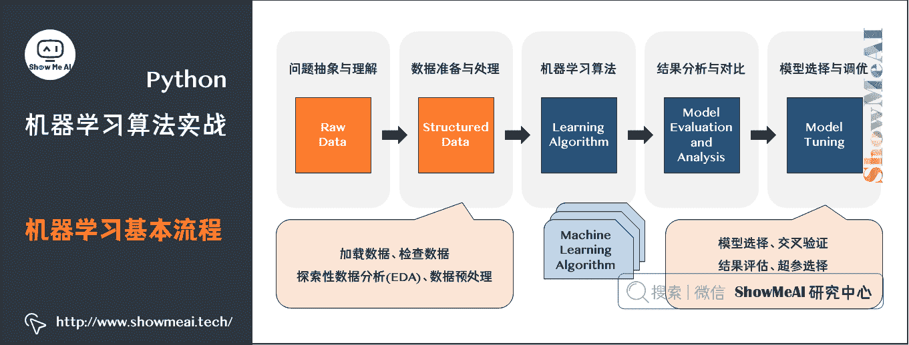

*   问题抽象与理解
*   数据准备与处理(预处理、特征提取、特征工程等)
*   各种机器学习算法
*   实验结果分析与对比
*   模型选择与调优

我们会覆盖到的机器学习算法包括：KNN、朴素贝叶斯、逻辑回归、SVM、决策树、随机森林、感知机、前馈神经网络、卷积神经网络。

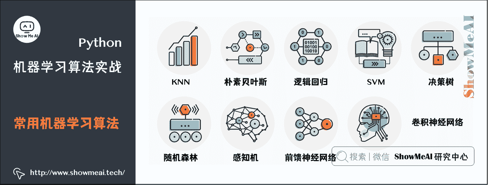

# 1.环境准备

工欲善其事必先利其器，我们先安装一下必需的 Python 库(当然我们也推荐大家用集成环境 anaconda，具体的安装与设置可以参考[ShowMeAI](http://www.showmeai.tech/)文章 [**图解 Python | 安装与环境设置**](http://www.showmeai.tech/article-detail/65) 完成)：

*   Numpy：用于 Python 的科学计算。
    *   相关重点知识请查看 [**数据科学工具速查 | Numpy 使用指南**](http://www.showmeai.tech/article-detail/100) 或者 [**图解数据分析：从入门到精通系列教程**](http://www.showmeai.tech/tutorials/33) 中的 Numpy 详解教程。
*   PIL：一个简单的图像处理库。
*   Scikit-Learn：包含多种机器学习算法。
    *   相关重点知识请查看 [**AI 建模工具速查 | Scikit-Learn 使用指南**](http://www.showmeai.tech/article-detail/108)
*   Kears 和 TensorFlow：用于深度学习。本教程可以仅采用 CPU 版本的 TensorFlow。
    *   相关重点知识请查看 [**AI 建模工具速查 | TensorFlow 使用指南**](http://www.showmeai.tech/article-detail/109)、[**AI 建模工具速查 | Keras 使用指南**](http://www.showmeai.tech/article-detail/110)
*   OpenCV：本教程并不直接使用 OpenCV，但 imutils 库依赖它。
    *   相关重点知识请查看 [**AI 建模工具速查 | OpenCV 使用指南**](http://www.showmeai.tech/article-detail/112)
*   imutils：图像处理/计算机视觉库。

```
可以采用 pip 安装，命令如下：
$ pip install numpy
$ pip install pillow
$ pip install --upgrade scikit-learn
$ pip install tensorflow # or tensorflow-gpu
$ pip install keras
$ pip install opencv-contrib-python
$ pip install --upgrade imutils 
```

# 2.数据集

因为本篇文章我们介绍结构化数据和非结构化数据的不同建模，我们这里用到两个数据集。

## 2.1 iris(鸢尾花)数据集

第一个数据集是 iris(鸢尾花)数据集，它是一个入门级数据集。整个数据集都是数值型的数据，是一个结构化的表格数据，每一行代表一个样本，然后每一列就是不同的属性。

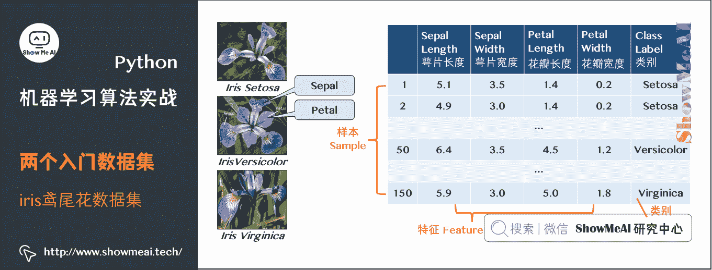

这个数据集主要是收集了三种不同的鸢尾花的数据，分别为：

*   *Iris Setosa*
*   *Iris Versicolor*
*   *Iris Virginica*

对应图中最后一列`Class label`，然后还有四种属性，分别是：

*   Sepal length：萼片长度
*   Sepal width：萼片宽度
*   Petal length：花瓣长度
*   Petal width：花瓣宽度

对于该数据集，我们的目标就是根据给定的四个属性，训练一个机器学习模型来正确分类每个样本的类别，这是一个典型的分类任务。

## 2.2 图像数据集

第二个数据集是一个图像数据集。它包括海岸线(Coast)、森林(Forest)和高速公路(Highway)三种场景，总共是 948 张图片，我们需要构建模型完成类别的分类，每个类别的具体图片数量如下：

*   海岸线(Coast)：360
*   森林(Forest)：328
*   高速公路(Highway)：260

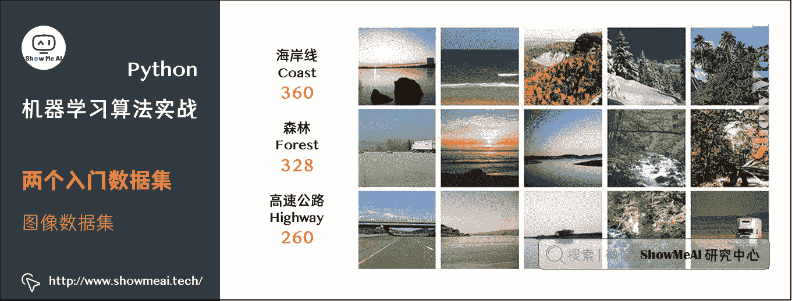

# 3.机器学习应用步骤

我们在不同场景下应用机器学习算法，都有大致的步骤，比如下面是一个典型的机器学习应用流程：


当然，并不是其中的每一步都是必须的，我们也可能会调整其中某些步骤中的细节。

## 3.1 问题抽象与理解

针对我们的问题，问一下自己：

*   数据集是哪种类型？数值型，类别型还是图像？
*   模型的最终目标是什么？
*   如何定义和衡量“准确率”呢？
*   以目前自身的机器学习知识来看，哪些算法在处理这类问题上效果很好？

前序问题比较简单，最后的问题，随着大家应用机器学习解决问题的经验积累，可以更准确快速地回答。

## 3.2 数据准备与处理

数据准备与处理，包括数据预处理以及特征工程了。一般这一步，包括了加载数据、检查数据、探索性数据分析(EDA)、数据预处理，进而决定需要做的特征提取或者特征工程。

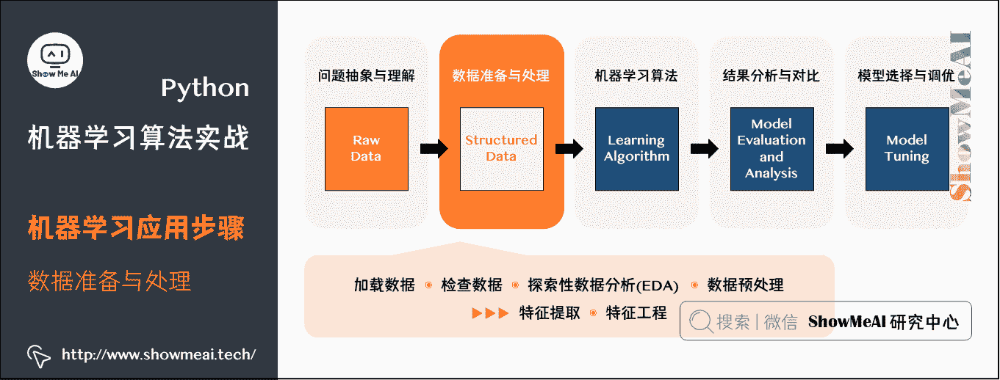

特征提取是应用某种算法通过某种方式来量化数据的过程。比如，对于图像数据，我们可以采用计算直方图的方法来统计图像中像素强度的分布，通过这种方式，我们就得到描述图像颜色的特征。

特征工程是将原始输入数据转换成一个更好描述潜在问题的特征表示的过程。大家可以查看[ShowMeAI](http://www.showmeai.tech/)的 [**机器学习专题文章**](http://www.showmeai.tech/tutorials/34) 系统了解特征工程的常见方法。

## 3.3 多模型应用

下一步可以选择各种候选机器学习算法，并应用在数据集上。我们安装的工具包内，包含很多机器学习算法，比如下述模型都可以用作分类：

*   线性模型(逻辑回归、线性 SVM)
*   非线性模型(RBF、SVM、梯度下降分类器)
*   树和基于集成的模型(决策树、随机森林)
*   神经网络(多层感知机、卷积神经网络)

对于模型选择，当然很多需要依据实验效果来定，但我们也有一些先序的经验，比如：

*   对于稠密型多特征的数据集，随机森林算法的效果很不错；
*   逻辑回归算法可以很好处理高维度的稀疏数据；
*   对于图像数据，CNNs 的效果非常好。

下图为 [**scikit-learn 工具库**](http://www.showmeai.tech/article-detail/108) 官方给的一个模型选择思路参考：

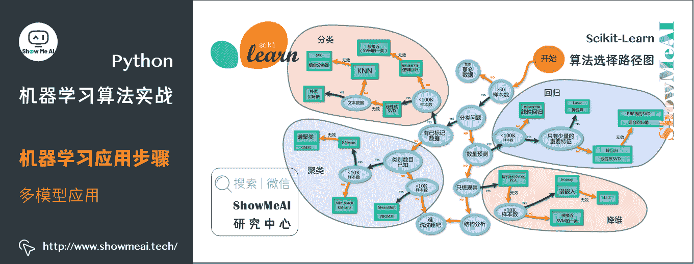

# 4.构建机器学习流程并实验分析

我们构建如下的代码文件目录，包含四个代码文件和一个`3scenes`图像文件夹(内含三场景数据集)，iris 数据集无需另外存储，直接采用`scikit-learn`库载入即可。

```
├── 3scenes
│   ├── coast [360 entries]
│   ├── forest [328 entries]
│   └── highway [260 entries]
├── iris_classifier.py
├── image_classifier.py
├── nn_iris.py
└── basic_cnn.py 
```

## 4.1 结构化数据建模

首先实现`iris_classifier`，我们这里直接使用 sklearn 的机器学习算法来对`iris`数据集进行分类。

```
# 导入需要的库
from sklearn.neighbors import KNeighborsClassifier
from sklearn.naive_bayes import GaussianNB
from sklearn.linear_model import LogisticRegression
from sklearn.svm import SVC
from sklearn.tree import DecisionTreeClassifier
from sklearn.ensemble import RandomForestClassifier
from sklearn.neural_network import MLPClassifier
from sklearn.model_selection import train_test_split
from sklearn.metrics import classification_report
from sklearn.datasets import load_iris
import argparse

# 设置参数
ap = argparse.ArgumentParser()
ap.add_argument("-m", "--model", type=str, default="knn", help="type of python machine learning model to use")
args = vars(ap.parse_args())

# 定义一个保存模型的字典，根据 key 来选择加载哪个模型
models = {
    "knn": KNeighborsClassifier(n_neighbors=1),
    "naive_bayes": GaussianNB(),
    "logit": LogisticRegression(solver="lbfgs", multi_class="auto"),
    "svm": SVC(kernel="rbf", gamma="auto"),
    "decision_tree": DecisionTreeClassifier(),
    "random_forest": RandomForestClassifier(n_estimators=100),
    "mlp": MLPClassifier()
} 
```

其中，models 从前往后依次包括这些算法：KNN、朴素贝叶斯、逻辑回归、SVM、决策树、随机森林、感知机等。

我们直接调用`sklearn`中相应的函数来实现对应的算法即可，这里直接用一个`models`的字典来保存不同模型的初始化，然后根据参数`--model`来调用对应的模型，比如命令输入`python iris_classifier.py --model knn`就是调用`knn`算法模型。

接着就是载入数据部分：

```
print("加载数据中...")
dataset = load_iris()
trainX, testX, trainY, testY = train_test_split(dataset.data, dataset.target, random_state=3, test_size=0.2) 
```

这里直接调用`sklearn.datasets`中的`load_iris()`载入数据，然后采用`train_test_split`来划分训练集和数据集，这里是 80%数据作为训练集，20%作为测试集。

最后就是训练模型和预测部分：

```
# 训练模型
print("应用 '{}' 模型建模...".format(args["model"]))
model = models[args["model"]]
model.fit(trainX, trainY)

# 预测并输出一份分类结果报告
print("评估模型效果...")
predictions = model.predict(testX)
print(classification_report(testY, predictions, target_names=dataset.target_names)) 
```

## 4.2 图像数据建模

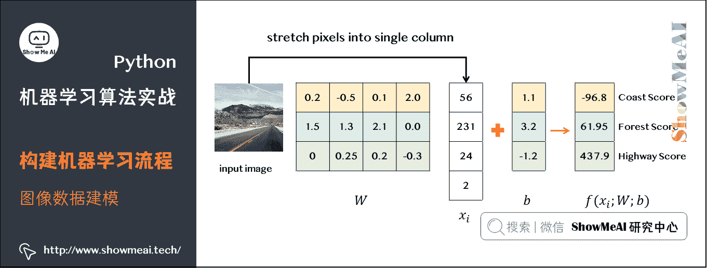

类似的过程对三场景图像数据集构建代码`image_classifier.py`：

```
# 导入工具库
from sklearn.preprocessing import LabelEncoder
from PIL import Image
from imutils import paths
import numpy as np
import os 
```

其中`LabelEncoder`是为了将标签从字符串编码为整型，然后其余几项都是处理图像相关。

对于图像数据，如果直接采用原始像素信息输入模型中，大部分的机器学习算法效果都很不理想，所以这里采用特征提取方法，主要是统计图像颜色通道的均值和标准差信息，总共是`RGB`3 个通道，每个通道各计算均值和标准差，然后结合在一起，得到一个六维的特征，函数如下所示：

```
def extract_color_stats(image):
    '''
    将图片分成 RGB 三通道，然后分别计算每个通道的均值和标准差，然后返回
    :param image:
    :return:
    '''
    (R, G, B) = image.split()
    features = [np.mean(R), np.mean(G), np.mean(B), np.std(R), np.std(G), np.std(B)]

    return features 
```

然后同样会定义一个`models`字典，代码一样，这里就不贴出来了，然后图像载入部分的代码如下：

```
# 加载数据并提取特征
print("抽取图像特征中...")
imagePaths = paths.list_images(args['dataset'])
data = []
labels = []

# 循环遍历所有的图片数据
for imagePath in imagePaths:
    # 加载图片，然后计算图片的颜色通道统计信息
    image = Image.open(imagePath)
    features = extract_color_stats(image)
    data.append(features)

    # 保存图片的标签信息
    label = imagePath.split(os.path.sep)[-2]
    labels.append(label)

# 对标签进行编码，从字符串变为整数类型
le = LabelEncoder()
labels = le.fit_transform(labels)

# 进行训练集和测试集的划分，80%数据作为训练集，其余 20%作为测试集
trainX, testX, trainY, testY = train_test_split(data, labels, test_size=0.2) 
```

上述代码就完成加载图片的路径信息，然后依次遍历，读取图片，提取特征，提取标签信息，保存特征和标签信息，接着编码标签，然后就是划分训练集和测试集。

接着是相同的训练模型和预测的代码，和前面的分类器一样。完整版代码如下：

```
# 导入工具库
from sklearn.neighbors import KNeighborsClassifier
from sklearn.naive_bayes import GaussianNB
from sklearn.linear_model import LogisticRegression
from sklearn.svm import SVC
from sklearn.tree import DecisionTreeClassifier
from sklearn.ensemble import RandomForestClassifier
from sklearn.neural_network import MLPClassifier
from sklearn.preprocessing import LabelEncoder
from sklearn.model_selection import train_test_split
from sklearn.metrics import classification_report
from PIL import Image
from imutils import paths
import numpy as np
import argparse
import os

# 抽取图像特征
def extract_color_stats(image):
    '''
    将图片分成 RGB 三通道，然后分别计算每个通道的均值和标准差，然后返回
    :param image:
    :return:
    '''
    (R, G, B) = image.split()
    features = [np.mean(R), np.mean(G), np.mean(B), np.std(R), np.std(G), np.std(B)]

    return features

# 设置参数
ap = argparse.ArgumentParser()
ap.add_argument("-d", "--dataset", type=str, default="3scenes",
                help="path to directory containing the '3scenes' dataset")
ap.add_argument("-m", "--model", type=str, default="knn",
                help="type of python machine learning model to use")
args = vars(ap.parse_args())

# 定义一个保存模型的字典，根据 key 来选择加载哪个模型
models = {
    "knn": KNeighborsClassifier(n_neighbors=1),
    "naive_bayes": GaussianNB(),
    "logit": LogisticRegression(solver="lbfgs", multi_class="auto"),
    "svm": SVC(kernel="rbf", gamma="auto"),
    "decision_tree": DecisionTreeClassifier(),
    "random_forest": RandomForestClassifier(n_estimators=100),
    "mlp": MLPClassifier()
}

# 加载数据并提取特征
print("抽取图像特征中...")
imagePaths = paths.list_images(args['dataset'])
data = []
labels = []

# 循环遍历所有的图片数据
for imagePath in imagePaths:
    # 加载图片，然后计算图片的颜色通道统计信息
    image = Image.open(imagePath)
    features = extract_color_stats(image)
    data.append(features)

    # 保存图片的标签信息
    label = imagePath.split(os.path.sep)[-2]
    labels.append(label)

# 对标签进行编码，从字符串变为整数类型
le = LabelEncoder()
labels = le.fit_transform(labels)

# 进行训练集和测试集的划分，80%数据作为训练集，其余 20%作为测试集
trainX, testX, trainY, testY = train_test_split(data, labels, random_state=3, test_size=0.2)
# print('trainX numbers={}, testX numbers={}'.format(len(trainX), len(testX)))

# 训练模型
print("[应用 '{}' 模型建模".format(args["model"]))
model = models[args["model"]]
model.fit(trainX, trainY)

# 预测并输出分类结果报告
print("模型评估")
predictions = model.predict(testX)
print(classification_report(testY, predictions, target_names=le.classes_)) 
```

完成这两份代码后，我们就可以开始运行下代码，对比不同算法在两个数据集上的性能。

## 4.3 不同模型建模对比

### (1) KNN

K-Nearest Neighbors 分类器最简单的分类算法之一。该算法依赖于特征向量之间的距离。简单地说，KNN 算法通过在 k 个最接近的样本中最多的类别来对未知数据点进行分类。关于 KNN 的详细讲解可以阅读[ShowMeAI](http://www.showmeai.tech/)的文章 [**图解机器学习 | KNN 算法及其应用**](http://www.showmeai.tech/article-detail/187)。


这里我们先运行下`image_classifier.py`，调用默认的模型`knn`，看下`KNN`在`iris`数据集上的实验结果，如下所示：

```
$ !python iris_classifier.py --model knn
加载数据中...
应用 'knn' 模型建模...
评估模型效果...
              precision    recall  f1-score   support

      setosa       1.00      1.00      1.00        10
  versicolor       0.90      0.90      0.90        10
   virginica       0.90      0.90      0.90        10

    accuracy                           0.93        30
   macro avg       0.93      0.93      0.93        30
weighted avg       0.93      0.93      0.93        30 
```

其中主要是给出了对每个类别的精确率、召回率、F1 以及该类别测试集数量，即分别对应 precision、recall、f1-score、support。根据最后一行第一列，可以看到 KNN 取得 93%的准确率。

接着是在三场景图片数据集上的实验结果：

```
$ !python image_classifier.py --model knn
抽取图像特征中...
应用 'knn' 模型建模...
评估模型效果...
              precision    recall  f1-score   support

       coast       0.84      0.68      0.75       105
      forest       0.78      0.77      0.77        78
     highway       0.56      0.78      0.65        54

   micro avg       0.73      0.73      0.73       237
   macro avg       0.72      0.74      0.72       237
weighted avg       0.75      0.73      0.73       237 
```

这里 KNN 取得 75%的准确率。

ps：实际上，运行这个算法，不同次数会有不同的结果，其主要原因是因为在划分训练集和测试集的时候，代码没有设置参数`random_state`，这导致每次运行划分的训练集和测试集的图片都是不同的，所以运行结果也会不相同！

### (2) 朴素贝叶斯

接着是朴素贝叶斯算法，关于朴素贝叶斯算法的详细讲解可以阅读[ShowMeAI](http://www.showmeai.tech/)的文章 [**图解机器学习 | 朴素贝叶斯算法详解**](http://www.showmeai.tech/article-detail/189)。

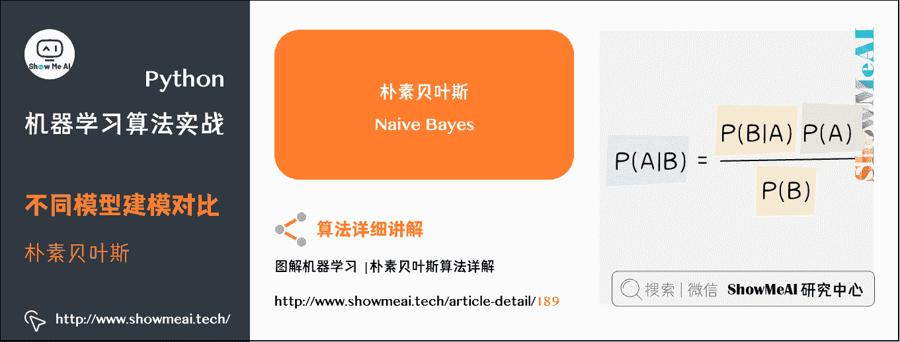

分别测试两个数据集，结果如下：

```
$ !python iris_classifier.py --model naive_bayes
加载数据中...
应用 'naive_bayes' 模型建模...
评估模型效果...
              precision    recall  f1-score   support

      setosa       1.00      1.00      1.00        15
  versicolor       1.00      0.92      0.96        12
   virginica       0.92      1.00      0.96        11

   micro avg       0.97      0.97      0.97        38
   macro avg       0.97      0.97      0.97        38
weighted avg       0.98      0.97      0.97        38 
```

```
$ !python image_classifier.py --model naive_bayes
抽取图像特征中...
应用 'naive_bayes' 模型建模...
评估模型效果...
              precision    recall  f1-score   support

       coast       0.69      0.40      0.50        88
      forest       0.68      0.82      0.74        84
     highway       0.61      0.78      0.68        65

   micro avg       0.65      0.65      0.65       237
   macro avg       0.66      0.67      0.64       237
weighted avg       0.66      0.65      0.64       237 
```

同样，朴素贝叶斯在 iris 上有 98%的准确率，但是在图像数据集上仅有 66%的准确率。

那么，我们是否可以说明 KNN 算法比朴素贝叶斯好呢？当然是不可以的，上述结果只能说明在三场景图像数据集上，KNN 算法优于朴素贝叶斯算法。
实际上，每种算法都有各自的优缺点和适用场景，不能一概而论地说某种算法任何时候都优于另一种算法，这需要具体问题具体分析。

### (3) 逻辑回归

接着是逻辑回归算法，关于逻辑回归算法的详细讲解可以阅读[ShowMeAI](http://www.showmeai.tech/)的文章 [**图解机器学习 | 逻辑回归算法详解**](http://www.showmeai.tech/article-detail/188)。

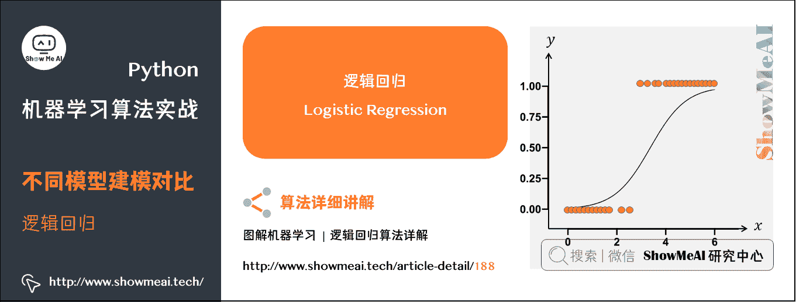

分别测试两个数据集，结果如下：

```
$ !python iris_classifier.py --model logit
加载数据中...
应用 'logit' 模型建模...
评估模型效果...
              precision    recall  f1-score   support

      setosa       1.00      1.00      1.00        15
  versicolor       1.00      0.92      0.96        12
   virginica       0.92      1.00      0.96        11

   micro avg       0.97      0.97      0.97        38
   macro avg       0.97      0.97      0.97        38
weighted avg       0.98      0.97      0.97        38 
```

```
$ !python image_classifier.py --model logit
抽取图像特征中...
应用 'logit' 模型建模...
评估模型效果...
              precision    recall  f1-score   support

       coast       0.67      0.67      0.67        92
      forest       0.79      0.82      0.80        82
     highway       0.61      0.57      0.59        63

   micro avg       0.70      0.70      0.70       237
   macro avg       0.69      0.69      0.69       237
weighted avg       0.69      0.70      0.69       237 
```

同样，逻辑回归在 `iris` 上有 98% 的准确率，但是在图像数据集上仅有 69% 的准确率

### (4) 支持向量机 SVM

接着是 SVM 算法，关于 SVM 算法的详细讲解可以阅读[ShowMeAI](http://www.showmeai.tech/)的文章 [**图解机器学习 | 支持向量机模型详解**](http://www.showmeai.tech/article-detail/196)。


分别测试两个数据集，结果如下：

```
$ !python iris_classifier.py --model svm
加载数据中...
应用 'svm' 模型建模...
评估模型效果...
              precision    recall  f1-score   support

      setosa       1.00      1.00      1.00        15
  versicolor       1.00      0.92      0.96        12
   virginica       0.92      1.00      0.96        11

   micro avg       0.97      0.97      0.97        38
   macro avg       0.97      0.97      0.97        38
weighted avg       0.98      0.97      0.97        38 
```

```
$ !python image_classifier.py --model svm
抽取图像特征中...
应用 'svm' 模型建模...
评估模型效果...
              precision    recall  f1-score   support

       coast       0.84      0.76      0.80        92
      forest       0.86      0.93      0.89        84
     highway       0.78      0.80      0.79        61

   micro avg       0.83      0.83      0.83       237
   macro avg       0.83      0.83      0.83       237 
```

同样，SVM 在`iris`上有 98%的准确率，但是在图像数据集上仅有 83%的准确率。

### (5) 决策树

接着是决策树算法，关于决策树算法的详细讲解可以阅读[ShowMeAI](http://www.showmeai.tech/)的文章 [**图解机器学习 | 决策树模型详解**](http://www.showmeai.tech/article-detail/190)。


分别测试两个数据集，结果如下：

```
$ !python iris_classifier.py --model decision_tree
加载数据中...
应用 'decision_tree' 模型建模...
评估模型效果...
              precision    recall  f1-score   support

      setosa       1.00      1.00      1.00        15
  versicolor       0.92      0.92      0.92        12
   virginica       0.91      0.91      0.91        11

   micro avg       0.95      0.95      0.95        38
   macro avg       0.94      0.94      0.94        38
weighted avg       0.95      0.95      0.95        38 
```

```
$ !python image_classifier.py --model decision_tree
抽取图像特征中...
应用 'decision_tree' 模型建模...
评估模型效果...
              precision    recall  f1-score   support

       coast       0.71      0.74      0.72        85
      forest       0.76      0.80      0.78        83
     highway       0.77      0.68      0.72        69

   micro avg       0.74      0.74      0.74       237
   macro avg       0.75      0.74      0.74       237
weighted avg       0.74      0.74      0.74       237 
```

同样，决策树在`iris`上有 98%的准确率，但是在图像数据集上仅有 74%的准确率。

### (6) 随机森林

接着是随机森林算法，关于随机森林算法的详细讲解可以阅读[ShowMeAI](http://www.showmeai.tech/)的文章 [**图解机器学习 | 随机森林分类模型详解**](http://www.showmeai.tech/article-detail/191)。

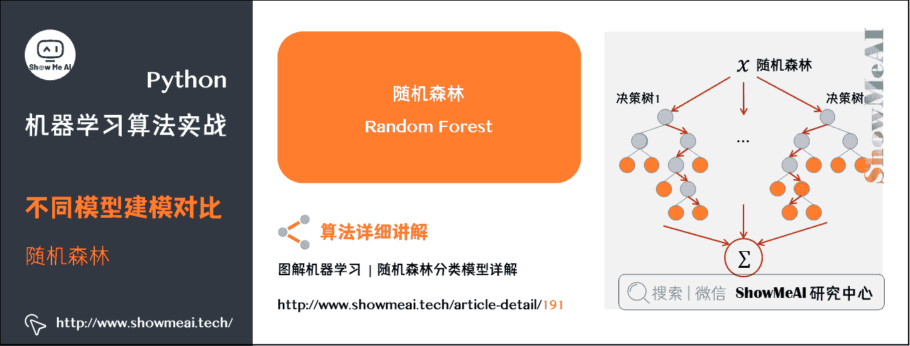

分别测试两个数据集，结果如下：

```
$ !python iris_classifier.py --model random_forest
加载数据中...
应用 'random_forest' 模型建模...
评估模型效果...
              precision    recall  f1-score   support

      setosa       1.00      1.00      1.00        15
  versicolor       1.00      0.83      0.91        12
   virginica       0.85      1.00      0.92        11

   micro avg       0.95      0.95      0.95        38
   macro avg       0.95      0.94      0.94        38
weighted avg       0.96      0.95      0.95        38 
```

```
$ !python image_classifier.py --model random_forest
加载数据中...
应用 'random_forest' 模型建模...
评估模型效果...
              precision    recall  f1-score   support

       coast       0.80      0.83      0.81        84
      forest       0.92      0.84      0.88        90
     highway       0.77      0.81      0.79        63

   micro avg       0.83      0.83      0.83       237
   macro avg       0.83      0.83      0.83       237
weighted avg       0.84      0.83      0.83       237 
```

同样，随机森林在`iris`上有 96%的准确率，但是在图像数据集上仅有 84%的准确率。

注意了，一般如果决策树算法的效果还不错的话，随机森林算法应该也会取得不错甚至更好的结果，这是因为随机森林实际上就是多棵决策树通过集成学习方法组合在一起进行分类预测。

### (7) 多层感知机

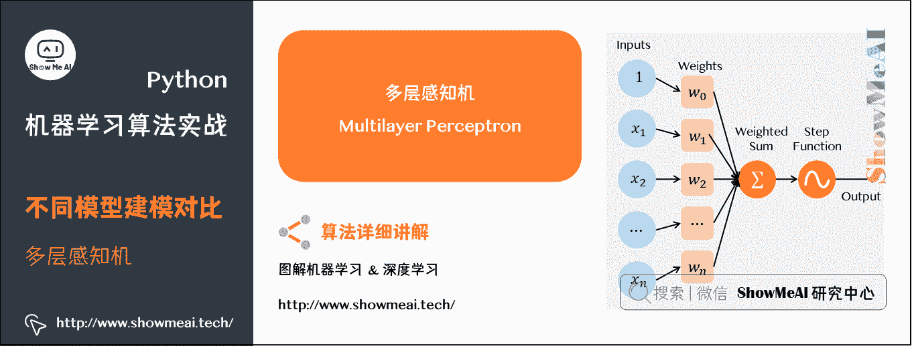

最后是多层感知机算法，分别测试两个数据集，结果如下：

```
$ !python iris_classifier.py --model mlp
加载数据中...
应用 'mlp' 模型建模...
评估模型效果...
              precision    recall  f1-score   support

      setosa       1.00      1.00      1.00        15
  versicolor       1.00      0.92      0.96        12
   virginica       0.92      1.00      0.96        11

   micro avg       0.97      0.97      0.97        38
   macro avg       0.97      0.97      0.97        38
weighted avg       0.98      0.97      0.97        38 
```

```
$ !python image_classifier.py --model mlp
抽取图像特征中...
应用 'mlp' 模型建模...
评估模型效果...
              precision    recall  f1-score   support

       coast       0.72      0.91      0.80        86
      forest       0.92      0.89      0.90        79
     highway       0.79      0.58      0.67        72

   micro avg       0.80      0.80      0.80       237
   macro avg       0.81      0.79      0.79       237
weighted avg       0.81      0.80      0.80       237 
```

同样，多层感知机在 `iris` 上有 98% 的准确率，但是在图像数据集上仅有 81% 的准确率.

### (8) 神经网络

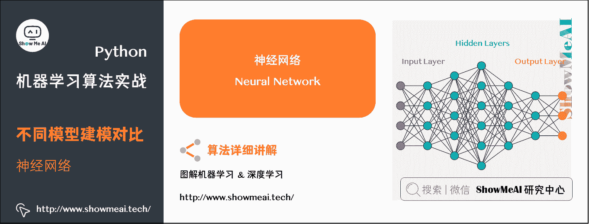

最后是实现深度学习的算法，也就是`nn_iris.py`和`basic_cnn.py`这两份代码。

首先是`nn_iris.py`的实现，同样首先是导入库和数据的处理：

```
# 导入工具库
from keras.models import Sequential
from keras.layers.core import Dense
from keras.optimizers import SGD
from sklearn.preprocessing import LabelBinarizer
from sklearn.model_selection import train_test_split
from sklearn.metrics import classification_report
from sklearn.datasets import load_iris

# 载入 Iris 数据集，然后进行训练集和测试集的划分，80%数据作为训练集，其余 20%作为测试集
print("加载数据中...")
dataset = load_iris()
(trainX, testX, trainY, testY) = train_test_split(dataset.data,
                                                  dataset.target, test_size=0.2)

# 将标签进行独热向量编码
lb = LabelBinarizer()
trainY = lb.fit_transform(trainY)
testY = lb.transform(testY) 
```

我们采用`Keras`来实现神经网络，然后这里需要将标签进行`one-hot`编码，即独热向量编码。

接着就是搭建网络模型的结构和训练、预测代码：

```
# 利用 Keras 定义网络模型
model = Sequential()
model.add(Dense(3, input_shape=(4,), activation="sigmoid"))
model.add(Dense(3, activation="sigmoid"))
model.add(Dense(3, activation="softmax"))

# 采用梯度下降训练模型
print('训练网络中...')
opt = SGD(lr=0.1, momentum=0.9, decay=0.1 / 250)
model.compile(loss='categorical_crossentropy', optimizer=opt, metrics=["accuracy"])
H = model.fit(trainX, trainY, validation_data=(testX, testY), epochs=250, batch_size=16)

# 预测
print('评估模型效果')
predictions = model.predict(testX, batch_size=16)
print(classification_report(testY.argmax(axis=1), predictions.argmax(axis=1), target_names=dataset.target_names)) 
```

上述代码构建了 3 层全连接层的神经网络，前两层采用`Sigmoid`激活函数，然后最后一层是输出层，所以采用`softmax`将输出变成概率值。优化算法选择的随机梯度下降`SGD`，损失函数是`categorical_crossentropy`，迭代次数是 250 次，每一批次的数据量`batch_size`是 16。

完整版代码如下：

```
# 加载工具库
from keras.models import Sequential
from keras.layers.core import Dense
from keras.optimizers import SGD
from sklearn.preprocessing import LabelBinarizer
from sklearn.model_selection import train_test_split
from sklearn.metrics import classification_report
from sklearn.datasets import load_iris

# 载入 Iris 数据集，然后进行训练集和测试集的划分，80%数据作为训练集，其余 20%作为测试集
print("加载数据中...")
dataset = load_iris()
(trainX, testX, trainY, testY) = train_test_split(dataset.data,
                                                  dataset.target, test_size=0.2)

# 将标签进行独热向量编码
lb = LabelBinarizer()
trainY = lb.fit_transform(trainY)
testY = lb.transform(testY)

# 利用 Keras 定义网络模型
model = Sequential()
model.add(Dense(3, input_shape=(4,), activation="sigmoid"))
model.add(Dense(3, activation="sigmoid"))
model.add(Dense(3, activation="softmax"))

# 采用梯度下降训练模型
print('训练网络中...')
opt = SGD(lr=0.1, momentum=0.9, decay=0.1 / 250)
model.compile(loss='categorical_crossentropy', optimizer=opt, metrics=["accuracy"])
H = model.fit(trainX, trainY, validation_data=(testX, testY), epochs=250, batch_size=16)

# 预测
print('评估模型效果...')
predictions = model.predict(testX, batch_size=16)
print(classification_report(testY.argmax(axis=1), predictions.argmax(axis=1), target_names=dataset.target_names)) 
```

直接运行命令`python nn_iris.py`，输出的结果如下：

```
$ python nn_iris.py 
Using TensorFlow backend.
加载数据中...
训练网络中...
Train on 112 samples, validate on 38 samples
Epoch 1/250
2022-02-08 10:28:19.104933: I tensorflow/core/platform/cpu_feature_guard.cc:141] Your CPU supports instructions that this TensorFlow binary was not compiled to use: AVX2 AVX512F FMA
112/112 [==============================] - 0s 2ms/step - loss: 1.1454 - acc: 0.3214 - val_loss: 1.1867 - val_acc: 0.2368
Epoch 2/250
112/112 [==============================] - 0s 48us/step - loss: 1.0828 - acc: 0.3929 - val_loss: 1.2132 - val_acc: 0.5000
Epoch 3/250
112/112 [==============================] - 0s 47us/step - loss: 1.0491 - acc: 0.5268 - val_loss: 1.0593 - val_acc: 0.4737
...
Epoch 248/250
112/112 [==============================] - 0s 46us/step - loss: 0.1319 - acc: 0.9554 - val_loss: 0.0407 - val_acc: 1.0000
Epoch 249/250
112/112 [==============================] - 0s 46us/step - loss: 0.1024 - acc: 0.9643 - val_loss: 0.1595 - val_acc: 0.8947
Epoch 250/250
112/112 [==============================] - 0s 47us/step - loss: 0.0795 - acc: 0.9821 - val_loss: 0.0335 - val_acc: 1.0000
评估模型效果...
             precision    recall  f1-score   support

     setosa       1.00      1.00      1.00         9
 versicolor       1.00      1.00      1.00        10
  virginica       1.00      1.00      1.00        19

avg / total       1.00      1.00      1.00        38 
```

这里得到的是 100%的准确率。

### (9) CNN

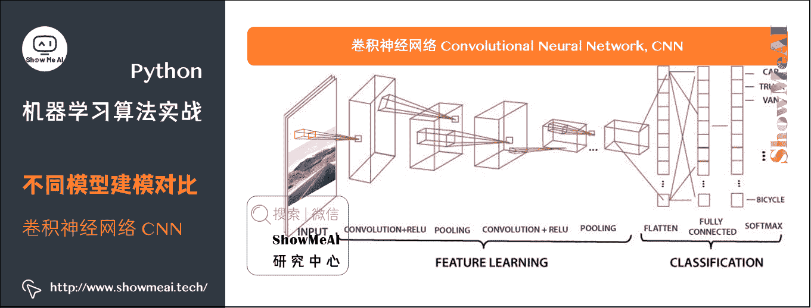

最后我们要应用卷积神经网络，我们实现一下`basic_cnn.py`代码。

同样首先是导入必须的库函数：

```
# 导入工具库
from keras.models import Sequential
from keras.layers.convolutional import Conv2D
from keras.layers.convolutional import MaxPooling2D
from keras.layers.core import Activation
from keras.layers.core import Flatten
from keras.layers.core import Dense
from keras.optimizers import Adam
from sklearn.preprocessing import LabelBinarizer
from sklearn.model_selection import train_test_split
from sklearn.metrics import classification_report
from PIL import Image
from imutils import paths
import numpy as np
import argparse
import os

# 配置参数
ap = argparse.ArgumentParser()
ap.add_argument("-d", "--dataset", type=str, default="3scenes",
                help="path to directory containing the '3scenes' dataset")
args = vars(ap.parse_args()) 
```

同样是要导入`Keras`来建立`CNN`的网络模型，另外因为是处理图像数据，所以`PIL`、`imutils`也是要导入的。

然后是加载数据和划分训练集和测试集，对于加载数据，这里直接采用原始图像像素数据，只需要对图像数据做统一尺寸的调整，这里是统一调整为 32×32，并做归一化到`[0,1]`的范围。

```
# 加载数据并提取特征
print("抽取图像特征中...")
imagePaths = paths.list_images(args['dataset'])
data = []
labels = []

# 循环遍历所有的图片数据
for imagePath in imagePaths:
    # 加载图片，然后调整成 32×32 大小，并做归一化到 [0,1]
    image = Image.open(imagePath)
    image = np.array(image.resize((32, 32))) / 255.0
    data.append(image)

    # 保存图片的标签信息
    label = imagePath.split(os.path.sep)[-2]
    labels.append(label)

# 对标签编码，从字符串变为整型
lb = LabelBinarizer()
labels = lb.fit_transform(labels)

# 划分训练集和测试集
(trainX, testX, trainY, testY) = train_test_split(np.array(data), np.array(labels), test_size=0.25) 
```

接着定义了一个 4 层的`CNN`网络结构，包含 3 层卷积层和最后一层输出层，优化算法采用的是 Adam 而不是`SGD`。代码如下所示：

```
# 定义 CNN 网络模型结构
model = Sequential()
model.add(Conv2D(8, (3, 3), padding="same", input_shape=(32, 32, 3)))
model.add(Activation("relu"))
model.add(MaxPooling2D(pool_size=(2, 2), strides=(2, 2)))
model.add(Conv2D(16, (3, 3), padding="same"))
model.add(Activation("relu"))
model.add(MaxPooling2D(pool_size=(2, 2), strides=(2, 2)))
model.add(Conv2D(32, (3, 3), padding="same"))
model.add(Activation("relu"))
model.add(MaxPooling2D(pool_size=(2, 2), strides=(2, 2)))
model.add(Flatten())
model.add(Dense(3))
model.add(Activation("softmax"))

# 训练模型
print("训练网络中...")
opt = Adam(lr=1e-3, decay=1e-3 / 50)
model.compile(loss="categorical_crossentropy", optimizer=opt, metrics=["accuracy"])
H = model.fit(trainX, trainY, validation_data=(testX, testY),
              epochs=50, batch_size=32)

# 预测
print("评估模型效果...")
predictions = model.predict(testX, batch_size=32)
print(classification_report(testY.argmax(axis=1),
                            predictions.argmax(axis=1), target_names=lb.classes_)) 
```

运行命令`python basic_cnn.py`，输出结果如下：

```
$ python basic_cnn.py 
Using TensorFlow backend.
加载图像数据...
训练网络中...
Train on 711 samples, validate on 237 samples
Epoch 1/50
711/711 [==============================] - 0s 629us/step - loss: 1.0647 - acc: 0.4726 - val_loss: 0.9920 - val_acc: 0.5359
Epoch 2/50
711/711 [==============================] - 0s 313us/step - loss: 0.9200 - acc: 0.6188 - val_loss: 0.7778 - val_acc: 0.6624
Epoch 3/50
711/711 [==============================] - 0s 308us/step - loss: 0.6775 - acc: 0.7229 - val_loss: 0.5310 - val_acc: 0.7553
...
Epoch 48/50
711/711 [==============================] - 0s 307us/step - loss: 0.0627 - acc: 0.9887 - val_loss: 0.2426 - val_acc: 0.9283
Epoch 49/50
711/711 [==============================] - 0s 310us/step - loss: 0.0608 - acc: 0.9873 - val_loss: 0.2236 - val_acc: 0.9325
Epoch 50/50
711/711 [==============================] - 0s 307us/step - loss: 0.0587 - acc: 0.9887 - val_loss: 0.2525 - val_acc: 0.9114
评估模型效果...
             precision    recall  f1-score   support

      coast       0.85      0.96      0.90        85
     forest       0.99      0.94      0.97        88
    highway       0.91      0.80      0.85        64

avg / total       0.92      0.91      0.91       237 
```

`CNN`的准确率是达到 92%，它是优于之前的几种机器学习算法的结果。

# 5.小结

这篇简单的机器学习教程文章中，我们调用现有的库来应用对应的机器学习算法，解决了 2 个简单的场景问题。通过这份简单的入门教程，希望大家了解到：

(1) 没有任何一种算法是完美的，可以完全适用所有的场景，即便是目前很热门的深度学习方法，也存在它的局限性，所以应该具体问题具体分析！

(2) 经典的 5 步机器学习操作流程：

*   问题抽象与理解
*   数据准备与处理(预处理、特征提取、特征工程等)
*   各种机器学习算法
*   实验结果分析与对比
*   模型选择与调优

# 参考资料

*   [AI 建模工具速查 | Scikit-Learn 使用指南](http://www.showmeai.tech/article-detail/108)
*   [AI 建模工具速查 | Keras 使用指南](http://www.showmeai.tech/article-detail/110)
*   [图解机器学习算法 | 从入门到精通系列](http://www.showmeai.tech/tutorials/34)

# [ShowMeAI](http://www.showmeai.tech/)系列教程推荐

*   [图解 Python 编程：从入门到精通系列教程](http://www.showmeai.tech/tutorials/56)
*   [图解数据分析：从入门到精通系列教程](http://www.showmeai.tech/tutorials/33)
*   [图解 AI 数学基础：从入门到精通系列教程](http://www.showmeai.tech/tutorials/83)
*   [图解大数据技术：从入门到精通系列教程](http://www.showmeai.tech/tutorials/84)
*   [图解机器学习算法：从入门到精通系列教程](http://www.showmeai.tech/tutorials/34)
*   [机器学习实战：手把手教你玩转机器学习系列](http://www.showmeai.tech/tutorials/41)

# 相关文章推荐

*   [Python 机器学习算法应用实践](http://www.showmeai.tech/article-detail/201)
*   [SKLearn 入门与简单应用案例](http://www.showmeai.tech/article-detail/202)
*   [SKLearn 最全应用指南](http://www.showmeai.tech/article-detail/203)
*   [XGBoost 建模应用详解](http://www.showmeai.tech/article-detail/204)
*   [LightGBM 建模应用详解](http://www.showmeai.tech/article-detail/205)
*   [Python 机器学习综合项目-电商销量预估](http://www.showmeai.tech/article-detail/206)
*   [Python 机器学习综合项目-电商销量预估<进阶方案>](http://www.showmeai.tech/article-detail/207)
*   [机器学习特征工程最全解读](http://www.showmeai.tech/article-detail/208)
*   [自动化特征工程工具 Featuretools 应用](http://www.showmeai.tech/article-detail/209)
*   [AutoML 自动化机器学习建模](http://www.showmeai.tech/article-detail/210)

