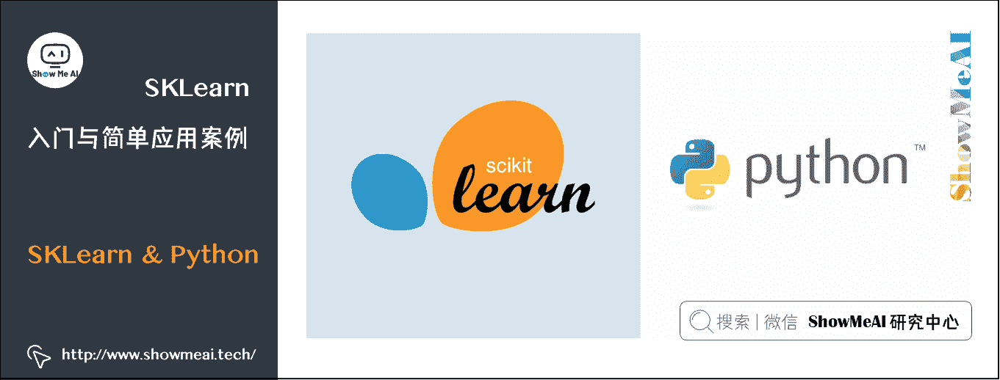
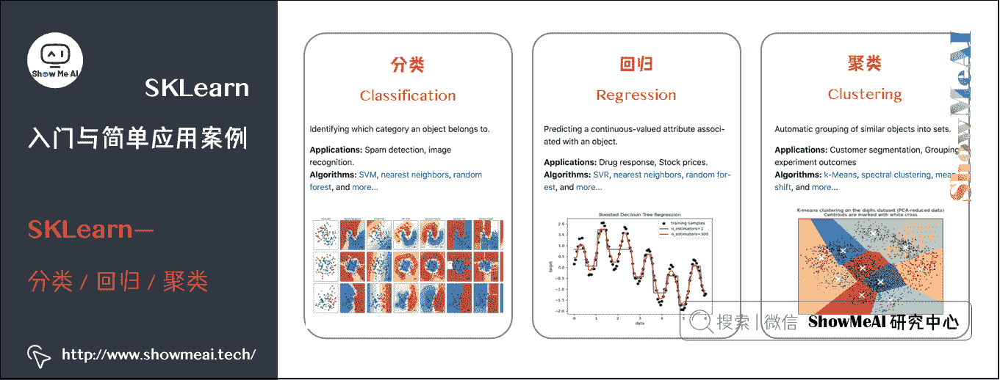
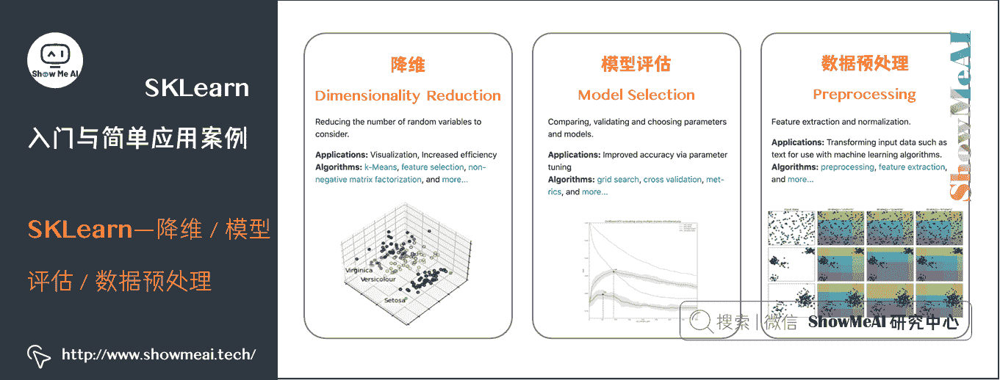
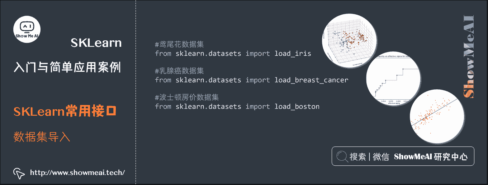
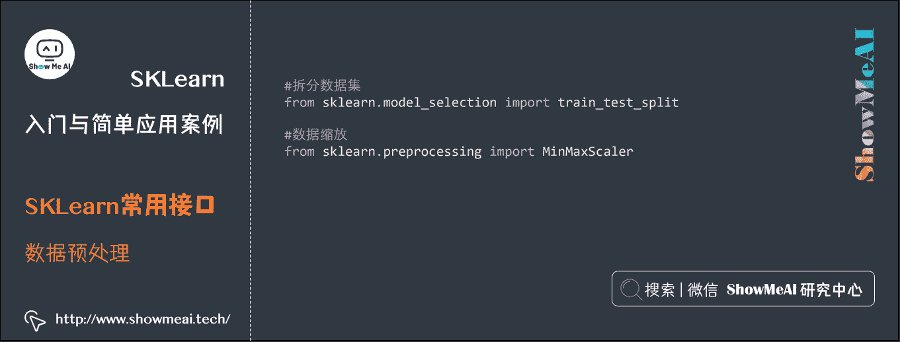
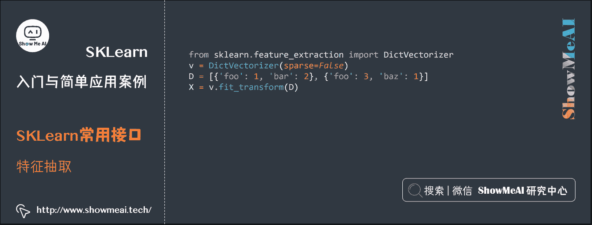
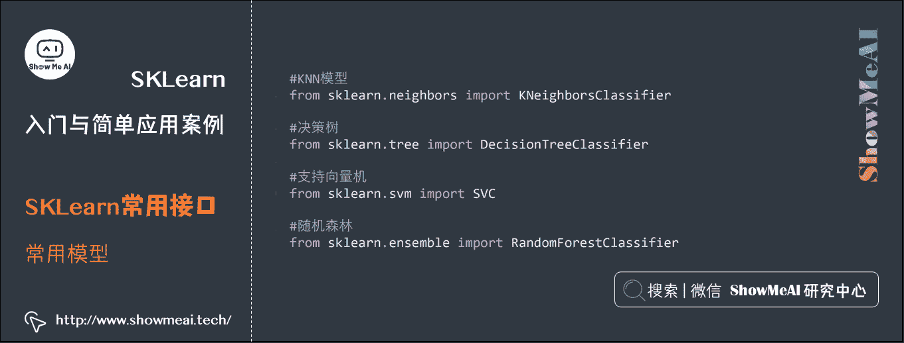
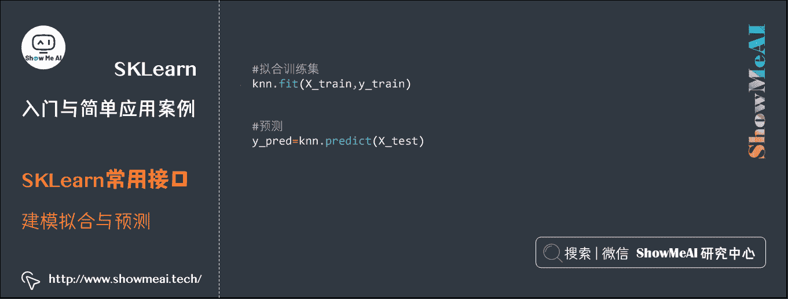
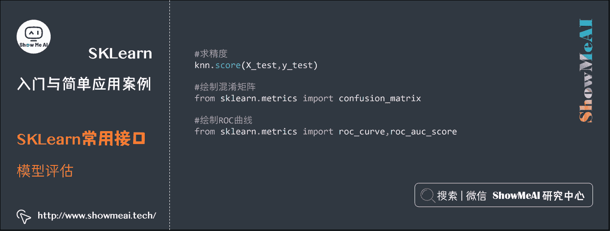

# 机器学习实战 | SKLearn 入门与简单应用案例

> 原文：[`blog.csdn.net/ShowMeAI/article/details/123647024`](https://blog.csdn.net/ShowMeAI/article/details/123647024)


作者：[韩信子](https://github.com/HanXinzi-AI)@[ShowMeAI](http://www.showmeai.tech/)
[教程地址](http://www.showmeai.tech/tutorials/41)：[`www.showmeai.tech/tutorials/41`](http://www.showmeai.tech/tutorials/41)
[本文地址](http://www.showmeai.tech/article-detail/202)：[`www.showmeai.tech/article-detail/202`](http://www.showmeai.tech/article-detail/202)
声明：版权所有，转载请联系平台与作者并注明出处
收藏[ShowMeAI](http://www.showmeai.tech/)查看更多精彩内容

* * *

# 引言

在前面的机器学习案例中，我们使用了 Python 机器学习工具库 Scikit-Learn，它建立在 NumPy、SciPy、Pandas 和 Matplotlib 之上，也是最常用的 Python 机器学习工具库之一，里面的 API 的设计非常好，所有对象的接口简单，很适合新手上路。[ShowMeAI](http://www.showmeai.tech/)在本篇内容中对 Scikit-Learn 做一个介绍。



# 1.SKLearn 是什么

Scikit-Learn 也简称 SKLearn，是一个基于 Python 语言的机器学习工具，它对常用的机器学习方法进行了封装，例如，分类、回归、聚类、降维、模型评估、数据预处理等，我们只需调用对应的接口即可。




在 SKLearn 的官网上，写着以下四点介绍：

*   一个简单高效的数据挖掘和数据分析工具。
*   构建在 NumPy，SciPy 和 matplotlib 上。
*   可供大家在各种环境中重复使用。
*   开源，可商业使用–BSD 许可证。

SKLearn 官网：[`scikit-learn.org/stable/`](https://scikit-learn.org/stable/)

SKLearn 的快速使用方法也推荐大家查看[ShowMeAI](http://www.showmeai.tech/)的文章和速查手册 [**AI 建模工具速查|Scikit-learn 使用指南**](http://www.showmeai.tech/article-detail/108)

# 2.安装 SKLearn

安装 SKLearn 非常简单，命令行窗口中输入命令：

```py
pip install scikit-learn 
```

我们也可以使用清华镜像源安装，通常速度会更快一些：

```py
pip install scikit-learn -i https://pypi.tuna.tsinghua.edu.cn/simple 
```

# 3.SKLearn 常用接口

对于机器学习整个流程中涉及到的常用操作，SKLearn 中几乎都有现成的接口可以直接调用，而且不管使用什么处理器或者模型，它的接口一致度都非常高。

## 3.1 数据集导入

更多数据集请参考 SKLearn 官网：[`scikit-learn.org/stable/modules/classes.html?highlight=dataset#module-sklearn.datasets`](https://scikit-learn.org/stable/modules/classes.html?highlight=dataset#module-sklearn.datasets)



```py
#鸢尾花数据集
from sklearn.datasets import load_iris
#乳腺癌数据集
from sklearn.datasets import load_breast_cancer
#波士顿房价数据集
from sklearn.datasets import load_boston 
```

## 3.2 数据预处理

官网链接：[`scikit-learn.org/stable/modules/classes.html#module-sklearn.preprocessing`](https://scikit-learn.org/stable/modules/classes.html#module-sklearn.preprocessing)



```py
#拆分数据集
from sklearn.model_selection import train_test_split
#数据缩放
from sklearn.preprocessing import MinMaxScaler 
```

## 3.3 特征抽取

官网链接：[`scikit-learn.org/stable/modules/classes.html#module-sklearn.feature_extraction`](https://scikit-learn.org/stable/modules/classes.html#module-sklearn.feature_extraction)



```py
from sklearn.feature_extraction import DictVectorizer
v = DictVectorizer(sparse=False)
D = [{'foo': 1, 'bar': 2}, {'foo': 3, 'baz': 1}]
X = v.fit_transform(D) 
```

## 3.4 特征选择

官网链接：[`scikit-learn.org/stable/modules/classes.html#module-sklearn.feature_selection`](https://scikit-learn.org/stable/modules/classes.html#module-sklearn.feature_selection)


```py
from sklearn.datasets import load_digits
from sklearn.feature_selection import SelectKBest, chi2
X, y = load_digits(return_X_y=True)
# 特征选择
X_new = SelectKBest(chi2, k=20).fit_transform(X, y) 
```

## 3.5 常用模型

官网链接：[`scikit-learn.org/stable/modules/classes.html`](https://scikit-learn.org/stable/modules/classes.html)



```py
#KNN 模型
from sklearn.neighbors import KNeighborsClassifier
#决策树
from sklearn.tree import DecisionTreeClassifier
#支持向量机
from sklearn.svm import SVC
#随机森林
from sklearn.ensemble import RandomForestClassifier 
```

## 3.6 建模拟合与预测



```py
#拟合训练集
knn.fit(X_train,y_train)
#预测
y_pred=knn.predict(X_test) 
```

## 3.7 模型评估

官网链接：[`scikit-learn.org/stable/modules/classes.html#sklearn-metrics-metrics`](https://scikit-learn.org/stable/modules/classes.html#sklearn-metrics-metrics)



```py
#求精度
knn.score(X_test,y_test)
#绘制混淆矩阵
from sklearn.metrics import confusion_matrix
#绘制 ROC 曲线
from sklearn.metrics import roc_curve,roc_auc_score 
```

## 3.8 典型的建模流程示例

典型的一个机器学习建模应用流程遵循【数据准备】【数据预处理】【特征工程】【建模与评估】【模型优化】这样的一些流程环节。

```py
# 加载数据
import numpy as np
import urllib
# 下载数据集
url = "http://archive.ics.uci.edu/ml/machine-learning-databases/pima-indians-diabetes/pima-indians-diabetes.data"
raw_data = urllib.urlopen(url)
# 加载 CSV 文件
dataset = np.loadtxt(raw_data, delimiter=",")
# 区分特征和标签
X = dataset[:,0:7]
y = dataset[:,8]

# 数据归一化
from sklearn import preprocessing
# 幅度缩放
scaled_X = preprocessing.scale(X)
# 归一化
normalized_X = preprocessing.normalize(X)
# 标准化
standardized_X = preprocessing.scale(X)

# 特征选择
from sklearn import metrics
from sklearn.ensemble import ExtraTreesClassifier
model = ExtraTreesClassifier()
model.fit(X, y)
# 特征重要度
print(model.feature_importances_)

# 建模与评估
from sklearn import metrics
from sklearn.linear_model import LogisticRegression
model = LogisticRegression()
model.fit(X, y)
print('MODEL')
print(model)
# 预测
expected = y
predicted = model.predict(X)
# 输出评估结果
print('RESULT')
print(metrics.classification_report(expected, predicted))
print('CONFUSION MATRIX')
print(metrics.confusion_matrix(expected, predicted))

# 超参数调优
from sklearn.model_selection import GridSearchCV
param_grid = {'penalty' : ['l1', 'l2', 'elasticnet'],
              'C': [0.1, 1, 10]}
grid_search = GridSearchCV(LogisticRegression(), param_grid, cv=5) 
```

## 参考资料

*   [图解机器学习算法 | 从入门到精通系列](http://www.showmeai.tech/tutorials/34)
*   SKLearn 官网：[`scikit-learn.org/stable/`](https://scikit-learn.org/stable/)

# [ShowMeAI](http://www.showmeai.tech/)系列教程推荐

*   [图解 Python 编程：从入门到精通系列教程](http://www.showmeai.tech/tutorials/56)
*   [图解数据分析：从入门到精通系列教程](http://www.showmeai.tech/tutorials/33)
*   [图解 AI 数学基础：从入门到精通系列教程](http://www.showmeai.tech/tutorials/83)
*   [图解大数据技术：从入门到精通系列教程](http://www.showmeai.tech/tutorials/84)
*   [图解机器学习算法：从入门到精通系列教程](http://www.showmeai.tech/tutorials/34)
*   [机器学习实战：手把手教你玩转机器学习系列](http://www.showmeai.tech/tutorials/41)

# 相关文章推荐

*   [Python 机器学习算法应用实践](http://www.showmeai.tech/article-detail/201)
*   [SKLearn 入门与简单应用案例](http://www.showmeai.tech/article-detail/202)
*   [SKLearn 最全应用指南](http://www.showmeai.tech/article-detail/203)
*   [XGBoost 建模应用详解](http://www.showmeai.tech/article-detail/204)
*   [LightGBM 建模应用详解](http://www.showmeai.tech/article-detail/205)
*   [Python 机器学习综合项目-电商销量预估](http://www.showmeai.tech/article-detail/206)
*   [Python 机器学习综合项目-电商销量预估<进阶方案>](http://www.showmeai.tech/article-detail/207)
*   [机器学习特征工程最全解读](http://www.showmeai.tech/article-detail/208)
*   [自动化特征工程工具 Featuretools 应用](http://www.showmeai.tech/article-detail/209)
*   [AutoML 自动化机器学习建模](http://www.showmeai.tech/article-detail/210)

