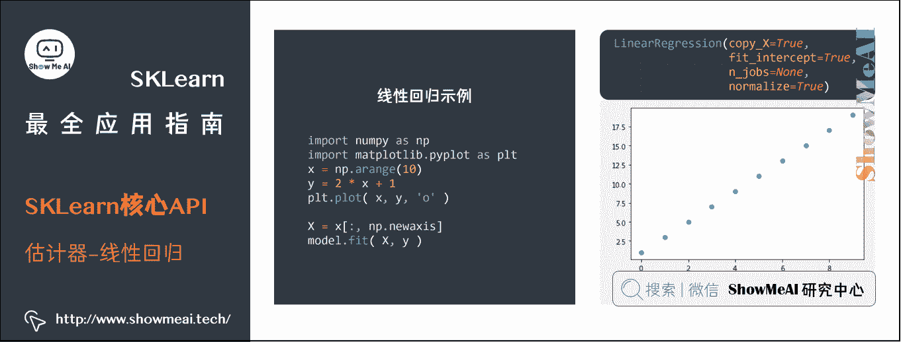
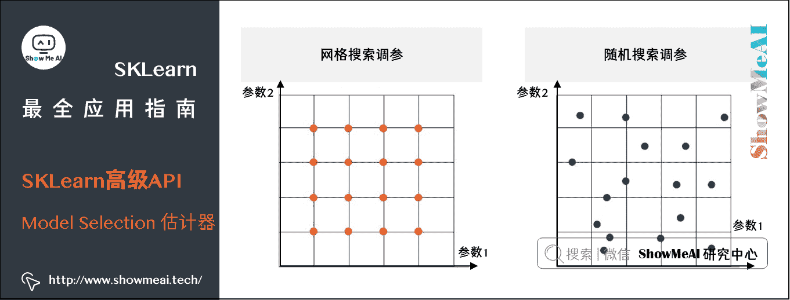

# 机器学习实战 | SKLearn 最全应用指南

> 原文：[`blog.csdn.net/ShowMeAI/article/details/123647339`](https://blog.csdn.net/ShowMeAI/article/details/123647339)


作者：[韩信子](https://github.com/HanXinzi-AI)@[ShowMeAI](http://www.showmeai.tech/)
[教程地址](http://www.showmeai.tech/tutorials/41)：[`www.showmeai.tech/tutorials/41`](http://www.showmeai.tech/tutorials/41)
[本文地址](http://www.showmeai.tech/article-detail/203)：[`www.showmeai.tech/article-detail/203`](http://www.showmeai.tech/article-detail/203)
声明：版权所有，转载请联系平台与作者并注明出处
**收藏[ShowMeAI](http://www.showmeai.tech/)查看更多精彩内容**

* * *

# 引言

我们在上一篇[**SKLearn 入门与简单应用案例**](http://www.showmeai.tech/article-detail/202)里给大家讲到了 SKLearn 工具的基本板块与使用方法，在本篇内容中，我们展开讲解 SKLearn 的进阶与核心内容。SKLearn 中有六大任务模块，如下图所示：分别是分类、回归、聚类、降维、模型选择和预处理。

*   SKLearn 官网：https://scikit-learn.org/stable/
*   SKLearn 的快速使用方法也推荐大家查看[ShowMeAI](http://www.showmeai.tech/)的文章和速查手册 [**AI 建模工具速查|Scikit-learn 使用指南**](http://www.showmeai.tech/article-detail/108)


在 SKLearn 中，因为做了上层的封装，分类模型、回归模型、聚类与降维模型、预处理器等等都叫做估计器(estimator)，就像在 Python 里「万物皆对象」，在 SKLearn 里「万物皆估计器」。

在本篇内容中，我们将给大家进一步深入讲解 scikit-learn 工具库的使用方法，力求完整覆盖 sklearn 工具库应用的方方面面。本文的内容板块包括：

*   ① **机器学习基础知识**：机器学习定义与四要素：数据、任务、性能度量和模型。机器学习概念，以便和 SKLearn 对应匹配上。
*   ② **SKLearn 讲解**：API 设计原理，sklearn 几大特点：一致性、可检验、标准类、可组合和默认值，以及 SKLearn 自带数据以及储存格式。
*   ③ **SKLearn 三大核心 API 讲解**：包括估计器、预测器和转换器。这个板块很重要，大家实际应用时主要是借助于核心 API 落地。
*   ④ **SKLearn 高级 API 讲解**：包括简化代码量的流水线(Pipeline 估计器)，集成模型(Ensemble 估计器)、有多类别-多标签-多输出分类模型(Multiclass 和 Multioutput 估计器)和模型选择工具(Model Selection 估计器)。

# 1.机器学习简介

关于本节内容，强烈推荐大家阅读[ShowMeAI](http://www.showmeai.tech/)文章 [**图解机器学习 | 机器学习基础知识**](http://www.showmeai.tech/article-detail/185) 和 [**图解机器学习 | 模型评估方法与准则**](http://www.showmeai.tech/article-detail/186) ，[ShowMeAI](http://www.showmeai.tech/)对相关知识内容展开做了详细讲解。

## 1.1 定义和构成元素

何为机器学习？大师汤姆米切尔（Tom Mitchell）对机器学习定义的原话是：

> A computer program is said to learn from experience E with respect to some class of tasks T and performance measure P if its performance at tasks in T, as measured by P, improves with experience E.


这段英文中有两个词 computer program 和 learn，翻译成中文就是机器(计算机程序)和学习，整体翻译下来就是说：如果计算机程序在 T 任务上的性能(由 P 衡量)随着经验 E 而提高，则称计算机程序从经验 E 中学习某类任务 T。

由上述机器学习的定义可知机器学习包含四个元素：

*   数据(Data)
*   任务(Task)
*   性能度量(Quality Metric)
*   算法(Algorithm)


## 1.2 数据

数据(data)是信息的载体。数据可以有以下划分方式：


*   从「**数据具体类型**」维度划分：结构化数据和非结构化数据。

    *   结构化数据(structured data)是由二维表结构来逻辑表达和实现的数据。
    *   非结构化数据是没有预定义的数据，不便用数据库二维表来表现的数据。非结构化数据包括图片，文字，语音和视频等。
*   从「**数据表达形式**」维度划分：原始数据和加工数据。

*   从「**数据统计性质**」维度划分：样本内数据和样本外数据。

对于非结构数据，通常神经网络有更好的效果，可以参考[ShowMeAI](http://www.showmeai.tech/)的文章 Python 机器学习算法实践中的图像建模例子。

机器学习模型很多时候使用的是结构化数据，即二维的数据表。我们这里以 iris 花瓣数据集举例，如下图。


下面术语大家在深入了解机器学习前一定要弄清楚：

*   每行的记录(这是一朵鸢尾花的数据统计)，称为一个「**样本(sample)**」。
*   反映样本在某方面的性质，例如萼片长度(Sepal Length)、花瓣长度(Petal Length)，称为「**特征(feature)**」。
*   特征上的取值，例如「样本 1」对应的 5.1、3.5 称为「**特征值(feature value)**」。
*   关于样本结果的信息，例如 Setosa、Versicolor，称为「**类别标签(class label)**」。
*   包含标签信息的示例，则称为「**样例(instance)**」，即`样例=(特征,标签)`。
*   从数据中学得模型的过程称为「**学习(learning)**」或「**训练(training)**」。
*   在训练数据中，每个样例称为「**训练样例(training instance)**」，整个集合称为「**训练集(training set)**」。

## 1.3 任务

根据学习的任务模式(训练数据是否有标签)，机器学习可分为几大类：

*   监督学习(有标签)
*   无监督学习(无标签)
*   半监督学习(有部分标签)
*   强化学习(有延迟的标签)

下图画出机器学习各类之间的关系。


## 1.4 性能度量

回归和分类任务中最常见的误差函数以及一些有用的性能度量如下，详细内容可以参考[ShowMeAI](http://www.showmeai.tech/)文章 [**机器学习评估与度量准则**](http://www.showmeai.tech/article-detail/186)。


# 2\. SKLearn 数据

SKLearn 作为通用机器学习建模的工具包，包含六个任务模块和一个数据导入模块：

*   [**监督学习：分类任务**](https://scikit-learn.org/stable/supervised_learning.html#supervised-learning)
*   [**监督学习：回归任务**](https://scikit-learn.org/stable/supervised_learning.html#supervised-learning)
*   [**无监督学习：聚类任务**](https://scikit-learn.org/stable/modules/clustering.html#clustering)
*   [**无监督学习：降维任务**](https://scikit-learn.org/stable/modules/decomposition.html#decompositions)
*   [**模型选择任务**](https://scikit-learn.org/stable/model_selection.html#model-selection)
*   [**数据预处理任务**](https://scikit-learn.org/stable/modules/preprocessing.html#preprocessing)
*   [**数据导入模块**](https://scikit-learn.org/stable/datasets.html)

首先看看 SKLearn 默认数据格式和自带数据集。

## 2.1 SKLearn 默认数据格式

Sklean 里模型能直接使用的数据有两种形式：

*   Numpy 二维数组(ndarray)的稠密数据(dense data)，通常都是这种格式。
*   SciPy 矩阵(scipy.sparse.matrix)的稀疏数据(sparse data)，比如文本分析每个单词(字典有 100000 个词)做独热编码得到矩阵有很多 0，这时用 ndarray 就不合适了，太耗内存。

## 2.2 自带数据集

SKLearn 里面有很多自带数据集供用户使用。

比如在之前文章[**Python 机器学习算法实践**](http://www.showmeai.tech/article-detail/201)中用到的鸢尾花数据集，包含四个特征(萼片长/宽和花瓣长/宽)和三个类别。


我们可以直接从 SKLearn 里面的 datasets 模块中引入，代码如下(代码可以在 [线上 Jupyter 环境](https://jupyter.org/try) 中运行)：

```py
# 导入工具库
from sklearn.datasets import load_iris    
iris = load_iris()

#数据是以「字典」格式存储的，看看 iris 的键有哪些。
iris.keys() 
```

输出如下：

```py
dict_keys(['data', 'target', 'target_names', 'DESCR', 'feature_names', 'filename']) 
```

读取数据集的信息：

```py
#输出 iris 数据中特征的大小、名称等信息和前五个样本。
n_samples, n_features = iris.data.shape    
print((n_samples, n_features))    
print(iris.feature_names)    
print(iris.target.shape)    
print(iris.target_names)
iris.data[0:5] 
```

输出如下：

```py
(150, 4)
['sepal length (cm)', 'sepal width (cm)', 'petal length (cm)', 'petal width (cm)']
(150,)
['setosa' 'versicolor' 'virginica']
array([[5.1, 3.5, 1.4, 0.2],
       [4.9, 3\. , 1.4, 0.2],
       [4.7, 3.2, 1.3, 0.2],
       [4.6, 3.1, 1.5, 0.2],
       [5\. , 3.6, 1.4, 0.2]]) 
```

构建 Dataframe 格式的数据集：

```py
# 将 X 和 y 合并为 Dataframe 格式数据 
import pandas as pd
import seaborn as sns
iris_data = pd.DataFrame( iris.data,     
                          columns=iris.feature_names )    
iris_data['species'] = iris.target_names[iris.target]    
iris_data.head(3).append(iris_data.tail(3)) 
```

输出如下：

|  | sepal length (cm) | sepal width (cm) | petal length (cm) | petal width (cm) | species |
| --- | --- | --- | --- | --- | --- |
| 0 | 5.1 | 3.5 | 1.4 | 0.2 | setosa |
| 1 | 4.9 | 3.0 | 1.4 | 0.2 | setosa |
| 2 | 4.7 | 3.2 | 1.3 | 0.2 | setosa |
| 147 | 6.5 | 3.0 | 5.2 | 2.0 | virginica |
| 148 | 6.2 | 3.4 | 5.4 | 2.3 | virginica |
| 149 | 5.9 | 3.0 | 5.1 | 1.8 | virginica |

我们使用 seaborn 来做一些数据分析，查看一下数据的分布特性。这里使用到的是成对维度的关联分析，关于 seaborn 的使用方法可以参阅[ShowMeAI](http://www.showmeai.tech/)的文章 [**seaborn 工具与数据可视化教程**](http://www.showmeai.tech/article-detail/151)。

```py
# 使用 Seaborn 的 pairplot 查看两两特征之间的关系
sns.pairplot( iris_data, hue='species', palette='husl' ) 
```


## 2.3 数据集引入方式

前面提到的是鸢尾花 iris 数据集，我们通过 load_iris 加载进来，实际上 SKLearn 有三种引入数据形式。

*   打包好的数据：对于小数据集，用`sklearn.datasets.load_*`
*   分流下载数据：对于大数据集，用`sklearn.datasets.fetch_*`
*   随机创建数据：为了快速展示，用`sklearn.datasets.make_*`

上面这个星号`*`指代具体文件名，如果大家在 Jupyter 这种 IDE 环境中，可以通过 tab 制表符自动补全和选择。

*   datasets.load_
*   datasets.fetch_
*   datasets.make_

比如我们调用`load_iris`

```py
from sklearn import datasets
datasets.load_iris 
```

输出如下：

```py
<function sklearn.datasets.base.load_iris(return_X_y=False)> 
```

我们调用`load_digits`加载手写数字图像数据集

```py
digits = datasets.load_digits()
digits.keys() 
```

输出：

```py
dict_keys(['data', 'target', 'target_names', 'images', 'DESCR']) 
```

我们再来看看通过 fetch 拉取数据的示例：

```py
#加州房屋数据集
california_housing = datasets.fetch_california_housing()    
california_housing.keys() 
```

输出：

```py
dict_keys(['data', 'target', 'feature_names', 'DESCR']) 
```

# 3.SKLearn 核心 API

我们前面提到 SKLearn 里万物皆估计器。估计器是个非常抽象的叫法，不严谨的一个理解，我们可以视其为一个模型(用来回归、分类、聚类、降维)，或一套流程(预处理、网格搜索交叉验证)。

本节三大 API 其实都是估计器：

*   **估计器**(**estimator**)通常是用于拟合功能的估计器。
*   **预测器**(**predictor**)是具有预测功能的估计器。
*   **转换器**(**transformer**)是具有转换功能的估计器。


## 3.1 估计器

任何可以基于数据集对一些参数进行估计的对象都被称为估计器，它有两个核心点：

*   ① 需要输入数据。
*   ② 可以估计参数。


估计器首先被创建，然后被拟合。

*   **创建估计器：需要设置一组超参数，比如**

    *   线性回归里超参数`normalize=True`
    *   K 均值里超参数`n_clusters=5`
*   **拟合估计器：需要训练集**

    *   在监督学习中的代码范式为`model.fit(X_train, y_train)`
    *   在无监督学习中的代码范式为`model.fit(X_train)`

拟合之后可以访问 model 里学到的参数，比如线性回归里的特征系数 coef，或 K 均值里聚类标签 labels，如下(具体的可以在 SKLearn 文档的每个模型页查到)。

*   `model.coef_`
*   `model.labels_`

下面看看监督学习的「**线性回归**」和无监督学习的「**K 均值聚类**」的具体例子。

### (1) 线性回归


首先从 SKLearn 工具库的`linear_model`中引入`LinearRegression`；创建模型对象命名为 model，设置超参数`normalize`为`True`（在每个特征值上做标准化，这样能保证拟合的稳定性，加速模型拟合速度）。

```py
from sklearn.linear_model import LinearRegression
model = LinearRegression(normalize=True)
model 
```

输出：

```py
LinearRegression(copy_X=True, fit_intercept=True, n_jobs=None, normalize=True) 
```

创建完后的估计器会显示所有的超参数（比如刚才设置的`normalize=True`），未设置的超参数都使用默认值。

自己创建一个简单数据集（一条直线上的数据点），简单讲解一下估计器里面的特征。

```py
import numpy as np
import matplotlib.pyplot as plt
x = np.arange(10)    
y = 2 * x + 1    
plt.plot( x, y, 'o' ) 
```



在我们生成的数据里，X 是一维，我们做一点小小的调整，用`np.newaxis`加一个维度，把[1,2,3]转成[[1],[2],[3]]，这样的数据形态可以符合 sklearn 的要求。接着把 X 和 y 送入`fit()`函数来拟合线性模型的参数。

```py
X = x[:, np.newaxis]    
model.fit( X, y ) 
```

输出为：

```py
LinearRegression(copy_X=True, fit_intercept=True, n_jobs=None, normalize=True) 
```

拟合完后的估计器和创建完似乎没有差别，但我们已经可以用`model.param_`访问到拟合完数据的参数了，如下代码。

```py
print( model.coef_ )    
print( model.intercept_ )
# 输出结果
# [2.]
# 0.9999999999999982 
```

### (2) K 均值


我们来看看[**聚类**](http://www.showmeai.tech/article-detail/197)的例子，先从 SKLearn 的 cluster 中导入[**KMeans**](http://www.showmeai.tech/article-detail/197)，初始化模型对象命名为 model，设置超参数`n_cluster`为 3(为了展示方便而我们知道用的 iris 数据集有 3 类，实际上可以设置不同数量的`n_cluster`)。

虽然 iris 数据里包含标签 y，但在无监督的聚类中我们不会使用到这个信息。

```py
from sklearn.cluster import KMeans    
model = KMeans( n_clusters=3 )    
model 
```

输出为：

```py
KMeans(algorithm='auto', copy_x=True, init='k-means++', max_iter=300,
       n_clusters=3, n_init=10, n_jobs=None, precompute_distances='auto',
       random_state=None, tol=0.0001, verbose=0) 
```

iris 数据集包含四维特征(萼片长、萼片宽、花瓣长、花瓣宽)，在下面的例子中我们希望可视化，这里我们简单选取两个特征(萼片长、萼片宽)来做聚类并且可视化结果。

> 注意下面代码`X = iris.data[:,0:2]`其实就是提取特征维度。

```py
from sklearn.datasets import load_iris    
iris = load_iris()
X = iris.data[:,0:2]    
model.fit(X) 
```

输出为：

```py
KMeans(algorithm='auto', copy_x=True, init='k-means++', max_iter=300,
       n_clusters=3, n_init=10, n_jobs=None, precompute_distances='auto',
       random_state=None, tol=0.0001, verbose=0) 
```

拟合完后的估计器和创建完似乎没有差别，但我们已经可以用`model.param_`访问到拟合完数据的参数了，如下代码。

```py
print( model.cluster_centers_, '\n')    
print( model.labels_, '\n' )    
print( model.inertia_, '\n')    
print(iris.target)
[[5.77358491 2.69245283]
 [6.81276596 3.07446809]
 [5.006      3.428     ]] 

[2 2 2 2 2 2 2 2 2 2 2 2 2 2 2 2 2 2 2 2 2 2 2 2 2 2 2 2 2 2 2 2 2 2 2 2 2
 2 2 2 2 2 2 2 2 2 2 2 2 2 1 1 1 0 1 0 1 0 1 0 0 0 0 0 0 1 0 0 0 0 0 0 0 0
 1 1 1 1 0 0 0 0 0 0 0 0 1 0 0 0 0 0 0 0 0 0 0 0 0 0 1 0 1 1 1 1 0 1 1 1 1
 1 1 0 0 1 1 1 1 0 1 0 1 0 1 1 0 0 1 1 1 1 1 0 0 1 1 1 0 1 1 1 0 1 1 1 0 1
 1 0] 

37.05070212765958 

[0 0 0 0 0 0 0 0 0 0 0 0 0 0 0 0 0 0 0 0 0 0 0 0 0 0 0 0 0 0 0 0 0 0 0 0 0
 0 0 0 0 0 0 0 0 0 0 0 0 0 1 1 1 1 1 1 1 1 1 1 1 1 1 1 1 1 1 1 1 1 1 1 1 1
 1 1 1 1 1 1 1 1 1 1 1 1 1 1 1 1 1 1 1 1 1 1 1 1 1 1 2 2 2 2 2 2 2 2 2 2 2
 2 2 2 2 2 2 2 2 2 2 2 2 2 2 2 2 2 2 2 2 2 2 2 2 2 2 2 2 2 2 2 2 2 2 2 2 2
 2 2] 
```

这里解释一下 KMeans 模型这几个参数：

*   `model.clustercenters`：簇中心。三个簇意味着有三个坐标。
*   `model.labels_`：聚类后的标签。
*   `model.inertia_`：所有点到对应的簇中心的距离平方和(越小越好)

### 小结

虽然上面以有监督学习的 Linear Regression 和无监督学习的 KMeans 举例，但实际上你可以将它们替换成其他别的模型，比如监督学习的 Logistic Regression 和无监督学习的 DBSCAN。它们都是「估计器」，因此都有`fit()`方法。

使用它们的通用伪代码如下：


```py
# 有监督学习
from sklearn.xxx import SomeModel
# xxx 可以是 linear_model 或 ensemble 等
model = SomeModel( hyperparameter )
model.fit( X, y )

# 无监督学习
from sklearn.xxx import SomeModel
# xxx 可以是 cluster 或 decomposition 等
model = SomeModel( hyperparameter )
model.fit( X ) 
```

## 3.2 预测器

预测器是估计器做的一个延展，具备对数据进行预测的功能。


预测器最常见的是`predict()`函数：

*   `model.predict(X_test)`：评估模型在新数据上的表现。
*   `model.predict(X_train)`：确认模型在老数据上的表现。

为了进行新数据评估，我们先将数据分成 80:20 的训练集`(X_train, y_train)`和测试集`(X_test, y_test)`，再用从训练集上拟合 fit()的模型在测试集上预测`predict()`。

```py
from sklearn.datasets import load_iris    
iris = load_iris()
from sklearn.model_selection import train_test_split    
X_train, X_test, y_train, y_test = train_test_split( iris['data'],     
                    iris['target'],     
                    test_size=0.2 )    
print( 'The size of X_train is ', X_train.shape )    
print( 'The size of y_train is ', y_train.shape )    
print( 'The size of X_test is ', X_test.shape )    
print( 'The size of y_test is ', y_test.shape )
The size of X_train is  (120, 4)
The size of y_train is  (120,)
The size of X_test is  (30, 4)
The size of y_test is  (30,) 
```

**predict & predict_proba**

对于分类问题，我们不仅想知道预测的类别是什么，有时我们还希望获取预测概率等信息。前者用 `predict()`，后者用`predict_proba()`。

```py
y_pred = model.predict( X_test )
p_pred = model.predict_proba( X_test )
print( y_test, '\n' )
print( y_pred, '\n' )
print( p_pred ) 
```

**score & decision_function**

预测器里还有额外的两个函数可以使用。在分类问题中：

*   `score()`返回的是分类准确率。
*   `decision_function()`返回的是每个样例在每个类下的分数值。

```py
print( model.score( X_test, y_test ) )
print( np.sum(y_pred==y_test)/len(y_test) )
decision_score = model.decision_function( X_test )
print( decision_score ) 
```

### 小结

估计器都有`fit()`方法，预测器都有`predict()`和`score()`方法，言外之意不是每个预测器都有`predict_proba()`和`decision_function()`方法，这个在用的时候查查官方文档就清楚了(比如`RandomForestClassifier`就没有`decision_function()`方法)。

使用它们的通用伪代码如下：


```py
# 有监督学习
from sklearn.xxx import SomeModel
# xxx 可以是 linear_model 或 ensemble 等
model = SomeModel( hyperparameter )
model.fit( X, y )
y_pred = model.predict( X_new )
s = model.score( X_new )

# 无监督学习
from sklearn.xxx import SomeModel
# xxx 可以是 cluster 或 decomposition 等
model = SomeModel( hyperparameter )
model.fit( X )
idx_pred = model.predict( X_new )
s = model.score( X_new ) 
```

## 3.3 转换器

转换器是一种估计器，也有拟合功能，对比预测器做完拟合来预测，转换器做完拟合来转换。核心点如下：

*   估计器里`fit + predict`
*   转换器里`fit + transform`


本节介绍两大类转换器：

*   将类别型变量(categorical)编码成数值型变量(numerical)
*   规范化(normalize)或标准化(standardize)数值型变量


### (1) 类别型变量编码

#### ① LabelEncoder&OrdinalEncoder

LabelEncoder 和 OrdinalEncoder 都可以将字符转成数字，但是：

*   LabelEncoder 的输入是一维，比如 1d ndarray
*   OrdinalEncoder 的输入是二维，比如 DataFrame

```py
# 首先给出要编码的列表 enc 和要解码的列表 dec。
enc = ['red','blue','yellow','red']    
dec = ['blue','blue','red']

# 从 sklearn 下的 preprocessing 中引入 LabelEncoder，再创建转换器起名 LE，不需要设置任何超参数。
from sklearn.preprocessing import LabelEncoder    
LE = LabelEncoder()    
print(LE.fit(enc))    
print( LE.classes_ )    
print( LE.transform(dec) )
LabelEncoder()
['blue' 'yellow' 'red']
[0 1 2] 
```

除了 LabelEncoder，OrdinalEncoder 也可以完成编码。如下代码所示：

```py
from sklearn.preprocessing import OrdinalEncoder    
OE = OrdinalEncoder()    
enc_DF = pd.DataFrame(enc)    
dec_DF = pd.DataFrame(dec)    
print( OE.fit(enc_DF) )    
print( OE.categories_ )    
print( OE.transform(dec_DF) )
OrdinalEncoder(categories='auto', dtype=<class 'numpy.float64'>)
[array(['blue', 'yellow', 'red'], dtype=object)]
[[0.]
 [1.]
 [2.]] 
```

上面这种编码的问题是，在编码过后会带来不同类别的大小关系，比如这里 3 种颜色其实本质上是平等的，没有大小关系。

我们的另外一种类别型数据编码方式，独热向量编码(one-hot encoding)可以解决这个问题，大家继续往下看。

#### ② OneHotEncoder

独热向量编码其实就是把一个整数用向量的形式表现。上图右侧就是对颜色做独热向量编码。转换器 OneHotEncoder 可以接受两种类型的输入：

*   ① 用 LabelEncoder 编码好的一维数组
*   ② DataFrame

**一、用 LabelEncoder 编码好的一维数组(元素为整数)，重塑(用 reshape(-1,1))成二维数组作为 OneHotEncoder 输入**。

```py
from sklearn.preprocessing import OneHotEncoder    
OHE = OneHotEncoder()    
num = LE.fit_transform( enc )    
print( num )    
OHE_y = OHE.fit_transform( num.reshape(-1,1) )    
OHE_y
[2 0 1 2] 
```

输出为：

```py
<4x3 sparse matrix of type '<class 'numpy.float64'>'
    with 4 stored elements in Compressed Sparse Row format> 
```

上面结果解释如下：

*   第 3 行打印出编码结果[2 0 1 2]。
*   第 5 行将其转成独热形式，输出是一个「稀疏矩阵」形式，因为实操中通常类别很多，因此就一步到位用稀疏矩阵来节省内存。

想看该矩阵里具体内容，用`toarray()`函数。

```py
OHE_y.toarray() 
```

输出为：

```py
array([[0., 0., 1.],
       [1., 0., 0.],
       [0., 1., 0.],
       [0., 0., 1.]]) 
```

**二、用 DataFrame 作为 OneHotEncoder 输入**。

```py
OHE = OneHotEncoder()    
OHE.fit_transform( enc_DF ).toarray() 
```

输出为：

```py
array([[0., 0., 1.],
       [1., 0., 0.],
       [0., 1., 0.],
       [0., 0., 1.]]) 
```

### (2) 特征缩放

数据要做的最重要的转换之一是特征缩放(feature scaling)。类似逻辑回归，神经网络这种计算型模型，对于不同特征的幅度大小差异是敏感的。

具体来说，对于某个特征，我们有两种变换方法：

*   **标准化**(**standardizati**on)：每个维度的特征减去该特征均值，除以该维度的标准差。
*   **规范化**(**normalization**)：每个维度的特征减去该特征最小值，除以该特征的最大值与最小值之差。


#### ① MinMaxScaler

如上图所示，MinMaxScaler 会根据特征的最大最小取值，对数据进行幅度缩放。

```py
from sklearn.preprocessing import MinMaxScaler    
X = np.array( [0, 0.5, 1, 1.5, 2, 100] )    
X_scale = MinMaxScaler().fit_transform( X.reshape(-1,1) )    
X_scale 
```

输出为：

```py
array([[0\.   ],
       [0.005],
       [0.01 ],
       [0.015],
       [0.02 ],
       [1\.   ]]) 
```

#### ② StandardScaler

StandardScaler 做的事情是调整数据分布，尽量接近正态分布。

```py
from sklearn.preprocessing import StandardScaler    
X_scale = StandardScaler().fit_transform( X.reshape(-1,1) )    
X_scale 
```

输出为：

```py
array([[-0.47424487],
       [-0.46069502],
       [-0.44714517],
       [-0.43359531],
       [-0.42004546],
       [ 2.23572584]]) 
```

> 注意：`fit()`函数只能作用在训练集上，如果希望对测试集变换，只要用训练集上 fit 好的转换器去 transform 即可。不能在测试集上 fit 再 transform，否则训练集和测试集的变换规则不一致，模型学习到的信息就无效了。

# 4.高级 API

我们在这节中给大家介绍 SKLearn 的「**高级 API**」，即五大元估计器（集成功能的 Ensemble，多分类和多标签的 Multiclass，多输出的 Multioutput，选择模型的 Model Selection，流水线的 Pipeline）。


*   `ensemble.BaggingClassifier`
*   `ensemble.VotingClassifier`
*   `multiclass.OneVsOneClassifier`
*   `multiclass.OneVsRestClassifier`
*   `multioutput.MultiOutputClassifier`
*   `model_selection.GridSearchCV`
*   `model_selection.RandomizedSearchCV`
*   `pipeline.Pipeline`

## 4.1 Ensemble 估计器


如上图：分类器统计每个子分类器的预测类别数，再用「多数投票」原则得到最终预测。回归器计算每个子回归器的预测平均值。

最常用的 Ensemble 估计器排列如下：

*   `AdaBoostClassifier`：逐步提升分类器
*   `AdaBoostRegressor`：逐步提升回归器
*   `BaggingClassifier`：Bagging 分类器
*   `BaggingRegressor`：Bagging 回归器
*   `GradientBoostingClassifier`：梯度提升分类器
*   `GradientBoostingRegressor`：梯度提升回归器
*   `RandomForestClassifier`：随机森林分类器
*   `RandomForestRegressor`：随机森林回归器
*   `VotingClassifier`：投票分类器
*   `VotingRegressor`：投票回归器

我们用鸢尾花数据 iris，拿以下 estimator 来举例：

*   含同质估计器`RandomForestClassifier`
*   含异质估计器`VotingClassifier`

首先将数据分成 80:20 的训练集和测试集，并引入 metrics 来计算各种性能指标。

```py
from sklearn.datasets import load_iris    
iris = load_iris()
from sklearn.model_selection import train_test_split    
from sklearn import metrics    
X_train, X_test, y_train, y_test = train_test_split(iris['data'], iris['target'], test_size=0.2) 
```

### (1) RandomForestClassifier


[**随机森林**](http://www.showmeai.tech/article-detail/191)RandomForestClassifier 通过控制`n_estimators`超参数来决定基估计器的个数，在这里是 4 棵决策树(森林由树组成)；此外每棵树的最大树深为 5(`max_depth=5`)。

```py
from sklearn.ensemble import RandomForestClassifier    
RF = RandomForestClassifier( n_estimators=4, max_depth=5 )    
RF.fit( X_train, y_train ) 
```

输出为：

```py
RandomForestClassifier(bootstrap=True, class_weight=None, criterion='gini',
                       max_depth=5, max_features='auto', max_leaf_nodes=None,
                       min_impurity_decrease=0.0, min_impurity_split=None,
                       min_samples_leaf=1, min_samples_split=2,
                       min_weight_fraction_leaf=0.0, n_estimators=4,
                       n_jobs=None, oob_score=False, random_state=None,
                       verbose=0, warm_start=False) 
```

元估计器和预估器一样也有`fit()`。下面看看随机森林里包含的估计器个数和其本身。

```py
print( RF.n_estimators )    
RF.estimators_ 
```

输出为：

```py
4

[DecisionTreeClassifier(class_weight=None, criterion='gini', max_depth=5,
                        max_features='auto', max_leaf_nodes=None,
                        min_impurity_decrease=0.0, min_impurity_split=None,
                        min_samples_leaf=1, min_samples_split=2,
                        min_weight_fraction_leaf=0.0, presort=False,
                        random_state=705712365, splitter='best'),
 DecisionTreeClassifier(class_weight=None, criterion='gini', max_depth=5,
                        max_features='auto', max_leaf_nodes=None,
                        min_impurity_decrease=0.0, min_impurity_split=None,
                        min_samples_leaf=1, min_samples_split=2,
                        min_weight_fraction_leaf=0.0, presort=False,
                        random_state=1026568399, splitter='best'),
 DecisionTreeClassifier(class_weight=None, criterion='gini', max_depth=5,
                        max_features='auto', max_leaf_nodes=None,
                        min_impurity_decrease=0.0, min_impurity_split=None,
                        min_samples_leaf=1, min_samples_split=2,
                        min_weight_fraction_leaf=0.0, presort=False,
                        random_state=1987322366, splitter='best'),
 DecisionTreeClassifier(class_weight=None, criterion='gini', max_depth=5,
                        max_features='auto', max_leaf_nodes=None,
                        min_impurity_decrease=0.0, min_impurity_split=None,
                        min_samples_leaf=1, min_samples_split=2,
                        min_weight_fraction_leaf=0.0, presort=False,
                        random_state=1210538094, splitter='best')] 
```

拟合 RF 完再做预测，用 metrics 里面的 accuracy_score 来计算准确率。训练准确率 98.33%，测试准确率 100%。

```py
print ( "RF - Accuracy (Train):  %.4g" %     
        metrics.accuracy_score(y_train, RF.predict(X_train)) )    
print ( "RF - Accuracy (Test):  %.4g" %     
        metrics.accuracy_score(y_test, RF.predict(X_test)) ) 
```

```py
RF - Accuracy (Train):  1
RF - Accuracy (Test):  0.9667 
```

### (2) VotingClassifier


和[**随机森林**](http://www.showmeai.tech/article-detail/191)由同质分类器「决策树」不同，投票分类器由若干个异质分类器组成。下面我们用 VotingClassifier 建立个含有逻辑回归(Logistic regression)、随机森林(RandomForest)和高斯朴素贝叶斯(GNB)三个分类器的集成模型。

RandomForestClassifier 的基分类器只能是决策树，因此只用通过控制`n_estimators`超参数来决定树的个数，而 VotingClassifier 的基分类器要输入每个异质分类器。

```py
from sklearn.linear_model import LogisticRegression
from sklearn.naive_bayes import GaussianNB
from sklearn.ensemble import RandomForestClassifier
from sklearn.ensemble import VotingClassifier

LR = LogisticRegression( solver='lbfgs', multi_class='multinomial' )
RF = RandomForestClassifier( n_estimators=5 )
GNB = GaussianNB()

Ensemble = VotingClassifier( estimators=[('lr', LR), (‘rf', RF), ('gnb', GNB)], voting='hard' )

Ensemble. fit( X_train, y_train ) 
```

结果如下：

```py
VotingClassifier(estimators=[('lr', LogisticRegression(C=1.0, class_weight=None, dual=False, fit_intercept=True,intercept_scaling=1, max_iter=100, multi_class='multinomial',n_jobs=None, penalty='12', random_state=None, solver='lbfgs',tol=0.0001, verbose=6, warm_start=False)), ('rf', ...e, verbose=0,warm_start=False)), ('gnb', GaussianNB(priors=None, var_smoothing=1e-09))],flatten_transform=None, n_jobs=None, voting='hard', weights=None) 
```

看看 Ensemble 集成模型里包含的估计器个数和其本身。

```py
print( len(Ensemble.estimators_) )        
Ensemble.estimators_ 
```

结果如下：

```py
3

[LogisticRegression(C=1.0, class_weight-None, dual-False, fit_intercept=True,intercept_scaling=1, max_iter=100, multi_class='multinomial',n_jobs-None, penalty="12", random_state-None, solver='1bfgs',t01=0.0001, verbose=0, warm_start=False),

RandomForestClassifier(bootstrap=True, class_weight=None, criterion='gini',max_depth=None, max_features='auto', max_leaf_nodes=None,min_impurity_decrease-0.0, min_impurity_splitmin_samples_leaf=1, min_samples_split=2,min_weight_fraction_leaf=0.0, n_estimator:oob_score=False, random_state-None, verbose=
warm_start=False),

GaussianNB(priors-None, var_smoothing=1e-9)] 
```

对比元估计器和它三个组成元素的表现，下过表现如下：

```py
# 拟合
LR.fit( X_train, y_train )        
RF.fit( X_train, y_train )        
GNB.fit( X_train, y_train ) 
```

```py
# 评估效果
print ( "LR - Accuracy (Train): %.4g" % metrics.accuracy_score(y_train, LR.predict(X_train)) )
print ( "RF - Accuracy (Train): %.4g" % metrics.accuracy_score(y_train, RF.predict(X_train)) )
print ( "GNB - Accuracy (Train): %.4g" % metrics.accuracy_score(y_train, GNB.predict(X_train)) )
print ( "Ensemble - Accuracy (Train): %.4g" % metrics.accuracy_score(y_train, Ensemble.predict(X_train)) )
print ( "LR - Accuracy (Test): %.4g" % metrics.accuracy_score(y_test, LR.predict(X_test)) )

print ( "RF - Accuracy (Test): %.4g" % metrics.accuracy_score(y_test, RF.predict(x_test)) )
print ( "GNB - Accuracy (Test): %.4g" % metrics.accuracy_score(y_test, RF.predict(X_test)) )
print ( "Ensemble - Accuracy (Test): %.4g" % metrics.accuracy_score(y test, Ensemble.predict(X_test)) ) 
```

```py
# 运行结果
LR - Accuracy (Train): 0.975
RF - Accuracy (Train): 0.9833
GNB - Accuracy (Train): 0.95
Ensemble - Accuracy (Train): 0.9833 
LR - Accuracy (Test): 1
RF - Accuracy (Test): 1
GNB - Accuracy (Test): 1
Ensemble - Accuracy (Test): 1 
```

## 4.2 Multiclass 估计器


`sklearn.multiclass`可以处理多类别(multi-class) 的多标签(multi-label) 的分类问题。下面我们会使用数字数据集 digits 作为示例数据来讲解。我们先将数据分成 80:20 的训练集和测试集。

```py
# 导入数据
from sklearn.datasets import load_digits                 
digits = load_digits()        
digits.keys() 
```

输出如下：

```py
# 输出结果
dict_keys(['data', 'target', 'target_names','images', 'DESCR']) 
```

下面我们切分数据集：

```py
# 数据集切分
X_train, X_test, y_train, y_test = train_test_split( digits['data'], digits['target'], test_size=0.2 )

print( 'The size of X_train is ', X_train.shape )        
print( 'The size of y_train is ', y_train.shape )        
print( 'The size of X_test is ', X_test.shape )        
print( 'The size of y_test is ', y_test.shape ) 
```

输出如下

```py
The size of X_train is (1437, 64)
The size of y_train is (1437,)
The size of X_test is (360, 64)
The size of y_test is (360,) 
```

训练集和测试集分别有 1437 和 360 张图像。每张照片是包含 8×8 的像素，我们用 flatten 操作把 2 维的 8×8 展平为 1 维的 64。

看看训练集中前 100 张图片和对应的标签（如下图）。像素很低，但基本上还是能看清。

```py
fig, axes = plt.subplots( 10, 16, figsize=(8, 8) )
fig.subplots_adjust( hspace=0.1, wspace=0.1 )
for i, ax in enumerate( axes.flat ):
    ax.imshow( X_train[i,:].reshape(8,8), cmap='binary’, interpolation='nearest’)
    ax.text( 0.05, 0.05, str(y_train[i]),
    transform=ax.transAxes, color='blue')
    ax.set_xticks([])
    ax.set_yticks([]) 
```


### (1) 多类别分类

手写数字有 0-9 十类，但手头上只有二分类估计器（比如像支撑向量机）怎么用呢？我们可以采取以下策略处理：


*   **一对一**(One vs One，OvO)：一个分类器用来处理数字 0 和数字 1，一个用来处理数字 0 和数字 2，一个用来处理数字 1 和 2，以此类推。N 个类需要 N(N-1)/2 个分类器。
*   **一对其他**(One vs All，OvA)：训练 10 个二分类器，每一个对应一个数字，第一个分类「1」和「非 1」，第二个分类「2」和「非 2」，以此类推。N 个类需要 N 个分类器。

#### ① OneVsOneClassifier

考虑一个具体天气多分类问题，天气可以是晴天、阴天和雨天，在 OvO 中，三个分类器为 f1、f2 和 f3。

*   f1 负责区分橙色和绿色样本
*   f2 负责区分橙色和紫色样本
*   f3 负责区分绿色和紫色样本

在下图的例子中，f1 和 f2 都预测为橙色，f3 预测为紫色。根据多数原则得到的结合预测为橙色，如下图所示。


回到数字分类问题上，代码及结果如下：

```py
from sklearn.multiclass import OneVsOneClassifier
from sklearn.linear_model import LogisticRegression
ovo_lr = OneVsOneClassifier( LogisticRegression(solver='lbfgs', max_iter=200) )
ovo_lr.fit( X_train, y_train ) 
```

```py
OnevsOneClassifier(estimator=LogisticRegression(C=1.0, class_weight=None, dual=False, fit_intercept=True,intercept_scaling=1, max_iter=200, multi_class=‘warn’,n_jobs=None, penalty='12', random_state=None, solver='lbfgs’,tol=0.0001, verbose=6, warm_start=False),n_jobs=None) 
```

10*9/2=45，10 类总共 45 个 OvO 分类器。

```py
print( len(ovo_lr.estimators_) )        
ovo_lr.estimators_ 
```

结果如下：

```py
45

(LogisticRegression(C=1.0, class_weight=None, dual=False, fit_intercept=True,intercept_scaling=1, max_iter=200, multi_class='warn',n_jobs=None, penalty='12', random_state=None, solver='lbfgs',tol=60.0001, verbose=0, warm_start=False),

LogisticRegression(C=1.0, class_weight=None, dual=False, fit_intercept=True, intercept_scaling=1, max_iter=200, multi_class='warn', n_jobs=None, penalty='l2', random_state=None, solver='lbfgs',tol=0.0001, verbose=0, warm_start=False),

LogisticRegression(C=1.0, class_weight=None, dual=False, fit_intercept=True, intercept_scaling=1, max_iter=200, multi_class='warn', n_jobs=None, penalty='12', random_state=None, solver='lbfgs', tol=60.0001, verbose=0, warm_start=False),

LogisticRegression(C=1.0, class_weight=None, dual=False, fit_intercept=True, intercept_scaling=1, max_iter=200, multi_class='warn', n_jobs=None, penalty="12", random_state=None, solver='lbfgs', tol=0.0001, verbose=0, warm_start=False),

LogisticRegression(C=1.0, class_weight=None, dual=False, fit_intercept=True,
... 
```

训练集分类全对，测试集准确率 98%。

```py
print ( “OvO LR - Accuracy (Train): %.4g" % metrics.accuracy_score(y_train, ovo_Ir.predict(X_train)) )
print ( "OvO LR - Accuracy (Test): %.4g" % metrics.accuracy_score(y_test, ovo_lr.predict(X_test}) ) 
```

```py
# 运行结果
OvO LR - Accuracy (Train): 1
OvO LR - Accuracy (Test): 0.9806 
```

#### ② OneVsRestClassifier

在 OvA 中，把数据分成“某个”和“其他”

*   图一，某个=橙色，其他=绿色和紫色
*   图二，某个=绿色，其他=橙色和紫色
*   图三，某个=紫色，其他=橙色和绿色

三分类分解成三个二分类，对应的分类器为 f1、f2 和 f3。

*   f1 预测负类，即预测绿色和紫色
*   f2 预测负类，即预测橙色和紫色
*   f3 预测正类，即预测紫色

三个分类器都预测了紫色，根据多数原则得到的预测是紫色，即阴天。


回到数字分类问题上，代码和结果如下：

```py
from sklearn.multiclass import OneVsRestClassifier
ova_lr = OneVsRestClassifier( LogisticRegression(solver='lbfgs', max_iter=800) )
ova_lr.fit( X_train, y_train ) 
```

```py
OnevsRestClassifier(estimator=LogisticRegression(C=1.0, class_weight=None, dual=False, fit_intercept=True, intercept_scaling=1, max_iter=800, multi_class=‘warn’, n_jobs=None, penalty='12', random_state=None, solver='lbfgs’, tol=0.0001, verbose=6, warm_start=False), n_jobs=None) 
```

10 类总共 10 个 OvA 分类器。

```py
print( len(ova_lr.estimators_) )        
ova_lr.estimators_ 
```

结果如下：

```py
10

LogisticRegression(C=1.0, class_weight=None, dual=False, fit_intercept=True, intercept_scaling=1, max_iter=800, multi_class='warn', n_jobs=None, penalty='12', random_state=None, solver='lbfgs',tol=0.0001, verbose=0, warm_start=False),

LogisticRegression(C=1.0, class_weight=None, dual=False, fit_intercept=True, intercept_scaling=1, max_iter=800, multi_class='warn', n_jobs=None, penalty='12', random_state=None, solver='lbfgs', tol=0.0001, verbose=0, warm_start=False),

LogisticRegression(C=1.0, class_weight=None, dual=False, fit_intercept=True,
intercept_scaling=1, max_iter=800, multi_class=‘warn',
n_jobs=None, penalty='12', random_state=None, solver="lbfgs',
tol=0.0001, verbose=0, warm_start=False),

LogisticRegression(C=1.0, class_weight=None, dual=False, fit_intercept=True,
intercept_scaling=1, max_iter=800, multi_class='warn', n_jobs=None, penalty='12', random_state=None, solver='lbfgs', tol=0.0001, verbose=0, warm_start=False),

LogisticRegression(C=1.0, class_weight=None, dual=False, fit_intercept=True,
... 
```

训练集准确率几乎 100%，测试集准确率 96%。代码与结果如下：

```py
print ( “OvA LR - Accuracy (Train): %.4g" % metrics.accuracy_score(y_train, ova_Ir.predict(X_train)) )
print ( "OvA LR - Accuracy (Test): %.4g" % metrics.accuracy_score(y_test, ova_lr.predict(X_test}) ) 
```

```py
OvA LR - Accuracy (Train): 6.9993
OvA LR - Accuracy (Test}: 6.9639 
```

### (2) 多标签分类

到目前为止，所有的样例都总是被分配到仅一个类。有些情况下，你也许想让分类器给一个样例输出多个类别。在无人驾驶的应用中，在下图识别出有车和指示牌，没有交通灯和人。

![SKLearn 最全应用指南; SKLearn 高级 API; Multiclass 估计器; 3-32

物体识别是一个复杂的深度学习问题，我们在这里暂且不深入探讨。我们先看一个简单点的例子，在手写数字的例子上，我们特意为每个数字设计了两个标签：

*   标签 1：奇数、偶数
*   标签 2：小于等于 4，大于 4

我们构建多标签`y_train_multilabel`，代码如下（OneVsRestClassifier 也可以用来做多标签分类）：

```py
from sklearn.multiclass import OneVsRestClassifier                 
y_train_multilabel = np.c_[y_train%2==0, y_train<=4 ]        
print(y_train_multilabel) 
```

```py
[[ True True] [False False] [False False] 
... 
[False False] [False False] [False False]] 
```

看下图训练集第 1 和 2 个图片是数字 4 和 5，对应上面两种标签结果为：

*   [True True]：4 是偶数，小于等于 4
*   [False False]：5 不是偶数，大于 4


我们这次用`y_train_multilabel`来训练模型。代码如下

```py
ova_ml = OneVsRestClassifier( LogisticRegression(solver='lbfgs', max_iter=800) )
ova_ml.fit( X_train, y_train_multilabel ) 
```

```py
# 运行结果
OnevsRestClassifier(estimator=LogisticRegression(C=1.0, class_weight=None, dual=False, fit_intercept=True, intercept_scaling=1, max_iter=800, multi_class=‘warn’, n_jobs=None, penalty='12', random_state=None, solver='lbfgs', tol=0.0001, verbose=6, warm_start=False), n_jobs=None) 
```

有两个估计器，每个对应一个标签。

```py
print( len(ova_ml.estimators_) )        
ova_ml.estimators_ 
```

运行结果如下：

```py
2

[LogisticRegression(C=1.0, class_weight=None, dual=False, fit_intercept=True, intercept_scaling=1, max_iter=800, multi_class=‘warn', n_jobs=None, penalty='12°, random_state=None, solver='lbfgs', tol=0.0001, verbose=0, warm_start=False),

LogisticRegression(C=1.0, class_weight=None, dual=False, fit_intercept=True, intercept_scaling=1, max_iter=800, multi_class='warn', n_jobs=None, penalty='l2', random_state=None, solver='lbfgs', tol=0.0001, verbose=0, warm_start=False) ] 
```

展示一下测试集上 100 张图片。

```py
fig, axes = plt.subplots( 10, 10, figsize=(8, 8) )
fig.subplots_adjust( hspace=0.1, wspace=0.1 )

for i, ax in enumerate( axes.flat ):
    ax.imshow( X_test[i,:].reshape(8,8), cmap='binary', interpolation='nearest')
    ax.text( 6.05, 0.05, str(y_test[i]), transform=ax.transAxes, color='blue')
    ax.set_xticks([])
    ax.set_yticks([]) 
```


第一张图片是数字 2，它是偶数(标签 1 为 true)，小于等于 4(标签 2 为 true)。

```py
print( y_test[:1] )        
print( ova_ml.predict(X_test[:1,:]) ) 
```

```py
[2]
[[1 1]] 
```

## 4.3 Multioutput 估计器

`sklearn.multioutput`可以处理多输出(multi-output)的分类问题。


多输出分类是多标签分类的泛化，在这里每一个标签可以是多类别(大于两个类别)的。一个例子就是预测图片每一个像素(标签)的像素值是多少(从 0 到 255 的 256 个类别)。


Multioutput 估计器有两个：

*   `MultiOutputRegressor`：多输出回归
*   `MultiOutputClassifier`：多输出分类

这里我们只关注多输出分类。

### (1) MultiOutputClassifier

首先引入 MultiOutputClassifier 和 RandomForestClassifier。

```py
from sklearn.multioutput import MultiOutputClassifier
from sklearn.ensemble import RandomForestClassifier 
```

在手写数字的例子上，我们也为特意每个数字设计了多标签而且每个标签的类别都大于二。

*   标签 1：小于等于 4，4 和 7 之间，大于等于 7(三类)
*   标签 2：数字本身(十类)

代码如下：

```py
y_train_1st = y_train.copy()
y_train_1st[ y_train<=4 ] = 0
y_train_1st[ np.logical_and{y_train>4, y_train<7) ] = 1
y_train_ist[ y_train>=7 ] = 2

y_train_multioutput = np.c_[y_train_1st, y_train]
y_train_multioutput 
```

```py
# 运行结果
array( [[0, 4],
        [1, 5],
        [2, 7],
        [1, 5],
        [2, 9],
        [2, 9]]) 
```

用含有 100 棵决策树的随机森林来解决这个多输入分类问题。

```py
MO = MultiOutputClassifier( RandomForestClassifier(n_estimators=100) )
MO.fit( X_train, y_train_multioutput ) 
```

```py
# 结果
MultiOutputClassifier(estimator=RandomForestClassifier(bootstrap=True, class_weight=None, criterion='gini', max_depth=None, max_features='auto', max_leaf_nodes=None, min_impurity_decrease=0.0, min_impurity_split=None, min_samples_leaf=1, min_samples_split=2, min_weight_fraction_leaf=0.0, n_estimators=100, n_jobs=None, oob_score=False, random_state=None, verbose=0, warm_start=False), n_jobs=None) 
```

看看这个模型在测试集前五张照片上的预测。

```py
MO.predict( X_test[:5,:] ) 
```

```py
array([[0, 2],[0, 2],[0, 0],[2, 9],[1, 5]]) 
```

这个 ndarray 第一列是标签 1 的类别，第二列是标签 2 的类别。预测结果是这五张照片分别显示数字 2、2、0、9、5(标签 2)，它们前三个数 2、2、0 都小于等于 4(标签 1 第一类)，第四个数 9 大于等于 7(标签 1 第二类)，而第五个数 5 在 4 和 7 之间(标签 1 第三类)。


再看看真实标签。

```py
y_test_1st = y_test.copy()        
y_test_1st[ y_test<=4 ] = 0        
y_test_1st[ np.logical_and(y_test>4, y_test<7) ] = 1        
y_test_1st[ y_test>=7 ] = 2                 
y_test_multioutput = np.c_[ y_test_1st, y_test ]                 
y_test_multioutput[:5] 
```

```py
array([[0, 2],[0, 2],[0, 0],[2, 9],[1, 5]]) 
```

对比参考结果标签，模型预测的结果还是很不错的。

## 4.4 Model Selection 估计器


模型选择(Model Selction)在机器学习非常重要，它主要用于评估模型表现，常见的 Model Selection 估计器有以下几个：

*   `cross_validate`：评估交叉验证的结果。
*   `learning_curve`：构建与绘制学习曲线。
*   `GridSearchCV`：用交叉验证从超参数候选网格中搜索出最佳超参数。
*   `RandomizedSearchCV`：用交叉验证从一组随机超参数搜索出最佳超参数。

这里我们只关注调节超参数的两个估计器，即`GridSearchCV`和`RandomizedSearchCV`。我们先回顾一下交叉验证（更详细的讲解请查看[ShowMeAI](http://www.showmeai.tech/)文章 [**图解机器学习 | 模型评估方法与准则**](http://www.showmeai.tech/article-detail/186)）。

### (1) 交叉验证

K-折交叉验证(K-fold cross validation set)，指的是把整个数据集平均但随机分成 K 份，每份大概包含 m/K 个数据(m 是总数据数)。

在这 K 份，每次选 K-1 份作为训练集拟合参数，在剩下 1 份验证集上进行评估计算。由于遍历了这 K 份数据，因此该操作称为交叉验证。操作如下图所示


下图展示了两个调参的估计器：「**网格搜索**」和「**随机搜索**」。



**网格搜索调参**：参数 1 在[1,10,100,1000]中取值，参数 2 在[0.01, 0.1, 1 10] 中取值，注意并不是等间距取值。模型在所有 16 组超参数上实验，选取交叉验证误差最小的参数。

**随机搜索调参**：根据指定分布随机搜索，可以选择独立于参数个数，比如 log(参数 1)服从 0 到 3 的均匀分布，log(参数 2)服从-2 到 1 的均匀分布。

应用方式与参考代码如下：

```py
from time import time
from scipy.stats import randint
from sklearn.model_selection import GridSearchCv
from sklearn.model_selection import RandomizedSearchcCv
from sklearn.ensemble import RandomForestClassifier

X, y = digits.data, digits.target
RFC = RandomForestClassifier(n_estimators=20)

# 随机搜索/Randomized Search
param_dist = {  "max_depth": [3, 5],
                                "max_features": randint(1, 11),
                                "min_samples_split": randint(2, 11),
                                "criterion": ["gini", "entropy"]}
n_iter_search = 20
random_search = RandomizedSearchCv( RFC, param_distributions=param_dist, n_iter=n_iter_search, cv=5 )}
start = time()
random_search.fit(X, y)
print("RandomizedSearchCv took %.2f seconds for %d candidates，parameter settings." % ((time() - start), n_iter_search))
print( random_search.best_params_ )
print( random_search.best_score_ )

# 网格搜索/Grid Search
param_grid = {  "max_depth": [3, 5],
                                "max_features": [1, 3, 10],
                                "min_samples_ split": [2, 3, 10],
                                "criterion": ["gini", "entropy"]}
grid_search = GridSearchCV( RF, param_grid=param_grid, cv=5 )
start = time()
grid_search.fit(X, y)

print("\nGridSearchcv took %.2f seconds for %d candidate parameter settings." % (time() - start, len(grid_search.cv_results_['params'])))
print( grid_search.best_params_ )
print( grid_search.best_score_ ) 
```

输出结果如下：

```py
RandomizedSearchCv took 3.73 seconds for 20 candidates parameter settings.
{'criterion': 'entropy', '*max_depth': 5, 'max_features': 6, 'min_samples_split': 4}
0.8898163606010017

GridSearchCV took 2.30 seconds for 36 candidate parameter settings.
{'criterion': 'entropy', 'max_depth': 5, 'max_features': 10, 'min_samples_ split': 10}
0.841402337228714S5 
```

这里我们对代码做一个解释：

*   前 5 行引入相应工具库。
*   第 7-8 行准备好数据 X 和 y，创建一个含 20 个决策树的随机森林模型。
*   第 10-14 和 23-27 行为对随机森林的超参数「最大树深、最多特征数、最小可分裂样本数、分裂标准」构建候选参数分布与参数网格。
*   第 15-18 行是运行**随机搜索**。
*   第 18-30 行是运行**网格搜索**。

运行结果里：

*   第一行输出每种追踪法运行的多少次和花的时间。
*   第二行输出最佳超参数的组合。
*   第三行输出最高得分。

在本例中，**随机搜索**比**网格搜索**用更短时间内找到一组超参数，获得了更高的得分。

## 4.5 Pipeline 估计器

Pipeline 估计器又叫流水线，把各种估计器串联(Pipeline)或并联(FeatureUnion)的方式组成一条龙服务。用好了它真的能大大提高效率。


### (1) Pipeline

Pipeline 将若干个估计器按顺序连在一起，比如：特征提取 → 降维 → 拟合 → 预测

Pipeline 的属性永远和最后一个估计器属性一样：

*   如果最后一个估计器是预测器，那么 Pipeline 是预测器。
*   如果最后一个估计器是转换器，那么 Pipeline 是转换器。

下面是一个简单示例，使用 Pipeline 来完成「填补缺失值-标准化」这两步的。我们先构建含缺失值 NaN 的数据 X。

```py
X = np.array([[56,40,30,5,7,10,9,np.NaN,12],
              [1.68,1.83,1.77,np.NaN,1.9,1.65,1.88,np.NaN,1.75]])
X = np.transpose(X) 
```

我们用以下流程组件构建 Pipeline：

*   处理缺失值的转换器 SimpleImputer。
*   做规划化的转换器 MinMaxScaler。

```py
from sklearn.pipeline import Pipeline
from sklearn.impute import SimpleImputer
from sklearn.preprocessing import MinMaxScaler

pipe = Pipeline([
                ('impute', SimpleImputer(missing_values=np.nan, strategy='mean')),
                ('normalize', MinMaxScaler())]) 
```

第 5-7 行创建了流水线，使用方式非常简单，在`Pipeline()`里输入`(名称,估计器)`这个元组构建的流水线列表。在本例中 SimpleImputer 起名叫 impute，MinMaxScaler 起名叫 normalize。

因为最后一个估计器是转换器，因此 pipeline 也是个转换器。下面我们来运行一下，我们发现值都被填满了，而且两列也被标准化了。

```py
X_proc = pipe.fit_transform( X ) 
```

来验证上面流水线的参数，我们可以按顺序来运行这两个转换器，结果是一样的。

```py
X_impute = SimpleImputer(missing values=np.nan, strategy='mean').fit_transform( X )
X_impute 
```

```py
# 运行结果
array( [[50, 1.68],
        [40, 1.83],
        [30, 1.77],
        [5, 1.78],
        [7, 1.9 ],
        [10, 1.65],
        [9, 1.88],
        [20.375, 1.78],
        [12, 1.75 ]]) 
```

```py
X_normalize = MinMaxScaler().fit_transform( X_impute )
X_normalize 
```

运行结果

```py
array( [[1., 0.12 ],
        [0.77777778, 0.72],
        [0.55555556, 6.48],
        [0.52, 1],
        [0.04444444, 1.],
        [0.11111111, 9.],
        [0.08888889, 6.92],
        [0.34166667, 6.52],
        [0.15555556, 0.4 ]]) 
```

### (2) FeatureUnion

如果我们想在一个节点同时运行几个估计器，我们可用 FeatureUnion。在下面的例子中，我们首先建立一个 DataFrame 数据，它有如下特点：

*   前两列字段「智力 IQ」和「脾气 temper」都是类别型变量。
*   后两列字段「收入 income」和「身高 height」都是数值型变量。
*   每列中都有缺失值。

```py
d= { 'IQ' : ['high','avg','avg','low', high', avg', 'high', 'high',None],
'temper' : ['good', None,'good', 'bad', 'bad','bad', 'bad', None, 'bad'],
'income' : [50,40,30,5,7,10,9,np.NaN,12],
'height' : [1.68,1.83,1.77,np.NaN,1.9,1.65,1.88,np.NaN,1.75]}

X = pd.DataFrame( d )
X 
```

结果如下：


我们现在按下列步骤来清洗数据。

*   **对类别型变量**：获取数据 → 中位数填充 → 独热编码
*   **对数值型变量**：获取数据 → 均值填充 → 标准化

上面两步是并行进行的。

首先我们自己定义一个从 DataFrame 里面获取数据列的类，起名叫`DataFrameSelector`。

```py
from sklearn.base import BaseEstimator, TransformerMixin

class DataFrameSelector( BaseEstimator, TransformerMixin ):
        def _init_( self, attribute_names ):
                self.attribute_names = attribute_names
        def fit( self, X, y=None ):
                return self
        def transform( self, X ):
                return X[self.attribute_names].values 
```

上述代码在 transform 函数中，我们将输入的 DataFrame X 根据属性名称来获取其值。

接下来建立流水线`full_pipe`，它并联着两个流水线

*   **categorical_pipe 处理分类型变量**

    *   DataFrameSelector 用来获取
    *   SimpleImputer 用出现最多的值来填充 None
    *   OneHotEncoder 来编码返回非稀疏矩阵
*   **numeric_pipe 处理数值型变量**

    *   DataFrameSelector 用来获取
    *   SimpleImputer 用均值来填充 NaN
    *   normalize 来规范化数值

代码如下：

```py
from sklearn.pipeline import Pipeline
from sklearn.pipeline import FeatureUnion
from sklearn.impute import SimpleImputer
from sklearn.preprocessing import MinMaxScaler
from sklearn.preprocessing import OneHotEncoder

categorical features = ['IQ', 'temper']
numeric_features = ['income', 'height']

categorical pipe = Pipeline([
        ('select', DataFrameSelector(categorical_features)),
        ('impute', SimpleImputer(missing values=None, strategy='most_frequent')),
        ('one_hot_encode', OneHotEncoder(sparse=False))])

numeric_pipe = Pipeline([
        ('select', DataFrameSelector(numeric_features)),
        ('impute', SimpleImputer(missing values=np.nan, strategy='mean')),
        ('normalize', MinMaxScaler())])

full_pipe = FeatureUnion( transformer_list=[
        ('numeric_pipe', numeric_pipe),
        ('categorical_pipe', categorical_pipe)]) 
```

我们打印结果如下：

```py
X_proc = full_pipe.fit_transform( X )        
print( X_proc ) 
```

```py
[[1\. 0.12 0\. 1\. 0\. 0\. 1\. ] 
[0.77777778 0.72 1\. 0\. 0\. 1\. 0\. ] 
[0.55555556 0.48 1\. 0\. 0\. 0\. 1\. ] 
[0\. 0.52 0\. 0\. 1\. 1\. 0\. ] 
[0.04444444 1\. 0\. 1\. 0\. 1\. 0\. ] 
[0.11111111 0\.   1\. 0\. 0\. 1\. 0\. ] 
[0.08888889 0.92 0\. 1\. 0\. 1\. 0\. ] 
[0.34166667 0.52 0\. 1\. 0\. 1\. 0\. ] 
[0.15555556 0.4  0\. 1\. 0\. 1\. 0\. ]] 
```

# 5.总结

下面我们对上面讲解到的 sklearn 工具库应用知识做一个总结。

## 5.1 SKLearn 五大原则

SKLearn 的设计下，它的主要 API 遵循五大原则

### (1) 一致性

所有对象的接口一致且简单，在「估计器」中

*   创建：`model = Constructor(hyperparam)`
*   拟参：
    *   有监督学习：`model.fit(X_train, y_train)`
    *   无监督学习：`model.fit(X_train)`

在「预测器」中

*   有监督学习里预测标签：`y_pred = model.predict(X_test)`
*   无监督学习里识别模式：`idx_pred = model.predict( Xtest)`

在「转换器」中

*   创建：`trm = Constructor(hyperparam)`
*   获参：`trm.fit(X_train)`
*   转换：`X_trm = trm.transform(X_train)`

### (2) 可检验

所有估计器里设置的超参数和学到的参数都可以通过实例的变量直接访问来检验其值，区别是超参数的名称最后没有下划线 _，而参数的名称最后有下划线 _。举例如下：

*   通例：`model.hyperparameter`
*   特例：`SVC.kernel`
*   通例：`model.parameter_`
*   特例：`SVC.support_vectors_`

### (3) 标准类

SKLearn 模型接受的数据集的格式只能是「Numpy 数组」和「Scipy 稀疏矩阵」。超参数的格式只能是「字符」和「数值」。
不接受其他的类！

### (4) 可组成

模块都能重复「连在一起」或「并在一起」使用，比如两种形式流水线(pipeline)

*   任意转换器序列
*   任意转换器序列+估计器

### (5) 有默认

SKLearn 给大多超参数提供了合理的默认值，大大降低了建模的难度。

## 5.2 SKLearn 框架流程

sklearn 的建模应用流程框架大概如下：

### (1) 确定任务

是「有监督」的分类或回归？还是「无监督」的聚类或降维？确定好后基本就能知道用 Sklearn 里哪些模型了。

### (2) 数据预处理

这步最繁琐，要处理缺失值、异常值；要编码类别型变量；要正规化或标准化数值型变量，等等。但是有了 Pipeline 神器一切变得简单高效。

### (3) 训练和评估

这步最简单，训练用估计器`fit()`先拟合，评估用预测器`predict()`来评估。

### (4) 选择模型

启动 ModelSelection 估计器里的 GridSearchCV 和 RandomizedSearchCV，选择得分最高的那组超参数(即模型)。

## 参考资料

*   [图解机器学习算法 | 从入门到精通系列](http://www.showmeai.tech/tutorials/34)
*   SKLearn 官网：[`scikit-learn.org/stable/`](https://scikit-learn.org/stable/)
*   [AI 建模工具速查|Scikit-learn 使用指南](http://www.showmeai.tech/article-detail/108)

# [ShowMeAI](http://www.showmeai.tech/)系列教程推荐

*   [图解 Python 编程：从入门到精通系列教程](http://www.showmeai.tech/tutorials/56)
*   [图解数据分析：从入门到精通系列教程](http://www.showmeai.tech/tutorials/33)
*   [图解 AI 数学基础：从入门到精通系列教程](http://www.showmeai.tech/tutorials/83)
*   [图解大数据技术：从入门到精通系列教程](http://www.showmeai.tech/tutorials/84)
*   [图解机器学习算法：从入门到精通系列教程](http://www.showmeai.tech/tutorials/34)
*   [机器学习实战：手把手教你玩转机器学习系列](http://www.showmeai.tech/tutorials/41)

# 相关文章推荐

*   [Python 机器学习算法应用实践](http://www.showmeai.tech/article-detail/201)
*   [SKLearn 入门与简单应用案例](http://www.showmeai.tech/article-detail/202)
*   [SKLearn 最全应用指南](http://www.showmeai.tech/article-detail/203)
*   [XGBoost 建模应用详解](http://www.showmeai.tech/article-detail/204)
*   [LightGBM 建模应用详解](http://www.showmeai.tech/article-detail/205)
*   [Python 机器学习综合项目-电商销量预估](http://www.showmeai.tech/article-detail/206)
*   [Python 机器学习综合项目-电商销量预估<进阶方案>](http://www.showmeai.tech/article-detail/207)
*   [机器学习特征工程最全解读](http://www.showmeai.tech/article-detail/208)
*   [自动化特征工程工具 Featuretools 应用](http://www.showmeai.tech/article-detail/209)
*   [AutoML 自动化机器学习建模](http://www.showmeai.tech/article-detail/210)

