# 机器学习实战 | XGBoost 建模应用详解

> 原文：[`blog.csdn.net/ShowMeAI/article/details/123649137`](https://blog.csdn.net/ShowMeAI/article/details/123649137)


作者：[韩信子](https://github.com/HanXinzi-AI)@[ShowMeAI](http://www.showmeai.tech/)
[教程地址](http://www.showmeai.tech/tutorials/41)：[`www.showmeai.tech/tutorials/41`](http://www.showmeai.tech/tutorials/41)
[本文地址](http://www.showmeai.tech/article-detail/204)：[`www.showmeai.tech/article-detail/204`](http://www.showmeai.tech/article-detail/204)
声明：版权所有，转载请联系平台与作者并注明出处
**收藏[ShowMeAI](http://www.showmeai.tech/)查看更多精彩内容**

* * *

# 引言

XGBoost 是 eXtreme Gradient Boosting 的缩写称呼，它是一个非常强大的 Boosting 算法工具包，优秀的性能(效果与速度)让其在很长一段时间内霸屏数据科学比赛解决方案榜首，现在很多大厂的机器学习方案依旧会首选这个模型。XGBoost 在并行计算效率、缺失值处理、控制过拟合、预测泛化能力上都变现非常优秀。

本篇内容 ShowMeAI 展开给大家讲解 XGBoost 的工程应用方法，对于 XGBoost 原理知识感兴趣的同学，欢迎参考 ShowMeAI 的另外一篇原理文章 [**图解机器学习|XGBoost 模型详解**](http://www.showmeai.tech/article-detail/194)。

# 1.XGBoost 安装

XGBoost 作为常见的强大 Python 机器学习工具库，安装也比较简单。

## 1.1 Python 与 IDE 环境设置


python 环境与 IDE 设置可以参考[ShowMeAI](http://www.showmeai.tech/)文章 [**图解 python | 安装与环境设置**](http://www.showmeai.tech/article-detail/65) 进行设置。

## 1.2 工具库安装

### (1) Linux/Mac 等系统

这些系统下的 XGBoost 安装，大家只要基于 pip 就可以轻松完成了，在命令行端输入命令如下命令即可等待安装完成。

```
pip install xgboost 
```

大家也可以选择国内的 pip 源，以获得更好的安装速度

```
pip install -i https://pypi.tuna.tsinghua.edu.cn/simple xgboost 
```

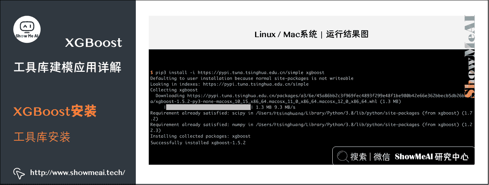

### (2) Windows 系统

对于 windows 系统而言，比较高效便捷的安装方式是：在网址[`www.lfd.uci.edu/~gohlke/pythonlibs/`](http://www.lfd.uci.edu/~gohlke/pythonlibs/) 中去下载对应版本的的 XGBoost 安装包，再通过如下命令安装。

```
pip install xgboost‑1.5.1‑cp310‑cp310‑win32.whl 
```

# 2.XGBoost 数据读取

应用 XGBoost 的第一步，需要加载所需的数据成为工具库所能支持的格式形态。XGBoost 可以加载多种数据格式的数据用于训练建模：

*   libsvm 格式的文本数据。
*   Numpy 的二维数组。
*   XGBoost 的二进制的缓存文件。加载的数据存储在对象 DMatrix 中。

XGBoost 的 SKLearn 接口也支持对于 Dataframe 格式的数据(参考[ShowMeAI](http://www.showmeai.tech/)的文章 [**Python 数据分析|Pandas 核心操作函数大全**](http://www.showmeai.tech/article-detail/146) 进行更多了解)进行处理。

下面是不同格式的数据，XGBoost 的加载方式。

*   加载 libsvm 格式的数据

```
dtrain1 = xgb.DMatrix('train.svm.txt') 
```

*   加载二进制的缓存文件

```
dtrain2 = xgb.DMatrix('train.svm.buffer') 
```

*   加载 numpy 的数组

```
data = np.random.rand(5,10) # 5 entities, each contains 10 features
label = np.random.randint(2, size=5) # binary target
dtrain = xgb.DMatrix( data, label=label) 
```

*   将 scipy.sparse 格式的数据转化为 DMatrix 格式

```
csr = scipy.sparse.csr_matrix( (dat, (row,col)) )
dtrain = xgb.DMatrix( csr ) 
```

*   将 DMatrix 格式的数据保存成 XGBoost 的二进制格式，在下次加载时可以提高加载速度，使用方式如下

```
dtrain = xgb.DMatrix('train.svm.txt')
dtrain.save_binary("train.buffer") 
```

*   可以用如下方式处理 DMatrix 中的缺失值

```
dtrain = xgb.DMatrix( data, label=label, missing = -999.0) 
```

*   当需要给样本设置权重时，可以用如下方式

```
w = np.random.rand(5,1)
dtrain = xgb.DMatrix( data, label=label, missing = -999.0, weight=w) 
```

# 3.XGBoost 不同建模方式

## 3.1 内置建模方式：libsvm 格式数据源

XGBoost 内置了建模方式，有如下的数据格式与核心训练方法：

*   基于`DMatrix`格式的数据。
*   基于`xgb.train`接口训练。

下面是官方的一个简单示例，演示了读取 libsvm 格式数据(成`DMatrix`格式)并指定参数建模的过程。

```
# 导入工具库
import numpy as np
import scipy.sparse
import pickle
import xgboost as xgb

# 从 libsvm 文件中读取数据，做二分类
# 数据是 libsvm 的格式，如下样本格式
#1 3:1 10:1 11:1 21:1 30:1 34:1 36:1 40:1 41:1 53:1 58:1 65:1 69:1 77:1 86:1 88:1 92:1 95:1 102:1 105:1 117:1 124:1
#0 3:1 10:1 20:1 21:1 23:1 34:1 36:1 39:1 41:1 53:1 56:1 65:1 69:1 77:1 86:1 88:1 92:1 95:1 102:1 106:1 116:1 120:1
#0 1:1 10:1 19:1 21:1 24:1 34:1 36:1 39:1 42:1 53:1 56:1 65:1 69:1 77:1 86:1 88:1 92:1 95:1 102:1 106:1 116:1 122:1
dtrain = xgb.DMatrix('./data/agaricus.txt.train')
dtest = xgb.DMatrix('./data/agaricus.txt.test')

# 超参数设定
# 主要是树深、学习率、目标函数
param = {'max_depth':2, 'eta':1, 'silent':1, 'objective':'binary:logistic' }

# 设定 watchlist 用于建模过程中观测模型状态
watchlist  = [(dtest,'eval'), (dtrain,'train')]
num_round = 2
bst = xgb.train(param, dtrain, num_round, watchlist)

# 使用模型预测
preds = bst.predict(dtest)

# 判断准确率
labels = dtest.get_label()
print('错误率为%f' % \
       (sum(1 for i in range(len(preds)) if int(preds[i]>0.5)!=labels[i]) /float(len(preds))))

# 模型存储
bst.save_model('./model/0001.model') 
```

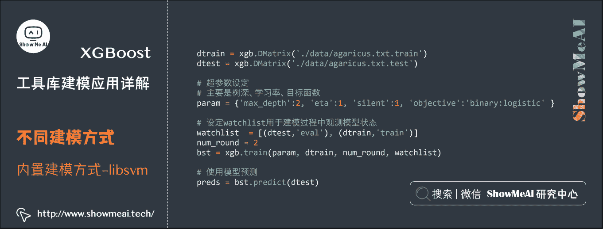

```
[0]  eval-error:0.042831  train-error:0.046522
[1]  eval-error:0.021726  train-error:0.022263
错误率为 0.021726 
```

## 3.2 内置建模方式：csv 格式数据源

下面的例子，输入的数据源是 csv 文件，我们使用大家熟悉的 pandas 工具库(参考[ShowMeAI](http://www.showmeai.tech/)教程 [**数据分析系列教程**](http://www.showmeai.tech/tutorials/33) 与 [**数据科学工具速查 | Pandas 使用指南**](http://www.showmeai.tech/article-detail/101))把数据读取为 Dataframe 格式，再构建 Dmatrix 格式输入，后续使用内置建模方式进行训练。

```
# 皮马印第安人糖尿病数据集 包含很多字段：怀孕次数 口服葡萄糖耐量试验中血浆葡萄糖浓度 舒张压(mm Hg) 三头肌组织褶厚度(mm) 
# 2 小时血清胰岛素(μU/ ml) 体重指数(kg/(身高(m)²) 糖尿病系统功能 年龄(岁)
import pandas as pd
data = pd.read_csv('./data/Pima-Indians-Diabetes.csv')
data.head() 
```

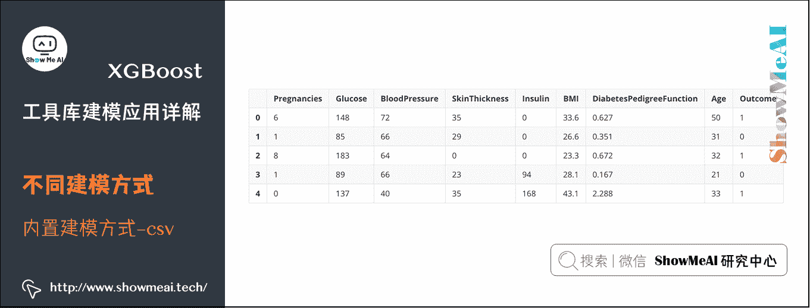

```
# 导入工具库
import numpy as np
import pandas as pd
import pickle
import xgboost as xgb
from sklearn.model_selection import train_test_split

# 用 pandas 读入数据
data = pd.read_csv('./data/Pima-Indians-Diabetes.csv')

# 做数据切分
train, test = train_test_split(data)

# 转换成 Dmatrix 格式
feature_columns = ['Pregnancies', 'Glucose', 'BloodPressure', 'SkinThickness', 'Insulin', 'BMI', 'DiabetesPedigreeFunction', 'Age']
target_column = 'Outcome'

# 取出 Dataframe 的 numpy 数组值去初始化 DMatrix 对象
xgtrain = xgb.DMatrix(train[feature_columns].values, train[target_column].values)
xgtest = xgb.DMatrix(test[feature_columns].values, test[target_column].values)

#参数设定
param = {'max_depth':5, 'eta':0.1, 'silent':1, 'subsample':0.7, 'colsample_bytree':0.7, 'objective':'binary:logistic' }

# 设定 watchlist 用于查看模型状态
watchlist  = [(xgtest,'eval'), (xgtrain,'train')]
num_round = 10
bst = xgb.train(param, xgtrain, num_round, watchlist)

# 使用模型预测
preds = bst.predict(xgtest)

# 判断准确率
labels = xgtest.get_label()
print('错误类为%f' % \
       (sum(1 for i in range(len(preds)) if int(preds[i]>0.5)!=labels[i]) /float(len(preds))))

# 模型存储
bst.save_model('./model/0002.model') 
```

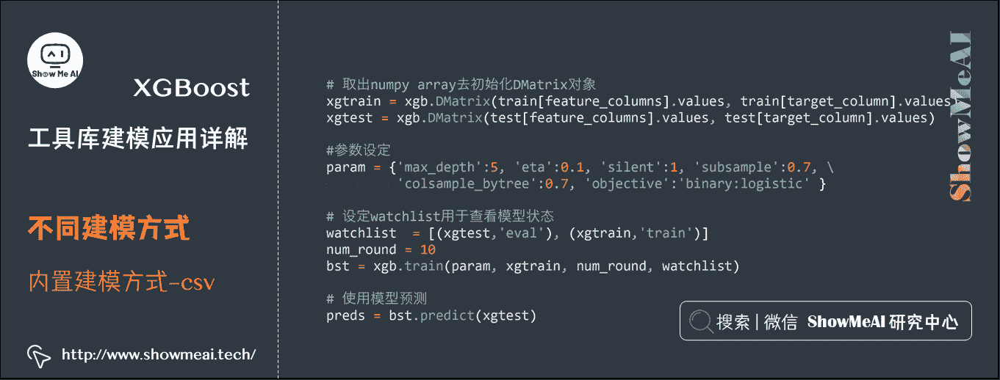

```
[0]  eval-error:0.354167  train-error:0.194444
[1]  eval-error:0.34375   train-error:0.170139
[2]  eval-error:0.322917  train-error:0.170139
[3]  eval-error:0.28125   train-error:0.161458
[4]  eval-error:0.302083  train-error:0.147569
[5]  eval-error:0.286458  train-error:0.138889
[6]  eval-error:0.296875  train-error:0.142361
[7]  eval-error:0.291667  train-error:0.144097
[8]  eval-error:0.302083  train-error:0.130208
[9]  eval-error:0.291667  train-error:0.130208
错误类为 0.291667 
```

## 3.3 预估器建模方式：SKLearn 接口+Dataframe

XGBoost 也支持用 SKLearn 中统一的预估器形态接口进行建模，如下为典型的参考案例，对于读取为 Dataframe 格式的训练集和测试集，可以直接使用 XGBoost 初始化 XGBClassifier 进行 fit 拟合训练。使用方法与接口，和 SKLearn 中其他预估器一致。

```
# 导入工具库
import numpy as np
import pandas as pd
import pickle
import xgboost as xgb
from sklearn.model_selection import train_test_split

# 用 pandas 读入数据
data = pd.read_csv('./data/Pima-Indians-Diabetes.csv')

# 做数据切分
train, test = train_test_split(data)

# 特征列
feature_columns = ['Pregnancies', 'Glucose', 'BloodPressure', 'SkinThickness', 'Insulin', 'BMI', 'DiabetesPedigreeFunction', 'Age']
# 标签列
target_column = 'Outcome'

# 初始化模型
xgb_classifier = xgb.XGBClassifier(n_estimators=20,\
                                   max_depth=4, \
                                   learning_rate=0.1, \
                                   subsample=0.7, \
                                   colsample_bytree=0.7, \
                                   eval_metric='error')

# Dataframe 格式数据拟合模型
xgb_classifier.fit(train[feature_columns], train[target_column])

# 使用模型预测
preds = xgb_classifier.predict(test[feature_columns])

# 判断准确率
print('错误类为%f' %((preds!=test[target_column]).sum()/float(test_y.shape[0])))

# 模型存储
joblib.dump(xgb_classifier, './model/0003.model') 
```

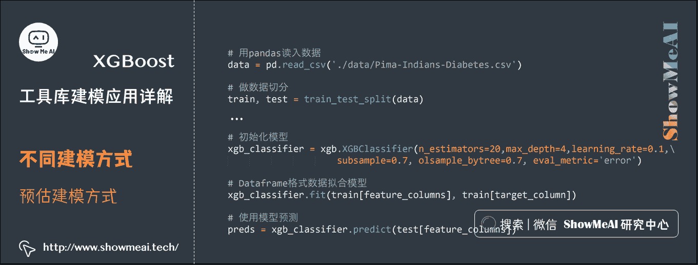

```
错误类为 0.265625

['./model/0003.model'] 
```

# 4.模型调参与高级功能

## 4.1 XGBoost 参数详解

在运行 XGBoost 之前，必须设置三种类型成熟：general parameters，booster parameters 和 task parameters：

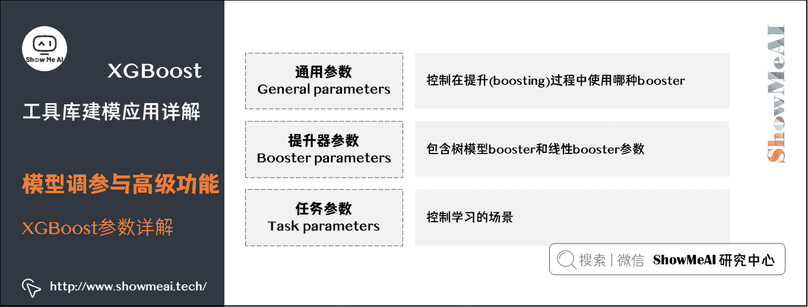

*   **通用参数**：General parameters

    *   该参数控制在提升(boosting)过程中使用哪种 booster，常用的 booster 有树模型(tree)和线性模型(linear model)。
*   **提升器参数**：Booster parameters

    *   这取决于使用哪种 booster，包含树模型 booster 和线性 booster 参数。
*   **任务参数**：Task parameters

    *   控制学习的场景，例如在回归问题中会使用不同的参数控制排序。

### (1) 通用参数


*   **booster [default=gbtree]**

有两种模型可以选择 gbtree 和 gblinear。gbtree 使用基于树的模型进行提升计算，gblinear 使用线性模型进行提升计算。缺省值为 gbtree

*   **silent [default=0]**

取 0 时表示打印出运行时信息，取 1 时表示以缄默方式运行，不打印运行时信息。缺省值为 0

*   **nthread**

XGBoost 运行时的线程数。缺省值是当前系统可以获得的最大线程数

*   **num_pbuffer**

预测缓冲区大小，通常设置为训练实例的数目。缓冲用于保存最后一步提升的预测结果，无需人为设置。

*   **num_feature**

Boosting 过程中用到的特征维数，设置为特征个数。XGBoost 会自动设置，无需人为设置。

### (2) 树模型 booster 参数


*   **eta [default=0.3]**

为了防止过拟合，更新过程中用到的收缩步长。在每次提升计算之后，算法会直接获得新特征的权重。 eta 通过缩减特征的权重使提升计算过程更加保守。缺省值为 0.3 取值范围为：[0,1]

*   **gamma [default=0]**

树要进一步分裂生长所需的最小 loss 减小值. the larger, the more conservative the algorithm will be. 取值范围为：[0,∞]

*   **max_depth [default=6]**

数的最大深度。缺省值为 6 取值范围为：[1,∞]

*   **min_child_weight [default=1]**

孩子节点中最小的样本权重和。如果一个叶子节点的样本权重和小于 min_child_weight 则拆分过程结束。在现行回归模型中，这个参数是指建立每个模型所需要的最小样本数。该成熟越大算法越 conservative 取值范围为：[0,∞]

*   **max_delta_step [default=0]**

我们允许每个树的权重被估计的值。如果它的值被设置为 0，意味着没有约束；如果它被设置为一个正值，它能够使得更新的步骤更加保守。通常这个参数是没有必要的，但是如果在逻辑回归中类极其不平衡这时候他有可能会起到帮助作用。把它范围设置为 1-10 之间也许能控制更新。 取值范围为：[0,∞]

*   **subsample [default=1]**

用于训练模型的子样本占整个样本集合的比例。如果设置为 0.5 则意味着 XGBoost 将随机的从整个样本集合中随机的抽取出 50%的子样本建立树模型，这能够防止过拟合。 取值范围为：(0,1]

*   **colsample_bytree [default=1]**

在建立树时对特征采样的比例。缺省值为 1 取值范围为：(0,1]

### (3) 线性 Booster 参数


*   **lambda [default=0]**

L2 正则的惩罚系数

*   **alpha [default=0]**

L1 正则的惩罚系数

*   **lambda_bias**

在偏置上的 L2 正则。缺省值为 0(在 L1 上没有偏置项的正则，因为 L1 时偏置不重要)

### (4) 任务参数


*   **objective [ default=reg:linear ]**

    *   定义学习任务及相应的学习目标
    *   可选的目标函数如下：
        *   `reg:linear` ： 线性回归。
        *   `reg:logistic`： 逻辑回归。
        *   `binary:logistic`： 二分类的逻辑回归问题，输出为概率。
        *   `binary:logitraw`： 二分类的逻辑回归问题，输出的结果为 wTx。
        *   `count:poisson`： 计数问题的 poisson 回归，输出结果为 poisson 分布。在 poisson 回归中，max_delta_step 的缺省值为 0.7。(used to safeguard optimization)。
        *   `multi:softmax` ：让 XGBoost 采用 softmax 目标函数处理多分类问题，同时需要设置参数 num_class(类别个数)。
        *   `multi:softprob`：和 softmax 一样，但是输出的是 ndata * nclass 的向量，可以将该向量 reshape 成 ndata 行 nclass 列的矩阵。没行数据表示样本所属于每个类别的概率。
        *   `rank:pairwise`：set XGBoost to do ranking task by minimizing the pairwise loss。
*   **base_score [ default=0.5 ]**

    *   所有实例的初始化预测分数，全局偏置；
    *   为了足够的迭代次数，改变这个值将不会有太大的影响。
*   **eval_metric [ default according to objective ]**

    *   校验数据所需要的评价指标，不同的目标函数将会有缺省的评价指标(rmse for regression, and error for classification, mean average precision for ranking)
    *   用户可以添加多种评价指标，对于 Python 用户要以 list 传递参数对给程序，而不是 map 参数 list 参数不会覆盖`eval_metric’
    *   可供的选择如下:
        *   `rmse`：root mean square error
        *   `logloss`：negative log-likelihood
        *   `error`：Binary classification error rate. It is calculated as #(wrong cases)/#(all cases). For the predictions, the evaluation will regard the instances with prediction value larger than 0.5 as positive instances, and the others as negative instances.
        *   `merror`：Multiclass classification error rate. It is calculated as #(wrongcases)#(allcases).
        *   `mlogloss`：Multiclass logloss
        *   `auc`：Area under the curve for ranking evaluation.
        *   `ndcg`：Normalized Discounted Cumulative Gain
        *   `map`：Mean average precision
        *   `ndcg@n`,`map@n`：n can be assigned as an integer to cut off the top positions in the lists for evaluation.
        *   `ndcg-`,`map-`,`ndcg@n-`,`map@n-`：In XGBoost, NDCG and MAP will evaluate the score of a list without any positive samples as 1\. By adding `-` in the evaluation metric XGBoost will evaluate these score as 0 to be consistent under some conditions. training repeatively
*   **seed [ default=0 ]**

    *   随机数的种子。缺省值为 0

## 4.2 内置调参优化

### (1) 交叉验证

XGBoost 自带实验与调参的一些方法，如下为交叉验证方法`xgb.cv`。

```
xgb.cv(param, dtrain, num_round, nfold=5,metrics={'error'}, seed = 0) 
```

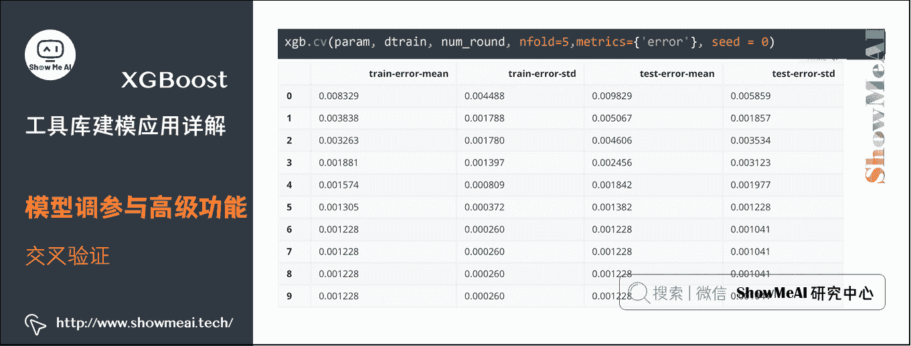

### (2) 添加预处理

我们可以把数据建模过程中的一些设置加到交叉验证环节里，比如对于不同类别的样本加权，可以参考下列代码示例

```
# 计算正负样本比，调整样本权重
def fpreproc(dtrain, dtest, param):
    label = dtrain.get_label()
    ratio = float(np.sum(label == 0)) / np.sum(label==1)
    param['scale_pos_weight'] = ratio
    return (dtrain, dtest, param)

# 先做预处理，计算样本权重，再做交叉验证
xgb.cv(param, dtrain, num_round, nfold=5,
       metrics={'auc'}, seed = 0, fpreproc = fpreproc) 
```

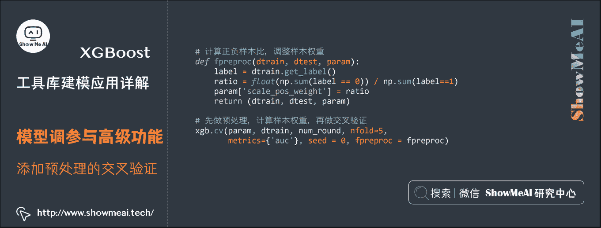

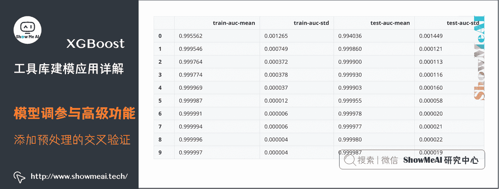

### (3) 自定义损失函数与评估准则

XGBoost 支持在训练过程中，自定义损失函数和评估准则，其中损失函数的定义需要返回损失函数一阶和二阶导数的计算方法，评估准则部分需要对数据的 label 和预估值进行计算。其中损失函数用于训练过程中的树结构学习，而评估准则很多时候是用在验证集上进行效果评估。

```
print('使用自定义损失函数进行交叉验证')
# 自定义损失函数，需要提供损失函数的一阶导和二阶导
def logregobj(preds, dtrain):
    labels = dtrain.get_label()
    preds = 1.0 / (1.0 + np.exp(-preds))
    grad = preds - labels
    hess = preds * (1.0-preds)
    return grad, hess

# 自定义评估准则，评估预估值和标准答案之间的差距
def evalerror(preds, dtrain):
    labels = dtrain.get_label()
    return 'error', float(sum(labels != (preds > 0.0))) / len(labels)

watchlist  = [(dtest,'eval'), (dtrain,'train')]
param = {'max_depth':3, 'eta':0.1, 'silent':1}
num_round = 5
# 自定义损失函数训练
bst = xgb.train(param, dtrain, num_round, watchlist, logregobj, evalerror)
# 交叉验证
xgb.cv(param, dtrain, num_round, nfold = 5, seed = 0, obj = logregobj, feval=evalerror) 
```

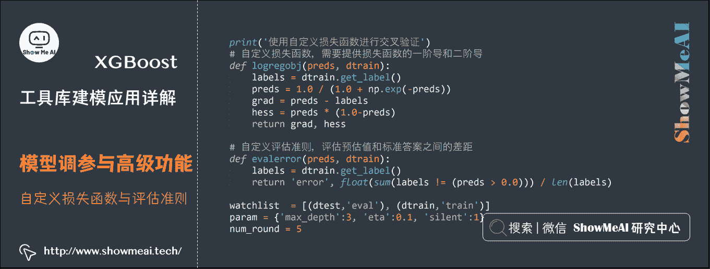

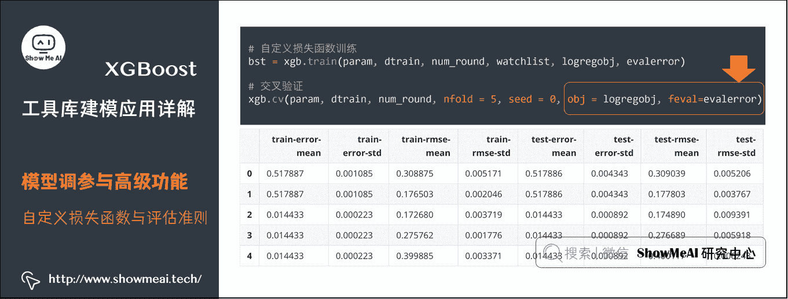

```
使用自定义损失函数进行交叉验证
[0]  eval-rmse:0.306901   train-rmse:0.306164  eval-error:0.518312  train-error:0.517887
[1]  eval-rmse:0.179189   train-rmse:0.177278  eval-error:0.518312  train-error:0.517887
[2]  eval-rmse:0.172565   train-rmse:0.171728  eval-error:0.016139  train-error:0.014433
[3]  eval-rmse:0.269612   train-rmse:0.27111   eval-error:0.016139  train-error:0.014433
[4]  eval-rmse:0.396903   train-rmse:0.398256  eval-error:0.016139  train-error:0.014433 
```

### (4) 只用前 n 颗树预测

对于 boosting 模型来说，最后会训练得到很多基学习器(在 XGBoost 中很多时候是很多棵树)，我们可以一次完整训练，只用前 n 棵树的集成来完成预测。

```
#!/usr/bin/python
import numpy as np
import pandas as pd
import pickle
import xgboost as xgb
from sklearn.model_selection import train_test_split

# 基本例子，从 csv 文件中读取数据，做二分类

# 用 pandas 读入数据
data = pd.read_csv('./data/Pima-Indians-Diabetes.csv')

# 做数据切分
train, test = train_test_split(data)

# 转换成 Dmatrix 格式
feature_columns = ['Pregnancies', 'Glucose', 'BloodPressure', 'SkinThickness', 'Insulin', 'BMI', 'DiabetesPedigreeFunction', 'Age']
target_column = 'Outcome'
xgtrain = xgb.DMatrix(train[feature_columns].values, train[target_column].values)
xgtest = xgb.DMatrix(test[feature_columns].values, test[target_column].values)

#参数设定
param = {'max_depth':5, 'eta':0.1, 'silent':1, 'subsample':0.7, 'colsample_bytree':0.7, 'objective':'binary:logistic' }

# 设定 watchlist 用于查看模型状态
watchlist  = [(xgtest,'eval'), (xgtrain,'train')]
num_round = 10
bst = xgb.train(param, xgtrain, num_round, watchlist)

# 只用第 1 颗树预测
ypred1 = bst.predict(xgtest, ntree_limit=1)
# 用前 9 颗树预测
ypred2 = bst.predict(xgtest, ntree_limit=9)
label = xgtest.get_label()
print('用前 1 颗树预测的错误率为 %f' % (np.sum((ypred1>0.5)!=label) /float(len(label))))
print('用前 9 颗树预测的错误率为 %f' % (np.sum((ypred2>0.5)!=label) /float(len(label)))) 
```

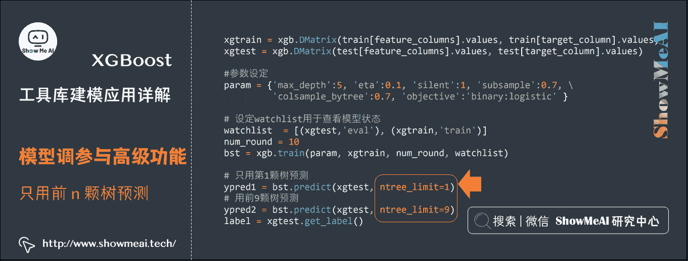

```
[0]  eval-error:0.255208  train-error:0.196181
[1]  eval-error:0.234375  train-error:0.175347
[2]  eval-error:0.25   train-error:0.163194
[3]  eval-error:0.229167  train-error:0.149306
[4]  eval-error:0.213542  train-error:0.154514
[5]  eval-error:0.21875   train-error:0.152778
[6]  eval-error:0.21875   train-error:0.154514
[7]  eval-error:0.213542  train-error:0.138889
[8]  eval-error:0.1875 train-error:0.147569
[9]  eval-error:0.1875 train-error:0.144097
用前 1 颗树预测的错误率为 0.255208
用前 9 颗树预测的错误率为 0.187500 
```

## 4.3 预估器调参优化

### (1) SKLearn 形态接口实验评估

XGBoost 有 SKLearn 预估器形态的接口，整体使用方法和 SKLearn 中其他预估器一致，如下是手动对数据做交叉验证，注意到这里直接使用`XGBClassifier`对 Dataframe 数据进行 fit 拟合和评估。

```
import pickle
import xgboost as xgb

import numpy as np
from sklearn.model_selection import KFold, train_test_split, GridSearchCV
from sklearn.metrics import confusion_matrix, mean_squared_error
from sklearn.datasets import load_iris, load_digits, load_boston

rng = np.random.RandomState(31337)

# 二分类：混淆矩阵
print("数字 0 和 1 的二分类问题")
digits = load_digits(2)
y = digits['target']
X = digits['data']
# 数据切分对象
kf = KFold(n_splits=2, shuffle=True, random_state=rng)
print("在 2 折数据上的交叉验证")
# 2 折交叉验证
for train_index, test_index in kf.split(X):
    xgb_model = xgb.XGBClassifier().fit(X[train_index],y[train_index])
    predictions = xgb_model.predict(X[test_index])
    actuals = y[test_index]
    print("混淆矩阵:")
    print(confusion_matrix(actuals, predictions))

#多分类：混淆矩阵
print("\nIris: 多分类")
iris = load_iris()
y = iris['target']
X = iris['data']
kf = KFold(n_splits=2, shuffle=True, random_state=rng)
print("在 2 折数据上的交叉验证")
for train_index, test_index in kf.split(X):
    xgb_model = xgb.XGBClassifier().fit(X[train_index],y[train_index])
    predictions = xgb_model.predict(X[test_index])
    actuals = y[test_index]
    print("混淆矩阵:")
    print(confusion_matrix(actuals, predictions))

#回归问题：MSE
print("\n 波士顿房价回归预测问题")
boston = load_boston()
y = boston['target']
X = boston['data']
kf = KFold(n_splits=2, shuffle=True, random_state=rng)
print("在 2 折数据上的交叉验证")
for train_index, test_index in kf.split(X):
    xgb_model = xgb.XGBRegressor().fit(X[train_index],y[train_index])
    predictions = xgb_model.predict(X[test_index])
    actuals = y[test_index]
    print("MSE:",mean_squared_error(actuals, predictions)) 
```

```
数字 0 和 1 的二分类问题
在 2 折数据上的交叉验证
混淆矩阵:
[[87  0]
 [ 1 92]]
混淆矩阵:
[[91  0]
 [ 3 86]]

Iris: 多分类
在 2 折数据上的交叉验证
混淆矩阵:
[[19  0  0]
 [ 0 31  3]
 [ 0  1 21]]
混淆矩阵:
[[31  0  0]
 [ 0 16  0]
 [ 0  3 25]]

波士顿房价回归预测问题
在 2 折数据上的交叉验证
MSE: 9.860776812557337
MSE: 15.942418468446029 
```

### (2) 网格搜索调参

上面提到 XGBoost 的预估器接口，整体使用方法和 SKLearn 中其他预估器一致，所以我们也可以使用 SKLearn 中的超参数调优方法来进行模型调优。

如下是一个典型的网格搜索交法调优超参数的代码示例，我们会给出候选参数列表字典，通过`GridSearchCV`进行交叉验证实验评估，选出 XGBoost 在候选参数中最优的超参数。
print(“参数最优化：”)

```
y = boston['target']
X = boston['data']
xgb_model = xgb.XGBRegressor()
clf = GridSearchCV(xgb_model,
                   {'max_depth': [2,4,6],
                    'n_estimators': [50,100,200]}, verbose=1)
clf.fit(X,y)
print(clf.best_score_)
print(clf.best_params_) 
```

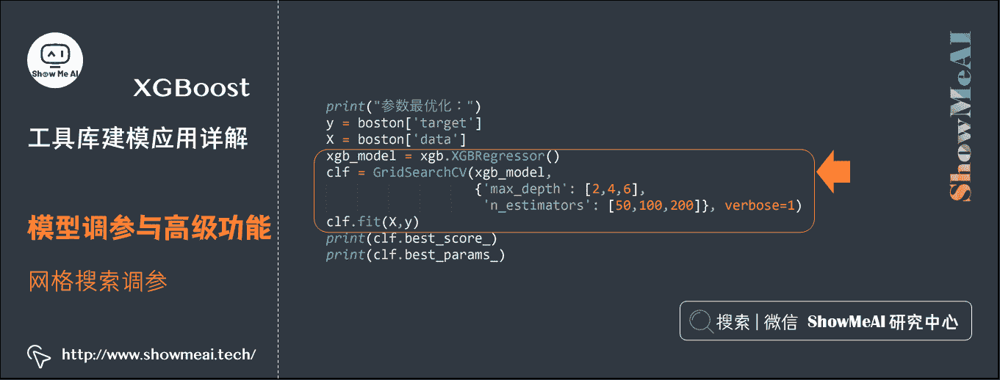

```
参数最优化：
Fitting 3 folds for each of 9 candidates, totalling 27 fits

[Parallel(n_jobs=1)]: Using backend SequentialBackend with 1 concurrent workers.

0.6001029721598573
{'max_depth': 4, 'n_estimators': 100}

[Parallel(n_jobs=1)]: Done  27 out of  27 | elapsed:    1.3s finished 
```

### (3) early-stopping 早停

XGBoost 模型有时候会因为不停叠加新的树(修正训练集上拟合尚不正确的一些样本)，可能会因为对于训练集过度学习而导致模型过拟合。early stopping 早停止是一个有效的策略，具体的做法是，在训练集不断追加树学习的过程中，对验证集上的表现进行监控，如果出现一定轮次评估准则都没有优化提升的情况，则回溯到历史上验证集最好的点，保存为最佳模型。

下面是对应的代码示例，其中参数`early_stopping_rounds`设定了验证集上能接受的效果不提升的最多轮次数，`eval_set`指定了验证数据集。

```
# 在训练集上学习模型，一颗一颗树添加，在验证集上看效果，当验证集效果不再提升，停止树的添加与生长
X = digits['data']
y = digits['target']
X_train, X_val, y_train, y_val = train_test_split(X, y, random_state=0)
clf = xgb.XGBClassifier()
clf.fit(X_train, y_train, early_stopping_rounds=10, eval_metric="auc",
        eval_set=[(X_val, y_val)]) 
```

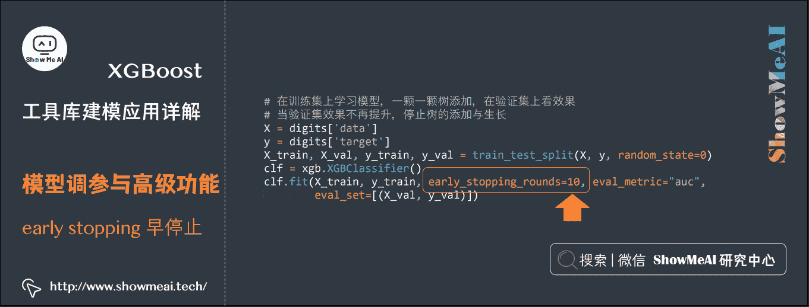

```
[0]  validation_0-auc:0.999497
Will train until validation_0-auc hasn't improved in 10 rounds.
[1]  validation_0-auc:0.999497
[2]  validation_0-auc:0.999497
[3]  validation_0-auc:0.999749
[4]  validation_0-auc:0.999749
[5]  validation_0-auc:0.999749
[6]  validation_0-auc:0.999749
[7]  validation_0-auc:0.999749
[8]  validation_0-auc:0.999749
[9]  validation_0-auc:0.999749
[10] validation_0-auc:1
[11] validation_0-auc:1
[12] validation_0-auc:1
[13] validation_0-auc:1
[14] validation_0-auc:1
[15] validation_0-auc:1
[16] validation_0-auc:1
[17] validation_0-auc:1
[18] validation_0-auc:1
[19] validation_0-auc:1
[20] validation_0-auc:1
Stopping. Best iteration:
[10] validation_0-auc:1

XGBClassifier(base_score=0.5, booster='gbtree', colsample_bylevel=1,
       colsample_bytree=1, gamma=0, learning_rate=0.1, max_delta_step=0,
       max_depth=3, min_child_weight=1, missing=None, n_estimators=100,
       n_jobs=1, nthread=None, objective='binary:logistic', random_state=0,
       reg_alpha=0, reg_lambda=1, scale_pos_weight=1, seed=None,
       silent=True, subsample=1) 
```

### (4) 特征重要度

XGBoost 建模过程中，还可以学习到对应的特征重要度信息，并保存在模型的`feature_importances_`属性中。如下为绘制特征重要度的可视化代码：

```
iris = load_iris()
y = iris['target']
X = iris['data']
xgb_model = xgb.XGBClassifier().fit(X,y)

print('特征排序：')
feature_names=['sepal_length', 'sepal_width', 'petal_length', 'petal_width']
feature_importances = xgb_model.feature_importances_
indices = np.argsort(feature_importances)[::-1]

for index in indices:
    print("特征 %s 重要度为 %f" %(feature_names[index], feature_importances[index]))

%matplotlib inline
import matplotlib.pyplot as plt
plt.figure(figsize=(16,8))
plt.title("feature importances")
plt.bar(range(len(feature_importances)), feature_importances[indices], color='b')
plt.xticks(range(len(feature_importances)), np.array(feature_names)[indices], color='b') 
```

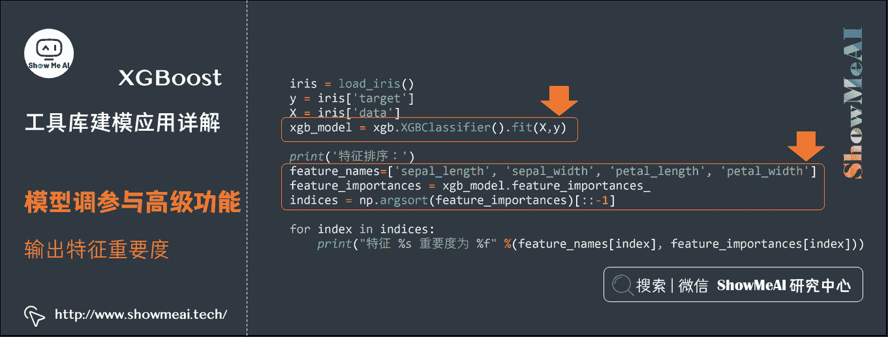

```
特征排序：
特征 petal_length 重要度为 0.415567
特征 petal_width 重要度为 0.291557
特征 sepal_length 重要度为 0.179420
特征 sepal_width 重要度为 0.113456 
```

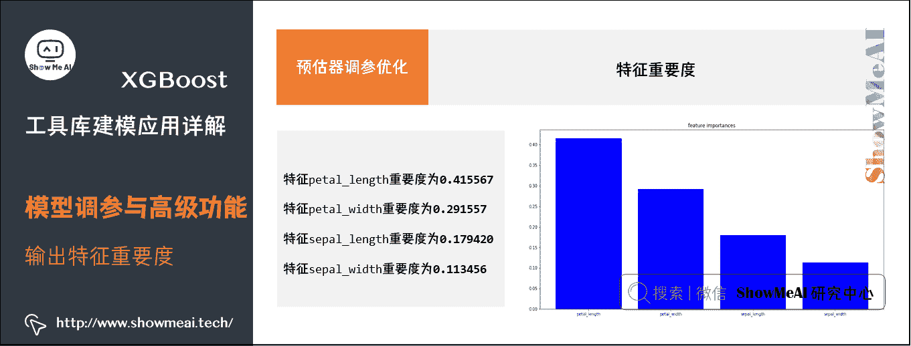

### (5) 并行训练加速

在多资源的情况下，XGBoost 可以实现并行训练加速，示例代码如下：

```
import os

if __name__ == "__main__":
    try:
        from multiprocessing import set_start_method
    except ImportError:
        raise ImportError("Unable to import multiprocessing.set_start_method."
                          " This example only runs on Python 3.4")
    #set_start_method("forkserver")

    import numpy as np
    from sklearn.model_selection import GridSearchCV
    from sklearn.datasets import load_boston
    import xgboost as xgb

    rng = np.random.RandomState(31337)

    print("Parallel Parameter optimization")
    boston = load_boston()

    os.environ["OMP_NUM_THREADS"] = "2"  # or to whatever you want
    y = boston['target']
    X = boston['data']
    xgb_model = xgb.XGBRegressor()
    clf = GridSearchCV(xgb_model, {'max_depth': [2, 4, 6],
                                   'n_estimators': [50, 100, 200]}, verbose=1,
                       n_jobs=2)
    clf.fit(X, y)
    print(clf.best_score_)
    print(clf.best_params_) 
```

```
Parallel Parameter optimization
Fitting 3 folds for each of 9 candidates, totalling 27 fits

[Parallel(n_jobs=2)]: Using backend LokyBackend with 2 concurrent workers.
[Parallel(n_jobs=2)]: Done  24 out of  27 | elapsed:    2.2s remaining:    0.3s

0.6001029721598573
{'max_depth': 4, 'n_estimators': 100}

[Parallel(n_jobs=2)]: Done  27 out of  27 | elapsed:    2.4s finished 
```

## 参考资料

*   [图解机器学习算法 | 从入门到精通系列](http://www.showmeai.tech/tutorials/34)
*   [图解 python | 安装与环境设置](http://www.showmeai.tech/article-detail/65)
*   [Python 数据分析|Pandas 核心操作函数大全](http://www.showmeai.tech/article-detail/146)
*   [图解机器学习|XGBoost 模型详解](http://www.showmeai.tech/article-detail/194)

# [ShowMeAI](http://www.showmeai.tech/)系列教程推荐

*   [图解 Python 编程：从入门到精通系列教程](http://www.showmeai.tech/tutorials/56)
*   [图解数据分析：从入门到精通系列教程](http://www.showmeai.tech/tutorials/33)
*   [图解 AI 数学基础：从入门到精通系列教程](http://www.showmeai.tech/tutorials/83)
*   [图解大数据技术：从入门到精通系列教程](http://www.showmeai.tech/tutorials/84)
*   [图解机器学习算法：从入门到精通系列教程](http://www.showmeai.tech/tutorials/34)
*   [机器学习实战：手把手教你玩转机器学习系列](http://www.showmeai.tech/tutorials/41)

# 相关文章推荐

*   [Python 机器学习算法应用实践](http://www.showmeai.tech/article-detail/201)
*   [SKLearn 入门与简单应用案例](http://www.showmeai.tech/article-detail/202)
*   [SKLearn 最全应用指南](http://www.showmeai.tech/article-detail/203)
*   [XGBoost 建模应用详解](http://www.showmeai.tech/article-detail/204)
*   [LightGBM 建模应用详解](http://www.showmeai.tech/article-detail/205)
*   [Python 机器学习综合项目-电商销量预估](http://www.showmeai.tech/article-detail/206)
*   [Python 机器学习综合项目-电商销量预估<进阶方案>](http://www.showmeai.tech/article-detail/207)
*   [机器学习特征工程最全解读](http://www.showmeai.tech/article-detail/208)
*   [自动化特征工程工具 Featuretools 应用](http://www.showmeai.tech/article-detail/209)
*   [AutoML 自动化机器学习建模](http://www.showmeai.tech/article-detail/210)

