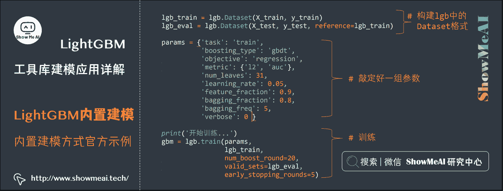
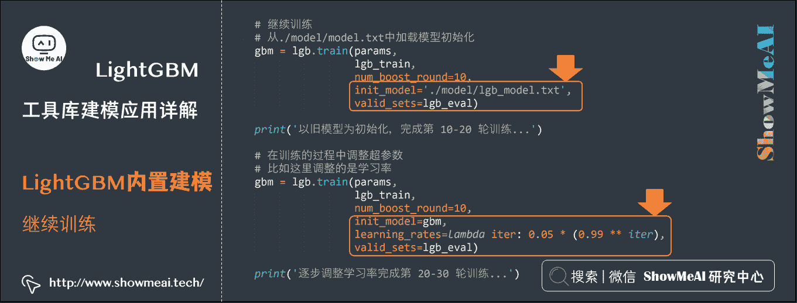
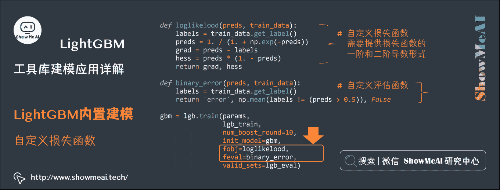
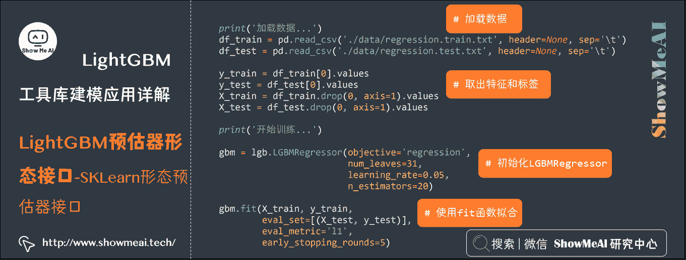
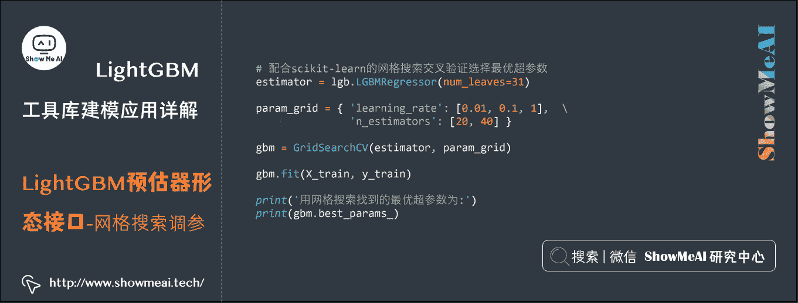
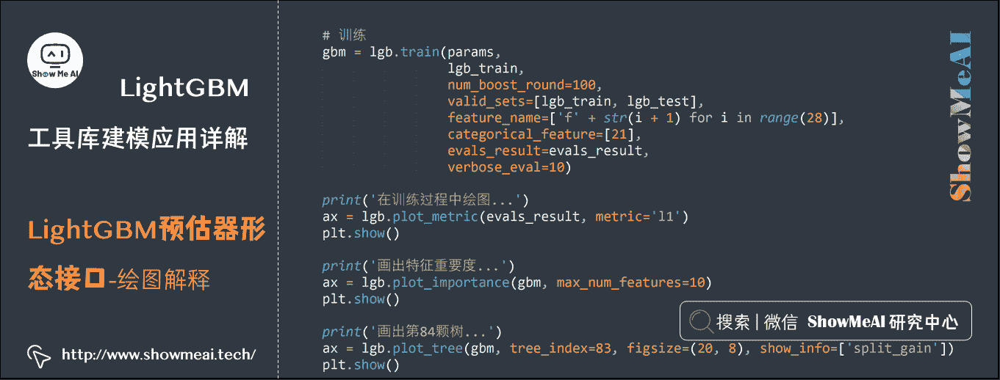
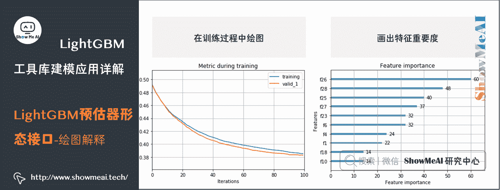
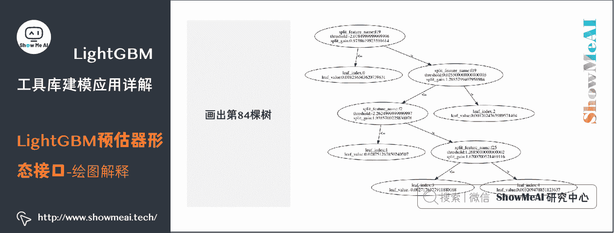

# 机器学习实战 | LightGBM 建模应用详解

> 原文：[`blog.csdn.net/ShowMeAI/article/details/123649431`](https://blog.csdn.net/ShowMeAI/article/details/123649431)


作者：[韩信子](https://github.com/HanXinzi-AI)@[ShowMeAI](http://www.showmeai.tech/)
[教程地址](http://www.showmeai.tech/tutorials/41)：[`www.showmeai.tech/tutorials/41`](http://www.showmeai.tech/tutorials/41)
[本文地址](http://www.showmeai.tech/article-detail/205)：[`www.showmeai.tech/article-detail/205`](http://www.showmeai.tech/article-detail/205)
声明：版权所有，转载请联系平台与作者并注明出处
**收藏[ShowMeAI](http://www.showmeai.tech/)查看更多精彩内容**

* * *

# 引言

LightGBM 是微软开发的 boosting 集成模型，和 XGBoost 一样是对 GBDT 的优化和高效实现，原理有一些相似之处，但它很多方面比 XGBoost 有着更为优秀的表现。

本篇内容[ShowMeAI](http://www.showmeai.tech/)展开给大家讲解 LightGBM 的工程应用方法，对于 LightGBM 原理知识感兴趣的同学，欢迎参考[ShowMeAI](http://www.showmeai.tech/)的另外一篇文章 [**图解机器学习 | LightGBM 模型详解**](http://www.showmeai.tech/article-detail/195)。

# 1.LightGBM 安装

LightGBM 作为常见的强大 Python 机器学习工具库，安装也比较简单。

## 1.1 Python 与 IDE 环境设置

python 环境与 IDE 设置可以参考[ShowMeAI](http://www.showmeai.tech/)文章 [**图解 python | 安装与环境设置**](http://www.showmeai.tech/article-detail/65) 进行设置。


## 1.2 工具库安装

### (1) Linux/Mac 等系统

这些系统下的 XGBoost 安装，大家只要基于 pip 就可以轻松完成了，在命令行端输入命令如下命令即可等待安装完成。

```
pip install lightgbm 
```

大家也可以选择国内的 pip 源，以获得更好的安装速度：

```
pip install -i https://pypi.tuna.tsinghua.edu.cn/simple lightgbm 
```

### (2) Windows 系统

对于 windows 系统而言，比较高效便捷的安装方式是：在网址[`www.lfd.uci.edu/~gohlke/pythonlibs/`](http://www.lfd.uci.edu/~gohlke/pythonlibs/) 中去下载对应版本的的 LightGBM 安装包，再通过如下命令安装。
pip install lightgbm‑3.3.2‑cp310‑cp310‑win_amd64.whl

# 2.LightGBM 参数手册

在[ShowMeAI](http://www.showmeai.tech/)的前一篇内容 [**XGBoost 工具库建模应用详解**](http://www.showmeai.tech/article-detail/204) 中，我们讲解到了 Xgboost 的三类参数通用参数，学习目标参数，Booster 参数。而 LightGBM 可调参数更加丰富，包含核心参数，学习控制参数，IO 参数，目标参数，度量参数，网络参数，GPU 参数，模型参数，这里我常修改的便是核心参数，学习控制参数，度量参数等。下面我们对这些模型参数做展开讲解，更多的细节可以参考[LightGBM 中文文档](https://lightgbm.apachecn.org/#/)。

## 2.1 参数介绍

### (1) 核心参数

*   `config`或者`config_file`：一个字符串，给出了配置文件的路径。默认为空字符串。

*   `task`：一个字符串，给出了要执行的任务。可以为：

    *   `train`或者`training`：表示是训练任务。默认为`train`。
    *   `predict`或者`prediction`或者`test`：表示是预测任务。
    *   `convert_model`：表示是模型转换任务。将模型文件转换成 if-else 格式。
*   `application`或者`objective`或者`app`：一个字符串，表示问题类型。可以为：

    *   `regression` 或 `regression_l2` 或 `mean_squared_error` 或 `mse`或`l2_root` 或 `root_mean_squred_error` 或 `rmse`：表示回归任务，但是使用 L2 损失函数。默认为`regression`。
    *   `regression_l1`或者`mae`或者`mean_absolute_error`：表示回归任务，但是使用 L1 损失函数。
    *   `huber`：表示回归任务，但是使用 huber 损失函数。
    *   `fair`：表示回归任务，但是使用 fair 损失函数。
    *   `poisson`：表示 Poisson 回归任务。
    *   `quantile`：表示 quantile 回归任务。
    *   `quantile_l2`：表示 quantile 回归任务，但是使用了 L2 损失函数。
    *   `mape`或者`mean_absolute_precentage_error`：表示回归任务，但是使用 MAPE 损失函数
    *   `gamma`：表示 gamma 回归任务。
    *   `tweedie`：表示 tweedie 回归任务。
    *   `binary`：表示二分类任务，使用对数损失函数作为目标函数。
    *   `multiclass`：表示多分类任务，使用 softmax 函数作为目标函数。必须设置`num_class`参数
    *   `multiclassova`或者`multiclass_ova`或者`ova`或者`ovr`：表示多分类任务，使用`one-vs-all`的二分类目标函数。必须设置`num_class`参数。
    *   `xentropy`或者`cross_entropy`：目标函数为交叉熵(同时具有可选择的线性权重)。要求标签是[0,1]之间的数值。
    *   `xentlambda`或者`cross_entropy_lambda`：替代了参数化的`cross_entropy`。要求标签是[0,1]之间的数值。
    *   `lambdarank`：表示排序任务。在`lambdarank`任务中，标签应该为整数类型，数值越大表示相关性越高。`label_gain`参数可以用于设置整数标签的增益(权重)。
*   `boosting`或者`boost`或者`boosting_type`：一个字符串，给出了基学习器模型算法。可以为：

    *   `gbdt`：表示传统的梯度提升决策树。默认值为`gbdt`。
    *   `rf`：表示随机森林。
    *   `dart`：表示带 dropout 的 gbdt。
    *   `goss`：表示 Gradient-based One-Side Sampling 的 gbdt。
*   `data`或者`train`或者`train_data`：一个字符串，给出了训练数据所在的文件的文件名。默认为空字符串。LightGBM 将使用它来训练模型。

*   `valid`或者`test`或者`valid_data`或者`test_data`：一个字符串，表示验证集所在的文件的文件名。默认为空字符串。LightGBM 将输出该数据集的度量。如果有多个验证集，则用逗号分隔。

*   `num_iterations`或者`num_iteration`或者`num_tree`或者`num_trees`或者`num_round`或者`num_rounds`或者`num_boost_round`一个整数，给出了`boosting`的迭代次数。默认为 100。

    *   对于 Python/R 包，该参数是被忽略的。对于 Python，使用`train()/cv()`的输入参数`num_boost_round`来代替。
    *   在内部，LightGBM 对于 multiclass 问题设置了`num_class*num_iterations`棵树。
*   `learning_rate`或者`shrinkage_rate`：个浮点数，给出了学习率。默认为 1。在 dart 中，它还会影响 dropped trees 的归一化权重。

*   `num_leaves`或者`num_leaf`：一个整数，给出了一棵树上的叶子数。默认为 31。

*   `tree_learner`或者`tree`：一个字符串，给出了 tree learner，主要用于并行学习。默认为`serial`。可以为：

    *   `serial`：单台机器的 tree learner
    *   `feature`：特征并行的 tree learner
    *   `data`：数据并行的 tree learner
    *   `voting`：投票并行的 tree learner
*   `num_threads`或者`num_thread`或者`nthread`：一个整数，给出了 LightGBM 的线程数。默认为`OpenMP_default`。

    *   为了更快的速度，应该将它设置为真正的 CPU 内核数，而不是线程的数量(大多数 CPU 使用超线程来使每个 CPU 内核生成 2 个线程)。
    *   当数据集较小的时候，不要将它设置的过大。
    *   对于并行学习，不应该使用全部的 CPU 核心，因为这会使得网络性能不佳。
*   `device`：一个字符串，指定计算设备。默认为`cpu`。可以为`gpu`、`cpu`。

    *   建议使用较小的`max_bin`来获得更快的计算速度。
    *   为了加快学习速度，GPU 默认使用 32 位浮点数来求和。你可以设置`gpu_use_dp=True`来启动 64 位浮点数，但是它会使得训练速度降低。

### (2) 学习控制参数

*   `max_depth`：一个整数，限制了树模型的最大深度，默认值为-1。如果小于 0，则表示没有限制。
*   `min_data_in_leaf`或者`min_data_per_leaf`或者`min_data`或者`min_child_samples`：一个整数，表示一个叶子节点上包含的最少样本数量。默认值为 20。
*   `min_sum_hessian_in_leaf`或者`min_sum_hessian_per_leaf`或者`min_sum_hessian`或者`min_hessian`或者`min_child_weight`：一个浮点数，表示一个叶子节点上的最小 hessian 之和。(也就是叶节点样本权重之和的最小值)默认为 1e-3。
*   `feature_fraction`或者`sub_feature`或者`colsample_bytree`：一个浮点数，取值范围为[0.0,1.0]，默认值为 0。如果小于 1.0，则 LightGBM 会在每次迭代中随机选择部分特征。如 0.8 表示：在每棵树训练之前选择 80%的特征来训练。
*   `feature_fraction_seed`：一个整数，表示`feature_fraction`的随机数种子，默认为 2。
*   `bagging_fraction`或者`sub_row`或者`subsample`：一个浮点数，取值范围为[0.0,1.0]，默认值为 0。如果小于 1.0，则 LightGBM 会在每次迭代中随机选择部分样本来训练(非重复采样)。如 0.8 表示：在每棵树训练之前选择 80%的样本(非重复采样)来训练。
*   `bagging_freq`或者`subsample_freq`：一个整数，表示每`bagging_freq`次执行 bagging。如果该参数为 0，表示禁用 bagging。
*   `bagging_seed`或者`bagging_fraction_seed`：一个整数，表示 bagging 的随机数种子，默认为 3。
*   `early_stopping_round`或者`early_stopping_rounds`或者`early_stopping`：一个整数，默认为 0。如果一个验证集的度量在`early_stopping_round`循环中没有提升，则停止训练。如果为 0 则表示不开启早停。
*   `lambda_l1`或者`reg_alpha`：一个浮点数，表示 L1 正则化系数。默认为 0。
*   `lambda_l2`或者`reg_lambda`：一个浮点数，表示 L2 正则化系数。默认为 0。
*   `min_split_gain`或者`min_gain_to_split`：一个浮点数，表示执行切分的最小增益，默认为 0。
*   `drop_rate`：一个浮点数，取值范围为[0.0,1.0]，表示 dropout 的比例，默认为 1。该参数仅在 dart 中使用。
*   `skip_drop`：一个浮点数，取值范围为[0.0,1.0]，表示跳过 dropout 的概率，默认为 5。该参数仅在 dart 中使用。
*   `max_drop`：一个整数，表示一次迭代中删除树的最大数量，默认为 50。如果小于等于 0，则表示没有限制。该参数仅在 dart 中使用。
*   `uniform_drop`：一个布尔值，表示是否想要均匀的删除树，默认值为 False。该参数仅在 dart 中使用。
*   `xgboost_dart_mode`：一个布尔值，表示是否使用 xgboost dart 模式，默认值为 False。该参数仅在 dart 中使用。
*   `drop_seed`：一个整数，表示 dropout 的随机数种子，默认值为 4。该参数仅在 dart 中使用。
*   `top_rate`：一个浮点数，取值范围为[0.0,1.0]，表示在 goss 中，大梯度数据的保留比例，默认值为 2。该参数仅在 goss 中使用。
*   `other_rate`：一个浮点数，取值范围为[0.0,1.0]，表示在 goss 中，小梯度数据的保留比例，默认值为 1。该参数仅在 goss 中使用。
*   `min_data_per_group`：一个整数，表示每个分类组的最小数据量，默认值为 100。用于排序任务
*   `max_cat_threshold`：一个整数，表示 category 特征的取值集合的最大大小。默认为 32。
*   `cat_smooth`：一个浮点数，用于 category 特征的概率平滑。默认值为 10。它可以降低噪声在 category 特征中的影响，尤其是对于数据很少的类。
*   `cat_l2`：一个浮点数，用于 category 切分中的 L2 正则化系数。默认为 10。
*   `top_k`或者`topk`：一个整数，用于投票并行中。默认为 20。将它设置为更大的值可以获得更精确的结果，但是会降低训练速度。

### (3) IO 参数

*   `max_bin`：一个整数，表示最大的桶的数量。默认值为 255。LightGBM 会根据它来自动压缩内存。如`max_bin=255`时，则 LightGBM 将使用 uint8 来表示特征的每一个值。
*   `min_data_in_bin`：一个整数，表示每个桶的最小样本数。默认为 3。该方法可以避免出现一个桶只有一个样本的情况。
*   `data_random_seed`：一个整数，表示并行学习数据分隔中的随机数种子。默认为 1 它不包括特征并行。
*   `output_model`或者`model_output`或者`model_out`：一个字符串，表示训练中输出的模型被保存的文件的文件名。默认 txt。
*   `input_model`或者`model_input`或者`model_in`：一个字符串，表示输入模型的文件的文件名。默认空字符串。对于 prediction 任务，该模型将用于预测数据，对于 train 任务，训练将从该模型继续
*   `output_result`或者`predict_result`或者`prediction_result`：一个字符串，给出了 prediction 结果存放的文件名。默认为 txt。
*   `pre_partition`或者`is_pre_partition`：一个布尔值，指示数据是否已经被划分。默认值为 False。如果为 true，则不同的机器使用不同的 partition 来训练。它用于并行学习(不包括特征并行)
*   `is_sparse`或者`is_enable_sparse`或者`enable_sparse`：一个布尔值，表示是否开启稀疏优化，默认为 True。如果为 True 则启用稀疏优化。
*   `two_round`或者`two_round_loading`或者`use_two_round_loading`：一个布尔值，指示是否启动两次加载。默认值为 False，表示只需要进行一次加载。默认情况下，LightGBM 会将数据文件映射到内存，然后从内存加载特征，这将提供更快的数据加载速度。但是当数据文件很大时，内存可能会被耗尽。如果数据文件太大，则将它设置为 True
*   `save_binary`或者`is_save_binary`或者`is_save_binary_file`：一个布尔值，表示是否将数据集(包括验证集)保存到二进制文件中。默认值为 False。如果为 True，则可以加快数据的加载速度。
*   `verbosity`或者`verbose`：一个整数，表示是否输出中间信息。默认值为 1。如果小于 0，则仅仅输出 critical 信息；如果等于 0，则还会输出 error,warning 信息；如果大于 0，则还会输出 info 信息。
*   `header`或者`has_header`：一个布尔值，表示输入数据是否有头部。默认为 False。
*   `label`或者`label_column`：一个字符串，表示标签列。默认为空字符串。你也可以指定一个整数，如 label=0 表示第 0 列是标签列。你也可以为列名添加前缀，如`label=prefix:label_name`。
*   `weight`或者`weight_column`：一个字符串，表示样本权重列。默认为空字符串。你也可以指定一个整数，如 weight=0 表示第 0 列是权重列。注意：它是剔除了标签列之后的索引。假如标签列为 0，权重列为 1，则这里 weight=0。你也可以为列名添加前缀，如`weight=prefix:weight_name`。
*   `query`或者`query_column`或者`gourp`或者`group_column`：一个字符串，query/groupID 列。默认为空字符串。你也可以指定一个整数，如 query=0 表示第 0 列是 query 列。注意：它是剔除了标签列之后的索引。假如标签列为 0，query 列为 1，则这里 query=0。你也可以为列名添加前缀，如`query=prefix:query_name`。
*   `ignore_column`或者`ignore_feature`或者`blacklist`：一个字符串，表示训练中忽略的一些列，默认为空字符串。可以用数字做索引，如`ignore_column=0,1,2`表示第 0,1,2 列将被忽略。注意：它是剔除了标签列之后的索引。
*   你也可以为列名添加前缀，如`ignore_column=prefix:ign_name1,ign_name2`。
*   `categorical_feature`或者`categorical_column`或者`cat_feature`或者`cat_column`：一个字符串，指定 category 特征的列。默认为空字符串。可以用数字做索引，如`categorical_feature=0,1,2`表示第 0,1,2 列将作为 category 特征。注意：它是剔除了标签列之后的索引。你也可以为列名添加前缀，如`categorical_feature=prefix:cat_name1,cat_name2`在 categorycal 特征中，负的取值被视作缺失值。
*   `predict_raw_score`或者`raw_score`或者`is_predict_raw_score`：一个布尔值，表示是否预测原始得分。默认为 False。如果为 True 则仅预测原始得分。该参数只用于 prediction 任务。
*   `predict_leaf_index`或者`leaf_index`或者`is_predict_leaf_index`：一个布尔值，表示是否预测每个样本在每棵树上的叶节点编号。默认为 False。在预测时，每个样本都会被分配到每棵树的某个叶子节点上。该参数就是要输出这些叶子节点的编号。该参数只用于 prediction 任务。
*   `predict_contrib`或者`contrib`或者`is_predict_contrib`：一个布尔值，表示是否输出每个特征对于每个样本的预测的贡献。默认为 False。输出的结果形状为[nsamples,nfeatures+1]，之所以+1 是考虑到 bais 的贡献。所有的贡献加起来就是该样本的预测结果。该参数只用于 prediction 任务。
*   `bin_construct_sample_cnt`或者`subsample_for_bin`：一个整数，表示用来构建直方图的样本的数量。默认为 200000。如果数据非常稀疏，则可以设置为一个更大的值，如果设置更大的值，则会提供更好的训练效果，但是会增加数据加载时间。
*   `num_iteration_predict`：一个整数，表示在预测中使用多少棵子树。默认为-1。小于等于 0 表示使用模型的所有子树。该参数只用于 prediction 任务。
*   `pred_early_stop`：一个布尔值，表示是否使用早停来加速预测。默认为 False。如果为 True，则可能影响精度。
*   `pred_early_stop_freq`：一个整数，表示检查早停的频率。默认为 10
*   `pred_early_stop_margin`：一个浮点数，表示早停的边际阈值。默认为 0
*   `use_missing`：一个布尔值，表示是否使用缺失值功能。默认为 True 如果为 False 则禁用缺失值功能。
*   `zero_as_missing`：一个布尔值，表示是否将所有的零(包括在 libsvm/sparse 矩阵中未显示的值)都视为缺失值。默认为 False。如果为 False，则将 nan 视作缺失值。如果为 True，则`np.nan`和零都将视作缺失值。
*   `init_score_file`：一个字符串，表示训练时的初始化分数文件的路径。默认为空字符串，表示 train_data_file+”.init”(如果存在)
*   `valid_init_score_file`：一个字符串，表示验证时的初始化分数文件的路径。默认为空字符串，表示 valid_data_file+”.init”(如果存在)。如果有多个(对应于多个验证集)，则可以用逗号`,`来分隔。

### (4) 目标参数

*   `sigmoid`：一个浮点数，用 sigmoid 函数的参数，默认为 0。它用于二分类任务和 lambdarank 任务。
*   `alpha`：一个浮点数，用于 Huber 损失函数和 Quantileregression，默认值为 0。它用于 huber 回归任务和 Quantile 回归任务。
*   `fair_c`：一个浮点数，用于 Fair 损失函数，默认值为 0。它用于 fair 回归任务。
*   `gaussian_eta`：一个浮点数，用于控制高斯函数的宽度，默认值为 0。它用于 regression_l1 回归任务和 huber 回归任务。
*   `posson_max_delta_step`：一个浮点数，用于 Poisson regression 的参数，默认值为 7。它用于 poisson 回归任务。
*   `scale_pos_weight`：一个浮点数，用于调整正样本的权重，默认值为 0 它用于二分类任务。
*   `boost_from_average`：一个布尔值，指示是否将初始得分调整为平均值(它可以使得收敛速度更快)。默认为 True。它用于回归任务。
*   `is_unbalance`或者`unbalanced_set`：一个布尔值，指示训练数据是否均衡的。默认为 True。它用于二分类任务。
*   `max_position`：一个整数，指示将在这个 NDCG 位置优化。默认为 20。它用于 lambdarank 任务。
*   `label_gain`：一个浮点数序列，给出了每个标签的增益。默认值为 0,1,3,7,15,….它用于 lambdarank 任务。
*   `num_class`或者`num_classes`：一个整数，指示了多分类任务中的类别数量。默认为 1 它用于多分类任务。
*   `reg_sqrt`：一个布尔值，默认为 False。如果为 True，则拟合的结果为：\sqrt{label}。同时预测的结果被自动转换为：{pred}²。它用于回归任务。

### (5) 度量参数

*   `metric`：一个字符串，指定了度量的指标，默认为：对于回归问题，使用 l2；对于二分类问题，使用`binary_logloss`；对于 lambdarank 问题，使用 ndcg。如果有多个度量指标，则用逗号`,`分隔。
    *   `l1`或者`mean_absolute_error`或者`mae`或者`regression_l1`：表示绝对值损失。
    *   `l2`或者`mean_squared_error`或者`mse`或者`regression_l2`或者`regression`：表示平方损失。
    *   `l2_root`或者`root_mean_squared_error`或者`rmse`：表示开方损失。
    *   `quantile`：表示 Quantile 回归中的损失。
    *   `mape`或者`mean_absolute_percentage_error`：表示 MAPE 损失。
    *   `huber`：表示 huber 损失。
    *   `fair`：表示 fair 损失。
    *   `poisson`：表示 poisson 回归的负对数似然。
    *   `gamma`：表示 gamma 回归的负对数似然。
    *   `gamma_deviance`：表示 gamma 回归的残差的方差。
    *   `tweedie`：表示 Tweedie 回归的负对数似然。
    *   `ndcg`：表示 NDCG。
    *   `map`或者`mean_average_precision`：表示平均的精度。
    *   `auc`：表示 AUC。
    *   `binary_logloss`或者`binary`：表示二类分类中的对数损失函数。
    *   `binary_error`：表示二类分类中的分类错误率。
    *   `multi_logloss`或者`multiclass`或者`softmax`或者‘multiclassova`或者`multiclass_ova`，或者`ova`或者`ovr`：表示多类分类中的对数损失函数。
    *   `multi_error`：表示多分类中的分类错误率。
    *   `xentropy`或者`cross_entropy`：表示交叉熵。
    *   `xentlambda`或者`cross_entropy_lambda`：表示 intensity 加权的交叉熵。
    *   `kldiv`或者`kullback_leibler`：表示 KL 散度。
*   `metric_freq`或者`output_freq`：一个正式，表示每隔多少次输出一次度量结果。默认为 1。
*   `train_metric`或者`training_metric`或者`is_training_metric`：一个布尔值，默认为 False。如果为 True，则在训练时就输出度量结果。
*   `ndcg_at`或者`ndcg_eval_at`或者`eval_at`：一个整数列表，指定了 NDCG 评估点的位置。默认为 1、2、3、4、5。

## 2.2 参数影响与调参建议

以下为总结的核心参数对模型的影响，及与之对应的调参建议。

### (1) 对树生长控制


*   `num_leaves`：叶节点的数目。它是控制树模型复杂度的主要参数。
    *   如果是`level-wise`，则该参数为 2 d e p t h 2^{depth} 2depth，其中 depth 为树的深度。但是当叶子数量相同时，leaf-wise 的树要远远深过 level-wise 树，非常容易导致过拟合。因此应该让 num_leaves 小于 2 d e p t h 2^{depth} 2depth。在 leaf-wise 树中，并不存在 depth 的概念。因为不存在一个从 leaves 到 depth 的合理映射。
*   `min_data_in_leaf`：每个叶节点的最少样本数量。
    *   它是处理`leaf-wise`树的过拟合的重要参数。将它设为较大的值，可以避免生成一个过深的树。但是也可能导致欠拟合。
*   `max_depth`：树的最大深度。该参数可以显式的限制树的深度。

### (2) 更快的训练速度


*   通过设置`bagging_fraction`和`bagging_freq`参数来使用 bagging 方法。
*   通过设置`feature_fraction`参数来使用特征的子抽样。
*   使用较小的`max_bin`。
*   使用`save_binary`在未来的学习过程对数据加载进行加速。

### (3) 更好的模型效果


*   使用较大的`max_bin`(学习速度可能变慢)。
*   使用较小的`learning_rate`和较大的`num_iterations`。
*   使用较大的`num_leaves`(可能导致过拟合)。
*   使用更大的训练数据。
*   尝试`dart`。

### (4) 缓解过拟合问题


*   使用较小的`max_bin`。
*   使用较小的`num_leaves`。
*   使用`min_data_in_leaf`和`min_sum_hessian_in_leaf`。
*   通过设置`bagging_fraction`和`bagging_freq`来使用`bagging`。
*   通过设置`feature_fraction`来使用特征子抽样。
*   使用更大的训练数据。
*   使用`lambda_l1`、`lambda_l2`和`min_gain_to_split`来使用正则。
*   尝试`max_depth`来避免生成过深的树。

# 3.LightGBM 内置建模方式

## 3.1 内置建模方式

LightGBM 内置了建模方式，有如下的数据格式与核心训练方法：

*   基于`lightgbm.Dataset`格式的数据。
*   基于`lightgbm.train`接口训练。

下面是官方的一个简单示例，演示了读取 libsvm 格式数据(成`Dataset`格式)并指定参数建模的过程。

```
# coding: utf-8
import json
import lightgbm as lgb
import pandas as pd
from sklearn.metrics import mean_squared_error

# 加载数据集合
print('加载数据...')
df_train = pd.read_csv('./data/regression.train.txt', header=None, sep='\t')
df_test = pd.read_csv('./data/regression.test.txt', header=None, sep='\t')

# 设定训练集和测试集
y_train = df_train[0].values
y_test = df_test[0].values
X_train = df_train.drop(0, axis=1).values
X_test = df_test.drop(0, axis=1).values

# 构建 lgb 中的 Dataset 格式
lgb_train = lgb.Dataset(X_train, y_train)
lgb_eval = lgb.Dataset(X_test, y_test, reference=lgb_train)

# 敲定好一组参数
params = {
    'task': 'train',
    'boosting_type': 'gbdt',
    'objective': 'regression',
    'metric': {'l2', 'auc'},
    'num_leaves': 31,
    'learning_rate': 0.05,
    'feature_fraction': 0.9,
    'bagging_fraction': 0.8,
    'bagging_freq': 5,
    'verbose': 0
}

print('开始训练...')
# 训练
gbm = lgb.train(params,
                lgb_train,
                num_boost_round=20,
                valid_sets=lgb_eval,
                early_stopping_rounds=5)

# 保存模型
print('保存模型...')
# 保存模型到文件中
gbm.save_model('model.txt')

print('开始预测...')
# 预测
y_pred = gbm.predict(X_test, num_iteration=gbm.best_iteration)
# 评估
print('预估结果的 rmse 为:')
print(mean_squared_error(y_test, y_pred) ** 0.5) 
```



```
加载数据...
开始训练...
[1]  valid_0's l2: 0.24288   valid_0's auc: 0.764496
Training until validation scores don't improve for 5 rounds.
[2]  valid_0's l2: 0.239307  valid_0's auc: 0.766173
[3]  valid_0's l2: 0.235559  valid_0's auc: 0.785547
[4]  valid_0's l2: 0.230771  valid_0's auc: 0.797786
[5]  valid_0's l2: 0.226297  valid_0's auc: 0.805155
[6]  valid_0's l2: 0.223692  valid_0's auc: 0.800979
[7]  valid_0's l2: 0.220941  valid_0's auc: 0.806566
[8]  valid_0's l2: 0.217982  valid_0's auc: 0.808566
[9]  valid_0's l2: 0.215351  valid_0's auc: 0.809041
[10] valid_0's l2: 0.213064  valid_0's auc: 0.805953
[11] valid_0's l2: 0.211053  valid_0's auc: 0.804631
[12] valid_0's l2: 0.209336  valid_0's auc: 0.802922
[13] valid_0's l2: 0.207492  valid_0's auc: 0.802011
[14] valid_0's l2: 0.206016  valid_0's auc: 0.80193
Early stopping, best iteration is:
[9]  valid_0's l2: 0.215351  valid_0's auc: 0.809041
保存模型...
开始预测...
预估结果的 rmse 为:
0.4640593794679212 
```

## 3.2 设置样本权重

LightGBM 的建模非常灵活，它可以支持我们对于每个样本设置不同的权重学习，设置的方式也非常简单，我们需要提供给模型一组权重数组数据，长度和样本数一致。

如下是一个典型的例子，其中`binary.train`和`binary.test`读取后加载为`lightgbm.Dataset`格式的输入，而在`lightgbm.Dataset`的构建参数中可以设置样本权重(这个例子中是 numpy array 的形态)。再基于`lightgbm.train`接口使用内置建模方式训练。

```
# coding: utf-8
import json
import lightgbm as lgb
import pandas as pd
import numpy as np
from sklearn.metrics import mean_squared_error
import warnings
warnings.filterwarnings("ignore")

# 加载数据集
print('加载数据...')
df_train = pd.read_csv('./data/binary.train', header=None, sep='\t')
df_test = pd.read_csv('./data/binary.test', header=None, sep='\t')
W_train = pd.read_csv('./data/binary.train.weight', header=None)[0]
W_test = pd.read_csv('./data/binary.test.weight', header=None)[0]

y_train = df_train[0].values
y_test = df_test[0].values
X_train = df_train.drop(0, axis=1).values
X_test = df_test.drop(0, axis=1).values

num_train, num_feature = X_train.shape

# 加载数据的同时加载权重
lgb_train = lgb.Dataset(X_train, y_train,
                        weight=W_train, free_raw_data=False)
lgb_eval = lgb.Dataset(X_test, y_test, reference=lgb_train,
                       weight=W_test, free_raw_data=False)

# 设定参数
params = {
    'boosting_type': 'gbdt',
    'objective': 'binary',
    'metric': 'binary_logloss',
    'num_leaves': 31,
    'learning_rate': 0.05,
    'feature_fraction': 0.9,
    'bagging_fraction': 0.8,
    'bagging_freq': 5,
    'verbose': 0
}

# 产出特征名称
feature_name = ['feature_' + str(col) for col in range(num_feature)]

print('开始训练...')
gbm = lgb.train(params,
                lgb_train,
                num_boost_round=10,
                valid_sets=lgb_train,  # 评估训练集
                feature_name=feature_name,
                categorical_feature=[21]) 
```

```
加载数据...
开始训练...
[1]  training's binary_logloss: 0.68205
[2]  training's binary_logloss: 0.673618
[3]  training's binary_logloss: 0.665891
[4]  training's binary_logloss: 0.656874
[5]  training's binary_logloss: 0.648523
[6]  training's binary_logloss: 0.641874
[7]  training's binary_logloss: 0.636029
[8]  training's binary_logloss: 0.629427
[9]  training's binary_logloss: 0.623354
[10] training's binary_logloss: 0.617593 
```

## 3.3 模型存储与加载

上述建模过程得到的模型对象，可以通过 save_model 成员函数进行保存。保存好的模型可以通过`lgb.Booster`加载回内存，并对测试集进行预测。

具体示例代码如下：

```
# 查看特征名称
print('完成 10 轮训练...')
print('第 7 个特征为:')
print(repr(lgb_train.feature_name[6]))

# 存储模型
gbm.save_model('./model/lgb_model.txt')

# 特征名称
print('特征名称:')
print(gbm.feature_name())

# 特征重要度
print('特征重要度:')
print(list(gbm.feature_importance()))

# 加载模型
print('加载模型用于预测')
bst = lgb.Booster(model_file='./model/lgb_model.txt')

# 预测
y_pred = bst.predict(X_test)

# 在测试集评估效果
print('在测试集上的 rmse 为:')
print(mean_squared_error(y_test, y_pred) ** 0.5) 
```


```
完成 10 轮训练...
第 7 个特征为:
'feature_6'
特征名称:
['feature_0', 'feature_1', 'feature_2', 'feature_3', 'feature_4', 'feature_5', 'feature_6', 'feature_7', 'feature_8', 'feature_9', 'feature_10', 'feature_11', 'feature_12', 'feature_13', 'feature_14', 'feature_15', 'feature_16', 'feature_17', 'feature_18', 'feature_19', 'feature_20', 'feature_21', 'feature_22', 'feature_23', 'feature_24', 'feature_25', 'feature_26', 'feature_27']
特征重要度:
[8, 5, 1, 19, 7, 33, 2, 0, 2, 10, 5, 2, 0, 9, 3, 3, 0, 2, 2, 5, 1, 0, 36, 3, 33, 45, 29, 35]
加载模型用于预测
在测试集上的 rmse 为:
0.4629245607636925 
```

## 3.4 继续训练

LightGBM 为 boosting 模型，每一轮训练会增加新的基学习器，LightGBM 还支持基于现有模型和参数继续训练，无需每次从头训练。

如下是典型的示例，我们加载已经训练 10 轮(即 10 颗树集成)的 lgb 模型，在此基础上继续训练(在参数层面做了一些改变，调整了学习率，增加了一些 bagging 等缓解过拟合的处理方法)

```
# 继续训练
# 从./model/model.txt 中加载模型初始化
gbm = lgb.train(params,
                lgb_train,
                num_boost_round=10,
                init_model='./model/lgb_model.txt',
                valid_sets=lgb_eval)

print('以旧模型为初始化，完成第 10-20 轮训练...')

# 在训练的过程中调整超参数
# 比如这里调整的是学习率
gbm = lgb.train(params,
                lgb_train,
                num_boost_round=10,
                init_model=gbm,
                learning_rates=lambda iter: 0.05 * (0.99 ** iter),
                valid_sets=lgb_eval)

print('逐步调整学习率完成第 20-30 轮训练...')

# 调整其他超参数
gbm = lgb.train(params,
                lgb_train,
                num_boost_round=10,
                init_model=gbm,
                valid_sets=lgb_eval,
                callbacks=[lgb.reset_parameter(bagging_fraction=[0.7] * 5 + [0.6] * 5)])

print('逐步调整 bagging 比率完成第 30-40 轮训练...') 
```



```
[11] valid_0's binary_logloss: 0.616177
[12] valid_0's binary_logloss: 0.611792
[13] valid_0's binary_logloss: 0.607043
[14] valid_0's binary_logloss: 0.602314
[15] valid_0's binary_logloss: 0.598433
[16] valid_0's binary_logloss: 0.595238
[17] valid_0's binary_logloss: 0.592047
[18] valid_0's binary_logloss: 0.588673
[19] valid_0's binary_logloss: 0.586084
[20] valid_0's binary_logloss: 0.584033
以旧模型为初始化，完成第 10-20 轮训练...
[21] valid_0's binary_logloss: 0.616177
[22] valid_0's binary_logloss: 0.611834
[23] valid_0's binary_logloss: 0.607177
[24] valid_0's binary_logloss: 0.602577
[25] valid_0's binary_logloss: 0.59831
[26] valid_0's binary_logloss: 0.595259
[27] valid_0's binary_logloss: 0.592201
[28] valid_0's binary_logloss: 0.589017
[29] valid_0's binary_logloss: 0.586597
[30] valid_0's binary_logloss: 0.584454
逐步调整学习率完成第 20-30 轮训练...
[31] valid_0's binary_logloss: 0.616053
[32] valid_0's binary_logloss: 0.612291
[33] valid_0's binary_logloss: 0.60856
[34] valid_0's binary_logloss: 0.605387
[35] valid_0's binary_logloss: 0.601744
[36] valid_0's binary_logloss: 0.598556
[37] valid_0's binary_logloss: 0.595585
[38] valid_0's binary_logloss: 0.593228
[39] valid_0's binary_logloss: 0.59018
[40] valid_0's binary_logloss: 0.588391
逐步调整 bagging 比率完成第 30-40 轮训练... 
```

## 3.5 自定义损失函数

LightGBM 支持在训练过程中，自定义损失函数和评估准则，其中损失函数的定义需要返回损失函数一阶和二阶导数的计算方法，评估准则部分需要对数据的 label 和预估值进行计算。其中损失函数用于训练过程中的树结构学习，而评估准则很多时候是用在验证集上进行效果评估。

```
# 自定义损失函数需要提供损失函数的一阶和二阶导数形式
def loglikelood(preds, train_data):
    labels = train_data.get_label()
    preds = 1. / (1. + np.exp(-preds))
    grad = preds - labels
    hess = preds * (1. - preds)
    return grad, hess

# 自定义评估函数
def binary_error(preds, train_data):
    labels = train_data.get_label()
    return 'error', np.mean(labels != (preds > 0.5)), False

gbm = lgb.train(params,
                lgb_train,
                num_boost_round=10,
                init_model=gbm,
                fobj=loglikelood,
                feval=binary_error,
                valid_sets=lgb_eval)

print('用自定义的损失函数与评估标准完成第 40-50 轮...') 
```



```
[41] valid_0's binary_logloss: 0.614429  valid_0's error: 0.268
[42] valid_0's binary_logloss: 0.610689  valid_0's error: 0.26
[43] valid_0's binary_logloss: 0.606267  valid_0's error: 0.264
[44] valid_0's binary_logloss: 0.601949  valid_0's error: 0.258
[45] valid_0's binary_logloss: 0.597271  valid_0's error: 0.266
[46] valid_0's binary_logloss: 0.593971  valid_0's error: 0.276
[47] valid_0's binary_logloss: 0.591427  valid_0's error: 0.278
[48] valid_0's binary_logloss: 0.588301  valid_0's error: 0.284
[49] valid_0's binary_logloss: 0.586562  valid_0's error: 0.288
[50] valid_0's binary_logloss: 0.584056  valid_0's error: 0.288
用自定义的损失函数与评估标准完成第 40-50 轮... 
```

# 4.LightGBM 预估器形态接口

## 4.1 SKLearn 形态预估器接口

和 XGBoost 一样，LightGBM 也支持用 SKLearn 中统一的预估器形态接口进行建模，如下为典型的参考案例，对于读取为 Dataframe 格式的训练集和测试集，可以直接使用 LightGBM 初始化`LGBMRegressor`进行 fit 拟合训练。使用方法与接口，和 SKLearn 中其他预估器一致。

```
# coding: utf-8
import lightgbm as lgb
import pandas as pd
from sklearn.metrics import mean_squared_error
from sklearn.model_selection import GridSearchCV

# 加载数据
print('加载数据...')
df_train = pd.read_csv('./data/regression.train.txt', header=None, sep='\t')
df_test = pd.read_csv('./data/regression.test.txt', header=None, sep='\t')

# 取出特征和标签
y_train = df_train[0].values
y_test = df_test[0].values
X_train = df_train.drop(0, axis=1).values
X_test = df_test.drop(0, axis=1).values

print('开始训练...')
# 初始化 LGBMRegressor
gbm = lgb.LGBMRegressor(objective='regression',
                        num_leaves=31,
                        learning_rate=0.05,
                        n_estimators=20)

# 使用 fit 函数拟合
gbm.fit(X_train, y_train,
        eval_set=[(X_test, y_test)],
        eval_metric='l1',
        early_stopping_rounds=5)

# 预测
print('开始预测...')
y_pred = gbm.predict(X_test, num_iteration=gbm.best_iteration_)
# 评估预测结果
print('预测结果的 rmse 是:')
print(mean_squared_error(y_test, y_pred) ** 0.5) 
```



```
加载数据...
开始训练...
[1]  valid_0's l1: 0.491735
Training until validation scores don't improve for 5 rounds.
[2]  valid_0's l1: 0.486563
[3]  valid_0's l1: 0.481489
[4]  valid_0's l1: 0.476848
[5]  valid_0's l1: 0.47305
[6]  valid_0's l1: 0.469049
[7]  valid_0's l1: 0.465556
[8]  valid_0's l1: 0.462208
[9]  valid_0's l1: 0.458676
[10] valid_0's l1: 0.454998
[11] valid_0's l1: 0.452047
[12] valid_0's l1: 0.449158
[13] valid_0's l1: 0.44608
[14] valid_0's l1: 0.443554
[15] valid_0's l1: 0.440643
[16] valid_0's l1: 0.437687
[17] valid_0's l1: 0.435454
[18] valid_0's l1: 0.433288
[19] valid_0's l1: 0.431297
[20] valid_0's l1: 0.428946
Did not meet early stopping. Best iteration is:
[20] valid_0's l1: 0.428946
开始预测...
预测结果的 rmse 是:
0.4441153344254208 
```

## 4.2 网格搜索调参

上面提到 LightGBM 的预估器接口，整体使用方法和 SKLearn 中其他预估器一致，所以我们也可以使用 SKLearn 中的超参数调优方法来进行模型调优。

如下是一个典型的网格搜索交法调优超参数的代码示例，我们会给出候选参数列表字典，通过`GridSearchCV`进行交叉验证实验评估，选出 LightGBM 在候选参数中最优的超参数。

```
# 配合 scikit-learn 的网格搜索交叉验证选择最优超参数
estimator = lgb.LGBMRegressor(num_leaves=31)

param_grid = {
    'learning_rate': [0.01, 0.1, 1],
    'n_estimators': [20, 40]
}

gbm = GridSearchCV(estimator, param_grid)

gbm.fit(X_train, y_train)

print('用网格搜索找到的最优超参数为:')
print(gbm.best_params_) 
```



```
用网格搜索找到的最优超参数为:
{'learning_rate': 0.1, 'n_estimators': 40} 
```

## 4.3 绘图解释

LightGBM 支持对模型训练进行可视化呈现与解释，包括对于训练过程中的损失函数取值与评估准则结果的可视化、训练完成后特征重要度的排序与可视化、基学习器(比如决策树)的可视化。

以下为参考代码：

```
# coding: utf-8
import lightgbm as lgb
import pandas as pd

try:
    import matplotlib.pyplot as plt
except ImportError:
    raise ImportError('You need to install matplotlib for plotting.')

# 加载数据集
print('加载数据...')
df_train = pd.read_csv('./data/regression.train.txt', header=None, sep='\t')
df_test = pd.read_csv('./data/regression.test.txt', header=None, sep='\t')

# 取出特征和标签
y_train = df_train[0].values
y_test = df_test[0].values
X_train = df_train.drop(0, axis=1).values
X_test = df_test.drop(0, axis=1).values

# 构建 lgb 中的 Dataset 数据格式
lgb_train = lgb.Dataset(X_train, y_train)
lgb_test = lgb.Dataset(X_test, y_test, reference=lgb_train)

# 设定参数
params = {
    'num_leaves': 5,
    'metric': ('l1', 'l2'),
    'verbose': 0
}

evals_result = {}  # to record eval results for plotting

print('开始训练...')
# 训练
gbm = lgb.train(params,
                lgb_train,
                num_boost_round=100,
                valid_sets=[lgb_train, lgb_test],
                feature_name=['f' + str(i + 1) for i in range(28)],
                categorical_feature=[21],
                evals_result=evals_result,
                verbose_eval=10)

print('在训练过程中绘图...')
ax = lgb.plot_metric(evals_result, metric='l1')
plt.show()

print('画出特征重要度...')
ax = lgb.plot_importance(gbm, max_num_features=10)
plt.show()

print('画出第 84 颗树...')
ax = lgb.plot_tree(gbm, tree_index=83, figsize=(20, 8), show_info=['split_gain'])
plt.show()

#print('用 graphviz 画出第 84 颗树...')
#graph = lgb.create_tree_digraph(gbm, tree_index=83, name='Tree84')
#graph.render(view=True) 
```



```
加载数据...
开始训练...
[10] training's l2: 0.217995 training's l1: 0.457448 valid_1's l2: 0.21641   valid_1's l1: 0.456464
[20] training's l2: 0.205099 training's l1: 0.436869 valid_1's l2: 0.201616  valid_1's l1: 0.434057
[30] training's l2: 0.197421 training's l1: 0.421302 valid_1's l2: 0.192514  valid_1's l1: 0.417019
[40] training's l2: 0.192856 training's l1: 0.411107 valid_1's l2: 0.187258  valid_1's l1: 0.406303
[50] training's l2: 0.189593 training's l1: 0.403695 valid_1's l2: 0.183688  valid_1's l1: 0.398997
[60] training's l2: 0.187043 training's l1: 0.398704 valid_1's l2: 0.181009  valid_1's l1: 0.393977
[70] training's l2: 0.184982 training's l1: 0.394876 valid_1's l2: 0.178803  valid_1's l1: 0.389805
[80] training's l2: 0.1828   training's l1: 0.391147 valid_1's l2: 0.176799  valid_1's l1: 0.386476
[90] training's l2: 0.180817 training's l1: 0.388101 valid_1's l2: 0.175775  valid_1's l1: 0.384404
[100]   training's l2: 0.179171 training's l1: 0.385174 valid_1's l2: 0.175321  valid_1's l1: 0.382929 
```





## 参考资料

*   [图解机器学习算法 | 从入门到精通系列](http://www.showmeai.tech/tutorials/34)
*   [图解机器学习 | LightGBM 模型详解](http://www.showmeai.tech/article-detail/195)

# [ShowMeAI](http://www.showmeai.tech/)系列教程推荐

*   [图解 Python 编程：从入门到精通系列教程](http://www.showmeai.tech/tutorials/56)
*   [图解数据分析：从入门到精通系列教程](http://www.showmeai.tech/tutorials/33)
*   [图解 AI 数学基础：从入门到精通系列教程](http://www.showmeai.tech/tutorials/83)
*   [图解大数据技术：从入门到精通系列教程](http://www.showmeai.tech/tutorials/84)
*   [图解机器学习算法：从入门到精通系列教程](http://www.showmeai.tech/tutorials/34)
*   [机器学习实战：手把手教你玩转机器学习系列](http://www.showmeai.tech/tutorials/41)

# 相关文章推荐

*   [Python 机器学习算法应用实践](http://www.showmeai.tech/article-detail/201)
*   [SKLearn 入门与简单应用案例](http://www.showmeai.tech/article-detail/202)
*   [SKLearn 最全应用指南](http://www.showmeai.tech/article-detail/203)
*   [XGBoost 建模应用详解](http://www.showmeai.tech/article-detail/204)
*   [LightGBM 建模应用详解](http://www.showmeai.tech/article-detail/205)
*   [Python 机器学习综合项目-电商销量预估](http://www.showmeai.tech/article-detail/206)
*   [Python 机器学习综合项目-电商销量预估<进阶方案>](http://www.showmeai.tech/article-detail/207)
*   [机器学习特征工程最全解读](http://www.showmeai.tech/article-detail/208)
*   [自动化特征工程工具 Featuretools 应用](http://www.showmeai.tech/article-detail/209)
*   [AutoML 自动化机器学习建模](http://www.showmeai.tech/article-detail/210)

