# 机器学习实战 | 综合项目-电商销量预估

> 原文：[`blog.csdn.net/ShowMeAI/article/details/123649565`](https://blog.csdn.net/ShowMeAI/article/details/123649565)


作者：[韩信子](https://github.com/HanXinzi-AI)@[ShowMeAI](http://www.showmeai.tech/)
[教程地址](http://www.showmeai.tech/tutorials/41)：[`www.showmeai.tech/tutorials/41`](http://www.showmeai.tech/tutorials/41)
[本文地址](http://www.showmeai.tech/article-detail/206)：[`www.showmeai.tech/article-detail/206`](http://www.showmeai.tech/article-detail/206)
声明：版权所有，转载请联系平台与作者并注明出处
**收藏[ShowMeAI](http://www.showmeai.tech/)查看更多精彩内容**

* * *

# 1.案例介绍

在本篇内容中，[ShowMeAI](http://www.showmeai.tech/)将基于 Kaggle 数据科学竞赛平台的 Rossmann store sales 大数据竞赛项目，给大家梳理和总结，基于 Python 解决电商建模的全过程：包括数据探索分析、数据预处理与特征工程、建模与调优。

本篇对应的结构和内容如下。

*   第①节：介绍本篇中我们解决方案所用到的 Python 工具库。
*   第②节：介绍 Rossmann store sales 项目基本情况，包括业务背景、数据形态、项目目标。
*   第③节：介绍结合业务和数据做 EDA，即探索性数据分析的过程。
*   第④节：介绍应用 Python 机器学习工具库 SKLearn/XGBoost/LightGBM 进行建模和调优的过程。

# 2.工具库介绍

### (1) Numpy

Numpy(Numerical Python)是 Python 语言的一个扩展程序库，支持大量的维度数组与矩阵运算，此外也针对数组运算提供大量的数学函数库。Numpy 的主要特征如下：


*   一个强大的 N 维数组对象 ndarray
*   广播功能函数
*   整合 C/C++/Fortran 代码的工具
*   线性代数、傅里叶变换、随机数生成等功能

想对 Numpy 有详细了解的宝宝，欢迎查看[ShowMeAI](http://www.showmeai.tech/)的 [**数据分析系列教程**](http://www.showmeai.tech/tutorials/33) 中的 Numpy 部分。大家也可以查看[ShowMeAI](http://www.showmeai.tech/)总结的 Numpy 速查表 [**数据科学工具速查 | Numpy 使用指南**](http://www.showmeai.tech/article-detail/100) 做一个快速了解。

### (2) Pandas

Pandas 是一个强大的序列数据处理工具包，项目开发之初是为了分析公司的财务数据以及金融数据。如今 Pandas 广泛地应用在了其他领域的数据分析中。它提供了大量能使我们快速便捷地处理数据的函数和方法，非常强大。


想对 Pandas 有详细了解的宝宝，欢迎查看[ShowMeAI](http://www.showmeai.tech/)的 [数据分析系列教程](http://www.showmeai.tech/tutorials/33) 中的 Pandas 部分。大家也可以查看[ShowMeAI](http://www.showmeai.tech/)总结的 Pandas 速查表 [**数据科学工具速查 | Pandas 使用指南**](http://www.showmeai.tech/article-detail/101) 做一个快速了解。

### (3) Matplotlib

Matplotlib 是 Python 最强大的绘图工具之一，其主要用于绘制 2D 图形或 3D 图形的 2D 示意图。其在数据分析领域它有很大的地位，因为可视化可以帮助我们更清晰直观地了解数据分布特性。

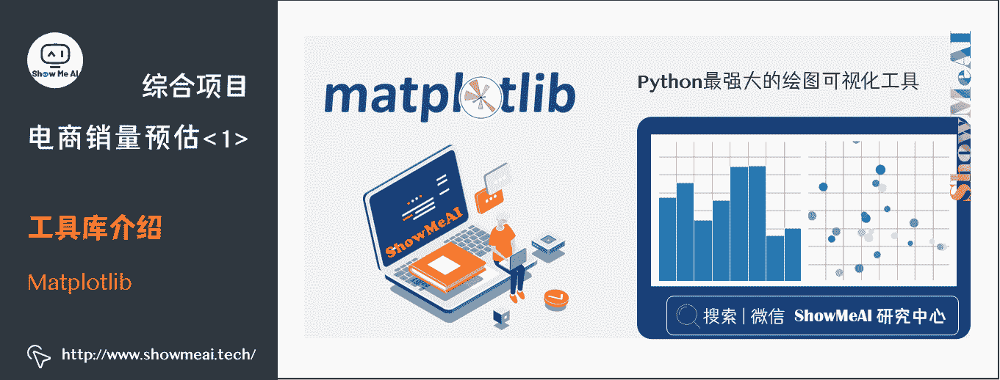

想学习 Matplotlib 工具库的宝宝，也可以查看[ShowMeAI](http://www.showmeai.tech/)总结的 Matplotlib 速查表 [**数据科学工具速查 | Matplotlib 使用指南**](http://www.showmeai.tech/article-detail/103) 做一个快速了解。

### (4) Seaborn

Seaborn 是基于 Python 且非常受欢迎的图形可视化库，在 Matplotlib 的基础上，进行了更高级的封装，使得作图更加方便快捷。即便是没有什么基础的人，也能通过极简的代码，做出具有分析价值而又十分美观的图形。

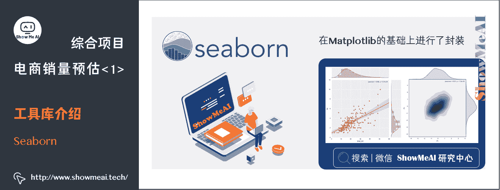

想对 Seaborn 有详细了解的宝宝，欢迎查看[ShowMeAI](http://www.showmeai.tech/)的 [数据分析系列教程](http://www.showmeai.tech/tutorials/33) 中的 Seaborn 部分。
大家也可以查看[ShowMeAI](http://www.showmeai.tech/)总结的 Seaborn 速查表 [**数据科学工具速查 | Seaborn 使用指南**](http://www.showmeai.tech/article-detail/105) 做一个快速了解。

### (5) Scikit-Learn

Python 机器学习工具库 Scikit-Learn，构建在 Numpy，SciPy，Pandas 和 Matplotlib 之上，也是最常用的 Python 机器学习工具库之一，里面的 API 的设计非常好，所有对象的接口简单，很适合新手上路。覆盖的模型非常多，适用场景广泛。

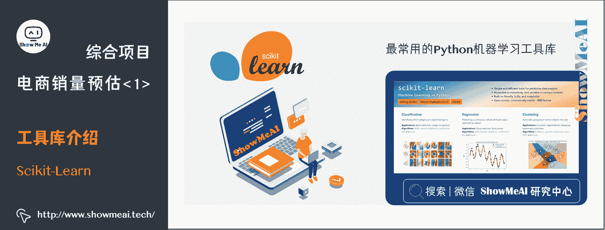

想对 Scikit-Learn 有详细了解的宝宝，欢迎查看[ShowMeAI](http://www.showmeai.tech/)的机器学习实战教程中的[**SKLearn 入门**](http://www.showmeai.tech/article-detail/202) 和 [**SKLearn 指南**](http://www.showmeai.tech/article-detail/203) 部分。也可以查看[ShowMeAI](http://www.showmeai.tech/)总结的 Scikit-Learn 速查表 [**AI 建模工具速查 | Scikit-Learn 使用指南**](http://www.showmeai.tech/article-detail/108) 做一个快速了解。

### (6) XGBoost

XGBoost 是 eXtreme Gradient Boosting 的缩写称呼，它是一个非常强大的 Boosting 算法工具包，优秀的性能(效果与速度)让其在很长一段时间内霸屏数据科学比赛解决方案榜首，现在很多大厂的机器学习方案依旧会首选这个模型。XGBoost 在并行计算效率、缺失值处理、控制过拟合、预测泛化能力上都变现非常优秀。


想对 XGBoost 有详细了解的宝宝，欢迎查看[ShowMeAI](http://www.showmeai.tech/)的文章 [**图解机器学习 | XGBoost 模型详解**](http://www.showmeai.tech/article-detail/194) 理解其原理，以及文章 [**XGBoost 工具库建模应用详解**](http://www.showmeai.tech/article-detail/204) 了解详细用法。

### (7) LightGBM

LightGBM 是微软开发的 boosting 集成模型，和 XGBoost 一样是对 GBDT 的优化和高效实现，原理有一些相似之处，但它很多方面比 XGBoost 有着更为优秀的表现。


想对 LightGBM 有详细了解的宝宝，欢迎查看[ShowMeAI](http://www.showmeai.tech/)的文章 [图解机器学习 | LightGBM 模型详解](http://www.showmeai.tech/article-detail/195) 理解其原理，以及文章 [LightGBM 工具库建模应用详解](http://www.showmeai.tech/article-detail/205) 了解详细用法。

# 3.项目概况介绍

本项目源于 Kaggle 平台的大数据机器学习比赛 [Rossmann Store Sales](https://www.kaggle.com/c/rossmann-store-sales)，下面对其展开做介绍。

## 3.1 背景介绍

Rossmann 成立于 1972 年，是德国最大的日化用品超市，在 7 个欧洲国家有 3000 多家商店。商店不定时会举办短期的促销活动以及连续的促销活动以此来提高销售额。除此之外，商店的销售还受到许多因素的影响，包括促销、竞争、学校和国家假日、季节性和周期性。


## 3.2 数据介绍

数据以 1115 家 Rossmann 连锁商店为研究对象，从 2013 年 1 月 1 日到 2015 年 7 月共计录 1017209 条销售数据(27 个特征)。

数据集一共涵盖了四个文件：

*   `train.csv`：含有销量的历史数据
*   `test.csv`：未含销量的历史数据
*   `sample_submission.csv`：以正确格式提交的示例文件
*   `store.csv`：关于每个商店的一些补充信息

其中，`train.csv`中的数据中一共含有 9 列信息：

*   `store`：为对应店铺的 id 序号
*   `DayOfWeek`：代表着每周开店的天数
*   `Data`：是对应销售额 Sales 产生的日期
*   `Sales`：就是销售额的历史数据
*   `Customers`：为进店的客人数量
*   `Open`：则表示这个店铺是否开门与否
*   `Promo`：表示商店是否在当天有促销活动
*   `StateHoliday`：与 SchoolHoliday 分别表示了是否是国定假日或是学校假日。

### (1) train.csv

我们在 Kaggle 的 data 页面下部的数据概览可以大致查看每个数据的分布情况和部分数据样例如下：

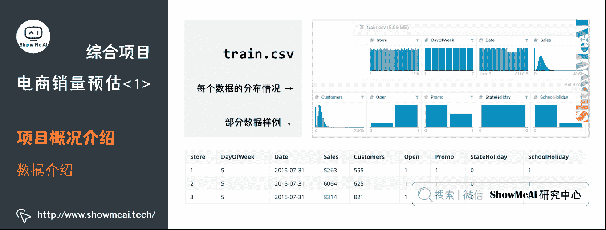

### (2) test.csv

`test.csv`中的数据列几乎和`train.csv`一样，但缺少了 Sales(也就是销售数据)以及 Customers(用户流量)这两列。而我们的最终目标就是利用`test.csv`以及`store.csv`中的补充信息预测出`test.csv`中缺失的 Sales 数据。

`test.csv`的数据分布情况，可以看到和上面相比缺少了 Sales 以及与 Sales 有强关联的 Customer 数据。

数据分布和部分示例数据如下：

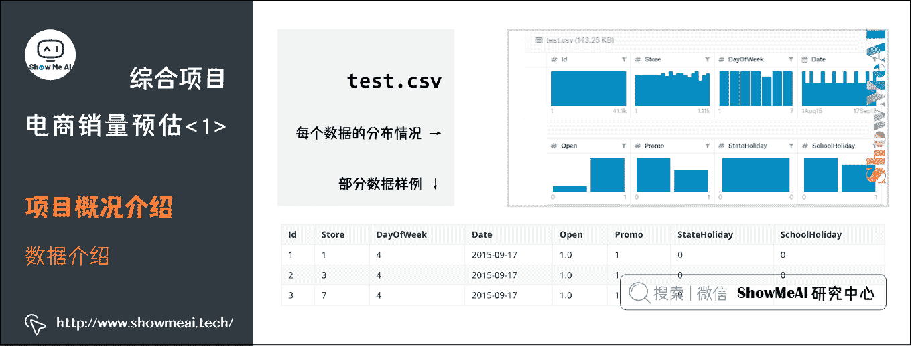

### (3) sample_submission.csv

结果文件`sample_submission.csv`中仅有 id 与 Sales 这两列，这个文件是我们将我们的预测答案提交至 Kaggle 的判题器上的标准格式模板。

在 Python 中我们只需要打开此文件，并将预测数据按照顺序填入 Sales 这一列后，使用`Dataframe.to_csv(‘sample_submission.csv‘)`后就可以将带有预测数据的`sample_submission.csv`保存至本地并准备后续上传。

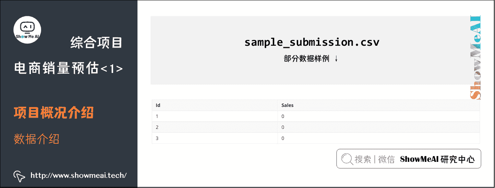

### (4) store.csv

大家可以看到，`train.csv`与`test.csv`中有对应的店铺 id，这些店铺 id 的详细情况就对应在`store.csv`中，其中记录了一些店铺的地理位置信息以及营促销信息。

`store.csv`的数据分布情况，可以注意到这里有很多离散的类别标签。

数据分布和部分示例数据如下：

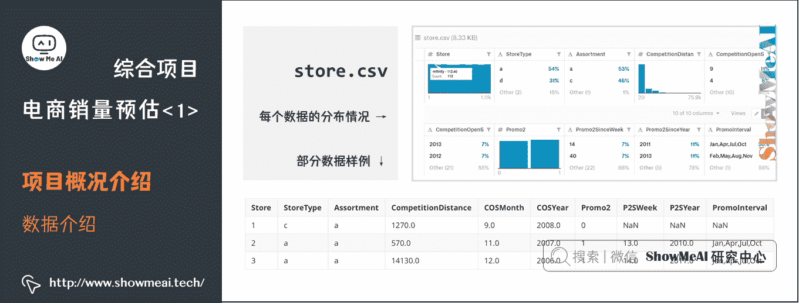

其中：

*   `Store`：对应表示了店铺的编号。
*   `StoreType`：店铺的种类，一共有 a、b、c、d 四种不同种类的店铺。大家可以把它想象成快闪店，普通营业店，旗舰店，或 mini 店这样我们生活中的类型。
*   `Assortment`：用 a、b、c 三种分类描述店铺内售卖产品的组合级别。例如旗舰店和 mini 店中组合的产品肯定是有很大不同的。
*   `Competition Distance`、`Competition Open Since Year`、`Competition Open Since Month`：分别表示最近的竞争对手的店铺距离，开店时间(以年计算)，开店时间(以月计算)。
*   `Promo2`：描述该店铺是否有长期的促销活动。
*   `Promo2 Since Year`于`Promo2 Since Week`：分别表示商店开始参与促销的年份和日历周。
*   `Promo Interval`：描述`promo2`开始的连续间隔，以促销重新开始的月份命名。

## 3.3 项目目标

在了解了这些数据后我们就需要明确一下我们的项目目的，在 Rossmanns 销售预测中，我们需要利用历史数据，也就是`train.csv`中的数据进行监督学习。训练出的模型利用通 test.csv 中的数据进行模型推断(预测)，将预测出的数据以`sample_submission.csv`的格式提交至 Kaggle 进行评分。在这过程中还可以结合`store.csv`中的补充信息加强我们模型获得数据的能力。

## 3.4 评估准则

模型所采纳的评估指标为 Kaggle 在竞赛中所推荐的 Root Mean Square Percentage Error (RMSPE)指标。

R M S P E = 1 n ∑ i = 1 n ( y i − y ^ i y i ) 2 = 1 n ∑ i = 1 n ( y ^ i y i − 1 ) 2 RMSPE = \sqrt{\frac{1}{n}\sum\limits_{i=1}^n\left(\frac{y_i-\hat{y}_i}{y_i}\right)²} = \sqrt{\frac{1}{n}\sum\limits_{i=1}^n\left(\frac{\hat{y}_i}{{y}_i}-1\right)²} RMSPE=n1​i=1∑n​(yi​yi​−y^​i​​)2  ​=n1​i=1∑n​(yi​y^​i​​−1)2  ​

其中：

*   y i y_i yi​ 代表门店当天的真实销售额。
*   y ^ i \hat{y}_i y^​i​ 代表相对应的预测销售额。
*   n n n 代表样本的数量。

如果有任何一天的销售额为 0，那么将会被忽略。最后计算得到的这个 RMSPE 值越小代表误差就越小，相应就会获得更高的评分。

# 4.EDA 探索性数据分析

本案例涉及到的数据规模比较大，我们无法直接通过肉眼查看数据特性，但是对于数据分布特性的理解，可以帮助我们在后续的挖掘与建模中取得更好的效果。我们在这里会借助之前介绍过的 Pandas、Matplotlib、Seaborn 等工具来对数据进行分析和可视化理解。
这个部分我们使用的 IDE 为 Jupyter Notebook，比较方便进行交互式绘图探索数据特性。

## 4.1 折线图

我们使用了`matplotlib.pyplot`绘制了序号为 1 的店铺从 2013 年 1 月到 2015 年月的销售数据的曲线图。

```
train.loc[train['Store']==1,['Date','Sales']].plot(x='Date',y='Sales',title='The Sales Data In Store 1',figsize=(16,4)) 
```

代码解释：

*   我们使用 Pandas 读取`train.csv`到`train`变量中。

*   再利用`.loc()`这个函数对 train 这个 Dataframe 进行了数据筛选。

    *   筛选出 Store 编号为 1 的所有数据中的 Date 与 Sales 这两列数据，也就是下中对应的 x 轴与 y 轴。
*   然后利用 Pandas 内置的`plot`方法进行绘图。在`plot()`中我们给图片设定了一系列的客制化参数：

    *   x 轴对应的数据为`Date`列
    *   y 轴的数据为`Sales`列
    *   设定了图片的标题为`The Sales Data In Store 1`
    *   图片的尺寸为(16, 4)
*   Matplotlib 中的`figsize`参数可以约束图片的长宽以及大小，我们这里设置为(16, 4)，意味可视化图片的像素大小为 1600*400 像素。

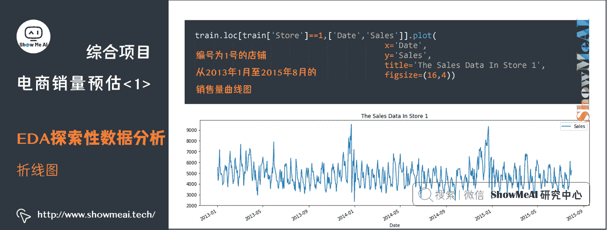

编号为 1 号的店铺从 2013 年 1 月至 2015 年 8 月的销售量曲线图

如果我们想查看一定时间范围内的销售额数据，可以调整`loc`函数内容对 x 轴进行范围选取。

```
train.loc[train['Store']==1,['Date','Sales']].plot(x='Date',y='Sale s',title='Store1',figsize=(8,2),xlim=['2014-6-1','2014-7-31']) 
```

上述代码增加了 xlim 参数，达到了在 x 轴上对时间线进行截取的目的。

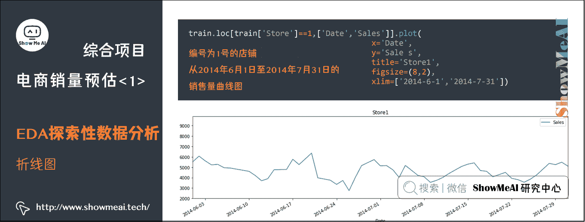

> 编号为 1 号的店铺从 2014 年 6 月 1 日至 2014 年 7 月 31 日的销售量曲线图

## 4.2 单变量分布图

下面我们对单维度特征进行数据分析，Seaborn 提供了`distplot()`这个方便就可以绘制数据分布的 api。

```
sns.distplot(train.loc[train['Store']==1,['Date','Sales']]['Sales'],bins=10, rug=True) 
```

得到的结果如下，即一号店铺这么多年来全部销售状态的分布情况。

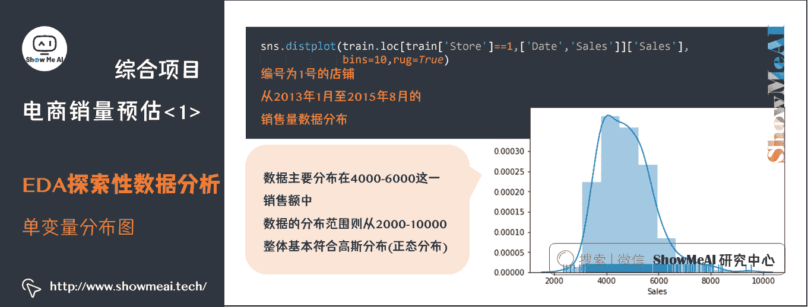

> 编号为 1 号的店铺从 2013 年 1 月至 2015 年 8 月的销售量数据分布

通过数据分布图就可以看出数据主要分布在 4000-6000 这一销售额中，数据的分布范围则从 2000-10000，整体基本符合高斯分布(正态分布)。

因为销售额是我们的预测目标，提前明确预测数据的分布非常有用，在训练集和测试集的分布明显有区别时，我们在预测的数据上进行一定的操作(例如乘以一个固定系数进行调整等)，有时可以大幅改善预测的效果，在后续的建模部分我们也会采用这个策略。
同样的单变量分布分析，可以应用在其他的特征变量上。

## 4.3 二元变量联合分布图

除了对单变量进行分布分析，我们还可以通过对二元变量进行交叉联合分布分析获得更多的关联信息。在 Seaborn 中的`jointplot()`函数可以帮助我们很好的分析两个变量之间的关系。

```
sns.jointplot(x=train["Sales"], y=train["Customers"], kind="hex") 
```

下图中显示了销售额(x 轴)与客户流量(y 轴)之间的关系，并且在各自的轴上显示了对于轴的数据分布状态。

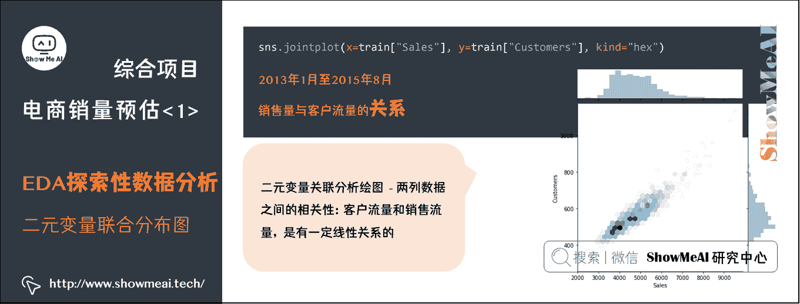

> 2013 年 1 月至 2015 年 8 月的销售量与客户流量的关系

二元变量关联分析绘图，可以帮我们直观地观察出两列数据之间的相关性，在上图中我们就可以很轻易的观测出客户流量和销售流量是有一定线性关系的。

在`jointplot()`中还可以给其传递不同的 kind 参数改变图像的风格，例如下图中我们将 kind 的参数从`hex`改为`reg`，下图风格就从六边形风格变成了如下风格，并增加了两个列数据组成的回归线以表示数据的基本趋势。

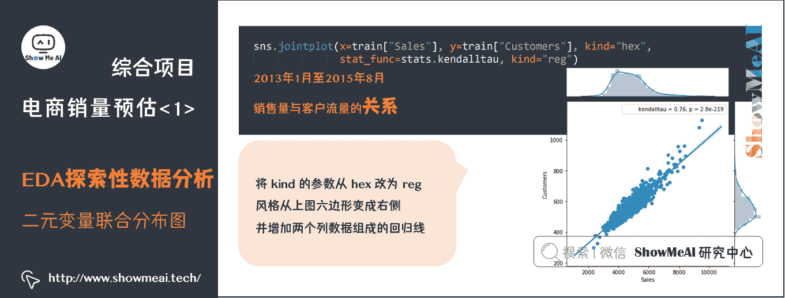

> 2013 年 1 月至 2015 年 8 月的销售量与客户流量的关系

上面绘制的图中，还呈现了一些参数指标信息如`kendaltau=0.76`以及`p=2.8e-19`这些信息。这可以结合`scipy`以及函数中的`stat_func=`参数进行计算指标的传递。

这里给出范例代码：

```
sns.jointplot(x=train["Sales"], y=train["Customers"], kind="hex", stat_func=stats.kendalltau, kind="reg") 
```

## 4.4 箱线图

其他常用的分析工具还包括箱线图(Box-plot，又称为盒须图、盒式图或箱形图)，它可以清晰呈现数据分布的统计特性，包括一组数据的最大值、最小值、中位数及上下四分位数。

下面以销售数据为例，讲解使用 Seaborn 中的`boxplot()`函数对销售数据进行分析的过程。

```
sns.boxplot(train.Sales, palette="Set3") 
```

其中，`train.Sales`是另外一种读取 Pandas 某列数据的方式，当然你也可以使用`x=train ["Sales"]`来达到同样的效果。

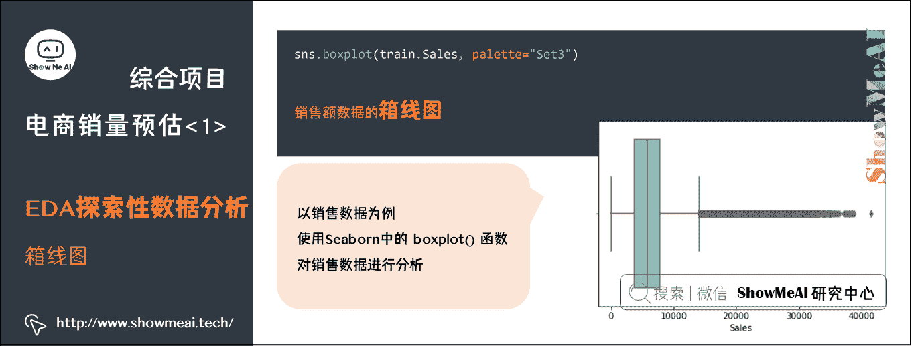

> 销售额数据的箱线图

我们想将销售数据分成 4 个箱线图(不同店铺类型)，每个箱线图表示一周店铺类型的销售额。先将 store 中的 storeTpye 店铺类型数据放入`train`的数据中，即如下做合并。

```
train = pd.merge(train, store, on='Store') 
```

上述代码中`merge`将两个 Dataframe 数据以某一列为索引进行合并，合并的依据为参数`on`。在这里将参数`on`设置为了`Store`就意味着以 Store`为索引进行合并。

接下来我们可以使用`boxplot()`函数进行两列数据的结合分析，其中 x 轴应该是店铺类别数据而 y 应该是销售额的箱线图数据。

```
sns.boxplot(x="StoreType", y="Sales", data=train, palette="Set3") 
```

`palette`参数可以调节箱线图的配色状态，这里用的是`Set3`(色彩可以根据自己的个人喜好或展示要求进行修改)。

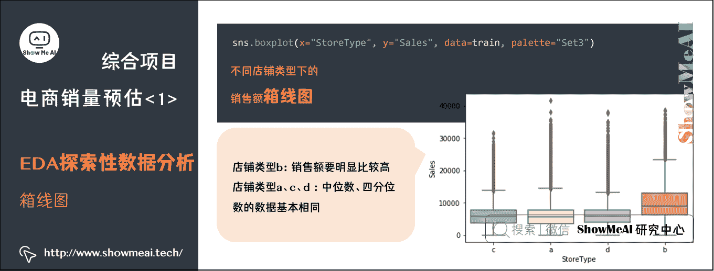

> 不同店铺类型下的销售额箱线图情况

可以看出不同店铺类型特别是店铺类型 b 的店铺销售额要明显高出其他店铺。a、c、d 三种店铺的无论是中位数还是四分位数数据都基本相同。

Seaborn 中的函数`violinplot()`也提供了和箱线图功能类似的提琴图功能，下面以代码举例。

```
sns.violinplot(x="StoreType", y="Sales", data=train, palette="Set3") 
```

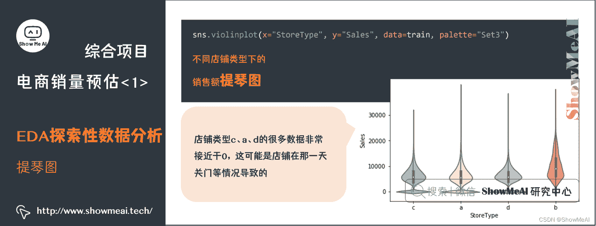

> 不同店铺类型下的销售额提琴图情况

在提琴图中将箱线图里中位数，四分位的位置标线等数据变为了数据的整体分布情况，在这里我们看见 a、d、c 三类店铺都有很多数据非常接近于 0，这可能是店铺在那一天关门等情况导致的。

## 4.5 热力图

如果我们希望更清晰地探索多变量之间的两两关联度，热力图是一个很不错的选择。作为一种密度图，热力图一般使用具备显著颜色差异的方式来呈现数据效果，热力图中亮色一般代表事件发生频率较高或事物分布密度较大，暗色则反之。

在 Seaborn 中要绘制热力图，我们会应用到 Pandas 中的`corr()`函数，该函数计算每列数据之间的相关性。这里的相关性为 Pearson 相关系数，可以由以下公式得到。

ρ X , Y = cov ⁡ ( X , Y ) σ X σ Y = E ( ( X − μ X ) ( Y − μ Y ) ) σ X σ Y \rho_{X, Y}=\frac{\operatorname{cov}(X, Y)}{\sigma_{X} \sigma_{Y}}=\frac{E\left(\left(X-\mu_{X}\right)\left(Y-\mu_{Y}\right)\right)}{\sigma_{X} \sigma_{Y}} ρX,Y​=σX​σY​cov(X,Y)​=σX​σY​E((X−μX​)(Y−μY​))​

计算相关性矩阵的代码如下所示：

```
train_corr = train.corr() 
```

接下来就可以直接利用 Seaborn 的`heatmap()`函数进行热力图的绘制。

```
sns.heatmap(train.corr(), annot=True, vmin=-0.1,vmax=0.1,center=0) 
```

上述代码中：

*   参数`annot=True`是在热力图上显示相关系数矩阵的数值
*   `vim`与 vmax`规定了右侧色卡的显示范围，这里我们设置为了从-0.1 至-0.1 的范围
*   `center=0`表示我们将中心值设置为 0

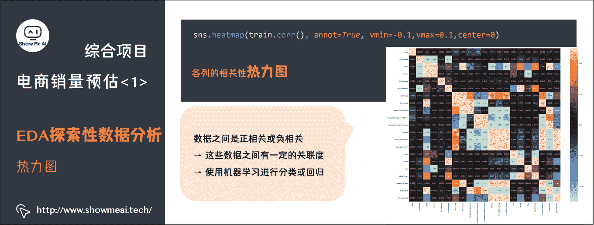

> 各列的相关性热力图

上图显示不少参数之间都具有一定的正相关性或者负相关性，意味着这些数据之间有一定的关联度，也就是说我们可以将这些数据使用机器学习模型进行分类或回归。

# 5.模型的训练与评估

本节我们先带大家回顾一些机器学习基础知识，再基于不同的机器学习工具库和模型进行建模。

## 5.1 过拟合和欠拟合

过拟合是指模型可以很好的拟合训练样本，但对新数据的预测准确性很差，泛化能力弱。欠拟合是指模型不能很好的拟合训练样本，且对新数据的预测性也不好。

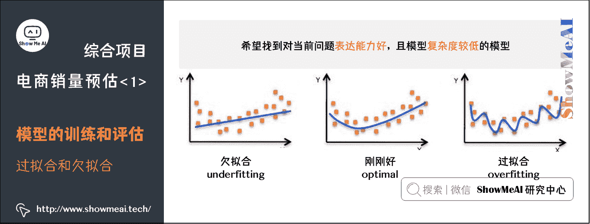

> 过拟合欠拟合示意图

更详细的讲解大家可以参考[ShowMeAI](http://www.showmeai.tech/)的文章图解机器学习 | 机器学习基础知识

## 5.2 评估准则

在 Scikit-Learn，XGBoost 或是 LightGBM 中，我们往往使用各种评价标准来表达模型的性能。最常用的往往有以下评估准则，对应二分类，多分类，回归等等不同的问题。

*   `rmse`：均方根误差
*   `mae`：平均绝对误差
*   `logloss`：负对数似然函数值
*   `error`：二分类错误率
*   `merror`：多分类错误率
*   `mlogloss`：多分类 logloss 损失函数
*   `auc`：曲线下面积

当然也可以通过定义自己的 loss function 进行损失函数定义。

## 5.3 交叉验证

留出法的数据划分，可能会带来偏差。在机器学习中，另外一种比较常见的评估方法是交叉验证法——K 折交叉验证对 K 个不同分组训练的结果进行平均来减少方差。

因此模型的性能对数据的划分就不那么敏感，对数据的使用也会更充分，模型评估结果更加稳定，可以很好地避免上述问题。
更详细的讲解大家可以参考[ShowMeAI](http://www.showmeai.tech/)的文章 [图解机器学习 | 机器学习基础知识](http://www.showmeai.tech/article-detail/185)。

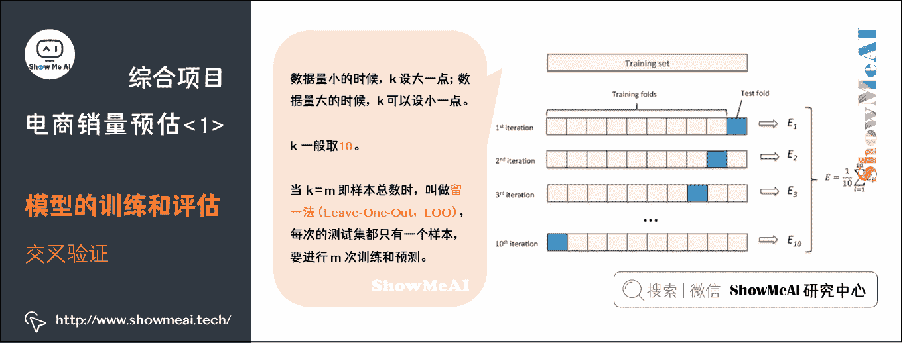

## 5.4 建模工具库与模型选择

本项目很显然是一个回归类建模问题，我们可以先从回归树( [**图解机器学习 | 回归树模型详解**](http://www.showmeai.tech/article-detail/192))，后可以尝试集成模型，例如随机森林( [**图解机器学习 | 随机森林分类模型详解**](http://www.showmeai.tech/article-detail/191))、XGBoost( [**图解机器学习 | XGBoost 模型详解**](http://www.showmeai.tech/article-detail/194))、LightGBM( [**图解机器学习 | LightGBM 模型详解**](http://www.showmeai.tech/article-detail/195))。

考虑到参加比赛的同学的整体算力资源可能参差不齐所以本文将主要讲解如何利用 LightGBM 进行模型的训练。本文只提供一些核心代码演示，更加细节的文档可以参考 [**LightGBM 中文文档**](https://link.zhihu.com/?target=https://lightgbm.apachecn.org/#/)。

大家通过[ShowMeAI](http://www.showmeai.tech/)前面的工具库详解 [**LightGBM 建模应用详解**](http://www.showmeai.tech/article-detail/205) 知道，如果用 LightGBM 进行训练学习，训练代码非常简单：

```
model = lgb.train(params=lgb_parameter, feval=rmsle, train_set=train_data, num_boost_round=15000, valid_sets=watchlist, early_stopping_rounds=1000, verbose_eval=1000) 
```

代码解释：

*   `params`：定义 lgb 算法的一些参数设置，如评价标准，学习率，任务类型等。
*   `feval`：可以让 lgb 使用自定义的损失函数。
*   `train_set`：训练集的输入。
*   `num_boost_round`：最大的训练次数。
*   `valid_sets`：测试集的输入。
*   `early_stopping_rounds`：当模型评分在 n 个回合后还没有提高时就结束模型将最佳的点的模型保存。
*   `verbose_eval`：表示每多少论返回一次训练的评价信息，这里定义了每 1000 轮保存一次。

## 5.5 数据预处理

为了建模有好的效果，我们很少直接用原始数据，一般会先对数据进行预处理。

我们先用`pd.merge`方法将`store`与`train`数据合并，得到以下 DataFrame 数据：

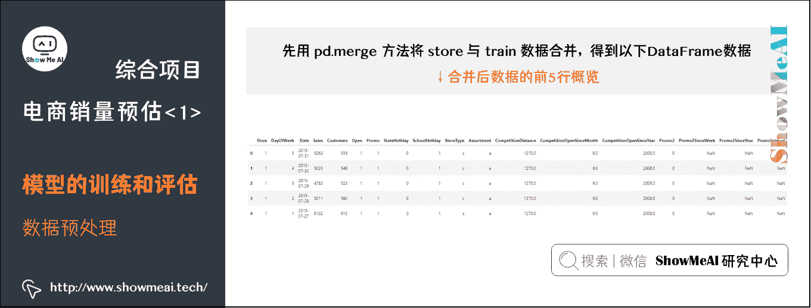

> 合并后数据的前 5 行概览

首先我们看到有一些类别型字段，比如`SotreType`、`Assortment`以及`StateHoliday`，是以 a、b、c、d 这样的数值形式保存的，常用的数据预处理或者特征工程，会将其进行编码。我们这里用`mapping`函数将其编码变换为 0123 这样的数字。

```
mappings = {'0':0, 'a':1, 'b':2, 'c':3, 'd':4}
data['StoreType'] = data.StoreType.map(mappings)
data['Assortment']= data.Assortment.map(mappings)
data['StateHoliday']= data.StateHoliday.map(mappings) 
```

再注意到时间型的字段 date，是以`YYYY-MM-DD`这样的日期时间戳的形式记录的。我们最常做的操作，是将时间戳拆分开来，比如年月日可以拆分成`Year`、`Month`、`Day`这样的形式会更有利于我们的模型学习到有效的信息。

```
data['Year'] = data.Date.dt.year
data['Month'] = data.Date.dt.month
data['Day'] = data.Date.dt.day
data['DayOfWeek'] = data.Date.dt.dayofweek
data['WeekOfYear'] = data.Date.dt.weekofyear 
```

上述代码还抽取了「一年内的第几周」和「一周中的第几天」两列额外信息。这些都可以在 Pandas 中的 dt 方法中找到。

再看`CompetitionOpenSince`和`Promo2Since`两个字段，这两列数据表示促销开始的时间，这样的数据是固定的，但是开始的时间到当前时间点的数据是很有价值帮助我们预测销售额。所以这里需要一定变化，我们将促销开始的时间减去当前 data 的时间即可。

```
data['CompetitionOpen']=12*(data.Year-data.CompetitionOpenSinceYear)+(data.Month - data.CompetitionOpenSinceMonth)
data['PromoOpen'] = 12 *(data.Year-data.Promo2SinceYear)+ (data.WeekOfYear - data.Promo2SinceWeek) / 4.0
data['CompetitionOpen'] = data.CompetitionOpen.apply(lambda x: x if x > 0 else 0)
data['PromoOpen'] = data.PromoOpen.apply(lambda x: x if x > 0 else 0) 
```

`CompetitionOpen`和`PromoOpen`是两列计算距离促销，或竞争对手开始时间长短的字段，用于表达促销或竞争对手对于销售额的影响。我们先做异常值处理(滤除所有负值)。

在数据中还有一列`PromoInterval`以列出月信息的形式储存正在促销的月份，我们想将其转化为以月份信息为准，如这个时间点的月份在这个`PromoInterval`中则这一店的这一时间点在促销中。

```
data.loc[data.PromoInterval == 0, 'PromoInterval'] = ''
data['IsPromoMonth'] = 0
for interval in data.PromoInterval.unique():
    if interval != '':
        for month in interval.split(','):
            data.loc[(data.monthStr == month) & (data.PromoInterval == interval), 'IsPromoMonth'] = 1 
```

和店铺类型中的标签转换类似，我们将月份从数字转化为 str 类型以和`PromoInterval`进行配对用于断当前时间是否是销售时间，并且新建一个数据列`IsPromoMonth`进行储存当前时间是否为促销时间。

当然，如果我们深度思考，还可以有很多事情做。例如：

*   在原始数据中有很多店铺没有开门的情况，既`Open`的值为 0。而预测数值的情况下我们默认店铺不会存在关门的情况，所以可以在数据筛选的过程中清理 Open 为 0 的情况。
*   在数据中还一部分`Sales`数值小于零的情况，这里猜测是有一些意外情况导致的记账信息错误，所以可以在数据清洗中时也直接过滤这一部分数据。

## 5.6 模型参数

很多机器学习有很多超参数可以调整，以这里的 LightGBM 为例，下面为选出的系列参数。关于 LightGBM 的参数和调参方法可以参考 [**LightGBM 建模应用详解**](http://www.showmeai.tech/article-detail/205)。

```
params ={
'boosting_type': 'gbdt',
'objective': 'regression',
'metric':'rmse',
'eval_metric':'rmse',
'learning_rate': 0.03,
'num_leaves': 400,
#'max_depth' : 10,
'subsample': 0.8,
"colsample_bytree": 0.7,
'seed':3,
} 
```

上述参数包含两类：

**主要参数：确定任务和模型的时候就会确定下来**。

*   `boosting_type`：是模型的类型(常选择 gbdt 或 dart)。
*   `objective`：决定了模型是完成一个分类任务还是回归任务。
*   `metric`：为模型训练时的评估准则。
*   `eval_metric`：为模型评价时的评估准则。

**模型可调细节参数：对模型的构建和效果有影响的参数**。

*   `learning_rate`：表示每次模型学习时的学习率。
*   `num_leaves`：是最多叶子数。leaf-wise 的 LightGBM 算法主要由叶子数来控制生长和过拟合，如果树深为`max_depth`，它的值的设置应该小于 2^(max_depth)，否则可能会导致过拟合。
*   `is_unbalance`：设置可以应对类别非均衡数据集。
*   `min_data_in_leaf`：叶子节点最少样本数，调大它的值可以防止过拟合，它的值通常设置的比较大。

```
# coding: utf-8
import lightgbm as lgb
import pandas as pd
from sklearn.metrics import mean_squared_error

# 设定训练集和测试集
y_train = train['Sales'].values
X_train = train.drop('Sales', axis=1).values

# 构建 lgb 中的 Dataset 格式
lgb_train = lgb.Dataset(X_train, y_train)

# 敲定好一组参数
params = {
            'boosting_type': 'gbdt',
            'objective': 'regression',
            'metric':'rmse',
            'eval_metric':'rmse',
            'learning_rate': 0.03,
            'num_leaves': 400,
            #'max_depth' : 10,
            'subsample': 0.8,
            "colsample_bytree": 0.7,
            'seed':3,
        }

print('开始训练...')
# 训练
gbm = lgb.train(params,
                lgb_train,
                num_boost_round=200)

# 保存模型
print('保存模型...')
# 保存模型到文件中
gbm.save_model('model.txt') 
```

## 参考资料

*   [数据分析系列教程](http://www.showmeai.tech/tutorials/33)
*   [机器学习算法系列教程](http://www.showmeai.tech/tutorials/34)
*   [Kaggle Rossmann Store Sales 机器学习比赛](https://www.kaggle.com/c/rossmann-store-sales)
*   [数据科学工具速查 | Numpy 使用指南](http://www.showmeai.tech/article-detail/100)
*   [数据科学工具速查 | Numpy 使用指南](http://www.showmeai.tech/article-detail/100)
*   [数据科学工具速查 | Pandas 使用指南](http://www.showmeai.tech/article-detail/101)
*   [数据科学工具速查 | Matplotlib 使用指南](http://www.showmeai.tech/article-detail/103)
*   [数据科学工具速查 | Seaborn 使用指南](http://www.showmeai.tech/article-detail/105)
*   [AI 建模工具速查 | Scikit-Learn 使用指南](http://www.showmeai.tech/article-detail/108)
*   [图解机器学习 | XGBoost 模型详解](http://www.showmeai.tech/article-detail/194)
*   [图解机器学习 | LightGBM 模型详解](http://www.showmeai.tech/article-detail/195)

# [ShowMeAI](http://www.showmeai.tech/)系列教程推荐

*   [图解 Python 编程：从入门到精通系列教程](http://www.showmeai.tech/tutorials/56)
*   [图解数据分析：从入门到精通系列教程](http://www.showmeai.tech/tutorials/33)
*   [图解 AI 数学基础：从入门到精通系列教程](http://www.showmeai.tech/tutorials/83)
*   [图解大数据技术：从入门到精通系列教程](http://www.showmeai.tech/tutorials/84)
*   [图解机器学习算法：从入门到精通系列教程](http://www.showmeai.tech/tutorials/34)
*   [机器学习实战：手把手教你玩转机器学习系列](http://www.showmeai.tech/tutorials/41)

# 相关文章推荐

*   [Python 机器学习算法应用实践](http://www.showmeai.tech/article-detail/201)
*   [SKLearn 入门与简单应用案例](http://www.showmeai.tech/article-detail/202)
*   [SKLearn 最全应用指南](http://www.showmeai.tech/article-detail/203)
*   [XGBoost 建模应用详解](http://www.showmeai.tech/article-detail/204)
*   [LightGBM 建模应用详解](http://www.showmeai.tech/article-detail/205)
*   [Python 机器学习综合项目-电商销量预估](http://www.showmeai.tech/article-detail/206)
*   [Python 机器学习综合项目-电商销量预估<进阶方案>](http://www.showmeai.tech/article-detail/207)
*   [机器学习特征工程最全解读](http://www.showmeai.tech/article-detail/208)
*   [自动化特征工程工具 Featuretools 应用](http://www.showmeai.tech/article-detail/209)
*   [AutoML 自动化机器学习建模](http://www.showmeai.tech/article-detail/210)

