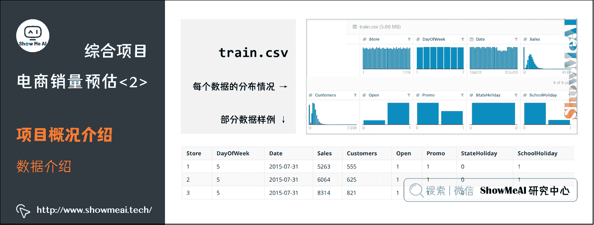
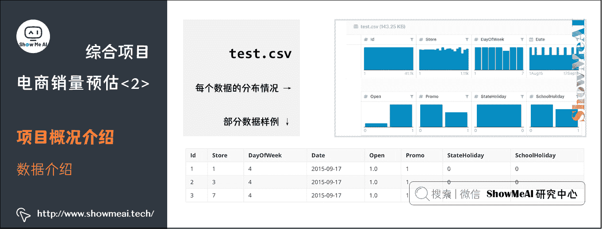
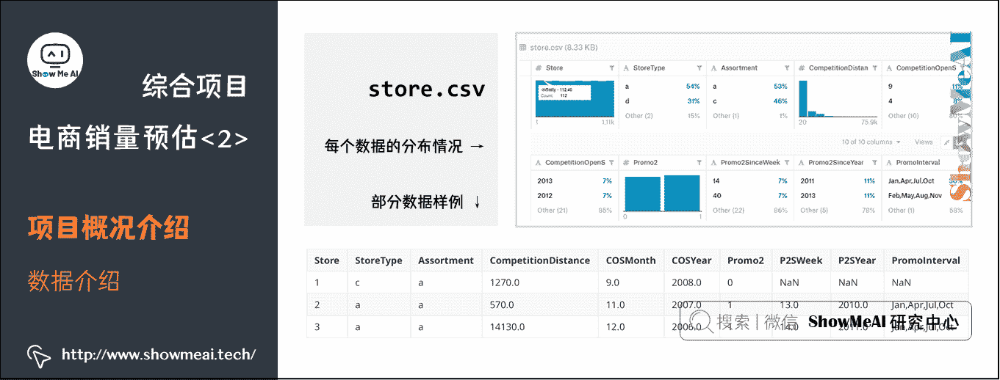
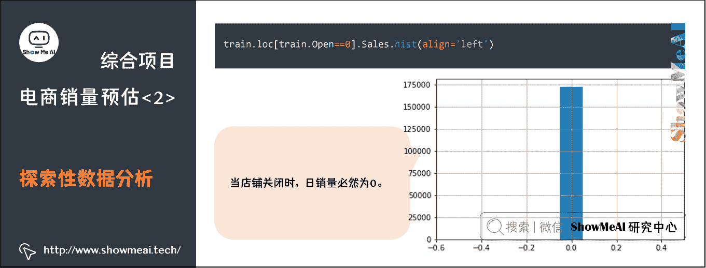
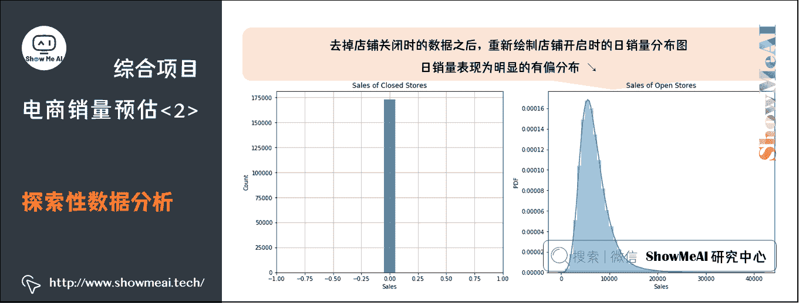
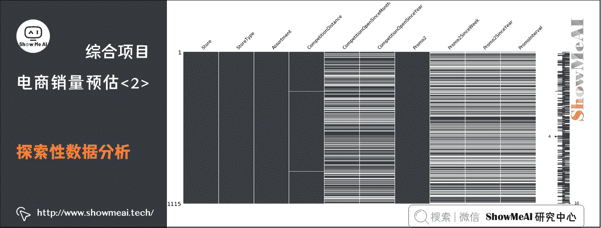

# 机器学习实战 | 综合项目-电商销量预估进阶方案

> 原文：[`blog.csdn.net/ShowMeAI/article/details/123649746`](https://blog.csdn.net/ShowMeAI/article/details/123649746)


作者：[韩信子](https://github.com/HanXinzi-AI)@[ShowMeAI](http://www.showmeai.tech/)
[教程地址](http://www.showmeai.tech/tutorials/41)：[`www.showmeai.tech/tutorials/41`](http://www.showmeai.tech/tutorials/41)
[本文地址](http://www.showmeai.tech/article-detail/207)：[`www.showmeai.tech/article-detail/207`](http://www.showmeai.tech/article-detail/207)
声明：版权所有，转载请联系平台与作者并注明出处
**收藏[ShowMeAI](http://www.showmeai.tech/)查看更多精彩内容**

* * *

# 引言

同样还是 Rossmann 这个场景问题，[ShowMeAI](http://www.showmeai.tech/)在上一篇 [**机器学习实战 | Python 机器学习综合项目-电商销量预估**](http://www.showmeai.tech/article-detail/206) 里给大家讲解了基本的数据探索性分析、数据预处理和建模过程，本篇我们再来看看这些过程，对其中一些细节做一些优化。

# 1.项目概况介绍

## 1.1 背景介绍

Rossmann 成立于 1972 年，是德国最大的日化用品超市，在 7 个欧洲国家有 3000 多家药店。商店不定时会举办短期的促销活动以及连续的促销活动以此来提高销售额。除此之外，商店的销售还受到许多因素的影响，包括促销、竞争、学校和国家假日、季节性和周期性。


可靠的销售预测使商店经理能够创建有效的员工时间表，从而提高生产力和动力，比如更好的调整供应链和合理的促销策略与竞争策略，具有重要的实用价值与战略意义。如果可以帮助 Rossmann 创建一个强大的预测模型，将帮助仓库管理人员专注于对他们最重要的内容：客户和团队。

本次的任务是希望建立机器学习模型，通过给出的数据来预测 Rossmann 德国各地 1115 家店铺的 6 周销量。

## 1.2 数据介绍

数据以 1115 家 Rossmann 连锁商店为研究对象，从 2013 年 1 月 1 日到 2015 年 7 月共计录 1017209 条销售数据(27 个特征)。

数据集一共涵盖了四个文件：

*   `train.csv`：含有销量的历史数据。
*   `test.csv`：未含销量的历史数据。
*   `sample_submission.csv`：以正确格式提交的示例文件。
*   `store.csv`：关于每个商店的一些补充信息。

其中，`train.csv`中的数据中一共含有 9 列信息：

*   `store`：为对应店铺的 id 序号。
*   `DayOfWeek`：代表着每周开店的天数。
*   `Data`：是对应销售额 Sales 产生的日期。
*   `Sales`：就是销售额的历史数据。
*   `Customers`：为进店的客人数量。
*   `Open`：则表示这个店铺是否开门与否。
*   `Promo`：表示商店是否在当天有促销活动。
*   `StateHoliday`：与 SchoolHoliday 分别表示了是否是国定假日或是学校假日。

### (1) 训练集

我们在 kaggle 的 data 页面下部的数据概览可以大致查看每个数据的分布情况(下为训练集`train.csv`情况)和部分数据样例如下：



### (2) 测试集

test.csv 中的数据列几乎和`train.csv`一样，但缺少了 Sales(也就是销售数据)以及 Customers(用户流量)这两列。而我们的最终目标就是利用`test.csv`以及`store.csv`中的补充信息预测出`test.csv`中缺失的 Sales 数据。

`test.csv`的数据分布情况，可以看到和上面相比缺少了 Sales 以及与 Sales 有强关联的 Customer 数据。

数据分布和部分示例数据如下：



### (3) 结果文件

结果文件`sample_submission.csv`中仅有 id 与 Sales 这两列，这个文件是我们将我们的预测答案提交至 Kaggle 的判题器上的标准格式模板。

在 Python 中我们只需要打开此文件，并将预测数据按照顺序填入 Sales 这一列后，使用`Dataframe.to_csv(‘sample_submission.csv‘)`后就可以将带有预测数据的`sample_submission.csv`保存至本地并准备后续上传。


### (4) 商店信息

大家可以看到，`train.csv`与`test.csv`中有对应的店铺 id，这些店铺 id 的详细情况就对应在`store.csv`中，其中记录了一些店铺的地理位置信息以及营促销信息。

`store.csv`的数据分布情况，可以注意到这里有很多离散的类别标签。

数据分布和部分示例数据如下：



其中：

*   `Store`：对应表示了店铺的编号。
*   `StoreType`：店铺的种类，一共有 a、b、c、d 四种不同种类的店铺。大家可以把它想象成快闪店，普通营业店，旗舰店，或 mini 店这样我们生活中的类型。
*   `Assortment`：用 a、b、c 三种分类描述店铺内售卖产品的组合级别。例如旗舰店和 mini 店中组合的产品肯定是有很大不同的。
*   `Competition Distance`、`Competition Open Since Year`、`Competition Open Since Month`：分别表示最近的竞争对手的店铺距离，开店时间(以年计算)，开店时间(以月计算)。
*   `Promo2`：描述该店铺是否有长期的促销活动。
*   `Promo2 Since Year`于`Promo2 Since Week`：分别表示商店开始参与促销的年份和日历周。
*   `Promo Interval`：描述`promo2`开始的连续间隔，以促销重新开始的月份命名。

## 1.3 项目目标

在了解了这些数据后我们就需要明确一下我们的项目目的，在 Rossmanns 销售预测中，我们需要利用历史数据，也就是`train.csv`中的数据进行监督学习。训练出的模型利用通 test.csv 中的数据进行模型推断(预测)，将预测出的数据以`sample_submission.csv`的格式提交至 Kaggle 进行评分。在这过程中还可以结合`store.csv`中的补充信息加强我们模型获得数据的能力。

## 1.4 评估准则

模型所采纳的评估指标为 Kaggle 在竞赛中所推荐的 Root Mean Square Percentage Error (RMSPE)指标。

R M S P E = 1 n ∑ i = 1 n ( y i − y ^ i y i ) 2 = 1 n ∑ i = 1 n ( y ^ i y i − 1 ) 2 RMSPE = \sqrt{\frac{1}{n}\sum\limits_{i=1}^n\left(\frac{y_i-\hat{y}_i}{y_i}\right)²} = \sqrt{\frac{1}{n}\sum\limits_{i=1}^n\left(\frac{\hat{y}_i}{{y}_i}-1\right)²} RMSPE=n1​i=1∑n​(yi​yi​−y^​i​​)2  ​=n1​i=1∑n​(yi​y^​i​​−1)2  ​

其中：

*   y i y_i yi​ 代表门店当天的真实销售额。
*   y ^ i \hat{y}_i y^​i​ 代表相对应的预测销售额。
*   n n n 代表样本的数量。

如果有任何一天的销售额为 0，那么将会被忽略。最后计算得到的这个 RMSPE 值越小代表误差就越小，相应就会获得更高的评分。

## 1.5 解决方案核心板块

本篇我们的解决方案，分成以下几个板块。


*   **Step 1： 加载数据**
*   **Step 2： 探索性数据分析**
*   **Step 3： 数据预处理(缺失值)**
*   **Step 4： 特征工程**
*   **Step 5： 基准模型与评估**
*   **Step 6： XGBoost 建模**

```py
# 载入必要的库
import pandas as pd
import numpy as np
import xgboost as xgb

import missingno as msno
import seaborn as sns
import matplotlib as mpl
import matplotlib.pyplot as plt
%matplotlib inline 
```

## 1.6 加载数据

Rossmann 场景建模数据包含很多信息维度，比如客户数量、假期等。又根据其任务目标可以判定为监督学习中典型的回归类建模问题。我们先对加载数据再做后续分析挖掘建模。

```py
# 载入数据
train = pd.read_csv('./rossmann-store-sales/train.csv')
test = pd.read_csv('./rossmann-store-sales/test.csv')
store = pd.read_csv('./rossmann-store-sales/store.csv') 
```

通过`DataFrame.info()`操作可以查看 DataFrame 的数据基本信息(数值分布、缺失值情况等)。详细的 pandas 操作也欢迎大家查看[ShowMeAI](http://www.showmeai.tech/)的 [数据分析系列教程](http://www.showmeai.tech/tutorials/33) 和 [**数据科学工具速查 | Pandas 使用指南**](http://www.showmeai.tech/article-detail/101)。

下图的操作结果显示`test.csv`和`store.csv`中均存在缺失值，我们可以进行相应的预处理。

```py
train.info(), test.info(), store.info() 
```

```py
<class 'pandas.core.frame.DataFrame'>
RangeIndex: 1017209 entries, 0 to 1017208
Data columns (total 9 columns):
Store            1017209 non-null int64
DayOfWeek        1017209 non-null int64
Date             1017209 non-null object
Sales            1017209 non-null int64
Customers        1017209 non-null int64
Open             1017209 non-null int64
Promo            1017209 non-null int64
StateHoliday     1017209 non-null object
SchoolHoliday    1017209 non-null int64
dtypes: int64(7), object(2)
memory usage: 69.8+ MB

<class 'pandas.core.frame.DataFrame'>
RangeIndex: 41088 entries, 0 to 41087
Data columns (total 8 columns):
Id               41088 non-null int64
Store            41088 non-null int64
DayOfWeek        41088 non-null int64
Date             41088 non-null object
Open             41077 non-null float64
Promo            41088 non-null int64
StateHoliday     41088 non-null object
SchoolHoliday    41088 non-null int64
dtypes: float64(1), int64(5), object(2)
memory usage: 2.5+ MB

<class 'pandas.core.frame.DataFrame'>
RangeIndex: 1115 entries, 0 to 1114
Data columns (total 10 columns):
Store                        1115 non-null int64
StoreType                    1115 non-null object
Assortment                   1115 non-null object
CompetitionDistance          1112 non-null float64
CompetitionOpenSinceMonth    761 non-null float64
CompetitionOpenSinceYear     761 non-null float64
Promo2                       1115 non-null int64
Promo2SinceWeek              571 non-null float64
Promo2SinceYear              571 non-null float64
PromoInterval                571 non-null object
dtypes: float64(5), int64(2), object(3)
memory usage: 87.2+ KB 
```

# 2\. 探索性数据分析

我们先对目标结果 sales 做一点分析，先对其进行分布绘图

```py
train.loc[train.Open==0].Sales.hist(align='left') 
```



> 发现：当店铺关闭时，日销量必然为 0。

```py
fig = plt.figure(figsize=(16,6))

ax1 = fig.add_subplot(121)
ax1.set_xlabel('Sales')
ax1.set_ylabel('Count')
ax1.set_title('Sales of Closed Stores')
plt.xlim(-1,1)
train.loc[train.Open==0].Sales.hist(align='left')

ax2 = fig.add_subplot(122)
ax2.set_xlabel('Sales')
ax2.set_ylabel('PDF')
ax2.set_title('Sales of Open Stores')
sns.distplot(train.loc[train.Open!=0].Sales)

print('The skewness of Sales is {}'.format(train.loc[train.Open!=0].Sales.skew())) 
```

```py
The skewness of Sales is 1.5939220392699809 
```



去掉店铺关闭时的数据之后，重新绘制店铺开启时的日销量分布图。可以发现日销量表现为明显的有偏分布，其偏度约为 1.594，远大于 0.75，我们会考虑对数据分布做预处理调整。

下面我们只采用店铺营业(`Open!=0`)时的数据进行训练。

```py
train = train.loc[train.Open != 0]
train = train.loc[train.Sales > 0].reset_index(drop=True)
train.shape 
```

```py
(844338, 9) 
```

# 3\. 缺失值处理

```py
# 训练集的缺失信息：无缺失
train[train.isnull().values==True] 
```

| Store | DayOfWeek | Date |Sales |Customers |Open |Promo |StateHoliday | SchoolHoliday |
|–|–|–|–|–|–|–|–|–|–|

```py
# 测试集的缺失信息
test[test.isnull().values==True] 
```

| Id | Store | DayOfWeek | Date | Open | Promo | StateHoliday | SchoolHoliday |
| --|–|–|–|–|–|–|–|–|
| 479 | 480 | 622 | 4 | 2015/9/17 | NaN | 1 | 0 | 0 |
| 1335 | 1336 | 622 | 3 | 2015/9/16 | NaN | 1 | 0 | 0 |
| 2191 | 2192 | 622 | 2 | 2015/9/15 | NaN | 1 | 0 | 0 |
| 3047 | 3048 | 622 | 1 | 2015/9/14 | NaN | 1 | 0 | 0 |
| 4759 | 4760 | 622 | 6 | 2015/9/12 | NaN | 0 | 0 | 0 |
| 5615 | 5616 | 622 | 5 | 2015/9/11 | NaN | 0 | 0 | 0 |
| 6471 | 6472 | 622 | 4 | 2015/9/10 | NaN | 0 | 0 | 0 |
| 7327 | 7328 | 622 | 3 | 2015/9/9 | NaN | 0 | 0 | 0 |
| 8183 | 8184 | 622 | 2 | 2015/9/8 | NaN | 0 | 0 | 0 |
| 9039 | 9040 | 622 | 1 | 2015/9/7 | NaN | 0 | 0 | 0 |
| 10751 | 10752 | 622 | 6 | 2015/9/5 | NaN | 0 | 0 | 0 |

下面我们看一下 store 的缺失情况

```py
# store 的缺失信息
msno.matrix(store) 
```



`test.csv`与`store.csv`中都有缺失值，我们会对其进行处理，并对特征进行合并：

```py
# 默认 test 中的店铺全部正常营业
test.fillna(1,inplace=True)

# 对 CompetitionDistance 中的缺失值采用中位数进行填补
store.CompetitionDistance = store.CompetitionDistance.fillna(store.CompetitionDistance.median())

# 对其它缺失值全部补 0
store.fillna(0,inplace=True) 
```

我们知道，缺失值的一些处理方法包括：

*   删除字段(去除包含缺失值的 columns)。
*   填补缺失值(填入平均值、中位数或者拟合填充等)。
*   标记缺失值，把缺失值标记为特殊值(比如-999)或者新加一列标注某字段是否是缺失。

```py
# 特征合并
train = pd.merge(train, store, on='Store')
test = pd.merge(test, store, on='Store') 
```

```py
train.head(10) 
```

| Store | DayOfWeek | Date | Sales | Customers | Open | Promo | StateHoliday | SchoolHoliday | StoreType | Assortment | CompetitionDistance | CompetitionOpenSinceMonth | CompetitionOpenSinceYear | Promo2 | Promo2SinceWeek | Promo2SinceYear | PromoInterval
|–|–|–|–|–|–|–|–|–|–|–|–|–|–|–|–|–|–|–|
| 0 | 1 | 5 | 2015/7/31 | 5263 | 555 | 1 | 1 | 0 | 1 | c | a | 1270 | 9 | 2008 | 0 | 0 | 0 | 0 |
| 1 | 1 | 4 | 2015/7/30 | 5020 | 546 | 1 | 1 | 0 | 1 | c | a | 1270 | 9 | 2008 | 0 | 0 | 0 | 0 |
| 2 | 1 | 3 | 2015/7/29 | 4782 | 523 | 1 | 1 | 0 | 1 | c | a | 1270 | 9 | 2008 | 0 | 0 | 0 | 0 |
| 3 | 1 | 2 | 2015/7/28 | 5011 | 560 | 1 | 1 | 0 | 1 | c | a | 1270 | 9 | 2008 | 0 | 0 | 0 | 0 |
| 4 | 1 | 1 | 2015/7/27 | 6102 | 612 | 1 | 1 | 0 | 1 | c | a | 1270 | 9 | 2008 | 0 | 0 | 0 | 0 |
| 5 | 1 | 6 | 2015/7/25 | 4364 | 500 | 1 | 0 | 0 | 0 | c | a | 1270 | 9 | 2008 | 0 | 0 | 0 | 0 |
| 6 | 1 | 5 | 2015/7/24 | 3706 | 459 | 1 | 0 | 0 | 0 | c | a | 1270 | 9 | 2008 | 0 | 0 | 0 | 0 |
| 7 | 1 | 4 | 2015/7/23 | 3769 | 503 | 1 | 0 | 0 | 0 | c | a | 1270 | 9 | 2008 | 0 | 0 | 0 | 0 |
| 8 | 1 | 3 | 2015/7/22 | 3464 | 463 | 1 | 0 | 0 | 0 | c | a | 1270 | 9 | 2008 | 0 | 0 | 0 | 0 |
| 9 | 1 | 2 | 2015/7/21 | 3558 | 469 | 1 | 0 | 0 | 0 | c | a | 1270 | 9 | 2008 | 0 | 0 | 0 | 0 |

# 4\. 特征工程

## 4.1 特征抽取函数

```py
def build_features(features, data):

    # 直接使用的特征
    features.extend(['Store','CompetitionDistance','CompetitionOpenSinceMonth','StateHoliday','StoreType','Assortment',
                     'SchoolHoliday','CompetitionOpenSinceYear', 'Promo', 'Promo2', 'Promo2SinceWeek', 'Promo2SinceYear'])

    # 以下特征处理方式参考：https://blog.csdn.net/aicanghai_smile/article/details/80987666

    # 时间特征，抽取出年月日星期几等信息
    features.extend(['Year','Month','Day','DayOfWeek','WeekOfYear'])
    data['Year'] = data.Date.dt.year
    data['Month'] = data.Date.dt.month
    data['Day'] = data.Date.dt.day
    data['DayOfWeek'] = data.Date.dt.dayofweek
    data['WeekOfYear'] = data.Date.dt.weekofyear

    # 'CompetitionOpen'：竞争对手的已营业时间
    # 'PromoOpen'：竞争对手的已促销时间
    # 两个特征的单位均为月
    features.extend(['CompetitionOpen','PromoOpen'])
    data['CompetitionOpen'] = 12*(data.Year-data.CompetitionOpenSinceYear) + (data.Month-data.CompetitionOpenSinceMonth)
    data['PromoOpen'] = 12*(data.Year-data.Promo2SinceYear) + (data.WeekOfYear-data.Promo2SinceWeek)/4.0
    data['CompetitionOpen'] = data.CompetitionOpen.apply(lambda x: x if x > 0 else 0)        
    data['PromoOpen'] = data.PromoOpen.apply(lambda x: x if x > 0 else 0)

    # 'IsPromoMonth'：该天店铺是否处于促销月，1 表示是，0 表示否
    features.append('IsPromoMonth')
    month2str = {1:'Jan', 2:'Feb', 3:'Mar', 4:'Apr', 5:'May', 6:'Jun', 7:'Jul', 8:'Aug', 9:'Sept', 10:'Oct', 11:'Nov', 12:'Dec'}
    data['monthStr'] = data.Month.map(month2str)
    data.loc[data.PromoInterval==0, 'PromoInterval'] = ''
    data['IsPromoMonth'] = 0
    for interval in data.PromoInterval.unique():
        if interval != '':
            for month in interval.split(','):
                data.loc[(data.monthStr == month) & (data.PromoInterval == interval), 'IsPromoMonth'] = 1

    # 字符特征转换为数字
    mappings = {'0':0, 'a':1, 'b':2, 'c':3, 'd':4}
    data.StoreType.replace(mappings, inplace=True)
    data.Assortment.replace(mappings, inplace=True)
    data.StateHoliday.replace(mappings, inplace=True)
    data['StoreType'] = data['StoreType'].astype(int)
    data['Assortment'] = data['Assortment'].astype(int)
    data['StateHoliday'] = data['StateHoliday'].astype(int) 
```

## 4.2 特征抽取

```py
# 处理 Date 方便特征提取
train.Date = pd.to_datetime(train.Date, errors='coerce')
test.Date = pd.to_datetime(test.Date, errors='coerce')

# 使用 features 数组储存使用的特征
features = []

# 对 train 与 test 特征提取
build_features(features, train)
build_features([], test)

# 打印使用的特征
print(features) 
```

```py
['Store', 'CompetitionDistance', 'CompetitionOpenSinceMonth', 'StateHoliday', 'StoreType', 'Assortment', 'SchoolHoliday', 'CompetitionOpenSinceYear', 'Promo', 'Promo2', 'Promo2SinceWeek', 'Promo2SinceYear', 'Year', 'Month', 'Day', 'DayOfWeek', 'WeekOfYear', 'CompetitionOpen', 'PromoOpen', 'IsPromoMonth'] 
```

# 5\. 基准模型与评估

## 5.1 定义评估准则函数

由于需要预测连续值，因此需要采用回归模型。由于该项目是 Kaggle 赛题，测试集是使用根均方百分比误差(Root Mean Square Percentage Error，RMSPE)评测的，因此这里只能使用 RMSPE。RMSPE 的计算公式为：

R M S P E = 1 n ∑ i = 1 n ( y i − y ^ i y i ) 2 {\rm RMSPE} = \frac{1}{n}\sqrt{\sum\limits_{i = 1}^n {{{\left( {\frac{{{y_i} - {{\hat y}_i}}}{{{y_i}}}} \right)}²}}} RMSPE=n1​i=1∑n​(yi​yi​−y^​i​​)2  ​

其中 y i y_i yi​ 与 y ^ i {\hat y}_i y^​i​ 分别为第 i i i 个样本标签的真实值与预测值。

```py
# 评价函数 Rmspe
# 参考：https://www.kaggle.com/justdoit/xgboost-in-python-with-rmspe

def ToWeight(y):
    w = np.zeros(y.shape, dtype=float)
    ind = y != 0
    w[ind] = 1./(y[ind]**2)
    return w

def rmspe(yhat, y):
    w = ToWeight(y)
    rmspe = np.sqrt(np.mean(w * (y-yhat)**2))
    return rmspe

def rmspe_xg(yhat, y):
    y = y.get_label()
    y = np.expm1(y)
    yhat = np.expm1(yhat)
    w = ToWeight(y)
    rmspe = np.sqrt(np.mean(w * (y-yhat)**2))
    return "rmspe", rmspe

def neg_rmspe(yhat, y):
    y = np.expm1(y)
    yhat = np.expm1(yhat)
    w = ToWeight(y)
    rmspe = np.sqrt(np.mean(w * (y-yhat)**2))
    return -rmspe 
```

## 5.2 基准模型评估

我们构建回归树模型作为基础模型进行建模和评估。回归树我们直接使用 SKLearn 的`DecisionTreeRegressor`即可，搭配 K 折交叉验证与网格搜索进行调参，主要调节的超参数是树的最大深度`max_depth`。

大家注意到这里的评估准则为`neg_rmspe`，这是恰当的传入模型调优的评估准则，GridSearchCV 默认找`scoring_fnc`最大的参数，而直接使用 rmspe 指标，其值越小，模型效果越好，因此应该取负，从而`neg_rmspe`值越大，模型精度越好。

```py
from sklearn.model_selection import GridSearchCV, ShuffleSplit
from sklearn.metrics import make_scorer

from sklearn.tree import DecisionTreeRegressor

regressor = DecisionTreeRegressor(random_state=2)

cv_sets = ShuffleSplit(n_splits=5, test_size=0.2)    
params = {'max_depth':range(10,40,2)}
scoring_fnc = make_scorer(neg_rmspe)

grid = GridSearchCV(regressor,params,scoring_fnc,cv=cv_sets)
grid = grid.fit(train[features], np.log1p(train.Sales))

DTR = grid.best_estimator_ 
```

```py
# 显示最佳超参数
DTR.get_params() 
```

```py
{'criterion': 'mse',
 'max_depth': 30,
 'max_features': None,
 'max_leaf_nodes': None,
 'min_impurity_decrease': 0.0,
 'min_impurity_split': None,
 'min_samples_leaf': 1,
 'min_samples_split': 2,
 'min_weight_fraction_leaf': 0.0,
 'presort': False,
 'random_state': 2,
 'splitter': 'best'} 
```

```py
# 生成上传文件
submission = pd.DataFrame({"Id": test["Id"], "Sales": np.expm1(DTR.predict(test[features]))})
submission.to_csv("benchmark.csv", index=False) 
```

模型在测试集上的 Public Score 为`0.18423`，Private Score 为`0.22081`。下面使用 XGBoost 对基准测试结果进行提升。

# 6\. XGBoost 建模与调优

## 6.1 模型参数

XGBoost 是比较强大的模型，可调参数较多(具体可以参考[ShowMeAI](http://www.showmeai.tech/)文章 [**XGBoost 建模应用详解**](http://www.showmeai.tech/article-detail/204))，我们主要调整下列的超参数：

*   `eta`：学习率。
*   `max_depth`：单颗回归树的最大深度，较小导致欠拟合，较大导致过拟合。
*   `subsample`：0-1 之间，控制每棵树随机采样的比例，减小这个参数的值，算法会更加保守，避免过拟合。但如果这个值设置得过小，可能会导致欠拟合。
*   `colsample_bytree`：0-1 之间，用来控制每棵随机采样的特征的占比。
*   `num_trees`：树的棵树，也就是迭代步数。

```py
# # 默认的一版参数
# params = {'objective': 'reg:linear',
#           'eta': 0.01,
#           'max_depth': 11,
#           'subsample': 0.5,
#           'colsample_bytree': 0.5,
#           'silent': 1,
#           'seed': 1
#           }
# num_trees = 10000 
```

```py
# 第二次调参，学习率过大，效果下降
# params = {"objective": "reg:linear",
#           "booster" : "gbtree",
#           "eta": 0.3,
#           "max_depth": 10,
#           "subsample": 0.9,
#           "colsample_bytree": 0.7,
#           "silent": 1,
#           "seed": 1301
#           }
# num_trees = 10000 
```

```py
# 第三次调参，步长适中，收敛速度快，结果优
params = {"objective": "reg:linear",
          "booster" : "gbtree",
          "eta": 0.1,
          "max_depth": 10,
          "subsample": 0.85,
          "colsample_bytree": 0.4,
          "min_child_weight": 6,
          "silent": 1,
          "thread": 1,
          "seed": 1301
          }
num_trees = 1200 
```

## 6.2 模型训练

```py
import numpy as np  # 导入 numpy 包
from sklearn.model_selection import KFold  # 从 sklearn 导入 KFold 包

#输入数据推荐使用 numpy 数组，使用 list 格式输入会报错
def K_Flod_spilt(K,fold,data):
    '''
    :param K: 要把数据集分成的份数。如十次十折取 K=10
    :param fold: 要取第几折的数据。如要取第 5 折则 flod=5
    :param data: 需要分块的数据
    :param label: 对应的需要分块标签
    :return: 对应折的训练集、测试集和对应的标签
    '''
    split_list = []
    kf = KFold(n_splits=K)
    for train, test in kf.split(data):
        split_list.append(train.tolist())
        split_list.append(test.tolist())
    train,test=split_list[2 * fold],split_list[2 * fold + 1]
    return  data[train], data[test]  #已经分好块的数据集 
```

```py
# 随机划分训练集与验证集
from sklearn.model_selection import train_test_split

#X_train, X_test = train_test_split(train, test_size=0.2, random_state=2)
X_train, X_test = K_Fold_spilt(10,5,train,label)

dtrain = xgb.DMatrix(X_train[features], np.log1p(X_train.Sales))
dvalid = xgb.DMatrix(X_test[features], np.log1p(X_test.Sales))
dtest = xgb.DMatrix(test[features])

watchlist = [(dtrain, 'train'),(dvalid, 'eval')]
gbm = xgb.train(params, dtrain, num_trees, evals=watchlist, early_stopping_rounds=50, feval=rmspe_xg, verbose_eval=False) 
```

## 6.3 提交结果文件

```py
# 生成提交文件
test_probs = gbm.predict(xgb.DMatrix(test[features]), ntree_limit=gbm.best_ntree_limit)
indices = test_probs < 0
test_probs[indices] = 0
submission = pd.DataFrame({"Id": test["Id"], "Sales": np.expm1(test_probs)})
submission.to_csv("xgboost.csv", index=False) 
```

## 6.4 特征优化

在电商类场景中，过往的历史统计特征也非常重要，我们可以通过对历史销量数据，做不同时间粒度的统计构建统计特征作为补充信息，对于建模效果优化也有帮助，如下是一些示例：

```py
sales_mean_bystore = X_train.groupby(['Store'])['Sales'].mean().reset_index(name='MeanLogSalesByStore')
sales_mean_bystore['MeanLogSalesByStore'] = np.log1p(sales_mean_bystore['MeanLogSalesByStore'])

sales_mean_bydow = X_train.groupby(['DayOfWeek'])['Sales'].mean().reset_index(name='MeanLogSalesByDOW')
sales_mean_bydow['MeanLogSalesByDOW'] = np.log1p(sales_mean_bydow['MeanLogSalesByStore'])

sales_mean_bymonth = X_train.groupby(['Month'])['Sales'].mean().reset_index(name='MeanLogSalesByMonth')
sales_mean_bymonth['MeanLogSalesByMonth'] = np.log1p(sales_mean_bymonth['MeanLogSalesByMonth']) 
```

## 参考资料

*   [图解机器学习算法 | 从入门到精通系列](http://www.showmeai.tech/tutorials/34)
*   [数据分析系列教程](http://www.showmeai.tech/tutorials/33)
*   [数据科学工具速查 | Pandas 使用指南](http://www.showmeai.tech/article-detail/101)

# [ShowMeAI](http://www.showmeai.tech/)系列教程推荐

*   [图解 Python 编程：从入门到精通系列教程](http://www.showmeai.tech/tutorials/56)
*   [图解数据分析：从入门到精通系列教程](http://www.showmeai.tech/tutorials/33)
*   [图解 AI 数学基础：从入门到精通系列教程](http://www.showmeai.tech/tutorials/83)
*   [图解大数据技术：从入门到精通系列教程](http://www.showmeai.tech/tutorials/84)
*   [图解机器学习算法：从入门到精通系列教程](http://www.showmeai.tech/tutorials/34)
*   [机器学习实战：手把手教你玩转机器学习系列](http://www.showmeai.tech/tutorials/41)

# 相关文章推荐

*   [Python 机器学习算法应用实践](http://www.showmeai.tech/article-detail/201)
*   [SKLearn 入门与简单应用案例](http://www.showmeai.tech/article-detail/202)
*   [SKLearn 最全应用指南](http://www.showmeai.tech/article-detail/203)
*   [XGBoost 建模应用详解](http://www.showmeai.tech/article-detail/204)
*   [LightGBM 建模应用详解](http://www.showmeai.tech/article-detail/205)
*   [Python 机器学习综合项目-电商销量预估](http://www.showmeai.tech/article-detail/206)
*   [Python 机器学习综合项目-电商销量预估<进阶方案>](http://www.showmeai.tech/article-detail/207)
*   [机器学习特征工程最全解读](http://www.showmeai.tech/article-detail/208)
*   [自动化特征工程工具 Featuretools 应用](http://www.showmeai.tech/article-detail/209)
*   [AutoML 自动化机器学习建模](http://www.showmeai.tech/article-detail/210)

