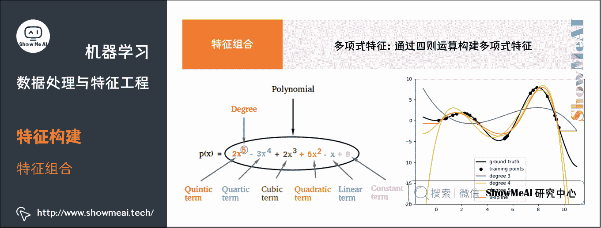
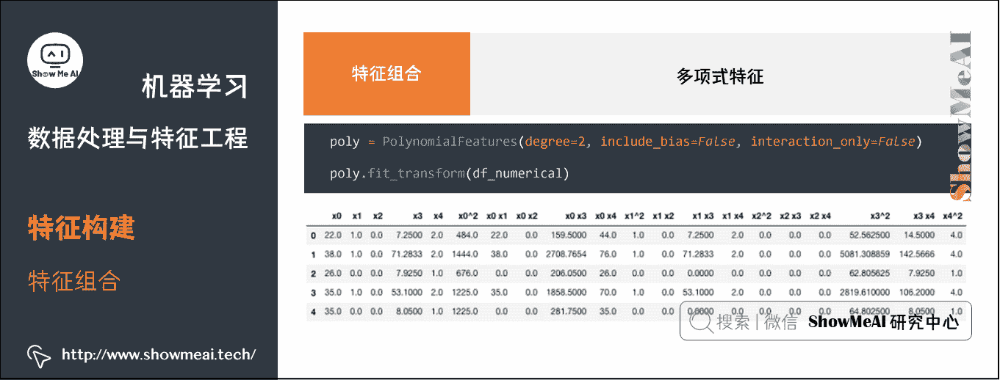
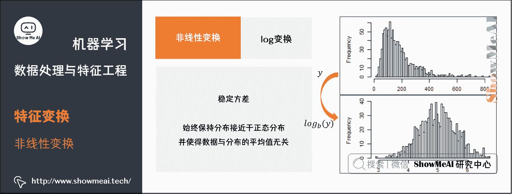

# 机器学习实战 | 机器学习特征工程最全解读

> 原文：[`blog.csdn.net/ShowMeAI/article/details/123650367`](https://blog.csdn.net/ShowMeAI/article/details/123650367)


作者：[韩信子](https://github.com/HanXinzi-AI)@[ShowMeAI](http://www.showmeai.tech/)
[教程地址](http://www.showmeai.tech/tutorials/41)：[`www.showmeai.tech/tutorials/41`](http://www.showmeai.tech/tutorials/41)
[本文地址](http://www.showmeai.tech/article-detail/208)：[`www.showmeai.tech/article-detail/208`](http://www.showmeai.tech/article-detail/208)
声明：版权所有，转载请联系平台与作者并注明出处
收藏[ShowMeAI](http://www.showmeai.tech/)查看更多精彩内容

# 引言


上图为大家熟悉的机器学习建模流程图，[ShowMeAI](http://www.showmeai.tech/)在前序机器学习实战文章 [**Python 机器学习算法应用实践**](http://www.showmeai.tech/article-detail/201)中和大家讲到了整个建模流程非常重要的一步，是对于数据的预处理和特征工程，它很大程度决定了最后建模效果的好坏，在本篇内容汇总，我们给大家展开对数据预处理和特征工程的实战应用细节做一个全面的解读。

## 特征工程

首先我们来了解一下「特征工程」，事实上大家在[ShowMeAI](http://www.showmeai.tech/)的实战系列文章 [**Python 机器学习综合项目-电商销量预估**](http://www.showmeai.tech/article-detail/206) 和 [**Python 机器学习综合项目-电商销量预估<进阶>**](http://www.showmeai.tech/article-detail/207) 中已经看到了我们做了特征工程的处理。

如果我们对**特征工程**(feature engineering)做一个定义，那它指的是：利用领域知识和现有数据，创造出新的特征，用于机器学习算法；可以手动(manual)或自动(automated)。

*   特征：数据中抽取出来的对结果预测有用的信息。
*   特征工程：使用专业背景知识和技巧处理数据，使得特征能在机器学习算法上发挥更好的作用的过程。

在业界有一个很流行的说法：

> 数据与特征工程决定了模型的上限，改进算法只不过是逼近这个上限而已。


这是因为，在数据建模上，「理想状态」和「真实场景」是有差别的，很多时候原始数据并不是规矩干净含义明确充分的形态：


而特征工程处理，相当于对数据做一个梳理，结合业务提取有意义的信息，以干净整齐地形态进行组织：


特征工程有着非常重要的意义：

*   **特征越好，灵活性越强**。只要特征选得好，即使是一般的模型（或算法）也能获得很好的性能，好特征的灵活性在于它允许你选择不复杂的模型，同时运行速度也更快，也更容易理解和维护。
*   **特征越好，构建的模型越简单**。有了好的特征，即便你的参数不是最优的，你的模型性能也能仍然会表现的很好，所以你就不需要花太多的时间去寻找最优参数，这大大的降低了模型的复杂度，使模型趋于简单。
*   **特征越好，模型的性能越出色**。显然，这一点是毫无争议的，我们进行特征工程的最终目的就是提升模型的性能。

本篇内容，[ShowMeAI](http://www.showmeai.tech/)带大家一起来系统学习一下特征工程，包括「特征类型」「数据清洗」「特征构建」「特征变换」「特征选择」等板块内容。

我们这里用最简单和常用的**Titanic 数据集**给大家讲解。

> Titanic 数据集是非常适合数据科学和机器学习新手入门练习的数据集，数据集为 1912 年泰坦尼克号沉船事件中一些船员的个人信息以及存活状况。我们可以根据数据集训练出合适的模型并预测新数据(测试集)中的存活状况。

Titanic 数据集可以通过 seaborn 工具库直接加载，如下代码所示：

```
import pandas as pd
import numpy as np
import seaborn as sns
df_titanic = sns.load_dataset('titanic') 
```

其中数据集的数据字段描述如下图所示：


# 1.特征类型

在具体演示 Titanic 的数据预处理与特征工程之前，[ShowMeAI](http://www.showmeai.tech/)再给大家构建一些关于数据的基础知识。

## 1.1 结构化 vs 非结构化数据

数据可以分为「结构化数据」和「非结构化数据」，比如在互联网领域，大部分存储在数据库内的表格态业务数据，都是结构化数据；而文本、语音、图像视频等就属于非结构化数据。


## 1.2 定量 vs 定性数据

对于我们记录到的数据，我们通常又可以以「定量数据」和「定性数据」对齐进行区分，其中：

*   **定量数据**：指的是一些数值，用于衡量数量与大小。
    *   例如高度，长度，体积，面积，湿度，温度等测量值。
*   **定性数据**：指的是一些类别，用于描述物品性质。
    *   例如纹理，味道，气味，颜色等。


如下图是两类数据示例以及它们常见的处理分析方法的总结：


# 2.数据清洗

实际数据挖掘或者建模之前，我们会有「数据预处理」环节，对原始态的数据进行数据清洗等操作处理。因为现实世界中数据大体上都是不完整、不一致的「脏数据」，无法直接进行数据挖掘，或者挖掘结果差强人意。

「**脏数据**」**产生的主要成因包括**：

*   篡改数据
*   数据不完整
*   数据不一致
*   数据重复
*   异常数据

数据清洗过程包括数据对齐、缺失值处理、异常值处理、数据转化等数据处理方法，如下图所示：


下面我们注意对上述提到的处理方法做一个讲解。

## 2.1 数据对齐

采集到的原始数据，格式形态不一，我们会对时间、字段以及相关量纲等进行数据对齐处理，数据对齐和规整化之后的数据整齐一致，更加适合建模。如下图为一些处理示例：


### (1) 时间

*   日期格式不一致【`2022-02-20`、`20220220`、`2022/02/20`、`20/02/2022`】。
*   时间戳单位不一致，有的用秒表示，有的用毫秒表示。
*   使用无效时间表示，时间戳使用 0 表示，结束时间戳使用 FFFF 表示。

### (2) 字段

*   姓名写了性别，身份证号写了手机号等。

### (3) 量纲

*   数值类型统一【如 1、2.0、3.21E3、四】。
*   单位统一【如 180cm、1.80m】。

## 2.2 缺失值处理

数据缺失是真实数据中常见的问题，因为种种原因我们采集到的数据并不一定是完整的，我们有一些缺失值的常见处理方式：

*   不处理(部分模型如[**XGBoost**](http://www.showmeai.tech/article-detail/194)/[**LightGBM**](http://www.showmeai.tech/article-detail/195)等可以处理缺失值)。
*   删除缺失数据(按照样本维度或者字段维度)。
*   采用均值、中位数、众数、同类均值或预估值填充。

具体的处理方式可以展开成下图：


下面回到我们的 Titanic 数据集，我们演示一下各种方法：

我们先对数据集的缺失值情况做一个了解(汇总分布)：

```
df_titanic.isnull().sum() 
```

```
survived         0
pclass           0
sex              0
age            177
sibsp            0
parch            0
fare             0
embarked         2
class            0
who              0
adult_male       0
deck           688
embark_town      2
alive            0
alone            0 
```

### (1) 删除

最直接粗暴的处理是剔除缺失值，即将存在遗漏信息属性值的对象 (字段，样本/记录) 删除，从而得到一个完备的信息表。优缺点如下：

*   **优点**：简单易行，在对象有多个属性缺失值、被删除的含缺失值的对象与初始数据集的数据量相比非常小的情况下有效；
*   **不足**：当缺失数据所占比例较大，特别当遗漏数据非随机分布时，这种方法可能导致数据发生偏离，从而引出错误的结论。

在我们当前 Titanic 的案例中，`embark_town`字段有 2 个空值，考虑删除缺失处理下。

```
df_titanic[df_titanic["embark_town"].isnull()]
df_titanic.dropna(axis=0,how='any',subset=['embark_town'],inplace=True) 
```


### (2) 数据填充

第 2 大类是我们可以通过一些方法去填充缺失值。比如基于统计方法、模型方法、结合业务的方法等进行填充。


#### ① 手动填充

根据业务知识来进行人工手动填充。

#### ② 特殊值填充

将空值作为一种特殊的属性值来处理，它不同于其他的任何属性值。如所有的空值都用`unknown`填充。一般作为临时填充或中间过程。

**代码实现**

```
df_titanic['embark_town'].fillna('unknown', inplace=True) 
```

#### ③ 统计量填充

若缺失率较低，可以根据数据分布的情况进行填充。常用填充统计量如下：

*   **中位数**：对于数据存在倾斜分布的情况，采用中位数填补缺失值。
*   **众数**：离散特征可使用众数进行填充缺失值。
*   **平均值**：对于数据符合均匀分布，用该变量的均值填补缺失值。

**中位数填充——fare：缺失值较多，使用中位数填充**


```
df_titanic['fare'].fillna(df_titanic['fare'].median(), inplace=True) 
```

**众数填充——embarked：只有两个缺失值，使用众数填充**

```
df_titanic['embarked'].isnull().sum()
#执行结果：2
df_titanic['embarked'].fillna(df_titanic['embarked'].mode(), inplace=True)
df_titanic['embarked'].value_counts()
#执行结果：
#S    64 
```

**同类均值填充**

**age**：根据 sex、pclass 和 who 分组，如果落在相同的组别里，就用这个组别的均值或中位数填充。

```
df_titanic.groupby(['sex', 'pclass', 'who'])['age'].mean() 
```

```
age_group_mean = df_titanic.groupby(['sex', 'pclass', 'who'])['age'].mean().reset_index() 
```

```
def select_group_age_median(row):
    condition = ((row['sex'] == age_group_mean['sex']) &
                (row['pclass'] == age_group_mean['pclass']) &
                (row['who'] == age_group_mean['who']))
    return age_group_mean[condition]['age'].values[0]

df_titanic['age'] =df_titanic.apply(lambda x: select_group_age_median(x) if np.isnan(x['age']) else x['age'],axis=1) 
```


#### ④ 模型预测填充

如果其他无缺失字段丰富，我们也可以借助于模型进行建模预测填充，将待填充字段作为 Label，没有缺失的数据作为训练数据，建立分类/回归模型，对待填充的缺失字段进行预测并进行填充。


**最近距离邻法(KNN)**

*   先根据欧式距离或相关分析来确定距离具有缺失数据样本最近的 K K K 个样本，将这 K K K 个值加权平均/投票来估计该样本的缺失数据。

**回归(Regression)**

*   基于完整的数据集，建立回归方程。对于包含空值的对象，将已知属性值代入方程来估计未知属性值，以此估计值来进行填充。当变量不是线性相关时会导致有偏差的估计，常用线性回归。

我们以 Titanic 案例中的 age 字段为例，讲解一下：

*   age 缺失量较大，这里我们用 sex、pclass、who、fare、parch、sibsp 六个特征构建随机森林模型，填充年龄缺失值。

```
df_titanic_age = df_titanic[['age', 'pclass', 'sex', 'who','fare', 'parch', 'sibsp']]
df_titanic_age = pd.get_dummies(df_titanic_age)
df_titanic_age.head() 
```

```
# 乘客分成已知年龄和未知年龄两部分
known_age = df_titanic_age[df_titanic_age.age.notnull()]
unknown_age = df_titanic_age[df_titanic_age.age.isnull()]
# y 即目标年龄
y_for_age = known_age['age']
# X 即特征属性值
X_train_for_age = known_age.drop(['age'], axis=1)
X_test_for_age = unknown_age.drop(['age'], axis=1)
from sklearn.ensemble import RandomForestRegressor
rfr = RandomForestRegressor(random_state=0, n_estimators=2000, n_jobs=-1)
rfr.fit(X_train_for_age, y_for_age)
# 用得到的模型进行未知年龄结果预测
y_pred_age = rfr.predict(X_test_for_age)
# 用得到的预测结果填补原缺失数据
df_titanic.loc[df_titanic.age.isnull(), 'age'] = y_pred_age 
```

```
sns.distplot(df_titanic.age) 
```


#### ⑤ 插值法填充

还可以用插值法对数据填充，细分一下包括线性插值、多重插补、热平台插补、拉格朗日插值、牛顿插值等。


**线性插值法**

使用插值法可以计算缺失值的估计值，所谓的插值法就是通过两点 ( x 0 , y 0 ) (x_0, y_0) (x0​,y0​)， ( x 1 , y 1 ) (x_1, y_1) (x1​,y1​) 估计中间点的值。假设 y = f ( x ) y=f(x) y=f(x) 是一条直线，通过已知的两点来计算函数 f ( x ) f(x) f(x)，然后只要知道 x x x 就能求出 y y y，以此方法来估计缺失值。


`.interpolate(method = 'linear', axis)`方法将通过`linear`插值使用沿着给定`axis`的值替换 NaN 值，这个差值也就是前后或者上下的中间值

```
df_titanic['fare'].interpolate(method = 'linear', axis = 0) 
```

同时，也可用行值插入

```
df_titanic['fare'].interpolate(method = 'linear', axis = 1) 
```

**多重插补(Multiple Imputation)**

多值插补的思想来源于贝叶斯估计，认为待插补的值是随机的，它的值来自于已观测到的值。具体实践上通常是估计出待插补的值，然后再加上不同的噪声，形成多组可选插补值。根据某种选择依据，选取最合适的插补值。


多重插补方法分为三个步骤：

*   ① 为每个空值产生一套可能的插补值，这些值反映了无响应模型的不确定性；每个值都可以被用来插补数据集中的缺失值，产生若干个完整数据集合；
*   ② 每个插补数据集合都用针对完整数据集的统计方法进行统计分析；
*   ③ 对来自各个插补数据集的结果，根据评分函数进行选择，产生最终的插补值。

#### ⑥ 哑变量填充

有另外一种非常有意思的填充方式，叫做「哑变量填充」，在变量为离散型，且不同值较少的情况下可以采用，以 Titanic 数据为例：

*   性别 SEX 变量，存在 male，fameal，NA（缺失）三个不同的值，可将该列转换成`IS_SEX_MALE`、`IS_SEX_FEMALE`、`IS_SEX_NA`。
*   若某个变量存在十几个不同的值，可根据每个值的频数，将频数较小的值归为一类`other`，降低维度。此做法可最大化保留变量的信息。


以下为参考代码示例：

```
sex_list = ['MALE', 'FEMALE', np.NaN, 'FEMALE', 'FEMALE', np.NaN, 'MALE']
df = pd.DataFrame({'SEX': sex_list})
display(df)

df.fillna('NA', inplace=True)
df = pd.get_dummies(df['SEX'],prefix='IS_SEX')
display(df) 
```

```
# 原始数据
 SEX
0    MALE
1    FEMALE
2    NaN
3    FEMALE
4    FEMALE
5    NaN
6    MALE
# 填充后
 IS_SEX_FEMALE     IS_SEX_MALE    IS_SEX_NA
0    0                 1                0
1    1                 0                0
2    0                 0                1
3    1                 0                0
4    1                 0                0
5    0                 0                1
6    0                 1 
```

当特征值缺失超过 80 % 80\% 80% 以上，建议删除【或加入「是」「否」标记位信息】，容易影响模型效果

```
df_titanic.drop(["deck"],axis=1) 
```

## 2.3 异常值处理

数据质量也会很大程度影响机器学习应用效果，数据的错误值或异常值可能会造成测量误差或异常系统条件的结果，给模型学习带来很大的问题。实际我们很多时候会有异常值检测与处理环节，下面给大家做一个梳理。

### (1) 异常检测方法

#### ① 基于统计分析

通常用户用某个统计分布对数据点进行建模，再以假定的模型，根据点的分布来确定是否异常。

如通过分析统计数据的散度情况，即数据变异指标，对数据的分布情况有所了解，进而通过数据变异指标来发现数据中的异常点数据。

常用的数据变异指标有**极差**、**四分位数间距**、**均差**、**标准差**、**变异系数**等等，如变异指标的值大表示变异大、散布广；值小表示离差小，较密集。

> 比如，最大最小值可以用来判断这个变量的取值是否超过了合理的范围，如客户的年龄为 − 20 -20 −20 岁或 200 200 200 岁，为异常值。

#### ② 3σ原则

如果数据近似正态分布，在 3 σ 3 \sigma 3σ 原则下，异常值为一组测定值中与平均值的偏差超过 3 3 3 倍标准差的值。

*   如果数据服从正态分布，距离平均值 3 σ 3 \sigma 3σ 之外的值出现的概率为 P ( ∣ x − μ ∣ > 3 σ ) ≤ 0.003 P(\left | x-\mu \right | >3\sigma) \le 0.003 P(∣x−μ∣>3σ)≤0.003，属于极个别的小概率事件。
*   如果数据不服从正态分布，也可以用远离平均值的多少倍标准差来描述。


#### ③ 箱线图分析

大家还记得在数据分析部分有一个很有效的工具叫做[**箱线图**](http://www.showmeai.tech/article-detail/151)，箱线图提供了识别异常值的一个标准：如果一个值小于 Q 1 − 1.5 I Q R Q_1-1.5IQR Q1​−1.5IQR 或大于 Q 3 + 1.5 I Q R Q_3+1.5IQR Q3​+1.5IQR 的值，则被称为异常值。

*   Q 1 Q_1 Q1​ 为下四分位数，表示全部观察值中有四分之一的数据取值比它小；
*   Q 4 Q_4 Q4​ 为上四分位数，表示全部观察值中有四分之一的数据取值比它大；
*   I Q R IQR IQR 为四分位数间距，是上四分位数 Q 1 Q_1 Q1​ 与下四分位数 Q 3 Q_3 Q3​ 的差值，包含了全部观察值的一半。

箱型图判断异常值的方法以四分位数和四分位距为基础，四分位数具有鲁棒性： 25 % 25 \% 25% 的数据可以变得任意远并且不会干扰四分位数，所以异常值不能对这个标准施加影响。因此箱型图识别异常值比较客观，在识别异常值时有一定的优越性。


```
sns.catplot(y="fare",x="survived", kind="box", data=df_titanic,palette="Set2") 
```


#### ④ 基于模型检测

我们也可以基于模型对异常值检测，基本思路是先建立一个数据模型，那些同模型不能完美拟合的对象就视作异常。

*   如果模型是簇的集合，则异常是不显著属于任何簇的对象。
*   在使用回归模型时，异常是相对远离预测值的对象。


**优点**：有坚实的统计学理论基础，当存在充分的数据和所用的检验类型的知识时，这些检验可能非常有效。

**缺点**：对于多元数据，可用的选择少一些，并且对于高维数据，这些检测可能性很差。

#### ⑤ 基于距离

我们还有基于距离的方法可以用于异常检测。这类方法基于下面这个假设：如果一个数据对象和大多数点距离都很远，那这个对象就是异常。通过定义对象之间的临近性度量，根据距离判断异常对象是否远离其他对象，主要使用的距离度量方法有绝对距离(曼哈顿距离)、欧氏距离和马氏距离等方法。


*   **优点**：
*   *   基于距离的方法比基于统计类方法要简单得多；因为为一个数据集合定义一个距离的度量要比确定数据集合的分布容易的多。

*   **缺点**：
*   *   基于邻近度的方法需要 O ( m 2 ) O(m2) O(m2) 时间，大数据集不适用；
    *   该方法对参数的选择也是敏感的；
    *   不能处理具有不同密度区域的数据集，因为它使用全局阈值，不能考虑这种密度的变化。

#### ⑥ 基于密度

一个很直接的异常检测思路是基于分布密度来做，具体为：考察当前点周围密度，局部异常点/离群点的局部密度显著低于大部分近邻点。这类方法适用于非均匀的数据集。


*   **优点**：
    *   给出了对象是离群点的定量度量，并且即使数据具有不同的区域也能够很好的处理。

*   **缺点**：
    *   与基于距离的方法一样，这些方法必然具有 O ( m 2 ) O(m2) O(m2) 的时间复杂度。
    *   对于低维数据使用特定的数据结构可以达到 O ( m l o g m ) O(mlogm) O(mlogm)；
    *   参数选择困难。
    *   虽然算法通过观察不同的 k 值，取得最大离群点得分来处理该问题，但是，仍然需要选择这些值的上下界。

#### ⑦ 基于聚类

我们可以基于聚类的方法进行异常检测，远离 cluster 的样本更可能是异常值。

不过该方法会受到聚类 cluster 个数 k k k 的影响，一种策略是对于不同的簇个数重复该分析；另一种方法是找出大量小簇，其想法是：

*   较小的簇倾向于更加凝聚；
*   如果存在大量小簇时一个对象是异常点，则它多半是一个真正的异常点。
*   不利的一面是一组异常点可能形成小簇而逃避检测。


*   **优点**：
    *   基于线性和接近线性复杂度(k 均值)的聚类技术来发现离群点可能是高度有效的；
    *   簇的定义通常是离群点的补，因此可能同时发现簇和离群点。

*   **缺点**：
    *   产生的离群点集和它们的得分可能非常依赖所用的簇的个数和数据中离群点的存在性；
    *   聚类算法产生的簇的质量对该算法产生的离群点的质量影响非常大。

#### ⑧ 基于邻近度的异常点检测

同样的，我们也有基于近邻度的思路来做异常检测，我们认为异常点远离大部分的点。这种方法比统计学方法更一般、更容易使用，因为确定数据集的有意义的邻近性度量比确定它的统计分布更容易。一个对象的异常点得分由到它的 K − K- K− 最近邻的距离给定，所以异常点得分对 K K K 的取值高度敏感：

*   如果 K K K 太小(例如 1 1 1)，则少量的邻近异常异常点可能导致较异常低的异常点得分。
*   如果 K K K 太大，则点数少于 K K K 的簇中所有的对象可能都成了异常异常点。

为了使该方案对于 K K K 的选取更具有鲁棒性，可以使用 K K K 个最近邻的平均距离。


**优点**：

*   简单

**缺点**：

*   基于邻近度的方法需要 O ( m 2 ) O(m2) O(m2) 时间，大数据集不适用；
*   该方法对参数的选择也是敏感的；
*   不能处理具有不同密度区域的数据集，因为它使用全局阈值，不能考虑这种密度的变化。

在数据处理阶段将离群点作为影响数据质量的异常点考虑，而不是作为通常所说的异常检测目标点，一般采用较为简单直观的方法，结合箱线图和 MAD 的统计方法判断变量的离群点。如下为绘制散点图根据分布直接判断。

```
sns.scatterplot(x="fare", y="age", hue="survived",data=df_titanic,palette="Set1") 
```


### (2) 异常处理方法

对异常值处理，需要具体情况具体分析，异常值处理方法常用的有以下几种：

*   删除含有异常值的记录；
    *   某些筛选出来的异常样本是否真的是不需要的异常特征样本，最好结合业务再确认一编，防止正常样本被过滤。
*   将异常值视为缺失值，交给缺失值处理方法来处理；
*   使用均值/中位数/众数来修正；
*   不处理。

# 3.特征构建

前序的数据预处理过程能保证我们拿到干净整齐准确的数据，但这些数据未必对于建模是最有效的，下一步我们通常会进行特征构建，结合业务场景产生衍生变量来提升数据表达能力和模型建模效果。

## 3.1 统计特征构建

统计特征是一类非常有效的特征，尤其在时序问题场景中，以下为统计特征构建的一些思考维度和方法：


*   ① 基于业务规则、先验知识等构建新特征。
*   ② 四分位数、中位数、平均值、标准差、偏差、偏度、偏锋、离散系统。
*   ③ 构造长、短期统计量(如周、月)。
*   ④ 时间衰减(越靠近观测权重值高)。

回到 Titanic 数据集，我们来看看结合业务理解，我们可以做哪些新特征：

**年龄处理**

我们对年龄 age 字段进行进一步处理，考虑到不同的年龄段对应的人群可能获救概率不同，我们根据年龄值分成不同区间段，对应到 child、young、midlife、old 等

```
def age_bin(x):
 if x <= 18:
 return 'child'
 elif x <= 30:
 return 'young'
 elif x <= 55:
 return 'midlife'
 else:
 return 'old'
df_titanic['age_bin'] = df_titanic['age'].map(age_bin)
df_titanic['age_bin'].unique()
执行结果：
array(['young', 'midlife', 'child', 'old'], dtype=object) 
```

**抽取「称呼」特征**

我们在 name 字段里，可以看到各种不同的称呼，如「Mr」「Master」「Dr」等，这些称呼体现了乘客的身份等信息，我们可以对其做抽取构建新的特征。

```
# 提取称呼
df_titanic['title'] = df_titanic['name'].map(lambda x: x.split(',')[1].split('.')[0].strip())

df_titanic['title'].value_counts() 
```

执行结果如下：

```
Mr              757
Miss            260
Mrs             197
Master           61
Rev               8
Dr                8
Col               4
Ms                2
Major             2
Mlle              2
Dona              1
Sir               1
Capt              1
Don               1
Lady              1
Mme               1
the Countess      1
Jonkheer          1 
```

我们做一个简单的「称呼」统计

```
# 对称呼细分，是官员，还是皇室，还是女士、先生、小姐
df_titanic['title'].unique() 
```

执行结果：

```
array(['Mr', 'Mrs', 'Miss', 'Master', 'Don', 'Rev', 'Dr', 'Mme', 'Ms',
 'Major', 'Lady', 'Sir', 'Mlle', 'Col', 'Capt', 'the Countess',
 'Jonkheer', 'Dona'], dtype=object) 
```

下面我们对这些「称呼」「称谓」做一个规范化统一。

```
title_dictionary = {
 "Mr": "Mr",
 "Mrs": "Mrs",
 "Miss": "Miss",
 "Master": "Master",
 "Don": "Royalty",
 "Rev": "Officer",
 "Dr": "Officer",
 "Mme": "Mrs",
 "Ms": "Mrs",
 "Major": "Officer",
 "Lady": "Royalty",
 "Sir": "Royalty",
 "Mlle": "Miss",
 "Col": "Officer",
 "Capt": "Officer",
 "the Countess": "Royalty",
 "Jonkheer": "Royalty",
 "Dona": 'Mrs'
}
df_titanic['title'] = df_titanic['title'].map(title_dictionary)
df_titanic['title'].value_counts() 
```

执行结果如下：

```
Mr         757
Miss       262
Mrs        201
Master      61
Officer     23
Royalty      5 
```

**抽取家庭规模**

在 Titanic 上，有的成员之间有亲属关系，考虑到家族大小对于最终是否获救也有影响，我们可以构建一个 `family_size` 的特征，用于表征家庭规模。

```
df_titanic['family_size'] = df_titanic['sibsp'] + df_titanic['parch'] + 1
df_titanic['family_size'].head() 
```

执行结果如下：

```
0    2
1    2
2    1
3    2
4    1 
```

## 3.2 周期值

在电商等场景下，数据有一定的周期规律，我们可以提取一些周期值作为有效信息。


时序周期的一些考虑维度如下：

*   ①前 n 个周期/天/月/年的周期值，如过去 5 天分位数、平均值等
*   ②同比/环比

## 3.3 数据分桶

数据分桶，是对连续值属性处理的一种常用方法，它指的是我们把连续数值切段，并把连续值归属到对应的段中。数据分桶也叫做数据分箱或离散化。


### (1) 等频、等距分桶

#### (a) 自定义分箱

指根据业务经验或者常识等自行设定划分的区间，然后将原始数据归类到各个区间中。

#### (b) 等距分箱

按照相同宽度将数据分成几等份。

从最小值到最大值之间，均分为 N N N 等份。如果 A A A、 B B B 为最小最大值，则每个区间的长度为 W = ( B − A ) / N W=(B−A)/N W=(B−A)/N，区间边界值为 A + W A+W A+W、 A + 2 W A+2W A+2W、 c d o t s cdots cdots、 A + ( N − 1 ) W A+(N−1)W A+(N−1)W。


等距分箱只考虑边界，每个等份里面的实例数量可能不等。等距分桶的缺点是受到异常值的影响比较大。

#### © 等频分箱

将数据分成几等份，每等份数据里面的个数是一样的。


在等频分箱中，区间的边界值要经过计算获得，最终每个区间包含大致相等的实例数量。比如说 N = 5 N=5 N=5，每个区间应该包含大约 20 % 20 \% 20% 的实例。

*   **数值变量分箱**

我们先对船票价格做一个等频切分(大家如果对船票价格进行分布绘图，会发现是很长尾的分布，并不适合等距切分)，看看分开的区间段。

```
# qcut 等频率分箱
df_titanic['fare_bin'], bins = pd.qcut(df_titanic['fare'], 5, retbins=True)
df_titanic['fare_bin'].value_counts() 
```

结果如下：

```
(7.854, 10.5]        184
(21.679, 39.688]     180
(-0.001, 7.854]      179
(39.688, 512.329]    176
(10.5, 21.679]       172
bins #array([  0\.    ,   7.8542,  10.5   ,  21.6792,  39.6875, 512.3292]) 
```

下面根据区间段对其进行等频切分

```
# 对船票 fare 进行分段分桶
def fare_cut(fare):
    if fare <=  7.8958:
        return 0
    if fare <= 10.5:
        return 1
    if fare <= 21.6792:
        return 2
    if fare <=  39.6875:
        return 3
    return 4

df_titanic['fare_bin'] = df_titanic['fare'].map(fare_cut) 
```

相比船票价格，年龄 age 字段的分布更加集中，且区间大小比较明确，我们采用等距切分，代码如下：

```
# cut 等距离分箱
bins = [0, 12, 18, 65, 100]
pd.cut(df_titanic['age'], bins).value_counts 
```

### (2) Best-KS 分桶

*   1.将特征值值进行从小到大的排序。
*   2.计算出 K S KS KS 最大的那个值，即为切点，记为 D D D。然后把数据切分成两部分。
*   3.重复步骤 2，进行递归， D D D 左右的数据进一步切割。直到 K S KS KS 的箱体数达到我们的预设阈值即可。
*   4.连续型变量：分箱后的 K S KS KS 值 ≤ \le ≤ 分箱前的 K S KS KS 值
*   5.分箱过程中，决定分箱后的 K S KS KS 值是某一个切点，而不是多个切点的共同作用。这个切点的位置是原始 K S KS KS 值最大的位置。

### (3) 卡方分桶

自底向上的(即基于合并的)数据离散化方法，依赖于卡方检验：具有最小卡方值的相邻区间合并在一起，直到满足确定的停止准则。


**基本思想**：

如果两个相邻的区间具有非常类似的类分布，则这两个区间可以合并；否则，它们应当保持分开。而低卡方值表明它们具有相似的类分布。

**实现步骤**：

*   ①预先定义一个卡方的阈值
*   ②初始化；根据要离散的属性对实例进行排序，每个实例属于一个区间
*   ③合并区间
    *   计算每一对相邻区间的卡方值
    *   将卡方值最小的一对区间合并

> 代码实现：[`github.com/Lantianzz/Scorecard-Bundle`](https://github.com/Lantianzz/Scorecard-Bundle)

### (4) 最小熵法分箱

还有最小熵分箱法，需要使总熵值达到最小，也就是使分箱能够最大限度地区分因变量的各类别。

熵是信息论中数据无序程度的度量标准，提出信息熵的基本目的是找出某种符号系统的信息量和冗余度之间的关系，以便能用最小的成本和消耗来实现最高效率的数据存储、管理和传递。

数据集的熵越低，说明数据之间的差异越小，最小熵划分就是为了使每箱中的数据具有最好的相似性。给定箱的个数，如果考虑所有可能的分箱情况，最小熵方法得到的箱应该是具有最小熵的分箱。

## 3.4 特征组合

我们在有些场景下会考虑特征组合构建强特征，如下为常用的特征组合构建方式：

1.  **离散+离散**：构建笛卡尔积（即两两组合「且」关系）。
2.  **离散+连续**：连续特征分桶后进行笛卡尔积或基于类别特征 group by 构建统计特征。
3.  **连续+连续**：加减乘除，多项式特征，二阶差分等。


*   **多项式特征**

针对连续值特征，我们对几个特征构建多项式特征，以达到特征组合与高阶增强的作用。



在 Titanic 的例子中，如下为数值型特征：

```
df_titanic_numerical = df_titanic[['age','sibsp','parch','fare','family_size']]
df_titanic_numerical.head() 
```

我们可以参考下述代码构建多项式特征

```
# 扩展数值特征
from sklearn.preprocessing import PolynomialFeatures
poly = PolynomialFeatures(degree=2, include_bias=False, interaction_only=False)
df_titanic_numerical_poly = poly.fit_transform(df_titanic_numerical)
pd.DataFrame(df_titanic_numerical_poly, columns=poly.get_feature_names()).head() 
```



在构建完成特征后，我们查看下衍生新特征变量的相关性情况，下面的热力图 heatmap 里颜色越深相关性越大：

```
sns.heatmap(pd.DataFrame(df_titanic_numerical_poly, columns=poly.get_feature_names()).corr()) 
```


# 4.特征变换

我们对于构建完的特征，会做一些「特征变换」的操作，以适应不同的模型，更好地完成建模。


## 4.1 标准化(Standardization)

标准化操作也称作 Z-score 变换，它使数值特征列的算数平均为 0 0 0，方差(以及标准差)为 1 1 1，如下图所示。


> 注意：如果数值特征列中存在数值极大或极小的 outlier(通过 EDA 发现)，应该使用更稳健(robust)的统计数据：用中位数而不是算术平均数，用分位数(quantile)而不是方差。这种标准化方法有一个重要的参数：(分位数下限，分位数上限)，最好通过 EDA 的数据可视化确定。免疫 outlier。

标准化操作的参考代码如下：

```
from sklearn.preprocessing import StandardScale
#标准化模型训练
Stan_scaler = StandardScaler()
Stan_scaler.fit(x)
x_zscore = Stan_scaler.transform(x)
x_test_zscore = Stan_scaler.transform(x_test)
joblib.dump(Stan_scaler,'zscore.m')  #写入文件 
```

## 4.2 归一化(Normalization)

归一化操作会基于向量模长调整数据幅度大小，但并不会改变原始数据的顺序。如下图所示：


## 4.3 幅度缩放(scaling)

幅度缩放是为了让不同特征的取值在大体一致的数量级和数据区间内，比较常用的方法是最大最小值缩放，如下图所示：


下面为幅度缩放操作的参考代码：

```
from sklearn import preprocessing
min_max_scaler = preprocessing.MinMaxScaler()
min_max_scaler.fit_transform(x)
x_minmax = min_max_scaler.transform(x)
x_test_minmax = min_max_scaler.transform(x_test)
joblib.dump(min_max_scaler,'min_max_scaler.m')  #写入文件 
```

## 4.4 归一化 VS 标准化

归一化和标准化是两个非常常见的特征变换操作，下面我们来对比一下标准化和归一化：

*   目的不同，归一化是为了消除纲量压缩到 [ 0 , 1 ] [0,1] [0,1] 区间；标准化只是调整特征整体的分布。
*   归一化与最大，最小值有关；标准化与均值，标准差有关。
*   归一化输出在 [ 0 , 1 ] [0,1] [0,1] 之间；标准化无限制。

它们分别的适用场景可以归纳总结如下：

*   在分类、聚类算法中(参考[ShowMeAI](http://www.showmeai.tech/)教程 [**图解机器学习算法：从入门到精通系列教程**](http://www.showmeai.tech/tutorials/34))，需要使用距离来度量相似性的时候(如 SVM、KNN)或者使用 PCA 技术进行降维的时候，标准化(Z-score standardization)表现更好。

*   在不涉及距离度量、协方差计算、数据不符合正太分布的时候，可以使用第一种方法或其他归一化方法。例如图像处理时，将 RGB 图像转换为灰度图像后将其值限定在 [ 0 , 255 ] [0,255] [0,255] 的范围。

*   基于树的模型(如随机森林、GBDT、XGBoost、LightGBM 等，具体模型参考[ShowMeAI](http://www.showmeai.tech/)教程 [**图解机器学习算法：从入门到精通系列教程**](http://www.showmeai.tech/tutorials/34))不需要进行特征的归一化。如果是基于参数的模型或者基于距离的模型(逻辑回归、K-Means 聚类、神经网络等)，因为需要对参数或者距离进行计算，都需要进行归一化。

## 4.5 非线性变换

我们在有些场景下，还会对数值字段进行分布调整或者校正，利用统计或数学变换来减轻数据分布倾斜的影响。使原本密集的区间的值尽可能的分散，原本分散的区间的值尽量的聚合。

大部分变换函数都属于幂变换函数簇，主要作用是稳定方差，保持分布接近于正态分布并使得数据与分布的平均值无关。

我们来看看一些典型的非线性统计变换。

### (1) log 变换

log 变换通常用来创建单调的数据变换。主要作用为稳定方差，始终保持分布接近于正态分布并使得数据与分布的平均值无关。

*   log 变换倾向于拉伸那些落在较低的幅度范围内自变量值的范围，倾向于压缩或减少更高幅度范围内的自变量值的范围，从而使得倾斜分布尽可能的接近正态分布。
*   针对一些数值连续特征的方差不稳定，特征值重尾分布我们需要采用 log 化来调整整个数据分布的方差，属于方差稳定型数据转换。

log 变换属于幂变换函数簇，数学表达式为

y = l o g b ( x ) y=log_{b}(x) y=logb​(x)



下面我们对 Titanic 数据集中的船票价格字段进行 log1p 变换，示例代码如下：

```
sns.distplot(df_titanic.fare,kde=False) 
```


```
df_titanic['fare_log'] = np.log((1+df_titanic['fare']))
sns.distplot(df_titanic.fare_log,kde=False) 
```


### (2) box-cox 变换

box-cox 变换是 box 和 cox 在 1964 年提出的一种广义幂变换方法，是统计建模中常用的一种数据变换，用于连续的响应变量不满足正态分布的情况。box-cox 变换之后，可以一定程度上减小不可观测的误差和预测变量的相关性。

box-cox 变换的主要特点是引入一个参数，通过数据本身估计该参数进而确定应采取的数据变换形式，box-cox 变换可以明显地改善数据的正态性、对称性和方差相等性，对许多实际数据都是行之有效的。

box-cox 变换函数数学表达式如下：

y ( λ ) = { y λ − 1 λ , λ ≠ 0 ln ⁡ y , λ = 0 y(\lambda)=\left\{\begin{array}{ll} \frac{y^{\lambda}-1}{\lambda}, & \lambda \neq 0 \\ \ln y, & \lambda=0 \end{array}\right. y(λ)={λyλ−1​,lny,​λ​=0λ=0​

生成的变换后的输出 y y y，是输入 x x x 和变换参数的函数；当 λ = 0 \lambda=0 λ=0 时，该变换就是自然对数 log 变换，前面我们已经提到过了。 λ \lambda λ 的最佳取值通常由最大似然或最大对数似然确定。


下面我们对 Titanic 数据集中的船票价格字段进行 box-cox 变换，示例代码如下：

```
# 从数据分布中移除非零值
fare_positive_value = df_titanic[(~df_titanic['fare'].isnull()) & (df_titanic['fare']>0)]['fare']
import scipy.stats as spstats
# 计算最佳λ值
l, opt_lambda = spstats.boxcox(fare_positive_value)
print('Optimal lambda value:', opt_lambda) # -0.5239075895755266
# 进行 Box-Cox 变换
fare_boxcox_lambda_opt = spstats.boxcox(df_titanic[df_titanic['fare']>0]['fare'],lmbda=opt_lambda)
sns.distplot(fare_boxcox_lambda_opt,kde=Fal 
```


## 4.6 离散变量处理

对于类别型的字段特征（比如颜色、类型、好坏程度），有很多模型并不能直接处理，我们对其进行编码后能更好地呈现信息和支撑模型学习。有以下常见的类别型变量编码方式：

### (1) 标签编码(label encoding)

标签编码(label encoding)是最常见的类别型数据编码方式之一，编码值介于 0 0 0 和 n_classes-1 之间的标签。


例如：比如有 [ d o g , c a t , d o g , m o u s e , r a b b i t ] [dog,cat,dog,mouse,rabbit] [dog,cat,dog,mouse,rabbit]，我们把其转换为 [ 0 , 1 , 0 , 2 , 3 ] [0,1,0,2,3] [0,1,0,2,3]。

*   **优点**：相对于 OneHot 编码，LabelEncoder 编码占用内存空间小，并且支持文本特征编码。
*   **缺点**：它的编码方式给不同类别带来了额外的大小顺序关系，在有些计算型模型(比如逻辑回归)里有影响，它可以使用在树模型中。

标签编码的参考代码如下：

```
from sklearn.preprocessing import LabelEncoder
le = LabelEncoder()
le.fit(["超一线", "一线", "二线", "三线"])
print('特征：{}'.format(list(le.classes_)))
# 输出 特征：['一线', '三线', '二线', '超一线']
print('转换标签值：{}'.format(le.transform(["超一线", "一线", "二线"])))
# 输出 转换标签值：array([3 0 2]...)
print('特征标签值反转：{}'.format(list(le.inverse_transform([2, 2, 1]))))
# 输出 特征标签值反转：'二线', '二线', '三线 
```

### (2) 独热向量编码(one hot encoding )

独热编码通常用于处理类别间不具有大小关系的特征。

![机器学习; 数据处理与特征工程; 特征变换; 离散变量处理; 8-51

例如：特征：血型，一共有四种类别 ( A , B , A B , O ) (A,B,AB,O) (A,B,AB,O)，采用独热编码后，会把血型变成有一个 4 维的稀疏向量

*   A 表示为 [ 1 , 0 , 0 , 0 ] [1,0,0,0] [1,0,0,0]
*   B 表示为 [ 0 , 1 , 0 , 0 ] [0,1,0,0] [0,1,0,0]
*   AB 表示为 [ 0 , 0 , 1 , 0 ] [0,0,1,0] [0,0,1,0]
*   O 表示为 [ 0 , 0 , 0 , 1 ] [0,0,0,1] [0,0,0,1]

最终生成的稀疏向量的维度，和类别数相同。

*   **优点**：独热编码解决了分类器不好处理属性数据的问题，在一定程度上也起到了扩充特征的作用。它的值只有 0 0 0 和 1 1 1，不同的类型存储在垂直的空间。
*   **缺点**：只能对数值型变量二值化，无法直接对字符串型的类别变量编码。当类别的数量很多时，特征空间会变得非常大。在这种情况下，一般可以用 PCA 来减少维度。而且 one hot encoding+PCA 这种组合在实际中也非常有用。

如果借助于 pandas 工具库(查看[ShowMeAI](http://www.showmeai.tech/)的 [**数据分析系列教程**](http://www.showmeai.tech/tutorials/33) 和 [**数据科学工具速查 | Pandas 使用指南**](http://www.showmeai.tech/article-detail/101) 进行详细了解)，独热向量编码的 Python 代码参考示例如下：

```
sex_list = ['MALE', 'FEMALE', np.NaN, 'FEMALE', 'FEMALE', np.NaN, 'MALE']
df = pd.DataFrame({'SEX': sex_list})
display(df)
df.fillna('NA', inplace=True)
df = pd.get_dummies(df['SEX'],prefix='IS_SEX')
display(df) 
```

最终变换前后的结果如下：

```
# 原始数据
 SEX
0   MALE
1   FEMALE
2   NaN
3   FEMALE
4   FEMALE
5   NaN
6   MALE

# 独热向量编码后
 IS_SEX_FEMALE     IS_SEX_MALE    IS_SEX_NA
0    0                 1                0
1    1                 0                0
2    0                 0                1
3    1                 0                0
4    1                 0                0
5    0                 0                1 
```

下面我们对’sex’, ‘class’, ‘pclass’, ‘embarked’, ‘who’, ‘family_size’, 'age_bin’这些字段都进行独热向量编码。

```
pd.get_dummies(df_titanic, columns=['sex', 'class', 'pclass', 'embarked', 'who', 'family_size', 'age_bin'],drop_first=True) 
```


当然，我们也可以借助 SKLearn(查看[ShowMeAI](http://www.showmeai.tech/)教程 [**SKLearn 最全应用指南**](http://www.showmeai.tech/article-detail/203) 和 [**AI 建模工具速查 | Scikit-learn 使用指南**](http://www.showmeai.tech/article-detail/108) 详细学习)，进行独热向量编码实现：

```
import numpy as np
from sklearn.preprocessing import OneHotEncoder
# 非负整数表示的标签列表
labels = [0,1,0,2]
# 行向量转列向量
labels = np.array(labels).reshape(len(labels), -1)
# 独热向量编码
enc = OneHotEncoder()
enc.fit(labels)
targets = enc.transform(labels).toarray()
# 如果不加 toarray() 的话，输出的是稀疏的存储格式，即索引加值的形式，也可以通过参数指定 sparse = False 来达到同样的效果 
```

输出结果如下：

```
array([[ 1.,  0.,  0.],
 [ 0.,  1.,  0.],
 [ 1.,  0.,  0.],
 [ 0.,  0.,  1.]]) 
```

### (3) 标签二值化(LabelBinarizer)

功能与 OneHotEncoder 一样，但是 OneHotEncoder 只能对数值型变量二值化，无法直接对字符串型的类别变量编码，而 LabelBinarizer 可以直接对字符型变量二值化。

示例代码如下：

```
from sklearn.preprocessing import LabelBinarizer
lb=LabelBinarizer()
labelList=['yes', 'no', 'no', 'yes','no2']
# 将标签矩阵二值化
dummY=lb.fit_transform(labelList)
print("dummY:",dummY)
# 逆过程
yesORno=lb.inverse_transform(dummY)
print("yesOrno:",yesORno) 
```

输出如下：

```
dummY: [[0 0 1]
 [1 0 0]
 [1 0 0]
 [0 0 1]
 [0 1 0]]
yesOrno: ['yes' 'no' 'no' 'yes' 'no2'] 
```

## 4.7 降维

在实际的机器学习项目中，我们可能还会做[**降维**](http://www.showmeai.tech/article-detail/198)处理，主要因为数据存在以下几个问题：

*   数据的多重共线性：特征属性之间存在着相互关联关系。多重共线性会导致解的空间不稳定， 从而导致模型的泛化能力弱。
*   高纬空间样本具有稀疏性，导致模型比较难找到数据特征。
*   过多的变量会妨碍模型查找规律。
*   仅仅考虑单个变量对于目标属性的影响可能忽略变量之间的潜在关系。


通过特征降维希望达到的目的：

*   减少特征属性的个数
*   确保特征属性之间是相互独立的

常用的降维方法有：

*   PCA
*   SVD
*   LDA
*   T-sne 等非线性降维

这里降维的讲解，我们给大家基于 iris 数据集讲解：

```
from sklearn import datasets

iris_data = datasets.load_iris()

X = iris_data.data
y = iris_data.target

def draw_result(X, y):
    plt.figure()
    # 提取 Iris-setosa
    setosa = X[y == 0]
    # 绘制点：参数 1 x 向量，y 向量
    plt.scatter(setosa[:, 0], setosa[:, 1], color="red", label="Iris-setosa")

    versicolor = X[y == 1]
    plt.scatter(versicolor[:, 0], versicolor[:, 1], color="orange", label="Iris-versicolor")

    virginica = X[y == 2]
    plt.scatter(virginica[:, 0], virginica[:, 1], color="blue", label="Iris-virginica")

    plt.legend()
    plt.show()

draw_result(X, y) 
```


### (1) PCA(Principal Component Analysis)

关于 PCA 主成分分析降维算法，大家可以查阅[ShowMeAI](http://www.showmeai.tech/)文章 [**图解机器学习 | 降维算法详解**](http://www.showmeai.tech/article-detail/198) 进行详细学习。

PCA 降维的参考代码实现如下：

```
import numpy as np
from sklearn.decomposition import PCA
pca = PCA(n_components=2)
newX = pca.fit_transform(X)
draw_result(newX, y) 
```


### (2) SVD(Singular Value Decomposition)

SVD 方法的主要步骤如下：

A T A = ( U Σ V T ) T U Σ V T = V Σ T U T U Σ V T = V Σ T Σ V T = V Σ 2 V T A^{T} A=\left(U \Sigma V^{T}\right)^{T} U \Sigma V^{T}=V \Sigma^{T} U^{T} U \Sigma V^{T}=V \Sigma^{T} \Sigma V^{T}=V \Sigma^{2} V^{T} ATA=(UΣVT)TUΣVT=VΣTUTUΣVT=VΣTΣVT=VΣ2VT

所以 V V V 是 A T A A^{T} A ATA 特征值分解的特征向量按列组成的正交矩阵， Σ 2 \Sigma^{2} Σ2 是 A T A A^{T} A ATA 特征值组成的对角矩阵，也可以看出 $A_{m \times n} $ 的奇异值 σ i \sigma_{i} σi​ 是 A T A A^{T} A ATA 特征值 λ i \lambda_{i} λi​ 的平方根。

σ i = λ i \sigma_{i}=\sqrt{\lambda_{i}} σi​=λi​  ​

假如 A T A A^{T} A ATA 的特征向量为 v i v_{i} vi​， U U U 中对应的 u i u_{i} ui​ 则可以由下式求出：

u i = A v i σ i u_{i}=\frac{A v_{i}}{\sigma_{i}} ui​=σi​Avi​​

也即奇异值分解的关键在于对 A T A A^{T} A ATA 进行特征值分解。

对应的代码参考实现如下：

```
from sklearn.decomposition import TruncatedSVD
iris_2d = TruncatedSVD(2).fit_transform(X)
draw_result(iris_2d, y) 
```


### PCA vs SVD

PCA 求解关键在于求解协方差矩阵 C = 1 m X X T C=\frac{1}{m} X X^{T} C=m1​XXT 的特征值分解。

SVD 关键在于 A T A A^{T} A ATA 的特征值分解。

很明显二者所解决的问题非常相似，都是对一个实对称矩阵进行特征值分解，如果取：

A = X T m A=\frac{X^{T}}{\sqrt{m}} A=m  ​XT​

则有:

A T A = ( X T m ) T X T m = 1 m X X T A^{T} A=\left(\frac{X^{T}}{\sqrt{m}}\right)^{T} \frac{X^{T}}{\sqrt{m}}=\frac{1}{m} X X^{T} ATA=(m  ​XT​)Tm  ​XT​=m1​XXT

此时 SVD 与 PCA 等价，所以 PCA 问题可以转化为 SVD 问题求解。

### (3) LDA(Linear Discriminant Analysis)

是有监督的降维，通过最小化类内离散度与最大化类间离散度来获得最优特征子集。


> 上图解读：LD1 通过线性判定，可以很好的将呈正态分布的两个类分开。LD2 的线性判定保持了数据集的较大方差，但 LD2 无法提供关于类别的信息，因此 LD2 不是一个好的线性判定。

对应的降维参考实现代码如下：

```
from sklearn.discriminant_analysis import LinearDiscriminantAnalysis as LDA
lda = LDA(n_components=2)
iris_2d = lda.fit_transform(X, y)
draw_result(iris_2d, y) 
```


### LDA vs PCA

PCA 试图寻找到方差最大的正交的主成分分量轴 LDA 发现可以最优化分类的特征子空间 LDA 和 PCA 都是可用于降低数据集维度的线性转换技巧 PCA 是无监督算法 LDA 是监督算法 LDA 是一种更优越的用于分类的特征提取技术

### (4) T-SNE

T-SNE(t-distributed stochastic neighbor embedding)是一种非线性降维方法，参考的代码实现如下：

```
from sklearn.manifold import TSNE
tsne = TSNE(n_components=2)
iris_2d = tsne.fit_transform(X)
draw_result(iris_2d, y) 
```


# 5.特征选择

特征选择是在建模过程中经常会用到的一个处理，也有重要意义：

*   特征冗余，部分特征相关度太高，消耗计算资源
*   存在噪声，对模型结果有负面影响
*   部分特征容易引起过拟合


总体来说，进行特征选择有 2 个主要考虑方向：

*   特征发散程度：如果一个特征不发散，例如方差接近于 0 0 0，也就是说样本在这个特征上基本上没有差异，这个特征对于样本的区分并没有什么用。
*   特征与目标的相关性：特征与目标相关性高，越应当被保留，这点大家也比较容易理解。

对特征选择的方法进行归类，又大体可以归纳为下述 3 种：

*   **Filter**：过滤法，按照发散性或者相关性对各个特征进行评分，设定阈值或者待选择阈值的个数来选择特征。
*   **Wrapper**：包装法，根据目标函数(通常是预测效果评分)，每次选择若干特征或者排除若干特征。
*   **Embedded**：嵌入法，先使用某些机器学习的算法和模型进行训练，得到各个特征的权值系数，根据系数从大到小选择特征。类似于 Filter 方法，但是是通过训练来确定特征的优劣。我们使用 SKLearn 中的 `feature_selection` 库来进行特征选择。

## 5.1 过滤式 Filter

### (1) 方差过滤

这是通过特征本身的方差来筛选特征的类。

比如一个特征本身的方差很小，就表示样本在这个特征上基本没有差异，可能特征中的大多数值都一样，甚至整个特征的取值都相同，那这个特征对于样本区分没有什么作用。

我们会剔除掉方差非常小的字段特征，参考代码实现如下：

```
from sklearn.feature_selection import VarianceThreshold
variancethreshold = VarianceThreshold() #实例化，默认方差为 0.方差<=0 的过滤掉
df_titanic_numerical = df_titanic[['age','sibsp','parch','fare','family_size']]
X_var = variancethreshold.fit_transform(df_titanic_numerical)    #获取删除不合格特征后的新特征矩阵
del_list = df_titanic_numerical.columns[variancethreshold.get_support()==0].to_list()  #获得删除 
```

### (2) 卡方过滤

卡方检验，专用于分类算法，捕捉相关性，追求 p 小于显著性水平的特征。卡方过滤是专门针对离散型标签(即分类问题)的相关性过滤。


p 值和取到这一个统计量的概率取值其实是正相关的： p p p 值越大，取到这个统计量的概率就越大，即越合理； p p p 值越小，取到这个统计量的概率就越小，即越不合理，此时应该拒绝原假设，接收备择假设。

如下为卡方过滤的参考代码示例：

```
df_titanic_categorical = df_titanic[['sex', 'class', 'embarked', 'who',  'age_bin','adult_male','alone','fare_bin']]
df_titanic_numerical = df_titanic[['age','sibsp','parch','fare','family_size','pclass']]
df_titanic_categorical_one_hot = pd.get_dummies(df_titanic_categorical, columns=['sex', 'class', 'embarked', 'who',  'age_bin','adult_male','alone','fare_bin'], drop_first=True)
df_titanic_combined = pd.concat([df_titanic_numerical,df_titanic_categorical_one_hot],axis=1)

y = df_titanic['survived']
X = df_titanic_combined.iloc[:,1:]

from sklearn.feature_selection import chi2
from sklearn.feature_selection import SelectKBest
chi_value, p_value = chi2(X,y)
#根据 p 值，得出 k 值
k = chi_value.shape[0] - (p_value > 0.05).sum()  #要保留的特征的数量 14
#根据卡方值，选择前几特征,筛选后特征
X_chi = SelectKBest(chi2, k=14).fit_transform(X, y) 
```

### (3) F 检验

F F F 检验捕捉线性相关性，要求数据服从正态分布，追求 P P P 值小于显著性水平特征。

其特征选择的参考代码如下：

```
from sklearn.feature_selection import f_classif
f_value, p_value = f_classif(X,y)
#根据 p 值，得出 k 值
k = f_value.shape[0] - (p_value > 0.05).sum()
#筛选后特征
X_classif = SelectKBest(f_classif, k=14).fit_transform(X, y) 
```

### (4) 互信息法

互信息法是用来捕捉每个特征与标签之间的任意关系(包括线性和非线性关系)的过滤方法。

其特征选择的参考代码如下：

```
from sklearn.feature_selection import mutual_info_classif as MIC
#互信息法
mic_result = MIC(X,y)   #互信息量估计
k = mic_result.shape[0] - sum(mic_result <= 0)    #16
X_mic = SelectKBest(MIC, k=16).fit_transform(X, y) 
```

## 5.2 包裹式 Wrapper

### (1) 递归特征删除法

递归消除删除法使用一个基模型来进行多轮训练，每轮训练后，消除若干权值系数的特征，再基于新的特征集进行下一轮训练。使用`feature_selection` 库的 RFE 类来选择特征的代码如下：

```
from sklearn.feature_selection import RFE
from sklearn.linear_model import LogisticRegression
#递归特征消除法，返回特征选择后的数据
#参数 estimator 为基模型
#参数 n_features_to_select 为选择的特征个数
X_ref = RFE(estimator=LogisticRegression(), n_features_to_select=10).fit_transform(X, y) 
```

### (2) 特征重要性评估

我们基于一些模型(如各类树模型)可以得到特征重要度，进而进行筛选

```
from sklearn.ensemble import ExtraTreesClassifier
# 建模与获取特征重要度
model = ExtraTreesClassifier()
model.fit(X, y)
print(model.feature_importances_)

# 特征重要度排序
feature=list(zip(X.columns,model.feature_importances_))
feature=pd.DataFrame(feature,columns=['feature','importances'])
feature.sort_values(by='importances',ascending=False).head(20) 
```

### (3) 排列重要性评估

我们还有一类方法可以评估特征重要度，进而进行筛选，叫作排列重要度。

**原理**：在训练机器学习模型之后计算置换重要性。这种方法在向模型提出假设，如果在保留目标和所有其他列的同时随机打乱一列验证集特征数据，对预测机器学习模型的准确性的影响程度。对于一个具有高度重要性的特征，random-reshuffle 会对机器学习模型预测的准确性造成更大的损害。

**优点**：快速计算；易于使用和理解；特征重要性度量的属性；追求特征稳定性。

参考代码实现如下：

```
import numpy as np
import pandas as pd
from sklearn.model_selection import train_test_split
from sklearn.ensemble import RandomForestClassifier
import eli5
from eli5.sklearn import PermutationImportance
my_model = RandomForestClassifier(random_state=0).fit(train_X, train_y)
perm = PermutationImportance(my_model, random_state=1).fit(val_X, val_y)
eli5.show_weights(perm, feature_names = val_X.columns.tolist()) 
```


## 5.3 嵌入式 Embedded

### (1) 基于惩罚项的特征选择法

使用带惩罚项的基模型，除了筛选出特征外，同时也进行了降维。

使用`feature_selection`库的`SelectFromModel`类结合带 L1 惩罚项的逻辑回归模型，来选择特征的代码如下：

```
from sklearn.feature_selection import SelectFromModel
from sklearn.linear_model import LogisticRegression
#带 L1 和 L2 惩罚项的逻辑回归作为基模型的特征选择,这个设置带 L1 惩罚项的逻辑回归作为基模型的特征选择
lr = LogisticRegression(solver='liblinear',penalty="l1", C=0.1)
X_sfm = SelectFromModel(lr).fit_transform(X, y)
X_sfm.shape
(891, 7 
```

使用 feature_selection 库的 SelectFromModel 类结合 SVM 模型，来选择特征的代码如下：

```
from sklearn.feature_selection import SelectFromModel
from sklearn.svm import LinearSVC
lsvc = LinearSVC(C=0.01,penalty='l1',dual=False).fit(X, y)
model = SelectFromModel(lsvc,prefit=True)
X_sfm_svm = model.transform(X)
X_sfm_svm.shape
(891, 7 
```

### (2) 基于树模型

树模型中 GBDT 也可用来作为基模型进行特征选择，使用 feature_selection 库的 SelectFromModel 类结合 GBDT 模型，来选择特征的代码如下：

```
from sklearn.feature_selection import SelectFromModel
from sklearn.ensemble import GradientBoostingClassifier
#GBDT 作为基模型的特征选择
gbdt = GradientBoostingClassifier()
X_sfm_gbdt = SelectFromModel(gbdt).fit_transform(X, y) 
```

## 5.4 特征选择总结

关于特征选择，做一个经验总结，如下：

*   ① 类别型特征变量，那么可以从 SelectKBest 开始，用卡方或者基于树的选择器来选择变量；
*   ② 定量特征变量，可以直接用线性模型和基于相关性的选择器来选择变量；
*   ③ 二分类问题，可以考虑使用 SelectFromModel 和 SVC；
*   ④ 特征选择前，要充分了解数据，一般需要做探索性数据分析 EDA。

# 6.特征工程实战建议

最后，[ShowMeAI](http://www.showmeai.tech/)结合实际工业应用经验，总结一些特征工程要点，如下：


## 6.1 数据理解

构建特征的有效性，和业务及数据分布强相关，因此建议在此步骤之前做 EDA 探索性数据分析来充分理解数据(可以参考[ShowMeAI](http://www.showmeai.tech/)文章 [**Python 机器学习综合项目-电商销量预估**](http://www.showmeai.tech/article-detail/206) 和 [**Python 机器学习综合项目-电商销量预估<进阶>**](http://www.showmeai.tech/article-detail/207) 了解 EDA 的基本过程和方法)。

## 6.2 数据预处理

我们可能会做的一些数据预处理与特征处理如下：

**连续特征离散化**

*   本质是限制浮点数特征的精度，异常数据有很强的鲁棒性，模型也会更稳定。
*   树模型不需要做

**数值截断**

*   把特征值的取值限制在一定范围内(对异常剔除有帮助)
*   可以用 pandas dataframe 的 `.clip(low,upper)` 方法

## 6.3 数据清洗

结合业务场景和数据分布，进行合理的缺失值、异常值处理。

## 6.4 特征构建与变换

建议不要上来就做 PCA 或 LDA 降维，最好先构建特征并对特征做筛选。


**线性组合(linear combination)**

*   适用于决策树以及基于决策树的 ensemble(如 gradient boosting,random forest)，因为常见的 axis-aligned split function 不擅长捕获不同特征之间的相关性；
*   不适用于 SVM、线性回归、神经网络等。

**类别特征与数值特征的组合**

*   用 N1 和 N2 表示数值特征，用 C1 和 C2 表示类别特征，利用 pandas 的 groupby 操作，可以创造出以下几种有意义的新特征：(其中，C2 还可以是离散化了的 N1)

```
median(N1)_by(C1)   中位数
mean(N1)_by(C1)   算术平均数
mode(N1)_by(C1)   众数
min(N1)_by(C1)   最小值
max(N1)_by(C1)   最大值
std(N1)_by(C1)   标准差
var(N1)_by(C1)   方差
freq(C2)_by(C1)   频数 
```

**统计特征+线性组合**

*   统计特征可以和线性组合等基础特征工程方法结合(仅用于决策树)，可以得到更多有意义的特征，如：

```
N1 - median(N1)_by(C1)
N1 - mean(N1)_by(C1) 
```

**基于树模型创造新特征**

*   在决策树系列算法中(例决策树、gbdt、随机森林，具体可以查看[ShowMeAI](http://www.showmeai.tech/)教程 [**图解机器学习算法：从入门到精通系列教程**](http://www.showmeai.tech/tutorials/34) 详细学习理解)，每一个样本都会被映射到决策树的叶子上。
*   我们可以把样本经过每一棵决策树映射后的 index(自然数)或 one-hot-encoding-vector (哑编码得到的稀疏矢量)作为一项新的特征，加入到模型中。

> 在 Scikit-Learn 和 XGBoost 里，可以基于 `apply()` 以及 `decision_path()` 等方法实现。

## 6.5 模型

我们在不同类型的模型里，也会考虑不同的特征工程方法


**树模型**

*   对特征数值幅度不敏感，可以不进行无量纲化和统计变换处理；
*   数模型特征依赖于样本距离来进行学习，可以不进行类别特征编码(但字符型特征不能直接作为输入，所以需要至少要进行标签编码)。
*   LightGBM 和 XGBoost 都能将缺失值作为数据的一部分进行学习，所以不需要处理缺失值。其他情况需要填充缺失。

**依赖样本距离的模型**

*   如线性回归、SVM、深度学习等属于这一类。
*   对于数值型特征需要进行无量纲化处理。
*   对于一些长尾分布的数据特征，可以做统计变换，使得模型能更好优化。
*   对于线性模型，特征分箱可以提升模型表达能力。

## 参考资料

*   [图解机器学习算法 | 从入门到精通系列](http://www.showmeai.tech/tutorials/34)
*   [数据分析系列教程](http://www.showmeai.tech/tutorials/33)
*   [数据科学工具速查 | Pandas 使用指南](http://www.showmeai.tech/article-detail/101)

# [ShowMeAI](http://www.showmeai.tech/)系列教程推荐

*   [图解 Python 编程：从入门到精通系列教程](http://www.showmeai.tech/tutorials/56)
*   [图解数据分析：从入门到精通系列教程](http://www.showmeai.tech/tutorials/33)
*   [图解 AI 数学基础：从入门到精通系列教程](http://www.showmeai.tech/tutorials/83)
*   [图解大数据技术：从入门到精通系列教程](http://www.showmeai.tech/tutorials/84)
*   [图解机器学习算法：从入门到精通系列教程](http://www.showmeai.tech/tutorials/34)
*   [机器学习实战：手把手教你玩转机器学习系列](http://www.showmeai.tech/tutorials/41)

# 相关文章推荐

*   [Python 机器学习算法应用实践](http://www.showmeai.tech/article-detail/201)
*   [SKLearn 入门与简单应用案例](http://www.showmeai.tech/article-detail/202)
*   [SKLearn 最全应用指南](http://www.showmeai.tech/article-detail/203)
*   [XGBoost 建模应用详解](http://www.showmeai.tech/article-detail/204)
*   [LightGBM 建模应用详解](http://www.showmeai.tech/article-detail/205)
*   [Python 机器学习综合项目-电商销量预估](http://www.showmeai.tech/article-detail/206)
*   [Python 机器学习综合项目-电商销量预估<进阶方案>](http://www.showmeai.tech/article-detail/207)
*   [机器学习特征工程最全解读](http://www.showmeai.tech/article-detail/208)
*   [自动化特征工程工具 Featuretools 应用](http://www.showmeai.tech/article-detail/209)
*   [AutoML 自动化机器学习建模](http://www.showmeai.tech/article-detail/210)
    