# 机器学习实战 | 自动化特征工程工具 Featuretools 应用

> 原文：[`blog.csdn.net/ShowMeAI/article/details/123650547`](https://blog.csdn.net/ShowMeAI/article/details/123650547)


作者：[韩信子](https://github.com/HanXinzi-AI)@[ShowMeAI](http://www.showmeai.tech/)
[教程地址](http://www.showmeai.tech/tutorials/41)：[`www.showmeai.tech/tutorials/41`](http://www.showmeai.tech/tutorials/41)
[本文地址](http://www.showmeai.tech/article-detail/209)：[`www.showmeai.tech/article-detail/209`](http://www.showmeai.tech/article-detail/209)
声明：版权所有，转载请联系平台与作者并注明出处
**收藏[ShowMeAI](http://www.showmeai.tech/)查看更多精彩内容**

# 引言

在[ShowMeAI](http://www.showmeai.tech/)的文章 [**机器学习特征工程最全解读**](http://www.showmeai.tech/article-detail/208) 里，我们给大家详细介绍了特征工程的操作，但我们实际上有很多工具可以辅助我们更快捷地完成特征工程，在本篇内容中，[ShowMeAI](http://www.showmeai.tech/)给大家介绍 Featuretools 这个 Python 自动化特征工程的工具库。我们会借助于 BigMart Sales 数据集来演示自动化特征工程的相关应用。

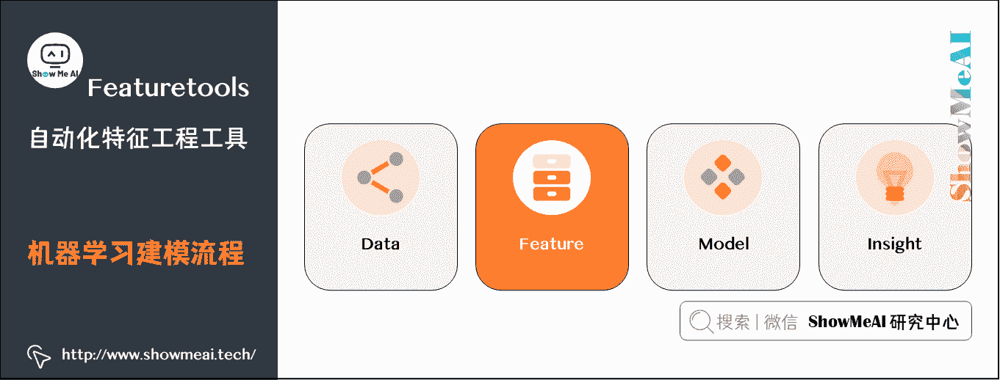

# 1.机器学习与特征

在机器学习的背景下，特征是用来解释现象发生的单个特性或一组特性。当这些特性转换为某种可度量的形式时，它们被称为特征。

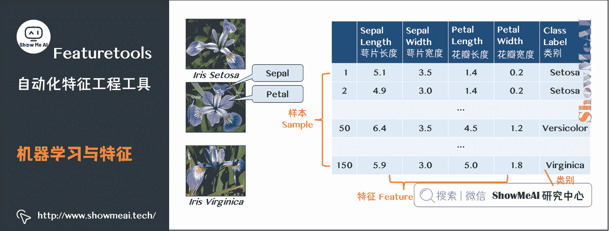

# 2.特征工程介绍

特征工程(feature engineering)：利用领域知识和现有数据，创造出新的特征，用于机器学习算法；可以手动(manual)或自动(automated)。

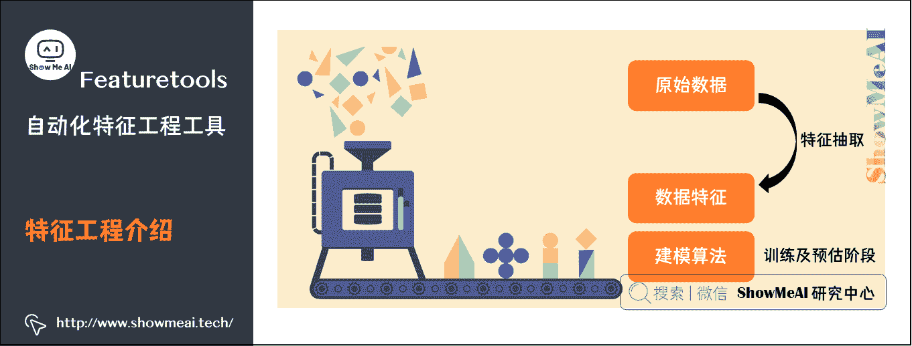

数据与特征工程决定了模型的上限，改进算法只不过是逼近这个上限而已。

# 3.特征工程意义

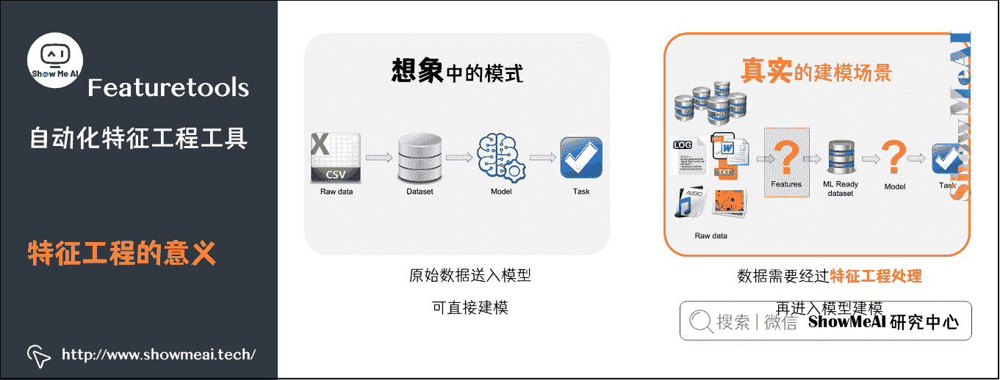


# 4.自动化特征工程


上左图显示了 20 世纪初一群人正在组装汽车，上右图显示了当今一群机器人在做同样的工作。自动化任何流程都可以使其变得更加高效和经济。同样，特征工程也是如此。而且，在机器学习中，常用特征的特征工程已经实现自动化。

我们有一个很好的工具可以用来帮忙完成自动化特征工程的过程，这个 Python 工具库的名称叫 Featuretools。

# 5.Featuretools 简介

Featuretools 是一个 Python 自动化特征工程的工具库。它可以帮助大家快速构建丰富的数据特征，而把更多的时间聚焦于构建机器学习模型的其他方面。
要学会使用 Featuretools，我们要先了解它的三个主要组件：

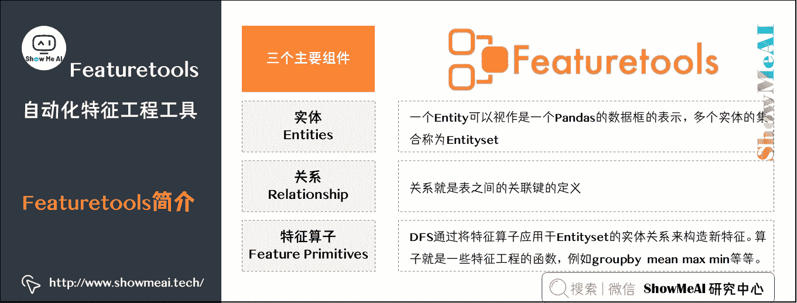

**实体**(**Entities**)

*   一个 Entity 可以视作是一个 Pandas 的数据框的表示，多个实体的集合称为 Entityset。

**关系**(**relationship**)

*   关系就是表之间的关联键的定义。

**特征算子**(**Feature primitives**)

*   DFS 通过将特征算子应用于 Entityset 的实体关系来构造新特征。算子就是一些特征工程的函数，例如 groupby、mean、max、min 等等。

Featuretools 实际上就是提供了一个框架让我们可以方便快速的通过简约的代码来实现单表的转换操作和多表的跨表连接操作，下面我们借助于 BigMart Sales 数据集实践问题中来具体讲解 Featuretools 工具。

# 6.Featuretools 实践

这里的案例场景 BigMart Sales 要解决的是电商领域的销量预估问题，我们希望构建模型来估算特定门店中每种商品的销售额，这将有助于 BigMart 的决策者找出每一个产品或门店的重要属性，这对提高整体销售起着关键性作用。请注意，在给定的数据集中，有跨 10 个门店的 1559 种商品。

> 数据集如下：
> 链接：https://pan.baidu.com/s/1qjJZjY56MnHBvmUQEMjq9g
> 提取码：show

下表给出了数据字段说明：

| 变量 | 描述 |
| :-- | :-- |
| Item_Identifier | 商品编号 |
| Item_Weight | 商品重量 |
| Item_Fat_Content | 是否是低脂商品 |
| Item_Visibility | 该商品展示区域占门店中所有商品展示区域的比例 |
| Item_Type | 商品所属分类 |
| Item_MRP | 商品最高售价 |
| Outlet_Identifier | 门店编号 |
| Outlet_Establishment_Year | 门店建立年份 |
| Outlet_Size | 门店占地面积 |
| Outlet_Location_Type | 门店所在城市类型 |
| Outlet_Type | 门店类型(杂货店或超市) |
| Item_Outlet_Sales | 门店商品销售额 (即需要预测的输出变量) |

## 6.1 Featuretools 安装

大家可以在命令行使用 pip 轻松安装 Featuretools。

```py
pip install featuretools 
```

## 6.2 导入依赖工具库及数据

```py
import featuretools as ft
import numpy as np
import pandas as pd

train = pd.read_csv("Train.csv")
test = pd.read_csv("test.csv") 
```

## 6.3 数据准备

我们先从数据中提取出目标字段和特征字段，如下：

```py
# saving identifiers
test_Item_Identifier = test['Item_Identifier']
test_Outlet_Identifier = test['Outlet_Identifier']
sales = train['Item_Outlet_Sales']
train.drop(['Item_Outlet_Sales'], axis=1, inplace=True) 
```

接着，我们合并训练集和测试集，以完成统一而一致的数据处理变换。

```py
combi = train.append(test, ignore_index=True) 
```

我们查看一下数据集的缺失值情况。

```py
combi.isnull().sum() 
```

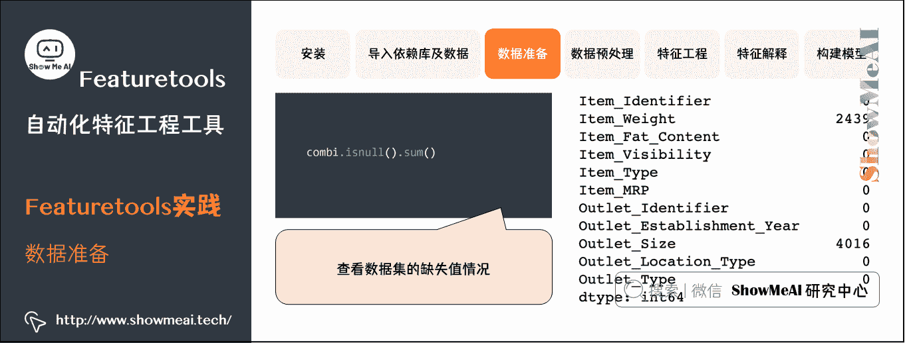

我们发现字段`Item_Weight`和`Outlet_size`中有非常多的缺失值，先做一个快速处理：

```py
# 缺失值处理
combi['Item_Weight'].fillna(combi['Item_Weight'].mean(), inplace = True)
combi['Outlet_Size'].fillna("missing", inplace = True) 
```

## 6.4 数据预处理

我们只做一点简单的数据预处理，这样后续可以更充分直观地展示 Featuretools 的功能。

```py
combi['Item_Fat_Content'].value_counts() 
```

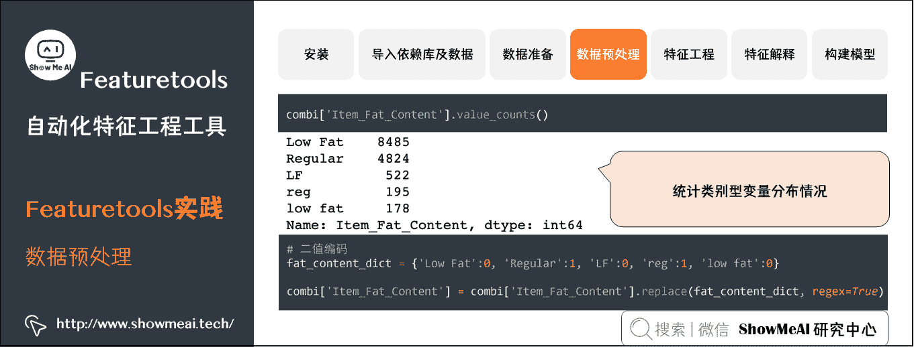

我们发现`Item_Fat_Content`只包含两个类别：「低脂肪」和「常规」(虽然在字段取值上有多种，但其只是格式差异)，这里我们对其进行二值化变换。

```py
# 二值编码
fat_content_dict = {'Low Fat':0, 'Regular':1, 'LF':0, 'reg':1, 'low fat':0}

combi['Item_Fat_Content'] = combi['Item_Fat_Content'].replace(fat_content_dict, regex=True) 
```

## 6.5 Featuretools 特征工程

下面我们使用 Featuretools 来实现自动化特征工程。首先我们将「商品」和「门店」信息组合，构建一个数据唯一 ID。

```py
combi['id'] = combi['Item_Identifier'] + combi['Outlet_Identifier']
combi.drop(['Item_Identifier'], axis=1, inplace=True) 
```

因为不再需要特征 Item_Identifier，我们把它删除了。我们保留了特征 Outlet_Identifier，稍后会使用到它。

接下来我们创建一个特征`EntitySet`，它是一种包含多个数据框及其之间关系的结构。

```py
# 构建实体集合 es
es = ft.EntitySet(id = 'sales')

# 添加 dataframe 数据 
es.add_dataframe(dataframe_name = 'bigmart', dataframe = combi, index = 'id') 
```

下面我们将使用深度特征综合(Deep Feature Synthesis)自动创建新特征。

```py
trans_primitives=['add_numeric', 'subtract_numeric', 'multiply_numeric', 'divide_numeric'] # 2 列相加减乘除来生成新特征
agg_primitives=['sum', 'median','mean']

feature_matrix, feature_names = ft.dfs(entityset=es, 
                                       target_dataframe_name = 'bigmart', 
                                       max_depth = 1, 
                                       verbose = 1,
                                       agg_primitives=agg_primitives,
                                       trans_primitives=trans_primitives,
                                       n_jobs = 8) 
```

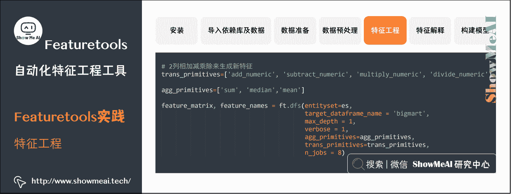

上述代码中：

*   `max_depth` 控制由叠加特征基元方式生成的特征的复杂性。
*   `agg_primitives` 是定义了一些统计聚合方式。
*   `trans_primitives` 定义了变换计算算子。
*   `n_jobs` 设定了多核并行特征计算的核数。

通过上述操作，Featuretools 就自行构造了许多新特征。

让我们来看看这些新构造的特征：

```py
feature_matrix.columns 
```

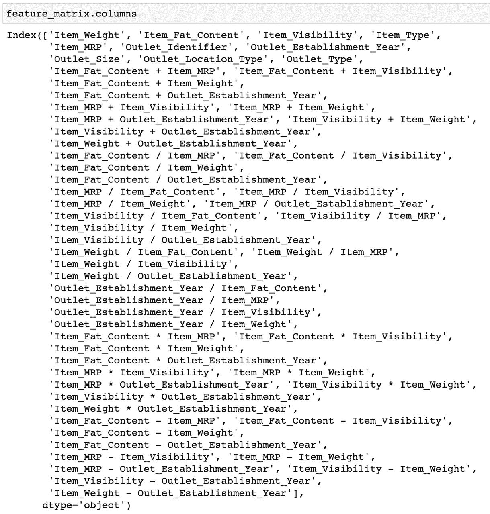

你会发现 DFS 快速构建出了非常多新特征。比我们手动操作构建特征要高效得多！

我们查看一下`feature_matrix`的前几行。

```py
feature_matrix.head() 
```

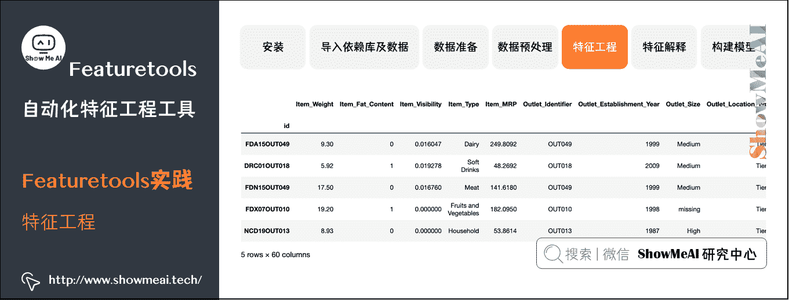

我们对这个 Dataframe 做一点小调整，我们根据 combi 数据框中的 id 变量对其进行排序。

```py
feature_matrix = feature_matrix.reindex(index=combi['id'])
feature_matrix = feature_matrix.reset_index() 
```

## 6.6 特征解释

我们还可以通过以下代码来对其构建出来的特征做解释，比如我们要解释第 20 个特征是如何得到的。

```py
ft.graph_feature(feature_names[20]) 
```

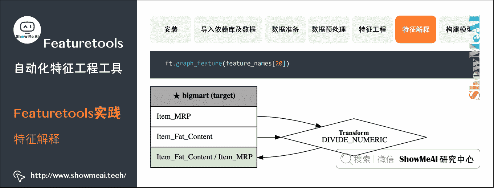

## 6.7 构建模型

下面我们就可以用构建出来的特征来建模啦，预测 Item_Outlet_Sales。由于最终的数据(feature_matrix)里具有许多类别特征，我们这里使用 LightGBM 模型。它可以直接使用类别特征，并且本质上是可扩展的。

你可以阅读[ShowMeAI](http://www.showmeai.tech/)的文章 [**图解机器学习 | LightGBM 模型详解**](http://www.showmeai.tech/article-detail/195) 和 [**LightGBM 建模应用详解**](http://www.showmeai.tech/article-detail/205) 了解 LightGBM 模型的原理和应用方法。

```py
import lightgbm as lgb
import pandas as pd 
```

CatBoost 要求所有类别变量都采用字符串格式。因此，我们首先将数据中的类别变量转换为字符串：

```py
categorical_features = np.where(feature_matrix.dtypes == 'object')[0]

for i in categorical_features:
    feature_matrix.iloc[:,i] = feature_matrix.iloc[:,i].astype('str') 
```

然后重新把 feature_matrix 拆回训练集和测试集。

```py
feature_matrix.drop(['id'], axis=1, inplace=True)
train = feature_matrix[:8523]
test = feature_matrix[8523:] 
```

```py
# removing uneccesary variables
train.drop(['Outlet_Identifier'], axis=1, inplace=True)
test.drop(['Outlet_Identifier'], axis=1, inplace=True) 
```

将训练集拆成训练和验证两部分，以便在本地测试算法的性能。

```py
from sklearn.model_selection import train_test_split

# splitting train data into training and validation set
xtrain, xvalid, ytrain, yvalid = train_test_split(train, sales, test_size=0.25, random_state=11) 
```

最后，训练模型。采用 RMSE(Root Mean Squared Error，均方根误差) 作为衡量指标。

```py
# 初始化 LGBMRegressor 回归器
model_lgb = lgb.LGBMRegressor(iterations=5000, learning_rate=0.05, depth=6, eval_metric='RMSE', random_seed=7)
# 训练模型
model_lgb.fit(xtrain, ytrain, eval_set=[(xvalid, yvalid)], early_stopping_rounds=1000) 
```

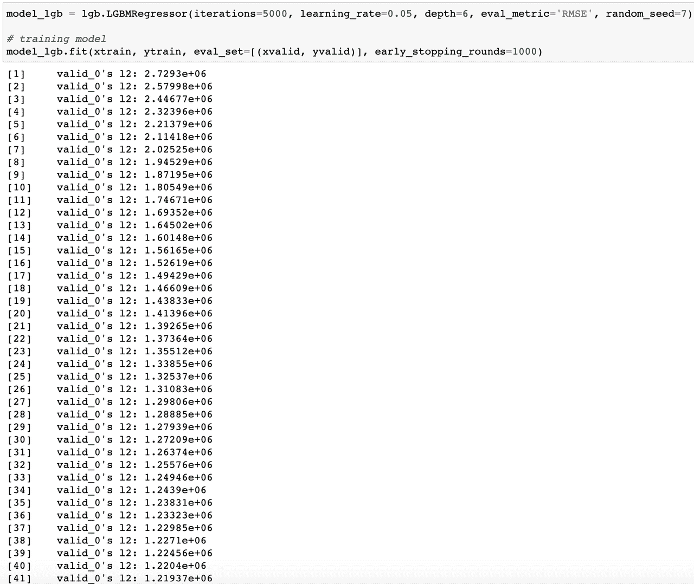

```py
from sklearn.metrics import mean_squared_error
np.sqrt(mean_squared_error(model_lgb.predict(xvalid), yvalid)) 
```

验证数据集的 RMSE 得分是  。

在没有任何特征工程的情况下，验证集的得分为  。 因此，Featuretools 构造的特征不仅仅是随机特征，而且还非常有价值的。最重要的是，它使特征工程节省了大量时间。

## 参考资料

*   [图解机器学习算法 | 从入门到精通系列](http://www.showmeai.tech/tutorials/34)
*   [图解机器学习 | LightGBM 模型详解](http://www.showmeai.tech/article-detail/195)
*   [LightGBM 建模应用详解](http://www.showmeai.tech/article-detail/205)
*   [机器学习特征工程最全解读](http://www.showmeai.tech/article-detail/208)

# [ShowMeAI](http://www.showmeai.tech/)系列教程推荐

*   [图解 Python 编程：从入门到精通系列教程](http://www.showmeai.tech/tutorials/56)
*   [图解数据分析：从入门到精通系列教程](http://www.showmeai.tech/tutorials/33)
*   [图解 AI 数学基础：从入门到精通系列教程](http://www.showmeai.tech/tutorials/83)
*   [图解大数据技术：从入门到精通系列教程](http://www.showmeai.tech/tutorials/84)
*   [图解机器学习算法：从入门到精通系列教程](http://www.showmeai.tech/tutorials/34)
*   [机器学习实战：手把手教你玩转机器学习系列](http://www.showmeai.tech/tutorials/41)

# 相关文章推荐

*   [Python 机器学习算法应用实践](http://www.showmeai.tech/article-detail/201)
*   [SKLearn 入门与简单应用案例](http://www.showmeai.tech/article-detail/202)
*   [SKLearn 最全应用指南](http://www.showmeai.tech/article-detail/203)
*   [XGBoost 建模应用详解](http://www.showmeai.tech/article-detail/204)
*   [LightGBM 建模应用详解](http://www.showmeai.tech/article-detail/205)
*   [Python 机器学习综合项目-电商销量预估](http://www.showmeai.tech/article-detail/206)
*   [Python 机器学习综合项目-电商销量预估<进阶方案>](http://www.showmeai.tech/article-detail/207)
*   [机器学习特征工程最全解读](http://www.showmeai.tech/article-detail/208)
*   [自动化特征工程工具 Featuretools 应用](http://www.showmeai.tech/article-detail/209)
*   [AutoML 自动化机器学习建模](http://www.showmeai.tech/article-detail/210)