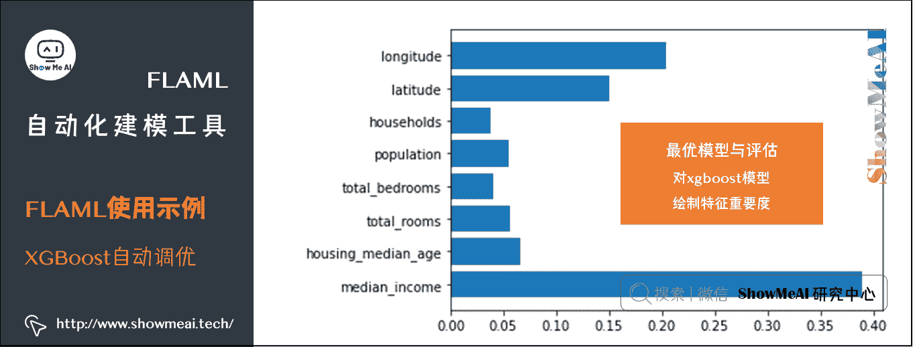

# 机器学习实战 | AutoML 自动化机器学习建模

> 原文：[`blog.csdn.net/ShowMeAI/article/details/123650630`](https://blog.csdn.net/ShowMeAI/article/details/123650630)


作者：[韩信子](https://github.com/HanXinzi-AI)@[ShowMeAI](http://www.showmeai.tech/)
[教程地址](http://www.showmeai.tech/tutorials/41)：[`www.showmeai.tech/tutorials/41`](http://www.showmeai.tech/tutorials/41)
[本文地址](http://www.showmeai.tech/article-detail/210)：[`www.showmeai.tech/article-detail/210`](http://www.showmeai.tech/article-detail/210)
声明：版权所有，转载请联系平台与作者并注明出处
**收藏[ShowMeAI](http://www.showmeai.tech/)查看更多精彩内容**

# 1.AutoML 与自动化机器学习

在前序系列文章中大家跟着[ShowMeAI](http://www.showmeai.tech/)一起学习了如何构建机器学习应用。我们构建一个机器学习模型解决方案 baseline 很容易，但模型选择和泛化性能优化是一项艰巨的任务。选择合适的模型并是一个需要高计算成本、时间和精力的过程。

针对上述问题就提出了**AutoML**，AutoML(Automated machine learning)是自动化构建端到端机器学习流程，解决实际场景问题的过程。


在本篇内容中我们将介绍到微软开发的高效轻量级自动化机器学习框架 FLAML(A Fast and Lightweight AutoML Library)。

# 2.FLAML 介绍

## 2.1 FLAML 特点

官方网站对 FLAML 的特点总结如下：

*   对于分类和回归等常见的机器学习任务，FLAML 可以在消耗尽量少的资源前提下，快速找到高质量模型。它支持经典机器学习模型和深度神经网络。
*   它很容易定制或扩展。用户可以有很灵活的调整与定制模式：
    *   最小定制(设定计算资源限制)
    *   中等定制(例如设定 scikit-learn 学习器、搜索空间和度量标准)
    *   完全定制(自定义训练和评估代码)。
*   它支持快速且低消耗的自动调优，能够处理大型搜索空间。 FLAML 由 Microsoft Research 发明的新的高效益超参数优化和学习器选择方法支撑。

## 2.2 安装方法

我们可以通过 pip 轻松安装上 FLAML

```py
pip install flaml 
```

有一些可选的安装选项，如下：

### (1) Notebook 示例支持

如果大家要跑官方的 [notebook 代码示例](https://github.com/microsoft/FLAML/tree/main/notebook)，安装时添加[notebook]选项:

```py
pip install flaml[notebook] 
```

### (2) 更多模型学习器支持

*   如果我们希望 flaml 支持 catboost 模型，安装时添加[catboost]选项

```py
pip install flaml[catboost] 
```

*   如果我们希望 flaml 支持 vowpal wabbit ，安装时添加[vw]选项

```py
pip install flaml[vw] 
```

*   如果我们希望 flaml 支持时间序列预估器 prophet 和 statsmodels，安装时可以添加[forecast]

```py
pip install flaml[forecast] 
```

### (3) 分布式调优支持

*   ray

```py
pip install flaml[ray] 
```

*   nni

```py
pip install flaml[nni] 
```

*   blendsearch

```py
pip install flaml[blendsearch] 
```

# 3.FLAML 使用示例

## 3.1 全自动模式

下面我们用一个场景数据案例(二分类)来演示 FLAML 工具库的全自动模式。(大家可以在 jupyter notebook 中运行下列的代码，关于 IDE 与环境配置大家可以参考[ShowMeAI](http://www.showmeai.tech/)文章 [**图解 python | 安装与环境设置**](http://www.showmeai.tech/article-detail/65))。

```py
!pip install flaml[notebook] 
```

### (1) 加载数据和预处理

我们从 OpenML 下载航空公司数据集 [**Airlines dataset**](https://www.openml.org/d/1169)。 这个数据集的建模任务是在给定预定起飞信息的情况下预测给定航班是否会延误。

```py
from flaml.data import load_openml_dataset
X_train, X_test, y_train, y_test = load_openml_dataset(dataset_id=1169, data_dir='./') 
```


从运行结果可以看到训练集测试集及标签的维度信息。

### (2) 运行 FLAML 全自动模式

下面我们直接运行 FLAML automl 全自动模式，实际在运行配置中，我们可以指定 任务类型、时间预算、误差度量、学习者列表、是否下采样、重采样策略类型等。 如果不作任何设定的话，所有这些参数都会使用默认值(例如，默认分类器是 [`lgbm`, `xgboost`, `xgb_limitdepth`, `catboost`, `rf`, `extra_tree`, `lrl1`])。

```py
# 导入工具库并初始化 AutoML 对象
from flaml import AutoML
automl = AutoML() 
```

```py
# 参数设定
settings = {
    "time_budget": 240,  # 总时间上限(单位秒)
    "metric": 'accuracy',  # 候选可以是: 'r2', 'rmse', 'mae', 'mse', 'accuracy', 'roc_auc', 'roc_auc_ovr', 'roc_auc_ovo', 'log_loss', 'mape', 'f1', 'ap', 'ndcg', 'micro_f1', 'macro_f1'
    "task": 'classification',  # 任务类型
    "log_file_name": 'airlines_experiment.log',  # flaml 日志文件
    "seed": 7654321,    # 随机种子
} 
```

```py
# 运行自动化机器学习
automl.fit(X_train=X_train, y_train=y_train, **settings) 
```


从上述运行结果可以看出，自动机器学习过程，对[`lgbm`, `xgboost`, `xgb_limitdepth`, `catboost`, `rf`, `extra_tree`, `lrl1`]这些候选模型进行了实验，并运行出了对应的结果。

### (3) 最优模型与评估结果


```py
print('Best ML leaner:', automl.best_estimator)
print('Best hyperparmeter config:', automl.best_config)
print('Best accuracy on validation data: {0:.4g}'.format(1-automl.best_loss))
print('Training duration of best run: {0:.4g} s'.format(automl.best_config_train_time)) 
```

运行结果如下

```py
Best ML leaner: lgbm
Best hyperparmeter config: {'n_estimators': 1071, 'num_leaves': 25, 'min_child_samples': 36, 'learning_rate': 0.10320258241974468, 'log_max_bin': 10, 'colsample_bytree': 1.0, 'reg_alpha': 0.0009765625, 'reg_lambda': 0.08547376339713011, 'FLAML_sample_size': 364083}
Best accuracy on validation data: 0.6696
Training duration of best run: 9.274 s 
```

可以通过运行完毕的 automl 对象属性，取出对应的「最优模型」、「最佳模型配置」、「评估准则结果」等信息。在这里最优的模型是 1071 颗树构建而成的一个 LightGBM 模型。

更进一步，我们可以通过下面的代码，取出最优模型，并用它对测试集进行预测。

```py
# 最佳模型
automl.model.estimator 
```

运行结果如下

```py
LGBMClassifier(learning_rate=0.10320258241974468, max_bin=1023,
               min_child_samples=36, n_estimators=1071, num_leaves=25,
               reg_alpha=0.0009765625, reg_lambda=0.08547376339713011,
               verbose=-1) 
```

### (4) 模型存储与加载

```py
# 模型存储与持久化
import pickle
with open('automl.pkl', 'wb') as f:
    pickle.dump(automl, f, pickle.HIGHEST_PROTOCOL)

# 模型加载
with open('automl.pkl', 'rb') as f:
    automl = pickle.load(f) 
```

```py
# 对测试集进行预估
y_pred = automl.predict(X_test)
print('Predicted labels', y_pred)
print('True labels', y_test)
y_pred_proba = automl.predict_proba(X_test)[:,1] 
```

运行结果如下：

```py
Predicted labels ['1' '0' '1' ... '1' '0' '0']
True labels 118331    0
328182    0
335454    0
520591    1
344651    0
         ..
367080    0
203510    1
254894    0
296512    1
362444    0
Name: Delay, Length: 134846, dtype: category
Categories (2, object): ['0' < '1'] 
```

可以看到，automl 得到的最佳模型，对测试集预估的方式，和自己建模得到的模型是一样的。

```py
# 测试集效果评估
from flaml.ml import sklearn_metric_loss_score
print('accuracy', '=', 1 - sklearn_metric_loss_score('accuracy', y_pred, y_test))
print('roc_auc', '=', 1 - sklearn_metric_loss_score('roc_auc', y_pred_proba, y_test))
print('log_loss', '=', sklearn_metric_loss_score('log_loss', y_pred_proba, y_test)) 
```

评估结果如下：

```py
accuracy = 0.6720332824110467
roc_auc = 0.7253276908529442
log_loss = 0.6034449031876942 
```

### (5) 查看日志历史详情

我们可以通过如下代码，查看 automl 对各个模型实验的结果详细数据。

```py
from flaml.data import get_output_from_log
time_history, best_valid_loss_history, valid_loss_history, config_history, metric_history = \
    get_output_from_log(filename=settings['log_file_name'], time_budget=240)
for config in config_history:
    print(config) 
```

结果如下

```py
{'Current Learner': 'lgbm', 'Current Sample': 10000, 'Current Hyper-parameters': {'n_estimators': 4, 'num_leaves': 4, 'min_child_samples': 20, 'learning_rate': 0.09999999999999995, 'log_max_bin': 8, 'colsample_bytree': 1.0, 'reg_alpha': 0.0009765625, 'reg_lambda': 1.0, 'FLAML_sample_size': 10000}, 'Best Learner': 'lgbm', 'Best Hyper-parameters': {'n_estimators': 4, 'num_leaves': 4, 'min_child_samples': 20, 'learning_rate': 0.09999999999999995, 'log_max_bin': 8, 'colsample_bytree': 1.0, 'reg_alpha': 0.0009765625, 'reg_lambda': 1.0, 'FLAML_sample_size': 10000}}
{'Current Learner': 'lgbm', 'Current Sample': 10000, 'Current Hyper-parameters': {'n_estimators': 4, 'num_leaves': 14, 'min_child_samples': 15, 'learning_rate': 0.22841390623808822, 'log_max_bin': 9, 'colsample_bytree': 1.0, 'reg_alpha': 0.0014700173967242716, 'reg_lambda': 7.624911621832711, 'FLAML_sample_size': 10000}, 'Best Learner': 'lgbm', 'Best Hyper-parameters': {'n_estimators': 4, 'num_leaves': 14, 'min_child_samples': 15, 'learning_rate': 0.22841390623808822, 'log_max_bin': 9, 'colsample_bytree': 1.0, 'reg_alpha': 0.0014700173967242716, 'reg_lambda': 7.624911621832711, 'FLAML_sample_size': 10000}}
{'Current Learner': 'lgbm', 'Current Sample': 10000, 'Current Hyper-parameters': {'n_estimators': 4, 'num_leaves': 25, 'min_child_samples': 12, 'learning_rate': 0.5082200481556802, 'log_max_bin': 8, 'colsample_bytree': 0.9696263001275751, 'reg_alpha': 0.0028107036379524425, 'reg_lambda': 3.716898117989413, 'FLAML_sample_size': 10000}, 'Best Learner': 'lgbm', 'Best Hyper-parameters': {'n_estimators': 4, 'num_leaves': 25, 'min_child_samples': 12, 'learning_rate': 0.5082200481556802, 'log_max_bin': 8, 'colsample_bytree': 0.9696263001275751, 'reg_alpha': 0.0028107036379524425, 'reg_lambda': 3.716898117989413, 'FLAML_sample_size': 10000}}
{'Current Learner': 'lgbm', 'Current Sample': 10000, 'Current Hyper-parameters': {'n_estimators': 23, 'num_leaves': 14, 'min_child_samples': 15, 'learning_rate': 0.22841390623808822, 'log_max_bin': 9, 'colsample_bytree': 1.0, 'reg_alpha': 0.0014700173967242718, 'reg_lambda': 7.624911621832699, 'FLAML_sample_size': 10000}, 'Best Learner': 'lgbm', 'Best Hyper-parameters': {'n_estimators': 23, 'num_leaves': 14, 'min_child_samples': 15, 'learning_rate': 0.22841390623808822, 'log_max_bin': 9, 'colsample_bytree': 1.0, 'reg_alpha': 0.0014700173967242718, 'reg_lambda': 7.624911621832699, 'FLAML_sample_size': 10000}}
{'Current Learner': 'lgbm', 'Current Sample': 10000, 'Current Hyper-parameters': {'n_estimators': 101, 'num_leaves': 12, 'min_child_samples': 24, 'learning_rate': 0.07647794276357095, 'log_max_bin': 10, 'colsample_bytree': 1.0, 'reg_alpha': 0.001749539645587163, 'reg_lambda': 4.373760956394571, 'FLAML_sample_size': 10000}, 'Best Learner': 'lgbm', 'Best Hyper-parameters': {'n_estimators': 101, 'num_leaves': 12, 'min_child_samples': 24, 'learning_rate': 0.07647794276357095, 'log_max_bin': 10, 'colsample_bytree': 1.0, 'reg_alpha': 0.001749539645587163, 'reg_lambda': 4.373760956394571, 'FLAML_sample_size': 10000}}
{'Current Learner': 'lgbm', 'Current Sample': 40000, 'Current Hyper-parameters': {'n_estimators': 101, 'num_leaves': 12, 'min_child_samples': 24, 'learning_rate': 0.07647794276357095, 'log_max_bin': 10, 'colsample_bytree': 1.0, 'reg_alpha': 0.001749539645587163, 'reg_lambda': 4.373760956394571, 'FLAML_sample_size': 40000}, 'Best Learner': 'lgbm', 'Best Hyper-parameters': {'n_estimators': 101, 'num_leaves': 12, 'min_child_samples': 24, 'learning_rate': 0.07647794276357095, 'log_max_bin': 10, 'colsample_bytree': 1.0, 'reg_alpha': 0.001749539645587163, 'reg_lambda': 4.373760956394571, 'FLAML_sample_size': 40000}}
{'Current Learner': 'lgbm', 'Current Sample': 40000, 'Current Hyper-parameters': {'n_estimators': 361, 'num_leaves': 11, 'min_child_samples': 32, 'learning_rate': 0.13528717598813866, 'log_max_bin': 9, 'colsample_bytree': 0.9851977789068981, 'reg_alpha': 0.0038372002422749616, 'reg_lambda': 0.25113531892556773, 'FLAML_sample_size': 40000}, 'Best Learner': 'lgbm', 'Best Hyper-parameters': {'n_estimators': 361, 'num_leaves': 11, 'min_child_samples': 32, 'learning_rate': 0.13528717598813866, 'log_max_bin': 9, 'colsample_bytree': 0.9851977789068981, 'reg_alpha': 0.0038372002422749616, 'reg_lambda': 0.25113531892556773, 'FLAML_sample_size': 40000}}
{'Current Learner': 'lgbm', 'Current Sample': 364083, 'Current Hyper-parameters': {'n_estimators': 361, 'num_leaves': 11, 'min_child_samples': 32, 'learning_rate': 0.13528717598813866, 'log_max_bin': 9, 'colsample_bytree': 0.9851977789068981, 'reg_alpha': 0.0038372002422749616, 'reg_lambda': 0.25113531892556773, 'FLAML_sample_size': 364083}, 'Best Learner': 'lgbm', 'Best Hyper-parameters': {'n_estimators': 361, 'num_leaves': 11, 'min_child_samples': 32, 'learning_rate': 0.13528717598813866, 'log_max_bin': 9, 'colsample_bytree': 0.9851977789068981, 'reg_alpha': 0.0038372002422749616, 'reg_lambda': 0.25113531892556773, 'FLAML_sample_size': 364083}}
{'Current Learner': 'lgbm', 'Current Sample': 364083, 'Current Hyper-parameters': {'n_estimators': 547, 'num_leaves': 46, 'min_child_samples': 60, 'learning_rate': 0.281323306091088, 'log_max_bin': 10, 'colsample_bytree': 1.0, 'reg_alpha': 0.001643352694266288, 'reg_lambda': 0.14719738747481906, 'FLAML_sample_size': 364083}, 'Best Learner': 'lgbm', 'Best Hyper-parameters': {'n_estimators': 547, 'num_leaves': 46, 'min_child_samples': 60, 'learning_rate': 0.281323306091088, 'log_max_bin': 10, 'colsample_bytree': 1.0, 'reg_alpha': 0.001643352694266288, 'reg_lambda': 0.14719738747481906, 'FLAML_sample_size': 364083}}
{'Current Learner': 'lgbm', 'Current Sample': 364083, 'Current Hyper-parameters': {'n_estimators': 1071, 'num_leaves': 25, 'min_child_samples': 36, 'learning_rate': 0.10320258241974468, 'log_max_bin': 10, 'colsample_bytree': 1.0, 'reg_alpha': 0.0009765625, 'reg_lambda': 0.08547376339713011, 'FLAML_sample_size': 364083}, 'Best Learner': 'lgbm', 'Best Hyper-parameters': {'n_estimators': 1071, 'num_leaves': 25, 'min_child_samples': 36, 'learning_rate': 0.10320258241974468, 'log_max_bin': 10, 'colsample_bytree': 1.0, 'reg_alpha': 0.0009765625, 'reg_lambda': 0.08547376339713011, 'FLAML_sample_size': 364083}} 
```

我们可以绘制出验证集的学习曲线，如下：

```py
import matplotlib.pyplot as plt
import numpy as np
plt.title('Learning Curve')
plt.xlabel('Wall Clock Time (s)')
plt.ylabel('Validation Accuracy')
plt.scatter(time_history, 1 - np.array(valid_loss_history))
plt.step(time_history, 1 - np.array(best_valid_loss_history), where='post')
plt.show() 
```


### (6) 对比默认 XGBoost/LightGBM 实验结果

我们来对比一下全部使用默认参数的 XGBoost 模型在本数据集上的效果，代码如下

```py
from xgboost import XGBClassifier
from lightgbm import LGBMClassifier

# 训练拟合
xgb = XGBClassifier()
cat_columns = X_train.select_dtypes(include=['category']).columns
X = X_train.copy()
X[cat_columns] = X[cat_columns].apply(lambda x: x.cat.codes)
xgb.fit(X, y_train)

lgbm = LGBMClassifier()
lgbm.fit(X_train, y_train)

# 测试集预估
X = X_test.copy()
X[cat_columns] = X[cat_columns].apply(lambda x: x.cat.codes)
y_pred_xgb = xgb.predict(X)

y_pred_lgbm = lgbm.predict(X_test)

# 评估效果
print('默认参数 xgboost accuracy', '=', 1 - sklearn_metric_loss_score('accuracy', y_pred_xgb, y_test))
print('默认参数 lgbm accuracy', '=', 1 - sklearn_metric_loss_score('accuracy', y_pred_lgbm, y_test))
print('flaml (4min) accuracy', '=', 1 - sklearn_metric_loss_score('accuracy', y_pred, y_test)) 
```

最终结果如下：

```py
默认参数 xgboost accuracy = 0.6676060098186078
默认参数 lgbm accuracy = 0.6602346380315323
flaml (4min) accuracy = 0.6720332824110467 
```

从对比结果中可以看出，flaml 自动机器学习调优的最佳模型，效果优于默认参数的 XGBoost 和 LightGBM 建模结果。

## 3.2 自定义学习器

除了完全自动化模式使用 FLAML 工具库，我们还可以对它的一些组件进行自定义，实现自定义调优。比如我们可以对「模型」「参数搜索空间」「候选学习器」「模型优化指标」等进行设置。

### (1) 自定义模型

正则化贪心森林 (RGF) 是一种机器学习方法，目前未包含在 FLAML 中。 RGF 有许多调整参数，其中最关键的是：[`max_leaf`, `n_iter`, `n_tree_search`, `opt_interval`, `min_samples_leaf`]。 要运行自定义/新学习器，用户需要提供以下信息：

*   自定义/新学习器的实现
*   超参数名称和类型的列表
*   超参数的粗略范围(即上限/下限)

在下面的示例代码中，RGF 信息被包装在一个名为 MyRegularizedGreedyForest 的 python 类中。

```py
from flaml.model import SKLearnEstimator
from flaml import tune
from flaml.data import CLASSIFICATION

class MyRegularizedGreedyForest(SKLearnEstimator):
    def __init__(self, task='binary', **config):
        '''Constructor

        Args:
            task: A string of the task type, one of
                'binary', 'multi', 'regression'
            config: A dictionary containing the hyperparameter names
                and 'n_jobs' as keys. n_jobs is the number of parallel threads.
        '''

        super().__init__(task, **config)

        '''task=binary or multi for classification task'''
        if task in CLASSIFICATION:
            from rgf.sklearn import RGFClassifier

            self.estimator_class = RGFClassifier
        else:
            from rgf.sklearn import RGFRegressor

            self.estimator_class = RGFRegressor

    @classmethod
    def search_space(cls, data_size, task):
        '''[required method] search space
        Returns:
            A dictionary of the search space. 
            Each key is the name of a hyperparameter, and value is a dict with
                its domain (required) and low_cost_init_value, init_value,
                cat_hp_cost (if applicable).
                e.g.,
                {'domain': tune.randint(lower=1, upper=10), 'init_value': 1}.
        '''
        space = {        
            'max_leaf': {'domain': tune.lograndint(lower=4, upper=data_size[0]), 'init_value': 4, 'low_cost_init_value': 4},
            'n_iter': {'domain': tune.lograndint(lower=1, upper=data_size[0]), 'init_value': 1, 'low_cost_init_value': 1},
            'n_tree_search': {'domain': tune.lograndint(lower=1, upper=32768), 'init_value': 1, 'low_cost_init_value': 1},
            'opt_interval': {'domain': tune.lograndint(lower=1, upper=10000), 'init_value': 100},
            'learning_rate': {'domain': tune.loguniform(lower=0.01, upper=20.0)},
            'min_samples_leaf': {'domain': tune.lograndint(lower=1, upper=20), 'init_value': 20},
        }
        return space

    @classmethod
    def size(cls, config):
        '''[optional method] memory size of the estimator in bytes

        Args:
            config - the dict of the hyperparameter config
        Returns:
            A float of the memory size required by the estimator to train the
            given config
        '''
        max_leaves = int(round(config['max_leaf']))
        n_estimators = int(round(config['n_iter']))
        return (max_leaves * 3 + (max_leaves - 1) * 4 + 1.0) * n_estimators * 8

    @classmethod
    def cost_relative2lgbm(cls):
        '''[optional method] relative cost compared to lightgbm
        '''
        return 1.0 
```

### (2) 运行 FLAML 自定义模型 automl

将 RGF 添加到学习器列表后，我们通过调整 RGF 的超参数以及默认学习器来运行 automl。

```py
automl = AutoML()
automl.add_learner(learner_name='RGF', learner_class=MyRegularizedGreedyForest) 
```

```py
# 添加配置
settings = {
    "time_budget": 10,  # total running time in seconds
    "metric": 'accuracy', 
    "estimator_list": ['RGF', 'lgbm', 'rf', 'xgboost'],  # list of ML learners
    "task": 'classification',  # task type 
    "log_file_name": 'airlines_experiment_custom_learner.log',  # flaml log file 
    "log_training_metric": True,  # whether to log training metric
}
automl.fit(X_train = X_train, y_train = y_train, **settings) 
```

### (3) 自定义优化指标

我们可以为模型自定义优化指标。 下面的示例代码中，我们合并训练损失和验证损失作为自定义优化指标，并对其进行优化，希望损失最小化。

```py
def custom_metric(X_val, y_val, estimator, labels, X_train, y_train,
                  weight_val=None, weight_train=None, config=None,
                  groups_val=None, groups_train=None):
    from sklearn.metrics import log_loss
    import time
    start = time.time()
    y_pred = estimator.predict_proba(X_val)
    pred_time = (time.time() - start) / len(X_val)
    val_loss = log_loss(y_val, y_pred, labels=labels,
                         sample_weight=weight_val)
    y_pred = estimator.predict_proba(X_train)
    train_loss = log_loss(y_train, y_pred, labels=labels,
                          sample_weight=weight_train)
    alpha = 0.5
    return val_loss * (1 + alpha) - alpha * train_loss, {
        "val_loss": val_loss, "train_loss": train_loss, "pred_time": pred_time
    }
    # two elements are returned:
    # the first element is the metric to minimize as a float number,
    # the second element is a dictionary of the metrics to log 
```

```py
automl = AutoML()
settings = {
    "time_budget": 10,  # total running time in seconds
    "metric": custom_metric,  # pass the custom metric funtion here
    "task": 'classification',  # task type
    "log_file_name": 'airlines_experiment_custom_metric.log',  # flaml log file
}
automl.fit(X_train = X_train, y_train = y_train, **settings) 
```

## 3.3 sklearn 流水线调优

FLAML 可以配合 sklearn pipeline 进行模型自动化调优，我们这里依旧以航空公司数据集 [Airlines dataset](https://www.openml.org/d/1169) 案例为场景，对其用法做一个讲解。

### (1) 加载数据集

```py
# 数据集准备
from flaml.data import load_openml_dataset
X_train, X_test, y_train, y_test = load_openml_dataset(
    dataset_id=1169, data_dir='./', random_state=1234, dataset_format='array') 
```

### (2) 构建建模流水线

```py
import sklearn
from sklearn import set_config
from sklearn.pipeline import Pipeline
from sklearn.impute import SimpleImputer
from sklearn.preprocessing import StandardScaler
from flaml import AutoML
set_config(display='diagram')
imputer = SimpleImputer()
standardizer = StandardScaler()
automl = AutoML()
automl_pipeline = Pipeline([
    ("imputuer",imputer),
    ("standardizer", standardizer),
    ("automl", automl)
])
automl_pipeline 
```

输出结果如下

```py
Pipeline(steps=[('imputuer', SimpleImputer()),
                ('standardizer', StandardScaler()),
                ('automl', )])
SimpleImputerSimpleImputer()
StandardScalerStandardScaler()
AutoML 
```

### (3) 参数设定与 automl 拟合

```py
# 设定
settings = {
    "time_budget": 60,  # 总时长约束
    "metric": 'accuracy',  # 可选: ['accuracy','roc_auc', 'roc_auc_ovr', 'roc_auc_ovo', 'f1','log_loss','mae','mse','r2']
    "task": 'classification',  # 任务类型
    "estimator_list":['xgboost','catboost','lgbm'],
    "log_file_name": 'airlines_experiment.log',  # flaml 日志文件
}

# 拟合
automl_pipeline.fit(X_train, y_train, 
                        automl__time_budget=settings['time_budget'],
                        automl__metric=settings['metric'],
                        automl__estimator_list=settings['estimator_list'],
                        automl__log_training_metric=True) 
```

### (4) 取出最优模型

```py
# Get the automl object from the pipeline
automl = automl_pipeline.steps[2][1]
# Get the best config and best learner
print('Best ML leaner:', automl.best_estimator)
print('Best hyperparmeter config:', automl.best_config)
print('Best accuracy on validation data: {0:.4g}'.format(1-automl.best_loss))
print('Training duration of best run: {0:.4g} s'.format(automl.best_config_train_time))
automl.model 
```

运行结果如下：

```py
Best ML leaner: xgboost
Best hyperparmeter config: {'n_estimators': 63, 'max_leaves': 1797, 'min_child_weight': 0.07275175679381725, 'learning_rate': 0.06234183309508761, 'subsample': 0.9814772488195874, 'colsample_bylevel': 0.810466508891351, 'colsample_bytree': 0.8005378817953572, 'reg_alpha': 0.5768305704485758, 'reg_lambda': 6.867180836557797, 'FLAML_sample_size': 364083}
Best accuracy on validation data: 0.6721
Training duration of best run: 15.45 s
<flaml.model.XGBoostSklearnEstimator at 0x7f03a5eada00> 
```

### (5) 测试集评估与模型存储

```py
import pickle
with open('automl.pkl', 'wb') as f:
    pickle.dump(automl, f, pickle.HIGHEST_PROTOCOL) 
```

```py
# 测试集预估与效果评估
y_pred = automl_pipeline.predict(X_test)
print('Predicted labels', y_pred)
print('True labels', y_test)
y_pred_proba = automl_pipeline.predict_proba(X_test)[:,1]
print('Predicted probas ',y_pred_proba[:5]) 
```

运行结果如下

```py
Predicted labels [0 1 1 ... 0 1 0]
True labels [0 0 0 ... 1 0 1]
Predicted probas  [0.3764987  0.6126277  0.699604   0.27359942 0.25294745] 
```

## 3.4 XGBoost 自动调优

这里我们简单给大家讲一下如何使用 FLAML 调优最常见的模型之一 XGBoost。

### (1) 工具库导入与基本设定

```py
# 导入工具库
from flaml import AutoML
automl = AutoML() 
```

```py
# 参数设定
settings = {
    "time_budget": 120,  # total running time in seconds
    "metric": 'r2',  # primary metrics for regression can be chosen from: ['mae','mse','r2','rmse','mape']
    "estimator_list": ['xgboost'],  # list of ML learners; we tune xgboost in this example
    "task": 'regression',  # task type 
    "log_file_name": 'houses_experiment.log',  # flaml log file
} 
```

### (2) 自动化机器学习拟合

```py
automl.fit(X_train=X_train, y_train=y_train, **settings) 
```

### (3) 最优模型与评估

我们可以输出最优模型配置及详细信息

```py
# 最优模型
print('Best hyperparmeter config:', automl.best_config)
print('Best r2 on validation data: {0:.4g}'.format(1 - automl.best_loss))
print('Training duration of best run: {0:.4g} s'.format(automl.best_config_train_time)) 
```

运行结果：

```py
Best hyperparmeter config: {'n_estimators': 776, 'max_leaves': 160, 'min_child_weight': 32.57408640781376, 'learning_rate': 0.034786853332414935, 'subsample': 0.9152991332236934, 'colsample_bylevel': 0.5656764254642628, 'colsample_bytree': 0.7313266091895249, 'reg_alpha': 0.005771390107656191, 'reg_lambda': 1.49126672786588}
Best r2 on validation data: 0.834
Training duration of best run: 9.471 s 
```

我们可以取出最优模型

```py
automl.model.estimator 
```

结果如下：

```py
XGBRegressor(base_score=0.5, booster='gbtree',
             colsample_bylevel=0.5656764254642628, colsample_bynode=1,
             colsample_bytree=0.7313266091895249, gamma=0, gpu_id=-1,
             grow_policy='lossguide', importance_type='gain',
             interaction_constraints='', learning_rate=0.034786853332414935,
             max_delta_step=0, max_depth=0, max_leaves=160,
             min_child_weight=32.57408640781376, missing=nan,
             monotone_constraints='()', n_estimators=776, n_jobs=-1,
             num_parallel_tree=1, random_state=0,
             reg_alpha=0.005771390107656191, reg_lambda=1.49126672786588,
             scale_pos_weight=1, subsample=0.9152991332236934,
             tree_method='hist', use_label_encoder=False, validate_parameters=1,
             verbosity=0) 
```

同样可以对 XGBoost 模型绘制特征重要度

```py
import matplotlib.pyplot as plt
plt.barh(X_train.columns, automl.model.estimator.feature_importances_) 
```



### (4) 模型存储

```py
import pickle
with open('automl.pkl', 'wb') as f:
    pickle.dump(automl, f, pickle.HIGHEST_PROTOCOL) 
```

### (5) 测试集预估及模型评估

```py
# 测试集预估
y_pred = automl.predict(X_test)
print('Predicted labels', y_pred)
print('True labels', y_test)

# 测试集评估
from flaml.ml import sklearn_metric_loss_score
print('r2', '=', 1 - sklearn_metric_loss_score('r2', y_pred, y_test))
print('mse', '=', sklearn_metric_loss_score('mse', y_pred, y_test))
print('mae', '=', sklearn_metric_loss_score('mae', y_pred, y_test)) 
```

## 3.5 LightGBM 自动调优

LightGBM 调优的过程和 XGBoost 非常类似，仅仅在参数配置的部分指定模型需要做一点调整，其他部分是一致的，如下：

```py
# 导入工具库
from flaml import AutoML
automl = AutoML()

# 参数配置
settings = {
    "time_budget": 240,  # total running time in seconds
    "metric": 'r2',  # primary metrics for regression can be chosen from: ['mae','mse','r2','rmse','mape']
    "estimator_list": ['lgbm'],  # list of ML learners; we tune lightgbm in this example
    "task": 'regression',  # task type 
    "log_file_name": 'houses_experiment.log',  # flaml log file
    "seed": 7654321,    # random seed
}

# 自动化机器学习拟合调优
automl.fit(X_train=X_train, y_train=y_train, **settings) 
```

## 参考资料

*   [图解机器学习算法 | 从入门到精通系列](http://www.showmeai.tech/tutorials/34)
*   [Airlines dataset](https://www.openml.org/d/1169)
*   [notebook 代码示例](https://github.com/microsoft/FLAML/tree/main/notebook)

# [ShowMeAI](http://www.showmeai.tech/)系列教程推荐

*   [图解 Python 编程：从入门到精通系列教程](http://www.showmeai.tech/tutorials/56)
*   [图解数据分析：从入门到精通系列教程](http://www.showmeai.tech/tutorials/33)
*   [图解 AI 数学基础：从入门到精通系列教程](http://www.showmeai.tech/tutorials/83)
*   [图解大数据技术：从入门到精通系列教程](http://www.showmeai.tech/tutorials/84)
*   [图解机器学习算法：从入门到精通系列教程](http://www.showmeai.tech/tutorials/34)
*   [机器学习实战：手把手教你玩转机器学习系列](http://www.showmeai.tech/tutorials/41)

# 相关文章推荐

*   [Python 机器学习算法应用实践](http://www.showmeai.tech/article-detail/201)
*   [SKLearn 入门与简单应用案例](http://www.showmeai.tech/article-detail/202)
*   [SKLearn 最全应用指南](http://www.showmeai.tech/article-detail/203)
*   [XGBoost 建模应用详解](http://www.showmeai.tech/article-detail/204)
*   [LightGBM 建模应用详解](http://www.showmeai.tech/article-detail/205)
*   [Python 机器学习综合项目-电商销量预估](http://www.showmeai.tech/article-detail/206)
*   [Python 机器学习综合项目-电商销量预估<进阶方案>](http://www.showmeai.tech/article-detail/207)
*   [机器学习特征工程最全解读](http://www.showmeai.tech/article-detail/208)
*   [自动化特征工程工具 Featuretools 应用](http://www.showmeai.tech/article-detail/209)
*   [AutoML 自动化机器学习建模](http://www.showmeai.tech/article-detail/210)

